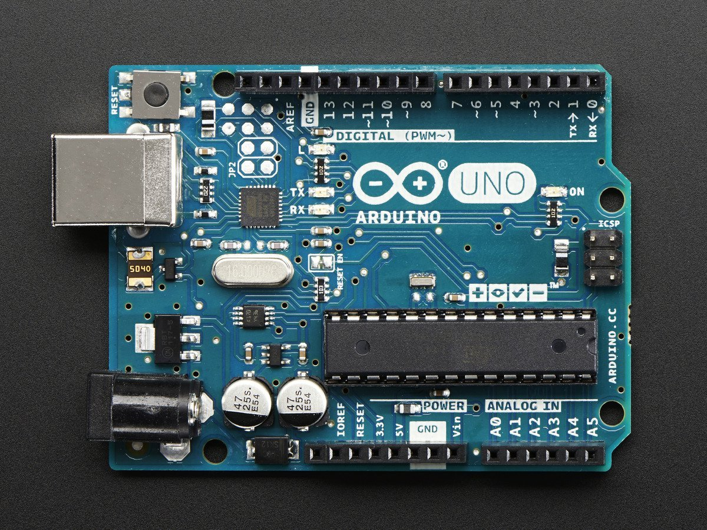
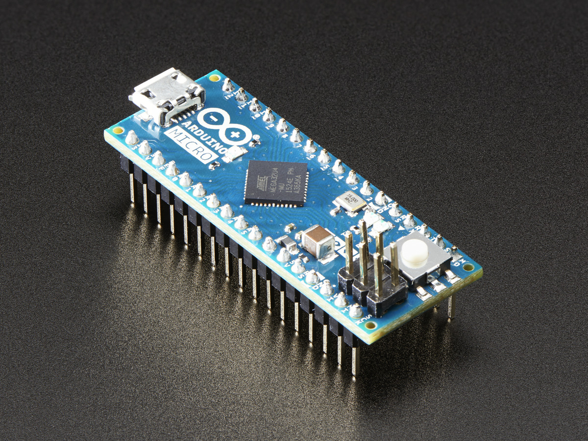
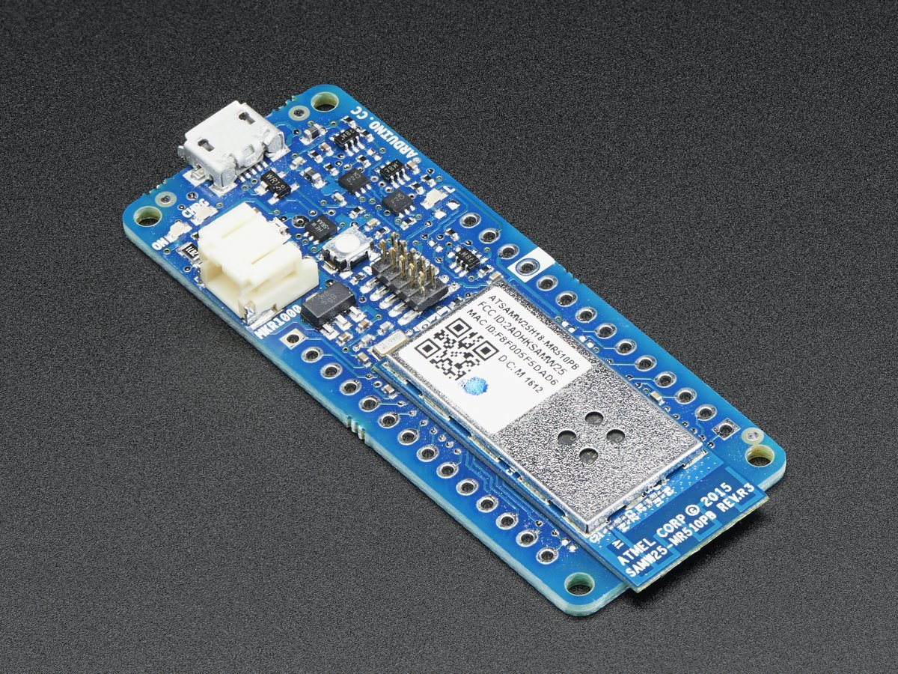
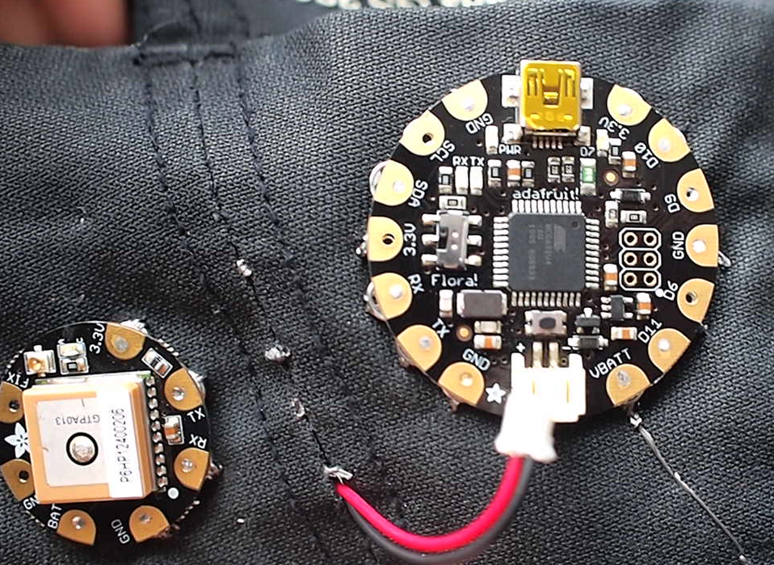
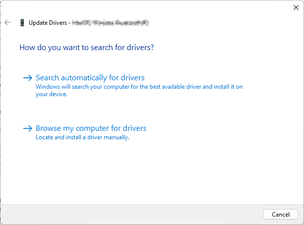

# Introduction <!-- omit in toc -->

- [Qu'est-ce qu'un Arduino?](#quest-ce-quun-arduino)
- [À propos de cette leçon](#à-propos-de-cette-leçon)
- [Quel Arduino?](#quel-arduino)
- [Le matériel du cours](#le-matériel-du-cours)
  - [Achat](#achat)
- [Les premiers pas](#les-premiers-pas)
  - [Logiciel](#logiciel)
  - [Matériel](#matériel)
  - [Installation des pilotes - Si nécessaire](#installation-des-pilotes---si-nécessaire)
- [Références](#références)

# Qu'est-ce qu'un Arduino?

Arduino est le nom de la petite carte de circuit électronique que vous allez utiliser comme outil pour étudier et explorer la programmation et l'électronique.

Elle est fabriquée par arduino.cc, une société dirigée par Massimo Banzi, PDG d'Arduino. Voici comment ils se décrivent :

> Arduino est une plateforme de prototypage open-source basée sur du matériel et des logiciels faciles à utiliser. Les cartes Arduino sont capables de lire des entrées - de la lumière sur un capteur, un doigt sur un bouton ou un message Twitter - et de les transformer en une sortie - activer un moteur, allumer une LED, publier quelque chose en ligne. Vous pouvez indiquer à votre carte ce qu'elle doit faire en envoyant un ensemble d'instructions au microcontrôleur de la carte. Pour ce faire, vous utilisez le langage de programmation Arduino (basé sur Wiring), et le logiciel Arduino (IDE).
> 
> Au fil des ans, Arduino a été le cerveau de milliers de projets, des objets du quotidien aux instruments scientifiques complexes. Une communauté mondiale de  fabricants - étudiants, amateurs, artistes, programmeurs et professionnels - s'est rassemblée autour de cette plateforme open-source. Leurs contributions ont permis d'accumuler une quantité incroyable de connaissances accessibles qui peuvent être d'une grande aide pour les novices comme pour les experts.

**TL;DR :** Arduino est une carte de circuit électronique qui peut être programmée pour faire des choses. Il y a une communauté de gens qui partagent leurs projets et leurs connaissances sur Arduino.

> **Jargon web** :
> tl;dr : "too long; didn't read" - "trop long, j'ai pas lu" - en gros, c'est une abréviation pour dire que le texte est trop long et que vous n'avez pas le temps de le lire. C'est une expression utilisée sur internet pour dire que vous n'avez pas le temps de lire un texte trop long. **On l'utilise aussi pour signifier un résumé d'un texte trop long.**

# À propos de cette leçon
Cette leçon n'enseigne pas vraiment l'électronique. Elle sert plutôt à s'assurer que tout est prêt pour les prochaines leçons. Elle permettra de vérifier que la carte fonctionne comme prévu et que l'ordinateur que vous utilisez est compatible.

Considérez ce tutoriel comme la "base" de votre voyage. Si les choses se compliquent, revenez ici et revérifiez cette leçon!

L'une des compétences les plus importantes que vous devrez apprendre est que, lorsque les choses tournent mal (et il y en aura beaucoup), vous devez revenir aux hypothèses les plus fondamentales. C'est un peu l'équivalent du "tu es sûr que c'est allumé" en électronique. Il est surprenant de voir combien d'ingénieurs qualifiés passent des heures à déboguer un circuit pour se rendre compte que... ce n'était pas branché!

# Quel Arduino?
Au cours des dix années qui ont suivi la sortie d'Arduino, il y a eu une énorme prolifération de centaines de "cartes Arduino" différentes disponibles. D'un côté, il existe un Arduino pour chaque type d'application spécialisée, mais d'un autre côté, cela peut devenir assez confus!

Dans ce cours, nous allons nous concentrer sur l'**Arduino Mega** qui est un Arduino plus puissant que l'Arduino UNO. Elle est en fait sa grande soeur. Elle est plus puissante et plus rapide avec une tonne de mémoire et de broches en plus, et une puce différente, l'ATmega2560. C'est une bonne mise à jour lorsqu'un projet ne rentre plus dans un UNO.

Au fur et à mesure, vous découvrirez qu'il y a peut-être d'autres compatibles Arduino que vous pourriez vouloir !

<table>
  <tr>
    <td></td>
    <td>L'Arduino UNO est un classique, elle est de loin la plus populaire et 99% des projets l'utilise. Elle est basique et bien supportée.</td>
  </tr>
  <tr>
    <td></td>
    <td>L'Arduino Micro, par contre... est un peu plus petit! Il a une puce Atmega32u4 différente qui peut faire de l'USB natif et peut donc agir comme un clavier ou une souris. Il est fin et possède des connecteurs à broche descendante pour pouvoir le brancher sur une planche à pain.</td>
  </tr>
  <tr>
    <td></td>
    <td>L'Arduino MKR1000 ressemble un peu à un Arduino Micro mais possède une puce ATSAM ARM 32 bits plus puissante et un WiFi intégré! Une excellente mise à niveau pour les projets liés à l'Internet des objets.</td>
  </tr>
  <tr>
    <td></td>
    <td>Il y a aussi les Arduino-compatibles comme le Flora qui est fabriqué par Adafruit. C'est un Arduino rond et portable et plutôt que d'utiliser des fils, vous pouvez le coudre dans les vêtements pour des projets électroniques portables.</td>
  </tr>
</table>

# Le matériel du cours

## Achat
Pour ce cours, vous aurez besoin d'un kit d'Arduino Mega sur plaque de montage et d'un ordinateur. Voici les liens pour acheter les items requis sur Amazon:
- [Arduino Mega](https://amzn.to/3v0aGDK).
- [Plaque de support pour Arduino](https://amzn.to/3jhOVgc).
  - Celle-ci convient aussi pour un Raspberry Pi.

# Les premiers pas
## Logiciel
Vous devez installer le logiciel Arduino sur votre ordinateur. Vous pouvez le télécharger [ici](https://www.arduino.cc/en/Main/Software).

Vous devez télécharger la version Windows avec MSI Installer. Cliquez sur le lien pour télécharger le fichier. Une fois le fichier téléchargé, lancez l'installation.

## Matériel
Vous avez devant vous une plaque de développement Arduino. Il s'agit du même kit que vous devez vous procurer pour ce cours. Il est composé de deux parties : la carte Arduino et la plaque de support.

Branchez le câble USB de la carte Arduino à votre ordinateur. Vous devriez voir une petite lumière verte s'allumer sur la carte. Cela signifie que la carte est alimentée. Toutefois, cela ne signifie pas que la carte est prête à être utilisée.

En effet, on doit s'assurer que les pilotes sont installés.

Pour vérifier si les pilotes sont installés, ouvrez le logiciel Arduino. Vous devriez voir une fenêtre comme celle-ci :

Maintenant, sélectionnez la barre défilante située dans la barre d'outils.

Si les pilotes sont installés, vous devriez voir dans la liste déroulante le nom de votre carte Arduino avec le port qui lui est assigné. Dans mon cas, c'était "Arduino Mega or Mega 2560" sur le `COM26` de mon ordinateur. Le numéro du port peut varier selon votre ordinateur.

> **Note :** `COM` est le préfixe donné pour les ports de communication sur les PC Windows. Il peut y avoir plusieurs ports de communication sur un ordinateur. Ceux-ci sont utilisés pour connecter des périphériques externes à l'ordinateur. Par exemple, un clavier, une souris, une imprimante, etc. Les numéros sont attribués en fonction de l'ordre de connexion des périphériques.

## Installation des pilotes - Si nécessaire
Généralement, Windows installe les pilotes automatiquement. Cependant, si ce n'est pas le cas, vous devez installer les pilotes manuellement.

Lancez le gestionnaire de périphériques de Windows. Pour ce faire, appuyez sur la touche `Windows` de votre clavier et tapez `Gestionnaire de périphériques`. Cliquez sur le premier résultat.

Dans le gestionnaire de périphériques, vous devriez voir une liste de périphériques. Recherchez le périphérique qui correspond à votre carte Arduino.

Cliquez sur le périphérique avec le bouton droit de la souris et sélectionnez `Mettre à jour le pilote`.

Dans la prochaine fenêtre, sélectionnez `Rechercher un pilote sur mon ordinateur`.

TODO : Compléter la procédure d'installation des pilotes.

# Références
- [Ladyada's Learn Arduino - Lesson #2](https://learn.adafruit.com/ladyadas-learn-arduino-lesson-number-2)
- 