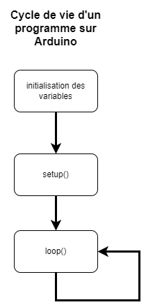

# Introduction <!-- omit in toc -->

- [Le langage de programmation](#le-langage-de-programmation)
  - [Exemples](#exemples)
- [Comment programmer un Arduino](#comment-programmer-un-arduino)
- [La fonction `setup`](#la-fonction-setup)
- [La fonction `loop`](#la-fonction-loop)
- [Cycle de vie d'un programme](#cycle-de-vie-dun-programme)
- [Les principaux types de données](#les-principaux-types-de-données)
  - [Précision du type `float`](#précision-du-type-float)
- [Les variables](#les-variables)
  - [La portée des variables](#la-portée-des-variables)
  - [Les variables globales](#les-variables-globales)
  - [Les variables statiques](#les-variables-statiques)
- [Wokwi - Simulateur Arduino](#wokwi---simulateur-arduino)
  - [Créer un projet](#créer-un-projet)
  - [Exercice - Premier projet](#exercice---premier-projet)
- [Exercices](#exercices)
  - [Recherches](#recherches)
  - [Questions](#questions)
  - [Programmation](#programmation)
    - [Défi](#défi)


# Le langage de programmation
Arduino utilise un langage de programmation spécifique appelé "Arduino Language" ou "Arduino C++".

Le langage Arduino est basé sur le langage C++, avec des modifications et des extensions spécifiques pour permettre une utilisation facile des fonctionnalités du microcontrôleur Arduino. Il est donc recommandé de connaître les bases du langage C++ avant de se lancer dans la programmation Arduino.

> **Note**
> 
> Si vous avez déjà programmé en C# ou Java, vous verrez que le langage Arduino est très proche de ces langages. C'est d'ailleurs pour cette raison que le langage Arduino est souvent utilisé pour initier les débutants à la programmation embarquée.

## Exemples

Voici quelques exemples de structures de base du langage Arduino :

- Déclaration de variables :

```cpp
int compteur = 0;          // Variable entière
float temperature = 25.5;   // Variable flottante
char caractere = 'A';       // Variable de caractère
bool etat = true;           // Variable booléenne (vrai/faux)
```

- Structures de contrôle de flux :

```cpp
if (condition) {
  // Code à exécuter si la condition est vraie
} else {
  // Code à exécuter si la condition est fausse
}

while (condition) {
  // Code à exécuter tant que la condition est vraie
}

for (int i = 0; i < 10; i++) {
  // Code à exécuter 10 fois (i va de 0 à 9)
}

```

- Fonctions :

```cpp
void maFonction() {
  // Code de la fonction
}

int maFonctionAvecRetour() {
  // Code de la fonction
  return 5; // Valeur de retour de la fonction
}

void maFonctionAvecParametres(int param1, float param2) {
  // Code de la fonction utilisant les paramètres param1 et param2
}

```

Il existe également de nombreuses fonctions prédéfinies dans le langage Arduino qui permettent d'interagir avec le microcontrôleur et ses périphériques (lecture et écriture sur les pins, gestion de l'horloge, gestion de la communication série, etc.).

# Comment programmer un Arduino

Voici la structure de base d'un programme Arduino :

```cpp
void setup() {
  // Code à exécuter une seule fois au démarrage
}

void loop() {
  // Code à exécuter en boucle
}
```

Le programme Arduino comporte deux fonctions de base obligatoire : `setup` et `loop`.

La fonction `setup` est exécutée une seule fois au démarrage du programme. On y met généralement le code de configuration, comme la définition des pin de sortie ou l'initialisation de certains paramètres.

La fonction `loop` est exécutée en boucle, c'est-à-dire qu'elle est répétée indéfiniment. C'est là que se trouve le code principal du programme.

Voici un exemple de programme Arduino simple qui fait clignoter une LED toutes les secondes :

```cpp
const int LED_PIN = 13; // Pin de la LED

void setup() {
  // Définition de la pin de la LED en sortie
  pinMode(LED_PIN, OUTPUT);
}

void loop() {
  // Allumage de la LED
  digitalWrite(LED_PIN, HIGH);
  // Attente de 500 millisecondes
  delay(500);
  // Extinction de la LED
  digitalWrite(LED_PIN, LOW);
  // Attente de 500 millisecondes
  delay(500);
}
```

# La fonction `setup`
La fonction `setup` est exécutée une seule fois au démarrage du programme Arduino, avant la boucle infinie de la fonction `loop`.

Elle est généralement utilisée pour mettre en place l'environnement de travail du programme, c'est-à-dire pour configurer les paramètres et les dispositifs nécessaires au bon fonctionnement du programme.

Voici quelques exemples d'utilisations possibles de la fonction `setup` :
- Définition des modes d'entrée/sortie des pins du microcontrôleur Arduino : en utilisant la fonction `pinMode`, on peut indiquer si une pin doit être utilisée en entrée (par exemple pour lire une valeur provenant d'un capteur) ou en sortie (par exemple pour envoyer une tension à une LED).
- Initialisation de paramètres et de variables : la fonction `setup` est souvent utilisée pour initialiser des variables qui seront utilisées tout au long du programme, comme des compteurs ou des variables de configuration.
- Configuration de périphériques externes : si le programme utilise des périphériques tels que des écrans LCD, des modules WiFi ou des capteurs, la fonction `setup` peut être utilisée pour configurer ces périphériques et les mettre en place pour l'utilisation ultérieure.

Voici un exemple de programme Arduino qui utilise la fonction setup pour définir le mode de la pin 13 en sortie et initialiser une variable de comptage à 0 :

```cpp
int compteur = 0; // Variable de comptage

void setup() {
  // Définition de la pin 13 en sortie
  pinMode(13, OUTPUT);
  // Initialisation de la variable de comptage à 0
  compteur = 0;
}

void loop() {
  // Incrémentation du compteur
  compteur++;
  // Allumage de la LED sur la pin 13
  digitalWrite(13, HIGH);
  // Attente de 500 millisecondes
  delay(500);
  // Extinction de la LED sur la pin 13
  digitalWrite(13, LOW);
  // Attente de 500 millisecondes
  delay(500);
}

```

# La fonction `loop`
La fonction loop est exécutée en boucle, c'est-à-dire qu'elle est répétée indéfiniment. C'est là que se trouve le code principal du programme.

Cette boucle est très pratique dans les programmes Arduino car elle permet de mettre en place des actions qui sont répétées de manière périodique, comme la lecture de données sensorielles, l'affichage de données sur un écran ou encore la commande de dispositifs tels que des moteurs ou des LED.

> **Perle de culture**
>  
> Les microcontrôleurs doivent tous avoir une fonction similaire à `loop` pour fonctionner. Si vous ne mettez pas de fonction `loop` dans votre programme, le microcontrôleur ne fera rien.>
> 
> Ainsi, on pourrait retrouver quelques choses comme ça dans le code d'un microcontrôleur :
> ```cpp
> void main() {
>   // ...
>   // Code de configuration
>   // ...
>   // ...
>   // Boucle principale
>   while (true) {
>     // ...
>     // Code principal répété    
>     // ...
>   }    
> }
> ```

# Cycle de vie d'un programme



---

# Les principaux types de données
Voici les principaux types de données utilisables dans le langage Arduino :

- `int` : type entier, peut stocker des valeurs allant de -32768 à 32767.
- `unsigned int` : type entier non signé, peut stocker des valeurs allant de 0 à 65535.
- `long` : type entier long, peut stocker des valeurs allant de -2147483648 à 2147483647.
- `unsigned long` : type entier long non signé, peut stocker des valeurs allant de 0 à 4294967295.
- `float` : type flottant, peut stocker des valeurs à virgule flottante avec une précision de 7 chiffres après la virgule.
- `double` : type flottant double, peut stocker des valeurs à virgule flottante avec une précision de 15 chiffres après la virgule.
- `char` : type de caractère, peut stocker un seul caractère (lettre, chiffre, symbole, etc.).
- `bool` : type booléen, peut stocker deux valeurs : true (vrai) ou false (faux).

Il existe également d'autres types de données moins courants tels que `byte`, `word` et `string`, qui peuvent être utilisés selon les besoins de votre programme.

Voici un exemple de déclaration de variables de différents types :

```cpp
int entier = 10;
unsigned int entierNonSigne = 65535;
long entierLong = -2147483648;
unsigned long entierLongNonSigne = 4294967295;
float flottant = 3.14;
double flottantDouble = 3.141592653589793;
char caractere = 'A';
bool etat = true;
```

Voici un tableau résumant les principaux types de données du langage Arduino avec leur dimension en octet et quelques exemples d'utilisation :

| Type       | Dimension en octet | Exemples d'utilisation                                                                  |
|------------|-------------------|----------------------------------------------------------------------------------------|
| `int`      | 2                 | Stockage de nombres entiers (par exemple : compteur, nombre de tours de moteur).       |
| `unsigned int` | 2                 | Stockage de nombres entiers non signés (par exemple : compteur de cycles de travail). |
| `long`     | 4                 | Stockage de nombres entiers longs (par exemple : compteur de secondes écoulées).       |
| `unsigned long` | 4                 | Stockage de nombres entiers longs non signés (par exemple : compteur de millisecondes écoulées). |
| `float`    | 4                 | Stockage de nombres à virgule flottante (par exemple : mesure de température).        |
| `double`   | 8                 | Stockage de nombres à virgule flottante avec une précision accrue (par exemple : mesure de position GPS). |
| `char`     | 1                 | Stockage de caractères (lettres, chiffres, symboles, etc.).                         |
| `bool`     | 1                 | Stockage de valeurs booléennes (vrai/faux).                                            |

Il est important de choisir le type de données le plus adapté pour stocker vos données, afin de maximiser l'efficacité et la précision de votre programme. Par exemple, il n'est pas recommandé d'utiliser un type `float` pour stocker des nombres entiers, car cela peut entraîner une perte de précision. De même, il est préférable d'utiliser un type `long` ou `unsigned long` pour stocker des nombres très grands, plutôt que de dépasser la limite supérieure du type `int`.

## Précision du type `float`
Le type `float` est un type de données à virgule flottante qui permet de stocker des nombres à virgule avec une précision de 7 chiffres après la virgule. Cependant, il peut y avoir une perte de précision lors de l'utilisation de ce type de données pour plusieurs raisons :
- Les nombres à virgule flottants sont stockés en mémoire sous forme binaire, et non en décimal comme les nombres entiers. Cela signifie que certains nombres décimaux ne peuvent pas être représentés de manière exacte sous forme binaire, ce qui peut entraîner une perte de précision.
- Le type `float` a une précision limitée à 7 chiffres après la virgule. Si vous avez besoin d'une précision supérieure, il est recommandé d'utiliser le type `double`, qui permet de stocker des nombres à virgule flottante avec une précision de 15 chiffres après la virgule.
  
Voici quelques exemples d'utilisation du type float et de la perte de précision qui peut en résulter :

```cpp
float a = 0.1;
float b = 0.2;
float c = a + b; // c vaut 0.30000000000000004 (perte de précision)

float d = 123456.789;
int e = (int) d; // e vaut 123456 (perte de précision)

```

Il est donc important de prendre en compte ces limitations lors de l'utilisation du type `float` dans vos programmes Arduino. Si vous avez besoin d'une précision supérieure ou d'une plage de valeurs plus grande, il est recommandé d'utiliser le type `double`.

---

# Les variables
Une variable est un emplacement mémoire dans un ordinateur qui permet de stocker une valeur ou une donnée. En programmation, on utilise des variables pour stocker et manipuler des données dans un programme.

## La portée des variables
La portée d'une variable désigne la plage de code dans laquelle la variable est accessible et peut être utilisée.

Il existe plusieurs types de portée de variables dans le langage Arduino :

- Les **variables globales** sont déclarées en dehors de toutes les fonctions, et sont donc accessibles à toutes les fonctions de votre programme.
- Les **variables locales** sont déclarées à l'intérieur d'une fonction, et sont donc uniquement accessibles et utilisables dans cette fonction.
- Les **variables statiques** sont déclarées à l'intérieur d'une fonction, mais leur valeur est conservée entre les exécutions de la fonction. Elles sont donc accessibles et utilisables dans toutes les exécutions de la fonction, mais sont uniquement visibles à l'intérieur de cette fonction.

Voici un exemple illustrant la portée de différentes variables :

```cpp
int variableGlobale = 0;  // Variable globale

void setup() {
  int variableLocale = 0;  // Variable locale
  static int variableStatique = 0;  // Variable statique

  // Code de la fonction setup
  variableGlobale++;  // Incrémentation de la variable globale
  variableLocale++;  // Incrémentation de la variable locale
  variableStatique++;  // Incrémentation de la variable statique

  Serial.println(variableGlobale); 
  Serial.println(variableLocale);
  Serial.println(variableStatique);
}

void loop() {
  int variableLocale = 0;  // Variable locale
  static int variableStatique = 0;  // Variable statique

  // Code de la fonction loop
  variableGlobale++;  // Incrémentation de la variable globale
  variableLocale++;  // Incrémentation de la variable locale
  variableStatique++;  // Incrémentation de la variable statique

  Serial.println(variableGlobale); 
  Serial.println(variableLocale);
  Serial.println(variableStatique);
}
```

**Questions**
- Quelles seront les valeurs affichées dans le moniteur série pour la fonction `setup()`?
- Quelles seront les valeurs affichées dans le moniteur série dans le premier tour de la fonction `loop()`?

## Les variables globales
Les variables globales sont des variables qui sont déclarées en dehors de toutes les fonctions dans votre programme Arduino, et qui sont donc accessibles à toutes les fonctions de votre programme.

Voici un exemple de déclaration et d'utilisation de variables globales :

```cpp
int compteur = 0;  // Variable globale

void setup() {
  // Code de la fonction setup
  compteur++;  // Incrémentation de la variable globale
}

void loop() {
  // Code de la fonction loop
  compteur++;  // Incrémentation de la variable globale
  Serial.println(compteur);  // Affichage de la valeur de la variable globale
}

```

Les variables globales sont utiles lorsque vous avez besoin de partager des données entre plusieurs fonctions de votre programme, ou lorsque vous avez besoin de conserver la valeur d'une variable entre plusieurs exécutions de la fonction `loop()`.

Il est important de faire attention à l'utilisation des variables globales, car elles peuvent être modifiées par n'importe quelle fonction de votre programme, ce qui peut entraîner des erreurs de logique ou de synchronisation.

## Les variables statiques
Les variables statiques sont des variables qui sont déclarées à l'intérieur d'une fonction, mais dont la valeur est conservée entre les exécutions de la fonction. Elles sont donc accessibles et utilisables dans toutes les exécutions de la fonction, mais sont uniquement visibles à l'intérieur de cette fonction.

Voici un exemple de code qui utilise une variable statique pour compter le nombre de fois qu'un bouton a été appuyé
    
```cpp
const int boutonPin = 2;  // Pin du bouton

void setup() {
  pinMode(boutonPin, INPUT_PULLUP);  // Configuration du pin en entrée avec pull-up
  Serial.begin(9600);  // Configuration de la liaison série
}

void loop() {
  if (digitalRead(boutonPin) == LOW) {  // Si le bouton est appuyé
    boutonClic();  // Appel de la fonction boutonClic()
  }
}

void boutonClic() {
  static int compteur = 0;  // Déclaration de la variable statique
  compteur++;  // Incrémentation de la variable statique
  Serial.println(compteur);  // Affichage du nombre de clics sur la liaison série
}

```

Dans cet exemple, la variable statique compteur est déclarée à l'intérieur de la fonction `boutonClic()`, mais sa valeur est conservée entre les exécutions de cette fonction. Ainsi, à chaque exécution de la fonction `boutonClic()`, la valeur de `compteur` est incrémentée de 1 et affichée sur la liaison série.

Les variables statiques sont utiles lorsque vous avez besoin de conserver la valeur d'une variable entre les exécutions d'une fonction, tout en limitant la visibilité de cette variable à l'intérieur de la fonction.

---

# Wokwi - Simulateur Arduino
Il existe plusieurs sites qui permettent de simuler une partie des fonctionnalités de l'Arduino. Toutefois, je préconise Wokwi. Il est gratuit, il est en ligne, il est simple d'utilisation et il est très complet.

Plusieurs de mes captures d'écran proviendront de [Wokwi](https://wokwi.com/).

Simuler un projet sur un simulateur avant d'effectuer les branchements physiques permet de s'assurer que notre code fonctionne.

> **Note**
> 
> À ma dernière vérification, Wokwi ne supportait pas très bien FireFox. Je vous conseille d'utiliser Chrome ou Edge.

## Créer un projet
Pour créer un projet, il suffit d'aller dans le bas de la page dans la section "Start from scratch" et de cliquer sur la carte Arduino que l'on souhaite utiliser. Dans notre cas, il s'agira du Arduino Mega.

<!-- <video src="assets/wokwi_new_project.mp4" width=640></video> -->

https://user-images.githubusercontent.com/2332679/210601281-1ecd0f4e-a510-4571-8242-067902a302e1.mp4

---

## Exercice - Premier projet
1. Si ce n'est déjà fait, créez un compte GitHub.
2. Connectez-vous à [Wokwi](https://wokwi.com/) avec votre compte GitHub.
3. À partir du logiciel Arduino IDE, ouvrir le projet exemple "Blink".
4. Créez un nouveau projet nommé `c01_ex01` et choisissez le type `Arduino Mega`.
5. Collez le projet "Blink" dans le nouveau projet Wokwi.
6. Exécutez le projet.
7. Modifiez les valeurs de *timing* pour d'autres valeurs et exécutez le projet.

---

# Exercices
## Recherches
Dans le but de vous habituer à faire des recherches sur Google, j'ai expressément mis des questions où l'information n'est pas directement dans ce document.

1. Dans certains exemples de code, on retrouve des noms de variable tout en majuscule. Pour quelle raison?
2. Généralement, quelles sont les valeurs des variables `HIGH`, `LOW` et `LED_BUILTIN`?
3. Que fait la fonction `delay()`?
4. Que fait la fonction `pinMode()`?
5. Combien de mémoire RAM possède le Arduino Mega?

## Questions
1. Quelle est la différence entre une variable locale et une variable globale?
2. Quel type de variable est-il préférable d'utiliser pour stocker le temps en milliseconde?
3. Si je veux partager une variable entre les fonctions, quelle sera la portée de la variable que devrais-je prendre?
4. Si je veux conserver la valeur d'une variable à l'intérieur d'une même fonction, quelle sera la portée de la variable que devrais-je prendre?
5. À l'intérieur d'une fonction, si la valeur d'une variable doit être réinitialiser à chaque fois et elle n'est pas utile à l'extérieur de la dite fonction, quelle sera la portée de la variable?
6. Quelle est la différence entre une variable statique et une variable globale?
7. Quelle est la différence entre une variable locale et une variable statique?
8. Nommez une utilité pour une variable locale.
9.  Nommez une utilité pour une variable statique.
10. Nommez une utilité pour une variable globale.

<details><summary>Réponses</summary>

1. Une variable locale est déclarée à l'intérieur d'une fonction et n'est pas accessible à l'extérieur de la fonction. Une variable globale est déclarée à l'extérieur de toute fonction et est accessible à l'extérieur de toutes les fonctions.
2. `unsigned long`
3. Variable globale
4. Variable statique
5. Variable locale
6. Une variable statique conserve sa valeur entre les exécutions d'une fonction et n'est pas accessible aux autres fonctions. Une variable globale est accessible à l'extérieur de toutes les fonctions.
7. Une variable locale est déclarée à l'intérieur d'une fonction, n'est pas accessible à l'extérieur de la fonction et elle est réinitialisée à chaque exécution de la fonction. Une variable statique est déclarée à l'intérieur d'une fonction et conserve sa valeur entre les exécutions de la fonction.
8. Exemple : Avoir une variable qui sert à incrémenter un compteur.
9. Exemple : Conserver la valeur du temps entre les exécutions d'une fonction. Conserver l'état d'une LED entre les exécutions d'une fonction.
10. Exemple : Conserver l'heure globale du système. Conserver l'état d'un composant pour l'ensemble du système.
</details>

## Programmation
1. Modifiez le programme "Blink" pour faire clignoter la LED 5 fois par seconde.
2. Modifiez le programme "Fade" pour faire réagir la LED qui est intégrée sur le Arduino.
3. Modifiez le programme "Fade" pour faire gradueryou la LED plus rapidement.

### Défi
- Créez un programme qui fait clignoter la LED 2 fois dans une seconde. Ensuite, faire un graduation 100% vers 0% sur 1 seconde. Et recommencer.

https://user-images.githubusercontent.com/2332679/210662345-958f0043-521b-4025-aea2-3f0cf3fe7d0e.mp4


