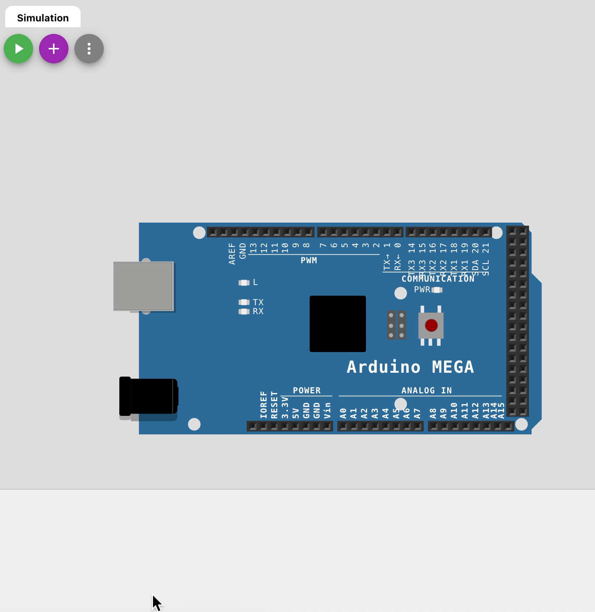

# Les fonctions de base et la communication <!-- omit in toc -->

---
# Table des matières <!-- omit in toc -->

- [Introduction](#introduction)
- [Code de base - Blink](#code-de-base---blink)
- [DEL par défaut](#del-par-défaut)
- [Fonctions de base](#fonctions-de-base)
  - [pinMode - Gestion des broches](#pinmode---gestion-des-broches)
  - [digitalWrite](#digitalwrite)
  - [delay](#delay)
  - [millis](#millis)
- [Fonction en C++](#fonction-en-c)
  - [Syntaxe](#syntaxe)
  - [Fonction avec retour de valeur](#fonction-avec-retour-de-valeur)
  - [Fonction sans retour de valeur (procédure)](#fonction-sans-retour-de-valeur-procédure)
- [Fonctions de communication](#fonctions-de-communication)
  - [Serial.begin()](#serialbegin)
  - [Serial.print() et Serial.println()](#serialprint-et-serialprintln)
- [Moniteur série](#moniteur-série)
- [Exercices](#exercices)

---

# Introduction
Dans ce cours, nous allons apprendre à utiliser quelques fonctions fondamentales de l'Arduino ainsi que l'échange d'information entre l'Arduino et le PC.

---

# Code de base - Blink

Voici le code de base pour faire clignoter une LED branchée sur la broche 13 de l'Arduino.

Nous allons nous y référer pour étudier les fonctions de base.

<table>
<tr>
<td>

**Code**
</td>
<td>

**Résultat**
</td>
</tr>
<tr>
<td>

```cpp
int led = 13;

void setup() {
  pinMode(led, OUTPUT);
}

void loop() {
  digitalWrite(led, HIGH);
  delay(1000);
  digitalWrite(led, LOW);
  delay(1000);
}
```
</td>
<td>


</td>

</tr>


</table>

---

# DEL par défaut
Une DEL, ou *LED* en anglais, est une petite lampe qui émet de la lumière quand elle est alimentée. DEL est l'acronyme pour **D**iode **É**lectro**L**uminescente (***L**ight-**E**mitting **d**iode*).

Sur les Arduinos, il y a une DEL qui est branchée sur la **broche 13**. C'est la raison pour laquelle on voit souvent des exemples avec cette DEL, car elle est facile à utiliser.

---

# Fonctions de base

## pinMode - Gestion des broches

La fonction `pinMode` permet de définir le mode d'une broche. Il y a deux modes principaux : `INPUT` et `OUTPUT`.

> **Note**
> 
> Il y a aussi un 3e mode (`INPUT_PULLUP`) que nous verrons plus tard.

**La fonction prend 2 paramètres : le numéro de la broche et le mode de la broche.**

Généralement, on utilise la fonction `pinMode` dans la fonction `setup` pour définir le mode des broches.

| Mode | Description | Exemple | Exemple d'utilisation |
| --- | --- | --- | --- |
| INPUT | La broche est en mode entrée. | `pinMode(2, INPUT);` | Lecture d'un bouton |
| OUTPUT | La broche est en mode sortie. | `pinMode(3, OUTPUT);` | Contrôle d'une DEL ou d'un moteur |

Dans l'exemple précédent, nous avons utilisé la fonction `pinMode` pour définir la broche 13 en mode `OUTPUT` pour pouvoir y écrire une valeur.

---

## digitalWrite
La fonction digitalWrite en Arduino permet de mettre le niveau logique `HIGH` ou `LOW` sur une **broche numérique**.

`HIGH` vaut 1 et `LOW` vaut 0.

Lorsqu'on utilise cette fonction, il faut lui fournir deux arguments : le numéro de la broche sur laquelle on veut envoyer le signal et le niveau logique souhaitée (`HIGH` ou `LOW`). Par exemple, si vous voulez envoyer un signal de niveau logique `HIGH` sur la broche numérique 12, vous pouvez utiliser l'instruction suivante :

```cpp
digitalWrite(12, HIGH);
```

La fonction `digitalWrite` est souvent utilisée pour contrôler des dispositifs qui nécessitent un signal binaire, comme des LED, des relais, etc. Elle peut également être utilisée pour communiquer avec d'autres circuits ou des périphériques externes via des protocoles de communication tels que I2C ou SPI.

---

## delay
La fonction `delay` permet de faire une pause dans le programme. Elle prend en paramètre le nombre de millisecondes à attendre. Elle prend un seul argument, qui est le nombre de millisecondes de pause souhaité.

Voici un exemple d'utilisation de la fonction `delay` :
    
```cpp
digitalWrite(LED_BUILTIN, HIGH);  // Allume la LED intégrée
delay(1000);                       // Pause pendant 1000 millisecondes (1 seconde)
digitalWrite(LED_BUILTIN, LOW);   // Éteint la LED intégrée
```

La fonction `delay` est souvent utilisée pour créer des temporisations ou des pauses dans un programme Arduino. Elle peut être utilisée pour mettre en pause le programme pendant une durée précise avant de continuer à l'exécution. Par exemple, on peut utiliser delay pour créer des effets de clignotement sur une LED ou pour synchroniser l'exécution de différentes parties d'un programme.

> **Important!!**
> 
> Il est important de noter que la fonction `delay` bloque l'exécution du programme pendant la durée de la pause, ce qui est problématique dans certains cas. Si vous avez besoin de mettre en pause le programme sans bloquer l'exécution des autres parties du code, vous pouvez utiliser des variables de gestion de temps. Voir l'exemple `BlinkWithoutDelay` pour plus de détails.

---

## millis

La fonction `millis()` dans Arduino est une fonction qui renvoie le nombre de millisecondes qui se sont écoulées depuis le démarrage du microcontrôleur Arduino. Elle peut être utilisée pour calculer des délais précis, tels que le retardement dans une boucle `loop()`. Cela permet aux programmes Arduino d'effectuer des opérations à des intervalles de temps précis, ce qui est très utile pour les projets qui impliquent des délais ou des temps d'exécution.

Elle s'utilise sans paramètre et renvoie un **entier long** (`long int`).

---

# Fonction en C++
## Syntaxe
Voici comment déclarer une fonction en Arduino :

```cpp	
type additionner(liste_parametres) {
  // Corps de la fonction
}
```

Le mot-clé `type` peut être remplacé par le type de données du résultat retourné par la fonction. Si la fonction ne retourne pas de résultat, vous pouvez utiliser le mot-clé `void`.

---

## Fonction avec retour de valeur

Voici un exemple de déclaration d'une fonction qui retourne un entier et qui prend deux entiers en paramètre :

```cpp
int additionner(int x, int y) {
  // Corps de la fonction
}
```

Pour appeler une fonction, vous pouvez utiliser son nom suivi de parenthèses contenant les arguments à passer à la fonction. Par exemple :

```cpp
int resultat = additionner(10, 20);
```

Voici un exemple complet de fonction en Arduino :

```cpp
int additionner(int x, int y) {
  int resultat = x + y;
  return resultat;
}

void setup() {
  Serial.begin(9600);
}

void loop() {
  int res = additionner(10, 20);
  Serial.println(res);
  delay(1000);
}

```

Dans cet exemple, la fonction `additionner` prend deux entiers en paramètre et retourne leur somme. Elle est appelée dans la fonction `loop` et le résultat est affiché sur la liaison série.

---

## Fonction sans retour de valeur (procédure)
Parfois, on doit répéter des instructions sans que celles-ci n'aient à retourner une valeur. Dans ce cas, on peut déclarer une fonction sans type de retour. On parle alors de **procédure** ou de fonction `void`.

```cpp
void clignoteLED(int brocheLED, int tauxClignotement) {
  // Variable statique pour sauvegarder
  // la valeur de la dernière fois
  static unsigned long tempsPrecedent = 0; 
  
  if (millis() - tempsPrecedent > tauxClignotement) { 
    digitalWrite(brocheLED, !digitalRead(brocheLED)); 
    tempsPrecedent = millis();
  }
}
```

---

# Fonctions de communication
Les fonctions de communication permettent d'envoyer et de recevoir des données à partir d'autres périphériques ou d'autres circuits. Elles sont utilisées pour communiquer avec des périphériques externes, comme des capteurs, des écrans LCD, des modules Bluetooth, etc.

Dans ce cours, nous allons nous intéresser aux fonctions de communication suivantes :
- `Serial.begin()`
- `Serial.print()`
- `Serial.println()`

## Serial.begin()
La fonction `Serial.begin()` permet de configurer la vitesse de communication avec le port série. Elle prend en paramètre la vitesse de communication en bauds. Par exemple, pour configurer la liaison série à 9600 bauds, on utilise la fonction `Serial.begin(9600)`.

Généralement, on utilise la fonction `Serial.begin()` dans la fonction `setup()`.

Exemple :

```cpp
void setup() {
  Serial.begin(9600);
  // Autre code
}
```
<br />

> **Note**
> 
> Un baud est une unité de mesure de la vitesse de transmission de données. Il représente le nombre de bits qui peuvent être transmis par seconde. Par exemple, 9600 bauds signifie que 9600 bits peuvent être transmis par seconde.

---

## Serial.print() et Serial.println()

La fonction `Serial.print()` est une fonction dans l'Arduino qui permet d'envoyer des données série à un port série. Il peut être utilisé pour envoyer un message texte, des données numériques ou des données binaires.

Par exemple, le code suivant permet d'envoyer le message "Bonjour!" à un port série:

```
void setup() {
  Serial.begin(9600);
}

void loop() {
  Serial.print("Bonjour!");
  delay(1000);
}
```

Ce code initialisera le port série à une vitesse de 9600 bits par seconde, puis enverra le message "Bonjour!" toutes les secondes.

La fonction `Serial.println()` ajoute un retour à la ligne à la fin du message envoyé.

Voici un exemple de code qui utilise les fonctions `Serial.print()` et `Serial.println()` :

```cpp

void setup() {
  // Initialisation du port
  // série à 9600 baud
  Serial.begin(9600);
}

int counter = 0;
void loop() {
  Serial.print("Boucle : ");
  Serial.println(counter);
  counter++;

  // Délai pour ne pas ralentir le µC
  delay(500);
}

```



# Moniteur série
Pour pouvoir voir les messages envoyés par le programme, il faut ouvrir le moniteur série. Pour cela, cliquez sur le menu `Outils` puis sur `Moniteur série`.

Il faudra s'assurer de sélectionner le bon port série ainsi que la bonne vitesse de communication. 

---


# Exercices
- Programmez une DEL pour qu'elle clignote 2 fois dans une seconde et ensuite 5 fois dans une seconde.
- Modifiez le programmation précédent qui envoit à l'ordinateur l'état du LED à chaque changement d'état.