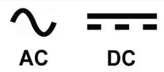

# Électricité de base <!-- omit in toc -->

- [L'électricité sur les appareils](#lélectricité-sur-les-appareils)
  - [Le voltage](#le-voltage)
  - [L'ampérage](#lampérage)
    - [Exemples](#exemples)
  - [Important *Life skill*](#important-life-skill)
  - [L'électricité de l'Arduino](#lélectricité-de-larduino)
    - [Entrée](#entrée)
    - [Sortie](#sortie)
  - [Résumé](#résumé)
- [Faire un montage électrique](#faire-un-montage-électrique)
  - [Avant de commencer, très important](#avant-de-commencer-très-important)
  - [Branchement de base](#branchement-de-base)
  - [Documentation - Introduction à l'Arduino](#documentation---introduction-à-larduino)
  - [Brancher une DEL](#brancher-une-del)
  - [Brancher un bouton](#brancher-un-bouton)
    - [Code pour lire le bouton](#code-pour-lire-le-bouton)
- [Exercices](#exercices)
- [Références](#références)

# L'électricité sur les appareils
L'objectif de cette section n'est pas de vous donner une formation scientifique sur ce qu'est le voltage, l'ampérage, etc. D'ailleurs, ce sont des notions que vous avez vu au secondaire. Je vous suggère de vous référer à votre cours de physique pour vous rafraîchir la mémoire.

L'objectif est plutôt de savoir comment et où vous pouvez mesurer ces valeurs pour vous assurer que votre circuit fonctionne correctement.

## Le voltage
Le voltage est la différence de potentiel entre deux points. C'est la force qui pousse les électrons à circuler dans un circuit. Le voltage est mesuré en volt (V).

Lorsque l'on branche un circuit électronique il est super important de respecter le voltage de l'appareil, car **si vous branchez un appareil à un adaptateur qui donne trop de voltage, vous risquez de brûler votre appareil.**

Il y a aussi la **polarité** qui est importante. La polarité est la direction du courant. Il y a deux types de polarité : positive et négative. La polarité est indiquée sur les fiches signalétiques des appareils. **Si vous branchez un appareil avec une polarité négative sur un adaptateur avec une polarité positive, vous risquez de brûler votre appareil.**


## L'ampérage
L'ampérage est la quantité de courant qui circule dans un circuit. L'ampérage est mesuré en ampère (A).

Un appareil ou composant consomme de l'ampérage. Vous pouvez brancher un adaptateur qui peut fournir plus d'ampérage qu'un appareil a besoin. Car l'appareil ne consommera pas plus d'ampérage que ce qu'il a besoin.

 Il est important de respecter la valeur d'ampérage de l'appareil, car **si vous branchez un appareil qui consomme trop d'ampérage sur un adaptateur qui ne peut pas fournir assez d'ampérage, vous risquez de brûler votre appareil.**


 ### Exemples
 - Si vous branchez un adaptateur de portable qui fournit un maximum de 45W sur un portable qui nécessite 90W, vous risquez d'endommager votre portable et votre adaptateur.
 - Si vous branchez un adaptateur de 5V en courant continu qui fournit 1A sur un Raspberry Pi 3, votre appareil ne démarrera pas. Le Raspberry Pi 3 nécessite un minimum de 2.5A pour démarrer.

## Important *Life skill*
Habituellement sur les appareils, on peut trouver une étiquette ou gravure près du port de branchement qui indique le voltage de l'appareil. Par exemple, un appareil qui fonctionne à 5V aura une étiquette qui indique 5V.

Les symboles suivants sont souvent utilisés sur les fiches signalétiques des appareils :

| Symbole | Description |
| --- | --- |
|  | Type de polarité |
|  | Type de courant |


Voici quelques exemples de fiches signalétiques :

| Photo | Description |
| --- | --- |
|  | Appareil acceptant un voltage de 12 volt en courant continu et nécessitant 0.5 ampère avec une nécessitant à polarité positive |
|  | Appareil acceptant un voltage de 5 volt en courant continu  et nécessitant 1 ampère avec une fiche à polarité positive |
|  | Adaptateur avec sortie de 12V en courant continu pouvant fournir 0.5A avec une fiche à polarité positive |
|  | Adaptateur avec sortie de 12V en courant continu pouvant fournir 150mA avec **une fiche à polarité inconnue...** |
|  | Adaptateur avec sortie de 5V en courant continu pouvant fournir 1A avec une fiche USB |
|  | Adaptateur avec plusieurs valeurs de sortie. Il s'agit d'un adapteur de type USB-C |

## L'électricité de l'Arduino
### Entrée
Sur votre Arduino, on utilise généralement le port USB pour alimenter la carte. Le voltage d'entrée est de 5V. Cependant, il y a aussi un port d'alimentation externe qui peut être utilisé pour alimenter la carte. Ce port peut accepter un voltage de 7 à 12V. C'est le voltage que vous pouvez utiliser pour alimenter votre carte.

> **Perle de culture**
> 
> L'appareil permet d'avoir un voltage variable en entrée, car il y a un **régulateur de voltage** qui permet de convertir le voltage d'entrée en un voltage de 5V.

### Sortie
Le voltage de sortie des broches de l'arduino est de 5V. C'est le voltage de sortie de la carte. C'est le voltage que vous devez utiliser pour brancher vos composants. 

Selon la documentation de l'Arduino Mega, il ne peut fournir que 40 mA par broche pour un total maximal de 200mA pour l'ensemble des broches . C'est pourquoi **il est important de lire la documentation de vos composants** pour savoir les spécifications électriques de chacun.

> **Attention!**
> 
> Toutefois, ceci n'est pas le standard de l'industrie. La plupart des composants sont branchés sur un voltage de 3.3V. C'est pourquoi il est important de lire la documentation de vos composants pour savoir quel voltage ils utilisent.


## Résumé
Ces notions vont vous permettre éventuellement de faire attention lorsque vous branchez des appareils avec des adaptateurs qui ne sont pas d'origine.

---

# Faire un montage électrique

## Avant de commencer, très important
La **convention** veut que les fils rouges soient branchés sur les fils positifs (+) et les fils noirs sur les fils négatifs (-). C'est une convention, mais c'est une convention qui est respectée par la plupart des gens et l'industrie. **C'est donc une convention que vous devez respecter**.
 
**Je retrancherai des points si vous ne respectez pas cette convention!**

## Branchement de base
Dans votre kit, je vous suggère le branchement de base permanent suivant :


Ce branchement permet d'accélérer le démarrage de vos projets. Il vous permettra de tester vos programmes sans avoir à brancher et débrancher les fils de courant à chaque fois.

## Documentation - Introduction à l'Arduino
Parcourir l'excellent document de Jean-Philippe Boulard sur l'[introduction à l'Arduino](intro_arduino_jp/readme.md#platine-dexp%C3%A9rimentation-sans-soudure-breadboard).

## Brancher une DEL
Comme indiquer dans le document d'introduction à l'arduino, pour brancher une DEL **il faut une résistance en série**. La résistance est nécessaire pour limiter le courant qui passe dans la DEL. La DEL est un composant très sensible au courant qui passe à travers elle. Si le courant est trop fort, la DEL peut être endommagée.

Voici un schéma de branchement d'une DEL avec une résistance en série :


- La DEL est branchée sur la broche 9 de l'Arduino.
- Pour la contrôler, il faudra faire un programme.

## Brancher un bouton
Dans ce document, je vous présente une méthode pour brancher un bouton. Cependant, il existe plusieurs façons de brancher un bouton. Vous pouvez brancher un bouton avec une résistance en série ou en parallèle. Vous pouvez aussi brancher un bouton avec un condensateur.

La première chose à savoir c'est le branchement interne du bouton. Dans votre kit, il s'agit de boutons poussoirs momentanés.

Le schéma interne du bouton est le suivant :


Voir le tutoriel [suivant](https://docs.arduino.cc/tutorials/generic/digital-input-pullup).

Voici un circuit de branchement du bouton **qui doit être programmé en mode `INPUT_PULLUP`**.


### Code pour lire le bouton
Pour lire la valeur du bouton, il faut en premier lieu configurer la broche en mode `INPUT_PULLUP` et ensuite utiliser la fonction `digitalRead()`.

```cpp
// Déclaration des variables
int bouton = 2; // broche 2

void setup() {
  Serial.begin(9600); // Initialisation du port série
  // Configuration de la broche en mode INPUT_PULLUP
  pinMode(bouton, INPUT_PULLUP);
}

void loop() {
  // Lecture de la valeur du bouton
  int valeurBouton = digitalRead(bouton);
  
  // Affichage de la valeur du bouton
  Serial.println(valeurBouton);
  delay(10);
}
```

# Exercices
Voir la liste des exercices [ici](C03_branchement_base_exo.md).

# Références
- [TUTO ARDUINO #1 : INSTALLATION ET FAIRE CLIGNOTER UNE LED!](https://www.youtube.com/watch?v=k0KYfGvZUCw&list=PLm9ko_-biSnQz-1PGorgsi3Q1CSN7HdNh&index=3)
- [TUTO ARDUINO #2 : FAIRE FONCTIONNER UN BOUTON / INTERRUPTEUR!](https://www.youtube.com/watch?v=MnzidiZ_6ok)
- [Pull-up resistors](https://learn.sparkfun.com/tutorials/pull-up-resistors/all)