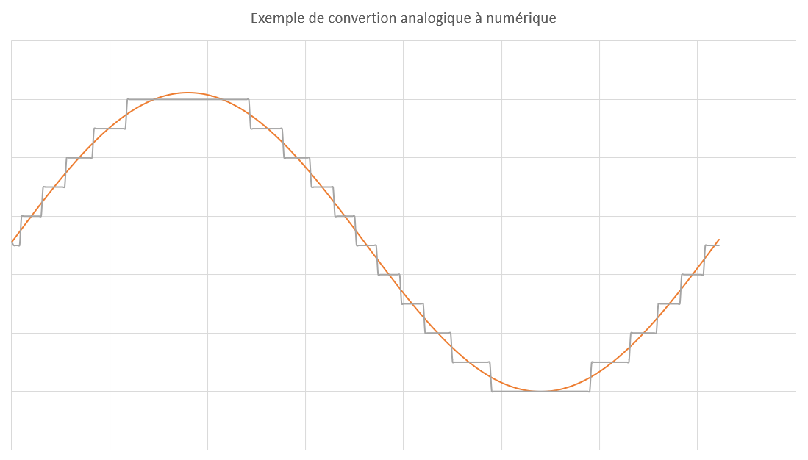

# Lecture de valeurs analogiques <!-- omit in toc -->

# Table des matières <!-- omit in toc -->
- [Introduction](#introduction)

# Qu'est-ce qu'une valeur analogique?
Une valeur analogique est une valeur qui peut prendre une infinité de valeurs. Par exemple, la température peut prendre une infinité de valeurs entre -273.15°C et 100°C. La luminosité peut prendre une infinité de valeurs entre 0 et 100%. La position d'un potentiomètre peut prendre une infinité de valeurs entre 0 et 100%. Une valeur analogique est donc une valeur qui peut prendre une infinité de valeurs.

# Comment un microcontrôleur peut-il lire une valeur analogique?
Un microcontrôleur ne peut pas lire une valeur analogique directement. Il faut donc convertir la valeur analogique en une valeur numérique. Pour ce faire, on utilise un convertisseur analogique-numérique (ADC). Un ADC est un composant électronique qui convertit une valeur analogique en une valeur numérique.

**Les microcontroleur possède généralement un ou plusieurs ADC intégré**. Par exemple, l'ATMega2560 possède 16 ADC intégrés. Ces ADC sont généralement connectés à des broches spécifiques. Par exemple, les ADC intégrés à l'ATMega2560 sont connectés aux broches **A0 à A15**.


> **Pratique** : Prenez votre Arduino et repérez les broches A0 à A15.

# Perte de précision
Lors de la conversion d'une valeur analogique en une valeur numérique, il y a une perte de précision. Par exemple, si on convertit une valeur analogique de 0 à 5V en une valeur numérique de 0 à 1023, il y a une perte de précision. En effet, il y a 1024 valeurs numériques possibles, mais il y a une infinité de valeurs analogiques possible entre 0 et 5V (exemple : 3.1416V). Il y a donc une perte de précision.

Voici un exemple de graphique représentant le concept de conversion d'une valeur analogique en une valeur numérique avec la perte de précision.


# Les Arduinos
Les Arduinos possèdent plusieurs ADC. **Ils sont de 10-bit**. Cela signifie que la précision sera de 1024 valeurs soit de 0 à 1023, car 2^10 = 1024. Les valeurs analogiques seront converties en valeurs numériques entre 0 et 1023.

# Exemples de cas pratique
On retrouve des composants analogiques partout, par exemple, les **potentiomètres**, les **capteurs de température**, les **microphones**, les **capteurs de luminosité**, etc. Ces composants peuvent être reliés à des broches analogiques de l'Arduino. On peut lire la valeur analogique de ces composants en utilisant les ADC de l'Arduino.

# La fonction `analogRead()`
La fonction pour lire une valeur analogique est `analogRead()`. Cette fonction prend en paramètre le numéro de la broche analogique à lire. Par exemple, si on veut lire la valeur analogique de la broche A0, on utilise la fonction `analogRead(A0)`. La fonction `analogRead()` retournera un entier entre 0 et 1023.

# Exemple de code
Voici un exemple de code qui lit la valeur analogique d'un potentiomètre branché sur la broche A0 et l'affiche sur le moniteur série.


```cpp
void setup() {
  Serial.begin(9600);
}

void loop() {
  int valeur = analogRead(A0);
  Serial.println(valeur);
  delay(1000);
}
```

# Exercice
À l'aide de l'exemple ci-dessus, ajoutez une DEL branché sur la broche de votre choix. Faites en sorte que la DEL clignote à une fréquence proportionnelle à la valeur analogique lue par le potentiomètre, c'est-à-dire que si la valeur analogique est de 0, la DEL ne clignote pas. Si la valeur analogique est de 1023, la DEL clignote à toutes les millisecondes.


