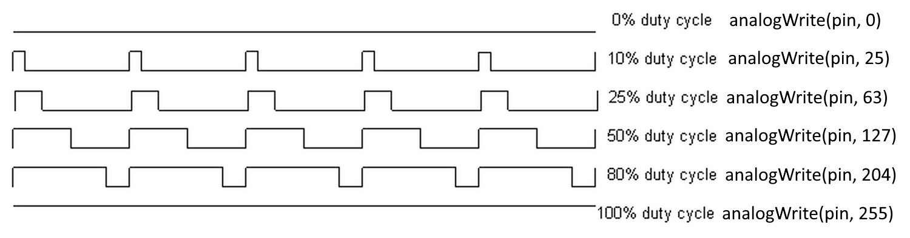

# AnalogWrite <!-- omit in toc -->

## Table des matières <!-- omit in toc -->
- [Introduction](#introduction)
- [PWM : C'est quoi??](#pwm--cest-quoi)
- [PWM : À quoi ça sert?](#pwm--à-quoi-ça-sert)
- [Références](#références)

---

# Introduction
La fonction `analogWrite()` permet d'écrire une valeur analogique en tant que signal [PWM](#pwm--cest-quoi) à une broche. Cette fonction prend deux paramètres: le numéro de la broche et la valeur à écrire. La valeur doit être comprise entre 0 et 255. La valeur 0 correspond à une tension de 0V et la valeur 255 correspond à une tension de 5V. La valeur 127 correspond à une tension de 2.5V.

Voici un exemple de code qui fait graduellement varier la tension d'une DEL sur la broche 9.


<table>
    <tr>
        <td>

```cpp
unsigned long lastTime = 0;
unsigned long interval = 4;
unsigned long currentTime = 0;
int brightness = 0;
int direction = 1;

int ledPin = 9;

void setup() {
    pinMode(ledPin, OUTPUT);
}

void loop() {
    currentTime = millis();

    // Gestion de la variation de la luminosité
    if (currentTime - lastTime >= interval) {
        lastTime = currentTime;
        brightness += direction;

        analogWrite(ledPin, brightness);

        if (brightness >= 255 || brightness <= 0) {
            direction *= -1;
        }
    }
}
```

</td>
<td></td>
</tr>
</table>

# PWM : C'est quoi??
Le PWM est une technique qui permet de simuler une tension analogique en utilisant une tension numérique. Le principe est de faire varier la tension numérique à une fréquence très élevée. La fréquence est si élevée que l'oeil humain ne peut pas la percevoir. La tension numérique est alors perçue comme une tension analogique.

PWM tient pour **P**ulse **W**idth **M**odulation. La modulation de largeur d'impulsion est une technique qui permet de faire varier la largeur d'un signal carré. Le signal carré est alors perçu comme une tension analogique.

Voici un aperçu du PWM avec différentes valeurs.


# PWM : À quoi ça sert?
Le PWM peut être utilisé à différentes fins. Il peut être utilisé pour faire varier la luminosité d'une DEL, la vitesse d'un moteur, la position d'un servo, etc.


# Références
- [Secrets of Arduino PWM](https://docs.arduino.cc/tutorials/generic/secrets-of-arduino-pwm)