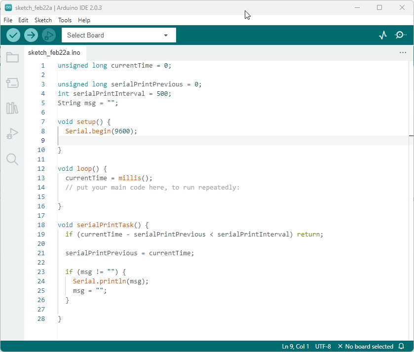
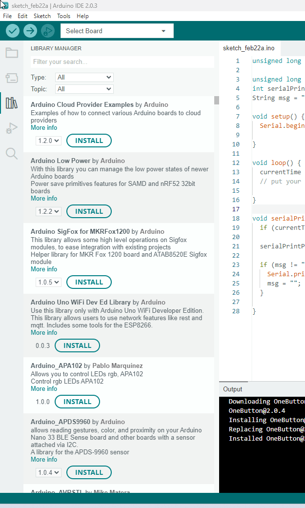

# Les librairies <!-- omit in toc -->

# Table des matières <!-- omit in toc -->
- [Introduction](#introduction)
- [Exemples de librairies Arduino](#exemples-de-librairies-arduino)
- [Comment utiliser une librairie Arduino](#comment-utiliser-une-librairie-arduino)
- [Utiliser les exemples](#utiliser-les-exemples)

---

# Introduction
Les librairies Arduino sont des ensembles de codes et de fonctions qui permettent d'ajouter de nouvelles fonctionnalités à votre projet. Elles ont été créées pour simplifier la tâche de programmation en offrant des fonctions déjà écrites pour l'utilisateur à utiliser dans son propre programme. Les librairies Arduino sont généralement créées par les utilisateurs d'Arduino ou par la communauté Arduino elle-même.

# Exemples de librairies Arduino
Voici quelques exemples de librairies Arduino courantes :

- `HCSR04` : Cette librairie permet de contrôler le capteur de distance à ultrasons HC-SR04 à partir de votre Arduino. Elle fournit des fonctions pour mesurer la distance entre le capteur et un objet.
- `Servo` : Cette librairie permet de contrôler les servomoteurs à partir de votre Arduino. Elle fournit des fonctions pour contrôler la position et la vitesse du servomoteur.
- `OneButton` : Cette librairie permet de contrôler les boutons à partir de votre Arduino. Elle fournit des fonctions pour détecter les appuis sur le bouton et les relâchements.
- `LiquidCrystal` : Cette librairie permet de contrôler les écrans LCD à partir de votre Arduino. Elle fournit des fonctions pour afficher du texte et des images sur l'écran LCD.
- `Wire` : Cette librairie permet de communiquer avec des appareils externes en utilisant le protocole I2C. Elle fournit des fonctions pour envoyer et recevoir des données sur un bus I2C.

# Comment utiliser une librairie Arduino
Pour utiliser une librairie Arduino, vous devez d'abord la télécharger et l'installer sur votre ordinateur. 

L'IDE Arduino possède un gestionnaire de librairies qui permet grandement de faciliter l'installation de celles-ci.

Pour activer le gestionnaire, il suffit de cliquer sur le bouton "Gestionnaire de bibliothèques" dans la barre d'outils de l'IDE Arduino.
> Au moment d'écrire ces lignes, c'est le 3e bouton à partir du haut

Une fois le gestionnaire ouvert, vous pouvez rechercher une librairie en utilisant le champ de recherche. Vous pouvez également parcourir les différentes catégories de librairies pour trouver celle qui vous intéresse.

Une fois que vous avez trouvé la librairie que vous voulez installer, vous pouvez l'installer en cliquant sur le bouton "Installer".

> **Note :** Il est important de bien lire la description de la librairie avant de l'installer. Certaines librairies peuvent être incompatibles avec votre projet.
> 
> **Astuce :** Écrivez le nom de la composante que vous voulez utiliser dans le champ de recherche pour trouver la librairie qui vous intéresse.

> **Note 2 :** Pour les travaux, j'indiquerai dans la description du travail les librairies à installer. Il y aura le nom de la **librairie** et du **créateur**.

Une fois que vous avez importé la librairie, vous pouvez utiliser les fonctions qu'elle offre dans votre programme. Les fonctions disponibles dépendent de la librairie que vous utilisez, alors consultez la documentation de la librairie pour connaître les fonctions disponibles et leur utilisation.

# Utiliser les exemples
Généralement, les créateurs de librairies fournissent des exemples pour vous aider à utiliser leurs librairies. Ces exemples sont des programmes qui utilisent les fonctions de la librairie pour réaliser des tâches spécifiques.

Ceux-ci sont très utiles pour apprendre à utiliser une librairie. Vous pouvez les utiliser comme point de départ pour votre propre projet.

Pour accéder aux exemples, vous devez cliquer sur "Fichier" dans la barre d'outils de l'IDE Arduino, puis sur "Exemples". Vous verrez alors une liste de tous les exemples disponibles. Pour accéder aux exemples d'une librairie en particulier, vous devez cliquer sur le nom de la librairie dans la liste.

En résumé, les librairies Arduino sont des outils puissants pour ajouter des fonctionnalités à votre projet. Pour les utiliser, vous devez les télécharger, les installer et les importer dans votre programme. Une fois que vous avez importé une librairie, vous pouvez utiliser les fonctions qu'elle offre pour simplifier votre code et accélérer le développement.