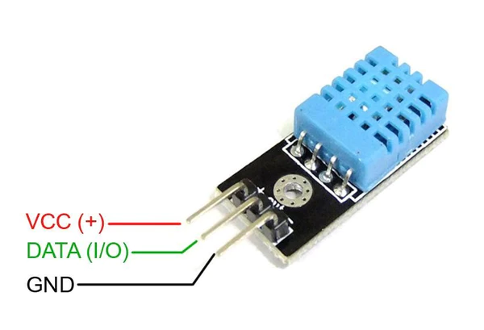
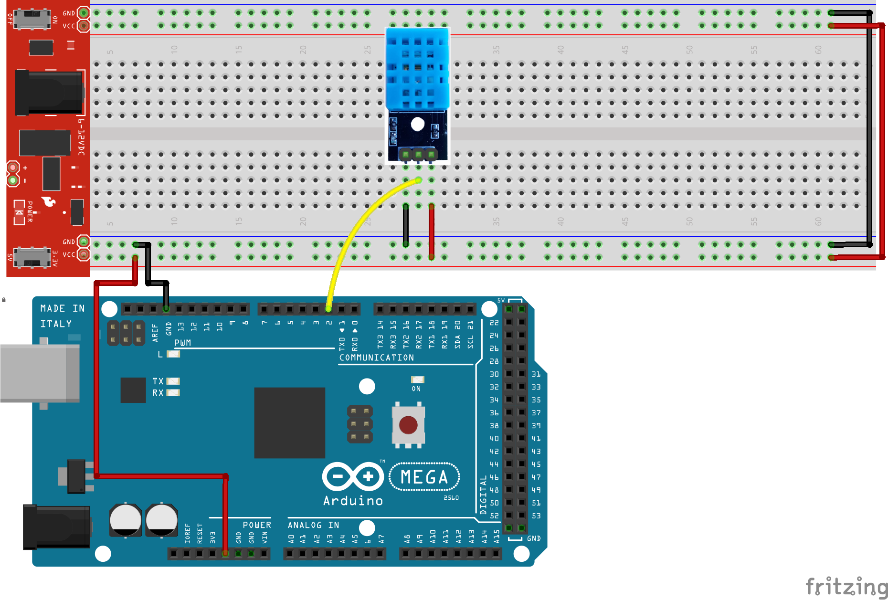
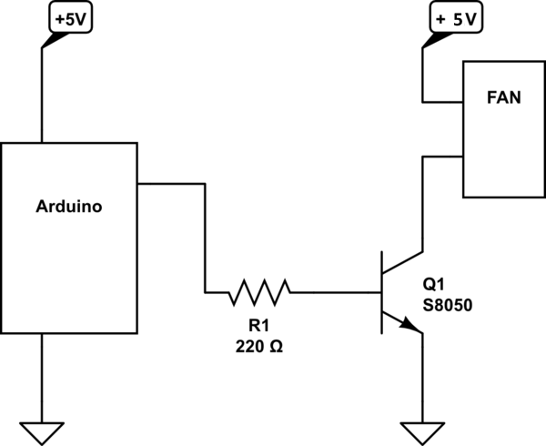
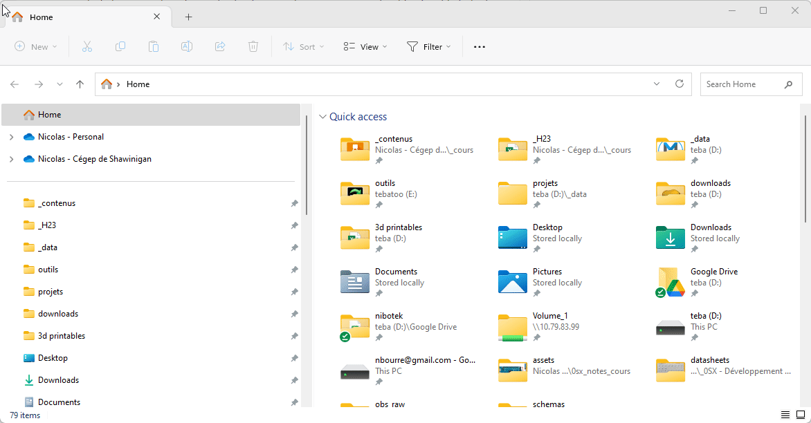
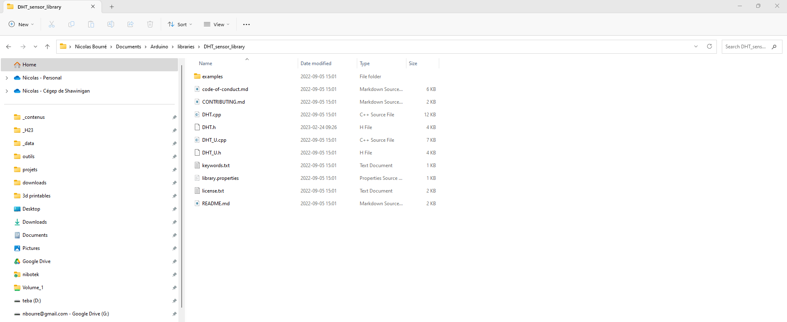

# Capteur de température et d'humidité DHT11 <!-- omit in toc -->


DHT-11 typique que l'on peut trouver sur le marché des hobbyistes.

# Table des matières <!-- omit in toc -->
- [Introduction](#introduction)
- [Utilité](#utilité)
- [Cas d'utilisation](#cas-dutilisation)
- [Exemples](#exemples)
  - [Branchement du capteur DHT11](#branchement-du-capteur-dht11)
  - [Mesure de température et d'humidité](#mesure-de-température-et-dhumidité)
  - [Exemple de contrôle d'un ventilateur](#exemple-de-contrôle-dun-ventilateur)
  - [Schéma pour brancher un ventilateur](#schéma-pour-brancher-un-ventilateur)
- [Fouiller dans une librairie](#fouiller-dans-une-librairie)
  - [Utilisation de la documentation](#utilisation-de-la-documentation)
  - [Lire le fichier .h](#lire-le-fichier-h)
- [Exercices](#exercices)
- [Références](#références)

---

# Introduction

Le capteur DHT11 est un capteur d'humidité et de température qui peut être utilisé avec l'Arduino Mega pour mesurer la température et l'humidité de l'environnement. Ce capteur utilise un signal numérique pour transmettre les données de température et d'humidité, et est facile à utiliser avec l'Arduino Mega.

---

# Utilité

Le DHT11 est souvent utilisé dans des projets de contrôle de l'environnement, comme le contrôle de la température et de l'humidité dans une serre ou une chambre de culture. Il peut également être utilisé pour mesurer la température et l'humidité dans un habitat, un laboratoire ou une cave à vin, par exemple.

# Cas d'utilisation

Le DHT11 peut être utilisé dans de nombreux projets différents, notamment :

- Projets de contrôle de l'environnement, tels que la surveillance de la température et de l'humidité dans une serre ou une chambre de culture.
- Projets de domotique, tels que le contrôle de la température et de l'humidité dans une maison ou un appartement.
- Projets de surveillance de l'environnement, tels que la surveillance de la température et de l'humidité dans une cave à vin ou un laboratoire.

# Exemples 

## Branchement du capteur DHT11

Voici le branchement typique du module DHT11



## Mesure de température et d'humidité

Dans cet exemple, nous allons utiliser le capteur DHT11 pour mesurer la température et l'humidité de l'environnement. Le code suivant permet de lire les données du capteur et de les afficher sur le moniteur série :

```cpp
#include "DHT.h"

#define DHTPIN 2
#define DHTTYPE DHT11   // DHT 11

unsigned long currentTime;

// Construction de l'objet
// dht
DHT dht(DHTPIN, DHTTYPE);

void setup() {
  Serial.begin(9600);
  Serial.println(F("DHTxx test!"));

  dht.begin();
}

void loop() {
  currentTime = millis();
  
  dhtTask(currentTime);
}

// Desc : Tâche de lecture du DHT11
// param:
//  now : temps actuel en millisecondes
// return : void
void dhtTask(unsigned long now) {
  static unsigned long lastTime = 0;
  const int rate = 2000;
  
  if (now - lastTime >= rate) {
    // La lecture de la température peut prendre jusqu'à
    // 2 secondes. C'est un capteur lent.
    
    // De plus, ce n'est pas vraiment utile de prendre
    // la température de l'air ampbiant fréquemment
        
    lastTime = now;
    
    
    // Lecture de l'humidité    
    float h = dht.readHumidity();
    
    // Lecture de la température en °C
    float t = dht.readTemperature();
    
    // Lecture de la température en °F (paramètre true)
    float f = dht.readTemperature(true);

    // Valider que toutes les lectures sont bonnes
    // Sinon on retourne plus tot.
    if (isnan(h) || isnan(t) || isnan(f)) {
      Serial.println(F("Echec de lecture du DHT!"));
      return;
    }

    // Calcule de l'indice humidex en °C
    // 3e paramètre : isFahreheit = false
    float hic = dht.computeHeatIndex(t, h, false);

    Serial.print(F("Humidite: "));
    Serial.print(h);
    Serial.print(F("%  Temperature: "));
    Serial.print(t);
    Serial.print(F("°C "));
    Serial.print(f);
    Serial.print(F("°F  Heat index: "));
    Serial.print(hic);
    Serial.println(F("°C "));
  }
}

```

Dans ce code, nous avons branché le module sur la broche 2. Nous avons également inclus la bibliothèque DHT, défini la broche à laquelle est connecté le capteur DHT11 et initialisé le moniteur série.

Cette bibliothèque nécessite que l'on définisse le type de module DHT utilisé. Dans notre cas, nous utilisons le DHT11. Il y a d'autres types de modules DHT, comme le DHT21 et le DHT22, qui sont également pris en charge par cette bibliothèque.

La boucle `loop()` commence par sauvegarder la valeur de la fonction millis() dans la variable currentTime. Ensuite, nous appelons la fonction `dhtTask()` en lui passant la valeur de currentTime en paramètre.

La fonction `dhtTask()` prend les lectures à toutes les 2 secondes et affiche les résultats dans le port série.

La librairie DHT fournit des fonctions pour lire la température et l'humidité. Nous utilisons la fonction `readHumidity()` pour lire l'humidité et la fonction `readTemperature()` pour lire la température. Ces fonctions retournent la valeur de l'humidité et de la température sous forme de nombre décimal.

> **Remarque**
> 
> On note la présence de la fonction `isNan()`. Cette fonction est utilisée pour s'assurer que la valeur en paramètre est numérique.
> 
> En programmation `NaN` signifie "*Not a Number*". Cela signifie que la valeur n'est pas un nombre. Dans notre cas, nous utilisons cette fonction pour vérifier que les valeurs de température et d'humidité sont correctes.

## Exemple de contrôle d'un ventilateur

Voici un exemple simple où l'on contrôle un ventilateur.

```cpp
#include "DHT.h"

#define DHTPIN 2
#define DHTTYPE DHT11   // DHT 11
#define FAN_PIN 8
#define TEMPERATURE_THRESHOLD 30

unsigned long currentTime;

// Construction de l'objet
// dht
DHT dht(DHTPIN, DHTTYPE);

void setup() {
  Serial.begin(9600);
  pinMode(FAN_PIN, OUTPUT);
}

void loop() {
  currentTime = millis();

  fanTask(currentTime);
}

// Tâche de contrôle du ventilateur
void fanTask(unsigned long now) {
  static unsigned long lastTime = 0;
  const int rate = 2000;

  if (now - lastTime >= rate) {
    lastTime = now;

    float temp = dht.readTemperature();

    if (temp > TEMPERATURE_THRESHOLD) {
      digitalWrite(FAN_PIN, HIGH);
      Serial.println("Ventilateur activé.");
    } else {
      digitalWrite(FAN_PIN, LOW);
      Serial.println("Ventilateur désactivé.");
    }
  }
}

```

Ce code lit la température du DHT11, active ou désactive le ventilateur en fonction de la température mesurée et affiche l'état du ventilateur sur le moniteur série.

On met un délai de 2000 ms, car la lecture de la température est plutôt l;lente et surtout on ne veut pas que le ventilateur s'active et se désactive trop rapidement.

En utilisant le capteur DHT11, nous pouvons facilement mesurer la température et l'humidité de l'environnement et réaliser des projets de contrôle de l'environnement tels que la surveillance de la température et de l'humidité dans une serre, une chambre de culture ou un habitat ou tout autre système nécessitant une surveillance de température.

## Schéma pour brancher un ventilateur
Voici un schéma électrique qui permet de brancher un ventilateur DC sur la carte Arduino avec le matériel dont vous disposez.



Matériel nécessaire :
- 1 x résistance 220 ohms
- 1 x moteur DC
- 1 x [transistor S8050](https://components101.com/transistors/s8050-transistor-pinout-equivalent-datasheet)

Branchement :
- Vous branchez la patte du milieu du transistor sur la résistance et celle-ci sur une broche de sortie de l'Arduino.
- La patte de gauche du transistor est reliée au ground.
- La patte de droite du transistor est reliée à la broche du moteur DC.

> **Important :** **Ne jamais brancher un moteur directement sur un port d'un microcontrôleur**. Vous risquez d'endommager le microcontrôleur.
> 
> 

> **Bloc science - Le transistor**
>
> Un transistor est un composant électronique utilisé pour amplifier ou commuter des signaux électroniques. Il est composé de trois broches : la base, l'émetteur et le collecteur. La base est la broche de commande, l'émetteur est la broche de sortie et le collecteur est la broche d'entrée.
> 
> Dans notre cas, sa principale utilisation est en tant qu'interrupteur. En effet, lorsque l'on met une tension sur la base, le transistor devient conducteur et permet le passage du courant du collecteur vers l'émetteur.
> 
> C'est un composant qui est très rapide. Aini, il est souvent utilisé pour contrôler la puissance fournie à une charge, telle qu'une LED ou un moteur. 
> 
> Dans le cas de l'exemple avec le ventilateur, le transistor est utilisé comme un interrupteur contrôlé par un signal de commande.

# Fouiller dans une librairie
Dans le premier exemple, vous avez probablement remarqué la fonction `computeHeatIndex()`. Celle-ci est fournit par la librairie `DHT.h`. Mais comment fait-on pour connaître les autres fonctions disponibles dans cette librairie?

## Utilisation de la documentation
La première étape est de consulter la documentation de la librairie. Dans bien des cas, la documentation est disponible sur le site de la librairie DHT.

En ouvrant le Gestionnaire de bibliothèques, vous pouvez accéder à la documentation d'une librairie en cliquant sur le lien "Plus d'informations".

## Lire le fichier .h
Parfois, il arrive que la documentation ne soit pas disponible. Dans ce cas, il faut fouiller dans le fichier .h de la librairie. Ce fichier contient toutes les fonctions et les variables publiques de la librairie.

Pour ce faire :
1. On recherche l'endroit où se retrouve les librairies installées. La plupart du temps sur Windows, on retrouve ce dossier dans
`%userprofile%\Documents\Arduino\libraries`. Dans ce dossier, on retrouve le dossier `DHT_sensor_library` qui contient le fichier `DHT.h`.<br/><br/>


2. Ensuite, on ouvre le fichier `.h` qui nous intéresse. Dans notre cas, on ouvre le fichier `DHT.h`. Cependant, je suggère d'utiliser un éditeur de texte avancé comme **Visual Studio Code**. Cet éditeur permet d'**ouvrir le dossier complet** et de naviguer dans les fichiers plus facilement. <br/><br/>
   

3. Par la suite, il suffit de jeter un coup d'oeil au fichier `.h` pour voir toutes les fonctions disponibles. <br/><br/>

---

# Exercices
1. Créez un programme qui affiche la température et l'humidité sur le moniteur série à toutes les 2 secondes.
   - Soufflez sur le capteur pour observer les effets.
2. Modifiez le code pour du ventilateur en le remplaçant par une DEL. La DEL doit s'allumer lorsque la température dépasse 30 °C et s'éteindre lorsque la température est inférieure à 30 °C.
3. Naviguez à travers le fichier `dht.h` et trouvez les différentes fonctions disponibles. Quelles sont les fonctions qui permettent d'obternir la température en incluant le facteur humidex?

---

# Références
- [Branchement ventilateur](https://electronics.stackexchange.com/questions/320908/s8050-bjt-is-rated-for-700-ma-but-gets-extremely-hot-when-powering-a-12-volt-700)