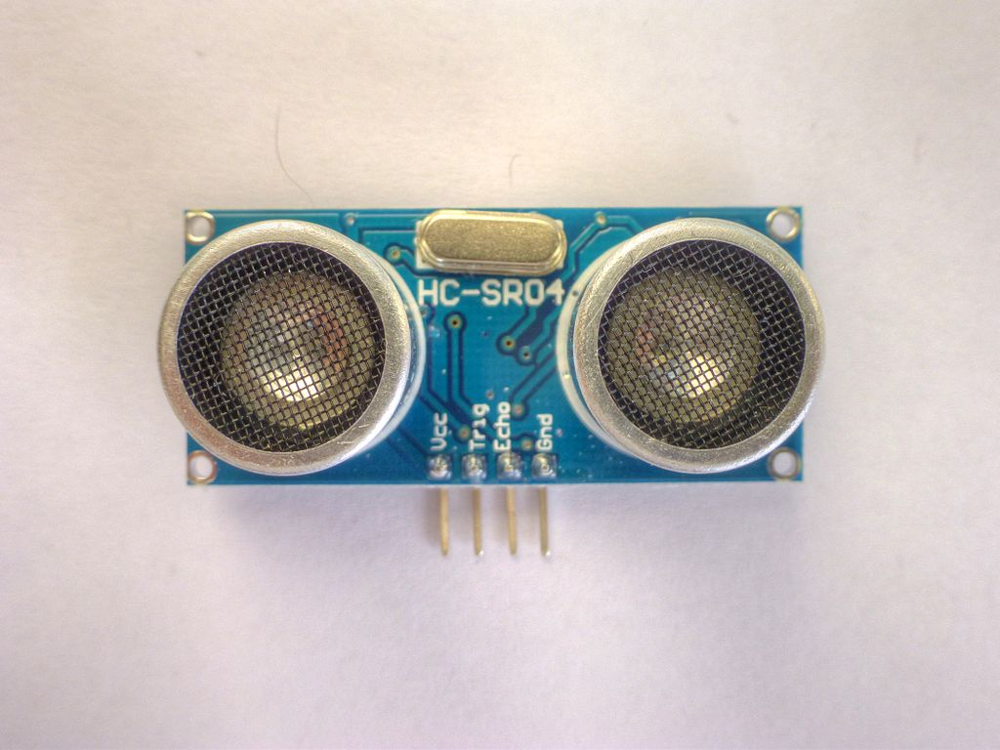
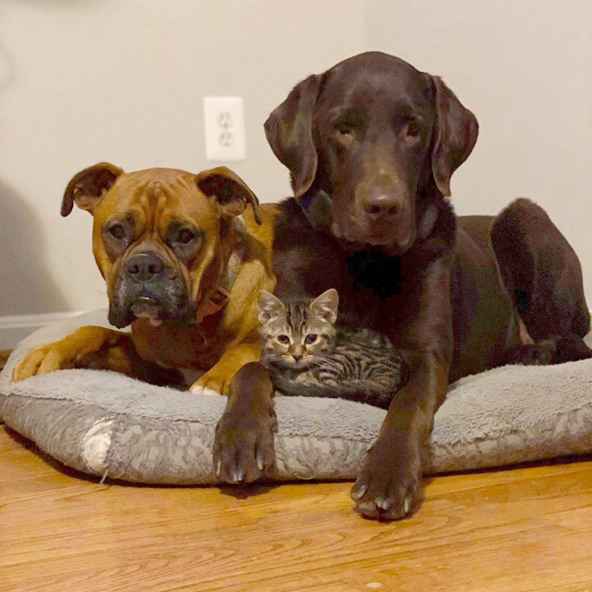
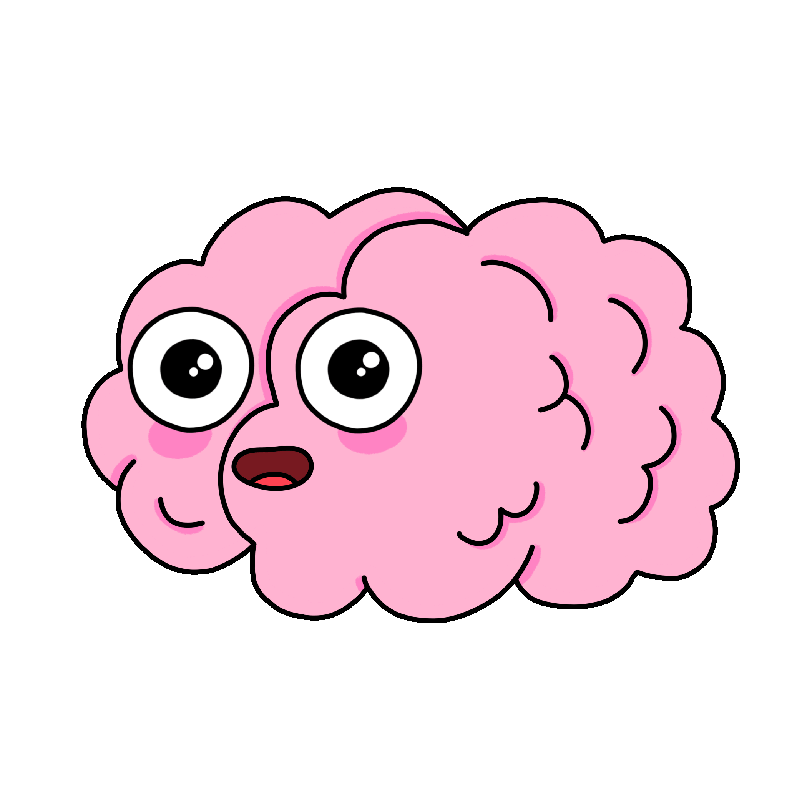

# Le capteur ultrasonique <!-- omit in toc -->


# Moment du secondaire : "Meh ça sert à quoi..." <!-- omit in toc -->

Au secondaire, vous avez tous déjà appris que le son avait une vitesse définie dans l'air soit environ $343 m/s$. Vous vous demandiez peut-être à quoi cela pouvait servir de le savoir? Eh bien, c'est justement ce que nous allons voir dans ce chapitre. Nous allons utiliser cette vitesse pour mesurer des distances.

# Table des matières <!-- omit in toc -->
- [Introduction](#introduction)
- [Fonctionnement du capteur HC-SR04](#fonctionnement-du-capteur-hc-sr04)
- [Utilisation du HC-SR04 avec Arduino](#utilisation-du-hc-sr04-avec-arduino)
- [Utilisation de la library HCSR04 de Gamegine](#utilisation-de-la-library-hcsr04-de-gamegine)
- [Conclusion](#conclusion)
- [Exercices](#exercices)
- [Annexe](#annexe)

---


# Introduction



Le HC-SR04 est un capteur de distance ultrasonique largement utilisé dans les projets électroniques. Il permet de mesurer des distances allant jusqu'à 4 mètres avec une grande précision et une faible consommation d'énergie. Dans cet article, nous allons examiner comment utiliser le capteur HC-SR04 avec un exemple pratique dans le cadre d'un projet Arduino.

Ce capteur est inclus dans votre kit de démarrage Arduino. Il est peu dispendieux. Vous pouvez également l'acheter sur [Amazon](https://a.co/d/1N6MgM1).

---

# Fonctionnement du capteur HC-SR04

Le HC-SR04 utilise des ondes sonores pour mesurer la distance entre le capteur et un objet. Le capteur émet un signal ultrasonique et attend que le signal soit réfléchi par un objet. Le temps qu'il faut pour que le signal revienne est ensuite mesuré. Cette mesure de temps peut être utilisée pour calculer la distance entre le capteur et l'objet.

Le HC-SR04 est composé de deux éléments principaux : l'émetteur ultrasonique et le récepteur ultrasonique. L'émetteur envoie une impulsion sonore de 40 kHz et le récepteur attend que l'impulsion soit réfléchie. Le temps entre l'envoi et la réception de l'impulsion est mesuré et utilisé pour calculer la distance.

> **Jargon** : Nous utilisons le terme *time-of-flight* pour les appareils mesurant les distances en mesurant le temps qu'il faut à un signal pour parcourir une distance. Les capteurs ultrasoniques sont des exemples de capteur *time-of-flight*.

> **Perle de culture** : Plusieurs espèces animales utilisent l'écholocation pour se déplacer dans l'obscurité. Les chauves-souris utilisent des ondes sonores pour localiser leurs proies. Les dauphins utilisent des ondes sonores pour localiser les poissons. Les chauves-souris et les dauphins utilisent des ondes sonores de fréquence élevée (ultrasoniques) pour écholocaliser.
> 
> Dans une autre veine, les humains ne sommes pas capables d'entendre les ondes sonores ultrasoniques. En effet, les ondes sonores ultrasoniques ont une fréquence supérieure à 20 kHz, ce qui est au-dessus de la fréquence maximale que l'oreille humaine peut entendre (20 kHz). Cependant, plusieurs animaux sont capables d'entendre les ondes sonores ultrasoniques. Dont les chats et les chiens.
> 

# Utilisation du HC-SR04 avec Arduino

Le HC-SR04 est compatible avec la plupart des cartes Arduino. Pour utiliser le capteur avec Arduino, nous devons d'abord connecter le capteur à la carte.

Les broches du capteur HC-SR04 sont étiquetées de manière explicite. Les deux broches latérales sont les broches d'alimentation (VCC et GND), la broche du milieu est la broche de déclenchement (Trig) et la broche en face de la broche de déclenchement est la broche d'écho (Echo).

Nous pouvons utiliser n'importe quelle broche numérique d'entrée/sortie de la carte Arduino pour se connecter à la broche de déclenchement et la broche d'écho du capteur. Pour notre exemple, nous allons utiliser les broches 9 et 10 de la carte.

```cpp

#define TRIGGER_PIN 9
#define ECHO_PIN 10

void setup() {
  Serial.begin(9600);

  // Configuration des broches
  pinMode(TRIGGER_PIN, OUTPUT);
  pinMode(ECHO_PIN, INPUT);
}

void loop() {
  long duration, distance;

  digitalWrite(TRIGGER_PIN, LOW);
  delayMicroseconds(2);
  digitalWrite(TRIGGER_PIN, HIGH);
  delayMicroseconds(10);
  digitalWrite(TRIGGER_PIN, LOW);

  duration = pulseIn(ECHO_PIN, HIGH);
  distance = (duration / 2) * 0.0343;

  Serial.print("Distance: ");
  Serial.print(distance);
  Serial.println(" cm");
  delay(1000);
}

```

Notre programme commence par initialiser les broches de la carte Arduino pour la communication avec le capteur. La broche de déclenchement est configurée en sortie et la broche d'écho est configurée en entrée.

Le capteur est déclenché en envoyant une impulsion de 10 microsecondes sur la broche de déclenchement. Le capteur attend ensuite que l'impulsion soit réfléchie par un objet et mesure le temps qu'il faut pour que le signal revienne sur la broche d'écho. La distance est ensuite calculée en utilisant la formule suivante :

```cpp
distance = (duration / 2) * 0.0343
```

La durée mesurée est divisée par deux car le signal ultrasonique doit parcourir la distance de l'objet deux fois (aller et retour). Le résultat est ensuite multiplié par 0.0343, qui est la vitesse de propagation du son en centimètres par microseconde.

La distance mesurée est ensuite affichée sur le moniteur série de la carte Arduino.

> **Rappel des sciences du secondaire**
>  
> La vitesse du son est de 343 m/s au niveau de la mer. La vitesse du son en centimètres par microseconde est donc de 0.0343 cm/µs.

# Utilisation de la library HCSR04 de Gamegine
Voici un exemple d'utilisation de la librairie "hcsr04" de Gamegine pour mesurer la distance à l'aide du capteur HC-SR04 avec une carte Arduino.

Tout d'abord, nous devons installer la librairie. Pour ce faire, ouvrez l'IDE Arduino et suivez ces étapes :

- Cliquez sur "Gérer les bibliothèques" (Manage Libraries)
- Recherchez "hcsr04" dans la barre de recherche.
- Assurez-vous que la librairie soit celle de Gamegine.
- Sélectionnez la librairie `HCSR04` et cliquez sur "Installer" (Install).

Une fois la librairie installée, connectez le capteur HC-SR04 à la carte Arduino comme indiqué dans l'article précédent.

Voici le code pour mesurer la distance avec la librairie `HCSR04` :

```cpp
#include <HCSR04.h>

#define TRIGGER_PIN 9
#define ECHO_PIN 10

HCSR04 hc(TRIGGER_PIN, ECHO_PIN);

void setup() {
  Serial.begin(9600);
}

void loop() {
  float distance = hc.dist();
  Serial.print("Distance:");
  Serial.println(distance);
  delay(100);
}
```

[Hcsr04 Example-1.webm](https://user-images.githubusercontent.com/2332679/220739389-57b4cfe0-2dd2-4353-b683-6010c929af1f.webm)


Le code commence par inclure la bibliothèque `HCSR04` et définir les broches de la carte Arduino à utiliser pour la communication avec le capteur HC-SR04. On crée ensuite un **objet** nommé `hc` de la **classe** `HCSR04` avec les broches de déclenchement et d'écho.

Dans la fonction "loop", la distance est mesurée en appelant la fonction "distance()" de la classe `HCSR04`. La distance mesurée est ensuite affichée sur le moniteur série.

En utilisant la librairie "hcsr04", il est possible de mesurer la distance avec le capteur HC-SR04 en utilisant moins de code et avec une plus grande facilité.

---

# Conclusion

Le capteur HC-SR04 est un composant électronique utile pour mesurer la distance dans les projets Arduino. Il est facile à utiliser et permet de mesurer des distances avec une grande précision. En utilisant ce capteur avec un écran LCD, il est possible de créer des projets pratiques tels que le contrôle de la distance de sécurité entre une voiture et un obstacle.

---

# Exercices
1. Réaliser un programme qui mesure la distance à l'aide du capteur HC-SR04 et qui affiche le résultat dans le moniteur série à toutes les 100 ms.

# Annexe

> ***Food for thought*!! -- Les classes et les objets**
> 
> 
> 
> Deux nouveaux termes utilisés dans ce chapitre soit **objet** et **classe**.
> 
> Commençons tout d'abord par le terme **classe**. Une classe est un modèle qui décrit les caractéristiques et les comportements d'un objet. Par exemple, une classe `Voiture` décrit les caractéristiques et les comportements d'une voiture. Une voiture peut avoir des caractéristiques telles que la couleur, la marque, le nombre de portes, etc. Une voiture peut avoir des comportements tels que démarrer, accélérer, freiner, etc.
>
> L'**objet** est une **instance** de la classe. Par exemple, une voiture rouge de marque Toyota avec 4 portes est un objet de la classe `voiture`. Une autre voiture bleue de marque Honda avec 2 portes est un autre objet de la classe `Voiture`.
>
>  
> **Une classe est un type complexe de données qui peut contenir des variables et des fonctions.**
>
> **Un objet est l'équivalent d'une variable, mais pour une classe**.
> 
> Vous entendrez éventuellement le verbe **instancier**. Cela veut simplement dire "*créer un objet à partir d'une classe*".