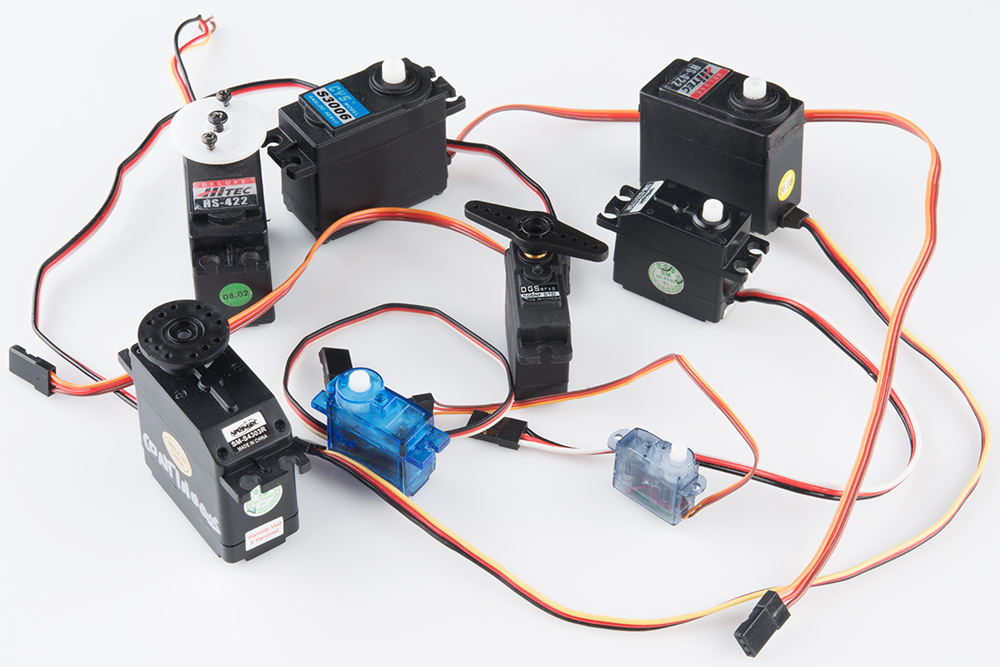

# La machine à états finis <!-- omit in toc -->

# Table des matières <!-- omit in toc -->
- [Introduction](#introduction)
- [Pourquoi utiliser une machine à états finis?](#pourquoi-utiliser-une-machine-à-états-finis)
- [Utilisation](#utilisation)
- [Exercices](#exercices)
- [Références](#références)

---

# Introduction

note à moi-même recopier la matière de robotique

---

# Pourquoi utiliser une machine à états finis?

--

# Utilisation

---

# Exercices

---

# Références