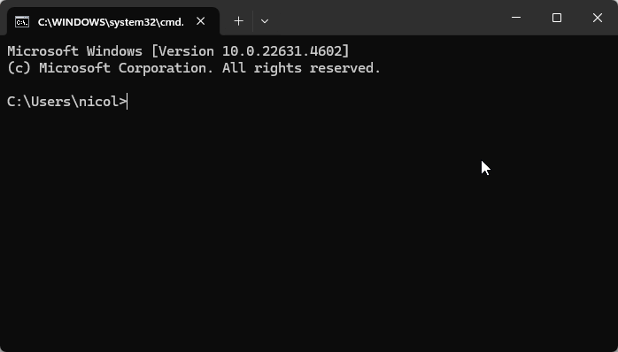
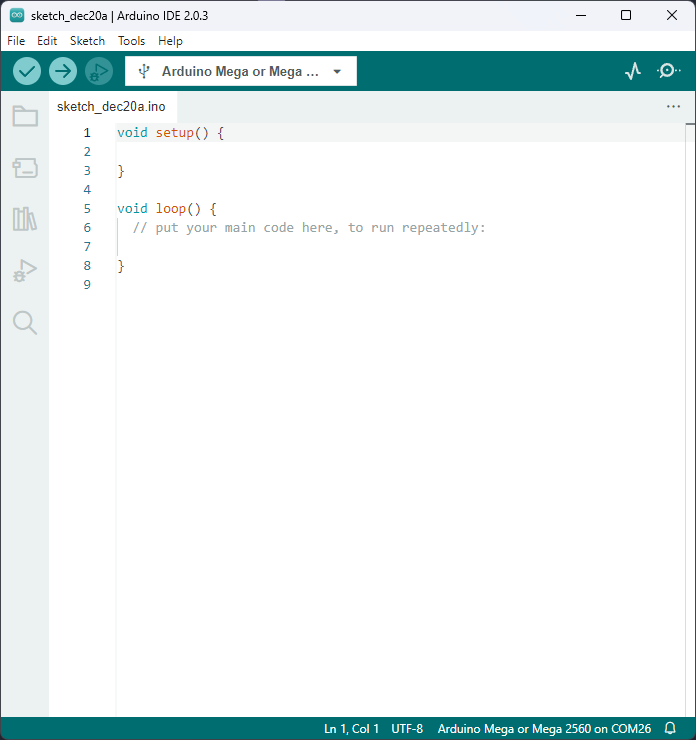
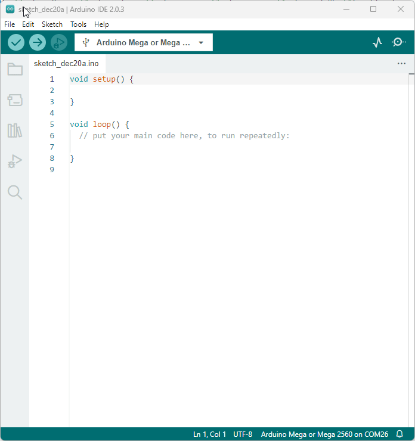
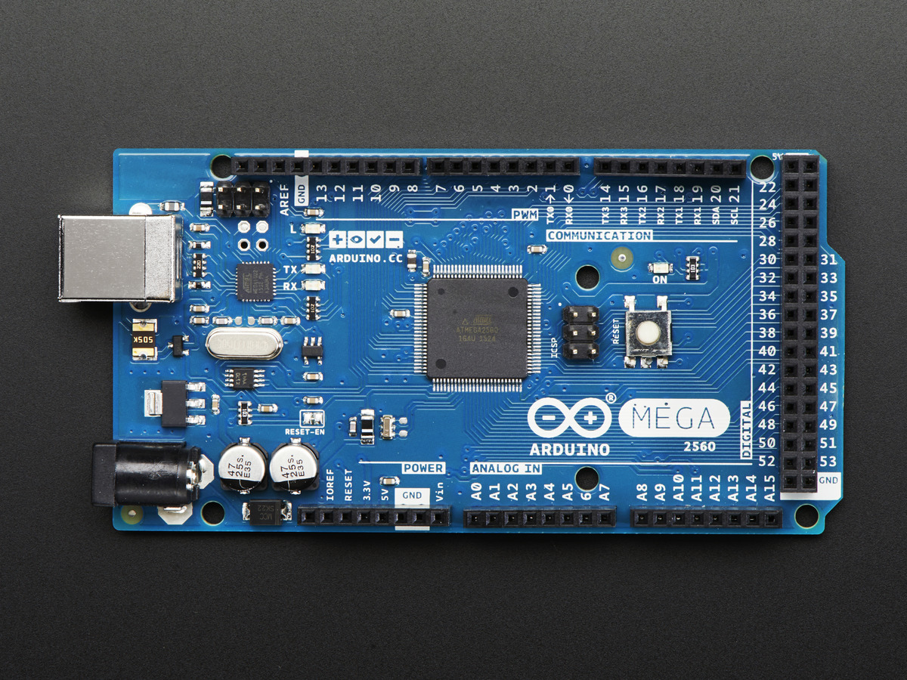
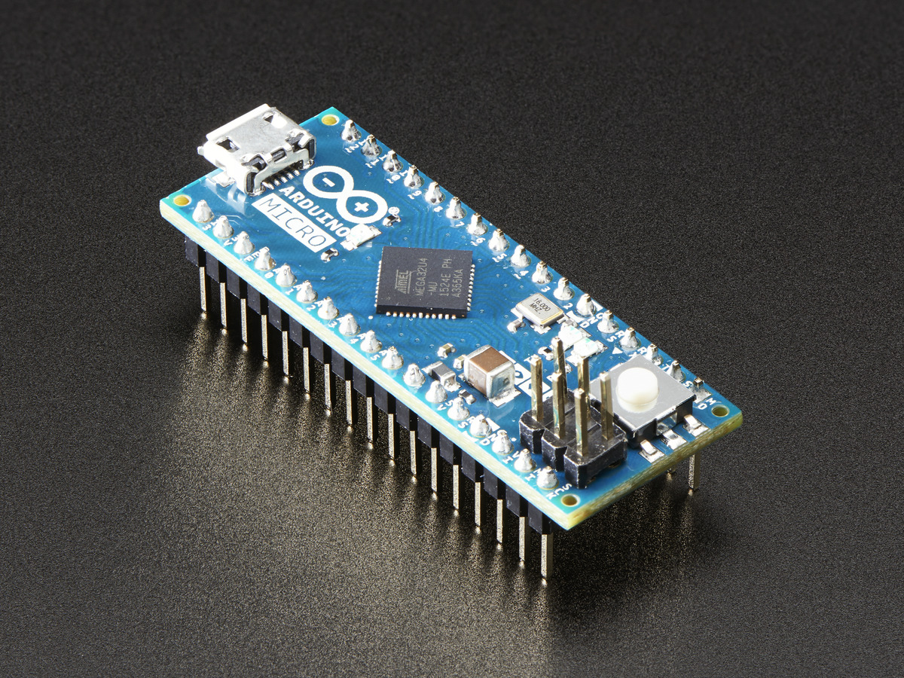
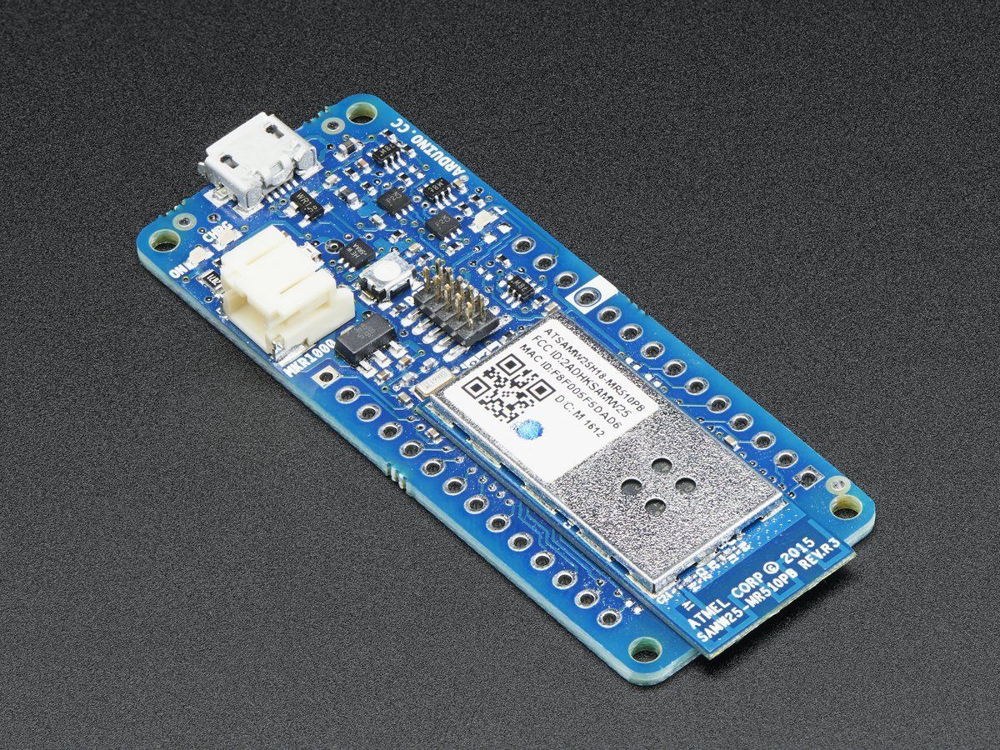
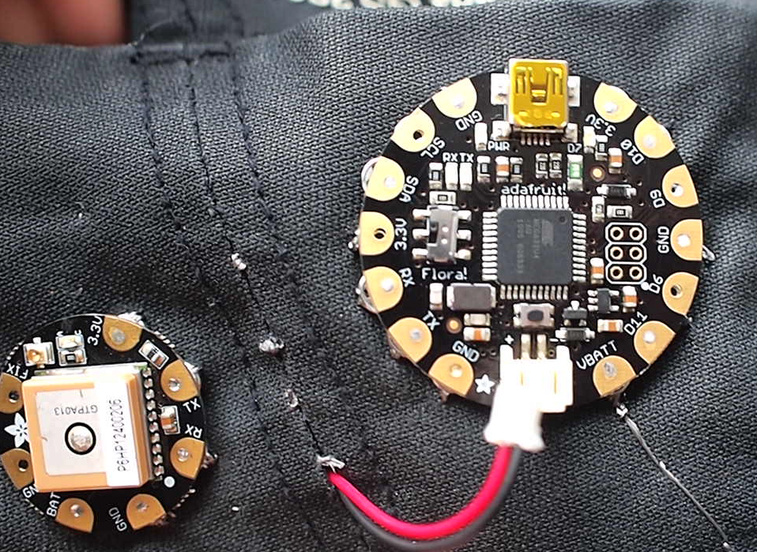

# Introduction <!-- omit in toc -->

- [Les premiers pas](#les-premiers-pas)
  - [Moodle](#moodle)
  - [Installation de Git](#installation-de-git)
    - [Tester si Git est déjà installé](#tester-si-git-est-déjà-installé)
    - [Installation de Git (Si nécessaire)](#installation-de-git-si-nécessaire)
  - [Compte GitHub](#compte-github)
  - [Logiciel](#logiciel)
  - [Configuration du matériel](#configuration-du-matériel)
  - [Installation des pilotes - Si nécessaire](#installation-des-pilotes---si-nécessaire)
- [À propos de cette leçon](#à-propos-de-cette-leçon)
- [Les communautés Arduino](#les-communautés-arduino)
- [Qu'est-ce qu'un Arduino?](#quest-ce-quun-arduino)
- [Quel Arduino?](#quel-arduino)
  - [Raspberry Pi](#raspberry-pi)
- [La différence entre les microcontrôleurs vs les microprocesseurs](#la-différence-entre-les-microcontrôleurs-vs-les-microprocesseurs)
  - [Générale](#générale)
  - [Puissance de calcul](#puissance-de-calcul)
  - [Mémoire](#mémoire)
  - [Système d'exploitation](#système-dexploitation)
  - [Consommation d'énergie](#consommation-dénergie)
  - [Coût](#coût)
  - [Utilisations](#utilisations)
  - [Résumé](#résumé)
- [Le matériel du cours](#le-matériel-du-cours)
  - [Achat](#achat)
- [Exercices](#exercices)
- [Exemple de questions pour une évaluation](#exemple-de-questions-pour-une-évaluation)
- [Références](#références)

---

# Les premiers pas
## Moodle
Pour avoir accès à certaines de mes notes ou évaluations, vous devrez avoir un compte Moodle et être inscrit à mon cours.

- **Lien vers le cours** : [Moodle](https://moodle.cshawi.ca/mod/page/view.php?id=9499&forceview=1)
- **Code pour le cours** : `cowabunga!`

<!-- ## Teams
Pour avoir accès à certaines de mes notes Office, vous devez être dans le Teams du cours.

- **Lien vers [Teams](https://teams.microsoft.com/l/team/19%3aMAZuLdF2Thx9FkXHF9_mGFCZCWK-L2k1FJXH2zkjL7k1%40thread.tacv2/conversations?groupId=d000a4c4-3d3d-4b05-af28-3d69589e53d3&tenantId=b03caa02-c798-45ad-a2bd-41c7e4851423)** -->

## Installation de Git
Vous devrez installer l'application Git sur votre ordinateur. Git est un logiciel de gestion de versions. Il est utilisé pour suivre les modifications apportées à un projet.

Il s'agit d'un outil **primordial pour les développeurs**. Vous devrez l'utiliser très fréquemment tout au long de votre parcours. Vous aurez un cours sur Git plus tard dans votre parcours.

### Tester si Git est déjà installé
1. Ouvrir un terminal
   1. Sur Windows, appuyez sur <kbd>Win</kbd> + <kbd>R</kbd>, tapez `cmd` et appuyez sur `Enter`.
2. Tapez la commande suivante et appuyez sur `Enter` :
   ```bash
   git --version
   ```
   
  

3. Si Git est installé, vous devriez voir la version de Git s'afficher. Sinon, vous verrez un message d'erreur et vous devrez installer Git.


### Installation de Git (Si nécessaire)

Vous pouvez le télécharger [**ici**](https://git-scm.com/).

https://github.com/user-attachments/assets/80e18aa8-df44-4598-b647-29d3efd276d4

## Compte GitHub
Si vous n'en n'avez pas encore, vous devez créer un compte GitHub. Vous pouvez le faire [**ici**](https://github.com/).

GitHub est un site permettant aux développeurs de partager leur code. Il est utilisé par de nombreux développeurs et est un outil très utile pour les projets de programmation. D'ailleurs, plusieurs enseignants utilisent GitHub pour partager leurs codes avec leurs étudiants.

Tout au long de votre parcours académique, vous devrez créer des projets et les envoyer sur GitHub. Vous devrez aussi cloner des projets de vos profs et les modifier.

## Logiciel
Vous devez installer le logiciel Arduino sur votre ordinateur. Vous pouvez le télécharger [ici](https://www.arduino.cc/en/Main/Software).

Vous devez télécharger la version Windows avec MSI Installer. Cliquez sur le lien pour télécharger le fichier. Une fois le fichier téléchargé, lancez l'installation.

## Configuration du matériel
Vous avez devant vous une plaque de développement Arduino. Il s'agit du même kit que vous devez vous procurer pour ce cours. Il est composé de deux parties : la carte Arduino et la plaque de support.

Branchez le câble USB de la carte Arduino à votre ordinateur. Vous devriez voir une petite lumière verte s'allumer sur la carte. Cela signifie que la carte est alimentée. Toutefois, cela ne signifie pas que la carte est prête à être utilisée.

En effet, on doit s'assurer que les pilotes sont installés.

Pour vérifier si les pilotes sont installés, ouvrez le logiciel Arduino. Vous devriez voir une fenêtre comme celle-ci :



Maintenant, sélectionnez la barre défilante située dans la barre d'outils.



Si les pilotes sont installés, vous devriez voir dans la liste déroulante le nom de votre carte Arduino avec le port qui lui est assigné. Dans mon cas, c'était "Arduino Mega or Mega 2560" sur le `COM26` de mon ordinateur. Le numéro du port peut varier selon votre ordinateur.

> **Note :** `COM` est le préfixe donné pour les ports de communication sur les PC Windows. Il peut y avoir plusieurs ports de communication sur un ordinateur. Ceux-ci sont utilisés pour connecter des périphériques externes à l'ordinateur. Par exemple, un clavier, une souris, une imprimante, etc. Les numéros sont attribués en fonction de l'ordre de connexion des périphériques.

## Installation des pilotes - Si nécessaire
Généralement, Windows installe les pilotes automatiquement. Cependant, si ce n'est pas le cas, vous devez installer les pilotes manuellement.

Je vous invite à suivre la procédure sur ce site (Anglais): [Sparkfun - How to install CH340 Drivers](https://learn.sparkfun.com/tutorials/how-to-install-ch340-drivers/all)

---

# À propos de cette leçon
Cette leçon n'enseigne pas vraiment l'électronique. Elle sert plutôt à s'assurer que tout est prêt pour les prochaines leçons. Elle permettra de vérifier que la carte fonctionne comme prévu et que l'ordinateur que vous utilisez est compatible.

Considérez ce tutoriel comme la "base" de votre voyage. Si les choses se compliquent, revenez ici et revérifiez cette leçon!

L'une des compétences les plus importantes que vous devrez apprendre est que, lorsque les choses tournent mal (et il y en aura beaucoup), vous devez revenir aux hypothèses les plus fondamentales. C'est un peu l'équivalent du "tu es sûr que c'est allumé" en électronique. Il est surprenant de voir combien d'ingénieurs qualifiés passent des heures à déboguer un circuit pour se rendre compte que... ce n'était pas branché!

J'ai fait un petite procédure de dépannage pour l'Arduino. Vous pouvez la consulter [ici](../extras/depannage.md). Celle-ci sera nourrie au fur et à mesure que nous avancerons dans le cours.

---

# Les communautés Arduino
Avant de débuter, je vous invite à vous joindre une des différentes communautés Arduino. Ce sont pour la plupart des communautés très actives et il y a beaucoup de ressources disponibles.

Voici une liste de différentes communautés Arduino. Vous pouvez les consulter pour trouver des projets intéressants à faire ou encore trouver de l'aide pour vos projets.

- [Serveurs Discord - Français](https://disboard.org/servers/tag/arduino?fl=fr)
  - [Anglais](https://disboard.org/servers/tag/arduino?fl=en)
- [Reddit - Arduino](https://www.reddit.com/r/arduino/)
- [Youtube - Ingéniérie et Projets](https://www.youtube.com/@Ingenierie-Projets)
  - L'ordre de la playlist n'est pas fameuse
- [Zeste de Savoir - Arduino](https://zestedesavoir.com/tutoriels/686/arduino-premiers-pas-en-informatique-embarquee/)
  - [Playlist Youtube](https://www.youtube.com/playlist?list=PLNBsspAtBwlL7lw9HI50YE3WJKY5us-cn)

---


# Qu'est-ce qu'un Arduino?

Arduino est le nom de la petite carte de circuit électronique que vous allez utiliser comme outil pour étudier et explorer la programmation et l'électronique.

Elle est fabriquée par arduino.cc, une société dirigée par Massimo Banzi, PDG d'Arduino. Voici comment ils se décrivent :

> Arduino est une plateforme de prototypage open-source basée sur du matériel et des logiciels faciles à utiliser. Les cartes Arduino sont capables de lire des entrées - de la lumière sur un capteur, un doigt sur un bouton ou un message Twitter - et de les transformer en une sortie - activer un moteur, allumer une LED, publier quelque chose en ligne. Vous pouvez indiquer à votre carte ce qu'elle doit faire en envoyant un ensemble d'instructions au microcontrôleur de la carte. Pour ce faire, vous utilisez le langage de programmation Arduino (basé sur Wiring), et le logiciel Arduino (IDE).
> 
> Au fil des ans, Arduino a été le cerveau de milliers de projets, des objets du quotidien aux instruments scientifiques complexes. Une communauté mondiale de  fabricants - étudiants, amateurs, artistes, programmeurs et professionnels - s'est rassemblée autour de cette plateforme open-source. Leurs contributions ont permis d'accumuler une quantité incroyable de connaissances accessibles qui peuvent être d'une grande aide pour les novices comme pour les experts.

**TL;DR :** Arduino est une carte de circuit électronique qui peut être programmée pour faire des choses. Il y a une communauté de gens qui partagent leurs projets et leurs connaissances sur Arduino.

> **Jargon web** :
> tl;dr : "too long; didn't read" - "trop long, j'ai pas lu" - en gros, c'est une abréviation pour dire que le texte est trop long et que vous n'avez pas le temps de le lire. C'est une expression utilisée sur internet pour dire que vous n'avez pas le temps de lire un texte trop long. **On l'utilise aussi pour signifier un résumé d'un texte trop long.**

# Quel Arduino?
Au cours des dix années qui ont suivi la sortie d'Arduino, il y a eu une énorme prolifération de centaines de "cartes Arduino" différentes disponibles. D'un côté, il existe un Arduino pour chaque type d'application spécialisée, mais d'un autre côté, cela peut devenir assez confus!

Dans ce cours, nous allons nous concentrer sur l'**Arduino Mega** qui est un Arduino plus puissant que l'Arduino UNO. Elle est en fait sa grande soeur. Elle est plus puissante et plus rapide avec une tonne de mémoire et de broches en plus, et une puce différente, l'ATmega2560. C'est une bonne mise à jour lorsqu'un projet ne rentre plus dans un UNO.



Au fur et à mesure, vous découvrirez qu'il y a peut-être d'autres compatibles Arduino que vous pourriez vouloir !

<table>
  <tr>
    <td></td>
    <td>L'Arduino UNO est un classique, elle est de loin la plus populaire. Elle est basique et bien supportée.</td>
  </tr>
  <tr>
    <td></td>
    <td>L'Arduino Micro, par contre... est un peu plus petit! Il a une puce Atmega32u4 différente qui peut faire de l'USB natif et peut donc agir comme un clavier ou une souris. Il est fin et possède des connecteurs à broche descendante pour pouvoir le brancher sur une planche à pain.</td>
  </tr>
  <tr>
    <td></td>
    <td>L'Arduino MKR1000 ressemble un peu à un Arduino Micro mais possède une puce ATSAM ARM 32 bits plus puissante et un WiFi intégré! Une excellente mise à niveau pour les projets liés à l'Internet des objets.</td>
  </tr>
  <tr>
    <td></td>
    <td>Il y a aussi les Arduino-compatibles comme le Flora qui est fabriqué par Adafruit. C'est un Arduino rond et portable et plutôt que d'utiliser des fils, vous pouvez le coudre dans les vêtements pour des projets électroniques portables.</td>
  </tr>
</table>

## Raspberry Pi
Certains d'entre vous ont peut-être déjà entendu parler du Raspberry Pi ou même en possèdent un. Toutefois, il s'agit d'un tout autre type de carte que l'Arduino.

Le Raspberry Pi (rpi) est une carte de développement qui est très populaire pour les projets de programmation. Il est plus puissant que l'Arduino et peut être utilisé pour faire beaucoup de choses tel qu'un serveur web, de musique, de vidéos, etc. Il est également beaucoup plus cher que l'Arduino.

En plus des différentes versions, il y a plusieurs éditions de rpi.

- Raspberry Pi : Ordinateur sur carte (SBC : Single Board Computer) avec différents modèles de RAM et de stockage.
- Raspberry Pi Zero : Comme le Raspberry Pi, mais plus petit, moins cher et moins puissant.
- Raspberry Pi Zero W : Comme le Zero, mais avec un module WiFi et Bluetooth intégré.
- Raspberry Pi 400 : Comme le Raspberry Pi, mais avec un clavier intégré.
- Raspberry Pi Pico : Il s'agit d'une carte de développement avec un microcontrôleur similaire au Arduino Nano, mais plus puissant.
- Raspberry Pi Pico W : Comme le Pico, mais avec un module WiFi et Bluetooth intégré.

Nous sommes rendu à la 5e version du rpi.

---

# La différence entre les microcontrôleurs vs les microprocesseurs
Nous associons souvent les termes microprocesseur et microcontrôleur, et les utilisons même parfois de manière interchangeable. Cependant, ceux qui comprennent vraiment ces deux puces savent qu'il existe des distinctions claires, malgré certaines caractéristiques communes.

## Générale
Les microprocesseurs et les microcontrôleurs sont les composants internes des appareils électroniques. Un microprocesseur est une minuscule unité de traitement à l'intérieur d'un processeur. Il s'agit d'un circuit intégré unique sur une puce informatique qui exécute diverses fonctions arithmétiques et logiques sur des signaux numériques. Plusieurs dizaines de microprocesseurs fonctionnent ensemble au sein de serveurs très performants pour le traitement des données et l'analytique.

En revanche, un microcontrôleur est l'unité informatique de base des appareils électroniques intelligents tels que les machines à laver et les thermostats. Il s'agit d'un tout petit ordinateur doté de sa propre RAM, de sa propre ROM et de ses propres systèmes d'E/S, le tout intégré sur une seule puce. Il peut traiter des signaux numériques et répondre aux entrées de l'utilisateur, mais sa capacité de calcul est limitée.

**Résumé**
- Les microprocesseurs sont des puces informatiques qui exécutent diverses fonctions arithmétiques et logiques sur des signaux numériques et conçues pour être multi-tâches.
- Les microcontrôleurs sont des puces informatiques qui sont conçues pour être intégrées dans des appareils ou des systèmes de contrôle.


## Puissance de calcul
Les microprocesseurs sont les grands gagnants en termes de puissance de calcul brute. De nos jours, les vitesses d'horloge peuvent aller de 1 à près de 4 GHz. Cela permet aux microprocesseurs de calculer très rapidement et d'exécuter des opérations efficacement. **Associés aux périphériques et aux dispositifs externes appropriés, les microprocesseurs conviennent à toutes les applications; rien n'est prédéfini.**

**Les microcontrôleurs**, en revanche, sont limités en termes de performances et de vitesse, principalement en raison de leur taille. En effet, ils **sont destinés à exécuter les mêmes tâches de base.** Ils sont donc plus rentables pour leur application et sont généralement cadencés à des vitesses beaucoup plus faibles que les microprocesseurs.

**Résumé**
- Les microprocesseurs sont plus puissants que les microcontrôleurs.
- Les microcontrôleurs sont spécialisés pour une tâche spécifique.

## Mémoire
**La mémoire d'un microprocesseur est connectée à l'extérieur**. Cela permet de concevoir des systèmes personnalisés et de les mettre à niveau facilement. Comme la mémoire est externe, c'est à l'utilisateur de choisir la taille et la vitesse de la RAM et de la ROM pour le système (La ROM est intégrée sur la carte-mère).

**Cela diffère des microcontrôleurs, où la mémoire est intégrée avec l'unité centrale dans la puce elle-même.** Cela limite la taille de la mémoire; la mémoire flash d'un microcontrôleur est souvent limitée à 2 Mo seulement. Cependant, comme la mémoire et l'unité centrale sont étroitement intégrées, les vitesses de fonctionnement de la mémoire peuvent être légèrement plus rapides dans un microcontrôleur.

**Résumé**
- Les microprocesseurs doivent être connectés à la mémoire externe.
- Les microcontrôleurs ont la mémoire intégrée.

## Système d'exploitation
Comme ils ne sont pas destinés à une tâche spécifique, **les microprocesseurs sont souvent associés à des systèmes d'exploitation** complexes pour une fonctionnalité générique. Les systèmes d'exploitation comme Windows, Linux, MacOS et Android sont comparativement gourmands en ressources et ne peuvent donc fonctionner que sur un microprocesseur. Si cela signifie que l'utilisation d'un microprocesseur vous permet d'accomplir diverses tâches, cela signifie également que vous avez besoin d'un logiciel complexe pour vos opérations.

**Les microcontrôleurs, en revanche, n'ont généralement pas besoin d'un système d'exploitation complet pour fonctionner, leurs applications s'exécutant directement sur un micrologiciel.** Cela signifie généralement qu'un microcontrôleur est facile à programmer, notamment pour les petites applications répétitives. Il est également possible d'utiliser des systèmes d'exploitation en temps réel (RTOS) avec certains microcontrôleurs de niveau supérieur pour les applications qui nécessitent un système de contrôle plus complexe. Cependant sur le Arduino, l'utilisation d'un système d'exploitation est très limité.

**Résumé**
- Les microprocesseurs ont besoin d'un système d'exploitation générique.
- Les microcontrôleurs n'ont pas besoin d'un système d'exploitation, mais d'un micrologiciel ou d'un système d'exploitation en temps réel.

## Consommation d'énergie
**Les microprocesseurs consomment plus d'énergie** par rapport à l'efficacité de la puce unique d'un microcontrôleur. Cela ne devrait pas surprendre, car les microprocesseurs fonctionnent à des vitesses beaucoup plus élevées et sont interfacés avec des composants externes. Vous trouverez rarement des microprocesseurs dans des applications où une faible consommation d'énergie est requise.

**Les microcontrôleurs consomment très peu d'énergie** car ils sont conçus pour une tâche spécifique et peuvent donc être configurés avec les seuls composants nécessaires. Cela permet d'économiser beaucoup d'énergie, c'est pourquoi vous trouverez souvent des microcontrôleurs au cœur des appareils alimentés par batterie.

**Résumé**
- Les microprocesseurs consomment plus d'énergie que les microcontrôleurs.
- Les microcontrôleurs consomment très peu d'énergie.

## Coût
Les microprocesseurs sont le summum de la puissance de traitement, et sont donc plus chers que les microcontrôleurs. En outre, les microprocesseurs ne peuvent pas fonctionner seuls. Ils ont besoin de dispositifs externes pour fonctionner avec eux, ce qui augmente le coût.

Comme les microcontrôleurs comprennent généralement du matériel à plus faible vitesse et des fonctionnalités limitées (bien que ciblées), leur coût est très faible. Tous les éléments nécessaires à l'exécution d'une tâche sont intégrés dans un microcontrôleur. L'une des principales raisons pour lesquelles les microcontrôleurs sont devenus si populaires est l'incroyable puissance de calcul qu'ils fournissent pour une fraction du coût. Ils sont donc parfaits pour les projets éducatifs et les projets personnels de bricolage.

En grande quantité, les microcontrôleurs peuvent ne coûter que quelques sous (Ex : ATTiny9 ~0.50\$). Alors que les microprocesseurs peuvent coûter des centaines de dollars (Ex : Intel i9-13900k ~800\$ (Hiver 2023)).

**Résumé**
- Les microprocesseurs sont plus chers que les microcontrôleurs.
- Les microcontrôleurs sont très peu coûteux voire quelques sous.

## Utilisations
- **Les microcontrôleurs sont utilisés pour des tâches spécifiques**. Par exemple, un thermostat intelligent ou encore les freins ABS d'un véhicule ou les appareils domotiques.
- **Les microprocesseurs sont utilisés pour plusieurs tâches en simultanées**. Ils ont tous un système d'exploitation pour gérer l'exécution des différentes tâches.

## Résumé
Un microcontrôleur est un type de microprocesseur qui est conçu pour être intégré dans des appareils ou des systèmes de contrôle. Il est généralement plus petit et moins puissant qu'un microprocesseur de l'ordinateur personnel, mais il est conçu pour être suffisamment rapide et puissant pour gérer des tâches de contrôle en temps réel. Un microcontrôleur est généralement accompagné de mémoire et de périphériques intégrés, ce qui le rend idéal pour les applications où l'espace est limité et où il est nécessaire de réaliser des tâches de contrôle en temps réel.

Un microprocesseur, d'autre part, est un composant central de l'ordinateur qui exécute des instructions contenues dans des programmes. Il est généralement plus puissant et plus rapide qu'un microcontrôleur, mais il n'est pas conçu pour être intégré dans des appareils de contrôle en temps réel de la même manière qu'un microcontrôleur. Les microprocesseurs sont généralement utilisés dans les ordinateurs personnels, les serveurs et d'autres types d'équipements informatiques.

---

# Le matériel du cours

## Achat
Pour ce cours, vous aurez besoin d'un kit d'Arduino Mega sur plaque de montage et d'un ordinateur. Voici les liens pour acheter les items requis sur Amazon:
- [Arduino Mega](https://a.co/d/5wpBN96).
- [Plaque de support pour Arduino](https://a.co/d/fz2aTpk).
  - [Modèle alternatif A](https://a.co/d/cIoFSkc)
  - [Modèle alternatif B](https://a.co/d/6WJCW0G) : Ce modèle vient avec du matériel pour le Raspberry Pi.

---

# Exercices
1. Branchez la carte Arduino à votre ordinateur.
2. Ouvrez le logiciel Arduino IDE.
3. Trouvez l'exemple "Blink". Où est-il situé?
4. Téléversez l'exemple "Blink" sur la carte Arduino.
   - Avez-vous réussi du premier coup? Sinon, trouvez la solution au problème.
5. Essayez de comprendre le code de l'exemple "Blink".
6. Selon vous, que fait le code de l'exemple "Blink"?

---

# Exemple de questions pour une évaluation
1. Nommez deux raisons pour lesquelles, il serait mieux d'utiliser un rpi au lieu d'un Arduino.
2. Nommez deux raisons pour lesquelles, il serait mieux d'utiliser un Arduino au lieu d'un rpi.
3. Combien de broches numériques y a-t-il sur une carte Arduino Mega?
4. Combien de broches analogiques y a-t-il sur une carte Arduino Mega?
5. Nommez 2 logiciels qui peuvent être utilisés pour programmer une carte Arduino?

<details><summary>Réponses</summary>

1. Le rpi est plus puissant et peut donc faire plus de choses. Il est aussi plus facile de le connecter à un écran et à un clavier. Il vient avec un système d'exploitation. Il vient avec les connexions réseaux.
2. L'Arduino est moins cher. L'Arduino est plus économique en énergie. L'Arduino est plus petit et plus facile à transporter. L'Arduino est plus facile à programmer.
3. 54
4. 16
5. Arduino IDE, Visual Studio Code avec l'extension PlatformIO. 

</details>

---

# Références
- [Ladyada's Learn Arduino - Lesson #2](https://learn.adafruit.com/ladyadas-learn-arduino-lesson-number-2)
- [All3DP : Microprocessor vs Microcontroller](https://all3dp.com/2/difference-between-microprocessor-and-microcontroller/)
