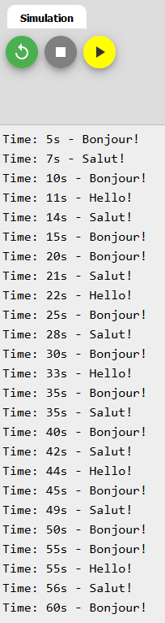

# Pas de `delay()`! <!-- omit in toc -->

- [Introduction](#introduction)
- [Utiliser `millis()` comme `delay()`](#utiliser-millis-comme-delay)
- [Pourquoi utiliser `millis()` au lieu de `delay()`?](#pourquoi-utiliser-millis-au-lieu-de-delay)
  - [`millis()` est plus précis](#millis-est-plus-précis)
  - [`millis()` n'est pas bloquant](#millis-nest-pas-bloquant)
- [Exemple : un planificateur de tâches simple](#exemple--un-planificateur-de-tâches-simple)
- [micros() et le débordement](#micros-et-le-débordement)
- [Explication de la limite de `millis()`](#explication-de-la-limite-de-millis)
- [Références](#références)

# Introduction
La fonction `delay()` qui est populaire auprès des débutants a un gros problème. En effet, elle bloque le programme pendant un certain temps. Pendant ce temps, le programme ne fait rien. C'est comme si le programme était en pause. C'est un problème car si le programme est en pause, il ne peut pas réagir aux événements qui se produisent. Par exemple, si le programme est en pause pendant 1 seconde, il ne peut pas réagir à un appui sur un bouton pendant cette seconde.


`millis()` est une fonction qui permet de mesurer le temps écoulé depuis le démarrage du programme. Elle retourne un nombre entier qui représente le temps écoulé en millisecondes. Par exemple, si le programme a été démarré il y a 1 seconde, la fonction `millis()` retournera 1000.

À première vue, vous pouvez douter de l'utilité de cette fonction. Cependant, elle est extrêmement utile pour plusieurs scénarios, souvent remplaçant `delay()` complètement. C'est ce que nous allons voir dans cette leçon.

# Utiliser `millis()` comme `delay()`
Voici un exemple qui remplace `delay()` par `millis()`.

**NE PAS FAIRE CECI DANS VOTRE CODE, C'EST UNE DÉMONSTRATION. LISEZ L'ARTICLE AU COMPLET**

```cpp
int wait = 1000; // 1000 millisecondes = 1 seconde
unsigned long currentTime = 0;

void setup() {
  Serial.begin(9600);
}

void loop() {
  currentTime = millis();

  Serial.println("Salut!");

  while (millis() < currentTime + wait) {
    // Attendre
  }
}

```

Si vous voulez arrêter 1 seconde à chaque fin de boucle, le code précédent est un peu fou. On pourrait seulement utiliser `delay(1000)` à la place.

# Pourquoi utiliser `millis()` au lieu de `delay()`?
Nous allons maintenant voir l'avantage de `millis()` par rapport à `delay()`.

## `millis()` est plus précis

Le premier avantage que nous allons aborder est la précision du *timing*. Du point de vue du code, nous avons abordé ce sujet dans le dernier chapitre. Avec `millis()`, nous pouvons nous assurer que la boucle s'exécute aussi souvent que nous le souhaitons, indépendamment du temps d'exécution (évidemment tant que le temps d'exécution est inférieur à la période souhaitée). Avec `delay()`, ce n'est pas possible puisque nous ne connaissons pas la durée d'exécution de la boucle.

Un chronométrage précis comme celui-ci est très utile pour échantillonner à une certaine fréquence ou pour exécuter des filtres, entre autres choses.

## `millis()` n'est pas bloquant
L'autre avantage de `millis()` est qu'il ne nous empêchera pas d'exécuter du code pendant l'"attente".

Disons que nous voulons imprimer "Hello" en série une fois par seconde tout en faisant d'autres choses pendant ce temps. Ceci n'est pas possible avec delay() puisqu'il met en pause tout le code. Voici une façon de le faire :

```cpp
unsigned long currentTime = 0;
 
void setup() {
  Serial.begin(115200);
}
 
void loop() {
  const int interval = 1000;

  currentTime = millis();

  if(currentTime - previousTime >= interval){
      previousTime = currentTime;

      Serial.println("Bonjour!");
  }
  
  //Exécuter d'autres choses
}
```

Ce bout de code est assez similaire au premier morceau, sauf qu'il ne bloque pas le reste du programme lorsqu'il n'imprime pas en série.

# Exemple : un planificateur de tâches simple
Écrivons un exemple simple dans lequel nous créons un planificateur qui imprime certains bouts de texte à des intervalles différents.

**Exercice** : Copiez ce code et envoyez-le à votre carte Arduino. Qu'observez-vous ?

<table>
<tr>
<th>Code</th>
<th>Sortie</th>
</tr>
<tr>
<td>

```cpp
unsigned long currentTime = 0;

void setup() {
  Serial.begin(9600);
}

void loop() {
  const int intervalBonjour = 5000;
  const int intervalSalut = 7000;
  const int intervalHello = 11000;

  static unsigned long previousBonjour = 0;
  static unsigned long previousSalut = 0;
  static unsigned long previousHello = 0;

  currentTime = millis();

  if (currentTime - previousBonjour >= intervalBonjour) {
    previousBonjour = currentTime;
    print_time(currentTime);
    Serial.println("Bonjour!");
  }

  if (currentTime - previousSalut >= intervalSalut) {
    previousSalut = currentTime;
    print_time(currentTime);
    Serial.println("Salut!");
  }

  if (currentTime - previousHello >= intervalHello) {
    previousHello = currentTime;
    print_time(currentTime);
    Serial.println("Hello!");
  }
}

void print_time(unsigned long time_millis){
    Serial.print("Time: ");
    Serial.print(time_millis/1000);
    Serial.print("s - ");
}
```
</td>
<td>



</td>
</tr>
</table>

On constate la simplicité de l'implémentation de ce planificateur. Il suffit de vérifier si le temps écoulé depuis la dernière exécution de la tâche est supérieur à l'intervalle souhaité. Si c'est le cas, nous exécutons la tâche et nous mettons à jour le temps de la dernière exécution.

Ainsi l'utilisation de `millis()` nous permet de créer du code relativement simple et facile à maintenir.

# micros() et le débordement
Si le besoin de précision est plus grand, il y a la fonction `micros()`. Cette fonction fait la même chose que `millis()`, mais elle renvoie le temps en microsecondes.

Il faudra faire attention au débordement. Il se produit après 70 minutes au lieu de 50 jours.

# Explication de la limite de `millis()`
La valeur maximum d'un `unsigned long` est de 4 294 967 295 car un `unsigned long` est de 4 octets donc 2^32-1.

Si nous divisons cette valeur par 1000, nous obtenons 4 294 967 secondes. On divise par 60, on obtient 71 582 minutes. On divise par 60, on obtient 1 193 heures. On divise par 24, on obtient 49.7 jours.

# Références
- [Arduino Tutorial: Using millis() Instead of delay()](https://www.norwegiancreations.com/2017/09/arduino-tutorial-using-millis-instead-of-delay/)
- [Arduino Tutorial: Avoiding the Overflow Issue When Using millis() and micros()](https://www.norwegiancreations.com/2018/10/arduino-tutorial-avoiding-the-overflow-issue-when-using-millis-and-micros/)