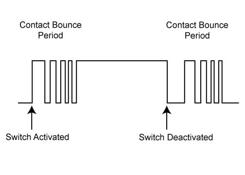

# Le rebond <!-- omit in toc -->


# Table des matières <!-- omit in toc -->
- [Introduction](#introduction)
- [Principe de fonctionnement](#principe-de-fonctionnement)
- [Schéma](#schéma)
- [Code](#code)
  - [Moment du clic](#moment-du-clic)
- [Résumé](#résumé)
- [Exercice](#exercice)

# Introduction
Certains d'entre vous avez peut-être remarqué que lors de l'appuie d'un bouton, on avait un effet indésirable. En effet, le bouton était enfoncé et relâché plusieurs fois même si l'on avait appuyé qu'une seule fois. C'est ce qu'on appelle un rebond.



Si l'on regarde le graphique précédent, ce qui arrive, c'est qu'à l'échelle des microsecondes, lorsque l'on appuie sur le bouton, le contact de ne fait pas pleinement. Il y a des microvibrations que le microcontrôleur peut capter.  C'est un problème qui peut être résolu avec un peu de logique.

# Principe de fonctionnement
Lorsqu'un système physique change d'état, il y a souvent des oscillations pendant la période transitoire pour des raisons physiques (mécanique, temps de réponse, etc.). Il faut donc laisser un temps suffisant pour que l’état puisse se stabiliser. Cela peut être rendu possible par filtrage électronique ou mécanique ou bien numériquement grâce au programme qui traite la mesure.

# Schéma
Voici un schéma pour tester le code.


# Code

Nous allons créer deux variables qui vont garder en mémoire l’état présent et passé du capteur. Nous allons lire l’entrée digitale et valider son état en fonction de l’état précédent et d’un délai anti-rebond. Cette méthode peut être implémentée avec la fonction `millis()`.

```cpp
int pinBouton = 2; // Pin du bouton

void setup() {
  Serial.begin(9600);
  pinMode(pinBouton, INPUT_PULLUP);
}

void loop() {
  static int etatPrecedent = HIGH; // État initial cohérent avec INPUT_PULLUP
  static int etat = HIGH; // État stable du bouton
  const int delai = 50; // Délai anti-rebond en ms
  static unsigned long dernierChangement = 0; // Dernier changement d'état

  int etatPresent = digitalRead(pinBouton); // Lecture de l'état du capteur

  if (etatPresent != etatPrecedent) { // Si l'état change
    dernierChangement = millis(); // Mise à jour du temps
  }

  if ((millis() - dernierChangement) > delai && etatPresent != etat) { 
    etat = etatPresent; // Mise à jour de l’état stable
    Serial.println(etat); // Affichage
  }

  etatPrecedent = etatPresent; // Mise à jour pour la prochaine itération
}
```

## Moment du clic
Voici un code pour capter le moment où le bouton est appuyé. Vous pouvez voir que le capteur est plus stable et ne capte pas les microvibrations.

```cpp

int estClic(unsigned long ct) {
  static unsigned long lastTime = 0;
  static int lastState = HIGH;
  const int rate = 50;
  int clic = 0;

  if (ct - lastTime < rate) {
    return clic; // Trop rapide
  }

  lastTime = ct;

  int state = digitalRead(PIN_BUTTON);

  if (state == LOW) {
    if (lastState == HIGH) {
      clic = 1;
    }
  }

  lastState = state;

  return clic;
}

```


# Résumé
Si vous variez le délai anti-rebond (`delai`), vous verrez que le capteur est plus ou moins sensible. En prenant un temps suffisamment long, vous verrez que le capteur ne sera plus sensible aux microvibrations.

Ce tutoriel permet de comprendre et d’implémenter la logique anti-rebond. Pour un plus grand simplicité d’utilisation, vous pouvez écrire une librairie ou utiliser une librairie existante comme OneButton.h.

# Exercice
- Testez le code dans l'exemple en faisant allumé et éteindre une DEL lorsque vous appuyez sur le bouton.
  - 1 clic - Allumé, 1 clic - Éteint