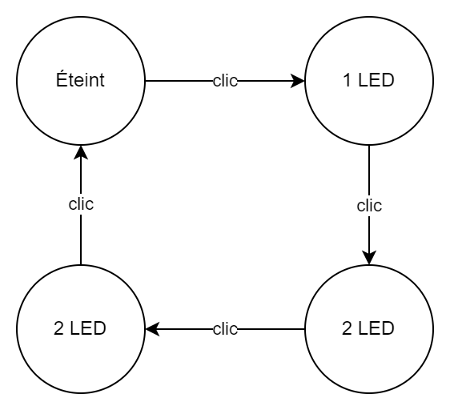

# Exercices de révision pour le cours 03

# Exercice de branchement de base
1. Branchez une LED sur chacune de ces broches : 8, 9 et 10
   - N'oubliez pas la résistance en série pour chaque LED environ 330Ω

2. Branchez un bouton poussoir sur la broche 2
   - N'oubliez pas de configurer la broche en entrée avec une résistance de tirage avec `INPUT_PULLUP`

# Programmation
Dans tous les cas, ne pas utiliser la fonction `delay()`.

# Exercice `c03_exo_01`
1. Lorsque le bouton est appuyé :
   1. la LED sur la broche 8 doit s'allumer.
   2. la LED sur la broche 9 doit s'éteindre.
   3. la LED sur la broche 10 doit clignoter à une fréquence de 1 Hz.

# Exercice `c03_exo_02`
1. À chaque fois que le bouton est appuyé, on allume les LED 8, 9 et 10 un à la suite de l'autre. Le LED précédent reste allumé. Après que les 3 LED soient allumées, le prochain clic éteint tous et cela crée un cycle.

# Exercice `c03_exo_03`
1. À chaque fois que le bouton est appuyé, les LED sont allumés successivement dans l'ordre 8, 9, 10, 8, 9, 10, etc.