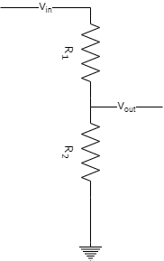
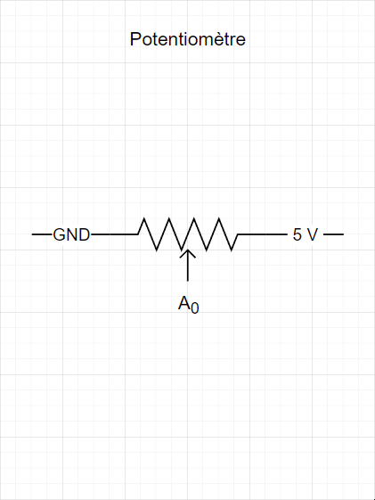
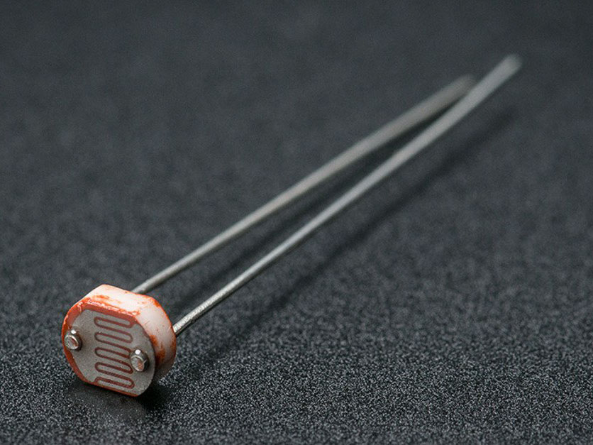
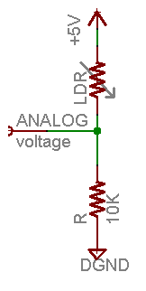

# Composants analogues <!-- omit in toc -->

- [Diviseur de tension](#diviseur-de-tension)
  - [Potentiomètre](#potentiomètre)
  - [Calculatrice en ligne](#calculatrice-en-ligne)
- [Photorésistance](#photorésistance)
  - [Arduino](#arduino)
- [Thermistance](#thermistance)
  - [Code](#code)
- [Exercices](#exercices)
- [Références](#références)


# Diviseur de tension
Un diviseur de tension est un circuit électrique composé de deux résistances en série qui permet de réduire la tension d'une source d'alimentation électrique. **En divisant la tension d'entrée en une tension plus faible**, le diviseur de tension permet de fournir une tension de sortie adaptée aux besoins d'autres composants du circuit.

Voici le schéma d'un diviseur de tension.



Le principe de fonctionnement du diviseur de tension est basé sur la loi d'Ohm qui stipule que la tension aux bornes d'une résistance est égale à la valeur de cette résistance multipliée par le courant qui la traverse. Ainsi, en choisissant deux résistances de valeurs différentes, le diviseur de tension permet de répartir la tension d'entrée entre ces deux résistances de manière proportionnelle.

En utilisant une formule simple, on peut calculer la tension de sortie du diviseur de tension en fonction de la tension d'entrée et des valeurs des résistances utilisées. La formule est la suivante :

$V_{out} = V_{in}  \frac{R_2}{(R_1 + R_2)}$

où $V_{in}$ est la tension d'entrée, $R_1$ est la valeur de la première résistance et $R_2$ est la valeur de la seconde résistance.

Les diviseurs de tension sont couramment utilisés dans de nombreux circuits électroniques. Ils peuvent être utilisés pour mesurer la tension d'une source d'alimentation électrique ou pour réguler la vitesse d'un moteur. En somme, le diviseur de tension est un outil précieux pour les ingénieurs et les techniciens qui travaillent avec des circuits électriques.

## Potentiomètre
Sans que vous le sachiez, vous avez utilisé un diviseur de tension dans quelques montages électroniques. Entre effet, le potentiomètre est un diviseur de tension!



## Calculatrice en ligne
Voici un [lien](https://learn.sparkfun.com/tutorials/voltage-dividers/all) vers un article sur les diviseurs de tension qui contient une calculatrice en ligne qui permet de calculer la tension de sortie d'un diviseur de tension.

# Photorésistance
Une photorésistance, également connue sous le nom de cellule photoconductrice, est un composant électronique qui varie sa résistance électrique en réponse à la quantité de lumière qu'elle reçoit. Elle est donc sensible à la lumière et peut être utilisée pour détecter la présence ou l'absence de lumière dans un circuit.

Voici une photo d'une photorésistance.



> **Bloc science**
> 
> La photorésistance est composée d'un matériau semi-conducteur, généralement du sulfure de cadmium ou du sélénium, qui possède des propriétés photoconductrices. Lorsque la lumière frappe la surface de la photorésistance, des électrons sont libérés dans le matériau, ce qui augmente la conductivité électrique du matériau. Cette augmentation de conductivité se traduit par une diminution de la résistance de la photorésistance.
> 
> TLDR; Plus elle reçoit de lumière, plus la photorésistance est conductrice.

La quantité de lumière détectée par une photorésistance dépend de sa résistance et de la tension appliquée à ses bornes. La résistance de la photorésistance peut varier considérablement en fonction de la quantité de lumière reçue, de sorte que la tension de sortie du circuit peut être utilisée pour détecter la présence ou l'absence de lumière.

Les photorésistances sont couramment utilisées dans de nombreux appareils électroniques, tels que les détecteurs de lumière, les systèmes de contrôle d'éclairage automatique, les capteurs de sécurité et les caméras. Elles peuvent également être utilisées dans des applications plus créatives, comme des projets d'art interactif ou de science citoyenne, où la lumière est utilisée comme une variable de contrôle.

## Arduino
La **photorésistance** peut être connectée à l'Arduino en réalisant un circuit de **diviseur de tension**.

Pour lire la valeur de la photorésistance, il est nécessaire d'utiliser la fonction `analogRead()` de l'Arduino, qui permet de lire la tension sur une broche d'entrée analogique et de la convertir en une valeur numérique. La valeur lue par la photorésistance sera plus élevée lorsque la quantité de lumière est faible, et plus faible lorsque la quantité de lumière est élevée.

En utilisant une formule simple, on peut calibrer la sortie de la photorésistance en une échelle de valeurs numériques compréhensibles pour l'utilisateur. Par exemple, la formule suivante peut être utilisée pour convertir la valeur lue par la photorésistance en une valeur de luminosité :

`luminosite = map(analogRead(A0), 0, 1023, 0, 100);`

En utilisant la valeur de luminosité lue à partir de la photorésistance, les étudiants peuvent ensuite programmer leur Arduino pour effectuer des actions en fonction du niveau de luminosité détecté. Par exemple, ils pourraient programmer leur Arduino pour allumer une lumière lorsqu'il fait sombre, ou pour activer un capteur de mouvement lorsqu'il fait jour. Les possibilités sont nombreuses et dépendent de l'imagination et de la créativité des étudiants.

Voici le schéma de branchement d'une photorésistance à l'Arduino.



Voici un montage typique.


Dans le cas de ce montage, la photorésistance est connectée à la broche analogique A0 de l'Arduino. La résistance de 4.7 kΩ est utilisée pour limiter le courant qui traverse la photorésistance.

On peut modifier la valeur de résistance selon la nécessité. Une valeur de résistance plus élevée permettra de réduire la sensibilité de la photorésistance, tandis qu'une valeur de résistance plus faible augmentera la sensibilité de la photorésistance.

> **Votre kit** : Dans votre kit, la photorésistance semble avoir une valeur de résistance de 10 kΩ. Vous pouvez donc utiliser la résistance de 4.7 kΩ pour limiter le courant qui traverse la photorésistance.

# Thermistance
Une thermistance est un type de capteur de température qui varie sa résistance électrique en fonction de la température ambiante. Plus précisément, une thermistance est un type de résistance dont la valeur de résistance diminue lorsque la température augmente, et inversement, la valeur de résistance augmente lorsque la température diminue.

Comme la photorésistance, la thermistance peut être utilisé dans un montage de diviseur de tension.


> **Bloc science**
> 
> Les thermistances sont fabriquées à partir de matériaux semi-conducteurs spéciaux, tels que l'oxyde de métal et le dioxyde de titane, qui ont des propriétés de résistance électrique qui varient de manière non linéaire en fonction de la température.
> 
> Pour calculer la température, il faut utiliser une formule mathématique qui dépend du type de thermistance utilisé. Il existe de nombreuses formules différentes, mais l'équation de Steinhart-Hart est l'une des plus couramment utilisées. Cette équation peut être utilisée pour calculer la température à partir de la valeur de résistance mesurée par la thermistance.
> 
> $1/T = A + B*ln(R) + C*(ln(R))^3$
> 
> où T est la température en kelvins, R est la résistance de la thermistance en ohms, et A, B et C sont des coefficients spécifiques à chaque thermistance. Ces coefficients sont généralement fournis par le fabricant de la thermistance.

En utilisant la formule de Steinhart-Hart, on peut calculer la température à partir de la résistance lue par le diviseur de tension. On peut ensuite utiliser cette valeur de température pour contrôler des actions en fonction de la température, tels que l'allumage ou l'extinction d'un ventilateur ou le déclenchement d'une alarme de température élevée ou basse.

## Code

Voici un exemple de code pour lire la valeur de la thermistance et afficher la température sur le moniteur série de l'Arduino.

On applique la formule de Steinhart-Hart pour calculer la température à partir de la valeur de résistance lue par la thermistance.

```c
int ThermistorPin = A0;
int Vo; // Voltage à la sortie
float R1 = 10000; // Résistance
float logR2, R2, T, Tc, Tf;

// Les coefficients A, B et C.
float c1 = 1.129148e-03, c2 = 2.34125e-04, c3 = 8.76741e-08;

void setup() {
  Serial.begin(9600);
}

void loop() {
  Vo = analogRead(ThermistorPin);
  R2 = R1 * (1023.0 / (float)Vo - 1.0);
  logR2 = log(R2);
  T = (1.0 / (c1 + c2*logR2 + c3*logR2*logR2*logR2));
  Tc = T - 273.15;
  Tf = (Tc * 9.0)/ 5.0 + 32.0; 

  Serial.print("Temperature: "); 
  Serial.print(Tf);
  Serial.print(" F; ");
  Serial.print(Tc);
  Serial.println(" C");   

  delay(500);
}
```

> **Rappel du secondaire!**
> 
> Remarquez la notation utilisée pour les coefficients A, B et C. Les coefficients sont des nombres décimaux, mais ils sont écrits avec la notation scientifique. Par exemple, 1.129148e-03 est équivalent à 1.129148 * 10^-3, ou 0.001129148.

---

# Exercices
- Réaliser un montage avec une photorésistance et une LED. La LED doit s'allumer lorsque la lumière est faible et s'éteindre lorsque la lumière est forte.
- Réaliser le montage avec la thermistance et une LED. La LED doit s'allumer lorsque la température est élevée et s'éteindre lorsque la température est basse.
- Convertir le code de la thermistance pour que ce soit dans une fonction qui reçoit en paramètre la valeur lue par la thermistance et qui retourne la température en degré Celsius.


# Références
- https://learn.adafruit.com/photocells
- https://circuitdigest.com/microcontroller-projects/interfacing-Thermistor-with-arduino
- https://www.circuitbasics.com/arduino-thermistor-temperature-sensor-tutorial/