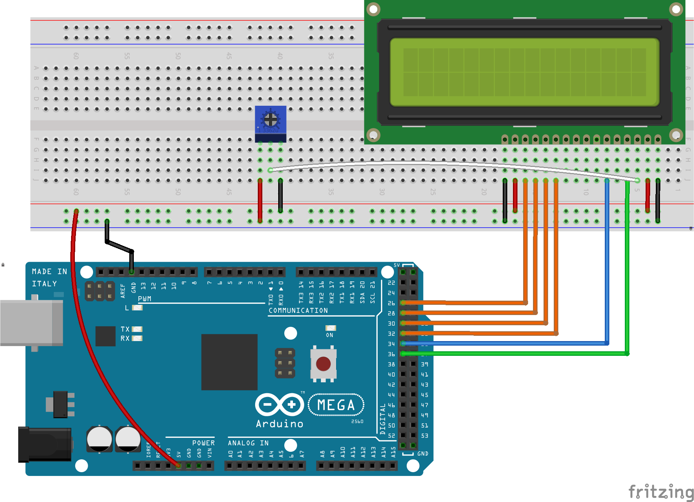

# L'écran LCD 1602 - Partie 01 <!-- omit in toc -->


# Table des matières <!-- omit in toc -->
- [Introduction](#introduction)
- [LCD 1602](#lcd-1602)
- [Fonctionnalités](#fonctionnalités)
- [Spécifications](#spécifications)
- [Branchement](#branchement)
- [Exemple de base](#exemple-de-base)
- [Exemple avec défilement](#exemple-avec-défilement)
- [Fonctions utiles](#fonctions-utiles)
  - [`lcd.begin()`](#lcdbegin)
  - [`lcd.print()`](#lcdprint)
  - [`lcd.setCursor()`](#lcdsetcursor)
  - [`lcd.clear()`](#lcdclear)
  - [`lcd.scrollDisplayLeft()` et `lcd.scrollDisplayRight()`](#lcdscrolldisplayleft-et-lcdscrolldisplayright)
- [Bonnes pratiques](#bonnes-pratiques)
- [Exercices](#exercices)
- [Références](#références)

---

# Introduction
Les LCD sont des écrans à cristaux liquides. Ils sont composés de cristaux liquides qui sont placés entre deux plaques de verre. Lorsqu'un courant électrique est appliqué aux cristaux liquides, ils changent de couleur et permettent d'afficher des caractères et des chiffres.

On les retrouve dans plusieurs appareils communs tels que les montres, les cadrans dans les automobiles, les cafétières, etc.

Celui qui est inclus dans votre kit est le LCD 1602. Il est composé de deux lignes de 16 caractères chacune d'où le 1602.

# LCD 1602
Ayant deux lignes de 16 caractères, le LCD 1602 peut afficher 32 caractères sur deux lignes. Il est possible d'afficher des caractères spéciaux tels que des lettres accentuées, des symboles, etc.

# Fonctionnalités
Les principales fonctionnalités sont:

- Afficher des caractères
- Ajuster la luminosité
- Ajuster le contraste
- Fonctionner en utilisant 4 ou 8 bits

# Spécifications
Il possède 16 broches. Les broches 1, 2, 3, 4, 5, 6, 7, 8, 9, 10, 11, 12, 13, 14, 15 et 16 sont respectivement reliées aux broches VSS, VDD, V0, RS, R/W, E, D0, D1, D2, D3, D4, D5, D6, D7, A et K.


Comme vous le remarquez, il y a un grand nombre de broches. Cependant, on peut utiliser économiser le nombre de broches en utilisant 4 bits au lieu de 8 bits. Dans la majorité des projets, c'est ce que l'on fait.

# Branchement

Voici un branchement pour utiliser 4 bits:



Le branchement est le suivant:
- GND, R/W et K sont reliés au ground
- Vcc et l'anode (A) sont reliés à 5V
- V0 est à la broche 38 que l'on contrôlera avec un PWM
  - Celui-ci peut être relié à un potentiomètre pour ajuster le contraste
- RS est relié à la broche 36
- E (en) est relié à la broche 34
- D4 est relié à la broche 32
- D5 est relié à la broche 30
- D6 est relié à la broche 28
- D7 est relié à la broche 26

# Exemple de base
Pour utiliser le LCD, on utilisera la bibliothèque `LiquidCrystal` d'Arduino. Pour l'installer, on va dans le menu "Outils > Gérer les bibliothèques". On recherche LiquidCrystal et on l'installe.

Ouvrez l'exemple `LiquidCrystal > Hello World` et modifiez les broches pour correspondre à votre branchement.

```cpp
// Inclure la librairie
#include <LiquidCrystal.h>

// Initialiser l'objet lcd
const int rs = 36, en = 34, d4 = 32, d5 = 30, d6 = 28, d7 = 26;
LiquidCrystal lcd(rs, en, d4, d5, d6, d7);

const int contrastPin = 38;

void setup() {
  pinMode(contrastPin, OUTPUT);

  // Ajuster le contraste au besoin
  analogWrite(contrastPin, 100);

  // Initialiser l'affichage
  // Configurer le nombre de caractères et de lignes
  lcd.begin(16, 2); 

  // Afficher le message
  lcd.print(F("Allo toi!"));
}

void loop() {
  // Régler le curseur à la colonne 0 et ligne 1
  // (note: line 1 est la 2e ligne, car on débute à 0):
  lcd.setCursor(0, 1);

  // Afficher le nombre de millisecondes depuis le début
  lcd.print(millis() / 1000);
  delay(100);
}

```

# Exemple avec défilement
La librairie offre aussi la possibilité de faire défiler le texte. Pour ce faire, on peut utiliser la fonction `scrollDisplayLeft()`.

```cpp
// Inclure la librairie
#include <LiquidCrystal.h>

// Initialiser l'objet lcd
const int rs = 36, en = 34, d4 = 32, d5 = 30, d6 = 28, d7 = 26;
LiquidCrystal lcd(rs, en, d4, d5, d6, d7);

const int contrastPin = 38;

void setup() {
  pinMode(contrastPin, OUTPUT);

  // Ajuster le contraste au besoin
  analogWrite(contrastPin, 100);

  lcd.begin(16, 2);
  lcd.print("Hello!");
  delay(1000);
}

void loop() {
  // Défiler le texte de 6 positions vers la gauche
  for (int positionCounter = 0; positionCounter < 6; positionCounter++) {
    // Défiler d'une position vers la gauche
    lcd.scrollDisplayLeft();
    // Attendre un peu
    delay(150);
  }


  // Défiler 22 positions vers la droite
  // (longueur du message + largeur du LCD)
  // to move it offscreen right:
  for (int positionCounter = 0; positionCounter < 22; positionCounter++) {
    // Défiler d'une position vers la droite
    lcd.scrollDisplayRight();
    delay(150);
  }

  // Défiler 16 positions vers la gauche pour
  // le ramener à la position initiale
  for (int positionCounter = 0; positionCounter < 16; positionCounter++) {
    // Défiler d'une position vers la gauche
    lcd.scrollDisplayLeft();
    delay(150);
  }

  delay(1000);
}
```

Dans cet exemple, on fait défiler le texte de droite à gauche. On utilise les `delay()` pour que le texte ne défile pas trop vite, mais dans un cas réel, il faut éviter d'utiliser les `delay()`.

---
# Fonctions utiles

## `lcd.begin()`
Cette fonction permet d'initialiser l'affichage. Elle prend deux paramètres :
- Le nombre de caractères
- Le nombre de lignes

## `lcd.print()`
Cette fonction permet d'afficher un message. Elle prend un paramètre :
- Le message à afficher

## `lcd.setCursor()`
Cette fonction permet de déplacer le curseur. Elle prend deux paramètres :
- La colonne
- La ligne

## `lcd.clear()`
Cette fonction permet d'effacer l'écran. Elle ne prend pas de paramètres.
Lorsque l'on désire effacer l'écran, on peut appeler cette fonction. Parfois il y a des bugs d'affichage, par exemple, si on affiche un message plus court que le précédent, il peut rester des caractères de l'ancien affichage. Dans ce cas, on peut appeler cette fonction pour effacer l'écran et recommencer.

## `lcd.scrollDisplayLeft()` et `lcd.scrollDisplayRight()`
Ces fonctions permettent de faire défiler le texte. Elles ne prennent pas de paramètres.

---

# Bonnes pratiques


---
# Exercices
1. Réalisez le branchement du LCD sur la carte Arduino.
   - Trouvez une place stratégique pour le placer pour que vous puissiez brancher d'autres composants.
2. Fouillez dans la bibliothèque `LiquidCrystal` pour trouver une fonction qui permet d'afficher un caractère spécial. Par exemple, un carré.
3. Fouillez dans cette article "[Liquid crystal displays](https://docs.arduino.cc/learn/electronics/lcd-displays)" et trouvez la façon pour créer un symbole personnalisé.
4. Utilisez le fichier "[createur_caractere.xlsx](createur_caractere.xlsx)" pour faire votre création.
---

# Références
- [Arduino LCD Tutorial](https://howtomechatronics.com/tutorials/arduino/lcd-tutorial/)
- [7 Arduino LCD tricks](https://www.baldengineer.com/arduino-lcd-display-tips.html)
- [Liquid crystal displays](https://docs.arduino.cc/learn/electronics/lcd-displays)