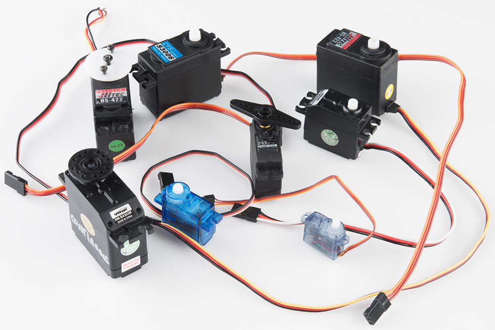
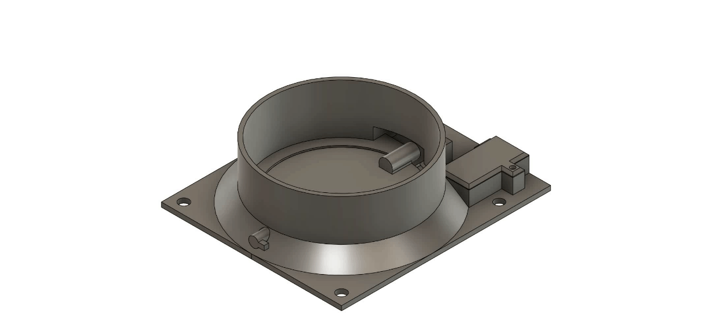
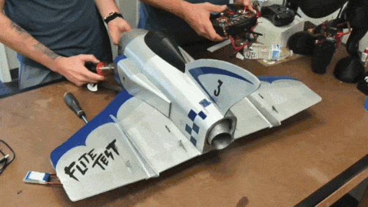
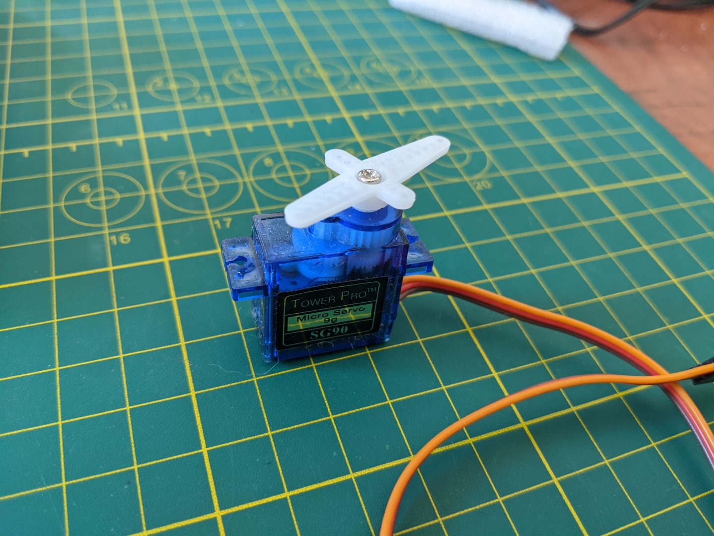
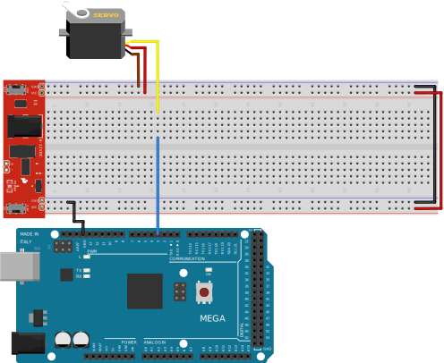

# Le servomoteur <!-- omit in toc -->



# Table des matières <!-- omit in toc -->
- [Mise en garde - Risque de bris](#mise-en-garde---risque-de-bris)
- [Introduction](#introduction)
- [Utilisation](#utilisation)
- [Votre kit](#votre-kit)
- [Arduino](#arduino)
  - [Branchement](#branchement)
- [Exemple de code](#exemple-de-code)
- [Exercices](#exercices)
- [Références](#références)

---

# Mise en garde - Risque de bris

Le servo moteur que vous avez en main est un composant fragile. Il est important de ne pas forcer le moteur à tourner plus que sa limite. Si vous le forcez, il chauffera et peut s'endommager.

De plus, ne faites pas tourner le moteur manuellement. Cela peut endommager les engrenages à l'intérieur du moteur.


---

# Introduction
Un servomoteur est un moteur électrique qui peut maintenir une position précise. Sa position est vérifiée continuellement et corriger en fonction de la position souhaitée.

Un servomoteur est contrôlé par un signal électrique. Il est utilisé pour contrôler des mécanismes tels que des volets, des portes, des ailes d'avion, etc. Les servomoteurs sont généralement contrôlés par un signal **PWM**.

Il contient son propre circuit de commande qui permet de contrôler la vitesse et la position du moteur.

Il y a principalement deux types de servomoteurs. Les servomoteurs à rotation continue et les servomoteurs à rotation limitée. Les servomoteurs à rotation continue peuvent tourner dans un angle de 0 à 360° continuellement. Les servomoteurs à rotation limitée peuvent pivoter entre deux limites prédéfinies.

# Utilisation
On retrouve des servomoteurs dans de nombreux produits. On peut les retrouver dans les avions, les drones, les robots, les voitures, etc.

Par exemple, les conduits de systèmes de chauffage et de climatisation dans les voiture sont contrôlés par des servomoteurs. En effet, ils ouvrent et ferment les conduits en fonction des zones définies par les occupants ou encore par le système automatique.





# Votre kit
Votre kit contient un servomoteur SG90. Il s'agit d'un servomoteur à rotation limitée. Il peut, en théorie, pivoter entre 0 et 180°.



On dit en théorie car il est possible que le servomoteur ne puisse pas atteindre les 180°. Cela dépend de la précision du servomoteur. On suggère de tester les limites du servomoteur avant de l'utiliser. On suggère aussi de ne pas dépasser 170° pour éviter de l'endommager.

Si vous faites forcer le servomoteur à tourner plus que sa limite, il chauffera et peut s'endommager.

---

# Arduino
Comment contrôler un servomoteur avec un Arduino?

Comme indiquer précédemment, un servomoteur est contrôlé par un signal **PWM**. Il faut donc utiliser la fonction `analogWrite()` pour contrôler le servomoteur.

Le servomoteur a 3 fils. Le fil rouge est le fil de puissance. Il doit être branché sur une alimentation de 5V. Le fil brun est le fil de masse (*ground*). Il doit être branché sur la masse de l'Arduino. Le fil orange est le fil de commande. Il doit être branché sur une sortie PWM de l'Arduino.

## Branchement
Voici le branchement typique pour un servomoteur. Remarquez la présence du module de puissance. Il est préférable d'utiliser ce module pour fournir une alimentation de 5V au servomoteur.



# Exemple de code
Voici un exemple de code qui permet de contrôler un servomoteur. Le code permet de faire tourner le servomoteur dans un angle de 0 à 170° et de revenir à 0°.

```cpp
#include <Servo.h>

Servo servo;

void setup() {
  servo.attach(3);
}

void loop() {
  for (int angle = 0; angle <= 170; angle++) {
    servo.write(angle);
    delay(15);
  }
  for (int angle = 170; angle >= 0; angle--) {
    servo.write(angle);
    delay(15);
  }
}
```

Prenez note qu'une fois la position atteinte et qu'il n'y a pas de force qui lui est appliquée, il est préférable d'arrêter d'envoyer des pulsations. Cela permet d'éviter que le servomoteur ne chauffe et ne s'endommage.

Pour se faire on peut utiliser la fonction `servo.detach()`.

```cpp
#include <Servo.h>

Servo servo;

void setup() {
  servo.attach(3);
}

void loop() {
  servo.attach(3);
  for (int angle = 0; angle <= 170; angle++) {
    servo.write(angle);
    delay(15);
  }
  servo.detach();
  delay(1000);

  servo.attach(3);
  for (int angle = 170; angle >= 0; angle--) {
    servo.write(angle);
    delay(15);
  }
  servo.detach();
  delay(1000);
}
```

---

# Exercices
1. Faites tourner le servomoteur dans un angle de 0 à 170° et de revenir à 0°. Utilisez la fonction `servo.detach()` pour arrêter d'envoyer des pulsations.
2. À l'aide de la communication série, envoyez l'angle à laquelle le servomoteur doit tourner. Utilisez la fonction `servo.detach()` pour arrêter d'envoyer des pulsations lorsque l'angle est atteint.

---

# Références