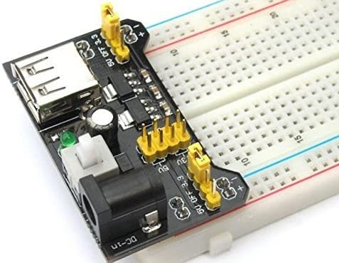

# L'unité de puissance <!-- omit in toc -->

# Table des matières <!-- omit in toc -->
- [Introduction](#introduction)
- [Fonctionnalités](#fonctionnalités)
- [Utilisation](#utilisation)
  - [Branchement](#branchement)
  - [Configuration des cavaliers](#configuration-des-cavaliers)
  - [Branchement à l'Arduino](#branchement-à-larduino)
- [Références](#références)
 
# Introduction
Dans votre kit, vous avez un module de puissance qui vous permet de brancher des appareils qui consomment plus de courant que votre Arduino. Ce module est composé d'un régulateur de tension. Le régulateur de tension permet de convertir une tension d'entrée de 5V à 12V en une tension de sortie de 3.3V ou 5V. Dans ce chapitre, nous allons voir comment utiliser ce module pour commander un appareil qui consomme plus de courant que votre Arduino.

# Fonctionnalités
Le module est compatible avec les platines d'expérimentation (*breadboard*). Il permet d'avoir deux tensions de sortie différentes pour chacune des rails de tension.

En entrée, le module de puissance accepte une tension de 6.5V à 12V. Il a un port DC jack de 5.5mm x 2.1mm et un port USB. Le port USB est toujours de 5V.

En sortie, le module de puissance peut fournir une tension de 3.3V ou 5V. Le module de puissance peut fournir jusqu'à 700mA de courant. Le module de puissance est alimenté par le port USB de votre Arduino.

Le module a aussi un bouton de mise sous tension. Ce bouton permet de mettre sous tension le module de puissance.

# Utilisation
## Branchement
Il suffit d'installer le module de puissance à l'extrémité de votre *breadboard*.

**Attention!** Il y a deux rails de tension sur le *breadboard*. Il faut le brancher sur le bon côté. Il faut aligner la polarité du module avec la polarité des rails *breadboard*.

Ensuite, on peut l'alimenter avec le port USB de votre Arduino ou encore un DC jack de 5.5mm x 2.1mm. Dans votre kit, vous avez un connecteur pour batterie de 9V. Vous pouvez l'utiliser pour alimenter le module de puissance.

> **Note :** Vous pouvez aussi utiliser un adaptateur secteur qui fournit une tension entre 5V et 12V pour alimenter le module de puissance. Référez-vous à la fiche signalétique de l'adaptateur pour connaître la tension de sortie de celui-ci. (Voir le [cours C03A](C03a_branchement_base.md) pour plus de détail)
> 
> **Suggestion :** Même s'il est possible d'alimenter le module avec une tension de 12V, je vous suggère d'utiliser une tension plus faible. Il y a des cas reportés où l'utilisation d'une tension de 12V a causé des dommages au module de puissance dûs à des défauts de conception.

## Configuration des cavaliers
Dans le cadre du cours, nous allons principalement utiliser des composants fonctionnant à 5V. Il faut donc configurer le cavalier du module de puissance pour avoir une tension de sortie de 5V.

## Branchement à l'Arduino
Si l'Arduino a sa propre alimentation, il suffit de brancher le ground de l'Arduino au ground du module de puissance.

Si l'on désire alimenté l'Arduino avec le module de puissance, il faut brancher le ground de l'Arduino au ground du module de puissance et le $V_{in}$ de l'Arduino au 5V du module de puissance.

**Attention!** Il ne faut pas se tromper de polarité, car on peut griller l'Arduino!

# Références
- [Breadboard Power Supply Module](https://components101.com/modules/5v-mb102-breadboard-power-supply-module)
- [Powering alternatives for Arduino Boards](https://docs.arduino.cc/learn/electronics/power-pins)