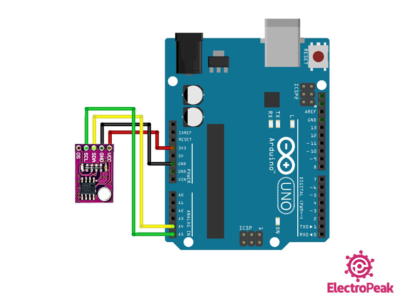
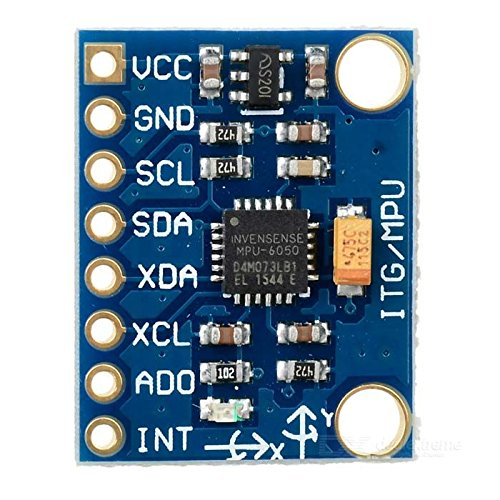
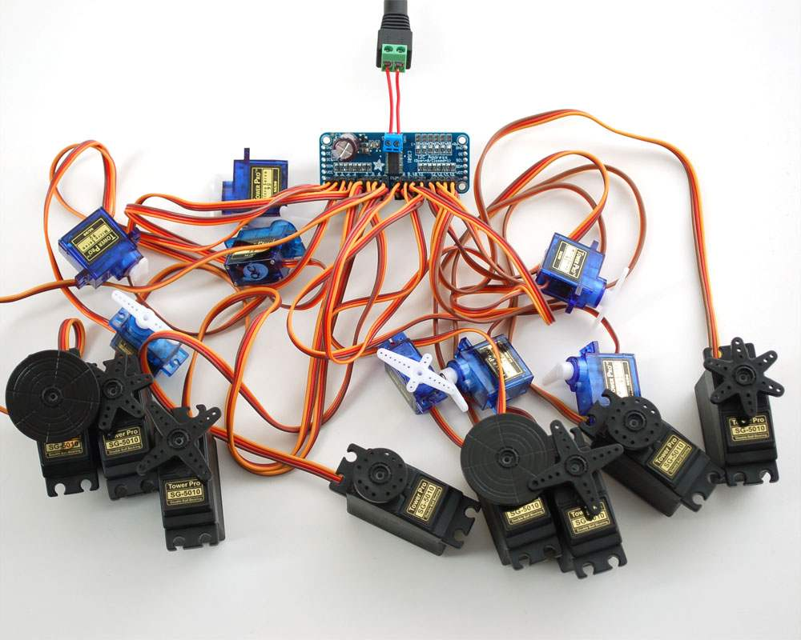
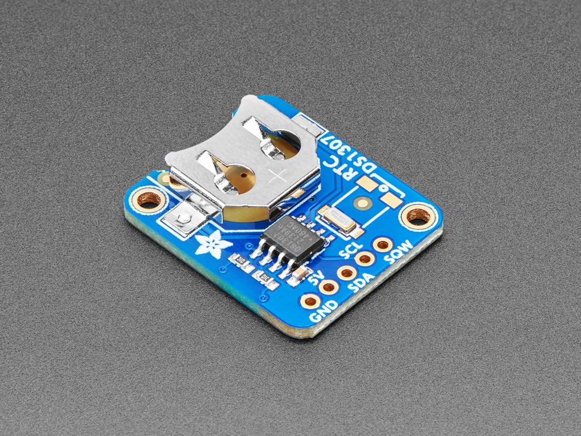
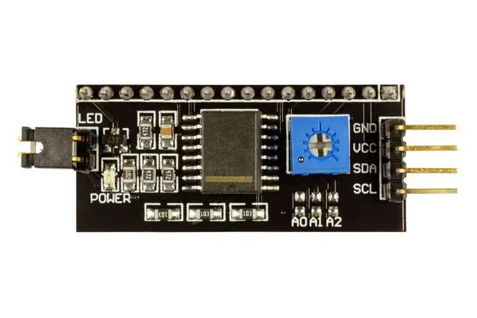
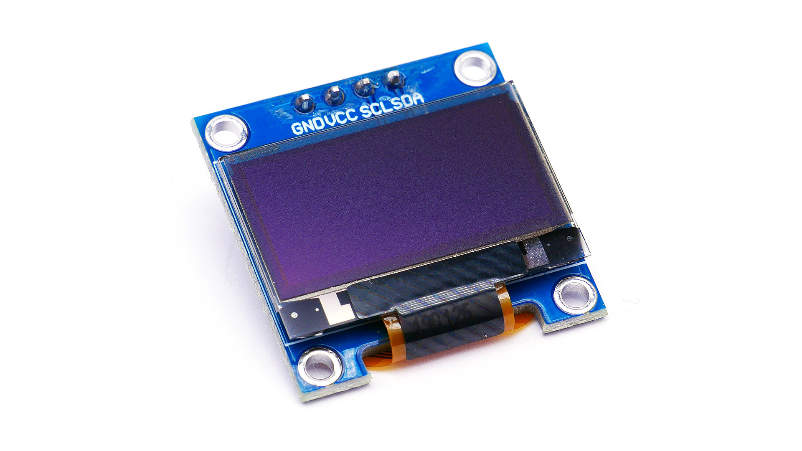
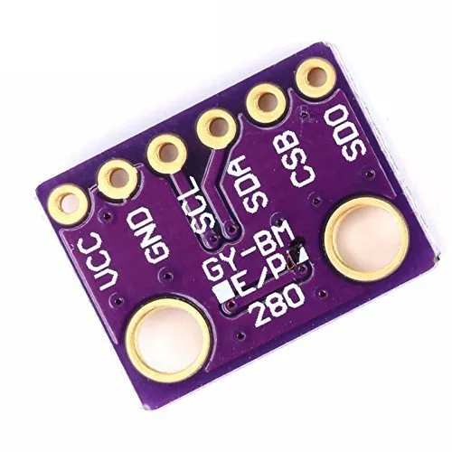

# Découverte du protocole I2C avec Arduino <!-- omit in toc -->

# Table des matières <!-- omit in toc -->
- [Introduction](#introduction)


# Introduction
Lorsqu'on travaille avec des projets Arduino, il est fréquent de rencontrer des capteurs et des périphériques qui communiquent via le protocole I2C. Cette méthode de communication est particulièrement intéressante pour les étudiants du cégep en informatique, car elle permet de simplifier les connexions entre les dispositifs et de gagner en flexibilité. Dans cet article, nous allons explorer les bases du protocole I2C, son utilité et un exemple d'application.

# Qu'est-ce que le protocole I2C ?
I2C, abréviation de "Inter-Integrated Circuit", est un protocole de communication inventé par Philips (aujourd'hui NXP) en 1982. Il est conçu pour établir une communication bidirectionnelle entre plusieurs périphériques électroniques sur un même circuit imprimé. Il fonctionne en mode maître-esclave, c'est-à-dire qu'un seul maître (généralement un microcontrôleur comme l'Arduino) contrôle plusieurs esclaves (comme des capteurs, des écrans LCD, etc.).

# Fonctionnement de base d'I2C
Le protocole I2C fonctionne en mode **maître-esclave**. Le maître est le dispositif qui contrôle les autres périphériques. Il peut envoyer des données à un esclave, mais aussi recevoir des données de l'esclave. Les esclaves sont les périphériques qui reçoivent des données du maître et qui peuvent envoyer des données au maître. Dans le cas d'un Arduino, le maître est l'Arduino lui-même et les esclaves sont les capteurs et les périphériques qui communiquent avec l'Arduino.

Le protocole I2C utilise deux lignes de communication: SDA (Serial Data) et SCL (Serial Clock). SDA est responsable de la transmission des données, tandis que SCL synchronise les dispositifs en fournissant une horloge partagée. Tous les dispositifs esclaves sont connectés en parallèle à ces deux lignes, ce qui permet de réduire considérablement le nombre de câbles nécessaire.

Chaque esclave possède une **adresse unique** (généralement de 7 bits) qui permet au maître de communiquer avec un périphérique spécifique. Lorsqu'un maître souhaite envoyer ou recevoir des données, il commence par diffuser l'adresse de l'esclave concerné sur le bus I2C. Une fois que l'esclave reconnaît son adresse, il établit une connexion et échange des données avec le maître.

TODO : Ajouter une petite question en lien avec l'adresse 7 bits

# Utilité d'I2C dans le contexte Arduino
Le protocole I2C est très utile dans les projets Arduino pour plusieurs raisons :

1. Simplicité de câblage : Comme I2C n'utilise que deux lignes de communication, cela simplifie grandement le câblage et réduit l'encombrement sur la carte
2. Scalabilité : Étant donné que plusieurs dispositifs peuvent être connectés au même bus I2C, il est facile d'ajouter de nouveaux périphériques sans affecter la configuration existante.
3. Compatibilité : De nombreux capteurs et périphériques couramment utilisés avec Arduino sont compatibles avec I2C, comme les capteurs de température, les écrans OLED, les accéléromètres, etc.

# Exemple : Lecture d'un capteur de température I2C



Prenons l'exemple d'un capteur de température I2C (par exemple, le LM75). Pour lire la température à l'aide d'un Arduino, voici les étapes à suivre :
1. Connectez le capteur LM75 à l'Arduino. Branchez les broches SDA et SCL du capteur aux broches correspondantes de l'Arduino Mega soit 20 et 21. N'oubliez pas de connecter également les broches d'alimentation (VCC et GND) du capteur aux broches correspondantes de l'Arduino.
2. Importez la bibliothèque "Wire" pour gérer la communication I2C. Dans l'IDE Arduino, allez dans Croquis > Importer une bibliothèque > Wire.
3. Écrivez le code pour lire la température du capteur LM75. Voici un exemple de code :

```cpp
#include <Wire.h>

const int LM75_ADDRESS = 0x48; // Adresse du capteur LM75

void setup() {
  Serial.begin(9600);           // Initialise la communication série
  Wire.begin();                 // Initialise la communication I2C
}

void loop() {
  Wire.beginTransmission(LM75_ADDRESS); // Commence la transmission avec le capteur
  Wire.write(0);                        // Pointe vers le registre de température
  Wire.endTransmission();               // Termine la transmission

  Wire.requestFrom(LM75_ADDRESS, 2);    // Demande 2 octets de données de température

  if (Wire.available()) {
    int temp_high = Wire.read(); // Lit l'octet de poids fort
    int temp_low = Wire.read();  // Lit l'octet de poids faible

    float temperature = (temp_high << 8 | temp_low) / 256.0; // Convertit les données en température Celsius

    Serial.print("Temperature: ");
    Serial.print(temperature);
    Serial.println("°C");
  }

  delay(1000); // Attend une seconde avant la prochaine lecture
}

```

4. Téléversez le code sur l'Arduino et ouvrez le moniteur série pour afficher les valeurs de température en temps réel.

# Exemple : Contrôle d'écran LCD 1602 I2C
Voici un exemple de code pour contrôler un écran LCD 1602 I2C avec l'Arduino Mega. L'écran LCD 1602 I2C est un écran LCD 16x2 avec un contrôleur I2C intégré. Il est donc très facile de le connecter à l'Arduino Mega en utilisant seulement deux broches (SDA et SCL). Voici le code :

```cpp
#include <Wire.h>
#include <LiquidCrystal_I2C.h>

// Créez un objet LiquidCrystal_I2C avec l'adresse du module I2C et la taille de l'écran (16x2)
LiquidCrystal_I2C lcd(0x27, 16, 2);

void setup() {
  // Initialise l'écran LCD
  lcd.init();

  // Active le rétroéclairage
  lcd.backlight();

  // Positionne le curseur à la première colonne (0) et la première ligne (0)
  lcd.setCursor(0, 0);

  // Affiche "Bonjour !" à la position du curseur
  lcd.print("Bonjour !");
}

void loop() {
  // Ajouter le code ici
}

```
TODO : Continuer ce bloc en montrant la librairie à télécharger et un branchement

# Exemples d'appareils communs utilisant I2C
Voici quelques exemples d'appareils et de capteurs populaires qui fonctionnent avec le protocole I2C et sont souvent utilisés dans des projets Arduino :

1. **MPU-6050 :** Un capteur combinant un accéléromètre et un gyroscope sur un seul module. Il est fréquemment utilisé dans les projets de stabilisation, de contrôle de mouvement et de navigation.



2. **PCA9685 :** Un pilote de servo-moteur et de LED à 16 canaux permettant de contrôler jusqu'à 16 servo-moteurs ou LEDs indépendamment. Il est utilisé dans les projets de robotique et d'éclairage.


1. **DS1307 :** Une horloge temps réel (RTC) qui maintient l'heure et la date même lorsque l'Arduino est éteint. Elle est souvent employée dans les projets nécessitant une gestion précise du temps, comme les horloges ou les enregistreurs de données.


1. **PCF8574 :** Un contrôleur de port I/O à 8 broches qui permet de contrôler des périphériques externes à l'aide d'un bus I2C. Il est utilisé dans les projets nécessitant un contrôle de périphériques à distance, comme les claviers matriciels ou les afficheurs LCD.


1. **SSD1306 :** Un contrôleur pour écrans OLED monochromes couramment utilisé avec des écrans de petite taille (par exemple, 128x64 ou 128x32 pixels). Ces écrans sont souvent employés pour afficher des informations sur l'état, des graphiques ou des textes dans divers projets.


1. **BMP280 :** Un capteur de pression atmosphérique et de température de Bosch Sensortec. Il est couramment utilisé dans les projets météorologiques et d'altimétrie.


# Conclusion
Le protocole I2C est un moyen simple et efficace de communiquer avec divers périphériques dans les projets Arduino. Il permet de simplifier le câblage et d'interagir facilement avec de nombreux capteurs et périphériques. En comprenant les bases d'I2C et en maîtrisant son utilisation, vous pourrez créer des projets plus complexes et plus performants.