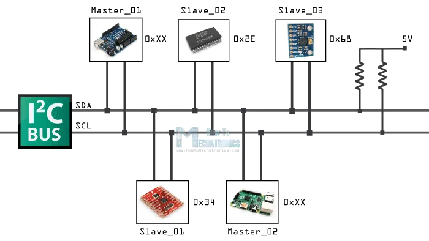
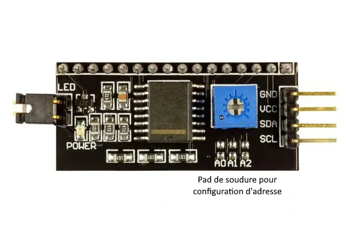
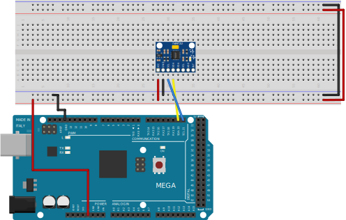
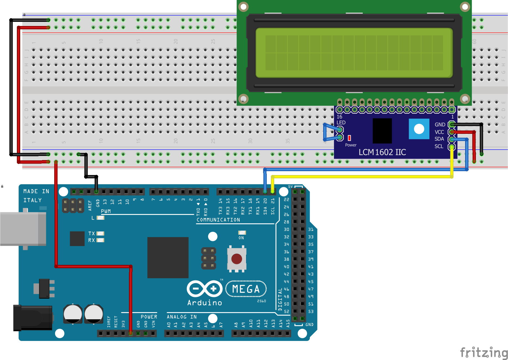

# Découverte du protocole I2C avec Arduino <!-- omit in toc -->

# Table des matières <!-- omit in toc -->
- [Introduction](#introduction)


# Introduction
Lorsqu'on travaille avec des projets Arduino, il est fréquent de rencontrer des capteurs et des périphériques qui communiquent via le protocole I2C. Cette méthode de communication est particulièrement intéressante pour les étudiants du cégep en informatique, car elle permet de simplifier les connexions entre les dispositifs et de gagner en flexibilité. Dans cet article, nous allons explorer les bases du protocole I2C, son utilité et un exemple d'application.

# Qu'est-ce que le protocole I2C ?
I2C, abréviation de "Inter-Integrated Circuit", est un protocole de communication inventé par Philips (aujourd'hui NXP) en 1982. Il est conçu pour établir une communication bidirectionnelle entre plusieurs périphériques électroniques sur un même circuit imprimé. Il fonctionne en mode maître-esclave, c'est-à-dire qu'un seul maître (généralement un microcontrôleur comme l'Arduino) contrôle plusieurs esclaves (comme des capteurs, des écrans LCD, etc.).

# Fonctionnement de base d'I2C
Le protocole I2C fonctionne en mode **maître-esclave**. Le maître est le dispositif qui contrôle les autres périphériques. Il peut envoyer des données à un esclave, mais aussi recevoir des données de l'esclave. Les esclaves sont les périphériques qui reçoivent des données du maître et qui peuvent envoyer des données au maître. Dans le cas d'un Arduino, le maître est l'Arduino lui-même et les esclaves sont les capteurs et les périphériques qui communiquent avec l'Arduino.

Le protocole I2C utilise deux lignes de communication: **SDA** (Serial Data) et **SCL** (Serial Clock). SDA est responsable de la transmission des données, tandis que SCL synchronise les dispositifs en fournissant une horloge partagée. Tous les dispositifs esclaves sont connectés en parallèle à ces deux lignes, ce qui permet de réduire considérablement le nombre de câbles nécessaire.



Chaque esclave possède une **adresse unique** (généralement de 7 bits) qui permet au maître de communiquer avec un périphérique spécifique. Lorsqu'un maître souhaite envoyer ou recevoir des données, il commence par diffuser l'adresse de l'esclave concerné sur le bus I2C. Une fois que l'esclave reconnaît son adresse, il établit une connexion et échange des données avec le maître.

Comme indiqué, chaque appareil possède une adresse. Celle-ci est généralement fournie par le fabricant du périphérique. Par exemple, le module LCD I2C possède l'adresse 0x27. Pour trouver l'adresse d'un périphérique, il suffit de lire la documentation fournie par le fabricant.

Certains appareils permettent de modifier l'adresse à l'aide de configuration. Par exemple, en plus de l'adresse 0x27 le module LCD I2C peut être configuré pour avoir une adresse entre 0x20 à 0x23. Pour modifier l'adresse, il suffit de faire des ponts de soudure sur les broches A0, A1 et A2 du module LCD I2C.



> **Question :** Sachant que les adresses sont de 7 bits, combien d'adresses différentes sont possibles?<details><summary>Réponse</summary>
> 128 appareils</details>

# Utilité d'I2C dans le contexte Arduino
Le protocole I2C est très utile dans les projets Arduino pour plusieurs raisons :

1. Simplicité de câblage : Comme I2C n'utilise que deux lignes de communication, cela simplifie grandement le câblage et réduit l'encombrement sur la carte
2. Scalabilité : Étant donné que plusieurs dispositifs peuvent être connectés au même bus I2C, il est facile d'ajouter de nouveaux périphériques sans affecter la configuration existante.
3. Compatibilité : De nombreux capteurs et périphériques couramment utilisés avec Arduino sont compatibles avec I2C, comme les capteurs de température, les écrans OLED, les accéléromètres, etc.

# Fonctionnement en programmation
Le fonctionnement générale pour communiquer avec un appareil I2C est le suivant :
1. Initialiser la communication I2C avec la fonction `Wire.begin()`
2. Exécuter la fonction `Wire.beginTransmission()` pour commencer la transmission. Cette fonction prend en paramètre l'adresse du périphérique.
3. Écrire la commande à envoyer au périphérique avec la fonction `Wire.write()`.
   - Cette commande peut être une adresse de registre, une commande spécifique, etc. Cela dépend du périphérique.
4. Écrire la fin de la transmission avec la fonction `Wire.endTransmission()`.
   - Cette fonction permet de terminer la transmission et de libérer le bus I2C pour d'autres périphériques.
5. Demander au périphérique de renvoyer des données avec la fonction `Wire.requestFrom()`.
   - Cette fonction prend en paramètre l'adresse du périphérique et le nombre d'octets à recevoir.
6. Regarder s'il y a des données disponibles avec la fonction `Wire.available()`.
   - Cette fonction retourne le nombre d'octets disponibles dans le buffer de réception.
7. Lire les données avec la fonction `Wire.read()`.
   - Cette fonction lit les données dans le buffer de réception et les renvoie sous forme d'un octet.
   - Les données reçues dépendent du périphérique.

On s'aperçoit que la communication i2c est plus complexe que la communication série. C'est pourquoi il est important de bien lire la documentation du périphérique pour savoir comment communiquer avec lui.

# Exemple : Lecture d'un accéléromètre MPU-6050



Prenons l'exemple d'un accéléromètre MPU-6050. Pour lire les données de l'accéléromètre à l'aide d'un Arduino, voici les étapes à suivre :
1. Branchez les broches SDA et SCL du capteur aux broches correspondantes de l'Arduino Mega soit 20 et 21. N'oubliez pas de connecter également les broches d'alimentation (VCC et GND) du capteur aux broches correspondantes de l'Arduino.
2. Importez la bibliothèque "Wire" pour gérer la communication I2C. Dans l'IDE Arduino, allez dans Croquis > Importer une bibliothèque > Wire.
3. Écrivez le code. Voici un exemple :

```cpp
#include <Wire.h>

const int MPU_ADDR = 0x68; // Adresse I2C du MPU-6050

void setup() {
  Serial.begin(9600);         // Initialise la communication série
  Wire.begin();               // Initialise la communication I2C
  Wire.beginTransmission(MPU_ADDR);
  Wire.write(0x6B);           // Sélectionne le registre PWR_MGMT_1
  Wire.write(0);              // Définit la valeur du registre à 0 (réveille le MPU-6050)
  Wire.endTransmission(true);
}

void loop() {
  Wire.beginTransmission(MPU_ADDR);
  Wire.write(0x3B);           // Pointe vers le registre de données de l'accéléromètre
  Wire.endTransmission(false);
  Wire.requestFrom(MPU_ADDR, 14, true); // Demande 14 octets de données (accéléromètre + gyroscope)

  // Wire.read() lit 1 octet de données
  // On lit un octet que l'on décale à gauche de 8 positions
  // Ensuite on combine avec un autre octet lu
  // La combinaison de deux octets donne un entier de 16 bits
  int16_t ax = Wire.read() << 8 | Wire.read();
  int16_t ay = Wire.read() << 8 | Wire.read();
  int16_t az = Wire.read() << 8 | Wire.read();
  int16_t gx = Wire.read() << 8 | Wire.read();
  int16_t gy = Wire.read() << 8 | Wire.read();
  int16_t gz = Wire.read() << 8 | Wire.read();

  Serial.print("Accel_X:"); Serial.print(ax)
  Serial.print(", Accel_Y:"); Serial.print(ay);
  Serial.print(", Accel_Z:"); Serial.print(az);
  Serial.print(", Gyro_X:");  Serial.print(gx);
  Serial.print(", Gyro_Y:");  Serial.print(gy);
  Serial.print(", Gyro_Z:");  Serial.println(gz);

  delay(25); // Attend une seconde avant la prochaine lecture
}

```

Cet exemple possède une certaine complexité, car il y a beaucoup de choses à comprendre. En plus, il faut lire le manuel du capteur qui indique comment échanger de l'information avec celui-ci.

Heureusement, plusieurs appareils possèdent une librairie pour faciliter leur exploitation.

> **Note :** Lorsque vous voyez les opérateurs `<<` et `>>` il s'agit de l'opérateur de décalage binaire. Il permet de décaler les bits d'un octet vers la gauche ou la droite. L'opérateur `|` permet de combiner deux octets en un seul. Il s'agit d'un "ou binaire". L'opérateur `&` permet de combiner deux octets en un seul. Il s'agit d'un "et binaire".

# Exemple : Contrôle d'écran LCD 1602 I2C
Voici un exemple de code pour contrôler un écran LCD 1602 I2C avec l'Arduino Mega. L'écran LCD 1602 I2C est un écran LCD 16x2 avec un contrôleur I2C intégré. Il est donc très facile de le connecter à l'Arduino Mega en utilisant seulement deux broches (SDA et SCL). Voici le code :

```cpp
#include <Wire.h>
#include <LiquidCrystal_I2C.h>

// Créez un objet LiquidCrystal_I2C avec l'adresse du module I2C et la taille de l'écran (16x2)
LiquidCrystal_I2C lcd(0x27, 16, 2);

void setup() {
  // Initialise l'écran LCD
  lcd.init();

  // Active le rétroéclairage
  lcd.backlight();

  // Positionne le curseur à la première colonne (0) et la première ligne (0)
  lcd.setCursor(0, 0);

  // Affiche "Bonjour !" à la position du curseur
  lcd.print("Bonjour !");
}

void loop() {
  // Ajouter le code ici
}

```

Pour réaliser cet exemple, il faut importer la librairie `LiquidCrystal_I2C`.

> **Note :** Les exemples de `LiquidCrystal_I2C` ne s'ouvrent pas car ils ne respectent plus la norme Arduino. Pour les ouvrir, il faut changer l'extension des fichiers pour `.ino`.
> 
> Les fichiers des librairies sont dans le dossier `%userprofile%\Documents\Arduino\libraries` sous Windows.



# Exemple : MPU-6050 avec la librairie Adafruit
Voici un exemple avec la librairie fournie par Adafruit. Cette librairie est très simple à utiliser et permet de lire les données de l'accéléromètre et du gyroscope. Voici le code :

```cpp
#include <Adafruit_MPU6050.h>
#include <Adafruit_Sensor.h>
#include <Wire.h>

Adafruit_MPU6050 mpu;

void setup(void) {
  Serial.begin(115200);

  // Tentative d'initialisation
  if (!mpu.begin()) {
    Serial.println("Echec de l'initialisation du MPU6050");
    while (1) {
      delay(10);
    }
  }

  // Configuration de l'accéléromètre
  mpu.setAccelerometerRange(MPU6050_RANGE_16_G);
  mpu.setGyroRange(MPU6050_RANGE_250_DEG);
  mpu.setFilterBandwidth(MPU6050_BAND_21_HZ);
  Serial.println("Fin de la configuration");
  delay(100);
}

void loop() {

  // Obtention des données de l'accéléromètre et du gyroscope
  sensors_event_t a, g, temp;

  // Utilisez les fonctions getEvent() pour obtenir les données de l'accéléromètre et du gyroscope
  mpu.getEvent(&a, &g, &temp);

  // Afficher les valeurs
  Serial.print("AccelX:"); Serial.print(a.acceleration.x); Serial.print(",");
  Serial.print("AccelY:"); Serial.print(a.acceleration.y); Serial.print(",");
  Serial.print("AccelZ:"); Serial.print(a.acceleration.z); Serial.print(", "); 
  Serial.print("GyroX:"); Serial.print(g.gyro.x); Serial.print(",");
  Serial.print("GyroY:"); Serial.print(g.gyro.y); Serial.print(",");
  Serial.print("GyroZ:"); Serial.print(g.gyro.z); Serial.println("");

  delay(10);
}

```

Si l'on compare avec la version sans librairie, on remarque que le code est beaucoup plus simple à comprendre et à utiliser. Il suffit de lire la documentation de la librairie pour savoir comment utiliser les fonctions.

> **Note sur les pointeurs**
> 
> Vous avez probablement remarquer l'utilisation des caractères `&` devant les variable `a`, `g` et `temp`.
> 
> Ce caractère signifie "L'adresse de". Il permet de passer une adresse de variable à une fonction. Cela permet de modifier la valeur d'une variable dans une fonction.
> 
> Par exemple, si on veut modifier la valeur de la variable `a` dans la fonction `getEvent()`, il faut passer l'adresse de la variable `a` à la fonction. C'est ce que fait le `&a`. On pourrait lire comme ceci "passe l'adresse de `a`".
> 
> Si vous ne comprenez pas ce concept, vous pouvez consulter le tutoriel sur les pointeurs.

# Exemples d'appareils communs utilisant I2C
Voici quelques exemples d'appareils et de capteurs populaires qui fonctionnent avec le protocole I2C et sont souvent utilisés dans des projets Arduino :

1. **MPU-6050 :** Un capteur combinant un accéléromètre et un gyroscope sur un seul module. Il est fréquemment utilisé dans les projets de stabilisation, de contrôle de mouvement et de navigation.


2. **PCA9685 :** Un pilote de servo-moteur et de LED à 16 canaux permettant de contrôler jusqu'à 16 servo-moteurs ou LEDs indépendamment. Il est utilisé dans les projets de robotique et d'éclairage.


1. **DS1307 :** Une horloge temps réel (RTC) qui maintient l'heure et la date même lorsque l'Arduino est éteint. Elle est souvent employée dans les projets nécessitant une gestion précise du temps, comme les horloges ou les enregistreurs de données.


1. **PCF8574 :** Un contrôleur de port I/O à 8 broches qui permet de contrôler des périphériques externes à l'aide d'un bus I2C. Il est utilisé dans les projets nécessitant un contrôle de périphériques à distance, comme les claviers matriciels ou les afficheurs LCD.


1. **SSD1306 :** Un contrôleur pour écrans OLED monochromes couramment utilisé avec des écrans de petite taille (par exemple, 128x64 ou 128x32 pixels). Ces écrans sont souvent employés pour afficher des informations sur l'état, des graphiques ou des textes dans divers projets.


1. **BMP280 :** Un capteur de pression atmosphérique et de température de Bosch Sensortec. Il est couramment utilisé dans les projets météorologiques et d'altimétrie.


# Conclusion
Le protocole I2C est un moyen simple et efficace de communiquer avec divers périphériques dans les projets Arduino. Il permet de simplifier le câblage et d'interagir facilement avec de nombreux capteurs et périphériques. En comprenant les bases d'I2C et en maîtrisant son utilisation, vous pourrez créer des projets plus complexes et plus performants.

---

# Exercices
1. À l'aide du kit de pièces prêtées, ajoutez à votre montage le module LCD i2c et affichez le texte "Hello World" sur l'écran LCD.


---

# Références
- [& - Arduino Reference](https://www.arduino.cc/reference/en/language/structure/pointer-access-operators/reference/)