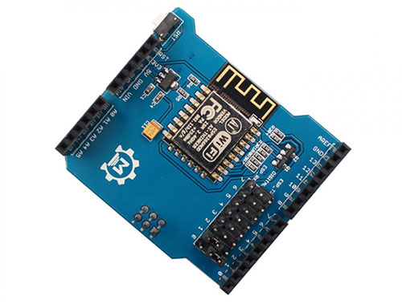

# Retour sur le port série et début Wifi <!-- omit in toc -->

# Table des matières <!-- omit in toc -->
- [Introduction](#introduction)
- [ESP8266](#esp8266)
  - [Les commandes AT](#les-commandes-at)
- [Le shield ESP8266](#le-shield-esp8266)
  - [Branchement](#branchement)
  - [Requis - IMPORTANT!!](#requis---important)
  - [Code pour configurer le wifi](#code-pour-configurer-le-wifi)
  - [Exemple de code - Serveur Web](#exemple-de-code---serveur-web)
  - [Exemple - Allumer une DEL](#exemple---allumer-une-del)
- [Références](#références)


# Introduction
Nous avons vu les notions de lecture pour le port série dans le cours suivant : [Lecture de données à partir du port série](../c07/c07b_serial_read/C07b_lecture_serie.md).

Dans ce cours, nous allons voir comment communiquer avec un Arduino Mega via le port série en utilisant un shield qui possède un microontrôleur ESP8266.



# ESP8266
Avant de débuter avec le shield, nous devons en connaître un peu plus sur l'ESP8266.

L'ESP8266 est un microcontrôleur qui peut être programmé en langage Arduino. Si vous êtes un apprenant qui commence à programmer en C, vous pourriez être intéressé par cette petite puce car elle est facile à utiliser et offre une grande variété de fonctionnalités.


Cette image montre la variété de modèles d'ESP disponibles sur le marché. Vous pouvez trouver des modèles avec des caractéristiques différentes, mais tous sont basés sur le même microcontrôleur ESP8266.

L'ESP8266 est un module peu coûteux d'où sa popularité. Il est également très facile à utiliser et à programmer. Il est également puissant et peut être utilisé pour créer des projets complexes.

L'ESP8266 est principalement utilisé pour se connecter à Internet et interagir avec des services en ligne. Vous pouvez créer des projets tels que des capteurs connectés, des systèmes d'automatisation domestique ou même des robots qui communiquent avec un serveur distant. Il peut également être utilisé pour contrôler des appareils électroniques tels que des lumières, des ventilateurs et des moteurs.

L'ESP8266 est équipé d'un processeur 32 bits à faible consommation d'énergie et dispose de 80 à 160 Ko de mémoire flash pour le stockage de programmes. Il prend en charge le Wi-Fi et peut être connecté à un réseau local ou à un point d'accès Wi-Fi pour se connecter à Internet. Il est également compatible avec de nombreuses bibliothèques et outils de développement, ce qui facilite la création de projets complexes.

Pour commencer à programmer l'ESP8266, vous devez disposer d'un module ESP8266 et d'un câble USB pour le connecter à votre ordinateur. Vous devez également télécharger et installer l'environnement Arduino. Une fois cela fait, vous pouvez ouvrir l'interface Arduino, sélectionner votre carte ESP8266 et commencer à écrire votre code.

En résumé, l'ESP8266 est un microcontrôleur puissant et facile à utiliser qui peut être programmé, entre autres, en langage C/C++. Il est équipé d'un processeur 32 bits, de Wi-Fi et d'une grande quantité de mémoire flash pour stocker des programmes. En utilisant l'environnement Arduino, vous pouvez facilement commencer à programmer l'ESP8266 et créer des projets connectés à Internet passionnants.

---

## Les commandes AT
Si le module ESP8266 est programmé avec le **firmware** AT, il peut être contrôlé par des commandes AT. Ainsi, il ne sera pas nécessaire de programmer directement le module ESP8266 pour l'utiliser. Il suffit de lui envoyer des commandes AT via le port série.

Les commandes AT sont des commandes qui permettent de contrôler le module ESP8266. Ces commandes sont envoyées au module ESP8266 via le port série. Le module ESP8266 répondra à ces commandes avec des données ou des informations.

Elles permettent, entre autres, de configurer les informations de connexion.

Dans notre cas, nous utilisons une librairie qui cachera ces commandes AT. Ce qui nous permettra de nous concentrer sur le code de notre application.

> **Note :** Le mot **firmware** désigne le programme qui est chargé sur un microcontrôleur. Il est différent du programme qui est chargé sur un ordinateur. Le firmware est écrit en langage assembleur ou en langage C/C++.

---

# Le shield ESP8266
Le module ESP8266 WiFi Shield est un module UART-WiFi ultra-basse consommation. Il a des dimensions excellentes et une technologie ULP par rapport à d'autres modules similaires. Le module est spécialement conçu pour les appareils mobiles et l'Internet des objets (IoT).

Ce Shield WiFi est basé sur ESP-12F, qui est la nouvelle version de l'ESP-12 avec la puce Wifi ESP8266. Avec ce Shield, vous pouvez facilement connecter votre Arduino au réseau et contrôler votre appareil de n'importe où. La communication se fait via une interface UART et le contrôle se fait par commande AT.

- Supporte la norme sans fil 802.11 b/g/n
- Supporte les trois modes de travail STA/AP/STA + AP
- Pile de protocoles TCP/IP intégrée, et supporte plusieurs connexions TCP Client
- Supporte une riche série de commandes AT pour Socket

## Branchement
La documentation en ligne montre un branchement du shield sur un Arduino Uno. Pour le branchement sur un Arduino Mega, il faut désactiver les cavaliers comme montré sur l'image ci-dessous.

Ensuite, il faut brancher une des broches ESP_RX sur la broche TX1 du Mega et la broche ESP_TX sur la broche RX1 du Mega.


Dans le code, il faudra alors utiliser les fonctions `Serial1` pour échanger avec le module.

## Requis - IMPORTANT!!
Pour le cours, il faut installer la librairie **WiFiEspAT** pour pouvoir utiliser le shield.

## Code pour configurer le wifi
Le code suivant permet de configurer le module wifi pour se connecter à un réseau wifi de manière persistante. Il faut donc le faire une seule fois.

```cpp
#include <WiFiEspAT.h>

#define HAS_SECRETS 0  // Mettre à 1 si le fichier arduino_secrets.h est présent

#if HAS_SECRETS
#include "arduino_secrets.h"
///////please enter your sensitive data in the Secret tab/arduino_secrets.h
const char ssid[] = SECRET_SSID;  // your network SSID (name)
const char pass[] = SECRET_PASS;  // your network password (use for WPA, or use as key for WEP)

#else
const char ssid[] = "ton_wifi";  // your network SSID (name)
const char pass[] = "ton_mdp";   // your network password (use for WPA, or use as key for WEP)

#endif

#define AT_BAUD_RATE 115200

int blinkRate = 500;

void setup() {
  pinMode(LED_BUILTIN, OUTPUT);

  Serial.begin(115200);
  while (!Serial);

  Serial1.begin(AT_BAUD_RATE);
  WiFi.init(&Serial1);

  if (WiFi.status() == WL_NO_MODULE) {
    Serial.println();
    Serial.println("La communication avec le module WiFi a échoué!");
    // ne pas continuer
    while (true);
  }

  WiFi.disconnect();  // pour effacer le chemin. non persistant

  WiFi.setPersistent();  // définir la connexion WiFi suivante comme persistante

  WiFi.endAP();  // pour désactiver le démarrage automatique persistant AP par défaut au démarrage

  // décommentez ces lignes pour une adresse IP statique persistante. définissez des adresses valides pour votre réseau
  // Pour l'adresse du cégep, la plage est 172.22.0.0 où les derniers octets sont entre 1 et 254
  // IPAddress ip(192, 168, 1, 9);
  // IPAddress gw(192, 168, 1, 1);
  // IPAddress nm(255, 255, 255, 0);
  // WiFi.config(ip, gw, gw, nm);

  Serial.println();
  Serial.print("Tentative de connexion à SSID: ");
  Serial.println(ssid);

  int status = WiFi.begin(ssid, pass);

  if (status == WL_CONNECTED) {
    Serial.println();
    Serial.println("Connecté au réseau WiFi.");
    printWifiStatus();
  } else {
    WiFi.disconnect();  // supprimer la connexion WiFi
    Serial.println();
    Serial.println("La connexion au réseau WiFi a échoué.");
    blinkRate = 100;
  }
}

void loop() {
  static unsigned long lastBlink = 0;
  if (millis() - lastBlink >= blinkRate) {
    lastBlink = millis();
    digitalWrite(LED_BUILTIN, !digitalRead(LED_BUILTIN));
  }
}

void printWifiStatus() {

  // imprime le SSID du réseau auquel vous êtes connecté:
  char ssid[33];
  WiFi.SSID(ssid);
  Serial.print("SSID: ");
  Serial.println(ssid);

  // imprime le BSSID du réseau auquel vous êtes connecté:
  uint8_t bssid[6];
  WiFi.BSSID(bssid);
  Serial.print("BSSID: ");
  printMacAddress(bssid);

  uint8_t mac[6];
  WiFi.macAddress(mac);
  Serial.print("MAC: ");
  printMacAddress(mac);

  // imprime l'adresse IP de votre carte:
  IPAddress ip = WiFi.localIP();
  Serial.print("Adresse IP: ");
  Serial.println(ip);

  // imprime la force du signal reçu:
  long rssi = WiFi.RSSI();
  Serial.print("force du signal (RSSI):");
  Serial.print(rssi);
  Serial.println(" dBm");
}

// Imprime l'adresse MAC
void printMacAddress(byte mac[]) {
  for (int i = 5; i >= 0; i--) {
    if (mac[i] < 16) {
      Serial.print("0");
    }
    Serial.print(mac[i], HEX);
    if (i > 0) {
      Serial.print(":");
    }
  }
  Serial.println();
}


```

## Exemple de code - Serveur Web

Ce code est un exemple d'utilisation de la bibliothèque `WiFiEspAT` pour créer un serveur web à l'aide d'un module Wifi ESP8266 branché sur le port série.

**Important :** Il faudra exécuter l'exemple du code pour configurer le module wifi pour se connecter à un réseau wifi de manière persistante avant de pouvoir utiliser ce code.

```cpp
/*
Serveur Web WiFi

Un simple serveur web qui affiche la valeur des broches d'entrée analogique.

Créé le 13 Juillet 2010
par dlf (Metodo2 srl)
modifié le 31 mai 2012
par Tom Igoe
modifié en juillet 2019 pour la bibliothèque WiFiEspAT
par Juraj Andrassy https://github.com/jandrassy
*/

#include <WiFiEspAT.h>

// Emuler Serial1 sur les broches 6/7 si non présent
#if defined(ARDUINO_ARCH_AVR) && !defined(HAVE_HWSERIAL1)
#include <SoftwareSerial.h>
SoftwareSerial Serial1(6, 7);  // RX, TX
#define AT_BAUD_RATE 9600
#else
#define AT_BAUD_RATE 115200
#endif

WiFiServer server(80);

void setup() {

  Serial.begin(115200);
  while (!Serial);

  Serial1.begin(AT_BAUD_RATE);
  WiFi.init(Serial1);

  if (WiFi.status() == WL_NO_MODULE) {
    Serial.println("La communication avec le module WiFi a échoué !");
    // ne pas continuer
    while (true);
  }

  // En attendant la connexion au réseau Wifi configuré avec le sketch SetupWiFiConnection
  Serial.println("En attente de connexion au WiFi");
  while (WiFi.status() != WL_CONNECTED) {
    delay(1000);
    Serial.print('.');
  }
  Serial.println();

  server.begin();

  IPAddress ip = WiFi.localIP();
  Serial.println();
  Serial.println("Connecté au réseau WiFi.");
  Serial.print("Pour accéder au serveur, entrez \"http://");
  Serial.print(ip);
  Serial.println("/\" dans un navigateur web.");
}

void loop() {

  WiFiClient client = server.available();
  if (client) {
    IPAddress ip = client.remoteIP();
    Serial.print("nouveau client ");
    Serial.println(ip);

    while (client.connected()) {
      if (client.available()) {
        String line = client.readStringUntil('\n');
        line.trim();
        Serial.println(line);

        // si vous avez atteint la fin de l'en-tête HTTP (la ligne est vide),
        // la demande HTTP est terminée, vous pouvez donc envoyer une réponse
        if (line.length() == 0) {
          // Ligne de statut HTTP
          client.println("HTTP/1.1 200 OK");

          // envoyer un en-tête de réponse HTTP
          client.println("Content-Type: text/html");
          client.println();

          // Corps du HTML
          client.println("<!DOCTYPE HTML>");
          client.println("<html>");
          client.println("<head>");
          // actualisez la page automatiquement toutes les 5 secondes
          client.println("<meta http-equiv=\"refresh\" content=\"5\" charset=\"UTF-8\">");
          client.println("</head>");

          // afficher la valeur des broches d'entrée analogique
          for (int analogChannel = 0; analogChannel < 4; analogChannel++) {
            int sensorReading = analogRead(analogChannel);
            client.print("Entree analogique ");
            client.print(analogChannel);
            client.print(" est ");
            client.print(sensorReading);
            client.println("<br />");
          }
          
          client.println("</html>");
          client.flush();
          break;
        }
      }
    }

    // fermer la connexion:
    client.stop();
    Serial.println("client déconnecté");
  }
}

```

## Exemple - Allumer une DEL

Voici un exemple dans lequel on allume ou éteint une DEL en fonction de ce qui a été reçu par le module Wifi.

**Important :** Il faudra exécuter l'exemple du code pour configurer le module wifi pour se connecter à un réseau wifi de manière persistante avant de pouvoir utiliser ce code.

```cpp
#include <WiFiEspAT.h>
#include "RingBuffer.h"

// Pour Arduino UNO
// Emuler Serial1 sur les broches 6/7 si non présent
#if defined(ARDUINO_ARCH_AVR) && !defined(HAVE_HWSERIAL1)
#include <SoftwareSerial.h>
SoftwareSerial Serial1(6, 7);  // RX, TX
#define AT_BAUD_RATE 9600
#else
#define AT_BAUD_RATE 115200
#endif

WiFiServer server(80);

// Utilise un tampon circulaire pour améliorer
// la vitesse et réduire l'allocation de mémoire
RingBuffer buf(8);

int ledStatus = 0;

void setup() {
  pinMode(LED_BUILTIN, OUTPUT);

  Serial.begin(115200);
  while (!Serial)
    ;

  Serial1.begin(AT_BAUD_RATE);
  WiFi.init(Serial1);

  if (WiFi.status() == WL_NO_MODULE) {
    Serial.println("La communication avec le module WiFi a échoué !");
    // ne pas continuer
    while (true)
      ;
  }

  // En attendant la connexion au réseau Wifi configuré avec le sketch SetupWiFiConnection
  Serial.println("En attente de connexion au WiFi");
  while (WiFi.status() != WL_CONNECTED) {
    delay(1000);
    Serial.print('.');
  }
  Serial.println();

  server.begin();

  IPAddress ip = WiFi.localIP();
  Serial.println();
  Serial.println("Connecté au réseau WiFi.");
  Serial.print("Pour accéder au serveur, entrez \"http://");
  Serial.print(ip);
  Serial.println("/\" dans un navigateur web.");
}

void loop() {
  wifiTask();
}

void wifiTask() {
    WiFiClient client = server.available();

  // Si vous obtenez un client
  if (client) {
    IPAddress ip = client.remoteIP();
    Serial.print("nouveau client ");
    Serial.println(ip);

    // Initialiser le tampon circulaire
    buf.init();

    // Boucler tant que le client est connecté
    while (client.connected()) {

      // Si des octets sont disponibles à partir du client
      if (client.available()) {

        char c = client.read();  // lire un octet et
        buf.push(c);             // le pousser dans le tampon circulaire

        // Écrire dans le flux série va ralentir le code
        //Serial.write(c);

        // Vérifiez si la requête HTTP est terminée en détectant deux caractères
        // de nouvelle ligne consécutifs "\r\n\r\n", puis envoyez une réponse
        if (buf.endsWith("\r\n\r\n")) {
          sendHttpResponse(client);
          break;
        }

        // Regarder si le client a demandé était "GET /H" or "GET /L":
        if (buf.endsWith("GET /H")) {
          Serial.println("Turn led ON");
          digitalWrite(LED_BUILTIN, HIGH);
          ledStatus = 1;
        } else if (buf.endsWith("GET /L")) {
          Serial.println("Turn led OFF");
          digitalWrite(LED_BUILTIN, LOW);

          ledStatus = 0;
        }
      }
    }

    // fermer la connexion:
    client.stop();
    Serial.println("client déconnecté");
  }
}

void sendHttpResponse(WiFiClient client) {
  sendHTTPHeader(client);

  // Le contenu de la réponse HTTP suit l'en-tête :
  // il affiche l'état de la LED et fournit des liens pour allumer ou éteindre la LED.
  client.print("The LED is ");
  client.print(ledStatus);
  client.println("<br>");
  client.println("<br>");

  client.println("Click <a href=\"/H\">here</a> turn the LED on<br>");
  client.println("Click <a href=\"/L\">here</a> turn the LED off<br>");

  // The HTTP response ends with another blank line:
  client.println();
}

// Envoie l'entête HTTP pour une réponse
// Appeler celle-ci pour éviter la duplication de code
void sendHTTPHeader(WiFiClient client) {
  // Les en-têtes HTTP commencent toujours par un code de réponse (par exemple, HTTP/1.1 200 OK)
  // et un type de contenu pour que le client sache ce qui arrive, puis une ligne vide.
  client.println("HTTP/1.1 200 OK");
  client.println("Content-type:text/html");
  client.println();
}
```

---

# Références
- [Site officiel : ESP8266](https://www.espressif.com/en/products/socs/esp8266)
- [Documentation libraire WiFiEsp](https://github.com/bportaluri/WiFiEsp)
- [Web Server LED](https://github.com/bportaluri/WiFiEsp/blob/master/examples/WebServerLed/WebServerLed.ino)
- [Requête HTTP](https://cshaw.jhoffman.ca/sessions/2022A/0SV/documentation/2.1-service-web/#requete-http-menu)