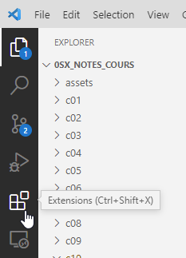
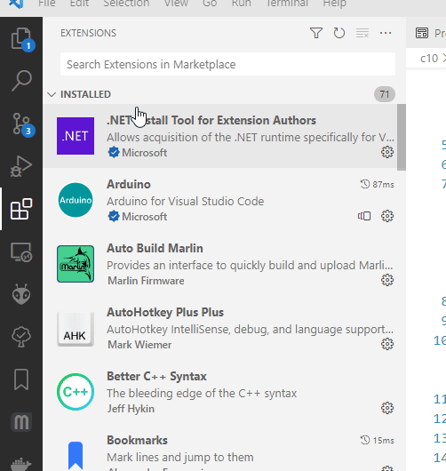
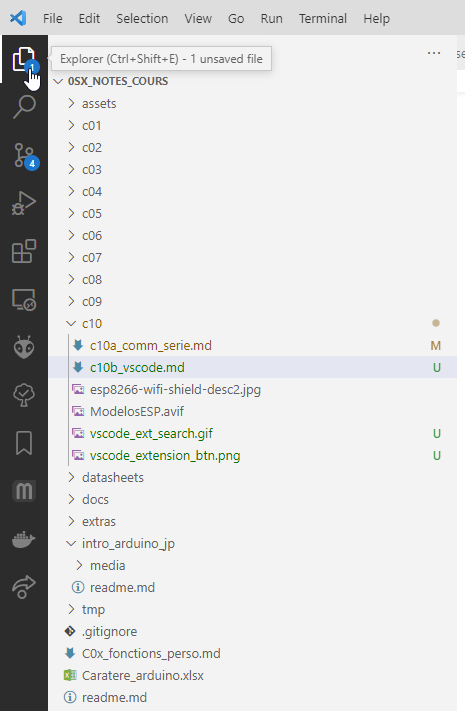
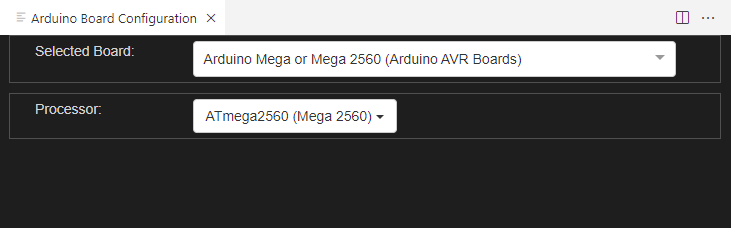
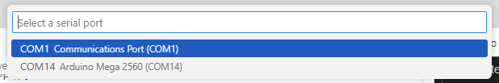
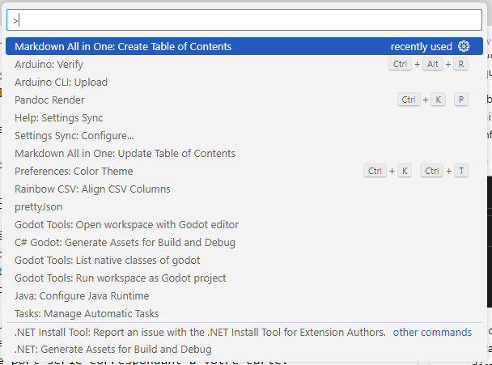

# Utiliser Visual Studio Code avec Arduino

- [Utiliser Visual Studio Code avec Arduino](#utiliser-visual-studio-code-avec-arduino)
- [Introduction](#introduction)
- [Visual Studio Code](#visual-studio-code)
  - [Installer Visual Studio Code](#installer-visual-studio-code)
  - [Installer l'extension Arduino](#installer-lextension-arduino)
- [Ouvrir un projet Arduino](#ouvrir-un-projet-arduino)
- [Configurer l'extension Arduino](#configurer-lextension-arduino)
- [Vérifier ou téléverser un projet Arduino](#vérifier-ou-téléverser-un-projet-arduino)
- [Avantages de VSCode](#avantages-de-vscode)
- [Exercices](#exercices)

# Introduction
Jusqu'à maintenant, nous avons utilisé l'IDE Arduino pour programmer nos cartes. C'est un outil très pratique, mais il n'est pas le seul. Il existe d'autres outils qui peuvent être utilisés pour programmer les cartes Arduino. Nous allons voir comment utiliser Visual Studio Code avec Arduino.

# Visual Studio Code
Visual Studio Code (vscode) est un environnement de développement intégré (IDE) développé par Microsoft. Il est disponible pour Windows, Linux et macOS. Il est gratuit et open source. Il est très populaire et est utilisé par de nombreux développeurs. Il est très personnalisable et peut être étendu avec des extensions. Il est également possible d'utiliser des extensions pour programmer des cartes Arduino.

## Installer Visual Studio Code
Si vous ne l'avez pas encore, la première étape sera d'installer Visual Studio Code. Vous pouvez le télécharger sur le site officiel de Visual Studio Code.

https://code.visualstudio.com/download

Téléchargez la version qui correspond à votre système d'exploitation. Une fois le téléchargement terminé, installez-le.

## Installer l'extension Arduino
Une fois Visual Studio Code installé, nous allons installer l'extension Arduino. Pour ce faire, ouvrez Visual Studio Code et cliquez sur l'icône Extensions dans la barre latérale gauche.

Cela ouvrira le **volet Extensions**. Cliquez sur l'onglet Rechercher dans le volet Extensions et tapez **Arduino** dans la barre de recherche.

Cliquez sur l'extension **Arduino** et cliquez sur le bouton **Installer**.

Cela peut prendre quelques instants. Une fois l'installation terminée, vous pouvez fermer le volet Extensions.

# Ouvrir un projet Arduino
Pour ouvrir un projet Arduino, il suffit d'ouvrir un dossier qui contient un fichier `.ino`.

Ensuite, on peut naviguer dans les fichiers du projet en utilisant l'explorateur de fichiers dans la barre latérale gauche.

# Configurer l'extension Arduino
Pour compiler et téléverser un projet Arduino, il faut configurer l'extension Arduino. Pour ce faire, cliquez sur l'icône **Arduino** dans la barre latérale gauche.

En bas à droite dans la barre de status (barre bleue au bas de la fenêtre), vous allez voir un message similaire à "Arduino: No board selected". Cliquez sur ce message pour ouvrir le menu de configuration.

Un onglet nommé "Arduino Board Configuration" apparaîtra dans la fenêtre principale. Sélectionnez la carte que vous utilisez dans la liste déroulante "Board" et si nécessaire le processeur dans la liste déroulante "Processor".

Ensuite, il faudra sélectionner le port série. Pour ce faire, dans la barre de status à droite, cliquez sur le bouton "Select Port" et sélectionnez le port série correspondant à votre carte.

# Vérifier ou téléverser un projet Arduino
Pour vérifier ou téléverser un projet Arduino, il faut lancer la palette de commandes. Pour ce faire, appuyez sur la combinaison de touches <kbd>Ctrl</kbd>+<kbd>Shift</kbd>+<kbd>P</kbd>. Une fenêtre de recherche apparaîtra en haut de la fenêtre principale.

Recherchez pour "Arduino" et sélectionnez la commande "Arduino: Verify" ou "Arduino CLI: Upload".

> **Note:** Les commandes varieront selon les extensions qui sont installées.

# Avantages de VSCode
- Visual Studio Code est gratuit et open source.
- Il permet de facilement naviguer dans les fichiers d'un projet.
- Il est disponible pour Windows, Linux et macOS.
- Il est très personnalisable et peut être étendu avec des extensions.
- On peut l'utiliser pour programmer dans plusieurs langages.

# Exercices
- Installer Visual Studio Code.
- Installer et configurer l'extension Arduino.
- Ouvrir un projet Arduino.
- Compiler et téléverser un projet Arduino.

