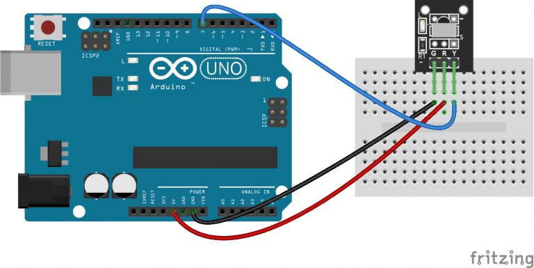

# La manette IR <!-- omit in toc -->


## Table des matières <!-- omit in toc -->
- [Introduction](#introduction)
- [Objectifs](#objectifs)
- [Manette IR théorie](#manette-ir-théorie)
- [Lumière infrarouge](#lumière-infrarouge)
- [Modulation](#modulation)
- [Les manettes IR](#les-manettes-ir)
- [Le matériel du kit](#le-matériel-du-kit)
- [La library `IRremote`](#la-library-irremote)
  - [Explication du code](#explication-du-code)
- [Exercices](#exercices)
- [Références](#références)


# Introduction
Dans cette leçon, nous allons apprendre à utiliser une manette infrarouge (IR) pour envoyer des commandes à notre microcontrôleur. Nous allons utiliser un récepteur IR pour capter les signaux infrarouge.

Votre kit vient avec une manette IR et un récepteur IR qui ressemble à ceci:


Il se peut que votre modèle soit légèrement différent, mais le principe reste le même.

# Objectifs
- Comprendre le fonctionnement d'une manette IR
- Utiliser un récepteur IR pour capter les signaux infrarouge
- Utiliser la librairie `IRremote` pour décoder les signaux infrarouge

# Manette IR théorie
La manette IR est un dispositif de contrôle à distance qui envoie des signaux infrarouges. Ces signaux sont captés par un récepteur IR. Les signaux sont envoyés sous forme de codes binaires qui sont décodés par le microcontrôleur.

La méthode la moins chère pour contrôler à distance un appareil dans une plage visible est via la lumière infrarouge. Presque tous les équipements audio et vidéo peuvent être contrôlés de cette manière. En raison de cette utilisation généralisée, les composants nécessaires sont assez bon marché et facilement disponibles, ce qui en fait un choix idéal pour nous, les amateurs, d'utiliser le contrôle IR pour nos propres projets.

# Lumière infrarouge
La lumière infrarouge est actuellement la lumière normale avec une couleur particulière. Nous, les humains, ne pouvons pas voir cette couleur car sa longueur d'onde d'environ 950 nm est en dessous du spectre visible. C'est l'une des raisons pour lesquelles l'IR est choisi à des fins de contrôle à distance, nous voulons l'utiliser mais nous ne sommes pas intéressés à le voir. Une autre raison est que les LED IR sont assez faciles à fabriquer et peuvent donc être très bon marché.


Bien que nous, les humains, ne puissions pas voir la lumière infrarouge émise par une télécommande, cela ne signifie pas que nous ne pouvons pas la rendre visible.
Une caméra vidéo ou un appareil photo numérique peut "voir" la lumière infrarouge comme vous pouvez le voir sur cette image. Même les téléphones portables les moins chers ont aujourd'hui des caméras intégrées. Pointez simplement votre télécommande vers une telle caméra, appuyez sur n'importe quel bouton et vous verrez la LED clignoter.

> **Life hack** : Si vous voulez savoir si les piles de votre manette IR sont encore bonnes, pointez la manette vers la caméra de votre téléphone et appuyez sur un bouton. Si vous voyez la LED clignoter, les piles sont bonnes.

Malheureusement pour nous, il existe de nombreuses autres sources de lumière infrarouge. Le soleil est la source la plus brillante de toutes, mais il y en a beaucoup d'autres, comme: les ampoules, les bougies, le système de chauffage central, et même notre corps rayonne de la lumière infrarouge. En fait, tout ce qui rayonne de la chaleur rayonne également de la lumière infrarouge. Par conséquent, nous devons prendre certaines précautions pour garantir que notre message IR parvienne au récepteur sans erreurs. On appelle cela la **modulation**.

# Modulation
La modulation du signal sur une fréquence porteuse est la réponse pour que notre signal se démarque du bruit. Avec la modulation, nous faisons clignoter la source de lumière IR à une fréquence particulière. Le récepteur IR sera réglé sur cette fréquence, il peut donc ignorer tout le reste.


Dans l'image ci-dessus, vous pouvez voir un signal IR modulé par la partie de gauche. Le signal détecter sort de la partie de droite sur le récepteur IR. 

# Les manettes IR
Chaque manette IR utilise un protocole de communication spécifique. Les protocoles les plus courants sont NEC, Sony, RC5, RC6, etc. Chaque protocole a sa propre façon de moduler les signaux IR. C'est comme cela que le récepteur IR peut distinguer les signaux de différentes manettes. Par exemple, si j'ai un téléviseur Sony, je ne veux pas que ma manette de climatiseur déclenche des actions sur mon téléviseur. C'est pourquoi chaque manette a son propre protocole.

La librairie `IRremote` supporte de nombreux protocoles différents.

# Le matériel du kit
Dans le kit, vous avez une manette IR qui utilise le protocole **`NEC`**. Cette manette a 21 boutons. Chaque bouton envoie un signal IR différent.

Vous avez aussi un récepteur IR qui ressemble à ceci:


Ce récepteur a 3 broches:
- `VCC` : Alimentation 5V
- `GND` : Masse
- `OUT` : Signal de sortie

La sortie `OUT` est connectée à une broche digitale de l'Arduino. Lorsque le récepteur capte un signal IR, il envoie un signal digital à l'Arduino.



# La library `IRremote`
La librairie `IRremote` est une librairie très populaire pour Arduino qui permet de décoder les signaux IR. Elle supporte de nombreux protocoles différents. Vous pouvez l'installer via le gestionnaire de librairies de l'IDE Arduino.

Pour utiliser la librairie, vous devez inclure le fichier d'en-tête **`IRremote.hpp`** et créer un objet de type `IRrecv` qui représente le récepteur IR.

> Remarquez, j'ai mis .hpp à la place de .h. 

```cpp
#include <IRremote.hpp>

const int RECV_PIN = 26;

void setup() {
  Serial.begin(9600);

  // Initialiser le récepteur IR avec le pin spécifié et activer la LED intégrée pour donner un retour visuel lors de la réception de signaux.
  IrReceiver.begin(RECV_PIN, ENABLE_LED_FEEDBACK);

  // Activer en plus la LED de retour qui indique quand un signal IR est reçu.
  setFeedbackLED(true);
}

void loop() {
  // Vérifier si le récepteur IR a décodé un signal.
  if (IrReceiver.decode()) {

    Serial.println("--------");

    // Imprimer le protocole du signal IR reçu.
    Serial.print("Protocole : ");
    Serial.println(IrReceiver.getProtocolString());

    // Imprimer la partie commande du signal IR décodé.
    Serial.print("Commande : ");
    Serial.println(IrReceiver.decodedIRData.command);

    // Imprimer les données brutes du signal IR décodé au format hexadécimal.
    Serial.print("Brute : ");
    Serial.println(IrReceiver.decodedIRData.decodedRawData, HEX);

    // Imprimer les flags associés au signal décodé.
    Serial.print("Flags : ");
    Serial.print(IrReceiver.decodedIRData.flags);
    
    // Si les flags indiquent un signal de répétition, ajouter " (Répétition)" à l'impression.
    if (IrReceiver.decodedIRData.flags) {
      Serial.println(" (Répétition)");      
    } else {
      Serial.println("");
    }
    
    // Préparer le récepteur pour le prochain signal.
    IrReceiver.resume();
  }
}

```

## Explication du code
Dans l'exemple du code, vous avez les principales fonctions nécessaires pour réaliser une application complète de réception de signaux IR.

`IrReceiver.decodedIRData` est une structure qui contient toutes les informations sur le signal IR reçu. Vous pouvez accéder à ces informations en utilisant les membres de la structure.

Voici un tableau des principaux membres de la structure `IrReceiver.decodedIRData`:

| Membre | Description |
| --- | --- |
| `protocol` | Le protocole du signal IR reçu. (Ex : Sony, NEC, LG, ...) |
| `command` | La commande envoyée par la manette IR |
| `flags` | Les flags associés au signal IR. Il y en a plusieurs, il faut regarder avec le code source. Si le dernier bit est 1, c'est une répétition (IRDATA_FLAGS_IS_REPEAT). Par exemple, lorsque l'on augmente le volume. |
| `decodedRawData` | Les données brutes du signal IR décodé au format hexadécimal |

# Exercices
1. Connectez le récepteur IR à l'Arduino comme indiqué dans le schéma ci-dessus.
2. Téléversez le code ci-dessus sur l'Arduino.

---
---

# Références
- [Makerguides - How to use an IR receiver and remote with Arduino](https://www.makerguides.com/ir-receiver-remote-arduino-tutorial/)
- [Arduino-IRremote library](https://github.com/Arduino-IRremote/Arduino-IRremote)
- [SB-Projects - IR Remote Control Theory](https://www.sbprojects.net/knowledge/ir/index.php)
- [Circuit Basics - Arduino IR Remote Control](https://www.circuitbasics.com/arduino-ir-remote-receiver-tutorial/)