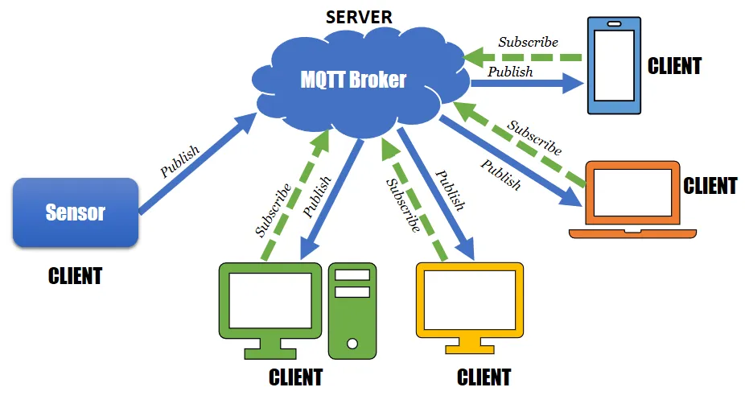

# MQTT <!-- omit in toc -->

# Table des matières <!-- omit in toc -->
- [Qu'est-ce que le MQTT?](#quest-ce-que-le-mqtt)
- [Concepts](#concepts)
  - [Le courtier (*broker*)](#le-courtier-broker)
  - [Les clients](#les-clients)
  - [Les sujets (*topic*)](#les-sujets-topic)
    - [Les caractères spéciaux](#les-caractères-spéciaux)
  - [Les messages (*payload*)](#les-messages-payload)
    - [JSON crash course](#json-crash-course)
  - [La qualité de service (QoS)](#la-qualité-de-service-qos)
- [Intégration MQTT avec Arduino](#intégration-mqtt-avec-arduino)
- [Exemple à utiliser](#exemple-à-utiliser)
- [La librarie WiFiEspAT](#la-librarie-wifiespat)
- [La librarie PubSubClient](#la-librarie-pubsubclient)
  - [Initialisation du client MQTT](#initialisation-du-client-mqtt)
  - [Configuration du client au serveur MQTT](#configuration-du-client-au-serveur-mqtt)
  - [Connexion au serveur MQTT](#connexion-au-serveur-mqtt)
  - [Configuration de la fonction de rappel](#configuration-de-la-fonction-de-rappel)
  - [S'abonner à un sujet](#sabonner-à-un-sujet)
  - [Publier un message](#publier-un-message)
  - [Le JSON](#le-json)
- [Exercice](#exercice)
- [Annexes](#annexes)
  - [Exemples supplémentaires pour la gestion des topics](#exemples-supplémentaires-pour-la-gestion-des-topics)
- [Références](#références)

# Qu'est-ce que le MQTT?
Le MQTT est un protocole (Message Queuing Telemetry Transport) de messagerie simple, léger et relativement simple à implémenter. Il est conçu pour les communications entre machines dans des environnements où la bande passante et la latence sont des contraintes importantes. Nous allons l'utiliser pour communiquer entre notre Arduino et un serveur MQTT.

---

# Concepts
MQTT repose sur un modèle de communication basé sur l'abonnement/souscription (publish/subscribe). Dans ce modèle, il y a deux types d'acteurs : les **clients** et le courtier (**broker**). Les clients peuvent être des capteurs, des actionneurs, des microcontrôleurs (comme l'Arduino) ou d'autres dispositifs capables de se connecter à Internet. Le courtier est un serveur central qui gère les communications entre les clients.


---

## Le courtier (*broker*)
Le courtier est un serveur central qui gère les communications entre les clients. Il est responsable de la distribution des messages aux clients abonnés aux sujets correspondants. Il est également responsable de la gestion des connexions et de la persistance des messages. Il est possible d'utiliser un courtier tiers, comme [CloudMQTT](https://www.cloudmqtt.com/), ou d'utiliser un courtier local, comme [Mosquitto](https://mosquitto.org/).

Dans le cas de mon serveur, j'utilise mosquitto. Vous pouvez l'installer sur votre machine en utilisant la commande `sudo apt install mosquitto`.

Voici les étapes pour tester votre serveur MQTT :
- Lancez le serveur en utilisant la commande `mosquitto`.
- Connectez-vous à votre serveur en utilisant la commande `mosquitto_sub -h localhost -t "test"`.
- Dans une autre instance de ligne de commandes, publiez un message en utilisant la commande `mosquitto_pub -h localhost -t "test" -m "Hello World!"`.

La configuration persistente du serveur sort du cadre de ce cours. Vous pouvez trouver plus d'informations sur le site officiel de [Mosquitto](https://mosquitto.org/).

> **Note :** En plus de l'adresse IP du serveur, il faut connaitre le port sur lequel le serveur écoute. Par défaut, le port utilisé par le serveur MQTT est le **port 1883**. Vous pouvez le changer dans le fichier de configuration du serveur.

Le courtier peut être protégé par un nom d'utilisateur et un mot de passe. Dans ce cas, vous devez utiliser la commande `mosquitto_sub -h localhost -t "test" -u "username" -P "password"`. Vous pouvez aussi utiliser la commande `mosquitto_pub -h localhost -t "test" -m "Hello World!" -u "username" -P "password"`.

Il est fortement recommandé, au minimum, d'**utiliser un nom d'utilisateur et un mot de passe** pour protéger votre serveur MQTT.

Dans un monde idéal, le courtier devrait être protégé par un **certificat SSL**. Cependant, cette notion sort du cadre de ce cours.

---

## Les clients
Les clients sont des appareils qui peuvent se connecter au courtier pour envoyer et recevoir des messages. Les clients peuvent être des capteurs, des actionneurs, des microcontrôleurs (comme l'Arduino) ou d'autres dispositifs capables de se connecter à Internet. Les clients peuvent s'abonner à un ou plusieurs sujets pour recevoir les messages correspondants, et publier des messages sur des sujets spécifiques.



---

## Les sujets (*topic*)
Le MQTT utilise des "**sujets**" pour organiser les messages échangés entre les clients et le courtier. Les sujets sont des chaînes de caractères hiérarchiques, semblables à des chemins de fichiers. Par exemple, un sujet peut être "maison/salon/temperature". Les clients peuvent s'abonner à un ou plusieurs sujets pour recevoir les messages correspondants, et publier des messages sur des sujets spécifiques.

Par exemple, un thermostat peut publier la température actuelle sur le sujet "maison/salon/temperature". Un autre client peut s'abonner à ce sujet pour recevoir les mises à jour de température. Un autre client peut publier la température désirée sur le sujet "maison/salon/temperature/desiree". Un autre client peut s'abonner à ce sujet pour recevoir les mises à jour de température désirée.

### Les caractères spéciaux
Les sujets peuvent contenir des caractères alphanumériques, les tirets et les tirets bas. De plus, il y a des caractères spéciaux. Les caractères spéciaux sont les caractères suivants : `+` et `#`. Ils ne peuvent pas être utilisés dans les sujets.

Le caractère `+` est un caractère de remplacement. Il peut être utilisé pour remplacer un seul niveau de hiérarchie dans un sujet. Par exemple, le sujet `maison/salon/+` peut être utilisé pour s'abonner à tous les messages publiés sur les sujets `maison/salon/temperature`, `maison/salon/humidite`, etc.

On peut aussi utiliser le `+` pour s'inscrire à un sujet qui contient plusieurs niveaux de hiérarchie. Par exemple, le sujet `maison/salon/+/temperature` peut être utilisé pour s'abonner à tous les messages publiés sur les sujets `maison/salon/chambre/temperature`, `maison/salon/cuisine/temperature`, etc.

Le caractère `#` est un caractère de remplacement. Il peut être utilisé pour remplacer un ou plusieurs niveaux de hiérarchie dans un sujet. Par exemple, le sujet `maison/salon/#` peut être utilisé pour s'abonner à tous les messages publiés sur les sujets `maison/salon/temperature`, `maison/salon/humidite`, `maison/salon/chambre/temperature`, `maison/salon/cuisine/temperature`, etc.

Voici des exemples de sujets valides avec des caractères spéciaux :
| Sujet                       | Description                                                           |
|-----------------------------|-----------------------------------------------------------------------|
| maison/salon/temperature    | Un sujet standard pour la température du salon                       |
| maison/+/luminosite         | Un sujet avec un caractère joker '+' pour la luminosité de toutes les pièces de la maison |
| maison/#                    | Un sujet avec un caractère joker '#' pour tous les sujets sous "maison" |
| capteurs/salle_01/temp      | Un sujet pour la température de la salle 01                          |
| voiture/position/latitude   | Un sujet pour la latitude de la position d'une voiture                |
| voiture/position/longitude  | Un sujet pour la longitude de la position d'une voiture              |
| capteur_special/01-temperature | Un sujet pour un capteur spécial avec des caractères alphanumériques et des tirets |
| printer3d/bed/temperature   | Un sujet pour la température du lit d'une imprimante 3D              |
| printer3d/nozzle/temperature | Un sujet pour la température de la buse d'une imprimante 3D          |
| printer3d/+/temperature     | Un sujet avec un caractère joker '+' pour la température de tous les capteurs d'une imprimante 3D |

---
## Les messages (*payload*)
Les messages sont les données échangées entre les clients et le courtier. Les messages sont des chaînes de caractères ou données binaires. Les clients peuvent publier des messages sur des sujets spécifiques, et les clients peuvent s'abonner à un ou plusieurs sujets pour recevoir les messages correspondants.

Les messages peuvent être aussi simple que `0` ou `1` pour par exemple allumer ou éteindre une lumière, ou plus complexe comme des données de capteurs. Les messages peuvent prendre plusieurs formats, mais un format que l'on retrouve régulièrement est le JSON.

### JSON crash course

Le JSON est une chaîne de caractères formatée selon un standard. Il est composé de paires clé-valeur. Les clés sont des chaînes de caractères entre guillemets doubles. Les valeurs peuvent être des chaînes de caractères entre guillemets doubles, des nombres, des booléens, des tableaux ou des objets.

Un fichier JSON est contenu entre accolades. Chaque paire clé-valeur est séparée par une virgule. Les clés et les valeurs sont séparées par deux points.

Voici quelques exemples de contenu JSON typique que l'on peut échanger en MQTT :
```json
{
  "temperature": 25.5,
  "humidite": 60,
  "capteur": "DHT11",
  "date": "2019-01-01T12:00:00Z"
}
```

Données qui être renvoyées par un interrupteur intelligent :
```json
{
  "state": "on",
  "power": 10.0,
  "energy": 100.0
}
```

Exemple pour l'état d'une ampoule intelligente :
```json
{
  "state": "on",
  "brightness": 100,
  "color": {
    "r": 255,
    "g": 255,
    "b": 255
  }
}
```

Un autre exemple pour l'état d'une imprimante 3d :
```json
{
  "bed": {
    "temperature": 60.0,
    "target": 60.0
  },
  "nozzle": {
    "temperature": 200.0,
    "target": 200.0
  },
  "state": "printing",
  "progress": 0.5
}
```

On remarque que c'est un format de données relativement simple à comprendre. C'est un format qui est utilisé dans de nombreux domaines, et qui est facile à lire et à écrire.

C'est la raison principale pour laquelle nous allons utiliserons le JSON pour nos messages MQTT.

---

## La qualité de service (QoS)
MQTT offre trois niveaux de qualité de service (QoS) pour les messages échangés entre les clients et le courtier :
- QoS 0 (Au plus une fois) : Le message est envoyé sans confirmation, ce qui signifie qu'il peut être perdu. On entendra parfois que ce le mécanisme "*Fire and Forget*".
- QoS 1 (Au moins une fois) : Le message est envoyé avec confirmation, garantissant qu'il sera reçu au moins une fois.
- QoS 2 (Exactement une fois) : Le message est envoyé avec un mécanisme de contrôle qui garantit qu'il sera reçu une seule fois.

Dans notre cas, nous allons utilisé le QoS 0. Le QoS 1 et 2 sont plus compliqués à implémenter et ne sont pas nécessaire pour notre application.


> **Note :** L'abréviation *QoS* a différentes significations dans le monde de l'informatique dépendant du contexte. Dans le cas du MQTT, il s'agit de la qualité de service au niveau applicatif. Dans le cas de la réseautique, il s'agit de la qualité de service au niveau du réseau.

---

# Intégration MQTT avec Arduino
Dans notre situation, nous allons utiliser le MQTT pour un simple échange de données entre votre Arduino et un serveur MQTT. J'aurai préalablement configuré le serveur MQTT, car cela sort du cadre de ce cours. Vous n'aurez qu'à vous connecter à ce serveur. Vous pourrez alors envoyer des données à votre Arduino et recevoir des données de votre Arduino.

Pour utiliser MQTT, vous allez avoir besoin d'une bibliothèque MQTT telle que `PubSubClient`. Vous pouvez l'installer depuis le gestionnaire de bibliothèques de l'IDE Arduino. Ensuite, il faudra que l'appareil soit connecté à un réseau. Pour cela, vous avez entre vos mains le ESP8266 WiFi shield (OAS8266WF) ou un ESP01 avec un adaptateur série.

De plus vous aurez avoir besoin de la librairie `WiFiEspAT` pour faire fonctionner le shield. Vous pouvez l'installer depuis le gestionnaire de bibliothèques de l'IDE Arduino.

> **Note** : **Pour faire fonctionner l'exemple, il faudra avoir préconfiguré le shield** pour qu'il se connecte au réseau WiFi. Allez voir le cours sur la connexion WiFi pour plus d'informations.

---

# Exemple à utiliser
Nous allons utiliser l'exemple `mqtt_test` qui se retrouve dans le dossier des [projets du cours](https://github.com/nbourre/0sx_projets_cours/). Il s'agit d'un exemple simple qui permet de publier et de souscrire à un sujet MQTT. Nous allons pouvoir l'intégrer dans notre projet pour envoyer des données à notre serveur MQTT.

Voici le code entier de l'exemple :
<details><summary>Cliquez pour le voir</summary>

```cpp
/*
*  IMPORTANT! S'assurer que le Wifi est configuré avant de téléverser ce code.
*  Projet : Examples --> WifiEspAT --> Tools --> SetupWifiPersistentConnection
*/

#define HOME 1

#include <WiFiEspAT.h>
#include <PubSubClient.h>
#include <DHT.h>

#define AT_BAUD_RATE 115200

#if HOME
#define DEVICE_NAME "NickHome"
#else
#define DEVICE_NAME "NickProf"
#endif

#define MQTT_PORT 1883
#define MQTT_USER "etdshawi"
#define MQTT_PASS "shawi123"

// Serveur MQTT du prof
const char* mqttServer = "216.128.180.194";

WiFiClient wifiClient;
PubSubClient client(wifiClient);

unsigned long currentTime = 0;

#define DHT_PIN 10
#define DHT_TYPE DHT11

#define MOTOR_PIN 31

DHT dht(DHT_PIN, DHT_TYPE);


void wifiInit() {
  // Initialisation du module WiFi.
  Serial3.begin(AT_BAUD_RATE);
  WiFi.init(Serial3);
  
  if (WiFi.status() == WL_NO_MODULE) {
    Serial.println();
    Serial.println("La communication avec le module WiFi a échoué!");
    // Ne pas continuer
    while (true) {
      // Clignoter rapidement pour annoncer l'erreur
      digitalWrite(LED_BUILTIN, !digitalRead(LED_BUILTIN));
      delay(50);
    }
  }
  
  // En attendant la connexion au réseau Wifi configuré avec le sketch SetupWiFiConnection
  Serial.println("En attente de connexion au WiFi");
  while (WiFi.status() != WL_CONNECTED) {
    delay(1000);
    Serial.print('.');
  }
  Serial.println();

  IPAddress ip = WiFi.localIP();
  Serial.println();
  Serial.println("Connecté au réseau WiFi.");
  Serial.print("Adresse : ");
  Serial.println(ip);

  printWifiStatus();
}

// Procédure Afficher le status de la connection
// WiFi sur le port série
void printWifiStatus() {

  // imprimez le SSID du réseau auquel vous êtes connecté:
  char ssid[33];
  WiFi.SSID(ssid);
  Serial.print("SSID: ");
  Serial.println(ssid);

  // imprimez le BSSID du réseau auquel vous êtes connecté:
  uint8_t bssid[6];
  WiFi.BSSID(bssid);
  Serial.print("BSSID: ");
  printMacAddress(bssid);

  uint8_t mac[6];
  WiFi.macAddress(mac);
  Serial.print("MAC: ");
  printMacAddress(mac);

  // imprimez l'adresse IP de votre carte:
  IPAddress ip = WiFi.localIP();
  Serial.print("Adresse IP: ");
  Serial.println(ip);

  // imprimez la force du signal reçu:
  long rssi = WiFi.RSSI();
  Serial.print("force du signal (RSSI):");
  Serial.print(rssi);
  Serial.println(" dBm");
}

void printMacAddress(byte mac[]) {
  for (int i = 5; i >= 0; i--) {
    if (mac[i] < 16) {
      Serial.print("0");
    }
    Serial.print(mac[i], HEX);
    if (i > 0) {
      Serial.print(":");
    }
  }
  Serial.println();
}

// Vous pouvez remplacez cette fonction par la votre
// par exemple pour allumer une lumière
void toggleMoteur() {
  value = digitalRead(MOTOR_PIN);
  digitalWrite(MOTOR_PIN, !value);
}

// Gestion des messages reçues de la part du serveur MQTT
void mqttEvent(char* topic, byte* payload, unsigned int length) {
  Serial.print("Message recu [");
  Serial.print(topic);
  Serial.print("] ");
  for (int i=0;i<length;i++) {
    Serial.print((char)payload[i]);
  }
  Serial.println();

  if (strcmp(topic, "moteur") == 0) {
    toggleMoteur();    
  }
}

void periodicTask() {
  static unsigned long lastTime = 0;
  const unsigned int rate = 10000;

  static char message[100] = "";
  static char szTemp[6];
  static char szHum[6];
  static float temp = 0;
  static float hum = 0;

  if (currentTime - lastTime < rate) return;

  lastTime = currentTime;

  temp = dht.readTemperature();
  hum = dht.readHumidity();

  // On convertit les valeurs en chaîne de caractères
  dtostrf(temp, 4, 1, szTemp);
  dtostrf(hum, 4, 1, szHum);

#if HOME
  sprintf(message, "{\"name\":%s, \"temp\" : %s, \"hum\":%s, \"millis\":%lu }", "\"profHome\"", szTemp, szHum, currentTime / 1000);
#else
  sprintf(message, "{\"name\":%s, \"temp\" : %s, \"hum\":%s, \"millis\":%lu }", "\"Le prof\"", szTemp, szHum, currentTime / 1000);
#endif

  Serial.print("Envoie : ");
  Serial.println(message);

  
  // Changer le topic pour celui qui vous concerne.
  if (!client.publish("etd/32", message)) {
    reconnect();
    Serial.println("Incapable d'envoyer le message!");
  } else {
    Serial.println("Message envoyé");
  }
}

bool reconnect() {
  bool result = client.connect(DEVICE_NAME, MQTT_USER, MQTT_PASS);
  if(!result) {
    Serial.println("Incapable de se connecter sur le serveur MQTT");
  }
  return result;
}

void setup() {
  Serial.begin(115200);
  pinMode (LED_BUILTIN, OUTPUT);
  pinMode (MOTOR_PIN, OUTPUT);
  
  wifiInit();
  
  client.setServer(mqttServer, MQTT_PORT);
  client.setCallback(mqttEvent);
  
  if(!client.connect(DEVICE_NAME, MQTT_USER, MQTT_PASS)) {
    Serial.println("Incapable de se connecter sur le serveur MQTT");
    Serial.print("client.state : ");
    Serial.println(client.state());
  } else{
    Serial.println("Connecté sur le serveur MQTT");
  }

  // S'abonner au topic "moteur" avec un QoS 0
  client.subscribe("moteur", 0);

  dht.begin();
  
  // Configuration terminée
  Serial.println("Setup complété");
  delay(1000);
}

void loop() {
  currentTime = millis();
  // Mettre le code à exécuter continuellement

  periodicTask();

  // Appeler périodiquement pour maintenir 
  // la connexion au serveur MQTT
  client.loop();
}

```

</details>

Je vais expliquer les points importants dans les prochaines sections.

---

# La librarie WiFiEspAT

Pour l'utilisation de la librairie WiFiEspAT, il faut que le shield soit configuré pour se connecter au réseau WiFi. Pour cela, référez-vous au cours sur la [connexion WiFi et communication série](../c10/c10b_wifi/readme.md).

Dans l'exemple, il y a la fonction `wifiInit()` qui initialise le shield et le connecte au réseau WiFi.

On appelera celle-ci une seule fois dans la fonction `setup()`.

Elle dépend de la fonction `printWifiStatus()` qui affiche les informations de connexion au réseau WiFi.

`printWifiStatus()` dépend de la fonction `printMacAddress()` qui affiche l'adresse MAC du shield.

<details><summary>Afficher le code</summary>


```cpp
void wifiInit() {
  
  // Initialisation du Serial1 à 115200 sur un Mega
  // 9600 sur un Uno.
  Serial1.begin(AT_BAUD_RATE);

  // Initialisation du module WiFi.
  WiFi.init(Serial1);
  
  if (WiFi.status() == WL_NO_MODULE) {
    Serial.println();
    Serial.println("La communication avec le module WiFi a échoué!");
    // Ne pas continuer. 
    while (true) {
      // Il s'agit d'une boucle infinie.

      // Clignoter rapidement pour annoncer l'erreur
      digitalWrite(LED_BUILTIN, !digitalRead(LED_BUILTIN));
      delay(50);
    }
  }
  
  // En attendant la connexion au réseau Wifi configuré avec le sketch SetupWiFiConnection
  Serial.println("En attente de connexion au WiFi");
  while (WiFi.status() != WL_CONNECTED) {
    // On affiche un point toutes les secondes
    delay(1000);
    Serial.print('.');
  }
  Serial.println();

  IPAddress ip = WiFi.localIP();
  Serial.println();
  Serial.println("Connecté au réseau WiFi.");
  Serial.print("Adresse : ");
  Serial.println(ip);

  printWifiStatus();
}

// Procédure Afficher le status de la connection
// WiFi sur le port série
void printWifiStatus() {

  // imprimez le SSID du réseau auquel vous êtes connecté:
  char ssid[33];
  WiFi.SSID(ssid);
  Serial.print("SSID: ");
  Serial.println(ssid);

  // imprimez le BSSID du réseau auquel vous êtes connecté:
  uint8_t bssid[6];
  WiFi.BSSID(bssid);
  Serial.print("BSSID: ");
  printMacAddress(bssid);

  uint8_t mac[6];
  WiFi.macAddress(mac);
  Serial.print("MAC: ");
  printMacAddress(mac);

  // imprimez l'adresse IP de votre carte:
  IPAddress ip = WiFi.localIP();
  Serial.print("Adresse IP: ");
  Serial.println(ip);

  // imprimez la force du signal reçu:
  long rssi = WiFi.RSSI();
  Serial.print("force du signal (RSSI):");
  Serial.print(rssi);
  Serial.println(" dBm");
}

// Imprimer l'adresse MAC
void printMacAddress(byte mac[]) {
  for (int i = 5; i >= 0; i--) {
    if (mac[i] < 16) {
      Serial.print("0");
    }
    Serial.print(mac[i], HEX);
    if (i > 0) {
      Serial.print(":");
    }
  }
  Serial.println();
}
```

</details>

Sauf si vous avez un Arduino Uno, vous pouvez utiliser le code tel quel. Sinon, vous devez utiliser la librairie [SoftwareSerial](https://www.arduino.cc/en/Reference/SoftwareSerial) pour simuler un port série 1 sur un Arduino Uno.

Jetez un coup d'oeil au début du code complet de l'exemple pour voir comment faire.

---

# La librarie PubSubClient

La librairie `PubSubClient` permet de se connecter à un serveur MQTT et d'envoyer et recevoir des messages. Dans la manière que l'on l'utilise, elle est très simple.

Évidemment, il faut avoir la librairie `PubSubClient` installée sur votre ordinateur. Pour cela, allez dans le menu `Outils > Gérer les librairies...` et cherchez `PubSubClient` dans la liste des librairies installées.

Ensuite, il faudra avoir un serveur MQTT sur lequel se connecter. Pour cela, on va utiliser mon serveur MQTT à l'adresse indiquée dans le code. Au moment d'écrire ces lignes, l'adresse ip est `216.128.180.194`.

## Initialisation du client MQTT
La première étape sera d'initialiser le client. Le constructeur peut prendre différent type de client que l'on retrouve réguilièrement dans les librairies Arduino. Dans notre cas, on va utiliser le client `WiFiClient`.

```cpp

// Initialisation du client MQTT
WiFiClient espClient;
PubSubClient client(espClient);

```

On pourra ensuite utiliser les fonctions de l'objet `client` pour se connecter au serveur MQTT et envoyer/recevoir des messages.

## Configuration du client au serveur MQTT
Pour configurer le client au serveur MQTT, on utilise la fonction `setServer()`.

```cpp
// Configuration du client au serveur MQTT
client.setServer(mqtt_server, 1883);
```

- Le premier paramètre est l'adresse ip du serveur MQTT. Le deuxième paramètre est le port sur lequel le serveur écoute. Dans notre cas, c'est le port 1883.

Pour nos besoins, on configure le client au serveur MQTT dans la fonction `setup()`.

## Connexion au serveur MQTT
Pour se connecter au serveur MQTT, on utilise la fonction `connect()`. La fonction retourne un booléeen qui indique si la connexion a réussi ou non.

Elle peut prendre plusieurs paramètres, mais il faut au moins le nom du client. **Le nom du client doit être unique pour le serveur MQTT** sinon la connexion échouera.

Si le serveur le requiert, on peut aussi fournir un nom d'utilisateur et un mot de passe. C'est ce qui se passe dans l'exemple.

```cpp
// Connexion au serveur MQTT
if(!client.connect(DEVICE_NAME, MQTT_USER, MQTT_PASS)) {
  Serial.println("Incapable de se connecter sur le serveur MQTT");
  Serial.print("client.state : ");
  Serial.println(client.state());
} else{
  Serial.println("Connecté sur le serveur MQTT");
}
```


## Configuration de la fonction de rappel
La fonction de rappel est une fonction qui sera appelée par la librairie `PubSubClient` quand un message est reçu. On peut donc utiliser cette fonction pour traiter les messages reçus.

On utilise la fonction `setCallback()` pour configurer la fonction de rappel.

```cpp
// Configuration de la fonction de rappel
client.setCallback(mqttEvent);
```
- `mqttEvent` est le nom de la fonction de rappel.

Pour nos besoins, on configure la fonction de rappel dans la fonction `setup()`.

Dans l'exemple la fonction de rappel est `mqttEvent()`.

```cpp
// Gestion des messages reçues de la part du serveur MQTT
void mqttEvent(char* topic, byte* payload, unsigned int length) {
  Serial.print("Message recu [");
  Serial.print(topic);
  Serial.print("] ");
  for (int i=0;i<length;i++) {
    Serial.print((char)payload[i]);
  }
  Serial.println();

  // On traite les messages reçus
  if (strcmp(topic, "moteur") == 0) {
    toggleMoteur();    
  }

  if (strcmp(topic, "lancePatate") == 0) {
    lanceLaPatate(payload);
  }
}
```

On peut voir que la fonction de rappel prend trois paramètres.
- `topic` est le nom du topic sur lequel le message a été reçu.
- `payload` est le contenu du message. Il s'agit d'un tableau de `byte`.
- `length` est la longueur du message.

On remarque dans la fonction que l'on compare le nom du topic avec la chaîne de caractère `"moteur"`. Si les deux chaînes sont identiques, on appelle la fonction `toggleMoteur()`.

Pour que recevoir un message, il faut que le client s'abonne au *topic* sur lequel il veut recevoir des messages.

> **Note** : La fonction `strcmp()` permet de comparer deux chaînes de caractères. Elle retourne 0 si les deux chaînes sont identiques. Une valeur positive si le premier caractère différent a une valeur plus grande dans la première chaîne. Une valeur négative si le premier caractère différent a une valeur plus grande dans la deuxième chaîne.

## S'abonner à un sujet
Pour s'abonner à un sujet, on utilise la fonction `subscribe()`. Cette fonction prend en paramètre le nom du topic sur lequel on veut s'abonner.

```cpp
// S'abonner au topic "moteur"
client.subscribe("moteur");

// S'abonner au topic "lancePatate"
client.subscribe("lancePatate");
```

Lorsque l'on s'abonne à un topic, on reçoit tous les messages qui sont publiés sur ce topic. On peut donc s'abonner à plusieurs topics. Il suffira ensuite de traiter les messages reçus dans la fonction de rappel.

## Publier un message
Pour public un message, on utilise la fonction `publish()`. Cette fonction prend en paramètre le nom du topic sur lequel on veut publier le message et le message à publier.

La fonction `publish()` retourne un booléen qui indique si le message a été publié ou non.

```cpp
void periodicTask() {
  static unsigned long lastTime = 0;
  static char message[100] = "";
  static char szTemp[6];
  static char szHum[6];
  const unsigned int rate = 10000;

  static float temp = 0;
  static float hum = 0;

  if (currentTime - lastTime < rate) return;

  lastTime = currentTime;

  // On lit la température et l'humidité
  temp = dht.readTemperature();
  hum = dht.readHumidity();

  // On convertit les valeurs en chaîne de caractères
  dtostrf(temp, 4, 1, szTemp);
  dtostrf(hum, 4, 1, szHum);

  // On construit le message
  sprintf(message, "{\"name\":%s, \"temp\" : %s, \"hum\":%s, \"millis\":%lu }", "\"profHome\"", szTemp, szHum, currentTime / 1000);

  Serial.print("Envoie : ");
  Serial.println(message);

  // On publie le message
  if (!client.publish("test", message)) {
    Serial.println("Incapable d'envoyer le message!");
  } else {
    Serial.println("Message envoyé");
  }
}
```

Souvent la forme du message est en format JSON, mais ça peut être n'importe quoi. Un JSON est d'une chaîne de caractères formatée selon un standard. Nous allons voir les bases du JSON dans la section suivante.

Dans le cas de l'exemple, on publie un message périodiquement. On peut aussi publier un message à la demande. Par exemple, on peut publier un message quand on appuie sur un bouton.

## Le JSON
Dans la section sur la publication de message, on a voit la construction d'un message en format JSON. Nous allons voir les bases du JSON.

```cpp
sprintf(message, "{\"name\":%s, \"temp\" : %s, \"hum\":%s, \"millis\":%lu }", "\"profHome\"", szTemp, szHum, currentTime / 1000);
```

Voici le message en format JSON produit.

```json
{
  "name": "profHome",
  "temp": "23.00",
  "hum": "45.00",
  "millis": 162
}
```

> **Rappel :** sprintf permet d'écrire dans un tableau de caractères. Il prend en paramètre le tableau de caractères, la chaîne de caractères formatée et les valeurs à insérer dans la chaîne de caractères. Voir [les notes sur l'écriture sur un LCD](../extras/algorithmes.md#utiliser-un-tableau-de-caractères-pour-écrire-sur-le-lcd)

Le service MQTT qui reçoit l'information peut ensuite décoder le message et extraire les informations qui l'intéressent.

---

# Exercice
1. Adapter l'exemple pour qu'il publie un message sur le sujet `etd/XX` à toutes les minutes.
   1. Le XX sera le numéro du shield wifi qui est sur le collant.
   2. Le nom de l'appareil (`DEVICE_NAME`) sera votre numéro de matricule.
   3. Le message doit contenir la température, l'humidité et le temps du système divisé par 1000 que vous lisez avec le capteur DHT11.

---
# Annexes
## Exemples supplémentaires pour la gestion des topics

```cpp
// Fonction pour définir la couleur de la DEL RGB
// La couleur est définie par une chaîne hexadécimale de 6 caractères (ex: FF5733)
void SetLedColour(const char* hexColor) {
  // Assurez-vous que la chaîne hexColor commence par '#' et a une longueur de 7 caractères (ex: #FF5733)
  if (strlen(hexColor) == 6) {
    // Extraction des valeurs hexadécimales pour rouge, vert et bleu
    long number = strtol(hexColor, NULL, 16);  // Convertit hex à long

    int red = number >> 16;            // Décale de 16 bits pour obtenir le rouge
    int green = (number >> 8) & 0xFF;  // Décale de 8 bits et masque pour obtenir le vert
    int blue = number & 0xFF;          // Masque pour obtenir le bleu

    // Définissez les couleurs sur les broches de la DEL
    analogWrite(RED_PIN, red);
    analogWrite(GREEN_PIN, green);
    analogWrite(BLUE_PIN, blue);

    Serial.print("Couleur : ");
    Serial.print(red);
    Serial.print(", ");
    Serial.print(green);
    Serial.print(", ");
    Serial.println(blue);
  } else {
    // Gestion d'erreur si le format n'est pas correct
    Serial.println("Erreur: Format de couleur non valide.");
  }
}

// Gestions des topics après le préfixe "prof/"
void topicManagement(char* topic, byte* payload, unsigned int length) {
  // Assumer que le topic est déjà trimmé à "prof/"
  if (strcmp(topic, "colour") == 0) {
    char colorStr[7];
    if (length == 6) {  // Vérifie que le payload est de la longueur attendue
      memcpy(colorStr, payload, length);
      colorStr[length] = '\0';  // Assure que la chaîne est terminée correctement
      SetLedColour(colorStr);
    }
    return;
  }
  
  if (strcmp(topic, "motor") == 0) {
    toggleMoteur();
    return;
  }
  
  // Ajoutez d'autres gestionnaires de topic ici
}

// Gestion des messages reçues de la part du serveur MQTT
void mqttEvent(char* topic, byte* payload, unsigned int length) {
  const char* pretopic = "prof/";  // Configurer pour vos besoins
  const int pretopicLen = 5;       // Configurer pour vos besoins

  Serial.print("Message recu [");
  Serial.print(topic);
  Serial.print("] ");
  for (int i = 0; i < length; i++) {
    Serial.print((char)payload[i]);
  }
  Serial.println();

  if (strncmp(topic, pretopic, pretopicLen) != 0) {
    Serial.print("Sujet non reconnu!");
    return;
  }

  // Décale le pointeur pour ignorer "prof/"
  char* specificTopic = topic + pretopicLen;

  topicManagement(specificTopic, payload, length);
}
```

---
# Références
- [Qu'est-ce que le MQTT?](https://aws.amazon.com/fr/what-is/mqtt/)
- [MQTT - Wildcards - IBM](https://www.ibm.com/docs/en/wip-mg/5.0.0?topic=publishsubscribe-wildcards)
