<!-- Date de création : 2024-12-23 11:36:10 -->

<!-- ****************************** -->
<!-- Nom du fichier : .\C0x_fonctions_perso.md -->


# Fonction en C++
## Syntaxe
Voici comment déclarer une fonction en Arduino :

```cpp	
type additionner(liste_parametres) {
  // Corps de la fonction
}
```

Le mot-clé `type` peut être remplacé par le type de données du résultat retourné par la fonction. Si la fonction ne retourne pas de résultat, vous pouvez utiliser le mot-clé `void`.

---

## Fonction avec retour de valeur

Voici un exemple de déclaration d'une fonction qui retourne un entier et qui prend deux entiers en paramètre :

```cpp
int additionner(int x, int y) {
  // Corps de la fonction
}
```

Pour appeler une fonction, vous pouvez utiliser son nom suivi de parenthèses contenant les arguments à passer à la fonction. Par exemple :

```cpp
int resultat = additionner(10, 20);
```

Voici un exemple complet de fonction en Arduino :

```cpp
int additionner(int x, int y) {
  int resultat = x + y;
  return resultat;
}

void setup() {
  Serial.begin(9600);
}

void loop() {
  int res = additionner(10, 20);
  Serial.println(res);
  delay(1000);
}

```

Dans cet exemple, la fonction `additionner` prend deux entiers en paramètre et retourne leur somme. Elle est appelée dans la fonction `loop` et le résultat est affiché sur la liaison série.

---

## Fonction sans retour de valeur (procédure)
Parfois, on doit répéter des instructions sans que celles-ci n'aient à retourner une valeur. Dans ce cas, on peut déclarer une fonction sans type de retour. On parle alors de **procédure** ou de fonction `void`.

```cpp
void clignoteLED(int brocheLED, int tauxClignotement) {
  // Variable statique pour sauvegarder
  // la valeur de la dernière fois
  static unsigned long tempsPrecedent = 0; 
  
  if (millis() - tempsPrecedent > tauxClignotement) { 
    digitalWrite(brocheLED, !digitalRead(brocheLED)); 
    tempsPrecedent = millis();
  }
}
```

---

<!-- ****************************** -->
<!-- Nom du fichier : .\concatenated.md -->


<!-- ****************************** -->
<!-- Nom du fichier : .\readme.md -->

# Notes de cours pour le cours de développement de systèmes embarqués <!-- omit in toc -->

# Table des matières <!-- omit in toc -->
- [Les leçons](#les-leçons)
- [Exercices de rappel](#exercices-de-rappel)
- [Extra](#extra)
- [Révision](#révision)
- [Introduction du cours](#introduction-du-cours)
  - [Les grandes lignes du cours](#les-grandes-lignes-du-cours)

<!-- TODO : Restructurer les fichiers de cours restants -->
# Les leçons
1. [Semaine 01 - Introduction](c01/readme.md)
2. Semaine 02
   1. [Fonctions de base et affichage Série](c02/C02_fonctions_comm.md)
      - [Exercices](c02/C02_fonctions_comm_exo.md)
3. Semaine 03
   1. [Branchement de base](c03/C03a_branchement_base.md)
      - [Exercices](c03/C03a_branchement_base_exo.md)
   2. [Résistance de rappel et de tirage](c03/C03aa_resistance_de_rappel.md)
   3. [millis() au lieu de delay()](c03/C03b_sans_delai.md)
   4. [Logique anti-rebond](c03/C03c_logique_antirebond.md)
4. Semaine 04
   1. Examen et révision
5. Semaine 05
   1. [Fonction `analogRead`](c04/C04a_fonction_analogRead.md)
   2. [Fonction `analogWrite`](c04/C04b_fonction_analogWrite.md)
   3. [Traceur série](c04/C04c_traceur_serie.md)
   4. [Exercices](c04/C04x_exercices.md)
6. Semaine 06
   1. [Composants analogues](c05/c05a_analog/C05a_composants_analogues.md)
   2. [Programmer en tâches](c05/c05b_taches/C05b_programmer_en_taches.md)
7. Semaine 07
   1. [Utilisation de librairies](c06/c06a_lib/readme.md)
   2. [Écran LCD](c06/c06b_lcd/readme.md)
   3. [Capteur ultrasonique](c06/c06c_dht11/C06b_lcd_1602.md)
   4. [Capteur d'humidité](c06/c06d_hcsr04/C06b_lcd_1602.md)
8. Semaine 08
   1. [Machine à états](./c07/c07a_machine_a_etats/readme.md)
   2. [Communication i2c](./c07/c07b_i2c/readme.md)
   3. [Moteur pas-à-pas](./c07/c07c_stepper/readme.md)
   4. [Servomoteur](./c07/c07d_servo/readme.md)
9. Semaine 09
   1. [Lecture du port série](./c08/c08a_serial_read/readme.md)
   2. [Programmation orientée objet base](./c08/c08b_poo_base/readme.md)
   3. [Module de puissance](./c08/c08c_psu/readme.md)
10. [Semaine 10](./c09/readme.md)
    1.  [Moteur DC et contrôleur L293D](./c09/c09a_moteur_dc/readme.md)
    2.  [Machine à états revisitée](./c09/c09b_fsm_revisited/readme.md)
11. [Semaine 11](./c10/readme.md)
    1. [Refactorisation](./c10/c10a_refactorisation/readme.md)
    2. [Module WiFi](./c10/c10b_wifi/readme.md)
12. [Semaine 12](./c11/readme.md)
    1. [Manette IR](./c11/manette_ir/readme.md)
13. Semaine 13
    1.  [Le protocole MQTT](c12/readme.md)

# Exercices de rappel
- [switch-case](exercices/switch_case.md)
- [Les pointeurs](exercices/pointeurs.md)

# Extra
- [Exemples que j'ai utilisé pour le cours](https://github.com/nbourre/0sx_projets_cours)
- [Améliorer son code](extras/ameliorer_son_code.md)
- [Algorithmes utilse](extras/algorithmes.md)
- [Dépannage](extras/depannage.md)
- [Loi d'Ohm](extras/loi_dohm.md)
- [Pointeurs](extras/pointeurs.md)

# Révision
- [Révision pour l'examen](révision/readme.md)

---

# Introduction du cours
Bienvenue dans le cours de développement de systèmes embarqués (420-0SX-SW). Ce cours est donné dans le cadre du programme de diplôme d'étude collégial des techniques de l'informatique du Cégep de Shawinigan. Ce cours est donné en français, mais plusieurs exemples de code seront en anglais.

Ce cours est donné en présentiel, mais les notes de cours sont disponibles en ligne. Vous pouvez les consulter sur GitHub.

Ce cours est donné à la session H24. Les notes de cours sont en cours de rédaction. Les notes de cours seront mises à jour régulièrement.

Ce cours est donné par M. Nicolas Bourré.

## Les grandes lignes du cours
Ce cours a pour but d'initier l'étudiant à la programmation de système embarqué et plus précisément à la programmation de microcontrôleur. Le microcontrôleur utilisé sera le ATMega2560 d'Atmel sur un Arduino Mega. Le cours couvrira les aspects suivants:
- Initiation à la programmation en C/C++ sur Arduino
- Éléctronique de base adaptée à la programmation de microcontrôleur
- Montage de circuits électroniques sur cartes de prototypage (*breadboard*)
- Utilisation des entrées/sorties numériques et analogiques 
- Utilisation de librairies
- Stratégies de débogage
- Stratégies de programmation (Ex : Fonctions, Tâches, etc.)

<!-- ****************************** -->
<!-- Nom du fichier : .\.git\readme.md -->

# README

This is the README for the folder: .git


<!-- ****************************** -->
<!-- Nom du fichier : .\assets\readme.md -->

# README

This is the README for the folder: assets


<!-- ****************************** -->
<!-- Nom du fichier : .\c01\C01_intro_config.md -->

# Introduction <!-- omit in toc -->

- [Les premiers pas](#les-premiers-pas)
  - [Moodle](#moodle)
  - [Teams](#teams)
  - [Compte GitHub](#compte-github)
  - [Logiciel](#logiciel)
  - [Configuration du matériel](#configuration-du-matériel)
  - [Installation des pilotes - Si nécessaire](#installation-des-pilotes---si-nécessaire)
- [À propos de cette leçon](#à-propos-de-cette-leçon)
- [Les communautés Arduino](#les-communautés-arduino)
- [Qu'est-ce qu'un Arduino?](#quest-ce-quun-arduino)
- [Quel Arduino?](#quel-arduino)
  - [Raspberry Pi](#raspberry-pi)
- [La différence entre les microcontrôleurs vs les microprocesseurs](#la-différence-entre-les-microcontrôleurs-vs-les-microprocesseurs)
  - [Générale](#générale)
  - [Puissance de calcul](#puissance-de-calcul)
  - [Mémoire](#mémoire)
  - [Système d'exploitation](#système-dexploitation)
  - [Consommation d'énergie](#consommation-dénergie)
  - [Coût](#coût)
  - [Utilisations](#utilisations)
  - [Résumé](#résumé)
- [Le matériel du cours](#le-matériel-du-cours)
  - [Achat](#achat)
- [Exercices](#exercices)
- [Exemple de questions pour une évaluation](#exemple-de-questions-pour-une-évaluation)
- [Références](#références)

---

# Les premiers pas
## Moodle
Pour avoir accès à certaines de mes notes ou évaluations, vous devrez avoir un compte Moodle et être inscrit à mon cours.

- **Lien vers le cours** : [Moodle](https://moodle.cshawi.ca/mod/page/view.php?id=9499&forceview=1)
- **Code pour le cours** : `cowabunga!`

## Teams
Pour avoir accès à certaines de mes notes Office, vous devez être dans le Teams du cours.

- **Lien vers [Teams](https://teams.microsoft.com/l/team/19%3aMAZuLdF2Thx9FkXHF9_mGFCZCWK-L2k1FJXH2zkjL7k1%40thread.tacv2/conversations?groupId=d000a4c4-3d3d-4b05-af28-3d69589e53d3&tenantId=b03caa02-c798-45ad-a2bd-41c7e4851423)**

## Compte GitHub
Si vous n'en n'avez pas encore, vous devez créer un compte GitHub. Vous pouvez le faire [**ici**](https://github.com/).

GitHub est un site permettant aux développeurs de partager leur code. Il est utilisé par de nombreux développeurs et est un outil très utile pour les projets de programmation. D'ailleurs, plusieurs enseignants utilisent GitHub pour partager leurs codes avec leurs étudiants.

Tout au long de votre parcours académique, vous devrez créer des projets et les envoyer sur GitHub. Vous devrez aussi cloner des projets de vos profs et les modifier.

## Logiciel
Vous devez installer le logiciel Arduino sur votre ordinateur. Vous pouvez le télécharger [ici](https://www.arduino.cc/en/Main/Software).

Vous devez télécharger la version Windows avec MSI Installer. Cliquez sur le lien pour télécharger le fichier. Une fois le fichier téléchargé, lancez l'installation.

## Configuration du matériel
Vous avez devant vous une plaque de développement Arduino. Il s'agit du même kit que vous devez vous procurer pour ce cours. Il est composé de deux parties : la carte Arduino et la plaque de support.

Branchez le câble USB de la carte Arduino à votre ordinateur. Vous devriez voir une petite lumière verte s'allumer sur la carte. Cela signifie que la carte est alimentée. Toutefois, cela ne signifie pas que la carte est prête à être utilisée.

En effet, on doit s'assurer que les pilotes sont installés.

Pour vérifier si les pilotes sont installés, ouvrez le logiciel Arduino. Vous devriez voir une fenêtre comme celle-ci :


Maintenant, sélectionnez la barre défilante située dans la barre d'outils.


Si les pilotes sont installés, vous devriez voir dans la liste déroulante le nom de votre carte Arduino avec le port qui lui est assigné. Dans mon cas, c'était "Arduino Mega or Mega 2560" sur le `COM26` de mon ordinateur. Le numéro du port peut varier selon votre ordinateur.

> **Note :** `COM` est le préfixe donné pour les ports de communication sur les PC Windows. Il peut y avoir plusieurs ports de communication sur un ordinateur. Ceux-ci sont utilisés pour connecter des périphériques externes à l'ordinateur. Par exemple, un clavier, une souris, une imprimante, etc. Les numéros sont attribués en fonction de l'ordre de connexion des périphériques.

## Installation des pilotes - Si nécessaire
Généralement, Windows installe les pilotes automatiquement. Cependant, si ce n'est pas le cas, vous devez installer les pilotes manuellement.

Je vous invite à suivre la procédure sur ce site (Anglais): [Sparkfun - How to install CH340 Drivers](https://learn.sparkfun.com/tutorials/how-to-install-ch340-drivers/all)

---

# À propos de cette leçon
Cette leçon n'enseigne pas vraiment l'électronique. Elle sert plutôt à s'assurer que tout est prêt pour les prochaines leçons. Elle permettra de vérifier que la carte fonctionne comme prévu et que l'ordinateur que vous utilisez est compatible.

Considérez ce tutoriel comme la "base" de votre voyage. Si les choses se compliquent, revenez ici et revérifiez cette leçon!

L'une des compétences les plus importantes que vous devrez apprendre est que, lorsque les choses tournent mal (et il y en aura beaucoup), vous devez revenir aux hypothèses les plus fondamentales. C'est un peu l'équivalent du "tu es sûr que c'est allumé" en électronique. Il est surprenant de voir combien d'ingénieurs qualifiés passent des heures à déboguer un circuit pour se rendre compte que... ce n'était pas branché!

J'ai fait un petite procédure de dépannage pour l'Arduino. Vous pouvez la consulter [ici](../extras/depannage.md). Celle-ci sera nourrie au fur et à mesure que nous avancerons dans le cours.

---

# Les communautés Arduino
Avant de débuter, je vous invite à vous joindre une des différentes communautés Arduino. Ce sont pour la plupart des communautés très actives et il y a beaucoup de ressources disponibles.

Voici une liste de différentes communautés Arduino. Vous pouvez les consulter pour trouver des projets intéressants à faire ou encore trouver de l'aide pour vos projets.

- [Serveurs Discord - Français](https://disboard.org/servers/tag/arduino?fl=fr)
  - [Anglais](https://disboard.org/servers/tag/arduino?fl=en)
- [Reddit - Arduino](https://www.reddit.com/r/arduino/)
- [Youtube - Ingéniérie et Projets](https://www.youtube.com/@Ingenierie-Projets)
  - L'ordre de la playlist n'est pas fameuse
- [Zeste de Savoir - Arduino](https://zestedesavoir.com/tutoriels/686/arduino-premiers-pas-en-informatique-embarquee/)
  - [Playlist Youtube](https://www.youtube.com/playlist?list=PLNBsspAtBwlL7lw9HI50YE3WJKY5us-cn)

---


# Qu'est-ce qu'un Arduino?

Arduino est le nom de la petite carte de circuit électronique que vous allez utiliser comme outil pour étudier et explorer la programmation et l'électronique.

Elle est fabriquée par arduino.cc, une société dirigée par Massimo Banzi, PDG d'Arduino. Voici comment ils se décrivent :

> Arduino est une plateforme de prototypage open-source basée sur du matériel et des logiciels faciles à utiliser. Les cartes Arduino sont capables de lire des entrées - de la lumière sur un capteur, un doigt sur un bouton ou un message Twitter - et de les transformer en une sortie - activer un moteur, allumer une LED, publier quelque chose en ligne. Vous pouvez indiquer à votre carte ce qu'elle doit faire en envoyant un ensemble d'instructions au microcontrôleur de la carte. Pour ce faire, vous utilisez le langage de programmation Arduino (basé sur Wiring), et le logiciel Arduino (IDE).
> 
> Au fil des ans, Arduino a été le cerveau de milliers de projets, des objets du quotidien aux instruments scientifiques complexes. Une communauté mondiale de  fabricants - étudiants, amateurs, artistes, programmeurs et professionnels - s'est rassemblée autour de cette plateforme open-source. Leurs contributions ont permis d'accumuler une quantité incroyable de connaissances accessibles qui peuvent être d'une grande aide pour les novices comme pour les experts.

**TL;DR :** Arduino est une carte de circuit électronique qui peut être programmée pour faire des choses. Il y a une communauté de gens qui partagent leurs projets et leurs connaissances sur Arduino.

> **Jargon web** :
> tl;dr : "too long; didn't read" - "trop long, j'ai pas lu" - en gros, c'est une abréviation pour dire que le texte est trop long et que vous n'avez pas le temps de le lire. C'est une expression utilisée sur internet pour dire que vous n'avez pas le temps de lire un texte trop long. **On l'utilise aussi pour signifier un résumé d'un texte trop long.**

# Quel Arduino?
Au cours des dix années qui ont suivi la sortie d'Arduino, il y a eu une énorme prolifération de centaines de "cartes Arduino" différentes disponibles. D'un côté, il existe un Arduino pour chaque type d'application spécialisée, mais d'un autre côté, cela peut devenir assez confus!

Dans ce cours, nous allons nous concentrer sur l'**Arduino Mega** qui est un Arduino plus puissant que l'Arduino UNO. Elle est en fait sa grande soeur. Elle est plus puissante et plus rapide avec une tonne de mémoire et de broches en plus, et une puce différente, l'ATmega2560. C'est une bonne mise à jour lorsqu'un projet ne rentre plus dans un UNO.

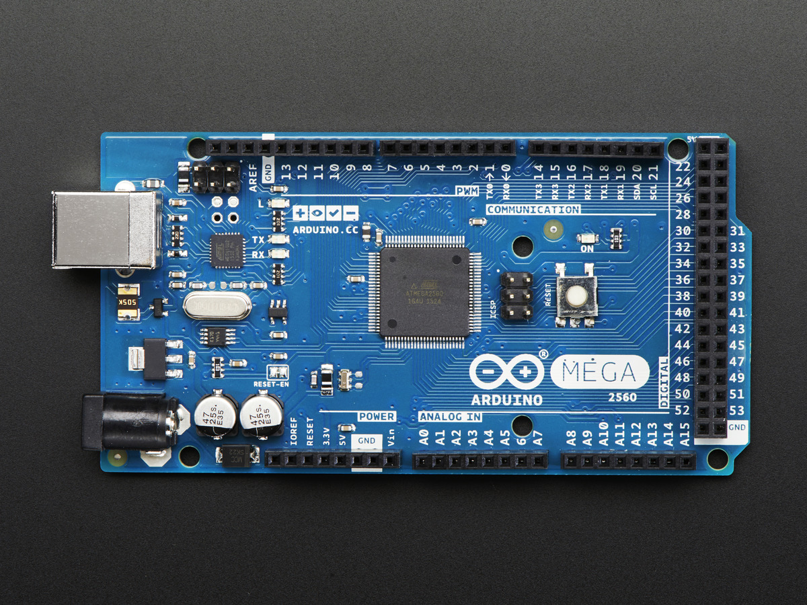

Au fur et à mesure, vous découvrirez qu'il y a peut-être d'autres compatibles Arduino que vous pourriez vouloir !

<table>
  <tr>
    <td></td>
    <td>L'Arduino UNO est un classique, elle est de loin la plus populaire. Elle est basique et bien supportée.</td>
  </tr>
  <tr>
    <td></td>
    <td>L'Arduino Micro, par contre... est un peu plus petit! Il a une puce Atmega32u4 différente qui peut faire de l'USB natif et peut donc agir comme un clavier ou une souris. Il est fin et possède des connecteurs à broche descendante pour pouvoir le brancher sur une planche à pain.</td>
  </tr>
  <tr>
    <td></td>
    <td>L'Arduino MKR1000 ressemble un peu à un Arduino Micro mais possède une puce ATSAM ARM 32 bits plus puissante et un WiFi intégré! Une excellente mise à niveau pour les projets liés à l'Internet des objets.</td>
  </tr>
  <tr>
    <td></td>
    <td>Il y a aussi les Arduino-compatibles comme le Flora qui est fabriqué par Adafruit. C'est un Arduino rond et portable et plutôt que d'utiliser des fils, vous pouvez le coudre dans les vêtements pour des projets électroniques portables.</td>
  </tr>
</table>

## Raspberry Pi
Certains d'entre vous ont peut-être déjà entendu parler du Raspberry Pi ou même en possèdent un. Toutefois, il s'agit d'un tout autre type de carte que l'Arduino.

Le Raspberry Pi (rpi) est une carte de développement qui est très populaire pour les projets de programmation. Il est plus puissant que l'Arduino et peut être utilisé pour faire beaucoup de choses tel qu'un serveur web, de musique, de vidéos, etc. Il est également beaucoup plus cher que l'Arduino.

En plus des différentes versions, il y a plusieurs éditions de rpi.

- Raspberry Pi : Ordinateur sur carte (SBC : Single Board Computer) avec différents modèles de RAM et de stockage.
- Raspberry Pi Zero : Comme le Raspberry Pi, mais plus petit, moins cher et moins puissant.
- Raspberry Pi Zero W : Comme le Zero, mais avec un module WiFi et Bluetooth intégré.
- Raspberry Pi 400 : Comme le Raspberry Pi, mais avec un clavier intégré.
- Raspberry Pi Pico : Il s'agit d'une carte de développement avec un microcontrôleur similaire au Arduino Nano, mais plus puissant.
- Raspberry Pi Pico W : Comme le Pico, mais avec un module WiFi et Bluetooth intégré.

Nous sommes rendu à la 5e version du rpi.

---

# La différence entre les microcontrôleurs vs les microprocesseurs
Nous associons souvent les termes microprocesseur et microcontrôleur, et les utilisons même parfois de manière interchangeable. Cependant, ceux qui comprennent vraiment ces deux puces savent qu'il existe des distinctions claires, malgré certaines caractéristiques communes.

## Générale
Les microprocesseurs et les microcontrôleurs sont les composants internes des appareils électroniques. Un microprocesseur est une minuscule unité de traitement à l'intérieur d'un processeur. Il s'agit d'un circuit intégré unique sur une puce informatique qui exécute diverses fonctions arithmétiques et logiques sur des signaux numériques. Plusieurs dizaines de microprocesseurs fonctionnent ensemble au sein de serveurs très performants pour le traitement des données et l'analytique.

En revanche, un microcontrôleur est l'unité informatique de base des appareils électroniques intelligents tels que les machines à laver et les thermostats. Il s'agit d'un tout petit ordinateur doté de sa propre RAM, de sa propre ROM et de ses propres systèmes d'E/S, le tout intégré sur une seule puce. Il peut traiter des signaux numériques et répondre aux entrées de l'utilisateur, mais sa capacité de calcul est limitée.

**Résumé**
- Les microprocesseurs sont des puces informatiques qui exécutent diverses fonctions arithmétiques et logiques sur des signaux numériques et conçues pour être multi-tâches.
- Les microcontrôleurs sont des puces informatiques qui sont conçues pour être intégrées dans des appareils ou des systèmes de contrôle.


## Puissance de calcul
Les microprocesseurs sont les grands gagnants en termes de puissance de calcul brute. De nos jours, les vitesses d'horloge peuvent aller de 1 à près de 4 GHz. Cela permet aux microprocesseurs de calculer très rapidement et d'exécuter des opérations efficacement. **Associés aux périphériques et aux dispositifs externes appropriés, les microprocesseurs conviennent à toutes les applications; rien n'est prédéfini.**

**Les microcontrôleurs**, en revanche, sont limités en termes de performances et de vitesse, principalement en raison de leur taille. En effet, ils **sont destinés à exécuter les mêmes tâches de base.** Ils sont donc plus rentables pour leur application et sont généralement cadencés à des vitesses beaucoup plus faibles que les microprocesseurs.

**Résumé**
- Les microprocesseurs sont plus puissants que les microcontrôleurs.
- Les microcontrôleurs sont spécialisés pour une tâche spécifique.

## Mémoire
**La mémoire d'un microprocesseur est connectée à l'extérieur**. Cela permet de concevoir des systèmes personnalisés et de les mettre à niveau facilement. Comme la mémoire est externe, c'est à l'utilisateur de choisir la taille et la vitesse de la RAM et de la ROM pour le système (La ROM est intégrée sur la carte-mère).

**Cela diffère des microcontrôleurs, où la mémoire est intégrée avec l'unité centrale dans la puce elle-même.** Cela limite la taille de la mémoire; la mémoire flash d'un microcontrôleur est souvent limitée à 2 Mo seulement. Cependant, comme la mémoire et l'unité centrale sont étroitement intégrées, les vitesses de fonctionnement de la mémoire peuvent être légèrement plus rapides dans un microcontrôleur.

**Résumé**
- Les microprocesseurs doivent être connectés à la mémoire externe.
- Les microcontrôleurs ont la mémoire intégrée.

## Système d'exploitation
Comme ils ne sont pas destinés à une tâche spécifique, **les microprocesseurs sont souvent associés à des systèmes d'exploitation** complexes pour une fonctionnalité générique. Les systèmes d'exploitation comme Windows, Linux, MacOS et Android sont comparativement gourmands en ressources et ne peuvent donc fonctionner que sur un microprocesseur. Si cela signifie que l'utilisation d'un microprocesseur vous permet d'accomplir diverses tâches, cela signifie également que vous avez besoin d'un logiciel complexe pour vos opérations.

**Les microcontrôleurs, en revanche, n'ont généralement pas besoin d'un système d'exploitation complet pour fonctionner, leurs applications s'exécutant directement sur un micrologiciel.** Cela signifie généralement qu'un microcontrôleur est facile à programmer, notamment pour les petites applications répétitives. Il est également possible d'utiliser des systèmes d'exploitation en temps réel (RTOS) avec certains microcontrôleurs de niveau supérieur pour les applications qui nécessitent un système de contrôle plus complexe. Cependant sur le Arduino, l'utilisation d'un système d'exploitation est très limité.

**Résumé**
- Les microprocesseurs ont besoin d'un système d'exploitation générique.
- Les microcontrôleurs n'ont pas besoin d'un système d'exploitation, mais d'un micrologiciel ou d'un système d'exploitation en temps réel.

## Consommation d'énergie
**Les microprocesseurs consomment plus d'énergie** par rapport à l'efficacité de la puce unique d'un microcontrôleur. Cela ne devrait pas surprendre, car les microprocesseurs fonctionnent à des vitesses beaucoup plus élevées et sont interfacés avec des composants externes. Vous trouverez rarement des microprocesseurs dans des applications où une faible consommation d'énergie est requise.

**Les microcontrôleurs consomment très peu d'énergie** car ils sont conçus pour une tâche spécifique et peuvent donc être configurés avec les seuls composants nécessaires. Cela permet d'économiser beaucoup d'énergie, c'est pourquoi vous trouverez souvent des microcontrôleurs au cœur des appareils alimentés par batterie.

**Résumé**
- Les microprocesseurs consomment plus d'énergie que les microcontrôleurs.
- Les microcontrôleurs consomment très peu d'énergie.

## Coût
Les microprocesseurs sont le summum de la puissance de traitement, et sont donc plus chers que les microcontrôleurs. En outre, les microprocesseurs ne peuvent pas fonctionner seuls. Ils ont besoin de dispositifs externes pour fonctionner avec eux, ce qui augmente le coût.

Comme les microcontrôleurs comprennent généralement du matériel à plus faible vitesse et des fonctionnalités limitées (bien que ciblées), leur coût est très faible. Tous les éléments nécessaires à l'exécution d'une tâche sont intégrés dans un microcontrôleur. L'une des principales raisons pour lesquelles les microcontrôleurs sont devenus si populaires est l'incroyable puissance de calcul qu'ils fournissent pour une fraction du coût. Ils sont donc parfaits pour les projets éducatifs et les projets personnels de bricolage.

En grande quantité, les microcontrôleurs peuvent ne coûter que quelques sous (Ex : ATTiny9 ~0.50\$). Alors que les microprocesseurs peuvent coûter des centaines de dollars (Ex : Intel i9-13900k ~800\$ (Hiver 2023)).

**Résumé**
- Les microprocesseurs sont plus chers que les microcontrôleurs.
- Les microcontrôleurs sont très peu coûteux voire quelques sous.

## Utilisations
- **Les microcontrôleurs sont utilisés pour des tâches spécifiques**. Par exemple, un thermostat intelligent ou encore les freins ABS d'un véhicule ou les appareils domotiques.
- **Les microprocesseurs sont utilisés pour plusieurs tâches en simultanées**. Ils ont tous un système d'exploitation pour gérer l'exécution des différentes tâches.

## Résumé
Un microcontrôleur est un type de microprocesseur qui est conçu pour être intégré dans des appareils ou des systèmes de contrôle. Il est généralement plus petit et moins puissant qu'un microprocesseur de l'ordinateur personnel, mais il est conçu pour être suffisamment rapide et puissant pour gérer des tâches de contrôle en temps réel. Un microcontrôleur est généralement accompagné de mémoire et de périphériques intégrés, ce qui le rend idéal pour les applications où l'espace est limité et où il est nécessaire de réaliser des tâches de contrôle en temps réel.

Un microprocesseur, d'autre part, est un composant central de l'ordinateur qui exécute des instructions contenues dans des programmes. Il est généralement plus puissant et plus rapide qu'un microcontrôleur, mais il n'est pas conçu pour être intégré dans des appareils de contrôle en temps réel de la même manière qu'un microcontrôleur. Les microprocesseurs sont généralement utilisés dans les ordinateurs personnels, les serveurs et d'autres types d'équipements informatiques.

---

# Le matériel du cours

## Achat
Pour ce cours, vous aurez besoin d'un kit d'Arduino Mega sur plaque de montage et d'un ordinateur. Voici les liens pour acheter les items requis sur Amazon:
- [Arduino Mega](https://a.co/d/5wpBN96).
- [Plaque de support pour Arduino](https://a.co/d/dbJ7mdc).
  - [Modèle alternatif A](https://a.co/d/jaizZYl)
  - [Modèle alternatif B](https://a.co/d/dwlkbsL) : Ce modèle vient avec du matériel pour le Raspberry Pi.

---

# Exercices
1. Branchez la carte Arduino à votre ordinateur.
2. Ouvrez le logiciel Arduino IDE.
3. Trouvez l'exemple "Blink". Où est-il situé?
4. Téléversez l'exemple "Blink" sur la carte Arduino.
   - Avez-vous réussi du premier coup? Sinon, trouvez la solution au problème.
5. Essayez de comprendre le code de l'exemple "Blink".
6. Selon vous, que fait le code de l'exemple "Blink"?

---

# Exemple de questions pour une évaluation
1. Nommez deux raisons pour lesquelles, il serait mieux d'utiliser un rpi au lieu d'un Arduino.
2. Nommez deux raisons pour lesquelles, il serait mieux d'utiliser un Arduino au lieu d'un rpi.
3. Combien de broches numériques y a-t-il sur une carte Arduino Mega?
4. Combien de broches analogiques y a-t-il sur une carte Arduino Mega?
5. Nommez 2 logiciels qui peuvent être utilisés pour programmer une carte Arduino?

<details><summary>Réponses</summary>

1. Le rpi est plus puissant et peut donc faire plus de choses. Il est aussi plus facile de le connecter à un écran et à un clavier. Il vient avec un système d'exploitation. Il vient avec les connexions réseaux.
2. L'Arduino est moins cher. L'Arduino est plus économique en énergie. L'Arduino est plus petit et plus facile à transporter. L'Arduino est plus facile à programmer.
3. 54
4. 16
5. Arduino IDE, Visual Studio Code avec l'extension PlatformIO. 

</details>

---

# Références
- [Ladyada's Learn Arduino - Lesson #2](https://learn.adafruit.com/ladyadas-learn-arduino-lesson-number-2)
- [All3DP : Microprocessor vs Microcontroller](https://all3dp.com/2/difference-between-microprocessor-and-microcontroller/)

<!-- ****************************** -->
<!-- Nom du fichier : .\c01\C01_intro_prog.md -->

# Introduction <!-- omit in toc -->

- [Le langage de programmation](#le-langage-de-programmation)
  - [Exemples](#exemples)
- [Comment programmer un Arduino](#comment-programmer-un-arduino)
- [La fonction `setup`](#la-fonction-setup)
- [La fonction `loop`](#la-fonction-loop)
- [Cycle de vie d'un programme Arduino](#cycle-de-vie-dun-programme-arduino)
- [Les principaux types de données](#les-principaux-types-de-données)
  - [Précision du type `float`](#précision-du-type-float)
- [Les variables](#les-variables)
  - [La portée des variables](#la-portée-des-variables)
  - [Les variables globales](#les-variables-globales)
  - [Les variables statiques](#les-variables-statiques)
- [Wokwi - Simulateur Arduino](#wokwi---simulateur-arduino)
  - [Créer un projet](#créer-un-projet)
  - [Exercice - Premier projet](#exercice---premier-projet)
- [Exercices](#exercices)
  - [Recherches](#recherches)
  - [Questions](#questions)
  - [Programmation](#programmation)
    - [Défi](#défi)

---

# Le langage de programmation
Arduino utilise un langage de programmation spécifique appelé "Arduino Language" ou "Arduino C++".

Le langage Arduino est basé sur le langage C++, avec des modifications et des extensions spécifiques pour permettre une utilisation facile des fonctionnalités du microcontrôleur Arduino. Il est donc recommandé de connaître les bases du langage C++ avant de se lancer dans la programmation Arduino.

> **Note**
> 
> Si vous avez déjà programmé en C# ou Java, vous verrez que le langage Arduino est très proche de ces langages. C'est d'ailleurs pour cette raison que le langage Arduino est souvent utilisé pour initier les débutants à la programmation embarquée.

## Exemples

Voici quelques exemples de structures de base du langage Arduino :

- Déclaration de variables :

```cpp
int compteur = 0;           // Variable entière
float temperature = 25.5;   // Variable flottante
char caractere = 'A';       // Variable de caractère
bool etat = true;           // Variable booléenne (vrai/faux)
```

- Structures de contrôle de flux :

```cpp
if (conditionA) {
  // Code à exécuter si la conditionA est vraie
} else if (conditionB) {
  // Code à exécuter si la conditionB est vraie
}
else {
  // Code à exécuter si la condition est fausse
}

while (condition) {
  // Code à exécuter tant que la condition est vraie
}

for (int i = 0; i < 10; i++) {
  // Code à exécuter 10 fois (i va de 0 à 9)
}

```

- Fonctions :

```cpp
void maFonction() {
  // Code de la fonction
}

int maFonctionAvecRetour() {
  // Code de la fonction
  return 5; // Valeur de retour de la fonction
}

void maFonctionAvecParametres(int param1, float param2) {
  // Code de la fonction utilisant les paramètres param1 et param2
}

```

Il existe également de nombreuses fonctions prédéfinies dans le langage Arduino qui permettent d'interagir avec le microcontrôleur et ses périphériques (lecture et écriture sur les pins, gestion de l'horloge, gestion de la communication série, etc.).

# Comment programmer un Arduino

Voici la structure de base d'un programme Arduino :

```cpp
void setup() {
  // Code à exécuter une seule fois au démarrage
}

void loop() {
  // Code à exécuter en boucle
}
```

Le programme Arduino comporte deux fonctions de base obligatoire : `setup` et `loop`.

La fonction `setup` est exécutée une seule fois au démarrage du programme. On y met généralement le code de configuration, comme la définition des pin de sortie ou l'initialisation de certains paramètres.

La fonction `loop` est exécutée en boucle, c'est-à-dire qu'elle est répétée indéfiniment. C'est là que se trouve le code principal du programme.

Voici un exemple de programme Arduino simple qui fait clignoter une LED toutes les secondes :

```cpp
const int LED_PIN = 13; // Pin de la LED

void setup() {
  // Définition de la pin de la LED en sortie
  pinMode(LED_PIN, OUTPUT);
}

void loop() {
  // Allumage de la LED
  digitalWrite(LED_PIN, HIGH);
  // Attente de 500 millisecondes
  delay(500);
  // Extinction de la LED
  digitalWrite(LED_PIN, LOW);
  // Attente de 500 millisecondes
  delay(500);
}
```

# La fonction `setup`
La fonction `setup` est exécutée une seule fois au démarrage du programme Arduino, avant la boucle infinie de la fonction `loop`.

Elle est généralement utilisée pour mettre en place l'environnement de travail du programme, c'est-à-dire pour configurer les paramètres et les dispositifs nécessaires au bon fonctionnement du programme.

Voici quelques exemples d'utilisations possibles de la fonction `setup` :
- Définition des modes d'entrée/sortie des pins du microcontrôleur Arduino : en utilisant la fonction `pinMode`, on peut indiquer si une pin doit être utilisée en entrée (par exemple pour lire une valeur provenant d'un capteur) ou en sortie (par exemple pour envoyer une tension à une LED).
- Initialisation de paramètres et de variables : la fonction `setup` est souvent utilisée pour initialiser des variables qui seront utilisées tout au long du programme, comme des compteurs ou des variables de configuration.
- Configuration de périphériques externes : si le programme utilise des périphériques tels que des écrans LCD, des modules WiFi ou des capteurs, la fonction `setup` peut être utilisée pour configurer ces périphériques et les mettre en place pour l'utilisation ultérieure.

Voici un exemple de programme Arduino qui utilise la fonction setup pour définir le mode de la pin 13 en sortie et initialiser une variable de comptage à 0 :

```cpp
int compteur = 0; // Variable de comptage

void setup() {
  // Définition de la pin 13 en sortie
  pinMode(13, OUTPUT);
  // Initialisation de la variable de comptage à 0
  compteur = 0;
}

void loop() {
  // Incrémentation du compteur
  compteur++;
  // Allumage de la LED sur la pin 13
  digitalWrite(13, HIGH);
  // Attente de 500 millisecondes
  delay(500);
  // Extinction de la LED sur la pin 13
  digitalWrite(13, LOW);
  // Attente de 500 millisecondes
  delay(500);
}

```

> **Question** : De quelle façon, nous pourrions améliorer ce programme pour qu'il soit plus facile à maintenir?
> <details><summary>Indice</summary>
> Si l'on doit modifier la broche de la LED ou de la durée de l'attente que devrons-nous faire? 
> </details>

---

# La fonction `loop`
La fonction `loop` est exécutée en boucle, c'est-à-dire qu'elle est répétée indéfiniment. C'est là que se trouve le code principal du programme.

Cette boucle est très pratique dans les programmes Arduino car elle permet de mettre en place des actions qui sont répétées de manière périodique, comme la lecture de données sensorielles, l'affichage de données sur un écran ou encore la commande de dispositifs tels que des moteurs ou des LED.

> **Perle de culture**
>  
> Les microcontrôleurs doivent tous avoir une fonction similaire à `loop` pour fonctionner. Si vous ne mettez pas de fonction `loop` dans votre programme, le microcontrôleur ne fera rien.
> 
> Ainsi, on pourrait retrouver quelques choses comme ça dans le code d'un microcontrôleur :
> ```cpp
> void main() {
>   // ...
>   // Code de configuration
>   // ...
>   // ...
>   // Boucle principale
>   while (true) {
>     // ...
>     // Code principal répété    
>     // ...
>   }    
> }
> ```

# Cycle de vie d'un programme Arduino

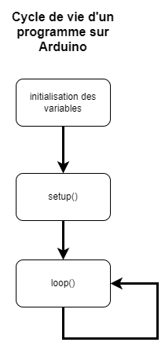

---

# Les principaux types de données
Voici les principaux types de données utilisables dans le langage Arduino :

| Type            | Description                              | Limite Inférieure              | Limite Supérieure   |
|-----------------|------------------------------------------|--------------------------------|---------------------|
| `int`           | type entier                              | -32768                         | 32767               |
| `unsigned int`  | type entier non signé                    | 0                              | 65535               |
| `long`          | type entier long                         | -2147483648                    | 2147483647          |
| `unsigned long` | type entier long non signé               | 0                              | 4294967295          |
| `float`         | type flottant                            | (7 chiffres après la virgule)  | -                   |
| `double`        | type flottant double                     | (15 chiffres après la virgule) | -                   |
| `char`          | type de caractère                        | (un seul caractère)            | -                   |
| `bool`          | type booléen                             | true (vrai)                    | false (faux)        |


Il existe également d'autres types de données moins courants tels que `byte`, `word` et `string`, qui peuvent être utilisés selon les besoins de votre programme.

Voici un exemple de déclaration de variables de différents types :

```cpp
int entier = 10;
unsigned int entierNonSigne = 65535;
long entierLong = -2147483648;
unsigned long entierLongNonSigne = 4294967295;
float flottant = 3.14;
double flottantDouble = 3.141592653589793;
char caractere = 'A';
bool etat = true;
```

Voici un tableau résumant les principaux types de données du langage Arduino avec leur dimension en octet et quelques exemples d'utilisation :

| Type       | Dimension en octet | Exemples d'utilisation                                                                  |
|------------|-------------------|----------------------------------------------------------------------------------------|
| `int`      | 2                 | Stockage de nombres entiers (par exemple : compteur, nombre de tours de moteur).       |
| `unsigned int` | 2                 | Stockage de nombres entiers non signés (par exemple : compteur de cycles de travail). |
| `long`     | 4                 | Stockage de nombres entiers longs (par exemple : compteur de secondes écoulées).       |
| `unsigned long` | 4                 | Stockage de nombres entiers longs non signés (par exemple : compteur de millisecondes écoulées). |
| `float`    | 4                 | Stockage de nombres à virgule flottante (par exemple : mesure de température).        |
| `double`   | 8                 | Stockage de nombres à virgule flottante avec une précision accrue (par exemple : mesure de position GPS). |
| `char`     | 1                 | Stockage de caractères (lettres, chiffres, symboles, etc.).                         |
| `bool`     | 1                 | Stockage de valeurs booléennes (vrai/faux).                                            |

Étant programmé pour un appareil très limité en ressource, il est important de choisir le type de données le plus adapté pour stocker vos données, afin de maximiser l'efficacité et la précision de votre programme. Par exemple, il n'est pas recommandé d'utiliser un type `float` pour stocker des nombres entiers, car cela peut entraîner une perte de précision. De même, il est préférable d'utiliser un type `long` ou `unsigned long` pour stocker des nombres très grands, plutôt que de dépasser la limite supérieure du type `int`.

## Précision du type `float`
Le type `float` est un type de données à virgule flottante qui permet de stocker des nombres à virgule avec une précision de 7 chiffres après la virgule. Cependant, il peut y avoir une perte de précision lors de l'utilisation de ce type de données pour plusieurs raisons :
- Les nombres à virgule flottants sont stockés en mémoire sous forme binaire, et non en décimal comme les nombres entiers. Cela signifie que certains nombres décimaux ne peuvent pas être représentés de manière exacte sous forme binaire, ce qui peut entraîner une perte de précision.
- Le type `float` a une précision limitée à 7 chiffres après la virgule. Si vous avez besoin d'une précision supérieure, il est recommandé d'utiliser le type `double`, qui permet de stocker des nombres à virgule flottante avec une précision de 15 chiffres après la virgule.
  
Voici quelques exemples d'utilisation du type float et de la perte de précision qui peut en résulter :

```cpp
float a = 0.1;
float b = 0.2;
float c = a + b; // c vaut 0.30000000000000004 (perte de précision)

float d = 123456.789;
int e = (int) d; // e vaut 123456 (perte de précision)

```

Il est donc important de prendre en compte ces limitations lors de l'utilisation du type `float` dans vos programmes Arduino. Si vous avez besoin d'une précision supérieure ou d'une plage de valeurs plus grande, il est recommandé d'utiliser le type `double`.

---

# Les variables
Une variable est un emplacement mémoire dans un ordinateur qui permet de stocker une valeur ou une donnée. En programmation, on utilise des variables pour stocker et manipuler des données dans un programme.

## La portée des variables
La portée d'une variable désigne la plage de code dans laquelle la variable est accessible et peut être utilisée.

Il existe plusieurs types de portée de variables dans le langage Arduino :

- Les **variables globales** sont déclarées en dehors de toutes les fonctions, et sont donc accessibles à toutes les fonctions de votre programme.
- Les **variables locales** sont déclarées à l'intérieur d'une fonction, et sont donc uniquement accessibles et utilisables dans cette fonction.
- Les **variables statiques** sont déclarées à l'intérieur d'une fonction, mais leur valeur est conservée entre les exécutions de la fonction. Elles sont donc accessibles et utilisables dans toutes les exécutions de la fonction, mais sont uniquement visibles à l'intérieur de cette fonction.

Voici un exemple illustrant la portée de différentes variables :

```cpp
int variableGlobale = 0;  // Variable globale

void setup() {
  Serial.begin(9600);
  int variableLocale = 0;  // Variable locale
  static int variableStatique = 0;  // Variable statique

  // Code de la fonction setup
  variableGlobale++;  // Incrémentation de la variable globale
  variableLocale++;  // Incrémentation de la variable locale
  variableStatique++;  // Incrémentation de la variable statique

  Serial.println(variableGlobale); 
  Serial.println(variableLocale);
  Serial.println(variableStatique);
}

void fonctionAvecStatique(){
  static int compteur = 0;  // Variable statique
  int compteurB = 0;  // Variable locale

  compteur++;  // Incrémentation de la variable statique
  compteurB++;  // Incrémentation de la variable locale

  Serial.print("-- func --\t");
  Serial.print("compteur : ");
  Serial.print(compteur);
  Serial.print("\tcompteurB : ");
  Serial.println(compteurB);
}

void loop() {
  int variableLocale = 0;  // Variable locale
  static int variableStatique = 0;  // Variable statique

  // Code de la fonction loop
  variableGlobale++;  // Incrémentation de la variable globale
  variableLocale++;  // Incrémentation de la variable locale
  variableStatique++;  // Incrémentation de la variable statique

  Serial.print("-- loop --\t");
  Serial.print("variableGlobale : ");
  Serial.print(variableGlobale);
  Serial.print("\tvariableLocale : ");
  Serial.print(variableLocale);
  Serial.print("\tvariableStatique : ");
  Serial.println(variableStatique);

  fonctionAvecStatique();

  delay(1000);
}
```

**Questions**
- Quelles seront les valeurs affichées dans le moniteur série pour la fonction `setup()`?
- Quelles seront les valeurs affichées dans le moniteur série dans le premier tour de la fonction `loop()`?

## Les variables globales
Les variables globales sont des variables qui sont déclarées en dehors de toutes les fonctions dans votre programme Arduino, et qui sont donc accessibles à toutes les fonctions de votre programme.

Voici un exemple de déclaration et d'utilisation de variables globales :

```cpp
int compteur = 0;  // Variable globale

void setup() {
  // Code de la fonction setup
  compteur++;  // Incrémentation de la variable globale
}

void loop() {
  // Code de la fonction loop
  compteur++;  // Incrémentation de la variable globale
  Serial.println(compteur);  // Affichage de la valeur de la variable globale
}

```

Les variables globales sont utiles lorsque vous avez besoin de partager des données entre plusieurs fonctions de votre programme, ou lorsque vous avez besoin de conserver la valeur d'une variable entre plusieurs exécutions de la fonction `loop()`.

Il est important de faire attention à l'utilisation des variables globales, car elles peuvent être modifiées par n'importe quelle fonction de votre programme, ce qui peut entraîner des erreurs de logique ou de synchronisation.

## Les variables statiques
Les variables statiques sont des variables qui sont déclarées à l'intérieur d'une fonction, mais dont **la valeur est conservée entre les exécutions de la fonction**. Elles sont donc accessibles et utilisables dans toutes les exécutions de la fonction, mais sont uniquement visibles à l'intérieur de cette fonction.

Voici un exemple de code qui utilise une variable statique pour compter le nombre de fois qu'un bouton a été appuyé
    
```cpp
const int boutonPin = 2;  // Pin du bouton

void setup() {
  pinMode(boutonPin, INPUT_PULLUP);  // Configuration du pin en entrée avec pull-up
  Serial.begin(9600);  // Configuration de la liaison série
}

void loop() {
  if (digitalRead(boutonPin) == LOW) {  // Si le bouton est appuyé
    boutonClic();  // Appel de la fonction boutonClic()
  }
}

void boutonClic() {
  static int compteur = 0;  // Déclaration de la variable statique
  compteur++;  // Incrémentation de la variable statique
  Serial.println(compteur);  // Affichage du nombre de clics sur la liaison série
}

```

Dans cet exemple, la variable statique `compteur` est déclarée à l'intérieur de la fonction `boutonClic()`, mais sa valeur est conservée entre les exécutions de cette fonction. Ainsi, à chaque exécution de la fonction `boutonClic()`, la valeur de `compteur` est incrémentée de 1 et affichée sur la liaison série.

Les variables statiques sont utiles lorsque vous avez besoin de conserver la valeur d'une variable entre les exécutions d'une fonction, tout en limitant la visibilité de cette variable à l'intérieur de la fonction.

---

# Wokwi - Simulateur Arduino
Il existe plusieurs sites qui permettent de simuler une partie des fonctionnalités de l'Arduino. Toutefois, je préconise Wokwi. Il est gratuit, il est en ligne, il est simple d'utilisation et il est très complet.

Plusieurs de mes captures d'écran proviendront de [Wokwi](https://wokwi.com/).

Simuler un projet sur un simulateur avant d'effectuer les branchements physiques permet de s'assurer que notre code fonctionne.

> **Note**
> 
> À ma dernière vérification, Wokwi ne supportait pas très bien FireFox. Je vous conseille d'utiliser Chrome ou Edge.

## Créer un projet
Pour créer un projet, il suffit d'aller dans le bas de la page dans la section "Start from scratch" et de cliquer sur la carte Arduino que l'on souhaite utiliser. Dans notre cas, il s'agira du Arduino Mega.

<!-- <video src="wokwi_new_project.mp4" width=640></video> -->

https://user-images.githubusercontent.com/2332679/210601281-1ecd0f4e-a510-4571-8242-067902a302e1.mp4

---

## Exercice - Premier projet
1. Si ce n'est déjà fait, créez un compte GitHub.
2. Connectez-vous à [Wokwi](https://wokwi.com/) avec votre compte GitHub.
3. À partir du logiciel Arduino IDE, ouvrir le projet exemple "Blink".
4. Créez un nouveau projet nommé `c01_ex01` et choisissez le type `Arduino Mega`.
5. Collez le projet "Blink" dans le nouveau projet Wokwi.
6. Exécutez le projet.
7. Modifiez les valeurs de *timing* pour d'autres valeurs et exécutez le projet.

---

# Exercices
## Recherches
Dans le but de vous habituer à faire des recherches sur Google, j'ai expressément mis des questions où l'information n'est pas directement dans ce document.

1. Dans certains exemples de code, on retrouve des noms de variable tout en majuscule. Pour quelle raison?
2. Généralement, quelles sont les valeurs des variables `HIGH`, `LOW` et `LED_BUILTIN`?
3. Que fait la fonction `delay()`?
4. Que fait la fonction `pinMode()`?
5. Combien de mémoire RAM possède le Arduino Mega?

## Questions
1. Quelle est la différence entre une variable locale et une variable globale?
2. Quel type de variable est-il préférable d'utiliser pour stocker le temps en milliseconde?
3. Si je veux partager une variable entre les fonctions, quelle sera la portée de la variable que devrais-je prendre?
4. Si je veux conserver la valeur d'une variable à l'intérieur d'une même fonction, quelle sera la portée de la variable que devrais-je prendre?
5. À l'intérieur d'une fonction, si la valeur d'une variable doit être réinitialiser à chaque fois et elle n'est pas utile à l'extérieur de la dite fonction, quelle sera la portée de la variable?
6. Quelle est la différence entre une variable statique et une variable globale?
7. Quelle est la différence entre une variable locale et une variable statique?
8. Nommez une utilité pour une variable locale.
9.  Nommez une utilité pour une variable statique.
10. Nommez une utilité pour une variable globale.

<details><summary>Réponses</summary>

1. Une variable locale est déclarée à l'intérieur d'une fonction et n'est pas accessible à l'extérieur de la fonction. Une variable globale est déclarée à l'extérieur de toute fonction et est accessible à l'extérieur de toutes les fonctions.
2. `unsigned long`
3. Variable globale
4. Variable statique
5. Variable locale
6. Une variable statique conserve sa valeur entre les exécutions d'une fonction et n'est pas accessible aux autres fonctions. Une variable globale est accessible à l'extérieur de toutes les fonctions.
7. Une variable locale est déclarée à l'intérieur d'une fonction, n'est pas accessible à l'extérieur de la fonction et elle est réinitialisée à chaque exécution de la fonction. Une variable statique est déclarée à l'intérieur d'une fonction et conserve sa valeur entre les exécutions de la fonction.
8. Exemple : Avoir une variable qui sert à incrémenter un compteur.
9. Exemple : Conserver la valeur du temps entre les exécutions d'une fonction. Conserver l'état d'une LED entre les exécutions d'une fonction.
10. Exemple : Conserver l'heure globale du système. Conserver l'état d'un composant pour l'ensemble du système.
</details>

## Programmation
1. Modifiez le programme "Blink" pour faire clignoter la LED 5 fois par seconde.
2. Modifiez le programme "Fade" pour faire réagir la LED qui est intégrée sur le Arduino.
3. Modifiez le programme "Fade" pour faire gradueryou la LED plus rapidement.

### Défi
- Créez un programme qui fait clignoter la LED 2 fois dans une seconde. Ensuite, faire un graduation 100% vers 0% sur 1 seconde. Et recommencer.

https://user-images.githubusercontent.com/2332679/210662345-958f0043-521b-4025-aea2-3f0cf3fe7d0e.mp4


<!-- ****************************** -->
<!-- Nom du fichier : .\c01\C01_intro_prog_rep.md -->

# Réponses aux exercices
## Recherches
1. Les variables écrit tout en majuscules s'agissent généralement de constante. Les constantes sont des valeurs qui ne changent pas pendant l'exécution du programme. Utiliser des noms de variables en majuscule pour les constantes permet de les identifier facilement dans le code et de les différencier des autres variables. Cela peut également aider à éviter les erreurs en empêchant la modification accidentelle de la valeur d'une constante.
2. `HIGH` = 1, `LOW` = 0, `LED_BUILTIN` = 13
3. `delay()` est une fonction qui permet de mettre en pause le programme pendant un certain temps. Elle prend en paramètre un nombre entier qui représente le temps en millisecondes pendant lequel le programme est mis en pause.
4. `pinMode()` est une fonction qui permet de définir le mode d'un port. Elle prend en paramètre le numéro du port et le mode du port. Les modes possibles sont `INPUT`, `OUTPUT` et `INPUT_PULLUP`.
5. Le Arduino Mega possède 8 KO de mémoire SRAM alors que l'Arduino Uno n'en possède que 2 KO. Il possède également 256 KO de mémoire flash contre 32 KO pour l'Arduino Uno.

## Questions
1. Une variable locale n'est disponible que dans la fonction dans laquelle est déclarée. Une variable globale est disponible dans toutes les fonctions du programme.
2. Pour stocker du temps en millisecondes, il est préférable d'utiliser un type `unsigned long`.


<!-- ****************************** -->
<!-- Nom du fichier : .\c01\readme.md -->

# Cours 01


1. [Configuration de l'environnement de travail](C01_intro_config.md)
2. [Introduction à la programmation](C01_intro_prog.md)


<!-- ****************************** -->
<!-- Nom du fichier : .\c02\C02_fonctions_comm.md -->

# Les fonctions de base et la communication <!-- omit in toc -->

---
# Table des matières <!-- omit in toc -->

- [Introduction](#introduction)
- [Exemple - Blink](#exemple---blink)
- [DEL par défaut](#del-par-défaut)
- [Fonctions de base](#fonctions-de-base)
  - [pinMode - Gestion des broches](#pinmode---gestion-des-broches)
  - [digitalWrite](#digitalwrite)
  - [delay](#delay)
  - [millis](#millis)
- [Exemple `Fade`](#exemple-fade)
  - [fonction `analogWrite`](#fonction-analogwrite)
- [Fonctions de communication série](#fonctions-de-communication-série)
  - [Serial.begin()](#serialbegin)
  - [Serial.print() et Serial.println()](#serialprint-et-serialprintln)
    - [Exercice](#exercice)
  - [Moniteur série](#moniteur-série)
  - [Port série... mais c'est quoi??](#port-série-mais-cest-quoi)
    - [Questions](#questions)
  - [Port série : La science](#port-série--la-science)
  - [Résumé](#résumé)
- [Algorithme simple pour gérer les états](#algorithme-simple-pour-gérer-les-états)
  - [État d'un périphérique](#état-dun-périphérique)
  - [État de l'application](#état-de-lapplication)
- [Exercices](#exercices)
- [Questions](#questions-1)

---

# Introduction
Dans ce cours, nous allons apprendre à utiliser quelques fonctions fondamentales de l'Arduino ainsi que l'échange d'information entre l'Arduino et le PC.

---

# Exemple - Blink

Voici le code de base pour faire clignoter une LED branchée sur la broche 13 de l'Arduino.

Nous allons nous y référer pour étudier les fonctions de base.

<table>
<tr>
<td>

**Code**
</td>
<td>

**Résultat**
</td>
</tr>
<tr>
<td>

```cpp
int led = 13;

void setup() {
  pinMode(led, OUTPUT);
}

void loop() {
  digitalWrite(led, HIGH);
  delay(1000);
  digitalWrite(led, LOW);
  delay(1000);
}
```
</td>
<td>


</td>

</tr>


</table>

---

# DEL par défaut
Une DEL, ou *LED* en anglais, est une petite lampe qui émet de la lumière quand elle est alimentée. DEL est l'acronyme pour **D**iode **É**lectro**L**uminescente (***L**ight-**E**mitting **d**iode*).

Sur les Arduinos, il y a une DEL qui est branchée sur la **broche 13**. C'est la raison pour laquelle on voit souvent des exemples avec cette DEL, car elle est facile à utiliser.

---

# Fonctions de base

## pinMode - Gestion des broches

La fonction `pinMode` permet de définir le mode d'une broche. Il y a deux modes principaux : `INPUT` et `OUTPUT`.

> **Note**
> 
> Il y a aussi un 3e mode (`INPUT_PULLUP`) que nous verrons plus tard.

**La fonction prend 2 paramètres : le numéro de la broche et le mode de la broche.**

Généralement, on utilise la fonction `pinMode` dans la fonction `setup` pour définir le mode des broches.

| Mode | Description | Exemple | Exemple d'utilisation |
| --- | --- | --- | --- |
| INPUT | La broche est en mode entrée. | `pinMode(2, INPUT);` | Lecture d'un bouton |
| OUTPUT | La broche est en mode sortie. | `pinMode(3, OUTPUT);` | Contrôle d'une DEL ou d'un moteur |

Dans l'exemple précédent, nous avons utilisé la fonction `pinMode` pour définir la broche 13 en mode `OUTPUT` pour pouvoir y écrire une valeur.

---

## digitalWrite
La fonction digitalWrite en Arduino permet de mettre le niveau logique `HIGH` ou `LOW` sur une **broche numérique**.

`HIGH` vaut 1 et `LOW` vaut 0.

Lorsqu'on utilise cette fonction, il faut lui fournir deux arguments : le numéro de la broche sur laquelle on veut envoyer le signal et le niveau logique souhaitée (`HIGH` ou `LOW`). Par exemple, si vous voulez envoyer un signal de niveau logique `HIGH` sur la broche numérique 12, vous pouvez utiliser l'instruction suivante :

```cpp
digitalWrite(12, HIGH);
```

La fonction `digitalWrite` est souvent utilisée pour contrôler des dispositifs qui nécessitent un signal binaire, comme des LED, des relais, etc. Elle peut également être utilisée pour communiquer avec d'autres circuits ou des périphériques externes via des protocoles de communication tels que I2C ou SPI.

---

## delay
La fonction `delay` permet de faire une pause dans le programme. Elle prend en paramètre le nombre de millisecondes à attendre. Elle prend un seul argument, qui est le nombre de millisecondes de pause souhaité.

Voici un exemple d'utilisation de la fonction `delay` :
    
```cpp
digitalWrite(LED_BUILTIN, HIGH);  // Allume la LED intégrée
delay(1000);                       // Pause pendant 1000 millisecondes (1 seconde)
digitalWrite(LED_BUILTIN, LOW);   // Éteint la LED intégrée
```

La fonction `delay` est souvent utilisée pour créer des temporisations ou des pauses dans un programme Arduino. Elle peut être utilisée pour mettre en pause le programme pendant une durée précise avant de continuer à l'exécution. Par exemple, on peut utiliser delay pour créer des effets de clignotement sur une LED ou pour synchroniser l'exécution de différentes parties d'un programme.

> **Important!!**
> 
> Il est important de noter que la fonction `delay` bloque l'exécution du processeur pendant la durée de la pause, **ce qui est problématique dans la plupart des cas**. Si vous avez besoin de mettre en pause le programme sans bloquer l'exécution des autres parties du code, vous pouvez utiliser des variables de gestion de temps. Voir l'exemple `BlinkWithoutDelay` pour plus de détails.

---

## millis

La fonction `millis()` dans Arduino est une fonction qui renvoie le nombre de millisecondes qui se sont écoulées depuis le démarrage du microcontrôleur Arduino. Elle peut être utilisée pour calculer des délais précis, tels que le retardement dans une boucle `loop()`. Cela permet aux programmes Arduino d'effectuer des opérations à des intervalles de temps précis, ce qui est très utile pour les projets qui impliquent des délais ou des temps d'exécution.

Elle s'utilise sans paramètre et renvoie un **entier long** (`long int`).

---

# Exemple `Fade`

Voici un autre exemple de base fournit par Arduino. Il s'agit d'un programme qui fait varier la luminosité d'une DEL en utilisant la fonction `analogWrite`.
  
```cpp
int led = 9; // LED connectée à la broche 9
int brightness = 0; // Valeur de luminosité
int fadeAmount = 5; // Valeur de variation de luminosité

void setup() {
  pinMode(led, OUTPUT); // Définit la broche 9 en mode sortie
}

void loop() {
  analogWrite(led, brightness); // Change la luminosité de la LED
  brightness = brightness + fadeAmount; // Change la valeur de luminosité

  // Inverse la variation de luminosité quand la valeur de luminosité atteint 0 ou 255
  if (brightness <= 0 || brightness >= 255) {
    fadeAmount = -fadeAmount;
  }
  // Attend 30 millisecondes avant de recommencer
  delay(30);
}

```

---

## fonction `analogWrite`
La fonction `analogWrite` permet de générer une tension analogique sur une **broche PWM**. Elle prend en paramètre le numéro de la broche sur laquelle on veut envoyer le signal et la valeur de la tension souhaitée.
Pour être plus simple, pensez à une valeur en pourcentage sur 255. Voici quelques exemples :

```cpp
analogWrite(13, 127); // 50% de 255 = 127
analogWrite(13, 26); // 10% de 255 = 26
analogWrite(13, 255); // 100% de 255 = 255
```

Sur le Arduino Mega, les broches PWM sont les broches 2 à 13 ainsi que 44, 45 et 46.

Nous verrons en cours de session ce qu'est exactement le **PWM**.

---

# Fonctions de communication série
Les fonctions de communication permettent d'envoyer et de recevoir des données à partir d'autres périphériques ou d'autres circuits. Elles sont utilisées pour communiquer avec des périphériques externes, comme des capteurs, des écrans LCD, des modules Bluetooth, etc.

Dans ce cours, nous allons nous intéresser aux fonctions de communication suivantes :
- `Serial.begin()`
- `Serial.print()`
- `Serial.println()`

## Serial.begin()
La fonction `Serial.begin()` permet de configurer la vitesse de communication avec le port série. Elle prend en paramètre la vitesse de communication en bauds. Par exemple, pour configurer la liaison série à 9600 bauds, on utilise la fonction `Serial.begin(9600)`.

Généralement, on utilise la fonction `Serial.begin()` dans la fonction `setup()`.

Exemple :

```cpp
void setup() {
  Serial.begin(9600);
  // Autre code
}
```
<br />

> **Note**
> 
> Un baud est une unité de mesure de la vitesse de transmission de données. Il représente le nombre de bits qui peuvent être transmis par seconde. Par exemple, 9600 bauds signifie que 9600 bits peuvent être transmis par seconde.

---

## Serial.print() et Serial.println()

La fonction `Serial.print()` est une fonction dans l'Arduino qui permet d'envoyer des données série à un port série. Il peut être utilisé pour envoyer un message texte, des données numériques ou des données binaires.

Par exemple, le code suivant permet d'envoyer le message "Bonjour!" à un port série:

```
void setup() {
  Serial.begin(9600);
}

void loop() {
  Serial.print("Bonjour!");
  delay(1000);
}
```

Ce code initialisera le port série à une vitesse de 9600 bits par seconde, puis enverra le message "Bonjour!" toutes les secondes.

La fonction `Serial.println()` ajoute un retour à la ligne à la fin du message envoyé.

Voici un exemple de code qui utilise les fonctions `Serial.print()` et `Serial.println()` :

<table>
<tr>
<td>

**Code**
</td>
<td>

**Résultat**
</td>
</tr>
<tr>
<td>

```cpp

void setup() {
  // Initialisation du port
  // série à 9600 baud
  Serial.begin(9600);
}

int counter = 0;
void loop() {
  Serial.print("Boucle : ");
  Serial.println(counter);
  counter++;

  // Délai pour ne pas ralentir le µC
  delay(500);
}

```
</td>
<td>


</td>

</tr>


</table>

> **Note**
> 
> Il est important de mettre un délai entre chaque envoi de données via le port série. Si vous ne mettez pas de délai, le programme va envoyer les données aussi vite que possible. Cela peut ralentir le programme et causer des problèmes.

### Exercice
- Envoyez le code de l'exemple précédént sur votre carte Arduino.
- Que remarquez-vous sur l'Arduino?

<details><summary>Réponse</summary>

La led TX de l'Arduino clignote. Cela signifie que des données sont envoyées sur le port série.

</details>

---

## Moniteur série
Pour pouvoir voir les messages envoyés par le programme, il faut ouvrir le moniteur série. Pour cela, cliquez sur le menu `Outils` puis sur `Moniteur série`.

Il faudra s'assurer de sélectionner le bon port série ainsi que la bonne vitesse de communication. 

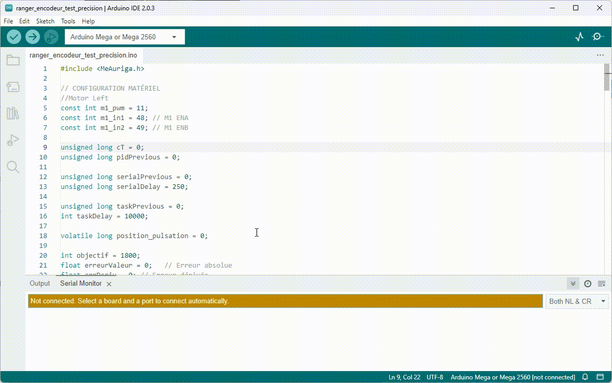

---

## Port série... mais c'est quoi??
Un port série est un port de communication qui permet d'envoyer et de recevoir des données. Il est composé de 2 fils, un fil pour envoyer des données et un fil pour recevoir des données.

Dans le cas des Arduino, un port série est utilisé pour envoyer des données à l'ordinateur. Il est également possible d'utiliser un port série pour envoyer des données à un autre Arduino.

Les ports séries sont identifiés par les lettres **TX** et **RX**. Le fil TX (transmission) est utilisé pour envoyer des données et le fil RX (réception) est utilisé pour recevoir des données.

---

### Questions
- Regardez votre Arduino et identifiez les broches TX et RX. Combien en comptez-vous?
- Quels sont les numros des broches TX et RX sur l'Arduino Mega?

Le port série 0 est utilisé pour communiquer avec l'ordinateur via le câble USB. En effet, comme la DEL qui est sur le port 13, le port série 0 est branché sur le USB.

> **Note**
> 
> Il se peut que vous ne voyez pas `RX0` et `TX0` sur votre Arduino, mais seulement `RX` et `TX`. C'est normal, c'est la même chose.

Les ports séries sur le Mega sont les suivants :

| Port série | Broche TX | Broche RX |
|------------|-----------|-----------|
| Serial          | 0         | 1         |
| Serial1     | 18        | 19        |
| Serial2          | 16        | 17        |
| Serial3          | 14        | 15        |

---

## Port série : La science
Les ports séries utilisent un protocole de communication série, qui signifie que les données sont transmises bit par bit, plutôt que par paquet comme dans le cas des ports USB ou Ethernet.

Vous allez parfois voir le terme **UART** qui signifie **Universal Asynchronous Receiver/Transmitter**. C'est un protocole de communication série qui permet de transmettre des données entre 2 périphériques. Cependant, il s'agit principalement de la même chose que le port série.

Il est important de noter que pour utiliser les ports série, il est nécessaire de configurer les paramètres de communication appropriés tels que la vitesse de transmission, le nombre de bits de données et le contrôle de flux. Cela peut être fait en utilisant des fonctions dédiées dans le code Arduino.

---

## Résumé
- On doit initialiser le port série avec la fonction `Serial.begin()`.
- Pour lire et envoyer de l’information, il faut que le logiciel soit à la même vitesse que l’appareil
  - Donc si l’appareil est à 9600, **il faut que le logiciel soit aussi à la même vitesse**
  - Sinon, vous obtiendrez un résultat similaire à ceci `3??<ÌxÌ▯▯▯ü³??f<`
- On met un délai à la fin de l’affichage pour ne pas surutiliser le µC

---

# Algorithme simple pour gérer les états
Les états dans Arduino sont utilisés pour stocker l'état actuel d'un périphérique ou d'une variable ou d'un mode. Ils peuvent être utilisés pour contrôler des actions ou des comportements dans un programme. Par exemple, dans un programme de contrôle de DEL, vous pouvez utiliser un état pour stocker l'état actuel de la DEL (allumée ou éteinte).

## État d'un périphérique
Voici un exemple d'utilisation des états pour contrôler une DEL :

```cpp
//définir la broche de la DEL
const int ledPin = 13;
//définir l'état de la DEL
bool ledState = LOW;

void setup() {
  pinMode(ledPin, OUTPUT);
}

void loop() {
  //inverser l'état de la DEL
  ledState = !ledState;
  digitalWrite(ledPin, ledState);
  delay(1000);
}
```

---
## État de l'application
Voici un exemple d'utilisation des états pour contrôler un programme :

```cpp
//définir la broche de la DEL
const int ledPin = 13;
//définir l'état de la DEL
bool ledState = LOW;

//définir l'état de l'application
int appState = 0; // 0 = 1 fois par seconde, 1 = 4 fois par seconde
int counter = 0;

void setup() {
  pinMode(ledPin, OUTPUT);
}

void loop() {
  if (appState == 0) {
    //inverser l'état de la DEL
    ledState = !ledState;
    digitalWrite(ledPin, ledState);
    delay(500);
    counter++;
    if (counter == 2) {
      counter = 0;
      appState = 1;
    }
  } else if (appState == 1) {
    //inverser l'état de la DEL
    ledState = !ledState;
    digitalWrite(ledPin, ledState);
    delay(125);
    counter++;
    if (counter == 8) {
      counter = 0;
      appState = 0;
    }
  }
}

```

---

Il y a plusieurs raisons pour lesquelles il est important d'utiliser des états dans un programme de microcontrôleur:

- Clarté du code: en utilisant des états pour stocker l'état actuel d'un périphérique ou d'une variable, vous pouvez rendre votre code plus clair et plus facile à comprendre. Cela permet également de rendre le code plus facile à déboguer et à maintenir.
- Meilleure utilisation des ressources: en utilisant des états pour contrôler les actions et les comportements d'un programme, vous pouvez éviter de répéter des actions inutiles ou de consommer inutilement les ressources du microcontrôleur.
- Interaction en temps réel: en utilisant des états pour réagir aux entrées en temps réel, vous pouvez créer des programmes qui réagissent rapidement aux changements d'état et qui peuvent prendre des décisions en temps réel.
- Plus grande flexibilité: en utilisant des états pour contrôler les actions d'un programme, vous pouvez facilement ajouter de nouvelles fonctionnalités ou changer le comportement d'un programme sans avoir à réécrire entièrement le code.

En résumé, l'utilisation des états permet de rendre le code plus clair, plus efficace, plus réactif et plus flexible, ce qui est essentiel pour créer des programmes efficaces pour les microcontrôleurs.

---

# Exercices
- [Page d'exercices](C02_fonctions_comm_exo.md)

---

# Questions
1. Quelle fonction permet de configurer une broche?
2. Quelle fonction permet de lire la valeur numérique d'une broche?
3. Quelle fonction permet d'écrire une valeur numérique sur une broche?
4. Quelle fonction permet d'écrire une valeur analogique sur une broche?
5. Quelle fonction permet de configurer la vitesse de transmission de données sur le port série?
6. Quelle fonction permet d'écrire du texte sur le port série?
7. Quelle fonction arrête momentanément le programme?

<details><summary>Réponses</summary>

1. `pinMode()`
2. `digitalRead()`
3. `digitalWrite()`
4. `analogWrite()`
5. `Serial.begin()`
6. `Serial.println()` ou `Serial.print()`
7. `delay()`

</details>

<!-- ****************************** -->
<!-- Nom du fichier : .\c02\C02_fonctions_comm_exo.md -->

# Les fonctions de base et la communication <!-- omit in toc -->
# Exercices <!-- omit in toc -->

## Plusieurs états
1. Programmez une DEL pour qu'elle clignote 2 fois dans une seconde et ensuite 5 fois dans une seconde.
   <details><summary>Astuces</summary>
   
   - Vous pouvez utiliser une variable pour simuler un "etat" pour la del.
   - Par exemple, si la variable est à 0, la DEL est clignote 2 fois, si la variable est à 1, la DEL clignote 5 fois. À chaque fin d'état, vous changez la valeur de la variable.

   </details>  
2. Modifiez le programme précédent qui envoit à l'ordinateur l'état du LED à chaque changement d'état.
  - Exemple de sortie : `LED allumée` ou `LED éteinte`

## Amélioration de code
Ci-bas il y a [l'exemple](C02_fonctions_comm.md#état-de-lapplication) que l'on retrouve dans le cours. Il permet de faire clignoter une DEL à 1 Hz et à 4 Hz.

```cpp
//définir la broche de la DEL
const int ledPin = 13;
//définir l'état de la DEL
bool ledState = LOW;

//définir l'état de l'application
int appState = 0; // 0 = 1 fois par seconde, 1 = 4 fois par seconde
int counter = 0;

void setup() {
  pinMode(ledPin, OUTPUT);
}

void loop() {
  if (appState == 0) {
    //inverser l'état de la DEL
    ledState = !ledState;
    digitalWrite(ledPin, ledState);
    delay(500);
    counter++;
    if (counter == 2) {
      counter = 0;
      appState = 1;
    }
  } else if (appState == 1) {
    //inverser l'état de la DEL
    ledState = !ledState;
    digitalWrite(ledPin, ledState);
    delay(125);
    counter++;
    if (counter == 8) {
      counter = 0;
      appState = 0;
    }
  }
}

```

1. Il y a beaucoup de code en double. Modifiez le code pour qu'il n'y ait moins de code en double.
2. Modifiez le code pour remplacer les `if` par un `switch-case`.
3. Affichez à l'ordinateur l'état de l'application à chaque changement d'état.
   - **Précision :** On ne veut pas afficher l'état de l'application à chaque fois que la DEL change d'état. On veut afficher l'état de l'application seulement quand l'état de l'application change.

## Défi
4. Modifiez le code en programmant une fonction pour chaque état de l'application et appelez la fonction correspondante à l'état de l'application.
   - Donc 2 fonctions par exemple `void un_hertz()` et `void quatre_hertz()`.


<!-- ****************************** -->
<!-- Nom du fichier : .\c02\readme.md -->

# README
1. [Fonctions de base](C02_fonctions_comm.md)
    - **Fonctions essentielles Arduino** : Introduction à des fonctions de base comme `pinMode`, `digitalWrite`, `delay`, et `millis`, avec des exemples pratiques tels que "Blink" et "Fade" pour comprendre le contrôle des broches et la gestion du temps.
    - **Communication série** : Explications détaillées sur l'utilisation de `Serial.begin()`, `Serial.print()`, et `Serial.println()` pour échanger des données entre l'Arduino et un ordinateur, ainsi que des concepts liés aux ports série et au protocole UART.
    - **Gestion des états et exercices** : Présentation d'algorithmes simples pour gérer les états des périphériques ou de l'application, et exercices pratiques pour mettre en œuvre les notions apprises.
2. [Exercices](./C02_fonctions_comm_exo.md)

<!-- ****************************** -->
<!-- Nom du fichier : .\c03\C03aa_resistance_de_rappel.md -->

# Résistance de rappel et de tirage <!-- omit in toc -->

# Table des matières <!-- omit in toc -->
- [Introduction](#introduction)
- [Exemple de résistance de rappel](#exemple-de-résistance-de-rappel)
- [Exemple de résistance de tirage](#exemple-de-résistance-de-tirage)
- [Code Arduino](#code-arduino)
- [Valeur de la résistance](#valeur-de-la-résistance)
- [Questions](#questions)
- [Référence](#référence)


# Introduction
Une broche peut avoir trois états soit 0, 1 ou flottant. Si la broche est connectée à la mise à la terre (*ground*), elle aura une valeur de 0, si elle est connectée à la tension d'alimentation, elle aura une valeur de 1 et si elle n'est connectée à rien, elle aura une valeur **flottante**.

Une valeur flottante est une valeur dont on ne pourra pas garantir sa vraie valeur. Sa valeur dépendra de l'environnement, de la température, de la tension d'alimentation, etc. Il s'agit de bruit.

Voici la lecture sur un oscilloscope d'une broche flottante.


On ne sait pas vraiment si la broche est à 0 ou à 1 à quel moment.

De manière générale, on veut éviter les valeurs flottantes. Pour cela, on utilise une résistance de rappel ou de tirage.

Une **résistance de rappel** (*pull-down resistor*), ou une **résistance de tirage** (*pull-up resistor*), est une résistance qui est connectée à un circuit pour maintenir un état logique à un niveau donné. Cela permet de maintenir un état logique à un niveau donné, même si le circuit qui le contrôle est déconnecté ou s'il y a une panne.

La résistance de rappel sert à mettre la broche à 0 en branchant en parallèle une résistance de rappel à la broche et à la masse.

La résistance de tirage sert à mettre la broche à 1 en branchant en parallèle une résistance de tirage à la broche et à la tension d'alimentation.

Voici les deux schémas de résistance de tirage et de rappel.


# Exemple de résistance de rappel


# Exemple de résistance de tirage


# Code Arduino
Il est possible d'activé une résistance de tirage sur l'Arduino.

Lors de la configuration d'une broche avec la fonction `pinMode`, il est possible de spécifier la résistance de tirage avec les constantes `INPUT_PULLUP`.

```cpp
void setup() {
  pinMode(2, INPUT_PULLUP);
}

void loop() {
  if (digitalRead(2) == HIGH) {
    // faire quelque chose
  }
}
```

> **Attention** : Il n'y a pas de résistance de rappel sur l'Arduino. Il faut donc utiliser une résistance externe.
>

# Valeur de la résistance
Il n'y a pas vraiment de valeur de résistance standard pour une résistance de tirage ou de rappel. Une valeur entre 1kΩ et 10kΩ est assez typique. Dans mes montages, j'utilise des **résistances de 4.7kΩ**.

# Questions
Voici des questions possibles dans une évaluation.

1. Quelle est la différence entre une résistance de rappel et une résistance de tirage?
2. Comment activer une résistance de tirage sur l'Arduino?
3. Si on utilise une résistance de tirage (ou de rappel) sur l'Arduino, quelle sera la valeur du bouton poussoir s'il est appuyé?
4. Avec ces deux schémas, quel schéma représente le branchement avec la résistance de rappel et quel schéma représente la résistance de tirage?

<details><summary>Réponses</summary>

1. Une résistance de rappel est une résistance qui est connectée à un circuit pour maintenir un état logique à 0. Une résistance de tirage est une résistance qui est connectée à un circuit pour maintenir un état logique à 1.
2. `pinMode(numeroBroche, INPUT_PULLUP);`
3. 0 si tirage et 1 si rappel.
4. Voir la section avec les schémas.

</details>

---

# Référence
- [Youtube : Pull up resistor tutorial](https://www.youtube.com/watch?v=wxjerCHCEMg) - 4 minutes
- [SparkFun : Pull-up Resistors ](https://learn.sparkfun.com/tutorials/pull-up-resistors/all)

<!-- ****************************** -->
<!-- Nom du fichier : .\c03\C03a_branchement_base.md -->

# Électricité de base <!-- omit in toc -->

- [L'électricité sur les appareils](#lélectricité-sur-les-appareils)
  - [Le voltage](#le-voltage)
  - [L'ampérage](#lampérage)
    - [Exemples](#exemples)
  - [*Important Life skill*](#important-life-skill)
  - [L'électricité de l'Arduino](#lélectricité-de-larduino)
    - [Entrée](#entrée)
    - [Sortie](#sortie)
  - [Résumé](#résumé)
- [Faire un montage électrique](#faire-un-montage-électrique)
  - [Avant de commencer, très important](#avant-de-commencer-très-important)
  - [Branchement de base](#branchement-de-base)
  - [Documentation - Introduction à l'Arduino](#documentation---introduction-à-larduino)
  - [Brancher une DEL](#brancher-une-del)
  - [Brancher un bouton](#brancher-un-bouton)
    - [Code pour lire le bouton](#code-pour-lire-le-bouton)
- [Exercices](#exercices)
- [Références](#références)

# L'électricité sur les appareils
L'objectif de cette section n'est pas de vous donner une formation scientifique sur ce qu'est le voltage, l'ampérage, etc. D'ailleurs, ce sont des notions que vous avez vu au secondaire. Je vous suggère de vous référer à votre cours de physique pour vous rafraîchir la mémoire.

L'objectif est plutôt de savoir comment et où vous pouvez mesurer ces valeurs pour vous assurer que votre circuit fonctionne correctement.

## Le voltage
Le voltage est la différence de potentiel entre deux points. C'est la force qui pousse les électrons à circuler dans un circuit. Le voltage est mesuré en volt (V). On utilise souvent le terme **tension**.

Lorsque l'on branche un circuit électronique il est super important de respecter le voltage de l'appareil, car **si vous branchez un appareil à un adaptateur qui donne trop de voltage, vous risquez de brûler votre appareil.**

Il y a aussi la **polarité** qui est importante. La polarité est la direction du courant. Il y a deux types de polarité : positive et négative. La polarité est indiquée sur les fiches signalétiques des appareils. **Si vous branchez un appareil avec une polarité négative sur un adaptateur avec une polarité positive, vous risquez de brûler votre appareil.**


> **Note** : En circuit logique, nous utilisons de façon général le courant continu. Il y a aussi le courant alternatif, mais il est utilisé plus souvent pour des applications de haute-tension ou des applications spécifiques.

## L'ampérage
L'ampérage est la quantité de courant qui circule dans un circuit. L'ampérage est mesuré en ampère (A).

Un appareil ou composant consomme de l'ampérage. Vous pouvez brancher un adaptateur qui peut fournir plus d'ampérage qu'un appareil a besoin. Car l'appareil ne consommera pas plus d'ampérage que ce qu'il a besoin.

Avez-vous déjà touché un adaptateur qui était très chaud? La raison est que votre appareil consomme beaucoup d'ampérage pour sa capacité de dissipation de chaleur.

 Il est important de respecter la valeur d'ampérage de l'appareil, car **si vous branchez un appareil qui consomme trop d'ampérage sur un adaptateur qui ne peut pas fournir assez d'ampérage, vous risquez de brûler votre appareil.**


 ### Exemples
 - Si vous branchez un adaptateur de portable qui fournit un maximum de 45W sur un portable qui nécessite 90W, vous risquez d'endommager votre portable et votre adaptateur lors des périodes de haute consommation (Ex : *Gaming*).
 - Si vous branchez un adaptateur de 5V en courant continu qui fournit 1A sur un Raspberry Pi 3, votre appareil ne démarrera pas. Le Raspberry Pi 3 nécessite un minimum de 2.5A pour démarrer.

## *Important Life skill*
Habituellement sur les appareils, on peut trouver une étiquette ou gravure près du port de branchement qui indique le voltage de l'appareil. Par exemple, un appareil qui fonctionne à 5V aura une étiquette qui indique 5V.

Les symboles suivants sont souvent utilisés sur les fiches signalétiques des appareils :

| Symbole | Description |
| --- | --- |
|  | Type de polarité |
|  | Type de courant |


Voici quelques exemples de fiches signalétiques :

| Photo | Description |
| --- | --- |
| 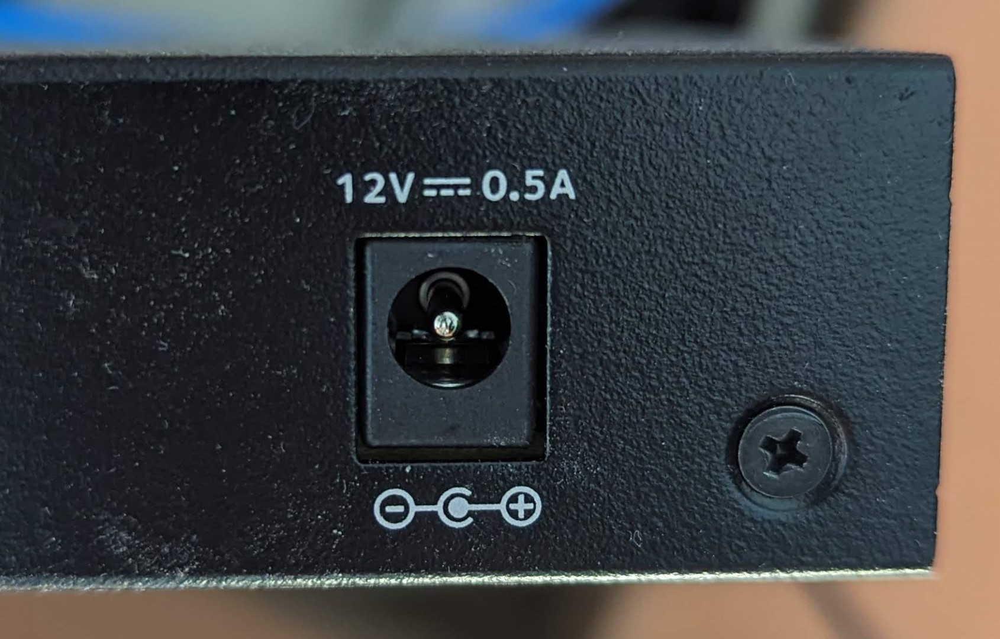 | Appareil acceptant un voltage de 12 volt en courant continu et nécessitant 0.5 ampère avec une polarité positive |
|  | Appareil acceptant un voltage de 5 volt en courant continu  et nécessitant 1 ampère avec une fiche à polarité positive |
|  | Adaptateur avec sortie de 12V en courant continu pouvant fournir 0.5A avec une fiche à polarité positive |
| 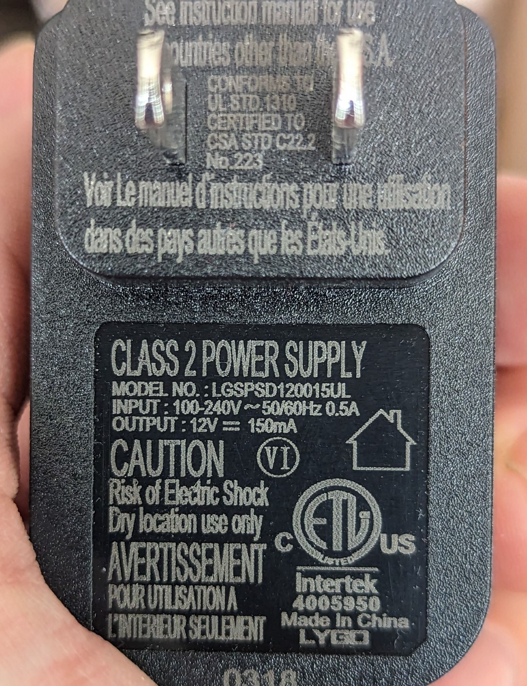 | Adaptateur avec sortie de 12V en courant continu pouvant fournir 150mA avec **une fiche à polarité inconnue...**  Lorsque la polarité n'est pas indiqué, c'est qu'il s'agit d'un connecteur qui n'est pas de type *barrel*. Il peut s'agir d'un connecteur USB.|
| 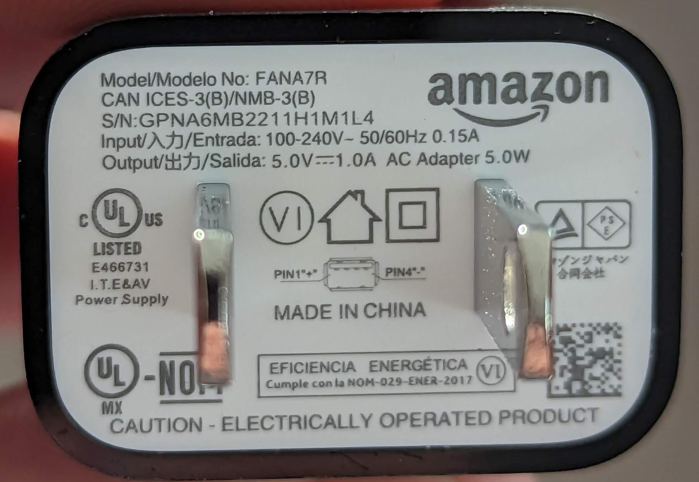 | Adaptateur avec sortie de 5V en courant continu pouvant fournir 1A avec une fiche USB |
| 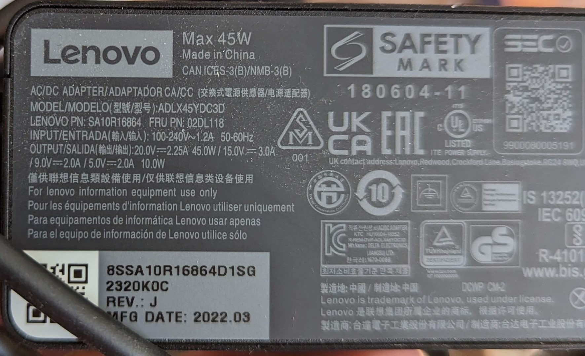 | Adaptateur avec plusieurs valeurs de sortie. Il s'agit d'un adapteur de type USB-C |

## L'électricité de l'Arduino
### Entrée
Sur votre Arduino, on utilise généralement le port USB pour alimenter la carte. Le voltage d'entrée est de 5V. Cependant, il y a aussi un port d'alimentation externe qui peut être utilisé pour alimenter la carte. Ce port peut accepter un voltage de 7 à 12V. C'est le voltage que vous pouvez utiliser pour alimenter votre carte.

> **Perle de culture**
> 
> L'appareil permet d'avoir un voltage variable en entrée, car il y a un **régulateur de voltage** qui permet de convertir le voltage d'entrée en un voltage de 5V.

### Sortie
Le voltage de sortie des broches de l'arduino est de 5V. C'est le voltage de sortie de la carte. C'est le voltage que vous devez utiliser pour brancher vos composants. 

Selon la documentation de l'Arduino Mega, il ne peut fournir que 40 mA par broche pour un total maximal de 200mA pour l'ensemble des broches . C'est pourquoi **il est important de lire la documentation de vos composants** pour savoir les spécifications électriques de chacun.

> **Attention!**
> 
> Toutefois, ceci n'est pas le standard de l'industrie. La plupart des composants sont branchés sur un voltage de 3.3V. C'est pourquoi il est important de lire la documentation de vos composants pour savoir quel voltage ils utilisent.


## Résumé
Ces notions vont vous permettre éventuellement de faire attention lorsque vous branchez des appareils avec des adaptateurs qui ne sont pas d'origine.

---

# Faire un montage électrique

## Avant de commencer, très important
La **convention** veut que les fils rouges soient branchés sur les fils positifs (+) et les fils noirs sur les fils négatifs (-). C'est une convention, mais c'est une convention qui est respectée par la plupart des gens et l'industrie. **C'est donc une convention que vous devez respecter**.
 
**Je retrancherai des points si vous ne respectez pas cette convention!**

## Branchement de base
Dans votre kit, je vous suggère le branchement de base permanent suivant :

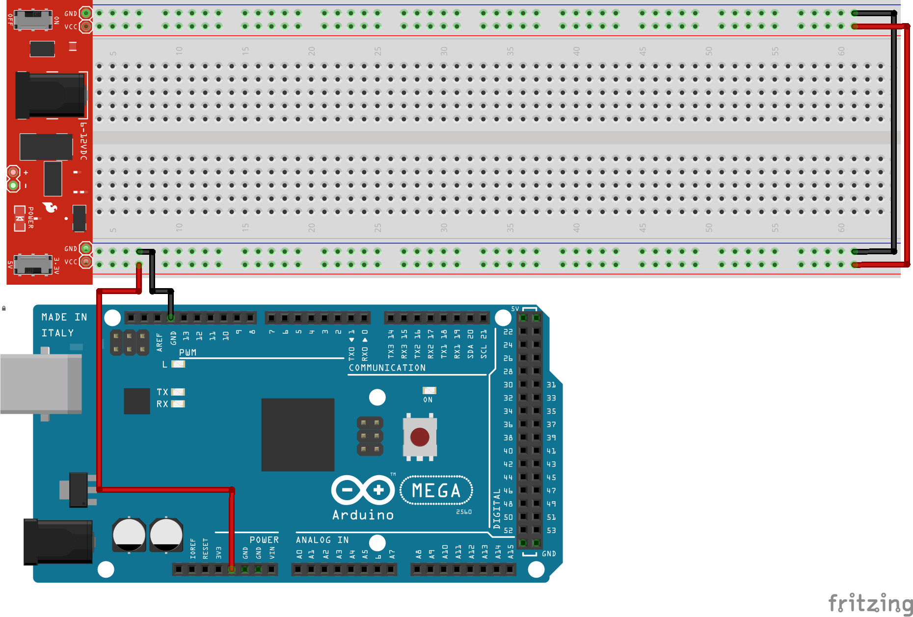

ou encore celui-ci avec l'unité d'alimentation de base (PSU):


Ce branchement permet d'accélérer le démarrage de vos projets. Il vous permettra de tester vos programmes sans avoir à brancher et débrancher les conducteurs à chaque fois.

## Documentation - Introduction à l'Arduino
Parcourir l'excellent document de Jean-Philippe Boulard sur l'[introduction à l'Arduino](intro_arduino_jp/readme.md#platine-dexp%C3%A9rimentation-sans-soudure-breadboard).

## Brancher une DEL
Comme indiquer dans le document d'introduction à l'arduino, pour brancher une DEL **il faut une résistance en série**. La résistance est nécessaire pour limiter le courant qui passe dans la DEL. La DEL est un composant très sensible au courant qui passe à travers elle. Si le courant est trop fort, la DEL peut être endommagée.

Voici un schéma de branchement d'une DEL avec une résistance en série :


- La DEL est branchée sur la broche 9 de l'Arduino.
- Pour la contrôler, il faudra faire un programme.

## Brancher un bouton
Dans ce document, je vous présente une méthode pour brancher un bouton. Cependant, il existe plusieurs façons de brancher un bouton. Vous pouvez brancher un bouton avec une résistance en série ou en parallèle. Vous pouvez aussi brancher un bouton avec un condensateur.

La première chose à savoir c'est le branchement interne du bouton. Dans votre kit, il s'agit de boutons poussoirs momentanés.

Le schéma interne du bouton est le suivant :

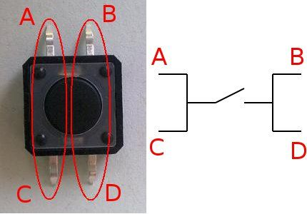

Voir le tutoriel [suivant](https://docs.arduino.cc/tutorials/generic/digital-input-pullup).

Voici un circuit de branchement du bouton **qui doit être programmé en mode `INPUT_PULLUP`**.


### Code pour lire le bouton
Pour lire la valeur du bouton, il faut en premier lieu configurer la broche en mode `INPUT_PULLUP` et ensuite utiliser la fonction `digitalRead()`.

```cpp
// Déclaration des variables
int bouton = 2; // broche 2

void setup() {
  Serial.begin(9600); // Initialisation du port série
  // Configuration de la broche en mode INPUT_PULLUP
  pinMode(bouton, INPUT_PULLUP);
}

void loop() {
  // Lecture de la valeur du bouton
  int valeurBouton = digitalRead(bouton);
  
  // Affichage de la valeur du bouton
  Serial.println(valeurBouton);
  delay(10);
}
```

# Exercices
Voir la liste des exercices [ici](C03a_branchement_base_exo.md).

# Références
- [TUTO ARDUINO #1 : INSTALLATION ET FAIRE CLIGNOTER UNE LED!](https://www.youtube.com/watch?v=k0KYfGvZUCw&list=PLm9ko_-biSnQz-1PGorgsi3Q1CSN7HdNh&index=3)
- [TUTO ARDUINO #2 : FAIRE FONCTIONNER UN BOUTON / INTERRUPTEUR!](https://www.youtube.com/watch?v=MnzidiZ_6ok)
- [Pull-up resistors](https://learn.sparkfun.com/tutorials/pull-up-resistors/all)

<!-- ****************************** -->
<!-- Nom du fichier : .\c03\C03a_branchement_base_exo.md -->

# Exercices
## Exercice 1
Branchez une DEL sur la broche 9 de l'Arduino. Faites clignoter la DEL à l'aide d'un programme.

## Exercice 2
Ajoutez une DEL sur la broche 10 de l'Arduino. Faites clignoter les DELs à l'aide d'un programme.

## Exercice 3
Au circuit précédent, branchez un bouton sur la broche 2 de l'Arduino. Faites en sorte que lorsque le bouton est appuyé, la DEL sur la broche 9 s'allume. Faites en sorte que lorsque le bouton est relâché, la DEL sur la broche 9 s'éteigne.

## Exercice 4
Avec le circuit précédent, faites en sorte que lorsque le bouton est appuyé, la DEL sur la broche 9 s'allume, mais que la DEL sur la broche 10 s'éteigne. Faites en sorte que lorsque le bouton est relâché, la DEL sur la broche 9 s'éteigne, mais que la 10 s'allume.

## Défi
Faites un programme qui fait basculer les DELs. C'est-à-dire que lorsque le bouton est appuyé une première fois, la DEL sur la broche 9 s'allume et la DEL sur la broche 10 s'éteint. Une seconde fois, les LEDs sont inversées. Une troisième fois, les LEDs sont inversées et ainsi de suite.

> **Recherche**
> 
> Vous avez sûrement remarquez des phénomènes bizarres. Par exemple, lorsque vous appuyez le sur bouton, la DEL ne s'allume pas tout le temps ou à l'inverse elle est instable.
> 
> Pour quelle raison?
> Je vous laisse le soin de rechercher et je vous donne la réponse dans les prochains cours.

<!-- ****************************** -->
<!-- Nom du fichier : .\c03\C03b_sans_delai.md -->

# Pas de `delay()`! <!-- omit in toc -->

- [Introduction](#introduction)
- [Utiliser `millis()` comme `delay()`](#utiliser-millis-comme-delay)
- [Pourquoi utiliser `millis()` au lieu de `delay()`?](#pourquoi-utiliser-millis-au-lieu-de-delay)
  - [`millis()` est plus précis](#millis-est-plus-précis)
  - [`millis()` n'est pas bloquant](#millis-nest-pas-bloquant)
- [Exemple : un planificateur de tâches simple](#exemple--un-planificateur-de-tâches-simple)
- [micros() et le débordement](#micros-et-le-débordement)
- [Explication de la limite de `millis()`](#explication-de-la-limite-de-millis)
- [Références](#références)

# Introduction
La fonction `delay()` qui est populaire auprès des débutants a un gros problème. En effet, elle bloque le programme pendant un certain temps. Pendant ce temps, le programme ne fait rien. C'est comme si le programme était en pause. C'est un problème car si le programme est en pause, il ne peut pas réagir aux événements qui se produisent. Par exemple, si le programme est en pause pendant 1 seconde, il ne peut pas réagir à un appui sur un bouton pendant cette seconde.


`millis()` est une fonction qui permet de mesurer le temps écoulé depuis le démarrage du programme. Elle retourne un nombre entier qui représente le temps écoulé en millisecondes. Par exemple, si le programme a été démarré il y a 1 seconde, la fonction `millis()` retournera 1000.

À première vue, vous pouvez douter de l'utilité de cette fonction. Cependant, elle est extrêmement utile pour plusieurs scénarios, souvent remplaçant `delay()` complètement. C'est ce que nous allons voir dans cette leçon.

# Utiliser `millis()` comme `delay()`
Voici un exemple qui remplace `delay()` par `millis()`.

**NE PAS FAIRE CECI DANS VOTRE CODE, C'EST UNE DÉMONSTRATION. LISEZ L'ARTICLE AU COMPLET**

```cpp
int wait = 1000; // 1000 millisecondes = 1 seconde
unsigned long currentTime = 0;

void setup() {
  Serial.begin(9600);
}

void loop() {
  currentTime = millis();

  Serial.println("Salut!");

  while (millis() < currentTime + wait) {
    // Attendre
  }
}

```

Si vous voulez arrêter 1 seconde à chaque fin de boucle, le code précédent est un peu fou. On pourrait seulement utiliser `delay(1000)` à la place.

# Pourquoi utiliser `millis()` au lieu de `delay()`?
Nous allons maintenant voir l'avantage de `millis()` par rapport à `delay()`.

## `millis()` est plus précis

Le premier avantage que nous allons aborder est la précision du *timing*. Du point de vue du code, nous avons abordé ce sujet dans le dernier chapitre. Avec `millis()`, nous pouvons nous assurer que la boucle s'exécute aussi souvent que nous le souhaitons, indépendamment du temps d'exécution (évidemment tant que le temps d'exécution est inférieur à la période souhaitée). Avec `delay()`, ce n'est pas possible puisque nous ne connaissons pas la durée d'exécution de la boucle.

Un chronométrage précis comme celui-ci est très utile pour échantillonner à une certaine fréquence ou pour exécuter des filtres, entre autres choses.

## `millis()` n'est pas bloquant
L'autre avantage de `millis()` est qu'il ne nous empêchera pas d'exécuter du code pendant l'"attente".

Disons que nous voulons imprimer "Hello" en série une fois par seconde tout en faisant d'autres choses pendant ce temps. Ceci n'est pas possible avec delay() puisqu'il met en pause tout le code. Voici une façon de le faire :

```cpp
unsigned long currentTime = 0;
 
void setup() {
  Serial.begin(115200);
}
 
void loop() {
  const int interval = 1000;

  currentTime = millis();

  if(currentTime - previousTime >= interval){
      previousTime = currentTime;

      Serial.println("Bonjour!");
  }
  
  //Exécuter d'autres choses
}
```

Ce bout de code est assez similaire au premier morceau, sauf qu'il ne bloque pas le reste du programme lorsqu'il n'imprime pas en série.

# Exemple : un planificateur de tâches simple
Écrivons un exemple simple dans lequel nous créons un planificateur qui imprime certains bouts de texte à des intervalles différents.

**Exercice** : Copiez ce code et envoyez-le à votre carte Arduino. Qu'observez-vous ?

<table>
<tr>
<th>Code</th>
<th>Sortie</th>
</tr>
<tr>
<td>

```cpp
unsigned long currentTime = 0;

void setup() {
  Serial.begin(9600);
}

void loop() {
  const int intervalBonjour = 5000;
  const int intervalSalut = 7000;
  const int intervalHello = 11000;

  static unsigned long previousBonjour = 0;
  static unsigned long previousSalut = 0;
  static unsigned long previousHello = 0;

  currentTime = millis();

  if (currentTime - previousBonjour >= intervalBonjour) {
    previousBonjour = currentTime;
    print_time(currentTime);
    Serial.println("Bonjour!");
  }

  if (currentTime - previousSalut >= intervalSalut) {
    previousSalut = currentTime;
    print_time(currentTime);
    Serial.println("Salut!");
  }

  if (currentTime - previousHello >= intervalHello) {
    previousHello = currentTime;
    print_time(currentTime);
    Serial.println("Hello!");
  }
}

void print_time(unsigned long time_millis){
    Serial.print("Time: ");
    Serial.print(time_millis/1000);
    Serial.print("s - ");
}
```
</td>
<td>


</td>
</tr>
</table>

On constate la simplicité de l'implémentation de ce planificateur. Il suffit de vérifier si le temps écoulé depuis la dernière exécution de la tâche est supérieur à l'intervalle souhaité. Si c'est le cas, nous exécutons la tâche et nous mettons à jour le temps de la dernière exécution.

Ainsi l'utilisation de `millis()` nous permet de créer du code relativement simple et facile à maintenir.

# micros() et le débordement
Si le besoin de précision est plus grand, il y a la fonction `micros()`. Cette fonction fait la même chose que `millis()`, mais elle renvoie le temps en microsecondes.

Il faudra faire attention au débordement. Il se produit après 70 minutes au lieu de 50 jours.

# Explication de la limite de `millis()`
La valeur maximum d'un `unsigned long` est de 4 294 967 295 car un `unsigned long` est de 4 octets donc 2^32-1.

Si nous divisons cette valeur par 1000, nous obtenons 4 294 967 secondes. On divise par 60, on obtient 71 582 minutes. On divise par 60, on obtient 1 193 heures. On divise par 24, on obtient 49.7 jours.

# Références
- [Arduino Tutorial: Using millis() Instead of delay()](https://www.norwegiancreations.com/2017/09/arduino-tutorial-using-millis-instead-of-delay/)
- [Arduino Tutorial: Avoiding the Overflow Issue When Using millis() and micros()](https://www.norwegiancreations.com/2018/10/arduino-tutorial-avoiding-the-overflow-issue-when-using-millis-and-micros/)

<!-- ****************************** -->
<!-- Nom du fichier : .\c03\C03c_logique_antirebond.md -->

# Le rebond <!-- omit in toc -->


# Table des matières <!-- omit in toc -->
- [Introduction](#introduction)
- [Principe de fonctionnement](#principe-de-fonctionnement)
- [Schéma](#schéma)
- [Code](#code)
- [Résumé](#résumé)
- [Exercice](#exercice)

# Introduction
Certains d'entre vous avez peut-être remarqué que lors de l'appuie d'un bouton, on avait un effet indésirable. En effet, le bouton était enfoncé et relâché plusieurs fois même si l'on avait appuyé qu'une seule fois. C'est ce qu'on appelle un rebond.


Si l'on regarde le graphique précédent, ce qui arrive, c'est qu'à l'échelle des microsecondes, lorsque l'on appuie sur le bouton, le contact de ne fait pas pleinement. Il y a des microvibrations que le microcontrôleur peut capter.  C'est un problème qui peut être résolu avec un peu de logique.

# Principe de fonctionnement
Lorsqu'un système physique change d'état, il y a souvent des oscillations pendant la période transitoire pour des raisons physiques (mécanique, temps de réponse, etc.). Il faut donc laisser un temps suffisant pour que l’état puisse se stabiliser. Cela peut être rendu possible par filtrage électronique ou mécanique ou bien numériquement grâce au programme qui traite la mesure.

# Schéma
Voici un schéma pour tester le code.


# Code

Nous allons créer deux variables qui vont garder en mémoire l’état présent et passé du capteur. Nous allons lire l’entrée digitale et valider son état en fonction de l’état précédent et d’un délai anti-rebond. Cette méthode peut être implémentée avec la fonction `millis()`.

```cpp
int pinBouton = 2; // Pin du bouton

void setup() {
  Serial.begin(9600);
  pinMode(pinBouton, INPUT_PULLUP);
}

void loop() {
  static int etatPrecedent = 0; // Etat précédent du capteur
  static int etatPresent = 0; // Etat présent du capteur
  static int etat = 0; // Etat du capteur
  const int delai = 50; // Délai anti-rebond en ms

  static unsigned long dernierChangement = 0; // Dernier changement d'état du capteur

  etatPresent = digitalRead(pinBouton); // Lecture de l'état du capteur

  if (etatPresent != etatPrecedent) { // Si l'état a changé
    dernierChangement = millis(); // On enregistre le temps actuel
  }

  if ((millis() - dernierChangement) > delai) { // Si le délai est dépassé
    if (etatPresent != etat) { // Si l'état a changé
        etat = etatPresent; // On enregistre l'état actuel
      Serial.println(etat); // On affiche l'état du capteur
    }
  }

  etatPrecedent = etatPresent; // On enregistre l'état actuel pour la prochaine itération
}
```

# Résumé
Si vous variez le délai anti-rebond (`delai`), vous verrez que le capteur est plus ou moins sensible. En prenant un temps suffisamment long, vous verrez que le capteur ne sera plus sensible aux microvibrations.

Ce tutoriel permet de comprendre et d’implémenter la logique anti-rebond. Pour un plus grand simplicité d’utilisation, vous pouvez écrire une librairie ou utiliser une librairie existante comme OneButton.h.

# Exercice
- Testez le code dans l'exemple en faisant allumé et éteindre une DEL lorsque vous appuyez sur le bouton.
  - 1 clic - Allumé, 1 clic - Éteint

<!-- ****************************** -->
<!-- Nom du fichier : .\c03\readme.md -->

# README

This is the README for the folder: c03


<!-- ****************************** -->
<!-- Nom du fichier : .\c04\C04a_fonction_analogRead.md -->

# Lecture de valeurs analogiques <!-- omit in toc -->

# Table des matières <!-- omit in toc -->
- [Qu'est-ce qu'une valeur analogique?](#quest-ce-quune-valeur-analogique)
- [Comment un microcontrôleur peut-il lire une valeur analogique?](#comment-un-microcontrôleur-peut-il-lire-une-valeur-analogique)
- [Perte de précision](#perte-de-précision)
- [Les Arduinos](#les-arduinos)
- [Exemples de cas pratique](#exemples-de-cas-pratique)
- [Le potentiomètre](#le-potentiomètre)
  - [Fonctionnement interne](#fonctionnement-interne)
- [La fonction `analogRead()`](#la-fonction-analogread)
- [Exemples](#exemples)
  - [Base](#base)
  - [Sélection de DEL](#sélection-de-del)
- [La fonction `map()`](#la-fonction-map)
  - [Exemple de code avec la fonction `map()`](#exemple-de-code-avec-la-fonction-map)
- [Exercices](#exercices)
- [Références](#références)


# Qu'est-ce qu'une valeur analogique?
Une valeur analogique est une valeur qui peut prendre une infinité de valeurs. Par exemple, la température peut prendre une infinité de valeurs entre -273.15°C et 100°C. La luminosité peut prendre une infinité de valeurs entre 0 et 100%. La position d'un potentiomètre peut prendre une infinité de valeurs entre 0 et 100%. Une valeur analogique est donc une valeur qui peut prendre une infinité de valeurs.

Lorsque l'on dit infinité, c'est que la valeur peut prendre une infinité de valeurs entre deux valeurs. Par exemple, la température peut prendre une infinité de valeurs entre -273.15°C et -273.14°C, entre -273.14°C et -273.13°C, etc.

# Comment un microcontrôleur peut-il lire une valeur analogique?
Un microcontrôleur ne peut pas lire une valeur analogique directement. Il faut donc convertir la valeur analogique en une valeur numérique. Pour ce faire, on utilise un convertisseur analogique-numérique (ADC). Un ADC est un composant électronique qui convertit une valeur analogique en une valeur numérique.

**Les microcontroleur possède généralement un ou plusieurs ADC intégré**. Par exemple, l'ATMega2560 possède 16 ADC intégrés. Ces ADC sont connectés à des broches spécifiques. Par exemple, les ADC intégrés à l'ATMega2560 sont connectés aux broches **A0 à A15**.


> **Pratique** : Prenez votre Arduino et repérez les broches A0 à A15.

# Perte de précision
Lors de la conversion d'une valeur analogique en une valeur numérique, il y a une perte de précision. Par exemple, si on convertit une valeur analogique de 0 à 5V en une valeur numérique de 0 à 1023, il y a une perte de précision. En effet, il y a 1024 valeurs numériques possibles, mais il y a une infinité de valeurs analogiques possible entre 0 et 5V (exemple : 3.1416V). Donc la perte de précision est due au tronquage des valeurs numériques.

Exemple :
- Une valeur de 3.1416V sera convertie en une valeur numérique de $3.1416 / 5 * 1023 = 642.77$. Cette valeur sera tronquée à **`642`**.


Voici un exemple de graphique représentant le concept de conversion d'une valeur analogique en une valeur numérique avec la perte de précision.


On remarque que les valeurs numérique ne peuvent pas représenter toutes les valeurs analogiques à tous les temps. Les valeurs sont découpées au rythme de l'échantillonnage du programme.

# Les Arduinos
Les Arduinos possèdent plusieurs ADC. **Ils sont de 10-bit**. Cela signifie que la précision sera de 1024 valeurs soit de 0 à 1023, car 2^10 = 1024. Les valeurs analogiques seront converties en valeurs numériques entre 0 et 1023.

> **Note** : Une résolution de 1-bit signifie qu'on ne pourrait avoir qu'une valeur de 0 ou 1, car il n'y a que deux valeurs possibles. Ainsi une résolution de 2-bit sera de 0 à 3, 3-bit de 0 à 7, ainsi de suite.

# Exemples de cas pratique
On retrouve des composants analogiques partout, par exemple, les **potentiomètres**, les **capteurs de température**, les **microphones**, les **capteurs de luminosité**, etc. Ces composants peuvent être reliés à des broches analogiques de l'Arduino. On peut lire la valeur analogique de ces composants en utilisant les ADC de l'Arduino.

# Le potentiomètre
Un potentiomètre est un composant électrique qui agit comme une résistance variable. Il a trois bornes : les deux extrémités et un contact coulissant ou rotatif qui se déplace le long d'un élément résistif. En ajustant la position du contact le long de l'élément résistif, le potentiomètre peut faire varier la résistance entre ses deux extrémités, créant ainsi un circuit diviseur de tension variable. Cela permet de l'utiliser comme un contrôle de volume dans du matériel audio, un capteur de position en robotique ou un outil de calibration dans du matériel de laboratoire. Les potentiomètres sont souvent appelés "pots" pour faire court.


## Fonctionnement interne


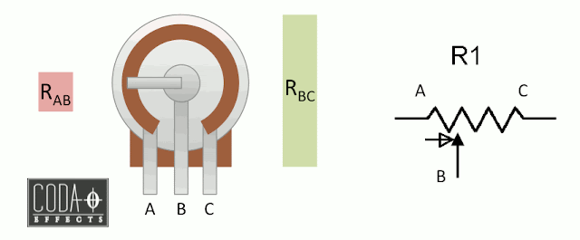


# La fonction `analogRead()`
La fonction pour lire une valeur analogique est `analogRead()`. Cette fonction prend en paramètre le numéro de la broche analogique à lire. Par exemple, si on veut lire la valeur analogique de la broche A0, on utilise la fonction `analogRead(A0)`. La fonction `analogRead()` retournera un entier entre 0 et 1023.

# Exemples
## Base
Voici un exemple de code qui lit la valeur analogique d'un potentiomètre branché sur la broche A0 et l'affiche sur le moniteur série.

<table>
  <tr>
    <td></td>
    <td>

  ```cpp
  void setup() {
    Serial.begin(9600);
  }

  void loop() {
    int valeur = analogRead(A0);
    Serial.println(valeur);
    delay(1000);
  }
  ```
  </td>
  </tr>

</table>

---

## Sélection de DEL
Voici un exemple de code qui lit la valeur analogique d'un potentiomètre branché sur la broche A0 et allume une DEL en fonction de la valeur lue.

<table>
  <tr>
    <td></td>
    <td>

  ```cpp
  const int ledPins[] = {2, 3, 4, 5};  // Tableau des numéros de broches
  int potentiometerPin = A0;           
  int potentiometerValue = 0;          
  int ledIndex = 0;                   // Index du DEL allume

  void setup() {
    Serial.begin(9600);
    for (int i = 0; i < 4; i++) {
      // Initialisation des DEL en sortie
      pinMode(ledPins[i], OUTPUT); 
    }
  }

  void loop() {
    potentiometerValue = analogRead(potentiometerPin);
    
    if (potentiometerValue < 256) {
      digitalWrite(ledPins[0], HIGH);
      digitalWrite(ledPins[1], LOW);
      digitalWrite(ledPins[2], LOW);
      digitalWrite(ledPins[3], LOW);
    } else if (potentiometerValue < 512) {
      digitalWrite(ledPins[0], LOW);
      digitalWrite(ledPins[1], HIGH);
      digitalWrite(ledPins[2], LOW);
      digitalWrite(ledPins[3], LOW);
    } else if (potentiometerValue < 768) {
      digitalWrite(ledPins[0], LOW);
      digitalWrite(ledPins[1], LOW);
      digitalWrite(ledPins[2], HIGH);
      digitalWrite(ledPins[3], LOW);
    } else {
      digitalWrite(ledPins[0], LOW);
      digitalWrite(ledPins[1], LOW);
      digitalWrite(ledPins[2], LOW);
      digitalWrite(ledPins[3], HIGH);
    }
  }
  ```
  </td>
  </tr>
</table>

Cet exemple est disponible [ici](https://wokwi.com/projects/356395304066120705).

---

# La fonction `map()`
La fonction `map()` permet de convertir une valeur d'un intervalle à un autre intervalle. Par exemple, si on veut convertir une valeur de 0 à 1023 en une valeur de 0 à 255, on peut utiliser la fonction `map()`.

```cpp
int valeur = analogRead(A0);
int valeur_convertie = map(valeur, 0, 1023, 0, 255);
```

La fonction `map()` prend en ordre les paramètres suivants :
- la valeur à convertir;
- la valeur minimale de l'intervalle de départ;
- la valeur maximale de l'intervalle de départ;
- la valeur minimale de l'intervalle d'arrivée;
- la valeur maximale de l'intervalle d'arrivée.

L'algorithme de la fonction `map()` est le suivant :
```cpp
int map(int valeur, int min_depart, int max_depart, int min_arrivee, int max_arrivee) {
  int decalage_depart = valeur - min_depart;
  int plage_depart = max_depart - min_depart;
  int plage_arrivee = max_arrivee - min_arrivee;
  int valeur_convertie = (decalage_depart / plage_depart ) * plage_arrivee + min_arrivee;

  return valeur_convertie;
}
```

Cette fonction permet aussi d'intervertir deux intervalles. Par exemple, si on veut convertir une valeur de 0 à 1023 en une valeur de 255 à 0, on peut utiliser la fonction `map()`.

```cpp
int valeur = analogRead(A0);
int valeur_convertie = map(valeur, 0, 1023, 255, 0);
```

## Exemple de code avec la fonction `map()`
Voici le même exemple que [Sélection de DEL](#sélection-de-del) mais avec la fonction `map()`.


> **Note** : L'exemple n'est pas le plus efficace, mais il ne sert qu'à illustrer une utilisation de la fonction `map()`.

```cpp
const int ledPins[] = {2, 3, 4, 5};  // Tableau des numéros de broches
int potentiometerPin = A0;           
int potentiometerValue = 0;          
int ledIndex = 0;                   // Index du DEL allume

unsigned long currentTime = 0;
unsigned long serialPrevious = 0;
int serialDelay = 1000;

int mappedIndex = 0;

void setup() {
  Serial.begin(9600);

  // On utilise une boucle que pour travailler
  // avec des tableaux
  for (int i = 0; i < 4; i++) {
    // Initialisation des DEL en sortie
    pinMode(ledPins[i], OUTPUT); 
  }
}

void loop() {
  currentTime = millis();

  potentiometerValue = analogRead(potentiometerPin);
  mappedIndex = map (potentiometerValue, 0, 1023, 0, 3);

  // On utilise une boucle que pour travailler
  // avec des tableaux
  for (int i = 0; i < 4; i++) {
    if (i == mappedIndex) {
      digitalWrite(ledPins[i], HIGH);
    }
    else {
      digitalWrite(ledPins[i], LOW);
    }
  }

  if (currentTime - serialPrevious >= serialDelay) {
    serialPrevious = currentTime;
    Serial.print("Valeur : ");
    Serial.println(potentiometerValue);    
  }  
}
```

Cet exemple est disponible [ici](https://wokwi.com/projects/356398829928163329).

---

# Exercices
- [Exercices](c04x_exercices.md)
---

# Références
- [Arduino Get Started : Potentiometer](https://arduinogetstarted.com/tutorials/arduino-potentiometer)


<!-- ****************************** -->
<!-- Nom du fichier : .\c04\C04b_fonction_analogWrite.md -->

# AnalogWrite <!-- omit in toc -->

## Table des matières <!-- omit in toc -->
- [Introduction](#introduction)
- [PWM : C'est quoi??](#pwm--cest-quoi)
- [PWM : À quoi ça sert?](#pwm--à-quoi-ça-sert)
- [Exercices](#exercices)
- [Références](#références)

---

# Introduction
La fonction `analogWrite()` permet d'écrire une valeur analogique en tant que signal [PWM](#pwm--cest-quoi) à une broche. Cette fonction prend deux paramètres: le numéro de la broche et la valeur à écrire. La valeur doit être comprise entre 0 et 255. La valeur 0 correspond à une tension de 0V et la valeur 255 correspond à une tension de 5V. La valeur 127 correspond à une tension de 2.5V.

# PWM : C'est quoi??
Le PWM est une technique qui permet de simuler une tension analogique en utilisant une tension numérique. Le principe est de faire varier la durée de la mise en tension d'une broche numérique à une fréquence très élevée. La fréquence est si élevée que l'oeil humain ne peut pas la percevoir. La tension numérique est alors perçue comme une tension analogique.

PWM tient pour **P**ulse **W**idth **M**odulation. La modulation de largeur d'impulsion est une technique qui permet de faire varier la largeur d'un signal carré. Le signal carré est alors perçu comme une tension analogique.

Voici un aperçu du PWM avec différentes valeurs.


Voici en détail pour un signal PWM à 25% de la durée de mise en tension pour une broche du microcontrôleur.


> **Note** : Par défaut sur le Mega, la fréquence du PWM pour les broches D2 à D12 et D44 à D46 est de 490.20 Hz. Pour les broches D4 et D13, la fréquence est de 980.9 Hz.

# PWM : À quoi ça sert?
Le PWM peut être utilisé à différentes fins. Il peut être utilisé pour faire varier la luminosité d'une DEL, la vitesse d'un moteur, la position d'un servo, etc.

Voici un exemple de code qui fait graduellement varier la tension d'une DEL sur la broche 9.

<table>
    <tr>
        <td>

```cpp
unsigned long lastTime = 0;
unsigned long interval = 4;
unsigned long currentTime = 0;
int brightness = 0;
int direction = 1;

int ledPin = 9;

void setup() {
    pinMode(ledPin, OUTPUT);
}

void loop() {
    currentTime = millis();

    // Gestion de la variation de la luminosité
    if (currentTime - lastTime >= interval) {
        lastTime = currentTime;
        brightness += direction;

        analogWrite(ledPin, brightness);

        if (brightness >= 255 || brightness <= 0) {
            direction *= -1;
        }
    }
}
```

</td>
<td></td>
</tr>
</table>

---

# Exercices
- [Exercices](c04x_exercices.md)

---

# Références
- [Secrets of Arduino PWM](https://docs.arduino.cc/tutorials/generic/secrets-of-arduino-pwm)
- [How To Change PWM Frequency Of Arduino Mega](https://www.etechnophiles.com/how-to-change-pwm-frequency-of-arduino-mega/)

<!-- ****************************** -->
<!-- Nom du fichier : .\c04\C04c_traceur_serie.md -->

# Le traceur série <!-- omit in toc -->

# Table des matières <!-- omit in toc -->
- [Objectifs](#objectifs)
- [Introduction](#introduction)
- [Démarrer le traceur](#démarrer-le-traceur)
- [Utiliser le traceur](#utiliser-le-traceur)
  - [Exemple](#exemple)
- [Calcul de la valeur moyenne d'un signal](#calcul-de-la-valeur-moyenne-dun-signal)
- [Exercice](#exercice)
- [Références](#références)

# Objectifs
- Savoir comment utiliser le traceur des courbes avec Arduino (Oscilloscope)
- Savoir afficher une ou plusieurs courbes avec Arduino
- Savoir calculer la valeur moyenne d’un signal

# Introduction
Dans ce cours, nous allons voir comment utiliser le traceur des courbes avec Arduino. Le traceur des courbes est un outil très utile pour visualiser les signaux analogiques.


# Démarrer le traceur
Pour démarrer le traceur série, il faut aller dans le menu `Outils` et sélectionner `Traceur série`.


# Utiliser le traceur
Pour utiliser le traceur, il faut d'abord envoyer des données dans le port série. Le format des données est le suivant :

`nomValeur:Valeur[,nomValeur2:Valeur2[,...]]`

Par exemple, si on veut envoyer la valeur 10 pour la courbe `Courbe1` et la valeur 20 pour la courbe `Courbe2`, on envoie la chaîne de caractères suivante :

`Courbe1:10,Courbe2:20`

Il faut terminer la chaîne de caractères par un retour à la ligne (`\n`) soit en utilisant la fonction `Serial.println()`;

## Exemple
Dans cet exemple, nous allons afficher la valeur de la tension mesurée par une photorésistance sur le port A0.

```cpp
void setup() {
  Serial.begin(9600);
}

void loop() {
  int val = analogRead(A0);
  Serial.print("Lumiere:");
  Serial.println(val);
  delay(100);
}

```

Branchement de la photorésistance sur l'Arduino Mega


---

# Calcul de la valeur moyenne d'un signal
Pour calculer la valeur moyenne d'un signal, il faut faire la moyenne des valeurs lues sur un certain nombre de points. Par exemple, si on veut calculer la valeur moyenne de la tension mesurée par une photorésistance, on peut lire la valeur de la tension 10 fois et faire la moyenne des 10 valeurs lues.

```cpp
unsigned long currentTime = 0;

// String est une classe qui permet de manipuler des chaînes de caractères
String msg = "";

void setup() {
  Serial.begin(9600);
}

void loop() {
    currentTime = millis();
    int val = sensorTask();
    msg += "Lumiere:" + String(val);
    serialPrintTask();
}

// Tâche de lecture de la valeur de la photorésistance
int sensorTask() {
    static unsigned long lastTime = 0;
    static unsigned int valSum = 0;
    static int val = 0;
    static int sampleCount = 0;

    // Taux de rafraîchissement de la lecture de la valeur de la photorésistance
    int rate = 100;
    int nbSamples = 16;

    if (currentTime - lastTime > rate) {
        lastTime = currentTime;

        // Somme des valeurs lues
        valSum += analogRead(A0);

        if (++sampleCount >= nbSamples) {
             // Décalage de 4 bits vers la droite équivaut à la division par 16
             // C'est plus rapide que la division
            val = valSum >> 4;

            // Remise à zéro des variables
            valSum = 0;
            sampleCount = 0;
        }
    }

    return val;
}

// Tâche d'envoi des données dans le traceur série
void serialPrintTask() {
    static unsigned long serialPrintPrevious = 0;
    int serialPrintInterval = 100;

    // Si ce n'est pas le moment, on sort de la fonction immédiatement
    if (currentTime - serialPrintPrevious < serialPrintInterval) return;

    serialPrintPrevious = currentTime;

    if (msg != "") {
        Serial.println(msg);
        msg = "";
    }
}

```
---

# Exercice
- Ajouter une photoresistance sur votre platine et tester le code ci-dessus en visualisant les données dans le traceur série.
- Si ce n'est déjà fait, ajouter un potentiomètre sur votre platine et tester le code ci-dessus en visualisant les données de la photoresistance et du potentiomètre dans le traceur série.
- Modifier le code pour avoir une courbe de valeur moyenne de la valeur mesurée par la photoresistance.

---

# Références
- https://arduinogetstarted.com/tutorials/arduino-light-sensor
- 


<!-- ****************************** -->
<!-- Nom du fichier : .\c04\C04x_exercices.md -->

# Exercices - `analogRead()`
1. Réalisez l'[Exemple de code de base](#exemple-de-code-de-base)
2. Ajoutez une DEL branché sur la broche de votre choix. En utilisant la fonction map, faites en sorte que la DEL clignote à une fréquence proportionnelle à la valeur analogique lue par le potentiomètre, c'est-à-dire que si la valeur analogique est de 0, la DEL ne clignote pas. Si la valeur analogique est de 1023, la DEL clignote à toutes les millisecondes.
3. Réalisez le montage de l'exemple [Sélection de DEL](#sélection-de-del) avec le code de l'exemple [Exemple de code avec la fonction `map()`](#exemple-de-code-avec-la-fonction-map).

# Exercices - avec `analogWrite()`
- Avec le montage de l'[exercices](#exercices) #4 des notes sur `analogRead`, faire varier des DEL en utilisant la fonction `analogWrite()`.

## Défi
- Avec le montage précédent, réalisez un programme qui allume l'ensemble des DEL en échelle et graduellement.
  - Lorsque la valeur du potentiomètre est en déça de 255, la DEL 1 s'allume graduellement de 0 à 100% donc si le potentiomètre est à 0, la DEL 1 doit être éteinte et si le potentiomètre est à 127, la DEL 1 doit être à 50% de luminosité.
  - Si le potentiomètre est entre 255 et 511, la DEL 2 s'allume graduellement de 0 à 100% et la DEL 1 doit être allumée à 100%.
  - Ansi de suite


<!-- ****************************** -->
<!-- Nom du fichier : .\c04\readme.md -->

# README

This is the README for the folder: c04


<!-- ****************************** -->
<!-- Nom du fichier : .\c04b_pratique_examen\readme.md -->

# Pratique pour l'examen

À l'aide d'une plaque d'expérimentation, d'un Arduino et de composants électroniques, vous devrez réaliser un projet qui démontrera vos compétences acquises durant le cours. Vous devrez être en mesure de démontrer votre compréhension des concepts de base de l'électronique et de la programmation.

# Objectifs
- Effectuer un montage de base sur une plaque d'expérimentation
- Programmer un microcontrôleur pour effectuer des tâches simples

# Énoncé
- Faire clignoter une DEL à une fréquence variable selon la valeur lue par un potentiomètre.
- Plus le potentiomètre est tourné, plus la fréquence de clignotement de la DEL est rapide jusqu'à ce que l'on ne voit plus la DEL clignoter.

# Matériel
- Potentiomètre
- DEL
- Résistance 220 ohms

<!-- ****************************** -->
<!-- Nom du fichier : .\c05\readme.md -->

# README

This is the README for the folder: c05


<!-- ****************************** -->
<!-- Nom du fichier : .\c05\c05a_analog\C05a_composants_analogues.md -->

# Composants analogues <!-- omit in toc -->

- [Diviseur de tension](#diviseur-de-tension)
  - [Potentiomètre](#potentiomètre)
  - [Calculatrice en ligne](#calculatrice-en-ligne)
- [Photorésistance](#photorésistance)
  - [Arduino](#arduino)
- [Thermistance](#thermistance)
  - [Code](#code)
- [Exercices](#exercices)
- [Références](#références)


# Diviseur de tension
Un diviseur de tension est un circuit électrique composé de deux résistances en série qui permet de réduire la tension d'une source d'alimentation électrique. **En divisant la tension d'entrée en une tension plus faible**, le diviseur de tension permet de fournir une tension de sortie adaptée aux besoins d'autres composants du circuit.

Voici le schéma d'un diviseur de tension.


Le principe de fonctionnement du diviseur de tension est basé sur la loi d'Ohm qui stipule que la tension aux bornes d'une résistance est égale à la valeur de cette résistance multipliée par le courant qui la traverse. Ainsi, en choisissant deux résistances de valeurs différentes, le diviseur de tension permet de répartir la tension d'entrée entre ces deux résistances de manière proportionnelle.

En utilisant une formule simple, on peut calculer la tension de sortie du diviseur de tension en fonction de la tension d'entrée et des valeurs des résistances utilisées. La formule est la suivante :

$V_{out} = V_{in}  \frac{R_2}{(R_1 + R_2)}$

où $V_{in}$ est la tension d'entrée, $R_1$ est la valeur de la première résistance et $R_2$ est la valeur de la seconde résistance.

Les diviseurs de tension sont couramment utilisés dans de nombreux circuits électroniques. Ils peuvent être utilisés pour mesurer la tension d'une source d'alimentation électrique ou pour réguler la vitesse d'un moteur. En somme, le diviseur de tension est un outil précieux pour les ingénieurs et les techniciens qui travaillent avec des circuits électriques.

## Potentiomètre
Sans que vous le sachiez, vous avez utilisé un diviseur de tension dans quelques montages électroniques. Entre effet, le potentiomètre est un diviseur de tension!


## Calculatrice en ligne
Voici un [lien](https://learn.sparkfun.com/tutorials/voltage-dividers/all) vers un article sur les diviseurs de tension qui contient une calculatrice en ligne qui permet de calculer la tension de sortie d'un diviseur de tension.

# Photorésistance
Une photorésistance, également connue sous le nom de cellule photoconductrice, est un composant électronique qui varie sa résistance électrique en réponse à la quantité de lumière qu'elle reçoit. Elle est donc sensible à la lumière et peut être utilisée pour détecter la présence ou l'absence de lumière dans un circuit.

Voici une photo d'une photorésistance.


> **Bloc science**
> 
> La photorésistance est composée d'un matériau semi-conducteur, généralement du sulfure de cadmium ou du sélénium, qui possède des propriétés photoconductrices. Lorsque la lumière frappe la surface de la photorésistance, des électrons sont libérés dans le matériau, ce qui augmente la conductivité électrique du matériau. Cette augmentation de conductivité se traduit par une diminution de la résistance de la photorésistance.
> 
> TLDR; Plus elle reçoit de lumière, plus la photorésistance est conductrice.

La quantité de lumière détectée par une photorésistance dépend de sa résistance et de la tension appliquée à ses bornes. La résistance de la photorésistance peut varier considérablement en fonction de la quantité de lumière reçue, de sorte que la tension de sortie du circuit peut être utilisée pour détecter la présence ou l'absence de lumière.

Les photorésistances sont couramment utilisées dans de nombreux appareils électroniques, tels que les détecteurs de lumière, les systèmes de contrôle d'éclairage automatique, les capteurs de sécurité et les caméras. Elles peuvent également être utilisées dans des applications plus créatives, comme des projets d'art interactif ou de science citoyenne, où la lumière est utilisée comme une variable de contrôle.

## Arduino
La **photorésistance** peut être connectée à l'Arduino en réalisant un circuit de **diviseur de tension**.

Pour lire la valeur de la photorésistance, il est nécessaire d'utiliser la fonction `analogRead()` de l'Arduino, qui permet de lire la tension sur une broche d'entrée analogique et de la convertir en une valeur numérique. La valeur lue par la photorésistance sera plus élevée lorsque la quantité de lumière est faible, et plus faible lorsque la quantité de lumière est élevée.

En utilisant une formule simple, on peut calibrer la sortie de la photorésistance en une échelle de valeurs numériques compréhensibles pour l'utilisateur. Par exemple, la formule suivante peut être utilisée pour convertir la valeur lue par la photorésistance en une valeur de luminosité :

`luminosite = map(analogRead(A0), 0, 1023, 0, 100);`

En utilisant la valeur de luminosité lue à partir de la photorésistance, les étudiants peuvent ensuite programmer leur Arduino pour effectuer des actions en fonction du niveau de luminosité détecté. Par exemple, ils pourraient programmer leur Arduino pour allumer une lumière lorsqu'il fait sombre, ou pour activer un capteur de mouvement lorsqu'il fait jour. Les possibilités sont nombreuses et dépendent de l'imagination et de la créativité des étudiants.

Voici le schéma de branchement d'une photorésistance à l'Arduino.


Voici un montage typique.


Dans le cas de ce montage, la photorésistance est connectée à la broche analogique A0 de l'Arduino. La résistance de 4.7 kΩ est utilisée pour limiter le courant qui traverse la photorésistance.

On peut modifier la valeur de résistance selon la nécessité. Une valeur de résistance plus élevée permettra de réduire la sensibilité de la photorésistance, tandis qu'une valeur de résistance plus faible augmentera la sensibilité de la photorésistance.

> **Votre kit** : Dans votre kit, la photorésistance semble avoir une valeur de résistance de 10 kΩ. Vous pouvez donc utiliser la résistance de 4.7 kΩ pour limiter le courant qui traverse la photorésistance.

# Thermistance
Une thermistance est un type de capteur de température qui varie sa résistance électrique en fonction de la température ambiante. Plus précisément, une thermistance est un type de résistance dont la valeur de résistance diminue lorsque la température augmente, et inversement, la valeur de résistance augmente lorsque la température diminue.

Comme la photorésistance, la thermistance peut être utilisé dans un montage de diviseur de tension.


> **Bloc science**
> 
> Les thermistances sont fabriquées à partir de matériaux semi-conducteurs spéciaux, tels que l'oxyde de métal et le dioxyde de titane, qui ont des propriétés de résistance électrique qui varient de manière non linéaire en fonction de la température.
> 
> Pour calculer la température, il faut utiliser une formule mathématique qui dépend du type de thermistance utilisé. Il existe de nombreuses formules différentes, mais l'équation de Steinhart-Hart est l'une des plus couramment utilisées. Cette équation peut être utilisée pour calculer la température à partir de la valeur de résistance mesurée par la thermistance.
> 
>   $1/T = A + B*ln(R) + C*(ln(R))^3$
> 
> où T est la température en kelvins, R est la résistance de la thermistance en ohms, et A, B et C sont des coefficients spécifiques à chaque thermistance. Ces coefficients sont généralement fournis par le fabricant de la thermistance.

En utilisant la formule de Steinhart-Hart, on peut calculer la température à partir de la résistance lue par le diviseur de tension. On peut ensuite utiliser cette valeur de température pour contrôler des actions en fonction de la température, tels que l'allumage ou l'extinction d'un ventilateur ou le déclenchement d'une alarme de température élevée ou basse.

## Code

Voici un exemple de code pour lire la valeur de la thermistance et afficher la température sur le moniteur série de l'Arduino.

On applique la formule de Steinhart-Hart pour calculer la température à partir de la valeur de résistance lue par la thermistance.

```c
int ThermistorPin = A0;
int Vo; // Voltage à la sortie
float R1 = 10000; // Résistance
float logR2, R2, T, Tc, Tf;

// Les coefficients A, B et C.
float c1 = 1.129148e-03, c2 = 2.34125e-04, c3 = 8.76741e-08;

void setup() {
  Serial.begin(9600);
}

void loop() {
  Vo = analogRead(ThermistorPin);
  R2 = R1 * (1023.0 / (float)Vo - 1.0);
  logR2 = log(R2);
  T = (1.0 / (c1 + c2*logR2 + c3*logR2*logR2*logR2));
  Tc = T - 273.15;
  Tf = (Tc * 9.0)/ 5.0 + 32.0; 

  Serial.print("Temperature: "); 
  Serial.print(Tf);
  Serial.print(" F; ");
  Serial.print(Tc);
  Serial.println(" C");   

  delay(500);
}
```

> **Rappel du secondaire!**
> 
> Remarquez la notation utilisée pour les coefficients A, B et C. Les coefficients sont des nombres décimaux, mais ils sont écrits avec la notation scientifique. Par exemple, 1.129148e-03 est équivalent à 1.129148 * 10^-3, ou 0.001129148.

---

# Exercices
- Réaliser un montage avec une photorésistance et une LED. La LED doit s'allumer lorsque la lumière est faible et s'éteindre lorsque la lumière est forte.
- Réaliser le montage avec la thermistance et une LED. La LED doit s'allumer lorsque la température est élevée et s'éteindre lorsque la température est basse.
- Convertir le code de la thermistance pour que ce soit dans une fonction qui reçoit en paramètre la valeur lue par la thermistance et qui retourne la température en degré Celsius.


# Références
- https://learn.adafruit.com/photocells
- https://circuitdigest.com/microcontroller-projects/interfacing-Thermistor-with-arduino
- https://www.circuitbasics.com/arduino-thermistor-temperature-sensor-tutorial/


<!-- ****************************** -->
<!-- Nom du fichier : .\c05\c05b_taches\C05b_programmer_en_taches.md -->

# Programmer en tâches <!-- omit in toc -->

- [Introduction](#introduction)
- [Exemple disfonctionnel](#exemple-disfonctionnel)
- [Améliorer l'exemple en utilisant millis()](#améliorer-lexemple-en-utilisant-millis)
- [Améliorer l'exemple en utilisant des fonctions](#améliorer-lexemple-en-utilisant-des-fonctions)
- [Encore une amélioration](#encore-une-amélioration)
  - [Lecture d'entrées](#lecture-dentrées)
  - [Exercices](#exercices)


# Introduction
La programmation multitâches est une technique qui permet d'exécuter plusieurs tâches en même temps. C'est relativement simple sur un PC, car ils ont plusieurs processeurs. Sur un Arduino, il n'y a qu'un seul processeur. Donc, il n'y a pas vraiment de programmation multitâches. Cependant, il est possible de simuler l'effet multitâche en exécutant des parties de tâche en séquence très rapide.

La programmation multitâches est utilisée dans les systèmes embarqués pour exécuter plusieurs tâches en même temps. Par exemple, un système embarqué peut exécuter une tâche pour lire les données d'un capteur, une autre tâche pour traiter les données, et une autre tâche pour afficher les données sur un écran.

# Exemple disfonctionnel
Disons que je désire faire clignoter 2 DEL à des fréquences différentes. Disons que la DEL 1 doit clignoter à 1 Hz et que la DEL 2 doit clignoter à 2 Hz. Voici un exemple de code qui pourrait faire ça:

```cpp
int led1 = 13;
int led2 = 12;

int rate1 = 500;
int rate2 = 250;

void setup() {
  pinMode(led1, OUTPUT);
  pinMode(led2, OUTPUT);
}

void loop() {
  digitalWrite(led1, HIGH);
  delay(rate1);
  digitalWrite(led1, LOW);
  delay(rate1);
  digitalWrite(led2, HIGH);
  delay(rate2);
  digitalWrite(led2, LOW);
  delay(rate2);
}
```

Le problème avec ce code est qu'il ne peut pas faire les deux DEL en même temps. La DEL 1 clignote à 1 Hz, mais la DEL 2 ne clignote pas du tout. Pourquoi? Parce que le code est exécuté en séquence. Le code exécute la première ligne, puis la deuxième, puis la troisième, etc. Il ne peut pas faire les deux DEL en même temps. De plus, le code est bloquant. Il ne peut pas faire autre chose pendant qu'il exécute les lignes 1 à 4.

On pourrait modifier le code en calculant le délai à utiliser pour chaque DEL. Par exemple, on pourrait utiliser une variable pour stocker le délai à utiliser pour la DEL 1 et une autre variable pour stocker le délai à utiliser pour la DEL 2. On pourrait ensuite utiliser ces variables pour déterminer le délai à utiliser pour chaque DEL. Voici un exemple de code qui pourrait faire ça:

```cpp
int led1 = 13;
int led2 = 12;

int rate1 = 500;
int rate2 = 250;

void setup() {
  pinMode(led1, OUTPUT);
  pinMode(led2, OUTPUT);
}

void loop() {
  digitalWrite(led1, HIGH);
  digitalWrite(led2, HIGH);
  delay(rate2);
  digitalWrite(led2, LOW);
  delay(rate2);
  digitalWrite(led1, LOW);
  digitalWrite(led2, HIGH);
  delay(rate2);
  digitalWrite(led2, LOW);
  delay(rate2);
}

```

Ça fonctionne, mais c'est un peu compliqué. On est chanceux car 500ms est une multiplicateur de 250ms. De plus, le code est toujours bloquant.

Si je veux ajouter une DEL qui clignote à 3Hz. Ça va être une défi!!

# Améliorer l'exemple en utilisant millis()
On peut améliorer l'exemple en utilisant la fonction `millis()`. La fonction `millis()` retourne le nombre de millisecondes depuis que le programme a commencé à s'exécuter. On peut utiliser cette fonction pour déterminer quand allumer et éteindre les DEL. Voici un exemple de code qui pourrait faire ça:

```cpp
int led1 = 13;
int led2 = 12;

int rate1 = 500;
int rate2 = 250;

unsigned long previousMillis1 = 0;
unsigned long previousMillis2 = 0;

void setup() {
  pinMode(led1, OUTPUT);
  pinMode(led2, OUTPUT);
}

void loop() {
  unsigned long currentMillis = millis();

  // DEL 1
  if (currentMillis - previousMillis1 >= rate1) {
    previousMillis1 = currentMillis;
    digitalWrite(led1, !digitalRead(led1));
  }

  // DEL 2
  if (currentMillis - previousMillis2 >= rate2) {
    previousMillis2 = currentMillis;
    digitalWrite(led2, !digitalRead(led2));
  }
}
```

C'est déjà une nette amélioration, car maintenant le code n'est plus blocant et est plus clair.

En effet, on peut voir les blocs de code qui s'exécutent pour la DEL 1 et les blocs de code qui s'exécutent pour la DEL 2. On peut aussi voir que le code est plus court.

# Améliorer l'exemple en utilisant des fonctions
On peut encore améliorer l'exemple en utilisant des fonctions en tant que tâche.

Pour ce faire, **il faut identifier les tâches à exécuter**. Dans notre exemple, on a deux tâches:
- Clignoter la DEL 1
- Clignoter la DEL 2

Ainsi on peut créer **une fonction pour chaque tâche**.

Comme vue dans les cours précédents, **on peut utiliser des variables statiques pour stocker les données d'une tâche**. Par exemple, on peut utiliser une variable statique pour stocker la dernière exécution de la fonction pour la DEL 1 et une autre variable statique pour stocker la dernière exécution de la DEL 2.

Voici un exemple de code qui pourrait faire ça:

```cpp
int led1 = 13;
int led2 = 12;

void setup() {
  pinMode(led1, OUTPUT);
  pinMode(led2, OUTPUT);
}

void loop() {
  blinkLed1();
  blinkLed2();
}

void blinkLed1() {
  // Pour sauvegarder la dernière exécution de la fonction
  static unsigned long previousMillis = 0;

  // Pour obtenir le temps actuel
  unsigned long currentMillis = millis();

  // Valeur constante
  const int rate = 500;

  if (currentMillis - previousMillis >= rate) {
    previousMillis = currentMillis;
    digitalWrite(led1, !digitalRead(led1));
  }
}

void blinkLed2() {
  // Pour sauvegarder la dernière exécution de la fonction
  static unsigned long previousMillis = 0;

  // Pour obtenir le temps actuel
  unsigned long currentMillis = millis();

  // Valeur constante
  const int rate = 250;

  if (currentMillis - previousMillis >= rate) {
    previousMillis = currentMillis;
    digitalWrite(led2, !digitalRead(led2));
  }
}
```

Voici un comparatif de l'exemple initiale et de l'exemple final:

<table>
    <tr  style="vertical-align:top">
        <th>Exemple initial</th>
        <th>Exemple final</th>
    </tr>
    <tr>
        <td>
        
```cpp
int led1 = 13;
int led2 = 12;

int rate1 = 500;
int rate2 = 250;

void setup() {
  pinMode(led1, OUTPUT);
  pinMode(led2, OUTPUT);
}

void loop() {
  digitalWrite(led1, HIGH);
  digitalWrite(led2, HIGH);
  delay(rate2);
  digitalWrite(led2, LOW);
  delay(rate2);
  digitalWrite(led1, LOW);
  digitalWrite(led2, HIGH);
  delay(rate2);
  digitalWrite(led2, LOW);
  delay(rate2);
}

```

</td>
<td style="vertical-align:top">
        
```cpp
int led1 = 13;
int led2 = 12;

void setup() {
  pinMode(led1, OUTPUT);
  pinMode(led2, OUTPUT);
}

void loop() {
  blinkLed1();
  blinkLed2();
}

void blinkLed1() {
  // Pour sauvegarder la dernière exécution de la fonction
  static unsigned long previousMillis = 0;

  // Pour obtenir le temps actuel
  unsigned long currentMillis = millis();

  // Valeur constante
  const int rate = 500;

  if (currentMillis - previousMillis >= rate) {
    previousMillis = currentMillis;
    digitalWrite(led1, !digitalRead(led1));
  }
}

void blinkLed2() {
  // Pour sauvegarder la dernière exécution de la fonction
  static unsigned long previousMillis = 0;

  // Pour obtenir le temps actuel
  unsigned long currentMillis = millis();

  // Valeur constante
  const int rate = 250;

  if (currentMillis - previousMillis >= rate) {
    previousMillis = currentMillis;
    digitalWrite(led2, !digitalRead(led2));
  }
}
```

</td>
</tr>
</table>


Malgré un code plus long, il est beaucoup plus facile à comprendre et à modifier.

**Il est important de favoriser la lecture du code par les autres ainsi que la maintenance du code.** C'est pourquoi il est important de bien structurer le code.

---

# Encore une amélioration

Observez cette partie de code. Que remarquez-vous?

```cpp	
void blinkLed1() {
  // Pour sauvegarder la dernière exécution de la fonction
  static unsigned long previousMillis = 0;

  // Pour obtenir le temps actuel
  unsigned long currentMillis = millis();

  // Valeur constante
  const int rate = 500;

  if (currentMillis - previousMillis >= rate) {
    previousMillis = currentMillis;
    digitalWrite(led1, !digitalRead(led1));
  }
}

void blinkLed2() {
  // Pour sauvegarder la dernière exécution de la fonction
  static unsigned long previousMillis = 0;

  // Pour obtenir le temps actuel
  unsigned long currentMillis = millis();

  // Valeur constante
  const int rate = 250;

  if (currentMillis - previousMillis >= rate) {
    previousMillis = currentMillis;
    digitalWrite(led2, !digitalRead(led2));
  }
}

```

On remarque que la variable `currentMillis` appelle la fonction `millis` à chaque appel. On peut modifier la fonction pour faire en sorte que le code n'appelle la fonction `millis` qu'une seule fois et passer la valeur à la fonction.

```cpp
unsigned long currentMillis = millis();

int led1 = 13;
int led2 = 12;

void setup() {
  pinMode(led, OUTPUT);
}

void loop() {
  currentMillis = millis();

  blinkLed1(currentMillis);
  blinkLed2(currentMillis);
}

void blinkLed1(int rate, long currentMillis) {
  static unsigned long previousMillis = 0;
  const int rate = 500;

  if (currentMillis - previousMillis >= rate) {
    previousMillis = currentMillis;
    digitalWrite(led1, !digitalRead(led));
  }
}

void blinkLed2(int rate, long currentMillis) {
  static unsigned long previousMillis = 0;
  const int rate = 250;

  if (currentMillis - previousMillis >= rate) {
    previousMillis = currentMillis;
    digitalWrite(led2, !digitalRead(led));
  }
}
```

Il y a encore place à l'amélioration. Cependant, nous allons voir cela dans un autre cours. Le plus important était de **séparer le code en fonctions/tâches dans le but d'améliorer la lisibilité et la maintenance**.

---

## Lecture d'entrées
Pour la lecture d'entrées tel que des boutons ou potentiomètres, on peut lire leur état au début de la fonction `loop` et passer la valeur aux fonctions nécessitant cette valeur.

Par exemple, si on veut faire clignoter une LED lorsque le bouton est appuyé, on peut faire:

```cpp
unsigned long currentMillis = millis();
int led = 13;
int button = 2;
int buttonPressed = 0;

void setup() {
  Serial.begin(9600);
  pinMode(led, OUTPUT);
  pinMode(button, INPUT_PULLUP);
}

void loop() {
  currentMillis = millis();

  buttonPressed = buttonToggleTask();

  if (buttonPressed) {
    digitalWrite(led, !digitalRead(led));
    Serial.println("Released!");
  }
}

// Fonction qui indique si on a basculé le bouton
int buttonToggleTask() {
  static int previousState = 1;
  int currentState = digitalRead(button);
  int toggle = 0;
  
  if (currentState && !previousState) {
    toggle = 1;
  }
  
  previousState = currentState;
  
  return toggle;
}
```

---

## Exercices
- Pour le TP3, assurez-vous d'utiliser des fonctions. Votre boucle `loop` devrait être la plus courte possible, mais aussi la plus compréhensible.


<!-- ****************************** -->
<!-- Nom du fichier : .\c06\readme.md -->

# README

This is the README for the folder: c06


<!-- ****************************** -->
<!-- Nom du fichier : .\c06\c06a_lib\readme.md -->

# Les librairies <!-- omit in toc -->

# Table des matières <!-- omit in toc -->
- [Introduction](#introduction)
- [Exemples de librairies Arduino](#exemples-de-librairies-arduino)
- [Comment utiliser une librairie Arduino](#comment-utiliser-une-librairie-arduino)
- [Utiliser les exemples](#utiliser-les-exemples)
- [Utiliser une librairie dans votre programme](#utiliser-une-librairie-dans-votre-programme)
- [Mise en pratique](#mise-en-pratique)
- [Conclusion](#conclusion)
- [Références](#références)

---

# Introduction
Imaginons que vous vouliez faire un programme avec 1 seul bouton pour exécuter 3 actions différentes.

Par exemple, un montage avec 1 seul bouton pour allumer une DEL.
- 1 clic allume/éteint la DEL
- 2 clics fait clignoter la DEL rapidement
- 3 clics fait graduellement changer la luminosité de la DEL

Comment procéderiez-vous pour réaliser ce programme?

La logique de la gestion du bouton peut être complexe. Il faut gérer les états du bouton, les délais, etc.

**Un outil important pour simplifier le développement de projets, ce sont les librairies.**

Les librairies Arduino sont des ensembles de codes et de fonctions qui permettent d'ajouter de nouvelles fonctionnalités à votre projet. Elles ont été créées pour simplifier la tâche de programmation en offrant des fonctions déjà écrites pour l'utilisateur à utiliser dans son propre programme. Les librairies Arduino sont généralement créées par les utilisateurs d'Arduino ou par la communauté Arduino elle-même.

Avez un peu plus d'expérience, vous pourriez éventuellement écrire vous-même les librairies pour vos projet.

# Exemples de librairies Arduino
Voici quelques exemples de librairies Arduino courantes :

- `HCSR04` : Cette librairie permet de contrôler le capteur de distance à ultrasons HC-SR04 à partir de votre Arduino. Elle fournit des fonctions pour mesurer la distance entre le capteur et un objet.
- `Servo` : Cette librairie permet de contrôler les servomoteurs à partir de votre Arduino. Elle fournit des fonctions pour contrôler la position et la vitesse du servomoteur.
- `OneButton` : Cette librairie ajoute des fonctionnalités pour contrôler des boutons. Elle fournit des fonctions pour détecter les appuis sur le bouton et les relâchements.
- `LiquidCrystal` : Cette librairie permet de contrôler les écrans LCD à partir de votre Arduino. Elle fournit des fonctions pour afficher du texte et des images sur l'écran LCD.
- `Wire` : Cette librairie permet de communiquer avec des appareils externes en utilisant le protocole I2C. Elle fournit des fonctions pour envoyer et recevoir des données sur un bus I2C.

---

# Comment utiliser une librairie Arduino
Pour utiliser une librairie Arduino, vous devez d'abord la télécharger et l'installer sur votre ordinateur. 

L'IDE Arduino possède un gestionnaire de librairies qui permet grandement de faciliter l'installation de celles-ci.

Pour activer le gestionnaire, il suffit de cliquer sur le bouton "Gestionnaire de bibliothèques" dans la barre d'outils de l'IDE Arduino.
> Au moment d'écrire ces lignes, c'est le 3e bouton à partir du haut


Une fois le gestionnaire ouvert, vous pouvez rechercher une librairie en utilisant le champ de recherche. Vous pouvez également parcourir les différentes catégories de librairies pour trouver celle qui vous intéresse.

Une fois que vous avez trouvé la librairie que vous voulez installer, vous pouvez l'installer en cliquant sur le bouton "Installer".

> **Note :** **Il est important de bien lire la documentation** de la librairie avant de l'installer. Certaines librairies peuvent être incompatibles avec votre projet.
> 
> **Astuce :** Écrivez le nom de la composante que vous voulez utiliser dans le champ de recherche pour trouver la librairie qui vous intéresse.

> **Note 2 :** Pour les travaux, j'indiquerai dans la description du travail les librairies à installer. Il y aura le nom de la **librairie** et du **créateur**.

Une fois que vous avez importé la librairie, vous pouvez utiliser les fonctions qu'elle offre dans votre programme. Les fonctions disponibles dépendent de la librairie que vous utilisez, alors consultez la documentation de la librairie pour connaître les fonctions disponibles et leur utilisation.

---

# Utiliser les exemples
Généralement, les créateurs de librairies fournissent des exemples pour vous aider à utiliser leurs librairies. Ces exemples sont des programmes qui utilisent les fonctions de la librairie pour réaliser des tâches spécifiques.

Ceux-ci sont très utiles pour apprendre à utiliser une librairie. Vous pouvez les utiliser comme point de départ pour votre propre projet.

Pour accéder aux exemples, vous devez cliquer sur "Fichier" dans la barre d'outils de l'IDE Arduino, puis sur "Exemples". Vous verrez alors une liste de tous les exemples disponibles. Pour accéder aux exemples d'une librairie en particulier, vous devez cliquer sur le nom de la librairie dans la liste.


---

# Utiliser une librairie dans votre programme
Pour utiliser une librairie dans votre programme, vous devez l'importer en utilisant la directive `#include`. La directive `#include` permet d'importer du code d'une autre source dans votre programme. Dans le cas des librairies Arduino, vous devez importer le fichier de la librairie que vous voulez utiliser.

Pour connaître le nom de la librairie, ouvrez un exemple de la librairie et regardez la première ligne du programme. Vous verrez quelque chose comme ceci :

```cpp
#include <OneButton.h> // <-- Nom de la librairie
//...
```

---

# Mise en pratique
Réalisez un montage avec un bouton et une DEL (Celle intégrée).
- Branchez le bouton sur la broche 2.
- Installez la librairie suivante :
  - [OneButton de Matthias Hertel](https://github.com/mathertel/OneButton)
  - Prenez le temps de lire la documentation de la librairie.

Tester et prenez le temps de comprendre le code suivant :

```cpp

#include "OneButton.h"

// Les tâches pouvant être faites
typedef enum {
  TASK_OFF,  // set DEL "OFF".
  TASK_ON,   // set DEL "ON"
  TASK_SLOW, // blink DEL "SLOW"
  TASK_FAST  // blink DEL "FAST"
} 
Tasks;

#define PIN_INPUT 2
#define PIN_LED 13

unsigned long currentTime = 0;

// Configurer un bouton avec LOW comme valeur d'entrée et
// activer la résistance de pull-up. Voir la documentation ou
// le code source. (CTRL+click sur le nom de la classe)
OneButton button(PIN_INPUT, true, true);

 // Aucune tâches au démarrage
Tasks nextTask = TASK_OFF;

void setup() {
  pinMode(PIN_LED, OUTPUT);
  Serial.begin(9600);

  // Attacher la fonction qui s'exécutera
  // lorsqu'un clic sera détecter
  button.attachClick(myClickFunction);

  // Attacher la fonction qui s'exécutera
  // lorsqu'un double-clic sera détecter
  button.attachDoubleClick(myDoubleClickFunction);

  // Configurer un délai de debounce. Par défaut 50 ms
  button.setDebounceTicks(25);
  
  Serial.println ("Configuration complétée");
}

void loop() {
  currentTime = millis();

  // Cette fonction est OBLIGATOIRE pour
  // surveiller le bouton. C'est comme un tâche de
  // surveillance
  button.tick();
  
  switch (nextTask) {
    case TASK_OFF:
      turnOffTask();
      break;
    case TASK_ON:
      turnOnTask();
      break;
    case TASK_SLOW:
      blinkTask(currentTime);
      break;
    case TASK_FAST:
      fadeTask(currentTime);
      break;    
  }
  
  serialPrintTask(currentTime);
}

void turnOffTask() {
  digitalWrite(PIN_LED, LOW);  
}

void turnOnTask() {
  digitalWrite(PIN_LED, HIGH);
}

void blinkTask(unsigned long now) {
  static unsigned int lastTime = 0;
  const int rate = 500;
  
  if (now - lastTime >= rate) {
    lastTime = now;
    digitalWrite (PIN_LED, !digitalRead(PIN_LED));
    Serial.print(".");
  }
}

void fadeTask(unsigned long now) {
  static unsigned int lastTime = 0;
  static byte brightness = 1;
  static byte direction = 1;  
  
  const int rate = 8;
  
  if (now - lastTime >= rate) {
    lastTime = now;
    
    if (brightness <= 0 || brightness >= 255) {
      direction = -direction;
    }
    
    analogWrite (PIN_LED, brightness);
    
    brightness += direction;
  }
}

// Cette fonction sera appelée lorsqu'il n'y aura qu'un seul clic du bouton
void myClickFunction() {
  if (nextTask == TASK_OFF)
    nextTask = TASK_ON;
  else
    nextTask = TASK_OFF;
  
  Serial.println(nextTask);
}


// Cette fonction sera appelée lorsqu'il y aura un double-clic
void myDoubleClickFunction() {
  if (nextTask == TASK_ON) {
    nextTask = TASK_SLOW;

  } else if (nextTask == TASK_SLOW) {
    nextTask = TASK_FAST;

  } else if (nextTask == TASK_FAST) {
    nextTask = TASK_ON;
  }
  Serial.println(nextTask);
}

void serialPrintTask(unsigned long now) {
  static unsigned int lastTime = 0;
  const int rate = 1000;
  
  if (now - lastTime >= rate) {
    lastTime = now;
    
    Serial.print(now);
    Serial.print(" - Tache : ");
    Serial.println(nextTask);
  }   
}

```


----

# Conclusion
En résumé, les librairies Arduino sont des outils puissants pour ajouter des fonctionnalités à votre projet. Pour les utiliser, vous devez les télécharger, les installer et les importer dans votre programme. Une fois que vous avez importé une librairie, vous pouvez utiliser les fonctions qu'elle offre pour simplifier votre code et accélérer le développement.

---

# Références
- [Arduino - Librairies](https://www.arduino.cc/en/Guide/Libraries)
- [Documentation de la librairie OneButton](https://github.com/mathertel/OneButton)

<!-- ****************************** -->
<!-- Nom du fichier : .\c06\c06b_lcd\readme.md -->

# L'écran LCD 1602 - Partie 01 <!-- omit in toc -->


# Table des matières <!-- omit in toc -->
- [Introduction](#introduction)
- [LCD 1602](#lcd-1602)
- [Fonctionnalités](#fonctionnalités)
- [Spécifications](#spécifications)
- [Branchement](#branchement)
- [Exemple de base](#exemple-de-base)
- [Exemple avec défilement](#exemple-avec-défilement)
- [Fonctions utiles](#fonctions-utiles)
  - [`lcd.begin()`](#lcdbegin)
  - [`lcd.print()`](#lcdprint)
  - [`lcd.setCursor()`](#lcdsetcursor)
  - [`lcd.clear()`](#lcdclear)
  - [`lcd.scrollDisplayLeft()` et `lcd.scrollDisplayRight()`](#lcdscrolldisplayleft-et-lcdscrolldisplayright)
- [Exercices](#exercices)
- [Références](#références)

---

# Introduction
Les LCD sont des écrans à cristaux liquides. Ils sont composés de cristaux liquides qui sont placés entre deux plaques de verre. Lorsqu'un courant électrique est appliqué aux cristaux liquides, ils changent de couleur et permettent d'afficher des caractères et des chiffres.

On les retrouve dans plusieurs appareils communs tels que les montres, les cadrans dans les automobiles, les cafétières, etc.

Celui qui est inclus dans votre kit est le LCD 1602. Il est composé de deux lignes de 16 caractères chacune d'où le 1602.

# LCD 1602
Ayant deux lignes de 16 caractères, le LCD 1602 peut afficher 32 caractères sur deux lignes. Il est possible d'afficher des caractères spéciaux tels que des lettres accentuées, des symboles, etc.

# Fonctionnalités
Les principales fonctionnalités sont:

- Afficher des caractères
- Ajuster la luminosité
- Ajuster le contraste
- Fonctionner en utilisant 4 ou 8 bits

# Spécifications
Il possède 16 broches. Les broches 1, 2, 3, 4, 5, 6, 7, 8, 9, 10, 11, 12, 13, 14, 15 et 16 sont respectivement reliées aux broches VSS, VDD, V0, RS, R/W, E, D0, D1, D2, D3, D4, D5, D6, D7, A et K.


Comme vous le remarquez, il y a un grand nombre de broches. Cependant, on peut utiliser économiser le nombre de broches en utilisant 4 bits au lieu de 8 bits. Dans la majorité des projets, c'est ce que l'on fait.

# Branchement

Voici un branchement pour utiliser 4 bits:


Le branchement est le suivant:
- GND, R/W et K sont reliés au ground
- Vcc et l'anode (A) sont reliés à 5V
- V0 est branché à un potentiomètre pour ajuster le contraste
- RS est relié à la broche 36
- E (en) est relié à la broche 34
- D4 est relié à la broche 32
- D5 est relié à la broche 30
- D6 est relié à la broche 28
- D7 est relié à la broche 26

# Exemple de base
Pour utiliser le LCD, on utilisera la bibliothèque `LiquidCrystal` d'Arduino. Pour l'installer, on va dans le menu "Outils > Gérer les bibliothèques". On recherche LiquidCrystal et on l'installe.

Ouvrez l'exemple `LiquidCrystal > Hello World` et modifiez les broches pour correspondre à votre branchement.

```cpp
// Inclure la librairie
#include <LiquidCrystal.h>

// Initialiser l'objet lcd
const int rs = 36, en = 34, d4 = 32, d5 = 30, d6 = 28, d7 = 26;
LiquidCrystal lcd(rs, en, d4, d5, d6, d7);

void setup() {
  // Initialiser l'affichage
  // Configurer le nombre de caractères et de lignes
  lcd.begin(16, 2); 

  // Afficher le message
  lcd.print(F("Allo toi!"));
}

void loop() {
  // Régler le curseur à la colonne 0 et ligne 1
  // (note: line 1 est la 2e ligne, car on débute à 0):
  lcd.setCursor(0, 1);

  // Afficher le nombre de millisecondes depuis le début
  lcd.print(millis() / 1000);
  delay(100);
}

```

# Exemple avec défilement
La librairie offre aussi la possibilité de faire défiler le texte. Pour ce faire, on peut utiliser la fonction `scrollDisplayLeft()`.

```cpp
// Inclure la librairie
#include <LiquidCrystal.h>

// Initialiser l'objet lcd
const int rs = 36, en = 34, d4 = 32, d5 = 30, d6 = 28, d7 = 26;
LiquidCrystal lcd(rs, en, d4, d5, d6, d7);

void setup() {

  lcd.begin(16, 2);
  lcd.print("Hello!");
  delay(1000);
}

void loop() {
  // Défiler le texte de 6 positions vers la gauche
  for (int positionCounter = 0; positionCounter < 6; positionCounter++) {
    // Défiler d'une position vers la gauche
    lcd.scrollDisplayLeft();
    // Attendre un peu
    delay(150);
  }


  // Défiler 22 positions vers la droite
  // (longueur du message + largeur du LCD)
  // to move it offscreen right:
  for (int positionCounter = 0; positionCounter < 22; positionCounter++) {
    // Défiler d'une position vers la droite
    lcd.scrollDisplayRight();
    delay(150);
  }

  // Défiler 16 positions vers la gauche pour
  // le ramener à la position initiale
  for (int positionCounter = 0; positionCounter < 16; positionCounter++) {
    // Défiler d'une position vers la gauche
    lcd.scrollDisplayLeft();
    delay(150);
  }

  delay(1000);
}
```

Dans cet exemple, on fait défiler le texte de droite à gauche. On utilise les `delay()` pour que le texte ne défile pas trop vite, mais dans un cas réel, il faut éviter d'utiliser les `delay()`.

---
# Fonctions utiles

## `lcd.begin()`
Cette fonction permet d'initialiser l'affichage. Elle prend deux paramètres :
- Le nombre de caractères
- Le nombre de lignes

## `lcd.print()`
Cette fonction permet d'afficher un message. Elle prend un paramètre :
- Le message à afficher

## `lcd.setCursor()`
Cette fonction permet de déplacer le curseur. Elle prend deux paramètres :
- La colonne
- La ligne

## `lcd.clear()`
Cette fonction permet d'effacer l'écran. Elle ne prend pas de paramètres.
Lorsque l'on désire effacer l'écran, on peut appeler cette fonction. Parfois il y a des bugs d'affichage, par exemple, si on affiche un message plus court que le précédent, il peut rester des caractères de l'ancien affichage. Dans ce cas, on peut appeler cette fonction pour effacer l'écran et recommencer.

## `lcd.scrollDisplayLeft()` et `lcd.scrollDisplayRight()`
Ces fonctions permettent de faire défiler le texte. Elles ne prennent pas de paramètres.

---
# Exercices
1. Réalisez le branchement du LCD sur la carte Arduino.
   - Trouvez une place stratégique pour le placer pour que vous puissiez brancher d'autres composants.
2. Fouillez dans la bibliothèque `LiquidCrystal` pour trouver une fonction qui permet d'afficher un caractère spécial. Par exemple, un carré.
3. Fouillez dans cette article "[Liquid crystal displays](https://docs.arduino.cc/learn/electronics/lcd-displays)" et trouvez la façon pour créer un symbole personnalisé.
4. Utilisez le fichier "[createur_caractere.xlsx](createur_caractere.xlsx)" pour faire votre création.
---

# Références
- [Arduino LCD Tutorial](https://howtomechatronics.com/tutorials/arduino/lcd-tutorial/)
- [7 Arduino LCD tricks](https://www.baldengineer.com/arduino-lcd-display-tips.html)
- [Liquid crystal displays](https://docs.arduino.cc/learn/electronics/lcd-displays)

<!-- ****************************** -->
<!-- Nom du fichier : .\c06\c06c_dht11\readme.md -->

# Capteur de température et d'humidité DHT11 <!-- omit in toc -->


DHT-11 typique que l'on peut trouver sur le marché des hobbyistes.

# Table des matières <!-- omit in toc -->
- [Introduction](#introduction)
- [Utilité](#utilité)
- [Cas d'utilisation](#cas-dutilisation)
- [Exemples](#exemples)
  - [Branchement du capteur DHT11](#branchement-du-capteur-dht11)
  - [Mesure de température et d'humidité](#mesure-de-température-et-dhumidité)
  - [Exemple de contrôle d'un ventilateur](#exemple-de-contrôle-dun-ventilateur)
  - [Schéma pour brancher un ventilateur](#schéma-pour-brancher-un-ventilateur)
- [Fouiller dans une librairie](#fouiller-dans-une-librairie)
  - [Utilisation de la documentation](#utilisation-de-la-documentation)
  - [Lire le fichier .h](#lire-le-fichier-h)
- [Exercices](#exercices)
- [Références](#références)

---

# Introduction

Le capteur DHT11 est un capteur d'humidité et de température qui peut être utilisé avec l'Arduino Mega pour mesurer la température et l'humidité de l'environnement. Ce capteur utilise un signal numérique pour transmettre les données de température et d'humidité, et est facile à utiliser avec l'Arduino Mega.

---

# Utilité

Le DHT11 est souvent utilisé dans des projets de contrôle de l'environnement, comme le contrôle de la température et de l'humidité dans une serre ou une chambre de culture. Il peut également être utilisé pour mesurer la température et l'humidité dans un habitat, un laboratoire ou une cave à vin, par exemple.

# Cas d'utilisation

Le DHT11 peut être utilisé dans de nombreux projets différents, notamment :

- Projets de contrôle de l'environnement, tels que la surveillance de la température et de l'humidité dans une serre ou une chambre de culture.
- Projets de domotique, tels que le contrôle de la température et de l'humidité dans une maison ou un appartement.
- Projets de surveillance de l'environnement, tels que la surveillance de la température et de l'humidité dans une cave à vin ou un laboratoire.

# Exemples 

## Branchement du capteur DHT11

Voici le branchement typique du module DHT11


## Mesure de température et d'humidité

Dans cet exemple, nous allons utiliser le capteur DHT11 pour mesurer la température et l'humidité de l'environnement. Le code suivant permet de lire les données du capteur et de les afficher sur le moniteur série :

```cpp
#include "DHT.h"

#define DHTPIN 2
#define DHTTYPE DHT11   // DHT 11

unsigned long currentTime;

// Construction de l'objet
// dht
DHT dht(DHTPIN, DHTTYPE);

void setup() {
  Serial.begin(9600);
  Serial.println(F("DHTxx test!"));

  dht.begin();
}

void loop() {
  currentTime = millis();
  
  dhtTask(currentTime);
}

// Desc : Tâche de lecture du DHT11
// param:
//  now : temps actuel en millisecondes
// return : void
void dhtTask(unsigned long now) {
  static unsigned long lastTime = 0;
  const int rate = 2000;
  
  if (now - lastTime >= rate) {
    // La lecture de la température peut prendre jusqu'à
    // 2 secondes. C'est un capteur lent.
    
    // De plus, ce n'est pas vraiment utile de prendre
    // la température de l'air ampbiant fréquemment
        
    lastTime = now;
    
    
    // Lecture de l'humidité    
    float h = dht.readHumidity();
    
    // Lecture de la température en °C
    float t = dht.readTemperature();
    
    // Lecture de la température en °F (paramètre true)
    float f = dht.readTemperature(true);

    // Valider que toutes les lectures sont bonnes
    // Sinon on retourne plus tot.
    if (isnan(h) || isnan(t) || isnan(f)) {
      Serial.println(F("Echec de lecture du DHT!"));
      return;
    }

    // Calcule de l'indice humidex en °C
    // 3e paramètre : isFahreheit = false
    float hic = dht.computeHeatIndex(t, h, false);

    Serial.print(F("Humidite: "));
    Serial.print(h);
    Serial.print(F("%  Temperature: "));
    Serial.print(t);
    Serial.print(F("°C "));
    Serial.print(f);
    Serial.print(F("°F  Heat index: "));
    Serial.print(hic);
    Serial.println(F("°C "));
  }
}

```

Dans ce code, nous avons branché le module sur la broche 2. Nous avons également inclus la bibliothèque DHT, défini la broche à laquelle est connecté le capteur DHT11 et initialisé le moniteur série.

Cette bibliothèque nécessite que l'on définisse le type de module DHT utilisé. Dans notre cas, nous utilisons le DHT11. Il y a d'autres types de modules DHT, comme le DHT21 et le DHT22, qui sont également pris en charge par cette bibliothèque.

La boucle `loop()` commence par sauvegarder la valeur de la fonction millis() dans la variable currentTime. Ensuite, nous appelons la fonction `dhtTask()` en lui passant la valeur de currentTime en paramètre.

La fonction `dhtTask()` prend les lectures à toutes les 2 secondes et affiche les résultats dans le port série.

La librairie DHT fournit des fonctions pour lire la température et l'humidité. Nous utilisons la fonction `readHumidity()` pour lire l'humidité et la fonction `readTemperature()` pour lire la température. Ces fonctions retournent la valeur de l'humidité et de la température sous forme de nombre décimal.

> **Remarque**
> 
> On note la présence de la fonction `isNan()`. Cette fonction est utilisée pour s'assurer que la valeur en paramètre est numérique.
> 
> En programmation `NaN` signifie "*Not a Number*". Cela signifie que la valeur n'est pas un nombre. Dans notre cas, nous utilisons cette fonction pour vérifier que les valeurs de température et d'humidité sont correctes.

## Exemple de contrôle d'un ventilateur

Voici un exemple simple où l'on contrôle un ventilateur.

```cpp
#include "DHT.h"

#define DHTPIN 2
#define DHTTYPE DHT11   // DHT 11
#define FAN_PIN 8
#define TEMPERATURE_THRESHOLD 30

unsigned long currentTime;

// Construction de l'objet
// dht
DHT dht(DHTPIN, DHTTYPE);

void setup() {
  Serial.begin(9600);
  pinMode(FAN_PIN, OUTPUT);
}

void loop() {
  currentTime = millis();

  fanTask(currentTime);
}

// Tâche de contrôle du ventilateur
void fanTask(unsigned long now) {
  static unsigned long lastTime = 0;
  const int rate = 2000;

  if (now - lastTime >= rate) {
    lastTime = now;

    float temp = dht.readTemperature();

    if (temp > TEMPERATURE_THRESHOLD) {
      digitalWrite(FAN_PIN, HIGH);
      Serial.println("Ventilateur activé.");
    } else {
      digitalWrite(FAN_PIN, LOW);
      Serial.println("Ventilateur désactivé.");
    }
  }
}

```

Ce code lit la température du DHT11, active ou désactive le ventilateur en fonction de la température mesurée et affiche l'état du ventilateur sur le moniteur série.

On met un délai de 2000 ms, car la lecture de la température est plutôt l;lente et surtout on ne veut pas que le ventilateur s'active et se désactive trop rapidement.

En utilisant le capteur DHT11, nous pouvons facilement mesurer la température et l'humidité de l'environnement et réaliser des projets de contrôle de l'environnement tels que la surveillance de la température et de l'humidité dans une serre, une chambre de culture ou un habitat ou tout autre système nécessitant une surveillance de température.

## Schéma pour brancher un ventilateur
Voici un schéma électrique qui permet de brancher un ventilateur DC sur la carte Arduino avec le matériel dont vous disposez.


Matériel nécessaire :
- 1 x résistance 220 ohms
- 1 x moteur DC
- 1 x [transistor S8050](https://components101.com/transistors/s8050-transistor-pinout-equivalent-datasheet)

Branchement :
- Vous branchez la patte du milieu du transistor sur la résistance et celle-ci sur une broche de sortie de l'Arduino.
- La patte de gauche du transistor est reliée au ground.
- La patte de droite du transistor est reliée à la broche du moteur DC.

> **Important :** **Ne jamais brancher un moteur directement sur un port d'un microcontrôleur**. Vous risquez d'endommager le microcontrôleur.
> 
> 

> **Bloc science - Le transistor**
>
> Un transistor est un composant électronique utilisé pour amplifier ou commuter des signaux électroniques. Il est composé de trois broches : la base, l'émetteur et le collecteur. La base est la broche de commande, l'émetteur est la broche de sortie et le collecteur est la broche d'entrée.
> 
> Dans notre cas, sa principale utilisation est en tant qu'interrupteur. En effet, lorsque l'on met une tension sur la base, le transistor devient conducteur et permet le passage du courant du collecteur vers l'émetteur.
> 
> C'est un composant qui est très rapide. Aini, il est souvent utilisé pour contrôler la puissance fournie à une charge, telle qu'une LED ou un moteur. 
> 
> Dans le cas de l'exemple avec le ventilateur, le transistor est utilisé comme un interrupteur contrôlé par un signal de commande.

# Fouiller dans une librairie
Dans le premier exemple, vous avez probablement remarqué la fonction `computeHeatIndex()`. Celle-ci est fournit par la librairie `DHT.h`. Mais comment fait-on pour connaître les autres fonctions disponibles dans cette librairie?

## Utilisation de la documentation
La première étape est de consulter la documentation de la librairie. Dans bien des cas, la documentation est disponible sur le site de la librairie DHT.

En ouvrant le Gestionnaire de bibliothèques, vous pouvez accéder à la documentation d'une librairie en cliquant sur le lien "Plus d'informations".

## Lire le fichier .h
Parfois, il arrive que la documentation ne soit pas disponible. Dans ce cas, il faut fouiller dans le fichier .h de la librairie. Ce fichier contient toutes les fonctions et les variables publiques de la librairie.

Pour ce faire :
1. On recherche l'endroit où se retrouve les librairies installées. La plupart du temps sur Windows, on retrouve ce dossier dans
`%userprofile%\Documents\Arduino\libraries`. Dans ce dossier, on retrouve le dossier `DHT_sensor_library` qui contient le fichier `DHT.h`.<br/><br/>


2. Ensuite, on ouvre le fichier `.h` qui nous intéresse. Dans notre cas, on ouvre le fichier `DHT.h`. Cependant, je suggère d'utiliser un éditeur de texte avancé comme **Visual Studio Code**. Cet éditeur permet d'**ouvrir le dossier complet** et de naviguer dans les fichiers plus facilement. <br/><br/>
   

3. Par la suite, il suffit de jeter un coup d'oeil au fichier `.h` pour voir toutes les fonctions disponibles. <br/><br/>

---

# Exercices
1. Créez un programme qui affiche la température et l'humidité sur le moniteur série à toutes les 2 secondes.
   - Soufflez sur le capteur pour observer les effets.
2. Modifiez le code pour du ventilateur en le remplaçant par une DEL. La DEL doit s'allumer lorsque la température dépasse 30 °C et s'éteindre lorsque la température est inférieure à 30 °C.
3. Naviguez à travers le fichier `dht.h` et trouvez les différentes fonctions disponibles. Quelles sont les fonctions qui permettent d'obternir la température en incluant le facteur humidex?

---

# Références
- [Branchement ventilateur](https://electronics.stackexchange.com/questions/320908/s8050-bjt-is-rated-for-700-ma-but-gets-extremely-hot-when-powering-a-12-volt-700)

<!-- ****************************** -->
<!-- Nom du fichier : .\c06\c06d_hcsr04\readme.md -->

# Le capteur ultrasonique <!-- omit in toc -->


# Moment du secondaire : "Meh ça sert à quoi..." <!-- omit in toc -->

Au secondaire, vous avez tous déjà appris que le son avait une vitesse définie dans l'air soit environ $343 m/s$. Vous vous demandiez peut-être à quoi cela pouvait servir de le savoir? Eh bien, c'est justement ce que nous allons voir dans ce chapitre. Nous allons utiliser cette vitesse pour mesurer des distances.

# Table des matières <!-- omit in toc -->
- [Introduction](#introduction)
- [Fonctionnement du capteur HC-SR04](#fonctionnement-du-capteur-hc-sr04)
- [Utilisation du HC-SR04 avec Arduino](#utilisation-du-hc-sr04-avec-arduino)
- [Utilisation de la library HCSR04 de Gamegine](#utilisation-de-la-library-hcsr04-de-gamegine)
- [Conclusion](#conclusion)
- [Exercices](#exercices)
- [Annexe](#annexe)

---


# Introduction


Le HC-SR04 est un capteur de distance ultrasonique largement utilisé dans les projets électroniques. Il permet de mesurer des distances allant jusqu'à 4 mètres avec une grande précision et une faible consommation d'énergie. Dans cet article, nous allons examiner comment utiliser le capteur HC-SR04 avec un exemple pratique dans le cadre d'un projet Arduino.

Ce capteur est inclus dans votre kit de démarrage Arduino. Il est peu dispendieux. Vous pouvez également l'acheter sur [Amazon](https://a.co/d/1N6MgM1).

---

# Fonctionnement du capteur HC-SR04

Le HC-SR04 utilise des ondes sonores pour mesurer la distance entre le capteur et un objet. Le capteur émet un signal ultrasonique et attend que le signal soit réfléchi par un objet. Le temps qu'il faut pour que le signal revienne est ensuite mesuré. Cette mesure de temps peut être utilisée pour calculer la distance entre le capteur et l'objet.

Le HC-SR04 est composé de deux éléments principaux : l'émetteur ultrasonique et le récepteur ultrasonique. L'émetteur envoie une impulsion sonore de 40 kHz et le récepteur attend que l'impulsion soit réfléchie. Le temps entre l'envoi et la réception de l'impulsion est mesuré et utilisé pour calculer la distance.

> **Jargon** : Nous utilisons le terme *time-of-flight* pour les appareils mesurant les distances en mesurant le temps qu'il faut à un signal pour parcourir une distance. Les capteurs ultrasoniques sont des exemples de capteur *time-of-flight*.

> **Perle de culture** : Plusieurs espèces animales utilisent l'écholocation pour se déplacer dans l'obscurité. Les chauves-souris utilisent des ondes sonores pour localiser leurs proies. Les dauphins utilisent des ondes sonores pour localiser les poissons. Les chauves-souris et les dauphins utilisent des ondes sonores de fréquence élevée (ultrasoniques) pour écholocaliser.
> 
> Dans une autre veine, les humains ne sommes pas capables d'entendre les ondes sonores ultrasoniques. En effet, les ondes sonores ultrasoniques ont une fréquence supérieure à 20 kHz, ce qui est au-dessus de la fréquence maximale que l'oreille humaine peut entendre (20 kHz). Cependant, plusieurs animaux sont capables d'entendre les ondes sonores ultrasoniques. Dont les chats et les chiens.
> 
> 

# Utilisation du HC-SR04 avec Arduino

Le HC-SR04 est compatible avec la plupart des cartes Arduino. Pour utiliser le capteur avec Arduino, nous devons d'abord connecter le capteur à la carte.

Les broches du capteur HC-SR04 sont étiquetées de manière explicite. Les deux broches latérales sont les broches d'alimentation (VCC et GND), la broche du milieu est la broche de déclenchement (Trig) et la broche en face de la broche de déclenchement est la broche d'écho (Echo).

Nous pouvons utiliser n'importe quelle broche numérique d'entrée/sortie de la carte Arduino pour se connecter à la broche de déclenchement et la broche d'écho du capteur. Pour notre exemple, nous allons utiliser les broches 9 et 10 de la carte.

```cpp

#define TRIGGER_PIN 9
#define ECHO_PIN 10

void setup() {
  Serial.begin(9600);

  // Configuration des broches
  pinMode(TRIGGER_PIN, OUTPUT);
  pinMode(ECHO_PIN, INPUT);
}

void loop() {
  long duration, distance;

  digitalWrite(TRIGGER_PIN, LOW);
  delayMicroseconds(2);
  digitalWrite(TRIGGER_PIN, HIGH);
  delayMicroseconds(10);
  digitalWrite(TRIGGER_PIN, LOW);

  duration = pulseIn(ECHO_PIN, HIGH);
  distance = (duration / 2) * 0.0343;

  Serial.print("Distance: ");
  Serial.print(distance);
  Serial.println(" cm");
  delay(1000);
}

```

Notre programme commence par initialiser les broches de la carte Arduino pour la communication avec le capteur. La broche de déclenchement est configurée en sortie et la broche d'écho est configurée en entrée.

Le capteur est déclenché en envoyant une impulsion de 10 microsecondes sur la broche de déclenchement. Le capteur attend ensuite que l'impulsion soit réfléchie par un objet et mesure le temps qu'il faut pour que le signal revienne sur la broche d'écho. La distance est ensuite calculée en utilisant la formule suivante :

```cpp
distance = (duration / 2) * 0.0343
```

La durée mesurée est divisée par deux car le signal ultrasonique doit parcourir la distance de l'objet deux fois (aller et retour). Le résultat est ensuite multiplié par 0.0343, qui est la vitesse de propagation du son en centimètres par microseconde.

La distance mesurée est ensuite affichée sur le moniteur série de la carte Arduino.

> **Rappel des sciences du secondaire**
>  
> La vitesse du son est de 343 m/s au niveau de la mer. La vitesse du son en centimètres par microseconde est donc de 0.0343 cm/µs.

# Utilisation de la library HCSR04 de Gamegine
Voici un exemple d'utilisation de la librairie "hcsr04" de Gamegine pour mesurer la distance à l'aide du capteur HC-SR04 avec une carte Arduino.

Tout d'abord, nous devons installer la librairie. Pour ce faire, ouvrez l'IDE Arduino et suivez ces étapes :

- Cliquez sur "Gérer les bibliothèques" (Manage Libraries)
- Recherchez "hcsr04" dans la barre de recherche.
- Assurez-vous que la librairie soit celle de Gamegine.
- Sélectionnez la librairie `HCSR04` et cliquez sur "Installer" (Install).

Une fois la librairie installée, connectez le capteur HC-SR04 à la carte Arduino comme indiqué dans l'article précédent.

Voici le code pour mesurer la distance avec la librairie `HCSR04` :

```cpp
#include <HCSR04.h>

#define TRIGGER_PIN 9
#define ECHO_PIN 10

HCSR04 hc(TRIGGER_PIN, ECHO_PIN);

void setup() {
  Serial.begin(9600);
}

void loop() {
  float distance = hc.dist();
  Serial.print("Distance:");
  Serial.println(distance);
  delay(100);
}
```

<!-- Fonctionne sur GitHub seulement -->
[Hcsr04 Example-1.webm](https://user-images.githubusercontent.com/2332679/220739389-57b4cfe0-2dd2-4353-b683-6010c929af1f.webm)


Le code commence par inclure la bibliothèque `HCSR04` et définir les broches de la carte Arduino à utiliser pour la communication avec le capteur HC-SR04. On crée ensuite un **objet** nommé `hc` de la **classe** `HCSR04` avec les broches de déclenchement et d'écho.

Dans la fonction "loop", la distance est mesurée en appelant la fonction "distance()" de la classe `HCSR04`. La distance mesurée est ensuite affichée sur le moniteur série.

En utilisant la librairie "hcsr04", il est possible de mesurer la distance avec le capteur HC-SR04 en utilisant moins de code et avec une plus grande facilité.

---

# Conclusion

Le capteur HC-SR04 est un composant électronique utile pour mesurer la distance dans les projets Arduino. Il est facile à utiliser et permet de mesurer des distances avec une grande précision. En utilisant ce capteur avec un écran LCD, il est possible de créer des projets pratiques tels que le contrôle de la distance de sécurité entre une voiture et un obstacle.

---

# Exercices
1. Réaliser un programme qui mesure la distance à l'aide du capteur HC-SR04 et qui affiche le résultat dans le moniteur série à toutes les 100 ms.

# Annexe

> ***Food for thought*!! -- Les classes et les objets**
> 
> 
> 
> Deux nouveaux termes utilisés dans ce chapitre soit **objet** et **classe**.
> 
> Commençons tout d'abord par le terme **classe**. Une classe est un modèle qui décrit les caractéristiques et les comportements d'un objet. Par exemple, une classe `Voiture` décrit les caractéristiques et les comportements d'une voiture. Une voiture peut avoir des caractéristiques telles que la couleur, la marque, le nombre de portes, etc. Une voiture peut avoir des comportements tels que démarrer, accélérer, freiner, etc.
>
> L'**objet** est une **instance** de la classe. Par exemple, une voiture rouge de marque Toyota avec 4 portes est un objet de la classe `voiture`. Une autre voiture bleue de marque Honda avec 2 portes est un autre objet de la classe `Voiture`.
>
>  
> **Une classe est un type complexe de données qui peut contenir des variables et des fonctions.**
>
> **Un objet est l'équivalent d'une variable, mais pour une classe**.
> 
> Vous entendrez éventuellement le verbe **instancier**. Cela veut simplement dire "*créer un objet à partir d'une classe*".

<!-- ****************************** -->
<!-- Nom du fichier : .\c07\readme.md -->

# Cours 07


## Contenu
- [Machine à états](./c07a_machine_a_etats/readme.md)
- [Communication i2c](./c07b_i2c/readme.md)
- [Moteur pas à pas](./c07c_stepper/readme.md)
- [Servomoteur](./c07d_servo/readme.md)


<!-- ****************************** -->
<!-- Nom du fichier : .\c07\c07a_machine_a_etats\readme.md -->

# La machine à états finis <!-- omit in toc -->

> **Note :** Cet article est une retranscription de l'excellent poste de [J-M-L](https://forum.arduino.cc/t/programmation-automate-fini-machine-a-etat/452532) sur le forum d'Arduino.
> 


# Table des matières <!-- omit in toc -->
- [Introduction](#introduction)
- [Pourquoi utiliser une machine à états finis?](#pourquoi-utiliser-une-machine-à-états-finis)
- [Détails](#détails)
- [Cas d'étude l'ampoule](#cas-détude-lampoule)
- [Implémentation](#implémentation)
  - [Rappel : Énumération](#rappel--énumération)
  - [Rappel : Switch case](#rappel--switch-case)
- [Mise en pratique : Arduino](#mise-en-pratique--arduino)
  - [Exercice 1 : Allumer une LED](#exercice-1--allumer-une-led)
  - [Exercice 2 : le double-clic](#exercice-2--le-double-clic)
  - [Exercice 3 : Le chronomètre](#exercice-3--le-chronomètre)
- [Annexe](#annexe)
  - [Autre exemple de diagramme d'état](#autre-exemple-de-diagramme-détat)
- [Exercices](#exercices)
- [Références](#références)

---

# Introduction

Les machines à états finis sont un outil puissant pour contrôler le comportement des programmes sur un Arduino. Elles permettent de décrire l'état du système et comment il évolue en réponse aux entrées et sorties. Les machines à états finis sont utiles pour définir des comportements complexes en utilisant des algorithmes simples, et elles peuvent être implémentées efficacement sur un microcontrôleur comme l'Arduino. En utilisant des machines à états finis, les programmeurs peuvent décrire clairement et de manière organisée les différents états possibles du système, les transitions entre ces états et les actions à effectuer à chaque étape. Cela peut être particulièrement utile pour des projets impliquant des systèmes autonomes, tels que des robots ou des dispositifs IoT, où le comportement doit être précis et cohérent.

---

# Pourquoi utiliser une machine à états finis?

En utilisant des machines à états finis, les programmeurs peuvent concevoir des systèmes qui ont des comportements complexes, tout en conservant un code facile à lire, à maintenir et à déboguer.

---

# Détails

- Une machine peut avoir un ou plusieurs états.
- Pour passer d’un état à l’autre, il y a une transition.
- L’idée générale est d’écrire un programme pilotant un système qui doit réagir en déclenchant des actions modifiant le système par exemple en fonction d’événements qui se produisent et la réaction peut dépendre de l’état actuel du système.
- Souvent, on utilise le sigle FSM dans la documentation
  - *Finite State Machine*

---

# Cas d'étude l'ampoule

- Pensez à une ampoule qui peut avoir 2 états soit allumée ou éteinte
- Pour passer d’un état à l’autre on appuie sur un bouton
- Il n’y a qu’un seul événement possible


---

- Souvent on retrouve des interrupteurs avec minuterie
- On peut ainsi ajouter un nouveau type d’événement lié au temps passé dans un état.
- Dans ce cas, si l’ampoule est allumée et que le délai est dépassé, celle-ci s’éteindra.
- On retrouve ainsi
  - Un événement : Délai expiré
  - Une action : Éteindre la lumière
  - Une transition d’état : Passage de allumée à éteinte


---

# Implémentation

Pour faciliter l’implémentation d’une FSM, nous allons utilisé deux principes de programmation
- L’énumération
- Le switch case

---

## Rappel : Énumération

L’énumération est un type de donnée qui consiste en un ensemble de valeurs nommées

Exemple :
  
```c	
enum Jour {DIMANCHE, LUNDI, MARDI, MERCREDI, JEUDI, VENDREDI, SAMEDI};
```

Ce code va déclarer un type `Jour` qui peut prendre les valeurs suivantes : DIMANCHE, LUNDI, MARDI, MERCREDI, JEUDI, VENDREDI, SAMEDI.

```c
enum Jour {DIMANCHE, LUNDI, MARDI, MERCREDI, JEUDI, VENDREDI, SAMEDI};

Jour jour = MERCREDI;

void setup() {
  Serial.begin(115200);
  Serial.println(jour);
}

void loop() {}
```

Nous allons voir la valeur 3 s'afficher dans le moniteur série.

**Question :** Pour quelle raison ce sera cette valeur?

---

Pourquoi nous parlons de cela? Parce qu'un `enum` c'est bien pratique pour lister les états de notre système de façon à ce que le programmeur s'y retrouve facilement.

Dans mon exemple ci dessus de minuterie, on a vu qu'on avait deux états et donc on pourrait déclarer :

`enum Etat {LAMP_ETEINTE, LAMPE_ALLUMEE} ;`

On définit ainsi un type `Etat` qui peut prendre les valeurs `LAMP_ETEINTE` ou `LAMPE_ALLUMEE`.

---

## Rappel : Switch case

On vous laisse le soin de lire la doc de programmation sur le [switch/case](https://arduinogetstarted.com/reference/arduino-switch-case). Son intérêt réside dans le fait que bien souvent dans nos machines à état, on aura besoin de dire "si l'état courant est celui ci, alors faire cela, sinon si l'état courant est celui là alors faire autre chose etc... Si vous avez de nombreux états possibles, tous ces tests imbriqués rendent le code difficile à lire et le `switch/case` simplifie tout cela. En combinant cela habilement avec notre `enum`, on pourra par exemple écrire

```c
enum Etat {LAMP_ETEINTE, LAMPE_ALLUMEE} ;

Etat etatCourant = LAMP_ETEINTE;

//...

  switch (etatCourant) {
    case LAMP_ETEINTE:
      // faire quelque chose

      break;

    case LAMPE_ALLUMEE:
      // faire quelque chose d'autre

      break;
  }

// ...
```

---


# Mise en pratique : Arduino

Construisons un cas un peu similaire à celui de la minuterie, mais un peu plus complexe pour avoir de nombreux états à gérer.

Étape 1: monter sa platine d'essai et connecter l'Arduino

Il vous faudra

- 4 LEDs de couleur (rouge, orange, jaune, verte)
- 4 résistances de 200Ω à 300Ω (en fonction de vos LEDs)    
- 1 bouton momentané    
- 1 Arduino UNO ou similaire
- Des fils pour connecter tout cela

Voici le montage:


On relie les GND de l'Arduino avec le rail GND de la platine d'essai ( j'ai relié les 2 rails opposés GND de la platine ensemble pour avoir GND des 2 côtés).

On connecte

- Pin 4 --> bouton --> GND (en câblant 'croisé' on est sûr d'avoir les bonnes pins)
- Pin 8 --> Led rouge --> 200 Ω --> GND
- Pin 9 --> Led orange --> 200 Ω --> GND
- Pin 10 --> Led jaune --> 200 Ω --> GND
- Pin 11 --> Led verte --> 200 Ω --> GND

Voilà à partir de là on va effectuer 3 exercices pour comprendre comment fonctionne une FSM.

---

## Exercice 1 : Allumer une LED
Dans cet exercice nous souhaitons démarrer avec tout éteint et que le bouton serve à allumer les LEDs les unes à la suite des autres pour éclairer de plus en plus fort par exemple (ou ici faire des couleurs):

- Premier appui la LED verte s'allume    
- Deuxième appui la LED verte reste allumée et on allume la jaune
- Troisième appui la LED orange s'allume en plus
- Quatrième appui la led rouge s'allume en plus
- Cinquième appui tout s'éteint.

Cela resemble fortement à une machine à état que l'on pourrait décrire ainsi

Plusieurs états:
- tout éteint (REPOS)
- Led Verte allumée (V)
- Led Verte et Jaune allumées (VJ)
- Led Verte, Jaune et Orange allumées (VJO)
- Led Verte, Jaune et Orange et Rouge allumées (VJOR)

état initial = repos

action possible = click sur le bouton

et voici le diagramme des transitions possibles


Comment coder tout cela?

---

Bon pour se concentrer sur l'essentiel, nous allons utiliser la librairie `OneButton`.

Vous déclarez un objet bouton en précisant sur quelle pin il est connecté et s'il est actif à l'état `HIGH` ou `LOW` (c'est-à-dire si son `pinMode()` est en `INPUT_PULLUP` ou pas). Ensuite, vous attachez une fonction à appeler (on dit que c'est un *`callBack`* en anglais) quand une action est détectée sur le bouton.

Dans le code, ça ressemble à ceci:
```c
#include <OneButton.h> // on inclut la librairie
const byte buttonPin = 4; // on définit un nom pour la pin associée au bouton
OneButton button(buttonPin, true); // true pour dire qu'on est en INPUT_PULLUP, donc actif LOW, connecté à GND
```

On déclare ensuite une fonction `callback`

```c
void simpleclick()
{
  // le code à exécuter quand on fait un click sur le bouton
  // ...
}
```
et dans le `setup()` on attache cette fonction au bouton

```c
void setup() {
  // ...
  button.attachClick(simpleclick); // on attache la fonction simpleclick au bouton
  // ...
}
```

Enfin dans la `loop()`, la librairie doit être appelée de manière répétitive pour voir si un bouton est appuyé.

```c
void loop() {
  button.tick();  // On vérifie l'état des boutons, ce qui déclenche les appels aux fonctions
}
```

Voilà. L'utilisation d'un bouton est relativement simple demploi et ça permet de nous concentrer sur notre machine à état (si vous êtes curieux allez voir le [source de la librairie](https://github.com/mathertel/OneButton) et vous verrez que c'est aussi une machine à état).

---
**Revenons au code**
Il va falloir déclarer bien sûr toutes les pins utilisées pour les LEDs, instancier le bouton, et coder la machine à état en utilisant une union pour les différents états et on va déclarer une fonction `callback` qui est appelée quand on appuie sur le bouton dans la quelle on aura un beau `switch/case` comme mentionné plus haut.

Voici le code commenté :

```c
// La librairie de gestion des boutons
#include <OneButton.h>
const byte buttonPin = 4; // notre bouton est sur la pin 4
OneButton button(buttonPin, true); // true pour le mettre en INPUT_PULLUP

// les pins utilisées pour les LEDs
const byte pinLedRouge = 8;
const byte pinLedOrange = 9;
const byte pinLedJaune = 10;
const byte pinLedVerte = 11;

// la liste des états possible de notre système
// ainsi qu'une variable etatCourant prenant une de ces valeurs
enum Etat {REPOS, ETAT_V, ETAT_VJ, ETAT_VJO, ETAT_VJOR};

Etat etatCourant;

// ------------------------------------------------------
// Cette fonction installe l'état initial
// ------------------------------------------------------
void mettreAuRepos()
{
  digitalWrite(pinLedVerte,  LOW);
  digitalWrite(pinLedJaune,  LOW);
  digitalWrite(pinLedOrange, LOW);
  digitalWrite(pinLedRouge,  LOW);
  etatCourant = REPOS;
}

// ------------------------------------------------------
// La fonction de call back, appellée automatiquement quand on clique
// ------------------------------------------------------
void simpleclick()
{
  switch (etatCourant) {
    case REPOS: // on était au repos et on a un appui, on allume la verte
      digitalWrite(pinLedVerte, HIGH); // LED verte alimentée
      etatCourant = ETAT_V; // on note le nouvel état de notre système
      break;

    case ETAT_V: // on était led verte allumée et on a un appui, on allume la jaune
      digitalWrite(pinLedJaune, HIGH); // LED jaune alimentée
      etatCourant = ETAT_VJ;// on note le nouvel état de notre système
      break;

    case ETAT_VJ: // vert et jaune allumées, on a un appui, on allume la orange
      digitalWrite(pinLedOrange, HIGH); // LED orange alimentée
      etatCourant = ETAT_VJO;// on note le nouvel état de notre système
      break;

    case ETAT_VJO:// vert, orange et jaune allumées, on a un appui, on allume la rouge
      digitalWrite(pinLedRouge, HIGH); // LED rouge alimentée
      etatCourant = ETAT_VJOR;// on note le nouvel état de notre système
      break;

    case ETAT_VJOR: // tout était allumé, on a un appui, on retourne au repos
      mettreAuRepos(); // on retourne à l'état initial
      break;
  }
}

// ------------------------------------------------------
// On initialise notre système dans le setup
// ------------------------------------------------------
void setup() {
  pinMode (pinLedRouge, OUTPUT);
  pinMode (pinLedOrange, OUTPUT);
  pinMode (pinLedJaune, OUTPUT);
  pinMode (pinLedVerte, OUTPUT);

  //conditions Initiales
  mettreAuRepos();

  // On attache la fonction simpleClick() comme callBack
  button.attachClick(simpleclick);
}

void loop() {
  // On vérifie l'état des boutons, ce qui déclenche l'appel de la fonction callBack si nécessaire
  button.tick();

  // ici on peut faire autre chose du moment que ça ne prend pas trop longtemps

}
```

Toute l'intelligence de la machine est donc dans la fonction de rappel `simpleclick()` qui est toute simple à lire grace au switch /case et à l'usage de code d'état simples à lire tels que déclarés dans l'`enum`.

Pour faire simple, grâce au `switch/case` on regarde quel est notre état courant et comme on sait que cette fonction n'est appelée que lorsqu'on a reçu un clic, on sait qu'il faut passer à l'état suivant. En regardant sur le diagramme on sait quelle action il faut faire et quel est l'état suivant, il suffit donc de coder cela. c'est tout simple.

---

## Exercice 2 : le double-clic
Dans cet exercice nous souhaitons compliquer un peu le fonctionnement de notre machine précédente.

C'est bien gentil de pouvoir augmenter la luminosité petit à petit, mais il y a des gens pressés sur terre et donc on nous demande maintenant de modifier notre machine pour qu'un double-clic sur le bouton allume toutes les LEDS si elles n'étaient pas déjà toutes allumées et les éteignent toutes si elles étaient toute allumées.

Notre machine se complique donc un petit peu. On a un nouvel évènement à prendre en compte, le double click qui va générer des transitions nouvelles: une transition qui va de tous les états sauf "tout allumé" vers l'état "tout allumé", et une transition de tout allumé vers l'état de repos en cas de double click et que tout était allumé.

Sur un diagramme, les nouvelles transitions ressemblent donc à cela:


Ces nouvelles transitions s'ajoutent aux anciennes.

---

Comment va-t-on gérer cela?

Le concepteur de la librairie `OneButton` dans sa grands sagesse a prévu cela et cela fonctionne de la même manière que précédemment: vous déclarez une fonction "*callback*" qui sera appelée quand un double-clic est détecté. On va donc créer une fonction :
    
```cpp
void doubleclick()
{
   // notre code ici en cas de double click
}
```

et dans le `setup()` on va attacher cette fonction comme *callback* de double-clic:
    
```cpp
button.attachDoubleClick(doubleclick);
```

Le code qui se trouve dans le *callBack* est simple: on peut soit faire un `if` sur l'état pour voir si toutes les LEDs sont allumées et faire ce qu'il faut, ou conserver notre structure avec le `switch/case` ce que je vais faire ici puisque plus lisible.

Cela nous donne donc ceci, toute la magie est dans la focntion `doubleclick()` :

```cpp
void doubleclick()
{
  switch (etatCourant) {
    case REPOS:    // dans tous les états
    case ETAT_V:   // sauf celui où tout était allumé
    case ETAT_VJ:  // en cas de double click on veut
    case ETAT_VJO: // allumer toutes les LEDs
      digitalWrite(pinLedVerte, HIGH);
      digitalWrite(pinLedJaune, HIGH);
      digitalWrite(pinLedOrange, HIGH);
      digitalWrite(pinLedRouge, HIGH);
      etatCourant = ETAT_VJOR;  // et on déclare notre nouvel état courant 
      break;

    case ETAT_VJOR: // on a tout qui est allumé et on reçoit le double click
      mettreAuRepos(); // donc on retourne à l'état de repos
      break;
  }
}
```

> **Remarque :** Dans un `case` lorsqu'il n'y a pas de `break`, cela signifie que l'on veut passer à l'exécution du `case` suivant. C'est ce que l'on fait ici pour les cas `REPOS`, `ETAT_V`, `ETAT_VJ` et `ETAT_VJO` qui sont tous identiques.

---
## Exercice 3 : Le chronomètre
Dans cet exercice, on nous demande de nous montrer économe... Il ne faut pas laisser la lumière allumée trop longtemps et donc on nous demande de mettre une minuterie. Le cahier des charges stipule : "Si la lumière est allumée plus de 15 secondes sans action de la part de l'utilisateur, alors tout éteindre."

Maintenant nous sommes rodés. On voit tout de suite qu'il s'agit d'un nouveau type d'événement qu'il va falloir prendre en compte dans notre machine à état : le temps qui passe.

Notre machine se complique donc un petit peu. On a un nouvel évènement à prendre en compte, le "délai expiré" qui va générer des transitions nouvelles: une transition qui va de tous les états sauf "tout éteint" vers l'état "tout éteint"

sur un diagramme, les nouvelles transitions ressemblent donc à cela:


Ces nouvelles transitions s'ajoutent aux anciennes.

---

Comment va-t-on gérer cela?

On ne peut bien sûr pas mettre de delay(15000) dans notre code sinon les boutons ne seraient plus opérationnels. On ne doit pas bloquer le code! On ne va pas réinventer la roue pour cela, on va utiliser une technique classique.

Vous avez tous lu le tutoriel (sinon il faut le lire) [blink without delay](https://docs.arduino.cc/built-in-examples/digital/BlinkWithoutDelay) qui est un des exemples standards de la gestion du temps. Pour ceux dont la langue de Sharespeare est un défi,  il y a l'excellent tutoriel d'[eskimon sur la gestion du temps](http://eskimon.fr/76-arduino-202-introduire-le-temps) et la fonction `millis()` (voir à la fin de l'article).

Une fois que vous maitrisez ce concept, on va l'appliquer.

---

Il va donc nous falloir une variable `chrono` qui va mémoriser l'*heure* de la dernière action de l'utilisateur.

```cpp
// On introduit le temps comme évènement supplémentaire
unsigned long chrono; // attention, type unsigned long comme millis()
const unsigned long TimeOut = 15000ul; // 15 secondes (le ul à la fin pour unsigned long, une bonne habitude à prendre)
```

L'évènement "délai expiré" est un événement comme un autre, il se gère au même niveau que là où on regarde si les boutons sont appuyés, donc dans la `loop()`.

Après avoir vérifié les boutons, on va regarder si le délai depuis la dernière action est expiré et si c'est le cas, on va déclencher un appel à une fonction qui `timeOut()`.

Cette fonction doit regarder dans quel état on est et si au moins une des LEDs est allumée alors tout éteindre et revenir au repos. On pourrait faire un `switch/case` pour traiter chaque cas indépendamment et bien mettre du code pour chaque transition du diagramme comme dans l'exercice #2 où on avait conservé le `switch/case` pour la lisibilité, mais maintenant vous êtes rodés et des pros, donc on va juste tester le cas qui nous intéresse plutôt que de regarder tous les cas. En effet un simple test sur l'état courant pour voir si on n'est pas au repos suffit et dans ce cas revenir à l'état repos.

La fonction fera donc tout simplement :

```cpp
void timeOut()
{
  if (etatCourant != REPOS) mettreAuRepos(); // si on n'est pas au repos, passer au repos
}
```

Bien sûr il faut ré-armer notre compteur à chaque fois que l'utilsateur appuie sur un bouton puisque le cahier des charges dit 15 secondes après la dernière action. On va donc rajouter dans nos fonctions de callback `simpleclick()` et `doubleclick()` une ligne de code qui maintient notre "top chrono" en faisant simplement

```cpp
chrono = millis(); // on vient d'avoir une action donc on ré-arme notre chronomètre
```

---

Voici le code finale de l'exercice #3
<details><summary>Cliquez pour voir</summary>

```cpp
// La librairie de gestion des boutons
#include <OneButton.h>
const byte buttonPin = 4; // notre bouton est sur la pin 4
OneButton button(buttonPin, true); // true pour le mettre en INPUT_PULLUP

// les pins utilisées pour les LEDs
const byte pinLedRouge = 8;
const byte pinLedOrange = 9;
const byte pinLedJaune = 10;
const byte pinLedVerte = 11;

unsigned long currentTime;

// On introduit le temps comme évènement supplémentaire
unsigned long chrono; // attention, type unsigned long comme millis()
const unsigned long TimeOut = 15000ul; // 15 secondes (le ul à la fin pour unsigned long)

// la liste des états possible de notre système
// ainsi qu'une variable etatCourant prenant une de ces valeurs
enum {REPOS, ETAT_V, ETAT_VJ, ETAT_VJO, ETAT_VJOR} etatCourant;

// ------------------------------------------------------
// Cette fonction installe l'état initial
// ------------------------------------------------------
void mettreAuRepos()
{
  digitalWrite(pinLedVerte,  LOW);
  digitalWrite(pinLedJaune,  LOW);
  digitalWrite(pinLedOrange, LOW);
  digitalWrite(pinLedRouge,  LOW);
  etatCourant = REPOS;
}

// ------------------------------------------------------
// La fonction de call back, appellée automatiquement quand on clique
// ------------------------------------------------------
void simpleclick()
{
  switch (etatCourant) {
    case REPOS: // on était au repos et on a un appui, on allume la verte
      digitalWrite(pinLedVerte, HIGH); // LED verte alimentée
      etatCourant = ETAT_V; // on note le nouvel état de notre système
      break;

    case ETAT_V: // on était led verte allumée et on a un appui, on allume la jaune
      digitalWrite(pinLedJaune, HIGH); // LED jaune alimentée
      etatCourant = ETAT_VJ;// on note le nouvel état de notre système
      break;

    case ETAT_VJ: // vert et jaune allumées, on a un appui, on allume la orange
      digitalWrite(pinLedOrange, HIGH); // LED orange alimentée
      etatCourant = ETAT_VJO;// on note le nouvel état de notre système
      break;

    case ETAT_VJO:// vert, orange et jaune allumées, on a un appui, on allume la rouge
      digitalWrite(pinLedRouge, HIGH); // LED rouge alimentée
      etatCourant = ETAT_VJOR;// on note le nouvel état de notre système
      break;

    case ETAT_VJOR: // tout était allumé, on a un appui, on retourne au repos
      mettreAuRepos(); // on retourne à l'état initial
      break;
  }
  chrono = currentTime; // on vient d'avoir une action donc on ré-arme notre chronomètre
}

// ------------------------------------------------------
// La fonction de call back, appellée automatiquement quand on double clique
// ------------------------------------------------------
void doubleclick()
{
  switch (etatCourant) {
    case REPOS:    // dans tous les états
    case ETAT_V:   // sauf celui où tout était allumé
    case ETAT_VJ:  // en cas de double click on veut
    case ETAT_VJO: // allumer toutes les LEDs
      digitalWrite(pinLedVerte, HIGH);
      digitalWrite(pinLedJaune, HIGH);
      digitalWrite(pinLedOrange, HIGH);
      digitalWrite(pinLedRouge, HIGH);
      etatCourant = ETAT_VJOR;  // et on déclare notre nouvel état courant
      break;

    case ETAT_VJOR: // on a tout qui est allumé et on reçoit le double click
      mettreAuRepos(); // donc on retourne à l'état de repos
      break;
  }
  chrono = currentTime; // on vient d'avoir une action donc on ré-arme notre chronomètre
}

// ------------------------------------------------------
// La fonction de appellée en cas de dépassement du délai
// (on pourrait aussi faire un if (etatCourant != REPOS) mettreAuRepos(); )
// ------------------------------------------------------
void timeOut()
{
  /* // version longue si on veut le switch case
    switch (etatCourant) {
    case ETAT_V:    // pour tous les états
    case ETAT_VO:   // sauf celui au repos
    case ETAT_VOJ:  // on doit tout éteindre
    case ETAT_VOJR: // et revenir à l'état initial
      mettreAuRepos(); // ce que fait cette fonction
      break;
    }
  */
  // version courte, si on n'est pas au repos, alors passer au repos
  if (etatCourant != REPOS) mettreAuRepos();

  // à noter que le timeOut continuera de se déclencher toutes les 15 secondes
  // mais ne fera rien puisqu'on sera au repos
  // ça peut être utile pour continuer à faire autre chose
  // sinon il faut tester avant de l’appeler qu’on n’est pas au repos
}

// ------------------------------------------------------
// On initialise notre système dans le setup
// ------------------------------------------------------
void setup() {
  pinMode (pinLedRouge,  OUTPUT);
  pinMode (pinLedOrange, OUTPUT);
  pinMode (pinLedJaune,  OUTPUT);
  pinMode (pinLedVerte,  OUTPUT);

  //conditions Initiales
  mettreAuRepos();

  // On attache la fonction simpleClick() comme callBack en cas de simple click
  button.attachClick(simpleclick);

  // On attache la fonction doubleClick() comme callBack en cas de double click
  button.attachDoubleClick(doubleclick);
}

void loop() {
  currentTime = millis();

  // On vérifie l'état des boutons, ce qui déclenche l'appel d'une des fonctions callBack si nécessaire
  button.tick();

  // On vérifie le timer et on déclenche l'évènement si nécéssaire
  // rajouter dans la condition “&& (etatCourant != REPOS)” si vous ne souhaitez pas
  // appeler la fonction au repos
  if (currentTime - chrono >= TimeOut) {
    timeOut();
    chrono = currentTime; // on ré-arme notre chronomètre
  }

  // ici on peut faire autre chose du moment que ça ne prend pas trop longtemps

}
```

Ce code correspond à l'ensemble du diagramme d'états


Qui bien que "compliqué" car il y a beaucoup de choses à gérer, n'est pas compliqué à programmer, même si on vous rajoute des transitions et des contraintes, car vous avez créé une structure de code saine et évolutive.

</details>

Cette technique s'applique à de nombreux cas, donc il est bon de la maîtriser

Bon codage à toutes et tous !

---

# Annexe
## Autre exemple de diagramme d'état

Voici un exemple simple qui gère le temps d'allumages d'un système de feux de circulation.

<table>
<tr>
<td>

```cpp
enum State { RED, GREEN, YELLOW };

State currentState = RED;

unsigned long previousTime = 0;
unsigned currentTime = 0;

void loop() {
  currentTime = millis();

  switch (currentState) {
    case RED:
      redState();
      break;
    case YELLOW:
      yellowState();
      break;
    case GREEN:
      greenState();
      break;
  }
}

void redState() {
  digitalWrite(ledR, HIGH);
  digitalWrite(ledY, LOW);
  digitalWrite(ledG, LOW);
  if (timeElapsed(5000)) {
    currentState = GREEN;
  }
}

void greenState(){
  digitalWrite(ledR, LOW);
  digitalWrite(ledY, LOW);
  digitalWrite(ledG, HIGH);
  if (timeElapsed(5000)) {
    currentState = YELLOW;
  }
}

void yellowState(){
  digitalWrite(ledR, LOW);
  digitalWrite(ledY, HIGH);
  digitalWrite(ledG, LOW);
  if (timeElapsed(2000)) {
    currentState = RED;
  }
}

bool timeElapsed(unsigned long duration) {
  static unsigned long previousTime = millis();
  if (millis() - previousTime >= duration) {
    previousTime = millis();
    return true;
  } else {
    return false;
  }
}
```

</td>
<td>


</td>
</tr>
</table>

---

# Exercices
1. Utilisez le concept de machine à état pour votre laboratoire en cours.

---

# Références
- [Billet sur la programmation d'automate fini/Machine à état fini](https://forum.arduino.cc/t/programmation-automate-fini-machine-a-etat/452532)

---

<!-- ****************************** -->
<!-- Nom du fichier : .\c07\c07b_i2c\readme.md -->

# Découverte du protocole I2C avec Arduino <!-- omit in toc -->

# Table des matières <!-- omit in toc -->
- [Introduction](assets/#introduction)


# Introduction
Lorsqu'on travaille avec des projets Arduino, il est fréquent de rencontrer des capteurs et des périphériques qui communiquent via le protocole I2C. Cette méthode de communication est particulièrement intéressante pour les étudiants du cégep en informatique, car elle permet de simplifier les connexions entre les dispositifs et de gagner en flexibilité. Dans cet article, nous allons explorer les bases du protocole I2C, son utilité et un exemple d'application.

# Qu'est-ce que le protocole I2C ?
I2C, abréviation de "Inter-Integrated Circuit", est un protocole de communication inventé par Philips (aujourd'hui NXP) en 1982. Il est conçu pour établir une communication bidirectionnelle entre plusieurs périphériques électroniques sur un même circuit imprimé. Il fonctionne en mode maître-esclave, c'est-à-dire qu'un seul maître (généralement un microcontrôleur comme l'Arduino) contrôle plusieurs esclaves (comme des capteurs, des écrans LCD, etc.).

# Fonctionnement de base d'I2C
Le protocole I2C fonctionne en mode **maître-esclave**. Le maître est le dispositif qui contrôle les autres périphériques. Il peut envoyer des données à un esclave, mais aussi recevoir des données de l'esclave. Les esclaves sont les périphériques qui reçoivent des données du maître et qui peuvent envoyer des données au maître. Dans le cas d'un Arduino, le maître est l'Arduino lui-même et les esclaves sont les capteurs et les périphériques qui communiquent avec l'Arduino.

Le protocole I2C utilise deux lignes de communication: **SDA** (Serial Data) et **SCL** (Serial Clock). SDA est responsable de la transmission des données, tandis que SCL synchronise les dispositifs en fournissant une horloge partagée. Tous les dispositifs esclaves sont connectés en parallèle à ces deux lignes, ce qui permet de réduire considérablement le nombre de câbles nécessaire.


Chaque esclave possède une **adresse unique** (généralement de 7 bits) qui permet au maître de communiquer avec un périphérique spécifique. Lorsqu'un maître souhaite envoyer ou recevoir des données, il commence par diffuser l'adresse de l'esclave concerné sur le bus I2C. Une fois que l'esclave reconnaît son adresse, il établit une connexion et échange des données avec le maître.

Comme indiqué, chaque appareil possède une adresse. Celle-ci est généralement fournie par le fabricant du périphérique. Par exemple, le module LCD I2C possède l'adresse 0x27. Pour trouver l'adresse d'un périphérique, il suffit de lire la documentation fournie par le fabricant.

Certains appareils permettent de modifier l'adresse à l'aide de configuration. Par exemple, en plus de l'adresse 0x27 le module LCD I2C peut être configuré pour avoir une adresse entre 0x20 à 0x23. Pour modifier l'adresse, il suffit de faire des ponts de soudure sur les broches A0, A1 et A2 du module LCD I2C.


> **Question :** Sachant que les adresses sont de 7 bits, combien d'adresses différentes sont possibles?<details><summary>Réponse</summary>
> 128 appareils</details>

# Utilité d'I2C dans le contexte Arduino
Le protocole I2C est très utile dans les projets Arduino pour plusieurs raisons :

1. Simplicité de câblage : Comme I2C n'utilise que deux lignes de communication, cela simplifie grandement le câblage et réduit l'encombrement sur la carte
2. Scalabilité : Étant donné que plusieurs dispositifs peuvent être connectés au même bus I2C, il est facile d'ajouter de nouveaux périphériques sans affecter la configuration existante.
3. Compatibilité : De nombreux capteurs et périphériques couramment utilisés avec Arduino sont compatibles avec I2C, comme les capteurs de température, les écrans OLED, les accéléromètres, etc.

# Fonctionnement en programmation
Le fonctionnement générale pour communiquer avec un appareil I2C est le suivant :
1. Initialiser la communication I2C avec la fonction `Wire.begin()`
2. Exécuter la fonction `Wire.beginTransmission()` pour commencer la transmission. Cette fonction prend en paramètre l'adresse du périphérique.
3. Écrire la commande à envoyer au périphérique avec la fonction `Wire.write()`.
   - Cette commande peut être une adresse de registre, une commande spécifique, etc. Cela dépend du périphérique.
4. Écrire la fin de la transmission avec la fonction `Wire.endTransmission()`.
   - Cette fonction permet de terminer la transmission et de libérer le bus I2C pour d'autres périphériques.
5. Demander au périphérique de renvoyer des données avec la fonction `Wire.requestFrom()`.
   - Cette fonction prend en paramètre l'adresse du périphérique et le nombre d'octets à recevoir.
6. Regarder s'il y a des données disponibles avec la fonction `Wire.available()`.
   - Cette fonction retourne le nombre d'octets disponibles dans le buffer de réception.
7. Lire les données avec la fonction `Wire.read()`.
   - Cette fonction lit les données dans le buffer de réception et les renvoie sous forme d'un octet.
   - Les données reçues dépendent du périphérique.

On s'aperçoit que la communication i2c est plus complexe que la communication série. C'est pourquoi il est important de bien lire la documentation du périphérique pour savoir comment communiquer avec lui.

# Exemple : Lecture d'un accéléromètre MPU-6050


Prenons l'exemple d'un accéléromètre MPU-6050. Pour lire les données de l'accéléromètre à l'aide d'un Arduino, voici les étapes à suivre :
1. Branchez les broches SDA et SCL du capteur aux broches correspondantes de l'Arduino Mega soit 20 et 21. N'oubliez pas de connecter également les broches d'alimentation (VCC et GND) du capteur aux broches correspondantes de l'Arduino.
2. Importez la bibliothèque "Wire" pour gérer la communication I2C. Dans l'IDE Arduino, allez dans Croquis > Importer une bibliothèque > Wire.
3. Écrivez le code. Voici un exemple :

```cpp
#include <Wire.h>

const int MPU_ADDR = 0x68; // Adresse I2C du MPU-6050

void setup() {
  Serial.begin(9600);         // Initialise la communication série
  Wire.begin();               // Initialise la communication I2C
  Wire.beginTransmission(MPU_ADDR);
  Wire.write(0x6B);           // Sélectionne le registre PWR_MGMT_1
  Wire.write(0);              // Définit la valeur du registre à 0 (réveille le MPU-6050)
  Wire.endTransmission(true);
}

void loop() {
  Wire.beginTransmission(MPU_ADDR);
  Wire.write(0x3B);           // Pointe vers le registre de données de l'accéléromètre
  Wire.endTransmission(false);
  Wire.requestFrom(MPU_ADDR, 14, true); // Demande 14 octets de données (accéléromètre + gyroscope)

  // Wire.read() lit 1 octet de données
  // On lit un octet que l'on décale à gauche de 8 positions
  // Ensuite on combine avec un autre octet lu
  // La combinaison de deux octets donne un entier de 16 bits
  int16_t ax = Wire.read() << 8 | Wire.read();
  int16_t ay = Wire.read() << 8 | Wire.read();
  int16_t az = Wire.read() << 8 | Wire.read();
  int16_t gx = Wire.read() << 8 | Wire.read();
  int16_t gy = Wire.read() << 8 | Wire.read();
  int16_t gz = Wire.read() << 8 | Wire.read();

  Serial.print("Accel_X:"); Serial.print(ax)
  Serial.print(", Accel_Y:"); Serial.print(ay);
  Serial.print(", Accel_Z:"); Serial.print(az);
  Serial.print(", Gyro_X:");  Serial.print(gx);
  Serial.print(", Gyro_Y:");  Serial.print(gy);
  Serial.print(", Gyro_Z:");  Serial.println(gz);

  delay(25); // Attend une seconde avant la prochaine lecture
}

```

Cet exemple possède une certaine complexité, car il y a beaucoup de choses à comprendre. En plus, il faut lire le manuel du capteur qui indique comment échanger de l'information avec celui-ci.

Heureusement, plusieurs appareils possèdent une librairie pour faciliter leur exploitation.

> **Note :** Lorsque vous voyez les opérateurs `<<` et `>>` il s'agit de l'opérateur de décalage binaire. Il permet de décaler les bits d'un octet vers la gauche ou la droite. L'opérateur `|` permet de combiner deux octets en un seul. Il s'agit d'un "ou binaire". L'opérateur `&` permet de combiner deux octets en un seul. Il s'agit d'un "et binaire".

# Exemple : Contrôle d'écran LCD 1602 I2C
Voici un exemple de code pour contrôler un écran LCD 1602 I2C avec l'Arduino Mega. L'écran LCD 1602 I2C est un écran LCD 16x2 avec un contrôleur I2C intégré. Il est donc très facile de le connecter à l'Arduino Mega en utilisant seulement deux broches (SDA et SCL). Voici le code :

```cpp
#include <Wire.h>
#include <LiquidCrystal_I2C.h>

// Créez un objet LiquidCrystal_I2C avec l'adresse du module I2C et la taille de l'écran (16x2)
LiquidCrystal_I2C lcd(0x27, 16, 2);

void setup() {
  // Initialise l'écran LCD
  lcd.init();

  // Active le rétroéclairage
  lcd.backlight();

  // Positionne le curseur à la première colonne (0) et la première ligne (0)
  lcd.setCursor(0, 0);

  // Affiche "Bonjour !" à la position du curseur
  lcd.print("Bonjour !");
}

void loop() {
  // Ajouter le code ici
}

```

Pour réaliser cet exemple, il faut importer la librairie `LiquidCrystal_I2C`.

> **Note :** Les exemples de `LiquidCrystal_I2C` ne s'ouvrent pas car ils ne respectent plus la norme Arduino. Pour les ouvrir, il faut changer l'extension des fichiers pour `.ino`.
> 
> Les fichiers des librairies sont dans le dossier `%userprofile%\Documents\Arduino\libraries` sous Windows.


# Exemple : MPU-6050 avec la librairie Adafruit
Voici un exemple avec la librairie fournie par Adafruit. Cette librairie est très simple à utiliser et permet de lire les données de l'accéléromètre et du gyroscope. Voici le code :

```cpp
#include <Adafruit_MPU6050.h>
#include <Adafruit_Sensor.h>
#include <Wire.h>

Adafruit_MPU6050 mpu;

void setup(void) {
  Serial.begin(115200);

  // Tentative d'initialisation
  if (!mpu.begin()) {
    Serial.println("Echec de l'initialisation du MPU6050");
    while (1) {
      delay(10);
    }
  }

  // Configuration de l'accéléromètre
  mpu.setAccelerometerRange(MPU6050_RANGE_16_G);
  mpu.setGyroRange(MPU6050_RANGE_250_DEG);
  mpu.setFilterBandwidth(MPU6050_BAND_21_HZ);
  Serial.println("Fin de la configuration");
  delay(100);
}

void loop() {

  // Obtention des données de l'accéléromètre et du gyroscope
  sensors_event_t a, g, temp;

  // Utilisez les fonctions getEvent() pour obtenir les données de l'accéléromètre et du gyroscope
  mpu.getEvent(&a, &g, &temp);

  // Afficher les valeurs
  Serial.print("AccelX:"); Serial.print(a.acceleration.x); Serial.print(",");
  Serial.print("AccelY:"); Serial.print(a.acceleration.y); Serial.print(",");
  Serial.print("AccelZ:"); Serial.print(a.acceleration.z); Serial.print(", "); 
  Serial.print("GyroX:"); Serial.print(g.gyro.x); Serial.print(",");
  Serial.print("GyroY:"); Serial.print(g.gyro.y); Serial.print(",");
  Serial.print("GyroZ:"); Serial.print(g.gyro.z); Serial.println("");

  delay(10);
}

```

Si l'on compare avec la version sans librairie, on remarque que le code est beaucoup plus simple à comprendre et à utiliser. Il suffit de lire la documentation de la librairie pour savoir comment utiliser les fonctions.

> **Note sur les pointeurs**
> 
> Vous avez probablement remarquer l'utilisation des caractères `&` devant les variable `a`, `g` et `temp`.
> 
> Ce caractère signifie "L'adresse de". Il permet de passer une adresse de variable à une fonction. Cela permet de modifier la valeur d'une variable dans une fonction.
> 
> Par exemple, si on veut modifier la valeur de la variable `a` dans la fonction `getEvent()`, il faut passer l'adresse de la variable `a` à la fonction. C'est ce que fait le `&a`. On pourrait lire comme ceci "passe l'adresse de `a`".
> 
> Si vous ne comprenez pas ce concept, vous pouvez consulter le tutoriel sur les pointeurs.

# Exemples d'appareils communs utilisant I2C
Voici quelques exemples d'appareils et de capteurs populaires qui fonctionnent avec le protocole I2C et sont souvent utilisés dans des projets Arduino :

1. **MPU-6050 :** Un capteur combinant un accéléromètre et un gyroscope sur un seul module. Il est fréquemment utilisé dans les projets de stabilisation, de contrôle de mouvement et de navigation.


2. **PCA9685 :** Un pilote de servo-moteur et de LED à 16 canaux permettant de contrôler jusqu'à 16 servo-moteurs ou LEDs indépendamment. Il est utilisé dans les projets de robotique et d'éclairage.


1. **DS1307 :** Une horloge temps réel (RTC) qui maintient l'heure et la date même lorsque l'Arduino est éteint. Elle est souvent employée dans les projets nécessitant une gestion précise du temps, comme les horloges ou les enregistreurs de données.


1. **PCF8574 :** Un contrôleur de port I/O à 8 broches qui permet de contrôler des périphériques externes à l'aide d'un bus I2C. Il est utilisé dans les projets nécessitant un contrôle de périphériques à distance, comme les claviers matriciels ou les afficheurs LCD.


1. **SSD1306 :** Un contrôleur pour écrans OLED monochromes couramment utilisé avec des écrans de petite taille (par exemple, 128x64 ou 128x32 pixels). Ces écrans sont souvent employés pour afficher des informations sur l'état, des graphiques ou des textes dans divers projets.


1. **BMP280 :** Un capteur de pression atmosphérique et de température de Bosch Sensortec. Il est couramment utilisé dans les projets météorologiques et d'altimétrie.


# Conclusion
Le protocole I2C est un moyen simple et efficace de communiquer avec divers périphériques dans les projets Arduino. Il permet de simplifier le câblage et d'interagir facilement avec de nombreux capteurs et périphériques. En comprenant les bases d'I2C et en maîtrisant son utilisation, vous pourrez créer des projets plus complexes et plus performants.

---

# Exercices
1. À l'aide du kit de pièces prêtées, ajoutez à votre montage le module LCD i2c et affichez le texte "Hello World" sur l'écran LCD.


---

# Références
- [& - Arduino Reference](https://www.arduino.cc/reference/en/language/structure/pointer-access-operators/reference/)

<!-- ****************************** -->
<!-- Nom du fichier : .\c07\c07c_stepper\readme.md -->

# Le moteur pas-à-pas <!-- omit in toc -->

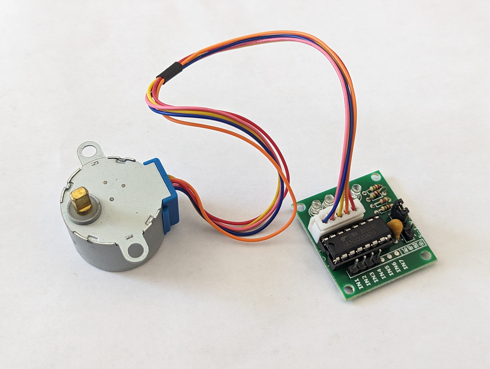

# Table des matières <!-- omit in toc -->
- [Introduction](#introduction)
	- [Utilisation](#utilisation)
- [Fonctionnement d'un moteur pas-à-pas](#fonctionnement-dun-moteur-pas-à-pas)
- [Le moteur pas-à-pas 28BYJ-48](#le-moteur-pas-à-pas-28byj-48)
	- [Le filage](#le-filage)
	- [Rapport de réduction de l'engrenage](#rapport-de-réduction-de-lengrenage)
- [Le module de contrôle ULN2003](#le-module-de-contrôle-uln2003)
- [Branchement](#branchement)
- [Exemple de code avec la librairie `Stepper`](#exemple-de-code-avec-la-librairie-stepper)
- [Exemple de code avec la librairie `AccelStepper`](#exemple-de-code-avec-la-librairie-accelstepper)
	- [Explication du code](#explication-du-code)
- [Exercices](#exercices)
- [Références](#références)


# Introduction
Votre kit contient un moteur pas-à-pas (*stepper mtor*) 28BYJ-48 avec un module monté avec un driver ULN2003.

## Utilisation
On retrouve les moteurs pas-à-pas dans plusieurs applications comme les lecteurs de disques, les disques durs, les imprimantes, les robots, etc.

[](https://www.youtube.com/watch?v=z5v90dUOg4E)

> **Zone le fun :** Jetez un coup d'oeil sur le [site](https://www.thingiverse.com/search?q=uln2003&page=1&type=things&sort=relevant) pour trouver des projets amusants avec le moteur pas-à-pas de votre kit.

# Fonctionnement d'un moteur pas-à-pas
Les moteurs pas-à-pas utilisent une roue dentée et des électroaimants pour faire avancer la roue d'un "pas" à la fois.

Chaque impulsion haute envoyée alimente la bobine, attirant les dents les plus proches de la roue dentée et faisant tourner le moteur par incréments d'angle précis et fixes appelés pas.

Le nombre de pas que le moteur pas-à-pas effectue pour une rotation complète de 360 degrés correspond en réalité au nombre de dents sur la roue dentée.


La manière dont vous impulsez ces bobines détermine le fonctionnement du moteur.
- La séquence des impulsions détermine le sens de rotation du moteur.
- La fréquence des impulsions détermine la vitesse du moteur.
- Le nombre d'impulsions détermine la distance que le moteur parcourra.

En alimentant les bobines dans la séquence correcte, le moteur est mis en rotation.

> **Note :** L'objectif du cours n'étant pas de comprendre le fonctionnement du moteur, nous allons nous concentrer sur la façon de le contrôler. 
> 
> [Cet article](https://lastminuteengineers.com/28byj48-stepper-motor-arduino-tutorial/) explique en détail le fonctionnement du moteur pas-à-pas et comment le contrôler avec un Arduino.

# Le moteur pas-à-pas 28BYJ-48

Le 28BYJ-48 est un moteur pas-à-pas unipolaire à 5 fils qui fonctionne sous 5V. Il est parfait pour les projets qui nécessitent un positionnement précis, comme l'ouverture et la fermeture d'une ventilation.

Étant donné que le moteur n'utilise pas de balais de contact, il a un mouvement relativement précis et est assez fiable.

Malgré sa petite taille, le moteur fournit un couple décent de 34.3 mN.m à une vitesse d'environ 15 RPM. Il offre un bon couple même à l'arrêt et le maintient tant que le moteur reçoit de l'énergie.

Le seul inconvénient est qu'il consomme relativement beaucoup d'énergie, même lorsqu'il est à l'arrêt.

## Le filage

Le moteur pas-à-pas 28BYJ-48 possède cinq fils. Les broches sont les suivantes :


Le 28BYJ-48 a deux bobines, chacune ayant une prise centrale. Ces deux prises centrales sont connectées en interne et sorties comme le 5e fil (fil rouge).

Ensemble, une extrémité de la bobine et la prise centrale forment une phase. Ainsi, le 28BYJ-48 a un total de quatre phases.


Le fil rouge est toujours tiré vers le haut (HIGH), donc lorsque l'autre fil est tiré vers le bas (LOW), la phase est alimentée.

Le moteur pas-à-pas ne tourne que lorsque les phases sont alimentées dans une séquence logique connue sous le nom de séquence de pas.

## Rapport de réduction de l'engrenage

Selon la fiche technique, lorsque le moteur 28BYJ-48 est utilisé en mode pas complet, chaque pas correspond à une rotation de 11,25°. Cela signifie qu'il y a 32 pas par tour (360°/11,25° = 32).


De plus, le moteur dispose d'un ensemble de réduction d'engrenage de 1/64 (en réalité, il s'agit de 1/63,68395, mais 1/64 est une approximation suffisamment précise pour la plupart des applications).

Cela signifie qu'en réalité, il y a 2038 pas (32*63,68395 pas par tour = 2037,8864 environ 2038 pas).

---

# Le module de contrôle ULN2003

Étant donné que le moteur pas-à-pas 28BYJ-48 consomme une quantité importante de puissance, il ne peut pas être contrôlé directement par un microcontrôleur tel que l'Arduino. Pour contrôler le moteur, un circuit intégré de commande tel que l'ULN2003 est nécessaire ; par conséquent, ce moteur est généralement livré avec une carte de commande basée sur l'ULN2003.

L'ULN2003, connu pour sa capacité de courant élevé et sa capacité de tension élevée, fournit un gain de courant plus élevé qu'un simple transistor et permet à une sortie de faible tension et faible courant d'un microcontrôleur de piloter un moteur pas-à-pas de courant élevé.


La carte possède quatre entrées de contrôle et une connexion d'alimentation électrique.

De plus, il y a un connecteur Molex compatible avec celui du moteur, vous permettant de brancher directement le moteur dessus.

La carte comprend quatre LED qui indiquent l'activité sur les quatre lignes d'entrée de contrôle. Elles fournissent une bonne indication visuelle pendant le mouvement par pas.

Il y a un cavalier ON/OFF sur la carte pour désactiver le moteur pas-à-pas si nécessaire.


# Branchement

Connectons le moteur à notre Arduino !

Les connexions sont simples. Commencez par connecter une source d'alimentation externe de 5V au driver ULN2003.

> **Attention :**
> 
> Le moteur pas-à-pas peut être alimenté directement depuis l'Arduino, mais cela n'est pas recommandé car le moteur peut générer du bruit électrique sur ses lignes d'alimentation, ce qui peut endommager l'Arduino.

Connectez les entrées `IN1`, `IN2`, `IN3` et `IN4` de la carte de commande aux broches numériques 8, 9, 10 et 11 de l'Arduino, respectivement. Ensuite, connectez le moteur pas-à-pas au driver ULN2003.

Enfin, assurez-vous que votre circuit et votre Arduino ont une masse commune.

Le diagramme suivant vous montre comment tout connecter.

# Exemple de code avec la librairie `Stepper`

> **Mise en garde :** La **librairie `Stepper` est bloquante**. Cela signifie que le programme ne peut pas faire autre chose tant que le moteur est en mouvement. Si vous avez besoin d'exécuter d'autres tâches pendant le mouvement du moteur, vous devrez utiliser une autre bibliothèque. Je suggère `AccelStepper`.

Pour notre premier exemple, nous utiliserons la bibliothèque `Stepper` Arduino, qui est incluse dans l'IDE Arduino.

La bibliothèque `Stepper` Arduino gère la séquence de pas et vous permet de contrôler un large éventail de moteurs pas-à-pas unipolaires et bipolaires.

Voici un petit programme qui fait tourner lentement le moteur dans une direction, puis rapidement dans la direction opposée.

```cpp
#include <Stepper.h>

// Définir le nombre de pas par tour
const int stepsPerRevolution = 2038;

// Créer une instance de la classe Stepper
// Attention, les broches sont entrées dans la séquene IN1-IN3-IN2-IN4
Stepper myStepper = Stepper(stepsPerRevolution, 8, 10, 9, 11);

void setup() {
    // Rien à faire, la librairie Stepper s'occupe de tout
}

void loop() {
	// Pivoter CW lentement à 5 RPM
	myStepper.setSpeed(5);
	myStepper.step(stepsPerRevolution);
	delay(1000);
	
	// Pivoter CCW rapidement à 10 RPM
	myStepper.setSpeed(10);
	myStepper.step(-stepsPerRevolution);
	delay(1000);
}
```

Remarquez que le moteur continue de tourner dans la même direction jusqu'à ce que la fonction `step()` soit appelée à nouveau. Donc il s'agit d'une configuration persistante.

# Exemple de code avec la librairie `AccelStepper`

La librairie `AccelStepper` est une nette amélioration par rapport à la librairie `Stepper` Arduino. Elle est plus rapide et plus flexible. Surtout, elle n'est pas bloquante, ce qui signifie que vous pouvez exécuter d'autres tâches pendant le mouvement du moteur.

La première étape sera d'installer la librairie `AccelStepper` depuis le gestionnaire de bibliothèques Arduino.

- Recherchez 'AccelStepper' dans le gestionnaire de bibliothèques Arduino. Assurez-vous que ce soit la version réalisée par Mike McCauley.
  
  

Voici un code de base pour faire tourner le moteur dans une direction, puis dans l'autre.

```cpp
#include <AccelStepper.h>

// Définir la constante de pas
#define MotorInterfaceType 4

// Crée une instance
// Broches saisies dans la séquence IN1-IN3-IN2-IN4 pour une séquence de pas appropriée
AccelStepper myStepper(MotorInterfaceType, 8, 10, 9, 11);

void setup() {
// Définir la vitesse maximale, le facteur d'accélération,
// la vitesse initiale et la position cible
	myStepper.setMaxSpeed(1000.0);
	myStepper.setAcceleration(50.0);
	myStepper.setSpeed(200);
	myStepper.moveTo(2038);
}

void loop() {
	// Changer de direction une fois que le moteur atteint la position cible
	if (myStepper.distanceToGo() == 0) 
		myStepper.moveTo(-myStepper.currentPosition());

	// Faire tourner le moteur d'un pas
  // Il faut appeler cette fonction dans le loop sinon le moteur ne tourne pas
	myStepper.run();
}
```

## Explication du code

`MotorInterfaceType` est une constante qui définit le type de moteur que vous utilisez en mode full-step.

```
#define MotorInterfaceType 4
```

Ensuite, on crée une instance de la classe `AccelStepper` en indiquant le type de moteur, les broches IN1-IN3-IN2-IN4.

```cpp
AccelStepper myStepper(MotorInterfaceType, 8, 10, 9, 11);
```

Dans la fonction `setup`, la vitesse maximale autorisée du moteur est réglée sur 1000 (le moteur accélérera jusqu'à cette vitesse lors de l'exécution). Le taux d'accélération/freinage est ensuite défini pour ajouter de l'accélération et du freinage aux mouvements du moteur pas-à-pas.

La vitesse constante est réglée sur 200. Et, comme le 28BYJ-48 effectue 2038 pas par tour, la position cible est également réglée sur 2038.

```cpp
	myStepper.setMaxSpeed(1000.0);
	myStepper.setAcceleration(50.0);
	myStepper.setSpeed(200);
	myStepper.moveTo(2038);
```

Dans la fonction loop, une instruction `if` est utilisée pour déterminer la distance que le moteur doit parcourir (en lisant la propriété distanceToGo) avant d'atteindre la position cible (définie par moveTo). Lorsque la distanceToGo atteint zéro, le moteur est tourné dans la direction opposée en définissant la position moveTo comme étant le négatif de sa position actuelle.

En bas de la boucle, vous remarquerez que la fonction `run()` est appelée. C'est la fonction la plus importante, car le moteur pas-à-pas ne se déplacera pas s'il n'est pas exécuté.

```cpp
void loop() {
	// Changer de direction une fois que le moteur atteint la position cible
	if (myStepper.distanceToGo() == 0) 
		myStepper.moveTo(-myStepper.currentPosition());

	// Faire tourner le moteur d'un pas
  // Il faut appeler cette fonction dans le loop sinon le moteur ne tourne pas
	myStepper.run();
}
```


---

# Exercices
- Explorez les exemples de code fournis avec la librairie `AccelStepper` pour voir comment vous pouvez contrôler le moteur pas-à-pas.
---

# Références
- [Control 28BYJ-48 Stepper Motor with ULN2003 Driver](https://lastminuteengineers.com/28byj48-stepper-motor-arduino-tutorial/)

<!-- ****************************** -->
<!-- Nom du fichier : .\c07\c07d_servo\readme.md -->

# Le servormoteur <!-- omit in toc -->


# Table des matières <!-- omit in toc -->
- [Introduction](#introduction)
- [Utilisation](#utilisation)
- [Votre kit](#votre-kit)
- [Arduino](#arduino)
  - [Branchement](#branchement)
- [Exemple de code](#exemple-de-code)
- [Exercices](#exercices)
- [Références](#références)

---

# Introduction
Un servomoteur est un moteur électrique qui peut maintenir une position précise. Sa position est vérifiée continuellement et corriger en fonction de la position souhaitée.

Un servomoteur est contrôlé par un signal électrique. Il est utilisé pour contrôler des mécanismes tels que des volets, des portes, des ailes d'avion, etc. Les servomoteurs sont généralement contrôlés par un signal **PWM**.

Il contient son propre circuit de commande qui permet de contrôler la vitesse et la position du moteur.

Il y a principalement deux types de servomoteurs. Les servomoteurs à rotation continue et les servomoteurs à rotation limitée. Les servomoteurs à rotation continue peuvent tourner dans un angle de 0 à 360° continuellement. Les servomoteurs à rotation limitée peuvent pivoter entre deux limites prédéfinies.

# Utilisation
On retrouve des servomoteurs dans de nombreux produits. On peut les retrouver dans les télécommandes, les drones, les robots, les voitures, etc.

Par exemple, les conduits de systèmes de chauffage et de climatisation dans les voiture sont contrôlés par des servomoteurs. En effet, ils ouvrent et ferment les conduits en fonction des zones définies par les occupants ou encore par le système automatique.

# Votre kit
Votre kit contient un servomoteur SG90. Il s'agit d'un servomoteur à rotation limitée. Il peut, en théorie, pivoter entre 0 et 180°.


On dit en théorie car il est possible que le servomoteur ne puisse pas atteindre les 180°. Cela dépend de la précision du servomoteur. On suggère de tester les limites du servomoteur avant de l'utiliser. On suggère aussi de ne pas dépasser 170° pour éviter de l'endommager.

Si vous faites forcer le servomoteur à tourner plus que sa limite, il chauffera et peut s'endommager.

---

# Arduino
Comment contrôler un servomoteur avec un Arduino?

Comme indiquer précédemment, un servomoteur est contrôlé par un signal **PWM**. Il faut donc utiliser la fonction `analogWrite()` pour contrôler le servomoteur.

Le servomoteur a 3 fils. Le fil rouge est le fil de puissance. Il doit être branché sur une alimentation de 5V. Le fil brun est le fil de masse (*ground*). Il doit être branché sur la masse de l'Arduino. Le fil orange est le fil de commande. Il doit être branché sur une sortie PWM de l'Arduino.

## Branchement
Voici le branchement typique pour un servomoteur. Remarquez la présence du module de puissance. Il est préférable d'utiliser ce module pour fournir une alimentation de 5V au servomoteur.


# Exemple de code
Voici un exemple de code qui permet de contrôler un servomoteur. Le code permet de faire tourner le servomoteur dans un angle de 0 à 170° et de revenir à 0°.

```cpp
#include <Servo.h>

Servo servo;

void setup() {
  servo.attach(3);
}

void loop() {
  for (int angle = 0; angle <= 170; angle++) {
    servo.write(angle);
    delay(15);
  }
  for (int angle = 170; angle >= 0; angle--) {
    servo.write(angle);
    delay(15);
  }
}
```

Prenez note qu'une fois la position atteinte et qu'il n'y a pas de force qui lui est appliquée, il est préférable d'arrêter d'envoyer des pulsations. Cela permet d'éviter que le servomoteur ne chauffe et ne s'endommage.

Pour se faire on peut utiliser la fonction `servo.detach()`.

```cpp
#include <Servo.h>

Servo servo;

void setup() {
  servo.attach(3);
}

void loop() {
  servo.attach(3);
  for (int angle = 0; angle <= 170; angle++) {
    servo.write(angle);
    delay(15);
  }
  servo.detach();
  delay(1000);

  servo.attach(3);
  for (int angle = 170; angle >= 0; angle--) {
    servo.write(angle);
    delay(15);
  }
  servo.detach();
  delay(1000);
}
```

---

# Exercices
1. Faites tourner le servomoteur dans un angle de 0 à 170° et de revenir à 0°. Utilisez la fonction `servo.detach()` pour arrêter d'envoyer des pulsations.
2. À l'aide de la communication série, envoyez l'angle à laquelle le servomoteur doit tourner. Utilisez la fonction `servo.detach()` pour arrêter d'envoyer des pulsations lorsque l'angle est atteint.

---

# Références

<!-- ****************************** -->
<!-- Nom du fichier : .\c08\readme.md -->

# Cours 08


## Contenu
- [Communication série : lecture](./c08a_serial_read/readme.md)
- [Initiation à la programmation orientée objet](./c08b_poo_base/readme.md)
- [Unité de puissance](./c08c_psu/readme.md)

<!-- ****************************** -->
<!-- Nom du fichier : .\c08\c08a_serial_read\readme.md -->

# Lecture de données à partir du port série <!-- omit in toc -->

# Table des matières <!-- omit in toc -->
- [Introduction](#introduction)
- [Arduino Mega : Spécificités](#arduino-mega--spécificités)
- [SoftwareSerial](#softwareserial)
- [Fonctions importantes de base](#fonctions-importantes-de-base)
- [Utilisation](#utilisation)
- [Exemple de contrôle via le PC](#exemple-de-contrôle-via-le-pc)
  - [Explication du code](#explication-du-code)
- [Exemple de contrôle via un appareil sur Série 3](#exemple-de-contrôle-via-un-appareil-sur-série-3)
- [Convertir un nombre en entier](#convertir-un-nombre-en-entier)
- [Fonction `serialEvent()`](#fonction-serialevent)
  - [Explication du code](#explication-du-code-1)
- [Fonction `serial.readStringUntil()`](#fonction-serialreadstringuntil)
  - [Explication du code](#explication-du-code-2)
- [Exercices](#exercices)
- [Références](#références)


# Introduction

Dans cet article, nous allons apprendre comment utiliser le port série d'un Arduino pour lire des données provenant du port série. Vous avez déjà appris à utiliser le port série pour envoyer des données de l'Arduino à l'ordinateur, nous allons donc nous concentrer sur la lecture de données dans cet article.

# Arduino Mega : Spécificités
Le Arduino Mega dispose de 4 ports série. Le port série 0 est utilisé pour la communication avec l'ordinateur. Les ports série 1, 2 et 3 sont utilisés pour la communication avec des périphériques externes.

Voici un tableau avec les broches utilisées pour chaque port série :

| Port Série | Broche TX | Broche RX |
|------------|----------|----------|
| Serial     | 1        | 0        |
| Serial1    | 18       | 19       |
| Serial2    | 16       | 17       |
| Serial3    | 14       | 15       |

> **Note** : On ne branche généralement rien sur les broches TX et RX du port série 0 car elles sont utilisées pour la communication avec l'ordinateur. Si vous branchez quelque chose sur ces broches, vous ne pourrez probablement plus téléverser de programme sur l'Arduino Mega.

# SoftwareSerial
Si vous avez un Arduino qui n'a plus de port série natif disponible, vous pouvez utiliser la bibliothèque `SoftwareSerial` pour utiliser les broches digitales de l'Arduino comme port série. Cela permet d'utiliser plusieurs ports série sur un Arduino. Cependant, il faut noter que `SoftwareSerial` n'est pas aussi rapide que les ports série natifs de l'Arduino.

Cette bibliothèque est souvent utilisée avec les cartes Arduino Uno, Nano, etc. qui n'ont qu'un seul port série natif.

# Fonctions importantes de base
Les fonctions importantes pour la lecture de données à partir du port série sont :

- `Serial.begin()` : Initialise le port série.
- `Serial.available()` : Retourne le nombre de caractères disponibles dans le buffer de réception.
- `Serial.read()` : Lit un caractère du buffer de réception.

# Utilisation

Pour savoir si des données sont disponibles dans le tampon (*buffer*) de réception, on utilise la fonction `Serial.available()`. Cette fonction retourne le nombre d'octet disponibles à la lecture dans le buffer de réception. Si le nombre d'octet est supérieur à 0, alors on peut lire le caractère avec la fonction `Serial.read()`.

Il faut toujours regarder si des données sont disponibles dans le buffer de réception avant de lire le caractère. Si vous lisez un caractère alors qu'aucune donnée n'est disponible, vous risquez de lire un caractère aléatoire.

# Exemple de contrôle via le PC

Voici un exemple de code qui allume et éteint la LED_BUILTIN de l'Arduino Mega après avoir reçu une commande via le port série :

```cpp
void setup() {
  Serial.begin(9600);
  pinMode(LED_BUILTIN, OUTPUT);
}

void loop() {
  if (Serial.available() > 0) {
    int command = Serial.read();

    switch (command) {
      case '1':
        cmdAllumer();
        break;
      case '0':
        cmdEteindre();
        break;
      default:
        afficherErreur();
    }
  }
}

void cmdAllumer() {
  digitalWrite(LED_BUILTIN, HIGH);
  Serial.println("LED allumée");
}

void cmdEteindre() {
  digitalWrite(LED_BUILTIN, LOW);
  Serial.println("LED éteinte");
}

void afficherErreur() {
  Serial.println("Commande invalide");
}

```

## Explication du code
Dans ce code, nous avons tout d'abord initialisé le port série avec une vitesse de transmission de 9600 bauds et la broche LED_BUILTIN comme une sortie numérique dans la fonction "setup()".

Dans la boucle `loop()`, nous avons utilisé la fonction `Serial.available()` pour vérifier si des données ont été reçues via le port série. **Si des données sont disponibles**, nous lisons la commande envoyée en utilisant la fonction `Serial.read()`. Si la commande est égale à '1', nous exécutons la fonction `cmdAllumer()`, si la commande est égale à '0', nous exécutons la fonction `cmdEteindre()` et si la commande est différente de '1' ou '0', nous exécutons la fonction `afficherErreur()`.

En somme, ce code vous montre comment utiliser le port série pour recevoir des commandes et contrôler la `LED_BUILTIN` en fonction de ces commandes. Vous pouvez adapter ce code pour contrôler d'autres périphériques ou effectuer d'autres actions en fonction des commandes que vous recevez via le port série.

---

# Exemple de contrôle via un appareil sur Série 3

Voici un exemple modifié du précédent qui permet de contrôler la LED_BUILTIN de l'Arduino Mega via un appareil sur le port série 3 :

```cpp
void setup() {
  Serial.begin(9600);
  Serial3.begin(9600);
  pinMode(LED_BUILTIN, OUTPUT);
}

void loop() {
  if (Serial3.available() > 0) {
    int command = Serial3.read();

    switch (command) {
      case '1':
        cmdAllumer();
        break;
      case '0':
        cmdEteindre();
        break;
      default:
        afficherErreur();
    }
  }
}

void cmdAllumer() {
  digitalWrite(LED_BUILTIN, HIGH);
  Serial.println("LED allumée");
}

void cmdEteindre() {
  digitalWrite(LED_BUILTIN, LOW);
  Serial.println("LED éteinte");
}

void afficherErreur() {
  Serial.println("Commande invalide");
}

```

[](https://www.youtube.com/watch?v=Zc8daVkprjE)

L'appareil connecté pourrait être un module Bluetooth, un autre Arduino, un Raspberry Pi, etc.

# Convertir un nombre en entier
Pour convertir un nombre en entier, on utilise la fonction `Serial.parseInt()`. Par défaut, cette fonction retourne le premier nombre entier trouvé dans le buffer de réception.

Voici un exemple de code qui utilise `parseInt` pour lire un nombre entier. Ensuite, on utilise ce nombre pour ajuster la luminosité de la LED_BUILTIN de l'Arduino Mega :

```cpp
void setup() {
  Serial.begin(9600);
  pinMode(LED_BUILTIN, OUTPUT);
}

void loop() {
  if (Serial.available() > 0) {
    int number = Serial.parseInt();
    analogWrite(LED_BUILTIN, number);
  }
}

```

Notez qu'il y a aussi la fonction `Serial.parseFloat()` qui permet de lire un nombre à virgule flottante. Le format de la valeur envoyée du PC doit être `123.45` par exemple.

# Fonction `serialEvent()`

Vous remarquez dans les exemples que nous avons utilisé la fonction `Serial.available()` pour vérifier si des données sont disponibles dans le buffer de réception. Cependant, il existe une autre fonction qui permet de faire la même chose : `serialEvent()`. Cette **fonction événementielle** est appelée automatiquement lorsque des données sont disponibles dans le buffer de réception. Cela permet d'éviter d'avoir à vérifier si des données sont disponibles dans le buffer de réception à chaque fois que l'on veut lire des données.

Pour le Mega, les fonctions `serialEvent` disponibles sont `serialEvent1`, `serialEvent2` et `serialEvent3`. Chacune étant associée à son port série.

Voici un exemple de code qui utilise la fonction `serialEvent` pour lire des données à partir du port série :

```cpp

String inputString = "";      // une chaîne pour contenir les données entrantes
bool stringCompleteFlag = false;  // indique si la chaîne est complète

void setup() {
  // initialiser la communication série :
  Serial.begin(9600);

  // réserver 200 octets pour inputString :
  inputString.reserve(200);
}

void loop() {
  // imprimer la chaîne lorsqu'un saut de ligne arrive :
  if (stringCompleteFlag) {
    Serial.println(inputString);
    // effacer la chaîne :
    inputString = "";
    stringCompleteFlag = false;
  }
}

/*
  SerialEvent se produit chaque fois qu'une nouvelle donnée arrive sur le RX série matériel. Cette
  routine est exécutée entre chaque exécution de loop(), donc utiliser delay dans loop peut
  retarder la réponse. Plusieurs octets de données peuvent être disponibles.
*/
void serialEvent() {
  while (Serial.available()) {
    // obtenir le nouveau byte :
    char inChar = (char)Serial.read();
    // l'ajouter à inputString :
    inputString += inChar;
    // si le caractère entrant est un saut de ligne, définir un drapeau pour que la boucle principale puisse
    // faire quelque chose à ce sujet :
    if (inChar == '\n') {
      stringCompleteFlag = true;
    }
  }
}

```

## Explication du code
Dans ce code, nous avons utilisé la fonction `serialEvent` pour lire des données à partir du port série. La fonction `serialEvent` est appelée automatiquement chaque fois qu'une nouvelle donnée arrive sur le port série. Dans cette fonction, nous avons utilisé une boucle `while` pour lire chaque caractère entrant et l'ajouter à la chaîne `inputString`. Lorsque nous rencontrons un saut de ligne, nous définissons un drapeau `stringCompleteFlag` pour indiquer que la chaîne est complète et prête à être traitée dans la boucle principale.

En somme, la fonction `serialEvent` est une alternative à la fonction `Serial.available()` pour lire des données à partir du port série. Vous pouvez utiliser l'une ou l'autre en fonction de vos besoins et de votre style de programmation.

> **Concept du drapeau (*flag*)**
> 
> 
> 
> Un drapeau est une variable qui est utilisée pour indiquer si un événement s'est produit ou non. Dans ce cas, nous avons utilisé un drapeau `stringCompleteFlag` pour indiquer si la chaîne est complète et prête à être traitée dans la boucle principale.
>  
> Lorsque le programme a terminé de traiter la chaîne, il réinitialise le drapeau pour indiquer que la chaîne n'est plus complète.


Voici un exemple précédent modifié pour utiliser la fonction `serialEvent` :

```cpp
void setup() {
  Serial.begin(9600);
  Serial3.begin(9600);
  pinMode(LED_BUILTIN, OUTPUT);
}

void loop() {
  // rien à faire ici
}

void serialEvent3() {
  if (Serial3.available() > 0) {
    int command = Serial3.read();

    switch (command) {
      case '1':
        cmdAllumer();
        break;
      case '0':
        cmdEteindre();
        break;
      default:
        afficherErreur();
    }
  }
}

void cmdAllumer() {
  digitalWrite(LED_BUILTIN, HIGH);
  Serial.println("LED allumée");
}

void cmdEteindre() {
  digitalWrite(LED_BUILTIN, LOW);
  Serial.println("LED éteinte");
}

void afficherErreur() {
  Serial.println("Commande invalide");
}

```

---

# Fonction `serial.readStringUntil()`
Supposons que vous voulez lire une commande avec des paramètres envoyée via le port série. Par exemple, vous désirez envoyer des commandes dans un format comme `pin:13,1` pour allumer la LED connectée à la broche 13 ou encore `pin:A4,read` pour lire la valeur à la broche `A4`. Vous pouvez utiliser la fonction `serial.readStringUntil()` pour lire la commande complète et ensuite la traiter.

Voici un exemple complexe de code qui utilise `serial.readStringUntil()` avec `serialEvent` pour lire des commandes avec des paramètres envoyées via le port série :

```cpp

#define DEBUG_MODE 1

String cmd = "";
bool cmdReceived = false;

void setup() {
  // initialiser la communication série :
  Serial.begin(9600);
  pinMode(LED_BUILTIN, OUTPUT);
}

void loop() {
  if (cmdReceived) {
    traiterCommande(cmd);
    cmdReceived = false;
  }
}

void serialEvent() {
  if (Serial.available()) {
    // Lire la chaîne jusqu'à ce qu'un caractère de nouvelle ligne ('\n') soit rencontré
    cmd = Serial.readStringUntil('\n');
    // Si cmd n'est pas vide, cela signifie que nous avons reçu une commande terminée par '\n'
    if (cmd.length() > 0) {
      cmdReceived = true;
    }
  }
}

// Format de la commande : pin:numéro,commande
// Exemple : pin:13,1
// Exemple : pin:A4,read
void traiterCommande(String commande) {
    if (!commande.startsWith("pin:")) {
        Serial.println("Commande invalide ou non implantée");
        return;
    }

    String pin, action;
    decomposerCommande(commande, pin, action);
    executerAction(pin, action);
}

// Sépare la commande en numéro de broche et action
void decomposerCommande(const String& commande, String& pin, String& action) {
    int pos = commande.indexOf(',');
    pin = commande.substring(4, pos);
    action = commande.substring(pos + 1);
}

// Traiter la lecture ou l'écriture sur une broche
void executerAction(const String& pinRcv, const String& action) {
    int pinNumber = convertirPin(pinRcv);
    if (pinNumber == -1) {
        Serial.println("Broche invalide");
        return;
    }

    if (action.startsWith("r") || action.startsWith("R")) {
        lirePin(pinNumber);
    } else {
        ecrireSurPin(pinNumber, action);
    }
}

// Convertit une désignation de broche en numéro de broche utilisable
int convertirPin(const String& pinRcv) {
    // Initialisation de pinNumber à -1, indiquant une valeur non valide ou non supportée
    int pinNumber = -1;

    // Vérifier si la broche reçue est numérique
    if (isDigit(pinRcv[0])) {
        pinNumber = pinRcv.toInt();
    } 
    // Gérer les cas où la broche est analogique, commençant par 'A' ou 'a'
    else if (pinRcv[0] == 'A' || pinRcv[0] == 'a') {
        if (pinRcv.length() > 1 && isDigit(pinRcv[1])) {
            int analogPin = pinRcv.substring(1).toInt();
            pinNumber = analogPinToDigitalPin(analogPin);
        } else {
            // Si le format de la broche analogique est incorrect (par exemple, "Aa"), indiquer une erreur
            Serial.println("Format de broche analogique invalide");
            return -1;
        }
    } 
    // Si le format de broche ne correspond à aucun format valide, afficher un message d'erreur
    else {
        Serial.println("Format de broche invalide");
        return -1;
    }

    // Retourner le numéro de broche converti ou -1 si non valide
    return pinNumber;
}


// Lit une broche et envoie sa valeur via Serial
void lirePin(int pinNumber) {
    int value = digitalRead(pinNumber);
    Serial.println(value);
}

// Écrit sur une broche numérique ou analogique selon la commande
void ecrireSurPin(int pinNumber, const String& cmd) {
    if (isDigit(cmd[0])) {
        int value = cmd.toInt();
        if (value > 1) { // Considérant tout ce qui est >1 comme une commande analogique
            analogWrite(pinNumber, value);
        } else {
            digitalWrite(pinNumber, value);
        }
    } else {
        Serial.println("Valeur invalide");
    }
}

// Fonction pour convertir un numéro de broche analogique en broche numérique
// ATTENTION!! Uniquement pour les cartes Arduino Mega ou Uno
int analogPinToDigitalPin(int analogPin) {
#if ((defined(__AVR_ATmega2560__) || defined(__AVR_ATmega2561__)))
  if (analogPin >= 0 && analogPin <= 15) {
    return analogPin + 54;
  }
#endif

#if defined(__AVR_ATmega328P__)
  if (analogPin >= 0 && analogPin <= 5) {
    return analogPin + 14;
  }
#endif

  Serial.println(F("Carte ou broche non supportée"));

  return -1;
}

```

## Explication du code
Dans ce code qui peut sembler relativement complexe est plus simple qu'on peut y penser. En effet, j'ai subdivisé le code en plusieurs fonctions pour le rendre plus lisible et plus facile à comprendre. Cela permet de mieux organiser le code et de le rendre plus modulaire. Cela permet aussi de réutiliser certaines parties du code dans d'autres projets.


> **Note** : Il y a aussi la fonction `Serial.readString()` qui lit une chaîne jusqu'à ce qu'un caractère de nouvelle ligne soit rencontré. Cependànt, cette commande ralentie la fonction attend un certain temps pour lire la chaîne. `Serial.readStringUntil()` est plus rapide car elle lit la chaîne jusqu'à ce qu'un caractère spécifié soit rencontré.


---

# Exercices
1. Essayez le code de l'exemple de la section "Fonction `serial.readStringUntil()`" pour voir comment il fonctionne.
2. Avec votre plaquette d'expérimentation, s'il y a un composant simple d'installer, essayez d'interagir avec lui via le port série. Par exemple, vous pouvez allumer et éteindre une LED, lire la valeur d'un capteur, etc.

---

# Références
- [Serial](https://www.arduino.cc/reference/en/language/functions/communication/serial/)

<!-- ****************************** -->
<!-- Nom du fichier : .\c08\c08b_poo_base\readme.md -->

# La programmation orientée objet avec Arduino <!-- omit in toc -->


# Table des matières <!-- omit in toc -->
- [Introduction](#introduction)
- [Concepts de base](#concepts-de-base)
  - [Concept de la classe](#concept-de-la-classe)
  - [Concept de l'objet](#concept-de-lobjet)
- [Dans Arduino](#dans-arduino)
- [Création d'une classe](#création-dune-classe)
  - [Fichier .h](#fichier-h)
  - [Les accesseurs public et private](#les-accesseurs-public-et-private)
  - [Fichier .cpp](#fichier-cpp)
- [Exemple VerrouMotorise](#exemple-verroumotorise)
- [Exercices](#exercices)


# Introduction
La programmation orientée objet est une méthode de programmation populaire qui permet d'organiser le code autour de concepts appelés "objets". Ceux-ci ont des propriétés et des comportements.

# Concepts de base
## Concept de la classe
**Une classe est un modèle pour créer des objets**. Il s'agit d'un concept. Par exemple, si l'on parle d'un chien. À quoi pensez-vous?

Vous pouvez imaginer un chien noir qui a une certaine grandeur avec un pelage court. Il peut courrir, aboyer, marcher, etc.

Une classe décrit les propriétés et les comportements d'un objet.

Ainsi dans le cas d'un chien, nous avons les propriétés suivantes couleur, taille, pelage, etc. et les comportements suivants courrir, aboyer, marcher, etc.

On peut créer autant de concept que nécessaire pour un projet.

## Concept de l'objet
**Un objet est une instance d'une classe**. C'est-à-dire que c'est une représentation physique de la classe. Reprenons l'exemple du chien.

Si on dit "Idéfix" ou "Milou". On ne parle plus du concept d'un chien, mais d'une instance d'un chien c'est-à-dire que l'on parle d'un chien en particulier.


On pourrait dire que "Idéfix" est un chien blanc, de taille petite, avec un pelage court. Il peut courrir, aboyer, marcher, etc.

# Dans Arduino
Dans un projet électronique, nous avons des objets physiques. Par exemple, un bouton, un capteur, un moteur, etc. Nous pouvons définir des concepts plus haut-niveau par exemple un verrou, un ouvre-porte, etc. et créer des classes pour représenter ces objets.

L'avantage de créer des classes, c'est que cela rend le code plus facile à lire et à comprendre. De plus, cela permet de réutiliser le code pour d'autres projets.

Voici un diagramme simple pour représenter les classes typiques que l'on pourrait retrouver dans un projet de maison intelligente.


# Création d'une classe
Dans Arduino, nous pouvons créer des classes pour représenter des objets physiques.

Plusieurs langages de programmation modernes n'utilisent qu'un seul fichier pour définir une classe comme le C#. Cependant, Arduino utilise deux fichiers pour définir une classe. Un fichier `.cpp` pour la définition de la classe et un fichier `.h` pour la déclaration de la classe.

Il faut que le fichier `.h` soit inclus dans le fichier `.cpp` pour que la classe soit définie.

## Fichier .h
Le fichier `.h` contient la déclaration de la classe. C'est-à-dire que c'est ici que nous définissons les propriétés et les méthodes de la classe.

La syntaxe pour créer une classe est la suivante:

```cpp

class NomDeLaClasse {
  // Déclaration des attributs et méthodes
};

```

> **Convention de nommage :**
> En C++, les noms de classes commencent par une lettre majuscule. Par exemple, `Verrou`, `Chien`, `OuvrePorte`, etc.
> 
> Si la classe a plusieurs mots, on utilise la convention *upper CamelCase* pour nommer la classe. C'est-à-dire les autres mots commencent par une lettre majuscule. Par exemple, `VerrouMotorise`, `OuvrePorteAutomatique`, etc.	

## Les accesseurs public et private
Dans une classe, nous pouvons définir des attributs et déclarer des méthodes qui sont accessibles depuis l'extérieur de la classe et d'autres qui ne le sont pas. Cela permet de protéger les attributs et les méthodes qui ne doivent pas être modifiés ou appelés depuis l'extérieur de la classe.

Dans le cadre du cours, nous nous intéresserons uniquement aux attributs et méthodes publics ou privés.

Le mot-clé `public` permet de définir les attributs et méthodes qui sont accessibles depuis l'extérieur de la classe.

Le mot-clé `private` permet de définir les attributs et méthodes qui ne sont pas accessibles depuis l'extérieur de la classe.

En C++, on fait des blocs d'attributs et de méthodes publics et privés. 

On démarre un bloc public avec le mot-clé `public` et on termine le bloc avec le mot-clé `private`.

```cpp
class NomDeLaClasse {
  public:
    // Déclaration des attributs et méthodes publics
    int attributPublic; // exemple
    void methodePublique(); // exemple
  private:
    // Déclaration des attributs et méthodes privés
    int attributPrive; // exemple
    void methodePrivee(); // exemple
};
```

## Fichier .cpp

Le fichier `.cpp` est un fichier source C++ qui contient les définitions des méthodes d'une classe. Dans le cadre de la programmation orientée objet, les fichiers `.cpp` sont utilisés pour séparer la déclaration de la classe (dans un fichier `.h`) de sa définition.

Dans le fichier `.cpp`, chaque méthode de la classe est définie avec son corps de fonction correspondant. Cela inclut toutes les instructions nécessaires pour implémenter la fonctionnalité de la méthode, y compris l'accès aux variables et aux fonctions de la classe.

La syntaxe pour définir une méthode est la suivante:

```cpp
typeDeRetour NomDeLaClasse::NomDeLaMethode() {
  // Instructions
}
```


# Exemple VerrouMotorise
Dans cette partie, nous allons explorer la programmation orientée objet en simulant un verrou motorisé à l'aide un servo-moteur.

Pour ce projet, nous utiliserons une carte Arduino, un servo-moteur, une *breadboard* et des fils de raccordement.

Le servo-moteur est un moteur qui peut être contrôlé avec précision pour se déplacer dans une plage de mouvement spécifiée. Nous allons utiliser un servo-moteur pour simuler un verrou motorisé, qui peut être activé ou désactivé en tournant le servo-moteur dans une direction ou l'autre. Pour plus de détail sur le servo-moteur, consultez [cet article](../../c07/c07d_servo/C07d_servo.md).

Nous allons utiliser la programmation orientée objet pour créer une classe `Verrou` qui représente notre verrou motorisé. Cette classe aura des méthodes pour activer ou désactiver le verrou, ainsi qu'un attribut d'état pour suivre l'état actuel du verrou. Nous utiliserons également une machine à états pour gérer les transitions entre les différents états du verrou.

Maintenant que nous avons une vue d'ensemble de notre projet, passons à la création de la classe Verrou.

```cpp
// Fichier : Verrou.h
#pragma once // Cette ligne permet d'éviter les problèmes de compilation
#include <Servo.h>

// Déclaration de l'énumération pour les états du verrou
enum EtatVerrou {
  FERME,
  OUVERT
};

class Verrou {

  public:
    // Constructeur
    Verrou(int pin, int angleOuvert, int angleFerme);
    
    void activer(); 
    void desactiver();
    
    // On peut aussi déclarer des méthodes inline
    // "inline" veut dire que l'on peut définir la méthode dans le fichier .h
    EtatVerrou getEtat() {
      return etat;
    }

  private:
    Servo servo;
    int angleOuvert;
    int angleFerme;
    int position;
    EtatVerrou etat;
    
};
```

Voici le code pour le fichier `.cpp` correspondant:

```cpp
// Fichier : Verrou.cpp
#include "Verrou.h"

Verrou::Verrou(int pin, int angleOuvert, int angleFerme) {
  servo.attach(pin);
  angleOuvert = angleOuvert;
  angleFerme = angleFerme;
  position = angleFerme;
  etat = FERME;
  servo.write(position);
}

Verrou::activer() {
  if (etat == FERME) {
    position = angleOuvert;
    etat = OUVERT;
    servo.write(position);
  }
}

Verrou::desactiver() {
  if (etat == OUVERT) {
    position = angleFerme;
    etat = FERME;
    servo.write(position);
  }
}
```

Dans le fichier du programme principal, nous allons créer une instance de la classe `Verrou` et l'utiliser pour activer et désactiver le verrou.

```cpp
#include <Arduino.h>
#include "Verrou.h"

// Création d'une instance de la classe
Verrou verrou(9, 0, 180);

void setup() {
  Serial.begin(9600);
}

void loop() {
  Serial.println("Verrou actif");
  verrou.activer();
  delay(2000);
  Serial.println("Verrou inactif");
  verrou.desactiver();
  delay(2000);
}
```

# Exercices
1. Reproduisez l'exemple du verrou motorisé à l'aide d'un servo-moteur. Utilisez la programmation orientée objet pour créer une classe `Verrou` qui représente votre verrou motorisé. Cette classe aura des méthodes pour activer ou désactiver le verrou, ainsi qu'un attribut d'état pour suivre l'état actuel du verrou. Utilisez une machine à états pour gérer les transitions entre les différents états du verrou.

<!-- ****************************** -->
<!-- Nom du fichier : .\c08\c08c_psu\readme.md -->

# L'unité de puissance <!-- omit in toc -->


# Table des matières <!-- omit in toc -->
- [Introduction](#introduction)
- [Fonctionnalités](#fonctionnalités)
- [Utilisation](#utilisation)
  - [Branchement](#branchement)
  - [Configuration des cavaliers](#configuration-des-cavaliers)
  - [Branchement à l'Arduino](#branchement-à-larduino)
- [Références](#références)
 
# Introduction
Dans votre kit, vous avez un module de puissance qui vous permet de brancher des appareils qui consomment plus de courant que votre Arduino. Ce module est composé d'un régulateur de tension. Le régulateur de tension permet de convertir une tension d'entrée de 5V à 12V en une tension de sortie de 3.3V ou 5V. Dans ce chapitre, nous allons voir comment utiliser ce module pour commander un appareil qui consomme plus de courant que votre Arduino.

# Fonctionnalités
Le module est compatible avec les platines d'expérimentation (*breadboard*). Il permet d'avoir deux tensions de sortie différentes pour chacune des rails de tension.

En entrée, le module de puissance accepte une tension de 6.5V à 12V. Il a un port DC jack de 5.5mm x 2.1mm et un port USB. Le port USB est toujours de 5V.

En sortie, le module de puissance peut fournir une tension de 3.3V ou 5V. Le module de puissance peut fournir jusqu'à 700mA de courant. Le module de puissance est alimenté par le port USB de votre Arduino.

Le module a aussi un bouton de mise sous tension. Ce bouton permet de mettre sous tension le module de puissance.

# Utilisation
## Branchement
Il suffit d'installer le module de puissance à l'extrémité de votre *breadboard*.

**Attention!** Il y a deux rails de tension sur le *breadboard*. Il faut le brancher sur le bon côté. Il faut aligner la polarité du module avec la polarité des rails *breadboard*.


Ensuite, on peut l'alimenter avec le port USB de votre Arduino ou encore un DC jack de 5.5mm x 2.1mm. Dans votre kit, vous avez un connecteur pour batterie de 9V. Vous pouvez l'utiliser pour alimenter le module de puissance.

> **Note :** Vous pouvez aussi utiliser un adaptateur secteur qui fournit une tension entre 5V et 12V pour alimenter le module de puissance. Référez-vous à la fiche signalétique de l'adaptateur pour connaître la tension de sortie de celui-ci. (Voir le [cours C03A](/c03/C03a_branchement_base.md) pour plus de détail)
> 
> **Suggestion :** Même s'il est possible d'alimenter le module avec une tension de 12V, je vous suggère d'utiliser une tension plus faible. Il y a des cas reportés où l'utilisation d'une tension de 12V a causé des dommages au module de puissance dûs à des défauts de conception.

## Configuration des cavaliers
Dans le cadre du cours, nous allons principalement utiliser des composants fonctionnant à 5V. Il faut donc configurer le cavalier du module de puissance pour avoir une tension de sortie de 5V.


## Branchement à l'Arduino
Si l'Arduino a sa propre alimentation, il suffit de brancher le ground de l'Arduino au ground du module de puissance.

Si l'on désire alimenté l'Arduino avec le module de puissance, il faut brancher le ground de l'Arduino au ground du module de puissance et le $V_{in}$ de l'Arduino au 5V du module de puissance.

**Attention!** Il ne faut pas se tromper de polarité, car on peut griller l'Arduino!

# Références
- [Breadboard Power Supply Module](https://components101.com/modules/5v-mb102-breadboard-power-supply-module)
- [Powering alternatives for Arduino Boards](https://docs.arduino.cc/learn/electronics/power-pins)

<!-- ****************************** -->
<!-- Nom du fichier : .\c09\readme.md -->

# Cours 09

- [Le moteur DC et le L293D](./c09a_moteur_dc/readme.md)
- [Retour sur la machine à états](./c09b_fsm_revisited/readme.md)

<!-- ****************************** -->
<!-- Nom du fichier : .\c09\c09a_moteur_dc\readme.md -->

# Moteur DC et contrôleur L293D <!-- omit in toc -->

# Table des matières <!-- omit in toc -->
- [Introduction](#introduction)
- [Le moteur DC](#le-moteur-dc)
- [Le contrôleur de moteur L293D](#le-contrôleur-de-moteur-l293d)
  - [Premièrement, qu'est-ce qu'un pont en H?](#premièrement-quest-ce-quun-pont-en-h)
  - [Le contrôleur de moteur L293D](#le-contrôleur-de-moteur-l293d-1)
  - [Tableau logique de contrôle du moteur DC avec le L293D](#tableau-logique-de-contrôle-du-moteur-dc-avec-le-l293d)
  - [Exemple de code](#exemple-de-code)
  - [Important](#important)
- [Exercices](#exercices)
- [Références](#références)

# Introduction
Dans cette leçon, nous allons voir comment contrôler un moteur DC avec un contrôleur de moteur de type "pont en H".

Votre kit Arduino contient un contrôleur de moteur L293D ainsi qu'un moteur DC.

 

---

# Le moteur DC
Le moteur DC (Direct Current) est un moteur électrique qui fonctionne avec un courant continu. Il est composé d'un rotor et d'un stator. Le rotor est la partie mobile du moteur et le stator est la partie fixe. Le moteur DC est utilisé dans de nombreux appareils électriques tels que les ventilateurs, les jouets, les robots, les voitures, etc.

Dans votre kit, il s'agit d'un moteur DC 130. Il est petit, léger et peu coûteux. Il est parfait pour les débutants.


Le moteur DC 130 a deux fils : un fil rouge et un fil noir. Le fil rouge est le fil positif et le fil noir est le fil négatif.

On peut inverser le sens de rotation du moteur en inversant les fils de branchement.

---

# Le contrôleur de moteur L293D
Le contrôleur de moteur L293D est un circuit intégré qui permet de contrôler un moteur DC. Il est composé de deux ponts en H. Chaque pont en H est composé de quatre transistors. Le L293D peut contrôler deux moteurs DC ou un moteur pas à pas.

## Premièrement, qu'est-ce qu'un pont en H?
Un pont en H est un circuit électronique qui permet de contrôler la direction du courant électrique. Il est composé de quatre transistors. Deux transistors sont utilisés pour contrôler le courant dans un sens et les deux autres transistors sont utilisés pour contrôler le courant dans l'autre sens.


Ainsi selon ce schéma, si l'on met du courant sur `S1` et `S4`, le moteur tournera dans un sens. Si l'on met du courant sur `S3` et `S2`, le moteur tournera dans l'autre sens.

> **Note:**<br/>
> Les symboles avec une flèche représente des transistors.
> 
> 
>
> Les transistors peuvent être utilisés, entre autres, pour contrôler le courant électrique. Ils peuvent être utilisés pour fermer ou ouvrir un circuit électrique **comme un interrupteur**. Ils sont contrôlés par un signal électrique envoyé sur leur base. Lorsque le signal est présent, le transistor est ouvert et le courant peut circuler. Lorsque le signal est absent, le transistor est fermé et le courant ne peut pas circuler. 
> 
> Dans le cadre du cours, nous n'irons pas plus en détail sur les transistors. Nous nous contenterons de les utiliser comme des interrupteurs. 


Voici une animation montrant le fonctionnement d'un pont en H.


## Le contrôleur de moteur L293D
Maintenant que l'on sait en quoi consiste un pont en H, on peut comprendre comment fonctionne le contrôleur de moteur L293D.


Le L293D est composé de deux ponts en H. Chaque pont en H peut contrôler un moteur DC. Le L293D peut contrôler deux moteurs DC.

Le L293D a 16 broches. Voici le diagramme de brochage du L293D.


- `VCC` : Alimentation du circuit intégré. On branche le +5V de l'Arduino sur cette broche.
- `Ground` : Il y a 4 broches de `Ground`, car les moteurs nécessitent beaucoup de courant ce qui dégage beaucoup de chaleur. Il est donc nécessaire de relier ces broches à la masse pour dissiper celle-ci.
- `Enable 1, 2` : Permet d'activer ou de désactiver le pont en H. Si on met un signal HIGH sur cette broche, le pont en H est activé. Si on met un signal LOW, le pont en H est désactivé.
  - `Enable 3, 4` : Même chose que `Enable 1, 2` mais pour le deuxième pont en H.
- `Input 1` : Permet de contrôler le sens de rotation du moteur 1.
- `Input 2` : Permet de contrôler le sens de rotation du moteur 1.
  - `Input 3, 4` : Même chose que `Input 1, 2` mais pour le moteur 2.
- `Output 1, 2` : Sortie du pont en H pour le moteur 1.
  - `Output 3, 4` : Sortie du pont en H pour le moteur 2.

> **Note:**<br/>
> Remarquez sur le L293D, il y a une encoche sur le boîtier. Cette encoche indique le sens de la broche 1. C'est-à-dire que la broche 1 est la broche la plus à gauche lorsque l'encoche est en haut.
> 
> Il s'agit d'une convention pour les circuits intégrés. La broche 1 est toujours la broche la plus à gauche lorsque l'encoche est en haut.

Voici un diagramme de branchement pour contrôler un moteur DC avec le L293D et un Arduino Mega.


---

## Tableau logique de contrôle du moteur DC avec le L293D

Voici un tableau logique pour contrôler un moteur DC avec le L293D.

| `Input 1` | `Input 2` | Sens de rotation |
|-----------|-----------|------------------|
| LOW       | LOW       | Arrêt            |
| HIGH      | LOW       | Direction 1      |
| LOW       | HIGH      | Direction 2      |
| HIGH      | HIGH      | Arrêt            |

## Exemple de code
Suivant le diagramme de branchement précédemment montré, voici un exemple de code pour contrôler le moteur DC.

```cpp
// Définition des broches
int input1 = 23;
int input2 = 24;

void setup() {
  // Initialisation des broches
  pinMode(input1, OUTPUT);
  pinMode(input2, OUTPUT);
}

void loop() {
  // Faire tourner le moteur dans un sens
  digitalWrite(input1, HIGH);
  digitalWrite(input2, LOW);
  delay(2000); // Attendre 2 secondes

  // Faire tourner le moteur dans l'autre sens
  digitalWrite(input1, LOW);
  digitalWrite(input2, HIGH);
  delay(2000); // Attendre 2 secondes

  // Arrêter le moteur
  digitalWrite(input1, LOW);
  digitalWrite(input2, LOW);
  delay(2000); // Attendre 2 secondes
}
```

Voici un autre exemple avec seulement la boucle pour faire accélérer et décélérer le moteur.

```cpp

//... Même code que l'exemple précédent

void loop() {
  // Faire tourner le moteur dans un sens
  for (int i = 0; i < 255; i++) {
    analogWrite(input1, i);
    analogWrite(input2, LOW);
    delay(10);
  }

  // Faire tourner le moteur dans l'autre sens
  for (int i = 255; i > 0; i--) {
    analogWrite(input1, LOW);
    analogWrite(input2, i);
    delay(10);
  }
}
```

Dans l'exemple ci-dessus avec le analogueWrite, on utilise la fonction `analogWrite` pour contrôler la vitesse du moteur. La fonction `analogWrite` permet de contrôler la vitesse du moteur en modulant la largeur d'impulsion (PWM). La valeur de `i` varie de 0 à 255. Plus la valeur est grande, plus le moteur tourne vite.

## Important
Les moteurs ne fonctionnent pas comme des LED. Les moteurs ont une inertie. C'est-à-dire qu'ils ne démarrent pas ou ne s'arrêtent pas instantanément. Si on met une valeur trop faible pour le PWM, le moteur ne tournera pas et chauffera. Ainsi, il est important de connaitre la valeur minimale pour que le moteur démarre et utiliser celle-ci pour le seuil de démarrage. 

---

# Exercices
1. Branchez le moteur DC et le contrôleur de moteur L293D à votre Arduino. Utilisez le code précédent pour faire tourner le moteur dans un sens, puis dans l'autre sens, puis arrêtez-le.
2. Modifiez le code pour permettre d'arrêter ou activer le moteur via le port série. Par exemple, si l'utilisateur tape `1`, le moteur tourne dans un sens, si l'utilisateur tape `2`, le moteur tourne dans l'autre sens, si l'utilisateur tape `0`, le moteur s'arrête.

---

# Références
- [Learn Coding with Arduino IDE – L293D With DC Motor](https://osoyoo.com/2017/10/10/arduino-lesson-l293d-with-dc-motor/)

<!-- ****************************** -->
<!-- Nom du fichier : .\c09\c09b_fsm_revisited\readme.md -->

# Revisitons la machine à états finis <!-- omit in toc -->

# Table des matières <!-- omit in toc -->
- [Introduction](#introduction)
- [Rappel états et transitions](#rappel-états-et-transitions)
- [Les états](#les-états)
  - [L'entrée](#lentrée)
  - [L'exécution](#lexécution)
  - [La sortie](#la-sortie)
  - [Exemple](#exemple)
  - [Résumé](#résumé)
- [Définir les états requis](#définir-les-états-requis)
- [Utiliser la programmation orientée objet](#utiliser-la-programmation-orientée-objet)
  - [Définir la classe](#définir-la-classe)

# Introduction
Nous avons vu les bases de la programmation orientée objet en C++ dans le cours précédent. Nous allons maintenant voir comment utiliser la programmation orientée objet pour créer une machine à états finis.

# Rappel états et transitions
Nous avons vu comment utiliser des fonctions pour exécuter des actions en fonction de l'état dans le cours précédent.

Dans certaines situations, les états nécessitaient une certaine préparation avant de s'exécuter ou encore des modifications pour sortir de l'état. Cela pouvait vous occasionner des petits maux de tête. Nous allons voir comment séparer un état en 3 parties: l'entrée, l'exécution et la sortie.

**Prenez note que les entrées et sorties peuvent être optionnelles**. Par exemple, si vous avez un état qui ne nécessite pas de préparation avant de s'exécuter, vous n'aurez pas besoin d'une fonction d'entrée.

# Les états
Un état peut être séparé en 3 parties: l'entrée, l'exécution et la sortie. L'entrée est exécutée lorsque l'état est activé. L'exécution est exécutée tant que l'état est actif. La sortie est exécutée lorsque l'état est désactivé.

## L'entrée
L'entrée est exécutée lorsque l'état est activé. Elle est utilisée pour préparer l'état avant son exécution. Par exemple, si nous avons un état qui doit allumer une DEL avant de s'exécuter, nous allons utiliser l'entrée pour allumer la DEL.

Souvent la fonction aura le suffixe `Enter` pour indiquer qu'elle est utilisée pour l'entrée.

Par exemple, si l'on désire qu'une DEL soit allumée pendant que l'on tourne un moteur, nous allons utiliser l'entrée pour allumer la DEL.

```cpp
// Si l'on doit allumer une DEL avant de s'exécuter
void motorSpinEnter() {
    digitalWrite(ledPin, HIGH);
    state = MOTOR_SPIN;
}
```

## L'exécution
L'exécution est exécutée tant que l'état est actif. Elle est utilisée pour exécuter l'état. Souvent la fonction aura le suffixe `Execute` pour indiquer qu'elle est utilisée pour l'exécution.

Par exemple, le moteur doit tourner tant et aussi longtemps qu'un bouton n'est pas appuyé.

```cpp
// Si l'on doit tourner le moteur tant qu'un bouton n'est pas appuyé
void motorSpinExecute() {
    digitalWrite(motorPin, HIGH);
    if (digitalRead(buttonPin) == LOW) {
        digitalWrite(motorPin, LOW);

        // On désactive l'état
        motorSpinExit();
    }
}
```

## La sortie
La sortie est exécutée lorsque l'état est désactivé. Elle est utilisée pour nettoyer l'état avant de passer à un autre état. Par exemple, si nous avons un état qui doit éteindre une DEL avant de passer à un autre état, nous allons utiliser la sortie pour éteindre la DEL.

Souvent la fonction aura le suffixe `Exit` pour indiquer qu'elle est utilisée pour la sortie.

Par exemple, si l'on désire qu'une DEL soit éteinte après avoir tourné un moteur, nous allons utiliser la sortie pour éteindre la DEL.

```cpp
// Si l'on doit éteindre une DEL après avoir tourné le moteur
void motorSpinExit() {
    digitalWrite(ledPin, LOW);    
    state = MOTOR_STOP;
}
```

## Exemple

```cpp
// Définition des états
enum State {
    MOTOR_STOP,
    MOTOR_SPIN
};

bool motorSpinEnterDone = false;

// Définition des fonctions
void motorStopExecute();

void motorSpinEnter();
void motorSpinExecute();
void motorSpinExit();

// Définition des états
State state = MOTOR_STOP;

void motorStopExecute() {
    if (digitalRead(buttonPin) == LOW) {
        state = MOTOR_SPIN;
    }
}

void motorSpinEnter() {
    // Si l'on est déjà entré dans l'état, on ne fait rien
    if (motorSpinEnterDone) return;

    digitalWrite(ledPin, HIGH);
    state = MOTOR_SPIN;
    motorSpinEnterDone = true;
}

void motorSpinExecute() {
    // Si l'on n'est pas encore entré dans l'état, on ne fait rien
    if (!motorSpinEnterDone) return;

    digitalWrite(motorPin, HIGH);
    if (digitalRead(buttonPin) == LOW) {
        digitalWrite(motorPin, LOW);

        motorSpinExit();
    }
}

void motorSpinExit() {
    digitalWrite(ledPin, LOW);

    motorSpinEnterDone = false;
    state = MOTOR_STOP;    
}

void setup() {
    pinMode(ledPin, OUTPUT);
    pinMode(motorPin, OUTPUT);
    pinMode(buttonPin, INPUT);
}

void loop() {
    switch (state) {
        case MOTOR_STOP:
            motorStopExecute();
            break;
        case MOTOR_SPIN:
            motorSpinEnter();
            motorSpinExecute();
            break;
    }
}
```

## Résumé
Lorsque l'on veut faire une transition vers un nouvel état, on désactive l'ancien état et on active le nouvel état. Lorsque l'on désactive un état, on exécute la fonction de sortie de l'état. Lorsque l'on active un état, on exécute la fonction d'entrée de l'état.

Prenez note qu'il y a plusieurs façons de faire une machine à états finis. C'est une façon de faire qui est simple à comprendre et à utiliser pour les débutants.

# Définir les états requis
Avant de commencer à coder, il est important de définir les états requis pour notre machine à états finis. De plus, il faut aussi définir les transitions entre les états.

Les transitions consistent à passer d'un état à un autre. La transition peut être déclenchée par un événement ou par un délai. Dans le cas de l'exemple précédent, nous avons utilisé un bouton pour déclencher la transition entre les états.

# Utiliser la programmation orientée objet
Reprenons l'exemple précédent, mais convertissons-le en utilisant la programmation orientée objet. Nous allons aussi modifier le projet.
- Avant que le moteur entre en action, on doit faire clignoter une DEL.
- Pendant que le moteur tourne, la DEL doit être allumée.
- Pendant que le moteur arrête de tourner, la DEL doit être éteinte graduellement.

## Définir la classe
La classe doit avoir un constructeur qui prend en paramètre la broche du bouton, la broche de la DEL ainsi que celle du moteur. Elle doit aussi avoir une fonction `update()` qui devra être appelée dans la fonction `loop()`.

Voici le code pour l'entête de la classe.

```cpp
#pragma once
#include <OneButton.h>

class Motor {
public:
  enum State { OFF,
               RUN_ENTER,
               ON,
               RUN_EXIT };

  Motor(int motorPin, int ledPin, int buttonPin);

  void update();

private:
  const int _motorPin;
  const int _ledPin;
  unsigned long _previousTime = 0;
  unsigned long _currentTime = 0;
  
  const int _blinkRate = 50;
  
  bool _buttonPressed = false;
  State _state = OFF;

  OneButton _button;

  static Motor *instance;
  static void buttonClick(Motor *self);
  static void buttonLongPress(Motor *self);

  bool timeElapsed(unsigned long duration);
  
  void offExecute();
  void runEnter();
  void runExit();
  void runExecute();
};
```

Voici le code du fichier .cpp.

```cpp
#include "Motor.h"

// Initialisation de l'instance static du moteur
// Pour l'instant null
Motor *Motor::instance = nullptr;

// Constructeur
Motor::Motor(int motorPin, int ledPin, int buttonPin)
  : _motorPin(motorPin), _ledPin(ledPin) {
  pinMode(_motorPin, OUTPUT);
  pinMode(_ledPin, OUTPUT);

  instance = this;

  _button.setDebounceTicks(50);
  _button.setClickTicks(10);
  _button.setPressTicks(1000);

  _button.attachClick(buttonClick, instance);
  _button.attachLongPressStop(buttonLongPress, instance);
}

static void Motor::buttonClick(Motor *self) {
  self->_buttonPressed = true;
  self->_previousTime = millis();
  self->_state = RUN_ENTER;
}

static void Motor::buttonLongPress(Motor *self) {
  self->_buttonPressed = true;
  self->_state = RUN_EXIT;
  self->_previousTime = millis();
}

void Motor::offExecute() {
  digitalWrite(_motorPin, LOW);
  digitalWrite(_ledPin, LOW);
}

void Motor::runEnter() {
  static unsigned long lastTime = 0;
  
  if (timeElapsed(500)) {
    _state = ON;
    digitalWrite(_ledPin, HIGH);
  }
  
  if (_currentTime - lastTime >= _blinkRate) {
    lastTime = _currentTime;
    digitalWrite(_ledPin, !digitalRead(_ledPin));
  }
}

void Motor::runExecute() {
  digitalWrite(_motorPin, HIGH);
  digitalWrite(_ledPin, HIGH);
}

void Motor::runExit() {
  static unsigned long lastTime = 0;
  static int brightness = 255;
  
  if (timeElapsed(1000)) {
    _state = OFF;
    digitalWrite(_ledPin, LOW);
  }
  
  if (_currentTime - lastTime >= 4) {
    lastTime = _currentTime;
    
    brightness = brightness > 0 ? brightness - 1 : 0;
  }
  analogWrite(_ledPin, brightness);
}

void Motor::update() {
  _currentTime = millis();
  
  switch (_state) {
    case OFF:
      offExecute();
      break;
    case RUN_ENTER:
      runEnter();
      break;
    case ON:
      runExecute();
      break;
    case RUN_EXIT:
      runExit();
      break;
  }
}

bool Motor::timeElapsed(unsigned long duration) {
  if (millis() - _previousTime >= duration) {
    _previousTime = millis();
    return true;
  } else {
    return false;
  }
}
```


<!-- ****************************** -->
<!-- Nom du fichier : .\c10\readme.md -->

# Cours 10


- [Refactorisation de code](./c10a_refactorisation/readme.md)
- [Wifi](./c10b_wifi/readme.md)

<!-- ****************************** -->
<!-- Nom du fichier : .\c10\c10a_refactorisation\readme.md -->

# La refactorisation <!-- omit in toc -->


# Table des matières <!-- omit in toc -->
- [Introduction](#introduction)
- [Les principes de la refactorisation](#les-principes-de-la-refactorisation)
  - [Les principes SOLID](#les-principes-solid)
    - [Le principe de responsabilité unique (Single Responsibility Principle)](#le-principe-de-responsabilité-unique-single-responsibility-principle)
    - [Le principe d'ouverture/fermeture (Open/Closed Principle)](#le-principe-douverturefermeture-openclosed-principle)
- [Étude de cas](#étude-de-cas)
  - [Identification des problèmes](#identification-des-problèmes)
  - [Analyse du projet](#analyse-du-projet)
  - [Déterminer les responsabilités de chaque classe](#déterminer-les-responsabilités-de-chaque-classe)
    - [Classe `Eclairage`](#classe-eclairage)
    - [Classe `Affichage`](#classe-affichage)
  - [Code principal](#code-principal)
- [Exercices](#exercices)
  - [Système d'alarme](#système-dalarme)
    - [Requis](#requis)
  - [Affichage](#affichage)
    - [Requis](#requis-1)
- [Résumé](#résumé)
- [Annexe](#annexe)
  - [Fonction membre en ligne](#fonction-membre-en-ligne)
  - [Initialisation des membres objets](#initialisation-des-membres-objets)


# Introduction
Voici une mise en situation.

Vous avez travaillé sur un projet qui fonctionnait pour les besoins du moment. Mais maintenant, vous devez ajouter une nouvelle fonctionnalité. Vous vous rendez compte que le code est difficile à comprendre et à modifier. Si vous effectuez des modifications, vous risquez de casser le code existant. Vous décidez donc de le réécrire pour l'améliorer. C'est ce que l'on appelle la **refactorisation**.

La refactorisation est le processus de modification du code source pour améliorer sa structure interne sans changer son comportement externe. La refactorisation est généralement effectuée pour améliorer la lisibilité du code, faciliter sa maintenance et augmenter sa flexibilité pour les futures évolutions du logiciel. Elle peut également être effectuée pour réduire la complexité du code ou pour éliminer les défauts de conception.

> **Note :** Il faudra comprendre les concepts des classes et des objets pour bien apprécier la refactorisation. Si ce n'est pas le cas, vous pouvez consulter le cours sur [les classes et les objets](../c08/c08b_poo_base/readme.md).

# Les principes de la refactorisation
La refactorisation est un processus qui peut être appliqué à n'importe quel code, mais il existe des principes qui peuvent vous aider à améliorer votre code.

## Les principes SOLID
Les principes [SOLID](https://fr.wikipedia.org/wiki/SOLID_(informatique)) sont des principes de programmation orientée objet qui peuvent être appliqués à n'importe quel langage de programmation. Ils sont souvent utilisés pour décrire les bonnes pratiques de la programmation orientée objet.

À votre niveau, soit 1ère année, nous allons voir 2 principes des 5 principes du SOLID.

### Le principe de responsabilité unique (Single Responsibility Principle)
Le principe de responsabilité unique (SRP) stipule qu'**une classe doit avoir une seule responsabilité**. Si une classe a plusieurs responsabilités, cela signifie qu'elle est trop complexe et qu'elle doit être divisée en plusieurs classes.

### Le principe d'ouverture/fermeture (Open/Closed Principle)
Le principe d'ouverture/fermeture (OCP) stipule qu'une classe doit être ouverte à l'extension, mais fermée à la modification. **Cela signifie que vous devez pouvoir ajouter de nouvelles fonctionnalités sans modifier le code existant.**

# Étude de cas
Pour pratiquer la refactorisation, nous allons refaire le laboratoire 04 soit celui de l'éclairage automatique. Nous allons étudier le code qui suit. Il s'agit du code de votre collègue Vincent Bureau (Merci! 🙂).

```cpp
#include <LiquidCrystal.h>
#include <HCSR04.h>
const int rs = 36, en = 34, d4 = 32, d5 = 30, d6 = 28, d7 = 26;
LiquidCrystal lcd(rs, en, d4, d5, d6, d7);
const int contrastPin = 38;

HCSR04 hc(12, 11); 
int distance;

unsigned long currentMillis;
unsigned long previousMillis;
int displayDelay = 250;
int serialDelay = 100;
int ledPin = 4;
const int lumSensorPin = A0;
int lumValue;
int luminosity;
int lumMin = 1023;
int lumMax = 0;

void setup() {
  Serial.begin(9600);
  pinMode(ledPin, OUTPUT);
  analogWrite(contrastPin, 100);
  lcd.begin(16, 2); 
}

int ultraSon(int currentMillis){
  distance = hc.dist();
  return distance;
}

void display(int distance,unsigned long currentMillis,int luminosity){
  if (currentMillis - previousMillis >= displayDelay){
    previousMillis = currentMillis;
    lcd.clear();
    lcd.setCursor(0, 0);
    lcd.print(F("Lum : "));
    lcd.print(luminosity);
    lcd.print("%");
    lcd.setCursor(0,1);
    lcd.print(F("Dist : "));
    lcd.print(distance);
  }
}

int autoLum(int currentMillis, int distance){
  lumValue = analogRead(lumSensorPin);
  if (lumValue > lumMax ){
    lumMax = lumValue;
  }
  if (lumValue < lumMin){
    lumMin = lumValue;
  }
  luminosity = map(lumValue,lumMax,lumMin,0,100);

  if (luminosity < 30){
    digitalWrite(ledPin,HIGH);
  }else{
    digitalWrite(ledPin,LOW);
  }
  if(currentMillis-previousMillis >= serialDelay){
    currentMillis = previousMillis;
    Serial.print("Current:");
    Serial.println(luminosity);
    Serial.print("Min:");
    Serial.println(lumMin);
    Serial.print("Max:");
    Serial.println(lumMax);
    Serial.print("Distance:");
    Serial.println(distance);
  }
  return luminosity;
}
void loop() {
  currentMillis = millis();
  distance = ultraSon(currentMillis);
  luminosity = autoLum(currentMillis,distance);
  display(distance,currentMillis,luminosity);
}
```

> **Remarques :** Vous allez remarquer que j'identifie plusieurs problèmes dans le code et **c'est normal**. Vous êtes en apprentissage et cela fait partie du processus. Au fur et à mesure de votre formation, vous allez apprendre à identifier les problèmes, à les résoudre et à les éviter.

## Identification des problèmes

Avant de faire la refactorisation, il faut identifier les problématiques du code actuel. 

Les questions que l'on peut se poser seraient "Est-ce que ça sert pour cette fonction?", "Est-ce que j'ai un équivalent ailleur?", "Est-ce qu'elle donne un avantage?", etc.

- La fonction `ultrason` :
  - est une fonction qui ne fait qu'appeler une fonction de la librairie `HCSR04`. Est-ce qu'elle donne un avantage?
  - a le paramètre `currentMillis` qui n'est pas utilisé. Est-ce que ça sert?
  
- La fonction `display` :
  - a le paramètre `distance`. Est-ce que j'ai un équivalent ailleur?
  - a le paramètre `currentMillis`. Est-ce que j'ai un équivalent ailleur?
  - a le paramètre `luminosity`. Est-ce que j'ai un équivalent ailleur?
  - est dépendante d'élément externe. Est-ce que tous les éléments qui sont dans la fonction servent à celle-ci?
  
- La fonction `autoLum` :
  - a le paramètre `currentMillis`. Est-ce que j'ai un équivalent ailleur?
  - a le paramètre `distance`. Est-ce que j'ai un équivalent ailleur?
  - a des éléments qui n'ont pas de lien avec la fonction. Est-ce que tous les éléments qui sont dans la fonction servent à celle-ci?
  - est dépendante d'élément externe. Est-ce que tous les éléments qui sont dans la fonction servent à celle-ci?

Ce sont tous des problématiques que la refactorisation va permettre de résoudre.

## Analyse du projet
La première étape sera de déterminer les différents systèmes de ce projet.

Les grandes lignes du projet étaient ceci :
- Lire les valeurs du capteur de luminosité;
- Calibrer le déclenchement de la lumière avec la valeur minimum et maximum du capteur de luminosité;
- Allumer une DEL lorsque la luminosité est plus basse qu'un seuil;
- Lire la valeur de la distance avec le capteur ultrason;
- Afficher des valeurs dans le port série
- Afficher des valeurs sur l'écran LCD.

Dans ce projet, nous avons 3 systèmes :
- Le système de lecture de la luminosité;
- Le système de lecture de la distance;
- Le système d'affichage.

Le système de distance n'a aucun lien avec le système de luminosité. Il n'y a donc pas de raison de les regrouper. Nous avons donc besoin 2 classes pour ces systèmes.

L'affichage est un système qui a besoin des données des autres systèmes. Il reçoit donc les données des autres systèmes. On effectue aussi plusieurs opérations avec celui-ci. Nous avons donc besoin d'une classe pour l'affichage. Nous avons donc besoin de 3 classes pour ce projet.

Pour le système de distance, nous n'avons pas besoin de faire de classe, car on utilise déjà la librairie `HCSR04` et on ne fait que lire la distance.

> **Note :** Je sais que nous avons le système d'alarme, mais on se concentre sur le système d'éclairage automatique.

## Déterminer les responsabilités de chaque classe
Nous avons donc besoin de 2 classes pour ce projet. Nous allons maintenant déterminer les responsabilités de chaque classe.

Pour l'instant, on n'a pas besoin de classe pour la distance. Nous allons donc nous concentrer sur les 2 autres classes.

### Classe `Eclairage`
La classe `Eclairage` va gérer le système d'éclairage. Elle va lire la valeur du capteur de luminosité et allumer la DEL lorsque la luminosité est trop basse.

Dans sa première moutures, les fonctions publiques de cette classe seront :
- `getLuminosity()`; Pour lire la valeur du capteur de luminosité;
- `update()`; Pour mettre à jour la valeur de la luminosité en continu;
- `getMinLuminosity()`; Qui retournera la valeur minimum de la luminosité;
- `getMaxLuminosity()`; Qui retournera la valeur maximum de la luminosité;
- `setThreshold(int threshold)`; Pour définir le seuil de déclenchement de la DEL;
- `getThreshold()`; Pour obtenir le seuil de déclenchement de la DEL;

Voici un code qui répond à l'analyse de la classe `Eclairage` :

```cpp
class Eclairage{
  public:
    // Constructeur
    Eclairage(int lumSensorPin, int ledPin);

    // Fonction qui retourne la valeur du capteur de luminosité
    int getLuminosity() { return _lumValue; }

    // Fonction qui retourne la valeur minimum du capteur de luminosité
    int getMinLuminosity() { return _lumMin; }

    // Fonction qui retourne la valeur maximum du capteur de luminosité
    int getMaxLuminosity() { return _lumMax; }

    // Fonction qui défini le seuil de déclenchement de la DEL
    void setThreshold(int threshold);

    // Fonction qui retourne le seuil de déclenchement de la DEL
    int getThreshold() { return _threshold; }

    // Fonction appelée dans le loop
    void update();

  private:
    int _lumSensorPin;
    int _ledPin;
    int _lumValue;
    int _lumMin;
    int _lumMax;
    int _threshold;
};

// Peut être déplacé dans le fichier Eclairage.cpp
Eclairage::Eclairage(int lumSensorPin, int ledPin){
  _lumSensorPin = lumSensorPin;
  _ledPin = ledPin;
  _lumMin = 1023;
  _lumMax = 0;
  _threshold = 30;
  pinMode(_ledPin, OUTPUT);
}

void Eclairage::update(){
  _lumValue = analogRead(_lumSensorPin);
  if (_lumValue > _lumMax ){
    _lumMax = _lumValue;
  }
  if (_lumValue < _lumMin){
    _lumMin = _lumValue;
  }
  int luminosity = map(_lumValue,_lumMin,_lumMax,0,100);
  if (luminosity < _threshold){
    digitalWrite(_ledPin,HIGH);
  }else{
    digitalWrite(_ledPin,LOW);
  }
}
```

### Classe `Affichage`
Pour la classe `Affichage`, celle-ci va recevoir les données des autres classes et les afficher sur l'écran LCD. Ne sachant pas encore tous les systèmes qui devront afficher de l'information, nous allons développer une classe indépendante de tout autre système.

On veut rafraîchir l'affichage à toutes les temps données. On a donc besoin d'une fonction pour indiquer le temps entre chaque rafraîchissement.

Dans sa première moutures, les fonctions publiques de cette classe seront :
- `setLine1(String line1)`; Pour définir la première ligne de l'écran LCD;
- `setLine2(String line2)`; Pour définir la deuxième ligne de l'écran LCD;
- `update()`; Pour mettre à jour l'affichage sur l'écran LCD;
- `clear()`; Pour effacer l'écran LCD;
- `setRefreshRate(int refreshRate)`; Pour définir le temps entre chaque rafraîchissement de l'écran LCD;
- `getRefreshRate()`; Pour obtenir le temps entre chaque rafraîchissement de l'écran LCD;

Voici le code qui répond à l'analyse de la classe `Affichage` :

```cpp
#include <LiquidCrystal_I2C.h>

class Affichage {
  public:
    // Constructeur
    Affichage(uint8_t lcdAddress, uint8_t lcdColumns, uint8_t lcdRows);

    void setLine1(const String &line1);
    void setLine2(const String &line2);
    void update();
    void clear();
    void setRefreshRate(int refreshRate) { _refreshRate = refreshRate; }
    int getRefreshRate() { return _refreshRate; }

  private:
    int _refreshRate = 250;
    String _line1;
    String _line2;
    
    unsigned long _currentTime;
    bool _needUpdate = false; // Drapeau pour indiquer si l'affichage doit être mis à jour
    
    LiquidCrystal_I2C _lcd;
};

// Peut être déplacé dans le fichier Affichage.cpp
Affichage::Affichage(uint8_t lcdAddress, uint8_t lcdColumns, uint8_t lcdRows):
  _lcd (lcdAddress, lcdColumns, lcdRows) // Initialisation de l'écran LCD. Voir note plus bas.
{
  _lcd.init();
  _lcd.backlight();
}

void Affichage::setLine1(const String &line1){
  // On sort de la méthode si la ligne est la même que la précédente 
  if (line1.equals(_line1)){
    return;
  }

  _line1 = line1;
  _needUpdate = true;
}

void Affichage::setLine2(const String &line2){
  // On sort de la méthode si la ligne est la même que la précédente
  if (line2.equals(_line2)){
    return;
  }
  _line2 = line2;
  _needUpdate = true;
}

void Affichage::clear(){
  _lcd.clear();
}

void Affichage::update(){
  static unsigned long lastUpdate = 0;
  _currentTime = millis();

  // On sort de la méthode si le temps entre le dernier rafraîchissement est plus petit que le temps de rafraîchissement
  if (_currentTime - lastUpdate < _refreshRate){
    return;
  }

  // Pourquoi afficher si on n'a pas besoin de mettre à jour l'affichage?
  if (!_needUpdate){
    return;
  }
  
  lastUpdate = _currentTime;

  _lcd.clear();
  _lcd.setCursor(0,0);
  _lcd.print(_line1);
  _lcd.setCursor(0,1);
  _lcd.print(_line2);

  // On redescent le drapeau
  _needUpdate = false;
}
```

> **Note :** Certaines classes n'ont pas de constructeur par défaut, il faut donc les initialiser dans le constructeur de la classe. Dans le cas de l'écran LCD, selon la librairie, il faut obligatoirement lui passer l'adresse, le nombre de colonnes et le nombre de lignes. C'est pourquoi on a besoin de passer ces paramètres au constructeur de la classe `Affichage`.
> 
> La syntaxe générale pour initialiser les membres objets est la suivante :
> ```cpp
> NomClasse::NomClasse(paramètres):
>  _nomMembreObjet(paramètres) // Initialisation du membre objet
>  , _nomMembreObjet2(paramètres) // Initialisation du membre objet 2
>  //,... // Ainsi de suite. N'oubliez pas la virgule
> {
>   // Code du constructeur
> }
> ```


## Code principal
Une fois que les classes sont réalisées, il ne reste plus qu'à les utiliser dans le code principal. 

```cpp
#include <Arduino.h>
#include "Eclairage.h"
#include "Affichage.h"
#include "HCSR04.h"

#define LED_PIN 4
#define LUM_SENSOR_PIN A0
#define ECHO_PIN 2
#define TRIGGER_PIN 3
#define LCD_ADDRESS 0x27
#define LCD_COLUMNS 16
#define LCD_ROWS 2

Eclairage eclairage(LUM_SENSOR_PIN, LED_PIN);
HCSR04 hc(ECHO_PIN, TRIGGER_PIN);
Affichage affichage(LCD_ADDRESS, LCD_COLUMNS, LCD_ROWS);

unsigned long currentTime;

void setup() {
  Serial.begin(9600);  
}

void loop() {
  currentTime = millis();

  eclairage.update();

  affichage.setLine1("Distance: " + String(hc.getDistance()));
  affichage.setLine2("Luminosite: " + String(eclairage.getLuminosity()));
  affichage.update();
}

```

Voilà! Le code principal est maintenant beaucoup plus lisible et facile à comprendre.

---

# Exercices
## Système d'alarme
Refactorisez le code du laboratoire du système d'alarme.

### Requis
- La classe devra se nommer `Alarme`.
- Le constructeur devra avoir les broches pour le détecteur de distance, les broches des DEL et le broche du buzzer.
  - La signature sera donc `Alarme(uint8_t echoPin, uint8_t triggerPin, uint8_t ledRed, uint8_t ledBlue, uint8_t buzzerPin);`
- Il devra y avoir la fonction en ligne `setTriggerDistance(uint16_t triggerDistance)` qui permettra de définir la distance de déclenchement de l'alarme.
- Il devra y avoir la fonction en ligne `getTriggerDistance()` qui retournera la distance de déclenchement de l'alarme.
- Il devra y avoir la fonction en ligne `getDistance()` qui retournera la distance du détecteur de distance.
- Il devra y avoir les états "ON" et "OFF" pour l'alarme.
  - Dans l'état "ON", si la distance est supérieure à la distance de déclenchement pendant plus de 3 secondes, l'alarme s'arrête.
- Il devra y avoir la fonction `update()` qui mettra à jour l'état de l'alarme.
  - On devra mettre à jour la distance à tous les 10 ms.

## Affichage
Le code du LCD est assez pêle-mêle. Refactorisez le code pour qu'il soit plus lisible.

### Requis
Il n'est pas nécessaire de créer une classe pour cet exercice. Il suffit de créer des éléments qui permettront de rendre le code plus lisible.

Ajoutez une énumération nommée `LCDState` pour l'état de l'affichage. Les états serviront à indiquer quels messages à afficher. Ils seront les suivants :
- `ECLAIRAGE` : Affiche la luminosité
- `ALARME` : Affiche la distance
- `GARAGE` : Affiche l'état de la porte de garage
- `AC` : Affiche l'état de la climatisation
- `DATA_RECEIVED` : Affiche que les données ont été reçues

Ajoutez une fonction `lcdTask()` qui sera appelée dans la fonction `loop()`. Cette fonction devra avoir le contenu suivant :

```cpp
void lcdTask() {
  static unsigned long lastUpdate = 0;
  static unsigned long lastMsgChange = 0;

  const int lcdRefreshRate = 250; // Temps entre chaque rafraîchissement de l'affichage
  const int nextStateRate = 3000; // Temps entre chaque changement d'état

  if (currentTime - lastUpdate < lcdRefreshRate){
    return; // On sort si le temps n'est pas écoulé
  }

  lastUpdate = currentTime;

  switch (lcdState) {
    case ECLAIRAGE:
      lcdEclairage();
      // On passe au prochain état
      if (changeState) {
        lcdState = ALARME;
        changeState = false;
      }
      break;
    case ALARME:
      lcdAlarme();
      // On passe au prochain état
      if (changeState) {
        lcdState = GARAGE;
        changeState = false;
      }
      break;
    case GARAGE:
      lcdGarage();
      // TODO
      break;
    case AC:
      lcdAC();
      // TODO
      break;
    case DATA_RECEIVED:
      lcdDataReceived();
      // TODO
      break;
    default:
      break;
  }

  if (currentTime - lastMsgChange > nextStateRate) {
    changeState = true;
    lastMsgChange = currentTime;
  }
}

void lcdEclairage() {
  static int luminosity = 0;
  static int threshold = 0;

  luminosity = eclairage.getLuminosity();
  threshold = eclairage.getThreshold();

  lcd.clear();
  lcd.setCursor(0, 0);
  lcd.print("Luminosite: ");
  lcd.print(luminosity);
  lcd.print("%");
  lcd.setCursor(0, 1);
  lcd.print("Etat: ");
  if (luminosity < threshold) {
    lcd.print("Allume");
  } else {
    lcd.print("Eteint");
  }
}

void lcdAlarme() {
  // Ligne 1 : Afficher la distance
  // Ligne 2 : Afficher l'état de l'alarme
}

void lcdGarage() {
  // Ligne 1 : Afficher l'état de la porte de garage
}

void lcdAC() {
  // Ligne 1 : Afficher l'état de la climatisation
}

void lcdDataReceived() {
  // Ligne 1 : Afficher "To be defined"
}
```

---

# Résumé
Dans ce tutoriel, nous avons vu comment utiliser les classes pour organiser le code. Nous avons vu comment définir une classe et comment utiliser les attributs et les méthodes d'une classe. Nous avons aussi vu comment utiliser les classes dans le code principal.

Il faut se rappeler que si j'utilise un attribut qui est un objet, il faudra faire une référence à cet objet à l'aide du symbole `&` dans le constructeur de la classe.

---

# Annexe
## Fonction membre en ligne
Dans le code de la classe `Affichage`, nous avons utilisé une fonction membre en ligne. C'est une fonction qui est définie dans la classe, mais qui n'est pas définie dans le fichier `.cpp`. Cette fonction est définie dans le fichier `.h` et est donc accessible partout où la classe est incluse.

Elle possède généralement peu de lignes de code et est donc plus facile à lire et à comprendre.

Voici la syntaxe générale pour définir une fonction membre en ligne :

```cpp
class NomClasse {
  public:
    // Déclaration de la fonction membre en ligne
    void nomFonction(paramètres) { code de la fonction }
};
```

Voici un exemple de fonction membre en ligne :

```cpp
class Affichage {
  public:
    void setRefreshRate(int refreshRate) { _refreshRate = refreshRate; }
};
```

## Initialisation des membres objets
Dans le code de la classe `Affichage`, nous avons initialisé les membres objets dans le constructeur de la classe. C'est une bonne pratique de faire cela, car cela permet de définir les valeurs par défaut des membres objets. De plus, certains membres objets n'ont pas de constructeur par défaut, il faut donc les initialiser dans le constructeur de la classe.

Voici la syntaxe générale pour initialiser les membres objets :

```cpp
class NomClasse {
  public:
    NomClasse(paramètres): // Ne pas oublier les deux points
      _nomMembreObjet(paramètres) // Initialisation du membre objet
      , _nomMembreObjet2(paramètres) // Initialisation du membre objet 2
      //,... // Ainsi de suite. N'oubliez pas la virgule
    {
      // Code du constructeur
    }
};
```

Voici un exemple d'initialisation des membres objets :

```cpp
class Affichage {
  public:
    Affichage(uint8_t lcdAddress, uint8_t lcdColumns, uint8_t lcdRows):
      _lcd (lcdAddress, lcdColumns, lcdRows) // Initialisation de l'écran LCD. Voir note plus bas.
    {
      _lcd.init();
      _lcd.backlight();
    }
  private:
    LiquidCrystal_I2C _lcd; // Déclaration de l'écran LCD
};
```

Prenez note qu'il faut les membres objets soient déclarés avant l'initialisation dans le constructeur.

<!-- ****************************** -->
<!-- Nom du fichier : .\c10\c10b_wifi\readme.md -->

# Début Wifi <!-- omit in toc -->


# Table des matières <!-- omit in toc -->
- [Introduction](#introduction)
- [ESP8266](#esp8266)
  - [Les commandes AT](#les-commandes-at)
- [Le ESP8266 et le shield ESP8266](#le-esp8266-et-le-shield-esp8266)
  - [Le ESP-01](#le-esp-01)
    - [Branchement](#branchement)
    - [Code pour configurer le wifi](#code-pour-configurer-le-wifi)
    - [Initialisation du module](#initialisation-du-module)
      - [Fonctions d'aide](#fonctions-daide)
    - [Exemple de code - Serveur Web](#exemple-de-code---serveur-web)
  - [Le shield ESP8266](#le-shield-esp8266)
    - [Branchement](#branchement-1)
    - [Requis - IMPORTANT!!](#requis---important)
    - [Code pour configurer le wifi](#code-pour-configurer-le-wifi-1)
      - [Exemple de code - Serveur Web](#exemple-de-code---serveur-web-1)
      - [Exemple - Allumer une DEL](#exemple---allumer-une-del)
- [Références](#références)


# Introduction
Nous avons vu les notions de lecture pour le port série dans le cours suivant : [Lecture de données à partir du port série](../c08/c08a_serial_read/readme.md).

Dans ce cours, nous allons voir comment communiquer avec un Arduino Mega via le port série en utilisant un shield qui possède un microontrôleur ESP8266.


# ESP8266
Avant de débuter avec le shield, nous devons en connaître un peu plus sur l'ESP8266.

L'ESP8266 est un microcontrôleur qui peut être programmé en langage Arduino. Si vous êtes un nouveau programmeur qui commence à programmer en C, vous pourriez être intéressé par cette petite puce car elle est facile à utiliser et offre une grande variété de fonctionnalités.


Cette image montre la variété de modèles d'ESP disponibles sur le marché. Vous pouvez trouver des modèles avec des caractéristiques différentes, mais tous sont basés sur le même microcontrôleur ESP8266.

L'ESP8266 est un module peu coûteux d'où sa popularité. Il est également très facile à utiliser et à programmer. Il est également puissant et peut être utilisé pour créer des projets complexes.

L'ESP8266 est principalement utilisé pour se connecter à Internet et interagir avec des services en ligne. Vous pouvez créer des projets tels que des capteurs connectés, des systèmes d'automatisation domestique ou même des robots qui communiquent avec un serveur distant. Il peut également être utilisé pour contrôler des appareils électroniques tels que des lumières, des ventilateurs et des moteurs.

D'ailleurs, il est utilisé dans plusieurs produits commerciaux, tels que les caméras de surveillance, les thermostats intelligents, les systèmes de sécurité et les systèmes de contrôle d'accès. L'un des gros acteurs dans l'industrie est Tuya, qui utilise l'ESP8266 pour créer des appareils connectés. D'ailleurs si vous avez des appareils intelligents économiques à la maison, il y a de forte chance que Tuya soit derrière. Pour la note, Tuya est une entreprise chinoise.

L'ESP8266 est équipé d'un processeur 32 bits à faible consommation d'énergie et dispose de 80 à 160 Ko de mémoire flash pour le stockage de programmes. Il prend en charge le Wi-Fi et peut être connecté à un réseau local ou à un point d'accès Wi-Fi pour se connecter à Internet. Il est également compatible avec de nombreuses bibliothèques et outils de développement, ce qui facilite la création de projets complexes.

Pour commencer à programmer l'ESP8266, vous devez disposer d'un module ESP8266 et d'un câble USB pour le connecter à votre ordinateur. Vous devez également télécharger et installer l'environnement Arduino. Une fois cela fait, vous pouvez ouvrir l'interface Arduino, sélectionner votre carte ESP8266 et commencer à écrire votre code.

En résumé, l'ESP8266 est un microcontrôleur puissant et facile à utiliser qui peut être programmé, entre autres, en langage C/C++. Il est équipé d'un processeur 32 bits, de Wi-Fi et d'une grande quantité de mémoire flash pour stocker des programmes. En utilisant l'environnement Arduino, vous pouvez facilement commencer à programmer l'ESP8266 et créer des projets connectés à Internet passionnants.

---

## Les commandes AT
Si le module ESP8266 est programmé avec le **firmware AT**, il peut être contrôlé par des commandes AT. Ainsi, il ne sera pas nécessaire de programmer directement le module ESP8266 pour l'utiliser. Il suffit de lui envoyer des commandes AT via le port série.

Les commandes AT sont des commandes que le module ESP8266, avec le bon firmware, comprend. Ces commandes sont envoyées au module ESP8266 via le port série. Le module ESP8266 répondra à ces commandes avec des données ou des informations.

Elles permettent, entre autres, de configurer les informations de connexion.

Dans notre cas, nous utilisons une librairie qui cachera ces commandes AT. Ce qui nous permettra de nous concentrer sur le code de notre application.

> **Note :** Le mot **firmware** désigne le programme qui est chargé sur un microcontrôleur. Il est différent du programme qui est chargé sur un ordinateur. Le firmware est écrit en langage assembleur ou en langage C/C++. En fait, lorsque vous programmez votre Arduino, vous êtes en train de programmer le firmware de votre microcontrôleur.

---

# Le ESP8266 et le shield ESP8266
Dans le cours, il y a deux modèles pour le module ESP8266. Le premier est le module ESP-01 et le deuxième est le shield ESP8266. Pour le cours, le code est identique pour les deux modules.

👉 **ATTENTION!! Lisez la documentation qui s'applique à votre module.** 👈

## Le ESP-01
Documentation pour ce modèle


Le module ESP-01 est un module Wi-Fi basé sur le SoC ESP8266. Il est équipé d'une antenne PCB intégrée et d'un connecteur de 2x4 broches. Il est conçu pour être utilisé dans des applications IoT (Internet des objets).


Celui utilisé en classe vient aussi avec un shield qui expose les broches RX et TX pour la communication série. Ainsi, il est possible de le brancher directement sur un Arduino.

### Branchement
Le branchement est simple. Il suffit de brancher la broche RX du module ESP-01 sur la broche TX3 du Mega et la broche TX du module ESP-01 sur la broche RX3 du Mega.


### Code pour configurer le wifi
Pour utiliser le ESP-01, il faudra utiliser la librairie "WifiEsp.h" qui permet de communiquer avec le module.

### Initialisation du module
```cpp

#include <WiFiEsp.h>

// Mettre à 1 si le fichier arduino_secrets.h est présent
#define HAS_SECRETS 0

#if HAS_SECRETS
#include "arduino_secrets.h"
/////// SVP par soucis de sécurité, mettez vos informations dans le fichier arduino_secrets.h

// Nom et mot de passe du réseau wifi
const char ssid[] = SECRET_SSID;
const char pass[] = SECRET_PASS;

#else
const char ssid[] = "TechniquesInformatique-Etudiant";  // your network SSID (name)
const char pass[] = "shawi123";                         // your network password (use for WPA, or use as key for WEP)
#endif

#define AT_BAUD_RATE 115200

int blinkRate = 500;

int status = WL_IDLE_STATUS;     // Status du module wifi

void setup() {
  pinMode(LED_BUILTIN, OUTPUT);

  Serial.begin(AT_BAUD_RATE);
  while (!Serial)
    ;

  // Adapter selon votre branchement
  Serial3.begin(AT_BAUD_RATE);
  WiFi.init(&Serial3);

  // Cela peut prendre un certain temps pour que le module wifi soit prêt
  // Voir 1 minute dans la documentation
  if (WiFi.status() == WL_NO_SHIELD) {
    Serial.println();
    Serial.println("La communication avec le module WiFi a échoué!");
    // ne pas continuer
    errorState(2, 1);
  }

  Serial.print("Attempting to connect to WPA SSID: ");
  Serial.println(ssid);
  // Tentative de connexion au Wifi
  while (status != WL_CONNECTED) {
    Serial.print(".");
    // Connecter au ssid
    status = WiFi.begin(ssid, pass);
  }

  Serial.println("Vous êtes connecté au réseau");
  printWifiStatus();
  Serial.println();


}

void loop() {
  static unsigned long lastBlink = 0;
  if (millis() - lastBlink >= blinkRate) {
    lastBlink = millis();
    digitalWrite(LED_BUILTIN, !digitalRead(LED_BUILTIN));
  }
}
```

#### Fonctions d'aide
Code pour les fonctions supplémentaires `printWifiStatus` et `errorState`.

<details><summary>Ouvrir pour voir le code</summary>

```cpp
void printWifiStatus() {

  // imprime le SSID du réseau auquel vous êtes connecté:
  char ssid[33];
  WiFi.SSID(ssid);
  Serial.print("SSID: ");
  Serial.println(ssid);

  // imprime le BSSID du réseau auquel vous êtes connecté:
  uint8_t bssid[6];
  WiFi.BSSID(bssid);
  Serial.print("BSSID: ");
  printMacAddress(bssid);

  uint8_t mac[6];
  WiFi.macAddress(mac);
  Serial.print("MAC: ");
  printMacAddress(mac);

  // imprime l'adresse IP de votre carte:
  IPAddress ip = WiFi.localIP();
  Serial.print("Adresse IP: ");
  Serial.println(ip);

  // imprime la force du signal reçu:
  long rssi = WiFi.RSSI();
  Serial.print("force du signal (RSSI):");
  Serial.print(rssi);
  Serial.println(" dBm");
}

// Imprime l'adresse MAC
void printMacAddress(byte mac[]) {
  for (int i = 5; i >= 0; i--) {
    if (mac[i] < 16) {
      Serial.print("0");
    }
    Serial.print(mac[i], HEX);
    if (i > 0) {
      Serial.print(":");
    }
  }
  Serial.println();
}

// Fonction affichant un état d'erreur avec 2 paramètres pour code d'erreur
// Cela permet de clignoter la DEL avec un code pour faciliter le débogage pour
// l'utilisateur. On ne sort jamais de cette fonction.
// Le programmeur doit définir la signification des codes d'erreur.
//
// Exemple de code d'erreur:
//   errorState (2, 3) <-- (clignote 2 fois, pause, clignote 3 fois)
void errorState(int codeA, int codeB) {
  const int rate = 100;
  const int pauseBetween = 500;
  const int pauseAfter = 1000;

  // On ne sort jamais de cette fonction
  while (true) {
    for (int i = 0; i < codeA; i++) {
      digitalWrite(LED_BUILTIN, HIGH);
      delay(rate);
      digitalWrite(LED_BUILTIN, LOW);
      delay(rate);
    }
    delay(pauseBetween);
    for (int i = 0; i < codeB; i++) {
      digitalWrite(LED_BUILTIN, HIGH);
      delay(rate);
      digitalWrite(LED_BUILTIN, LOW);
      delay(rate);
    }
    delay(pauseAfter);

    Serial.print("Erreur : ");
    Serial.print(codeA);
    Serial.print(".");
    Serial.println(codeB);
  }
}
```
</details>

---

### Exemple de code - Serveur Web


---
## Le shield ESP8266

Documentation pour ce modèle


Le module ESP8266 WiFi Shield est un module UART-WiFi. Le module est spécialement conçu pour les appareils mobiles et l'Internet des objets (IoT).

Ce Shield WiFi est basé sur ESP-12F, qui est la nouvelle version de l'ESP-12 avec la puce Wifi ESP8266. Avec ce Shield, vous pouvez facilement connecter votre Arduino au réseau et contrôler votre appareil de n'importe où. La communication se fait via une interface UART et le contrôle se fait par commande AT.

- Supporte la norme sans fil 802.11 b/g/n
- Supporte les trois modes de travail STA/AP/STA + AP
- Pile de protocoles TCP/IP intégrée, et supporte plusieurs connexions TCP Client
- Supporte une riche série de commandes AT pour Socket

### Branchement
La documentation en ligne montre un branchement du shield sur un Arduino Uno. Pour le branchement sur un Arduino Mega, il faut désactiver les cavaliers comme montré sur l'image ci-dessous.

Ensuite, il faut brancher une des broches ESP_RX sur la broche TX1 du Mega et la broche ESP_TX sur la broche RX1 du Mega.


Dans le code, il faudra alors utiliser les fonctions `Serial1` pour échanger avec le module.

### Requis - IMPORTANT!!
Pour le cours, il faut installer la librairie **WiFiEspAT** pour pouvoir utiliser le shield.

### Code pour configurer le wifi
Le code suivant permet de configurer le module wifi pour se connecter à un réseau wifi de manière persistante. Il faut donc le faire une seule fois ou à chaque fois que l'on désire de changer de réseau wifi.

```cpp
#include <WiFiEspAT.h>

// Mettre à 1 si le fichier arduino_secrets.h est présent
#define HAS_SECRETS 0  

#if HAS_SECRETS
#include "arduino_secrets.h"
/////// SVP par soucis de sécurité, mettez vos informations dans le fichier arduino_secrets.h

// Nom et mot de passe du réseau wifi
const char ssid[] = SECRET_SSID;
const char pass[] = SECRET_PASS;

#else
const char ssid[] = "ton_wifi";  // your network SSID (name)
const char pass[] = "ton_mdp";   // your network password (use for WPA, or use as key for WEP)

#endif

#define AT_BAUD_RATE 115200

int blinkRate = 500;

void setup() {
  pinMode(LED_BUILTIN, OUTPUT);

  Serial.begin(115200);
  while (!Serial);

  Serial1.begin(AT_BAUD_RATE);
  WiFi.init(&Serial1);

  // Cela peut prendre un certain temps pour que le module wifi soit prêt
  // Voir 1 minute dans la documentation
  if (WiFi.status() == WL_NO_MODULE) {
    Serial.println();
    Serial.println("La communication avec le module WiFi a échoué!");
    // ne pas continuer
    errorState(2, 1);
  }

  WiFi.disconnect();  // pour effacer le chemin. non persistant

  WiFi.setPersistent();  // définir la connexion WiFi suivante comme persistante

  WiFi.endAP();  // pour désactiver le démarrage automatique persistant AP par défaut au démarrage

  // décommentez ces lignes pour une adresse IP statique persistante. définissez des adresses valides pour votre réseau
  // Pour l'adresse du cégep, la plage est 172.22.0.0 où les derniers octets sont entre 1 et 254
  // IPAddress ip(192, 168, 1, 9);
  // IPAddress gw(192, 168, 1, 1);
  // IPAddress nm(255, 255, 255, 0);
  // WiFi.config(ip, gw, gw, nm);

  Serial.println();
  Serial.print("Tentative de connexion à SSID: ");
  Serial.println(ssid);

  int status = WiFi.begin(ssid, pass);

  if (status == WL_CONNECTED) {
    Serial.println();
    Serial.println("Connecté au réseau WiFi.");
    printWifiStatus();
  } else {
    WiFi.disconnect();  // supprimer la connexion WiFi
    Serial.println();
    Serial.println("La connexion au réseau WiFi a échoué.");
    blinkRate = 100;
  }
}

void loop() {
  static unsigned long lastBlink = 0;
  if (millis() - lastBlink >= blinkRate) {
    lastBlink = millis();
    digitalWrite(LED_BUILTIN, !digitalRead(LED_BUILTIN));
  }
}

void printWifiStatus() {

  // imprime le SSID du réseau auquel vous êtes connecté:
  char ssid[33];
  WiFi.SSID(ssid);
  Serial.print("SSID: ");
  Serial.println(ssid);

  // imprime le BSSID du réseau auquel vous êtes connecté:
  uint8_t bssid[6];
  WiFi.BSSID(bssid);
  Serial.print("BSSID: ");
  printMacAddress(bssid);

  uint8_t mac[6];
  WiFi.macAddress(mac);
  Serial.print("MAC: ");
  printMacAddress(mac);

  // imprime l'adresse IP de votre carte:
  IPAddress ip = WiFi.localIP();
  Serial.print("Adresse IP: ");
  Serial.println(ip);

  // imprime la force du signal reçu:
  long rssi = WiFi.RSSI();
  Serial.print("force du signal (RSSI):");
  Serial.print(rssi);
  Serial.println(" dBm");
}

// Imprime l'adresse MAC
void printMacAddress(byte mac[]) {
  for (int i = 5; i >= 0; i--) {
    if (mac[i] < 16) {
      Serial.print("0");
    }
    Serial.print(mac[i], HEX);
    if (i > 0) {
      Serial.print(":");
    }
  }
  Serial.println();
}

// Fonction affichant un état d'erreur avec 2 paramètres pour code d'erreur
// Cela permet de clignoter la DEL avec un code pour faciliter le débogage pour
// l'utilisateur. On ne sort jamais de cette fonction.
// Le programmeur doit définir la signification des codes d'erreur.
//
// Exemple de code d'erreur:
//   errorState (2, 3) <-- (clignote 2 fois, pause, clignote 3 fois)
void errorState(int codeA, int codeB) {
  const int rate = 100;
  const int pauseBetween = 500;
  const int pauseAfter = 1000;

  // On ne sort jamais de cette fonction
  while (true) {
    for (int i = 0; i < codeA; i++) {
      digitalWrite(LED_BUILTIN, HIGH);
      delay(rate);
      digitalWrite(LED_BUILTIN, LOW);
      delay(rate);
    }
    delay(pauseBetween);
    for (int i = 0; i < codeB; i++) {
      digitalWrite(LED_BUILTIN, HIGH);
      delay(rate);
      digitalWrite(LED_BUILTIN, LOW);
      delay(rate);
    }
    delay(pauseAfter);

    Serial.print("Erreur : ");
    Serial.print(codeA);
    Serial.print(".");
    Serial.println(codeB);
  }
}


```

#### Exemple de code - Serveur Web

Ce code est un exemple d'utilisation de la bibliothèque `WiFiEspAT` pour créer un serveur web à l'aide d'un module Wifi ESP8266 branché sur le port série.

**Important :** Il faudra exécuter l'exemple du code pour configurer le module wifi pour se connecter à un réseau wifi de manière persistante avant de pouvoir utiliser ce code.

```cpp
/*
Serveur Web WiFi

Un simple serveur web qui affiche la valeur des broches d'entrée analogique.

Créé le 13 Juillet 2010
par dlf (Metodo2 srl)
modifié le 31 mai 2012
par Tom Igoe
modifié en juillet 2019 pour la bibliothèque WiFiEspAT
par Juraj Andrassy https://github.com/jandrassy
*/

#include <WiFiEspAT.h>

// Emuler Serial1 sur les broches 6/7 si non présent
#if defined(ARDUINO_ARCH_AVR) && !defined(HAVE_HWSERIAL1)
#include <SoftwareSerial.h>
SoftwareSerial Serial1(6, 7);  // RX, TX
#define AT_BAUD_RATE 9600
#else
#define AT_BAUD_RATE 115200
#endif

WiFiServer server(80);

void setup() {

  Serial.begin(115200);
  while (!Serial);

  Serial1.begin(AT_BAUD_RATE);
  WiFi.init(Serial1);

  if (WiFi.status() == WL_NO_MODULE) {
    Serial.println("La communication avec le module WiFi a échoué !");
    // ne pas continuer
    errorState();
  }

  // En attendant la connexion au réseau Wifi configuré avec le sketch SetupWiFiConnection
  Serial.println("En attente de connexion au WiFi");
  while (WiFi.status() != WL_CONNECTED) {
    delay(1000);
    Serial.print('.');
  }
  Serial.println();

  server.begin();

  IPAddress ip = WiFi.localIP();
  Serial.println();
  Serial.println("Connecté au réseau WiFi.");
  Serial.print("Pour accéder au serveur, entrez \"http://");
  Serial.print(ip);
  Serial.println("/\" dans un navigateur web.");
}

void loop() {

  WiFiClient client = server.available();
  if (client) {
    IPAddress ip = client.remoteIP();
    Serial.print("nouveau client ");
    Serial.println(ip);

    while (client.connected()) {
      if (client.available()) {
        String line = client.readStringUntil('\n');
        line.trim();
        Serial.println(line);

        // si vous avez atteint la fin de l'en-tête HTTP (la ligne est vide),
        // la demande HTTP est terminée, vous pouvez donc envoyer une réponse
        if (line.length() == 0) {
          // Ligne de statut HTTP
          client.println("HTTP/1.1 200 OK");

          // envoyer un en-tête de réponse HTTP
          client.println("Content-Type: text/html");
          client.println();

          // Corps du HTML
          client.println("<!DOCTYPE HTML>");
          client.println("<html>");
          client.println("<head>");
          // actualisez la page automatiquement toutes les 5 secondes
          client.println("<meta http-equiv=\"refresh\" content=\"5\" charset=\"UTF-8\">");
          client.println("</head>");

          // afficher la valeur des broches d'entrée analogique
          for (int analogChannel = 0; analogChannel < 4; analogChannel++) {
            int sensorReading = analogRead(analogChannel);
            client.print("Entree analogique ");
            client.print(analogChannel);
            client.print(" est ");
            client.print(sensorReading);
            client.println("<br />");
          }
          
          client.println("</html>");
          client.flush();
          break;
        }
      }
    }

    // fermer la connexion:
    client.stop();
    Serial.println("client déconnecté");
  }
}

void errorState() {
  while (true) {
    digitalWrite(LED_BUILTIN, HIGH);
    delay(100);
    digitalWrite(LED_BUILTIN, LOW);
    delay(100);
  }
}

```

#### Exemple - Allumer une DEL

Voici un exemple dans lequel on allume ou éteint une DEL en fonction de ce qui a été reçu par le module Wifi.

**Important :** Il faudra exécuter l'exemple du code pour configurer le module wifi pour se connecter à un réseau wifi de manière persistante avant de pouvoir utiliser ce code.

**Important 2 :** On doit avoir la classe `RingBuffer`. Dans mon [dossier des projets](https://github.com/nbourre/0sx_projets_cours), elle disponible dans le dossier `wifi_webServer_led`.

```cpp
#include <WiFiEspAT.h>
#include "RingBuffer.h"

// Pour Arduino UNO
// Emuler Serial1 sur les broches 6/7 si non présent
#if defined(ARDUINO_ARCH_AVR) && !defined(HAVE_HWSERIAL1)
#include <SoftwareSerial.h>
SoftwareSerial Serial1(6, 7);  // RX, TX
#define AT_BAUD_RATE 9600
#else
#define AT_BAUD_RATE 115200
#endif

WiFiServer server(80);

// Utilise un tampon circulaire pour améliorer
// la vitesse et réduire l'allocation de mémoire
RingBuffer buf(8);

int ledStatus = 0;

void setup() {
  pinMode(LED_BUILTIN, OUTPUT);

  Serial.begin(115200);
  while (!Serial)
    ;

  Serial1.begin(AT_BAUD_RATE);
  WiFi.init(Serial1);

  if (WiFi.status() == WL_NO_MODULE) {
    Serial.println("La communication avec le module WiFi a échoué !");
    // ne pas continuer
    while (true)
      ;
  }

  // En attendant la connexion au réseau Wifi configuré avec le sketch SetupWiFiConnection
  Serial.println("En attente de connexion au WiFi");
  while (WiFi.status() != WL_CONNECTED) {
    delay(1000);
    Serial.print('.');
  }
  Serial.println();

  server.begin();

  IPAddress ip = WiFi.localIP();
  Serial.println();
  Serial.println("Connecté au réseau WiFi.");
  Serial.print("Pour accéder au serveur, entrez \"http://");
  Serial.print(ip);
  Serial.println("/\" dans un navigateur web.");
}

void loop() {
  wifiTask();
}

void wifiTask() {
    WiFiClient client = server.available();

  // Si vous obtenez un client
  if (client) {
    IPAddress ip = client.remoteIP();
    Serial.print("nouveau client ");
    Serial.println(ip);

    // Initialiser le tampon circulaire
    buf.init();

    // Boucler tant que le client est connecté
    while (client.connected()) {

      // Si des octets sont disponibles à partir du client
      if (client.available()) {

        char c = client.read();  // lire un octet et
        buf.push(c);             // le pousser dans le tampon circulaire

        // Écrire dans le flux série va ralentir le code
        //Serial.write(c);

        // Vérifiez si la requête HTTP est terminée en détectant deux caractères
        // de nouvelle ligne consécutifs "\r\n\r\n", puis envoyez une réponse
        if (buf.endsWith("\r\n\r\n")) {
          sendHttpResponse(client);
          break;
        }

        // Regarder si le client a demandé était "GET /H" or "GET /L":
        if (buf.endsWith("GET /H")) {
          Serial.println("Turn led ON");
          digitalWrite(LED_BUILTIN, HIGH);
          ledStatus = 1;
        } else if (buf.endsWith("GET /L")) {
          Serial.println("Turn led OFF");
          digitalWrite(LED_BUILTIN, LOW);

          ledStatus = 0;
        }
      }
    }

    // fermer la connexion:
    client.stop();
    Serial.println("client déconnecté");
  }
}

void sendHttpResponse(WiFiClient client) {
  sendHTTPHeader(client);

  // Le contenu de la réponse HTTP suit l'en-tête :
  // il affiche l'état de la LED et fournit des liens pour allumer ou éteindre la LED.
  client.print("The LED is ");
  client.print(ledStatus);
  client.println("<br>");
  client.println("<br>");

  client.println("Click <a href=\"/H\">here</a> turn the LED on<br>");
  client.println("Click <a href=\"/L\">here</a> turn the LED off<br>");

  // The HTTP response ends with another blank line:
  client.println();
}

// Envoie l'entête HTTP pour une réponse
// Appeler celle-ci pour éviter la duplication de code
void sendHTTPHeader(WiFiClient client) {
  // Les en-têtes HTTP commencent toujours par un code de réponse (par exemple, HTTP/1.1 200 OK)
  // et un type de contenu pour que le client sache ce qui arrive, puis une ligne vide.
  client.println("HTTP/1.1 200 OK");
  client.println("Content-type:text/html");
  client.println();
}
```

---

# Références
- [Site officiel : ESP8266](https://www.espressif.com/en/products/socs/esp8266)
- [Documentation libraire WiFiEsp](https://github.com/bportaluri/WiFiEsp)
- [Web Server LED](https://github.com/bportaluri/WiFiEsp/blob/master/examples/WebServerLed/WebServerLed.ino)
- [Requête HTTP](https://cshaw.jhoffman.ca/sessions/2022A/0SV/documentation/2.1-service-web/#requete-http-menu)

<!-- ****************************** -->
<!-- Nom du fichier : .\c11\readme.md -->

# README

This is the README for the folder: c11


<!-- ****************************** -->
<!-- Nom du fichier : .\c11\manette_ir\readme.md -->

# La manette IR <!-- omit in toc -->


## Table des matières <!-- omit in toc -->
- [Introduction](#introduction)
- [Objectifs](#objectifs)
- [Manette IR théorie](#manette-ir-théorie)
- [Lumière infrarouge](#lumière-infrarouge)
- [Modulation](#modulation)
- [Les manettes IR](#les-manettes-ir)
- [Le matériel du kit](#le-matériel-du-kit)
- [La library `IRremote`](#la-library-irremote)
  - [Explication du code](#explication-du-code)
- [Exercices](#exercices)
- [Références](#références)


# Introduction
Dans cette leçon, nous allons apprendre à utiliser une manette infrarouge (IR) pour envoyer des commandes à notre microcontrôleur. Nous allons utiliser un récepteur IR pour capter les signaux infrarouge.

Votre kit vient avec une manette IR et un récepteur IR qui ressemble à ceci:


Il se peut que votre modèle soit légèrement différent, mais le principe reste le même.

# Objectifs
- Comprendre le fonctionnement d'une manette IR
- Utiliser un récepteur IR pour capter les signaux infrarouge
- Utiliser la librairie `IRremote` pour décoder les signaux infrarouge

# Manette IR théorie
La manette IR est un dispositif de contrôle à distance qui envoie des signaux infrarouges. Ces signaux sont captés par un récepteur IR. Les signaux sont envoyés sous forme de codes binaires qui sont décodés par le microcontrôleur.

La méthode la moins chère pour contrôler à distance un appareil dans une plage visible est via la lumière infrarouge. Presque tous les équipements audio et vidéo peuvent être contrôlés de cette manière. En raison de cette utilisation généralisée, les composants nécessaires sont assez bon marché et facilement disponibles, ce qui en fait un choix idéal pour nous, les amateurs, d'utiliser le contrôle IR pour nos propres projets.

# Lumière infrarouge
La lumière infrarouge est actuellement la lumière normale avec une couleur particulière. Nous, les humains, ne pouvons pas voir cette couleur car sa longueur d'onde d'environ 950 nm est en dessous du spectre visible. C'est l'une des raisons pour lesquelles l'IR est choisi à des fins de contrôle à distance, nous voulons l'utiliser mais nous ne sommes pas intéressés à le voir. Une autre raison est que les LED IR sont assez faciles à fabriquer et peuvent donc être très bon marché.


Bien que nous, les humains, ne puissions pas voir la lumière infrarouge émise par une télécommande, cela ne signifie pas que nous ne pouvons pas la rendre visible.
Une caméra vidéo ou un appareil photo numérique peut "voir" la lumière infrarouge comme vous pouvez le voir sur cette image. Même les téléphones portables les moins chers ont aujourd'hui des caméras intégrées. Pointez simplement votre télécommande vers une telle caméra, appuyez sur n'importe quel bouton et vous verrez la LED clignoter.

> **Life hack** : Si vous voulez savoir si les piles de votre manette IR sont encore bonnes, pointez la manette vers la caméra de votre téléphone et appuyez sur un bouton. Si vous voyez la LED clignoter, les piles sont bonnes.

Malheureusement pour nous, il existe de nombreuses autres sources de lumière infrarouge. Le soleil est la source la plus brillante de toutes, mais il y en a beaucoup d'autres, comme: les ampoules, les bougies, le système de chauffage central, et même notre corps rayonne de la lumière infrarouge. En fait, tout ce qui rayonne de la chaleur rayonne également de la lumière infrarouge. Par conséquent, nous devons prendre certaines précautions pour garantir que notre message IR parvienne au récepteur sans erreurs. On appelle cela la **modulation**.

# Modulation
La modulation du signal sur une fréquence porteuse est la réponse pour que notre signal se démarque du bruit. Avec la modulation, nous faisons clignoter la source de lumière IR à une fréquence particulière. Le récepteur IR sera réglé sur cette fréquence, il peut donc ignorer tout le reste.


Dans l'image ci-dessus, vous pouvez voir un signal IR modulé par la partie de gauche. Le signal détecter sort de la partie de droite sur le récepteur IR. 

# Les manettes IR
Chaque manette IR utilise un protocole de communication spécifique. Les protocoles les plus courants sont NEC, Sony, RC5, RC6, etc. Chaque protocole a sa propre façon de moduler les signaux IR. C'est comme cela que le récepteur IR peut distinguer les signaux de différentes manettes. Par exemple, si j'ai un téléviseur Sony, je ne veux pas que ma manette de climatiseur déclenche des actions sur mon téléviseur. C'est pourquoi chaque manette a son propre protocole.

La librairie `IRremote` supporte de nombreux protocoles différents.

# Le matériel du kit
Dans le kit, vous avez une manette IR qui utilise le protocole **`NEC`**. Cette manette a 21 boutons. Chaque bouton envoie un signal IR différent.

Vous avez aussi un récepteur IR qui ressemble à ceci:


Ce récepteur a 3 broches:
- `VCC` : Alimentation 5V
- `GND` : Masse
- `OUT` : Signal de sortie

La sortie `OUT` est connectée à une broche digitale de l'Arduino. Lorsque le récepteur capte un signal IR, il envoie un signal digital à l'Arduino.


# La library `IRremote`
La librairie `IRremote` est une librairie très populaire pour Arduino qui permet de décoder les signaux IR. Elle supporte de nombreux protocoles différents. Vous pouvez l'installer via le gestionnaire de librairies de l'IDE Arduino.

Pour utiliser la librairie, vous devez inclure le fichier d'en-tête **`IRremote.hpp`** et créer un objet de type `IRrecv` qui représente le récepteur IR.

> Remarquez, j'ai mis .hpp à la place de .h. 

```cpp
#include <IRremote.hpp>

const int RECV_PIN = 26;

void setup() {
  Serial.begin(9600);

  // Initialiser le récepteur IR avec le pin spécifié et activer la LED intégrée pour donner un retour visuel lors de la réception de signaux.
  IrReceiver.begin(RECV_PIN, ENABLE_LED_FEEDBACK);

  // Activer en plus la LED de retour qui indique quand un signal IR est reçu.
  setFeedbackLED(true);
}

void loop() {
  // Vérifier si le récepteur IR a décodé un signal.
  if (IrReceiver.decode()) {

    Serial.println("--------");

    // Imprimer le protocole du signal IR reçu.
    Serial.print("Protocole : ");
    Serial.println(IrReceiver.getProtocolString());

    // Imprimer la partie commande du signal IR décodé.
    Serial.print("Commande : ");
    Serial.println(IrReceiver.decodedIRData.command);

    // Imprimer les données brutes du signal IR décodé au format hexadécimal.
    Serial.print("Brute : ");
    Serial.println(IrReceiver.decodedIRData.decodedRawData, HEX);

    // Imprimer les flags associés au signal décodé.
    Serial.print("Flags : ");
    Serial.print(IrReceiver.decodedIRData.flags);
    
    // Si les flags indiquent un signal de répétition, ajouter " (Répétition)" à l'impression.
    if (IrReceiver.decodedIRData.flags) {
      Serial.println(" (Répétition)");      
    } else {
      Serial.println("");
    }
    
    // Préparer le récepteur pour le prochain signal.
    IrReceiver.resume();
  }
}

```

Voici ce qui sort du moniteur série lorsque vous appuyez sur différents boutons de la manette IR:


## Explication du code
Dans l'exemple du code, vous avez les principales fonctions nécessaires pour réaliser une application complète de réception de signaux IR.

`IrReceiver.decodedIRData` est une structure qui contient toutes les informations sur le signal IR reçu. Vous pouvez accéder à ces informations en utilisant les membres de la structure.

Voici un tableau des principaux membres de la structure `IrReceiver.decodedIRData`:

| Membre | Description |
| --- | --- |
| `protocol` | Le protocole du signal IR reçu. (Ex : Sony, NEC, LG, ...) |
| `command` | La commande envoyée par la manette IR |
| `flags` | Les flags associés au signal IR. Il y en a plusieurs, il faut regarder avec le code source. Si le dernier bit est 1, c'est une répétition (IRDATA_FLAGS_IS_REPEAT). Par exemple, lorsque l'on augmente le volume. |
| `decodedRawData` | Les données brutes du signal IR décodé au format hexadécimal |

# Exercices
1. Connectez le récepteur IR à l'Arduino comme indiqué dans le schéma ci-dessus.
2. Téléversez le code ci-dessus sur l'Arduino.

---
---

# Références
- [Makerguides - How to use an IR receiver and remote with Arduino](https://www.makerguides.com/ir-receiver-remote-arduino-tutorial/)
- [Arduino-IRremote library](https://github.com/Arduino-IRremote/Arduino-IRremote)
- [SB-Projects - IR Remote Control Theory](https://www.sbprojects.net/knowledge/ir/index.php)
- [Circuit Basics - Arduino IR Remote Control](https://www.circuitbasics.com/arduino-ir-remote-receiver-tutorial/)


<!-- ****************************** -->
<!-- Nom du fichier : .\c12\readme.md -->

# MQTT <!-- omit in toc -->

# Table des matières <!-- omit in toc -->
- [Qu'est-ce que le MQTT?](#quest-ce-que-le-mqtt)
- [Concepts](#concepts)
  - [Le courtier (*broker*)](#le-courtier-broker)
  - [Les clients](#les-clients)
  - [Les sujets (*topic*)](#les-sujets-topic)
    - [Les caractères spéciaux](#les-caractères-spéciaux)
  - [Les messages (*payload*)](#les-messages-payload)
    - [JSON crash course](#json-crash-course)
  - [La qualité de service (QoS)](#la-qualité-de-service-qos)
- [Intégration MQTT avec Arduino](#intégration-mqtt-avec-arduino)
- [Exemple à utiliser](#exemple-à-utiliser)
- [La librarie WiFiEspAT](#la-librarie-wifiespat)
- [La librarie PubSubClient](#la-librarie-pubsubclient)
  - [Initialisation du client MQTT](#initialisation-du-client-mqtt)
  - [Configuration du client au serveur MQTT](#configuration-du-client-au-serveur-mqtt)
  - [Connexion au serveur MQTT](#connexion-au-serveur-mqtt)
  - [Configuration de la fonction de rappel](#configuration-de-la-fonction-de-rappel)
  - [S'abonner à un sujet](#sabonner-à-un-sujet)
  - [Publier un message](#publier-un-message)
  - [Le JSON](#le-json)
- [Exercice](#exercice)
- [Annexes](#annexes)
  - [Exemples supplémentaires pour la gestion des topics](#exemples-supplémentaires-pour-la-gestion-des-topics)
- [Références](#références)

# Qu'est-ce que le MQTT?
Le MQTT est un protocole (Message Queuing Telemetry Transport) de messagerie simple, léger et relativement simple à implémenter. Il est conçu pour les communications entre machines dans des environnements où la bande passante et la latence sont des contraintes importantes. Nous allons l'utiliser pour communiquer entre notre Arduino et un serveur MQTT.

---

# Concepts
MQTT repose sur un modèle de communication basé sur l'abonnement/souscription (publish/subscribe). Dans ce modèle, il y a deux types d'acteurs : les **clients** et le courtier (**broker**). Les clients peuvent être des capteurs, des actionneurs, des microcontrôleurs (comme l'Arduino) ou d'autres dispositifs capables de se connecter à Internet. Le courtier est un serveur central qui gère les communications entre les clients.


---

## Le courtier (*broker*)
Le courtier est un serveur central qui gère les communications entre les clients. Il est responsable de la distribution des messages aux clients abonnés aux sujets correspondants. Il est également responsable de la gestion des connexions et de la persistance des messages. Il est possible d'utiliser un courtier tiers, comme [CloudMQTT](https://www.cloudmqtt.com/), ou d'utiliser un courtier local, comme [Mosquitto](https://mosquitto.org/).

Dans le cas de mon serveur, j'utilise mosquitto. Vous pouvez l'installer sur votre machine en utilisant la commande `sudo apt install mosquitto`.

Voici les étapes pour tester votre serveur MQTT :
- Lancez le serveur en utilisant la commande `mosquitto`.
- Connectez-vous à votre serveur en utilisant la commande `mosquitto_sub -h localhost -t "test"`.
- Dans une autre instance de ligne de commandes, publiez un message en utilisant la commande `mosquitto_pub -h localhost -t "test" -m "Hello World!"`.

La configuration persistente du serveur sort du cadre de ce cours. Vous pouvez trouver plus d'informations sur le site officiel de [Mosquitto](https://mosquitto.org/).

> **Note :** En plus de l'adresse IP du serveur, il faut connaitre le port sur lequel le serveur écoute. Par défaut, le port utilisé par le serveur MQTT est le **port 1883**. Vous pouvez le changer dans le fichier de configuration du serveur.

Le courtier peut être protégé par un nom d'utilisateur et un mot de passe. Dans ce cas, vous devez utiliser la commande `mosquitto_sub -h localhost -t "test" -u "username" -P "password"`. Vous pouvez aussi utiliser la commande `mosquitto_pub -h localhost -t "test" -m "Hello World!" -u "username" -P "password"`.

Il est fortement recommandé, au minimum, d'**utiliser un nom d'utilisateur et un mot de passe** pour protéger votre serveur MQTT.

Dans un monde idéal, le courtier devrait être protégé par un **certificat SSL**. Cependant, cette notion sort du cadre de ce cours.

---

## Les clients
Les clients sont des appareils qui peuvent se connecter au courtier pour envoyer et recevoir des messages. Les clients peuvent être des capteurs, des actionneurs, des microcontrôleurs (comme l'Arduino) ou d'autres dispositifs capables de se connecter à Internet. Les clients peuvent s'abonner à un ou plusieurs sujets pour recevoir les messages correspondants, et publier des messages sur des sujets spécifiques.


---

## Les sujets (*topic*)
Le MQTT utilise des "**sujets**" pour organiser les messages échangés entre les clients et le courtier. Les sujets sont des chaînes de caractères hiérarchiques, semblables à des chemins de fichiers. Par exemple, un sujet peut être "maison/salon/temperature". Les clients peuvent s'abonner à un ou plusieurs sujets pour recevoir les messages correspondants, et publier des messages sur des sujets spécifiques.

Par exemple, un thermostat peut publier la température actuelle sur le sujet "maison/salon/temperature". Un autre client peut s'abonner à ce sujet pour recevoir les mises à jour de température. Un autre client peut publier la température désirée sur le sujet "maison/salon/temperature/desiree". Un autre client peut s'abonner à ce sujet pour recevoir les mises à jour de température désirée.

### Les caractères spéciaux
Les sujets peuvent contenir des caractères alphanumériques, les tirets et les tirets bas. De plus, il y a des caractères spéciaux. Les caractères spéciaux sont les caractères suivants : `+` et `#`. Ils ne peuvent pas être utilisés dans les sujets.

Le caractère `+` est un caractère de remplacement. Il peut être utilisé pour remplacer un seul niveau de hiérarchie dans un sujet. Par exemple, le sujet `maison/salon/+` peut être utilisé pour s'abonner à tous les messages publiés sur les sujets `maison/salon/temperature`, `maison/salon/humidite`, etc.

On peut aussi utiliser le `+` pour s'inscrire à un sujet qui contient plusieurs niveaux de hiérarchie. Par exemple, le sujet `maison/salon/+/temperature` peut être utilisé pour s'abonner à tous les messages publiés sur les sujets `maison/salon/chambre/temperature`, `maison/salon/cuisine/temperature`, etc.

Le caractère `#` est un caractère de remplacement. Il peut être utilisé pour remplacer un ou plusieurs niveaux de hiérarchie dans un sujet. Par exemple, le sujet `maison/salon/#` peut être utilisé pour s'abonner à tous les messages publiés sur les sujets `maison/salon/temperature`, `maison/salon/humidite`, `maison/salon/chambre/temperature`, `maison/salon/cuisine/temperature`, etc.

Voici des exemples de sujets valides avec des caractères spéciaux :
| Sujet                       | Description                                                           |
|-----------------------------|-----------------------------------------------------------------------|
| maison/salon/temperature    | Un sujet standard pour la température du salon                       |
| maison/+/luminosite         | Un sujet avec un caractère joker '+' pour la luminosité de toutes les pièces de la maison |
| maison/#                    | Un sujet avec un caractère joker '#' pour tous les sujets sous "maison" |
| capteurs/salle_01/temp      | Un sujet pour la température de la salle 01                          |
| voiture/position/latitude   | Un sujet pour la latitude de la position d'une voiture                |
| voiture/position/longitude  | Un sujet pour la longitude de la position d'une voiture              |
| capteur_special/01-temperature | Un sujet pour un capteur spécial avec des caractères alphanumériques et des tirets |
| printer3d/bed/temperature   | Un sujet pour la température du lit d'une imprimante 3D              |
| printer3d/nozzle/temperature | Un sujet pour la température de la buse d'une imprimante 3D          |
| printer3d/+/temperature     | Un sujet avec un caractère joker '+' pour la température de tous les capteurs d'une imprimante 3D |

---
## Les messages (*payload*)
Les messages sont les données échangées entre les clients et le courtier. Les messages sont des chaînes de caractères ou données binaires. Les clients peuvent publier des messages sur des sujets spécifiques, et les clients peuvent s'abonner à un ou plusieurs sujets pour recevoir les messages correspondants.

Les messages peuvent être aussi simple que `0` ou `1` pour par exemple allumer ou éteindre une lumière, ou plus complexe comme des données de capteurs. Les messages peuvent prendre plusieurs formats, mais un format que l'on retrouve régulièrement est le JSON.

### JSON crash course

Le JSON est une chaîne de caractères formatée selon un standard. Il est composé de paires clé-valeur. Les clés sont des chaînes de caractères entre guillemets doubles. Les valeurs peuvent être des chaînes de caractères entre guillemets doubles, des nombres, des booléens, des tableaux ou des objets.

Un fichier JSON est contenu entre accolades. Chaque paire clé-valeur est séparée par une virgule. Les clés et les valeurs sont séparées par deux points.

Voici quelques exemples de contenu JSON typique que l'on peut échanger en MQTT :
```json
{
  "temperature": 25.5,
  "humidite": 60,
  "capteur": "DHT11",
  "date": "2019-01-01T12:00:00Z"
}
```

Données qui être renvoyées par un interrupteur intelligent :
```json
{
  "state": "on",
  "power": 10.0,
  "energy": 100.0
}
```

Exemple pour l'état d'une ampoule intelligente :
```json
{
  "state": "on",
  "brightness": 100,
  "color": {
    "r": 255,
    "g": 255,
    "b": 255
  }
}
```

Un autre exemple pour l'état d'une imprimante 3d :
```json
{
  "bed": {
    "temperature": 60.0,
    "target": 60.0
  },
  "nozzle": {
    "temperature": 200.0,
    "target": 200.0
  },
  "state": "printing",
  "progress": 0.5
}
```

On remarque que c'est un format de données relativement simple à comprendre. C'est un format qui est utilisé dans de nombreux domaines, et qui est facile à lire et à écrire.

C'est la raison principale pour laquelle nous allons utiliserons le JSON pour nos messages MQTT.

---

## La qualité de service (QoS)
MQTT offre trois niveaux de qualité de service (QoS) pour les messages échangés entre les clients et le courtier :
- QoS 0 (Au plus une fois) : Le message est envoyé sans confirmation, ce qui signifie qu'il peut être perdu. On entendra parfois que ce le mécanisme "*Fire and Forget*".
- QoS 1 (Au moins une fois) : Le message est envoyé avec confirmation, garantissant qu'il sera reçu au moins une fois.
- QoS 2 (Exactement une fois) : Le message est envoyé avec un mécanisme de contrôle qui garantit qu'il sera reçu une seule fois.

Dans notre cas, nous allons utilisé le QoS 0. Le QoS 1 et 2 sont plus compliqués à implémenter et ne sont pas nécessaire pour notre application.


> **Note :** L'abréviation *QoS* a différentes significations dans le monde de l'informatique dépendant du contexte. Dans le cas du MQTT, il s'agit de la qualité de service au niveau applicatif. Dans le cas de la réseautique, il s'agit de la qualité de service au niveau du réseau.

---

# Intégration MQTT avec Arduino
Dans notre situation, nous allons utiliser le MQTT pour un simple échange de données entre votre Arduino et un serveur MQTT. J'aurai préalablement configuré le serveur MQTT, car cela sort du cadre de ce cours. Vous n'aurez qu'à vous connecter à ce serveur. Vous pourrez alors envoyer des données à votre Arduino et recevoir des données de votre Arduino.

Pour utiliser MQTT, vous allez avoir besoin d'une bibliothèque MQTT telle que `PubSubClient`. Vous pouvez l'installer depuis le gestionnaire de bibliothèques de l'IDE Arduino. Ensuite, il faudra que l'appareil soit connecté à un réseau. Pour cela, vous avez entre vos mains le ESP8266 WiFi shield (OAS8266WF) ou un ESP01 avec un adaptateur série.

De plus vous aurez avoir besoin de la librairie `WiFiEspAT` pour faire fonctionner le shield. Vous pouvez l'installer depuis le gestionnaire de bibliothèques de l'IDE Arduino.

> **Note** : **Pour faire fonctionner l'exemple, il faudra avoir préconfiguré le shield** pour qu'il se connecte au réseau WiFi. Allez voir le cours sur la connexion WiFi pour plus d'informations.

---

# Exemple à utiliser
Nous allons utiliser l'exemple `mqtt_test` qui se retrouve dans le dossier des [projets du cours](https://github.com/nbourre/0sx_projets_cours/). Il s'agit d'un exemple simple qui permet de publier et de souscrire à un sujet MQTT. Nous allons pouvoir l'intégrer dans notre projet pour envoyer des données à notre serveur MQTT.

Voici le code entier de l'exemple :
<details><summary>Cliquez pour le voir</summary>

```cpp
/*
*  IMPORTANT! S'assurer que le Wifi est configuré avant de téléverser ce code.
*  Projet : Examples --> WifiEspAT --> Tools --> SetupWifiPersistentConnection
*/

#define HOME 1

#include <WiFiEspAT.h>
#include <PubSubClient.h>
#include <DHT.h>

#define AT_BAUD_RATE 115200

#if HOME
#define DEVICE_NAME "NickHome"
#else
#define DEVICE_NAME "NickProf"
#endif

#define MQTT_PORT 1883
#define MQTT_USER "etdshawi"
#define MQTT_PASS "shawi123"

// Serveur MQTT du prof
const char* mqttServer = "216.128.180.194";

WiFiClient wifiClient;
PubSubClient client(wifiClient);

unsigned long currentTime = 0;

#define DHT_PIN 10
#define DHT_TYPE DHT11

#define MOTOR_PIN 31

DHT dht(DHT_PIN, DHT_TYPE);


void wifiInit() {
  // Initialisation du module WiFi.
  Serial3.begin(AT_BAUD_RATE);
  WiFi.init(Serial3);
  
  if (WiFi.status() == WL_NO_MODULE) {
    Serial.println();
    Serial.println("La communication avec le module WiFi a échoué!");
    // Ne pas continuer
    while (true) {
      // Clignoter rapidement pour annoncer l'erreur
      digitalWrite(LED_BUILTIN, !digitalRead(LED_BUILTIN));
      delay(50);
    }
  }
  
  // En attendant la connexion au réseau Wifi configuré avec le sketch SetupWiFiConnection
  Serial.println("En attente de connexion au WiFi");
  while (WiFi.status() != WL_CONNECTED) {
    delay(1000);
    Serial.print('.');
  }
  Serial.println();

  IPAddress ip = WiFi.localIP();
  Serial.println();
  Serial.println("Connecté au réseau WiFi.");
  Serial.print("Adresse : ");
  Serial.println(ip);

  printWifiStatus();
}

// Procédure Afficher le status de la connection
// WiFi sur le port série
void printWifiStatus() {

  // imprimez le SSID du réseau auquel vous êtes connecté:
  char ssid[33];
  WiFi.SSID(ssid);
  Serial.print("SSID: ");
  Serial.println(ssid);

  // imprimez le BSSID du réseau auquel vous êtes connecté:
  uint8_t bssid[6];
  WiFi.BSSID(bssid);
  Serial.print("BSSID: ");
  printMacAddress(bssid);

  uint8_t mac[6];
  WiFi.macAddress(mac);
  Serial.print("MAC: ");
  printMacAddress(mac);

  // imprimez l'adresse IP de votre carte:
  IPAddress ip = WiFi.localIP();
  Serial.print("Adresse IP: ");
  Serial.println(ip);

  // imprimez la force du signal reçu:
  long rssi = WiFi.RSSI();
  Serial.print("force du signal (RSSI):");
  Serial.print(rssi);
  Serial.println(" dBm");
}

void printMacAddress(byte mac[]) {
  for (int i = 5; i >= 0; i--) {
    if (mac[i] < 16) {
      Serial.print("0");
    }
    Serial.print(mac[i], HEX);
    if (i > 0) {
      Serial.print(":");
    }
  }
  Serial.println();
}

// Vous pouvez remplacez cette fonction par la votre
// par exemple pour allumer une lumière
void toggleMoteur() {
  value = digitalRead(MOTOR_PIN);
  digitalWrite(MOTOR_PIN, !value);
}

// Gestion des messages reçues de la part du serveur MQTT
void mqttEvent(char* topic, byte* payload, unsigned int length) {
  Serial.print("Message recu [");
  Serial.print(topic);
  Serial.print("] ");
  for (int i=0;i<length;i++) {
    Serial.print((char)payload[i]);
  }
  Serial.println();

  if (strcmp(topic, "moteur") == 0) {
    toggleMoteur();    
  }
}

void periodicTask() {
  static unsigned long lastTime = 0;
  const unsigned int rate = 10000;

  static char message[100] = "";
  static char szTemp[6];
  static char szHum[6];
  static float temp = 0;
  static float hum = 0;

  if (currentTime - lastTime < rate) return;

  lastTime = currentTime;

  temp = dht.readTemperature();
  hum = dht.readHumidity();

  // On convertit les valeurs en chaîne de caractères
  dtostrf(temp, 4, 1, szTemp);
  dtostrf(hum, 4, 1, szHum);

#if HOME
  sprintf(message, "{\"name\":%s, \"temp\" : %s, \"hum\":%s, \"millis\":%lu }", "\"profHome\"", szTemp, szHum, currentTime / 1000);
#else
  sprintf(message, "{\"name\":%s, \"temp\" : %s, \"hum\":%s, \"millis\":%lu }", "\"Le prof\"", szTemp, szHum, currentTime / 1000);
#endif

  Serial.print("Envoie : ");
  Serial.println(message);

  
  // Changer le topic pour celui qui vous concerne.
  if (!client.publish("etd/32", message)) {
    reconnect();
    Serial.println("Incapable d'envoyer le message!");
  } else {
    Serial.println("Message envoyé");
  }
}

bool reconnect() {
  bool result = client.connect(DEVICE_NAME, MQTT_USER, MQTT_PASS);
  if(!result) {
    Serial.println("Incapable de se connecter sur le serveur MQTT");
  }
  return result;
}

void setup() {
  Serial.begin(115200);
  pinMode (LED_BUILTIN, OUTPUT);
  pinMode (MOTOR_PIN, OUTPUT);
  
  wifiInit();
  
  client.setServer(mqttServer, MQTT_PORT);
  client.setCallback(mqttEvent);
  
  if(!client.connect(DEVICE_NAME, MQTT_USER, MQTT_PASS)) {
    Serial.println("Incapable de se connecter sur le serveur MQTT");
    Serial.print("client.state : ");
    Serial.println(client.state());
  } else{
    Serial.println("Connecté sur le serveur MQTT");
  }

  // S'abonner au topic "moteur" avec un QoS 0
  client.subscribe("moteur", 0);

  dht.begin();
  
  // Configuration terminée
  Serial.println("Setup complété");
  delay(1000);
}

void loop() {
  currentTime = millis();
  // Mettre le code à exécuter continuellement

  periodicTask();

  // Appeler périodiquement pour maintenir 
  // la connexion au serveur MQTT
  client.loop();
}

```

</details>

Je vais expliquer les points importants dans les prochaines sections.

---

# La librarie WiFiEspAT

Pour l'utilisation de la librairie WiFiEspAT, il faut que le shield soit configuré pour se connecter au réseau WiFi. Pour cela, référez-vous au cours sur la [connexion WiFi et communication série](../c10/c10b_wifi/readme.md).

Dans l'exemple, il y a la fonction `wifiInit()` qui initialise le shield et le connecte au réseau WiFi.

On appelera celle-ci une seule fois dans la fonction `setup()`.

Elle dépend de la fonction `printWifiStatus()` qui affiche les informations de connexion au réseau WiFi.

`printWifiStatus()` dépend de la fonction `printMacAddress()` qui affiche l'adresse MAC du shield.

<details><summary>Afficher le code</summary>


```cpp
void wifiInit() {
  
  // Initialisation du Serial1 à 115200 sur un Mega
  // 9600 sur un Uno.
  Serial1.begin(AT_BAUD_RATE);

  // Initialisation du module WiFi.
  WiFi.init(Serial1);
  
  if (WiFi.status() == WL_NO_MODULE) {
    Serial.println();
    Serial.println("La communication avec le module WiFi a échoué!");
    // Ne pas continuer. 
    while (true) {
      // Il s'agit d'une boucle infinie.

      // Clignoter rapidement pour annoncer l'erreur
      digitalWrite(LED_BUILTIN, !digitalRead(LED_BUILTIN));
      delay(50);
    }
  }
  
  // En attendant la connexion au réseau Wifi configuré avec le sketch SetupWiFiConnection
  Serial.println("En attente de connexion au WiFi");
  while (WiFi.status() != WL_CONNECTED) {
    // On affiche un point toutes les secondes
    delay(1000);
    Serial.print('.');
  }
  Serial.println();

  IPAddress ip = WiFi.localIP();
  Serial.println();
  Serial.println("Connecté au réseau WiFi.");
  Serial.print("Adresse : ");
  Serial.println(ip);

  printWifiStatus();
}

// Procédure Afficher le status de la connection
// WiFi sur le port série
void printWifiStatus() {

  // imprimez le SSID du réseau auquel vous êtes connecté:
  char ssid[33];
  WiFi.SSID(ssid);
  Serial.print("SSID: ");
  Serial.println(ssid);

  // imprimez le BSSID du réseau auquel vous êtes connecté:
  uint8_t bssid[6];
  WiFi.BSSID(bssid);
  Serial.print("BSSID: ");
  printMacAddress(bssid);

  uint8_t mac[6];
  WiFi.macAddress(mac);
  Serial.print("MAC: ");
  printMacAddress(mac);

  // imprimez l'adresse IP de votre carte:
  IPAddress ip = WiFi.localIP();
  Serial.print("Adresse IP: ");
  Serial.println(ip);

  // imprimez la force du signal reçu:
  long rssi = WiFi.RSSI();
  Serial.print("force du signal (RSSI):");
  Serial.print(rssi);
  Serial.println(" dBm");
}

// Imprimer l'adresse MAC
void printMacAddress(byte mac[]) {
  for (int i = 5; i >= 0; i--) {
    if (mac[i] < 16) {
      Serial.print("0");
    }
    Serial.print(mac[i], HEX);
    if (i > 0) {
      Serial.print(":");
    }
  }
  Serial.println();
}
```

</details>

Sauf si vous avez un Arduino Uno, vous pouvez utiliser le code tel quel. Sinon, vous devez utiliser la librairie [SoftwareSerial](https://www.arduino.cc/en/Reference/SoftwareSerial) pour simuler un port série 1 sur un Arduino Uno.

Jetez un coup d'oeil au début du code complet de l'exemple pour voir comment faire.

---

# La librarie PubSubClient

La librairie `PubSubClient` permet de se connecter à un serveur MQTT et d'envoyer et recevoir des messages. Dans la manière que l'on l'utilise, elle est très simple.

Évidemment, il faut avoir la librairie `PubSubClient` installée sur votre ordinateur. Pour cela, allez dans le menu `Outils > Gérer les librairies...` et cherchez `PubSubClient` dans la liste des librairies installées.

Ensuite, il faudra avoir un serveur MQTT sur lequel se connecter. Pour cela, on va utiliser mon serveur MQTT à l'adresse indiquée dans le code. Au moment d'écrire ces lignes, l'adresse ip est `216.128.180.194`.

## Initialisation du client MQTT
La première étape sera d'initialiser le client. Le constructeur peut prendre différent type de client que l'on retrouve réguilièrement dans les librairies Arduino. Dans notre cas, on va utiliser le client `WiFiClient`.

```cpp

// Initialisation du client MQTT
WiFiClient espClient;
PubSubClient client(espClient);

```

On pourra ensuite utiliser les fonctions de l'objet `client` pour se connecter au serveur MQTT et envoyer/recevoir des messages.

## Configuration du client au serveur MQTT
Pour configurer le client au serveur MQTT, on utilise la fonction `setServer()`.

```cpp
// Configuration du client au serveur MQTT
client.setServer(mqtt_server, 1883);
```

- Le premier paramètre est l'adresse ip du serveur MQTT. Le deuxième paramètre est le port sur lequel le serveur écoute. Dans notre cas, c'est le port 1883.

Pour nos besoins, on configure le client au serveur MQTT dans la fonction `setup()`.

## Connexion au serveur MQTT
Pour se connecter au serveur MQTT, on utilise la fonction `connect()`. La fonction retourne un booléeen qui indique si la connexion a réussi ou non.

Elle peut prendre plusieurs paramètres, mais il faut au moins le nom du client. **Le nom du client doit être unique pour le serveur MQTT** sinon la connexion échouera.

Si le serveur le requiert, on peut aussi fournir un nom d'utilisateur et un mot de passe. C'est ce qui se passe dans l'exemple.

```cpp
// Connexion au serveur MQTT
if(!client.connect(DEVICE_NAME, MQTT_USER, MQTT_PASS)) {
  Serial.println("Incapable de se connecter sur le serveur MQTT");
  Serial.print("client.state : ");
  Serial.println(client.state());
} else{
  Serial.println("Connecté sur le serveur MQTT");
}
```


## Configuration de la fonction de rappel
La fonction de rappel est une fonction qui sera appelée par la librairie `PubSubClient` quand un message est reçu. On peut donc utiliser cette fonction pour traiter les messages reçus.

On utilise la fonction `setCallback()` pour configurer la fonction de rappel.

```cpp
// Configuration de la fonction de rappel
client.setCallback(mqttEvent);
```
- `mqttEvent` est le nom de la fonction de rappel.

Pour nos besoins, on configure la fonction de rappel dans la fonction `setup()`.

Dans l'exemple la fonction de rappel est `mqttEvent()`.

```cpp
// Gestion des messages reçues de la part du serveur MQTT
void mqttEvent(char* topic, byte* payload, unsigned int length) {
  Serial.print("Message recu [");
  Serial.print(topic);
  Serial.print("] ");
  for (int i=0;i<length;i++) {
    Serial.print((char)payload[i]);
  }
  Serial.println();

  // On traite les messages reçus
  if (strcmp(topic, "moteur") == 0) {
    toggleMoteur();    
  }

  if (strcmp(topic, "lancePatate") == 0) {
    lanceLaPatate(payload);
  }
}
```

On peut voir que la fonction de rappel prend trois paramètres.
- `topic` est le nom du topic sur lequel le message a été reçu.
- `payload` est le contenu du message. Il s'agit d'un tableau de `byte`.
- `length` est la longueur du message.

On remarque dans la fonction que l'on compare le nom du topic avec la chaîne de caractère `"moteur"`. Si les deux chaînes sont identiques, on appelle la fonction `toggleMoteur()`.

Pour que recevoir un message, il faut que le client s'abonne au *topic* sur lequel il veut recevoir des messages.

> **Note** : La fonction `strcmp()` permet de comparer deux chaînes de caractères. Elle retourne 0 si les deux chaînes sont identiques. Une valeur positive si le premier caractère différent a une valeur plus grande dans la première chaîne. Une valeur négative si le premier caractère différent a une valeur plus grande dans la deuxième chaîne.

## S'abonner à un sujet
Pour s'abonner à un sujet, on utilise la fonction `subscribe()`. Cette fonction prend en paramètre le nom du topic sur lequel on veut s'abonner.

```cpp
// S'abonner au topic "moteur"
client.subscribe("moteur");

// S'abonner au topic "lancePatate"
client.subscribe("lancePatate");
```

Lorsque l'on s'abonne à un topic, on reçoit tous les messages qui sont publiés sur ce topic. On peut donc s'abonner à plusieurs topics. Il suffira ensuite de traiter les messages reçus dans la fonction de rappel.

## Publier un message
Pour public un message, on utilise la fonction `publish()`. Cette fonction prend en paramètre le nom du topic sur lequel on veut publier le message et le message à publier.

La fonction `publish()` retourne un booléen qui indique si le message a été publié ou non.

```cpp
void periodicTask() {
  static unsigned long lastTime = 0;
  static char message[100] = "";
  static char szTemp[6];
  static char szHum[6];
  const unsigned int rate = 10000;

  static float temp = 0;
  static float hum = 0;

  if (currentTime - lastTime < rate) return;

  lastTime = currentTime;

  // On lit la température et l'humidité
  temp = dht.readTemperature();
  hum = dht.readHumidity();

  // On convertit les valeurs en chaîne de caractères
  dtostrf(temp, 4, 1, szTemp);
  dtostrf(hum, 4, 1, szHum);

  // On construit le message
  sprintf(message, "{\"name\":%s, \"temp\" : %s, \"hum\":%s, \"millis\":%lu }", "\"profHome\"", szTemp, szHum, currentTime / 1000);

  Serial.print("Envoie : ");
  Serial.println(message);

  // On publie le message
  if (!client.publish("test", message)) {
    Serial.println("Incapable d'envoyer le message!");
  } else {
    Serial.println("Message envoyé");
  }
}
```

Souvent la forme du message est en format JSON, mais ça peut être n'importe quoi. Un JSON est d'une chaîne de caractères formatée selon un standard. Nous allons voir les bases du JSON dans la section suivante.

Dans le cas de l'exemple, on publie un message périodiquement. On peut aussi publier un message à la demande. Par exemple, on peut publier un message quand on appuie sur un bouton.

## Le JSON
Dans la section sur la publication de message, on a voit la construction d'un message en format JSON. Nous allons voir les bases du JSON.

```cpp
sprintf(message, "{\"name\":%s, \"temp\" : %s, \"hum\":%s, \"millis\":%lu }", "\"profHome\"", szTemp, szHum, currentTime / 1000);
```

Voici le message en format JSON produit.

```json
{
  "name": "profHome",
  "temp": "23.00",
  "hum": "45.00",
  "millis": 162
}
```

> **Rappel :** sprintf permet d'écrire dans un tableau de caractères. Il prend en paramètre le tableau de caractères, la chaîne de caractères formatée et les valeurs à insérer dans la chaîne de caractères. Voir [les notes sur l'écriture sur un LCD](../extras/algorithmes.md#utiliser-un-tableau-de-caractères-pour-écrire-sur-le-lcd)

Le service MQTT qui reçoit l'information peut ensuite décoder le message et extraire les informations qui l'intéressent.

---

# Exercice
1. Adapter l'exemple pour qu'il publie un message sur le sujet `etd/XX` à toutes les minutes.
   1. Le XX sera le numéro du shield wifi qui est sur le collant.
   2. Le nom de l'appareil (`DEVICE_NAME`) sera votre numéro de matricule.
   3. Le message doit contenir la température, l'humidité et le temps du système divisé par 1000 que vous lisez avec le capteur DHT11.

---
# Annexes
## Exemples supplémentaires pour la gestion des topics

```cpp
// Fonction pour définir la couleur de la DEL RGB
// La couleur est définie par une chaîne hexadécimale de 6 caractères (ex: FF5733)
void SetLedColour(const char* hexColor) {
  // Assurez-vous que la chaîne hexColor commence par '#' et a une longueur de 7 caractères (ex: #FF5733)
  if (strlen(hexColor) == 6) {
    // Extraction des valeurs hexadécimales pour rouge, vert et bleu
    long number = strtol(hexColor, NULL, 16);  // Convertit hex à long

    int red = number >> 16;            // Décale de 16 bits pour obtenir le rouge
    int green = (number >> 8) & 0xFF;  // Décale de 8 bits et masque pour obtenir le vert
    int blue = number & 0xFF;          // Masque pour obtenir le bleu

    // Définissez les couleurs sur les broches de la DEL
    analogWrite(RED_PIN, red);
    analogWrite(GREEN_PIN, green);
    analogWrite(BLUE_PIN, blue);

    Serial.print("Couleur : ");
    Serial.print(red);
    Serial.print(", ");
    Serial.print(green);
    Serial.print(", ");
    Serial.println(blue);
  } else {
    // Gestion d'erreur si le format n'est pas correct
    Serial.println("Erreur: Format de couleur non valide.");
  }
}

// Gestions des topics après le préfixe "prof/"
void topicManagement(char* topic, byte* payload, unsigned int length) {
  // Assumer que le topic est déjà trimmé à "prof/"
  if (strcmp(topic, "colour") == 0) {
    char colorStr[7];
    if (length == 6) {  // Vérifie que le payload est de la longueur attendue
      memcpy(colorStr, payload, length);
      colorStr[length] = '\0';  // Assure que la chaîne est terminée correctement
      SetLedColour(colorStr);
    }
    return;
  }
  
  if (strcmp(topic, "motor") == 0) {
    toggleMoteur();
    return;
  }
  
  // Ajoutez d'autres gestionnaires de topic ici
}

// Gestion des messages reçues de la part du serveur MQTT
void mqttEvent(char* topic, byte* payload, unsigned int length) {
  const char* pretopic = "prof/";  // Configurer pour vos besoins
  const int pretopicLen = 5;       // Configurer pour vos besoins

  Serial.print("Message recu [");
  Serial.print(topic);
  Serial.print("] ");
  for (int i = 0; i < length; i++) {
    Serial.print((char)payload[i]);
  }
  Serial.println();

  if (strncmp(topic, pretopic, pretopicLen) != 0) {
    Serial.print("Sujet non reconnu!");
    return;
  }

  // Décale le pointeur pour ignorer "prof/"
  char* specificTopic = topic + pretopicLen;

  topicManagement(specificTopic, payload, length);
}
```

---
# Références
- [Qu'est-ce que le MQTT?](https://aws.amazon.com/fr/what-is/mqtt/)
- [MQTT - Wildcards - IBM](https://www.ibm.com/docs/en/wip-mg/5.0.0?topic=publishsubscribe-wildcards)


<!-- ****************************** -->
<!-- Nom du fichier : .\datasheets\readme.md -->

# README

This is the README for the folder: datasheets


<!-- ****************************** -->
<!-- Nom du fichier : .\datasheets\makerfabs\makerfabs_esp8266_shield.md -->

SVP vous référez à ce document pour avoir une version mise à jour.

[Updated link and version](https://github.com/nbourre/documentations_generiques/blob/d72459c5cfd8b08258bd08dbeaf2787bafc63750/embedded/esp8266/readme.md)

<!-- Ne pas effacer. Lien pour commentaire sur RobotShop -->


<!-- ****************************** -->
<!-- Nom du fichier : .\docs\doc.md -->

# Robot Ranger <!-- omit in toc -->

- [Plan de leçon](#plan-de-leçon)
- [mBot Ranger de MakeBlock](#mbot-ranger-de-makeblock)
- [Spécifications](#spécifications)
- [Le robot](#le-robot)
- [Pin out](#pin-out)
  - [Points saillants](#points-saillants)
- [Différences avec le Arduino Mega](#différences-avec-le-arduino-mega)
- [Configuration de l'environnement](#configuration-de-lenvironnement)
- [Premier test](#premier-test)
- [Analyse du code testé](#analyse-du-code-testé)
- [Gyroscope](#gyroscope)
- [Exercices](#exercices)
- [Références](#références)
 
---


[test : Plan de leçon](#plan_lecon) <!-- https://github.com/gnab/remark/wiki/Markdown#name -->

---

name : plan_lecon

# Plan de leçon

- MakeBlock mBot Ranger
- Spécifications
- Différences avec le Arduino Mega
- Premier code

---

# mBot Ranger de MakeBlock
- Le robot utilisé sera le mBot Ranger de la compagnie MakeBlock
- [Page officielle](https://www.makeblock.com/steam-kits/mbot-ranger)
  


---
# Spécifications
- Moteurs avec encodeur
- Châssis en aluminium
- Capteur ultrason
- Capteur de lignes
- Capteur de température, de lumière (x2), de puissance
- Un *buzzer*
- Expansible
- Carte-mère compatible avec le Arduino Mega
-
---
# Le robot


- Capteur ultrason

---

- Code d'identification associé à l'étudiant
---

- Anneau de DEL RGB
- Bouton de mise sous tension
- Identifiant pour les ports de connexion
- Compatible avec Lego
---

- Capteur de lignes
- Bloc de batterie rechargeable
- Roulette
---

- Moteur avec encodeur intégré
---

- Bouton de mise sous tensio
- Bouton de remise à zéro
- Port USB type B
- Port d'alimentation
---
# Pin out

- Observer les différentes étiquettes, elles font références aux différentes broches du Arduino

## Points saillants
- Les broches SDA et SDL sont représentées à plusieurs reprises
- Une anneau de DEL RGB
- Un MPU-6050
- Un module Bluetooth
---

# Différences avec le Arduino Mega
- Plusieurs ports sont occupés par les différents composants
  - Voir le Pin out
- Les ports de connexion sont compatibles avec les connecteurs RJ25
- La carte-mère est appelé "**Auriga**"  
---

# Configuration de l'environnement
- Avoir la dernière version de l'Arduino IDE
- Télécharger la dernière version des librairies MakeBlock
  - https://github.com/Makeblock-official/Makeblock-Libraries
  - Si ça ne fonctionne pas télécharger cette [version](https://github.com/s-urbaniak/Makeblock-Libraries/tree/fix-supervariable)
    - Au moment d'écrire ces lignes, il y avait un bogue avec une fonction.
    - Possibilité de corriger le bogue en modifiant le type de retour de `void *` pour `bool` à l'endroit de l'erreur.
- Pour installer une librairie ZIP dans Arduino IDE
  - Sketch --> Include Library --> Add .ZIP Library...

---

# Premier test
- Dans un nouveau projet Arduino, copier le code que l'on retrouve ci-bas
- Compiler l'application
- Téléverser le projet sur le robot

```cpp
/**
 * @file    AurigaMultipleTests.ino
 * @author  Nicolas Bourré
 * @version V1.0.0
 * @date    2020/04/01
 * @brief   Description: this file is sample code for RGB LED, gyro, temperature.
 *
 */


#include <MeAuriga.h>
#include <Wire.h>

#define ALLLEDS        0

#ifdef MeAuriga_H

// Auriga on-board light ring has 12 LEDs
#define LEDNUM  12

// on-board LED ring, at PORT0 (onboard)
MeRGBLed led( 0, LEDNUM );

#else

#define LEDNUM  14

// external device
MeRGBLed led( PORT_3 );

#endif

MeSoundSensor mySound(PORT_14);
MeGyro gyro(0, 0x69);

const int tempPin = A0;
int tempSensorValue = 0;
float tempOutput = 0;

float j, f, k;
int serial_refresh_rate = 200;
int serial_acc = 0;
int dt = 0;
int ct = millis();
int pt = 0;

void setup()
{
#ifdef MeAuriga_H
    // LED Ring controller is on Auriga D44/PWM
    led.setpin( 44 );
#endif
  Serial.begin(115200);
  
  gyro.begin();

  ct = millis();
  pt = 0;
}

void loop()
{
  // Board timing
  ct = millis();
  dt = ct - pt;
  pt = ct;
  
  led_loop_task();
  //measure_sound();
  
  gyro_task();
  temp_task();  
  show_text();
}

int sound_cnt = 0;
float sound_avg = 0;
short sound_rst = 1;

void measure_sound() {
  if (sound_rst != 0) {
    sound_cnt = 0;
    sound_avg = 0.0;

    sound_rst = 0;
  }
  
  sound_cnt++;
  
  sound_avg += mySound.strength();
}

int gyro_acc = 0;
int gyro_int = 10;

void gyro_task() {
  gyro_acc += dt;

  if (gyro_acc < gyro_int) return;

  gyro_acc = 0;
  
  gyro.update();
  Serial.print("X:");
  Serial.print(gyro.getAngleX() );
  Serial.print(" Y:");
  Serial.print(gyro.getAngleY() );
  Serial.print(" Z:");
  Serial.println(gyro.getAngleZ() );
}


void show_text() {
  serial_acc += dt;
  
  if (serial_acc < serial_refresh_rate) return;

  serial_acc = serial_acc % serial_refresh_rate;

  // Resetting sound values
  sound_avg /= sound_cnt;
  sound_rst = 1;

  
  Serial.print("Sound = ");
  Serial.print(sound_avg);

  Serial.print("\tTemperature = ");
  Serial.print(tempOutput);

  Serial.print("\tPower = ");
  Serial.print(analogRead(A4));

  Serial.println();
  delay(10);
}

void led_loop_task()
{
  for (uint8_t t = 0; t < LEDNUM; t++ )
  {
    uint8_t red	= 8 * (1 + sin(t / 2.0 + j / 4.0) );
    uint8_t green = 8 * (1 + sin(t / 1.0 + f / 9.0 + 2.1) );
    uint8_t blue = 8 * (1 + sin(t / 3.0 + k / 14.0 + 4.2) );
    led.setColorAt( t, red, green, blue );
  }
  led.show();

  j += random(1, 6) / 6.0;
  f += random(1, 6) / 6.0;
  k += random(1, 6) / 6.0;
}

/**
Temperature values
Src : https://github.com/search?q=TERMISTORNOMINAL+auriga&type=code
*/

const int16_t TEMPERATURENOMINAL     = 25;    //Nominl temperature depicted on the datasheet
const int16_t SERIESRESISTOR         = 10000; // Value of the series resistor
const int16_t BCOEFFICIENT           = 3380;  // Beta value for our thermistor(3350-3399)
const int16_t TERMISTORNOMINAL       = 10000; // Nominal temperature value for the thermistor

float calculate_temp(int16_t In_temp)
{
  float media;
  float temperatura;
  media = (float)In_temp;
  // Convert the thermal stress value to resistance
  media = 1023.0 / media - 1;
  media = SERIESRESISTOR / media;
  //Calculate temperature using the Beta Factor equation

  temperatura = media / TERMISTORNOMINAL;              // (R/Ro)
  temperatura = log(temperatura); // ln(R/Ro)
  temperatura /= BCOEFFICIENT;                         // 1/B * ln(R/Ro)
  temperatura += 1.0 / (TEMPERATURENOMINAL + 273.15);  // + (1/To)
  temperatura = 1.0 / temperatura;                     // Invert the value
  temperatura -= 273.15;                               // Convert it to Celsius
  return temperatura;
}

float temp_task() {
    tempSensorValue = analogRead(tempPin);
    tempOutput = calculate_temp(tempSensorValue);
}
```

**Note**
Il se peut qu'Arduino IDE ne reconnaisse pas la carte du robot. Il faudra alors la configurer manuellement.
- À l'endroit où l'on sélectionne le board, il y a dans le bas de la liste "*Select other board and port*". Cliquer sur cette option.
- Dans la liste des *BOARDS*, taper `Mega`
- Sélectionner le bon port COM
- Cliquer sur Ok


---

# Analyse du code testé  
- Les classes de MakeBlock débutent avec le préfix `Me`
  - Exemples : MeRGBLed, MeGyro, etc.
  - Il y a certains bogues pour le `MeAuriga` dans la librairie

---
# Gyroscope
- Modèle MPU-6050
- Configuré sur l'adresse 0x69 pour le `MeAuriga`
- Utiliser la classe `MeGyro`

Exemple : 
```cpp
#include <MeAuriga.h>
#include <Wire.h>

MeGyro gyro(0, 0x69); // Constructeur
void setup()
{
  Serial.begin(115200);
  gyro.begin();
}

void loop()
{
  gyro.update();
  Serial.read();
  Serial.print("X:");
  Serial.print(gyro.getAngleX() );
  Serial.print(" Y:");
  Serial.print(gyro.getAngleY() );
  Serial.print(" Z:");
  Serial.println(gyro.getAngleZ() );
  delay(10);
}
```
---
# Exercices
À l'aide des exemples, testez les composants suivants:
- Le capteur de son
  - Affichez le niveau de son dans le port série
  - L'exemple de base ne fonctionne pas avec l'Auriga, lisez bien la feuille du pinout et parcourez le fichier [`MeAuriga.h`](https://github.com/Makeblock-official/Makeblock-Libraries/blob/master/src/MeAuriga.h). Quel était le problème?
- Le gyroscope
  - Affichez dans le moniteur série les données. 
- Le capteur de puissance
  - Affichez dans le moniteur série la puissance de la batterie restante.
---
# Références
- <a href="https://support.makeblock.com/hc/en-us/articles/1500004053721-Programming-mBot-Ranger-in-Arduino" target="_blank">Programming mBot Ranger in Arduino</a>
- https://www.instructables.com/Advanced-Makeblock-Sensors-DIY/


<!-- ****************************** -->
<!-- Nom du fichier : .\docs\other.md -->

class: center, middle

# Title

---

# Agenda

1. Introduction
2. Deep-dive
3. ...

---

# Introduction

blablabla


<!-- ****************************** -->
<!-- Nom du fichier : .\docs\readme.md -->

# README

This is the README for the folder: docs


<!-- ****************************** -->
<!-- Nom du fichier : .\exercices\pointeurs.md -->

# Pointeurs - Exercices
Voici quelques exercices pour vous pratiquez à l'utilisation des pointeurs.

1. Écrivez une fonction qui prend deux pointeurs vers des entiers et les additionne. La fonction doit renvoyer le résultat de l'addition.
2. Écrivez une fonction qui prend un pointeur vers un tableau d'entiers et sa taille, puis inverse l'ordre des éléments du tableau.
3. Écrivez une fonction qui prend un pointeur vers un tableau d'entiers et sa taille, puis renvoie un pointeur vers le plus grand élément du tableau.
4. Écrivez une fonction qui prend un pointeur vers un tableau d'entiers, sa taille et un entier `n`, puis renvoie le nombre d'occurrences de `n` dans le tableau.
5. Écrivez une fonction qui prend un pointeur vers un tableau d'entiers et sa taille, puis renvoie un nouveau tableau contenant uniquement les nombres pairs du tableau original. La taille du nouveau tableau doit également être renvoyée.

**Note**: Pour les exercices 2 à 5, il est important de vérifier si les pointeurs passés en paramètres sont valides (non NULL) avant de les utiliser.

## Solutions
Les solutions sont disponibles dans le fichier [pointeurs_rep.md](pointeurs_rep.md).

<!-- ****************************** -->
<!-- Nom du fichier : .\exercices\pointeurs_rep.md -->

# Pointeurs - Exercices - Solutions

Voici les solutions pour les exercices sur les pointeurs :

1. Addition de deux entiers en utilisant des pointeurs :

```cpp
int add(int* a, int* b) {
    return *a + *b;
}

int main() {
    int x = 5;
    int y = 10;
    int result = add(&x, &y); // result = 15
}
```

2. Inversion d'un tableau d'entiers :

```cpp
void reverse(int* arr, int size) {
    for (int i = 0; i < size / 2; ++i) {
        int temp = *(arr + i);
        *(arr + i) = *(arr + size - 1 - i);
        *(arr + size - 1 - i) = temp;
    }
}

int main() {
    int numbers[] = {1, 2, 3, 4, 5};
    reverse(numbers, 5); // numbers = {5, 4, 3, 2, 1}
}
```

3. Trouver le plus grand élément d'un tableau d'entiers :

```cpp
int* findMax(int* arr, int size) {
    if (arr == nullptr || size <= 0) {
        return nullptr;
    }

    int* maxPtr = arr;

    for (int i = 1; i < size; ++i) {
        if (*(arr + i) > *maxPtr) {
            maxPtr = arr + i;
        }
    }

    return maxPtr;
}

int main() {
    int numbers[] = {1, 2, 3, 4, 5};
    int* maxPtr = findMax(numbers, 5); // maxPtr pointe vers 5
}
```

4. Compter le nombre d'occurrences d'un entier dans un tableau d'entiers :

```cpp
int countOccurrences(int* arr, int size, int n) {
    int count = 0;

    for (int i = 0; i < size; ++i) {
        if (*(arr + i) == n) {
            count++;
        }
    }

    return count;
}

int main() {
    int numbers[] = {1, 2, 3, 2, 5};
    int count = countOccurrences(numbers, 5, 2); // count = 2
}
```

5. Créer un nouveau tableau contenant uniquement les nombres pairs d'un tableau d'entiers :
   
```cpp
int* createEvenArray(int* arr, int size, int& newSize) {
    newSize = 0;

    for (int i = 0; i < size; ++i) {
        if (*(arr + i) % 2 == 0) {
            newSize++;
        }
    }

    int* evenArray = new int[newSize];
    int evenIndex = 0;

    for (int i = 0; i < size; ++i) {
        if (*(arr + i) % 2 == 0) {
            *(evenArray + evenIndex) = *(arr + i);
            evenIndex++;
        }
    }

    return evenArray;
}

int main() {
    int numbers[] = {1, 2, 3, 4, 5};
    int newSize;
    int* evenArray = createEvenArray(numbers, 5, newSize); // newSize = 2, evenArray = {2, 4}
    delete[] evenArray;
}
```

> **Attention!!** Code non recommendé pour des projets embarqués. Il est préférable d'utiliser des `std::vector` pour manipuler des tableaux dynamiques.

> **Note :** Pour les exercices 2 à 5, il est important de vérifier si les pointeurs passés en paramètres sont valides (non `NULL`) avant de les utiliser. Les exemples fournis ci-dessus ne montrent pas explicitement ces vérifications pour des raisons de simplicité, mais elles doivent être prises en compte lors de l'écriture de code réel.
> 
> En général, vous pouvez ajouter une vérification pour les pointeurs en utilisant une instruction `if` :
> ```cpp
> if (arr == nullptr || size <= 0) {
>    // Gérer le cas où le pointeur est NULL ou la taille est invalide
> }
> ```
> Pour les exercices où vous créez un nouveau tableau dynamiquement, il est également important de libérer la mémoire allouée avec `delete[]` après avoir fini de l'utiliser, comme montré dans l'exemple 5.


<!-- ****************************** -->
<!-- Nom du fichier : .\exercices\readme.md -->

# README

This is the README for the folder: exercices


<!-- ****************************** -->
<!-- Nom du fichier : .\exercices\switch_case.md -->

# switch-case - Exercices
Voici quelques exercices pour vous pratiquez à l'utilisation des `switch-case`.

# Exercice 1
Considérez le code suivant:

```cpp
if (input == 'A') {
    digitalWrite(13, HIGH);
} else if (input == 'B') {
    digitalWrite(12, HIGH);
} else if (input == 'C') {
    digitalWrite(11, HIGH);
} else {
    digitalWrite(10, HIGH);
}

```

Transformez ce code en utilisant un bloc `switch/case` pour contrôler les broches de l'Arduino en fonction de la valeur de input.

# Exercice 2
Considérez le code suivant:

```cpp
if (mode == 1) {
    Serial.println("Mode 1 activé");
} else if (mode == 2) {
    Serial.println("Mode 2 activé");
} else if (mode == 3) {
    Serial.println("Mode 3 activé");
} else {
    Serial.println("Mode inconnu");
}
```

Remplacez les conditions if/else if par un bloc `switch/case` pour afficher le message correspondant au mode sélectionné.

# Exercice 3
Considérez le code suivant:

```cpp
if (buttonState == LOW) {
    delay(1000);
} else if (buttonState == HIGH) {
    delay(500);
} else {
    delay(2000);
}
```

Réécrivez ce code en utilisant un bloc `switch/case` pour gérer les différentes durées de délai en fonction de l'état du bouton.

# Exercice 4
Considérez le code suivant:

```cpp
enum MotorSpeed { STOP, REVERSE_FULL, REVERSE_HALF, FORWARD_HALF, FORWARD_FULL };
MotorSpeed motorSpeed;
int pwmValue;
char receivedValue; // Supposons que cette valeur soit reçue via la communication en série

//... Code pour lire la valeur du port série

if (receivedValue == '0') {
    motorSpeed = STOP;
} else if (receivedValue == '1') {
    motorSpeed = REVERSE_FULL;
} else if (receivedValue == '2') {
    motorSpeed = REVERSE_HALF;
} else if (receivedValue == '3') {
    motorSpeed = FORWARD_HALF;
} else if (receivedValue == '4') {
    motorSpeed = FORWARD_FULL;
} else {
    motorSpeed = STOP;
}
```


# Exercice 5
Considérez le code suivant:

```cpp
if (sensorValue == 0) {
    display.clearDisplay();
} else if (sensorValue == 1) {
    display.print("Température:");
} else if (sensorValue == 2) {
    display.print("Humidité:");
} else {
    display.print("Erreur:");
}
```

Réécrivez ce code en utilisant un bloc `switch/case` pour gérer l'affichage de différentes informations sur un écran en fonction de la valeur du capteur.

# Exercice 6 - Extra recherche
Vous devez effectuer une recherche sur Internet pour trouver la réponse à cet exercice, car il se peut que vous n'ayez pas encore vu les switch-case qui utilisent des plages de valeurs.

Considérez le code suivant:

```cpp
if (analogValue < 200) {
    ledBrightness = 0;
} else if (analogValue < 600) {
    ledBrightness = 128;
} else if (analogValue < 800) {
    ledBrightness = 200;
} else {
    ledBrightness = 255;
}
```

Réécrivez ce code en utilisant un bloc `switch/case` pour gérer la luminosité de la LED en fonction de la valeur de analogValue.

# Réponses
Les réponses aux exercices sont disponibles [ici](switch_case_rep.md).

<!-- ****************************** -->
<!-- Nom du fichier : .\exercices\switch_case_rep.md -->

# switch-case - Réponses
Voici les réponses aux exercices sur les `switch-case`.

# Exercice 1

```cpp
switch (input) {
    case 'A':
        digitalWrite(13, HIGH);
        break;
    case 'B':
        digitalWrite(12, HIGH);
        break;
    case 'C':
        digitalWrite(11, HIGH);
        break;
    default:
        digitalWrite(10, HIGH);
        break;
}
```

# Exercice 2

```cpp
switch (mode) {
    case 1:
        Serial.println("Mode 1 activé");
        break;
    case 2:
        Serial.println("Mode 2 activé");
        break;
    case 3:
        Serial.println("Mode 3 activé");
        break;
    default:
        Serial.println("Mode inconnu");
        break;
}
```

# Exercice 3

```cpp
switch (buttonState) {
    case LOW:
        delay(1000);
        break;
    case HIGH:
        delay(500);
        break;
    default:
        delay(2000);
        break;
}
```

# Exercice 4

```cpp
enum MotorSpeed { STOP, REVERSE_FULL, REVERSE_HALF, FORWARD_HALF, FORWARD_FULL };
MotorSpeed motorSpeed;
int pwmValue;
char receivedValue; // Supposons que cette valeur soit reçue via la communication en série

switch (receivedValue) {
    case '0':
        motorSpeed = STOP;
        break;
    case '1':
        motorSpeed = REVERSE_FULL;
        break;
    case '2':
        motorSpeed = REVERSE_HALF;
        break;
    case '3':
        motorSpeed = FORWARD_HALF;
        break;
    case '4':
        motorSpeed = FORWARD_FULL;
        break;
    default:
        motorSpeed = STOP;
        break;
}

// Utilisez motorSpeed pour contrôler la vitesse du moteur en fonction de la valeur déterminée
```

Dans cet exercice, nous avons défini une énumération MotorSpeed avec cinq valeurs possibles: `STOP`, `REVERSE_FULL`, `REVERSE_HALF`, `FORWARD_HALF`, et `FORWARD_FULL`. Ensuite, nous avons utilisé un bloc switch/case pour déterminer la valeur de motorSpeed à partir de la valeur reçue en série.

# Exercice 5

```cpp

switch (sensorValue) {
    case 0:
        display.clearDisplay();
        break;
    case 1:
        display.print("Température:");
        break;
    case 2:
        display.print("Humidité:");
        break;
    default:
        display.print("Erreur:");
        break;
}
```

# Exercice 6

```cpp
switch (analogValue) {
    case 0 ... 199:
        ledBrightness = 0;
        break;
    case 200 ... 599:
        ledBrightness = 128;
        break;
    case 600 ... 799:
        ledBrightness = 200;
        break;
    default:
        ledBrightness = 255;
        break;
}
```

Le format de la réponse Exercice 4 dépend de la version du compilateur C++. Si vous rencontrez des problèmes de compilation avec les intervalles "case", vous devrez peut-être revenir à une structure if/else if.

<!-- ****************************** -->
<!-- Nom du fichier : .\extras\algorithmes.md -->

# Algorithme pour trouver la valeur minimal

Voici un algorithme pour trouver la valeur minimal et maximal d'un capteur sur A0.
    
```cpp
// Déclaration des variables
int valeur = 0;
int valeurMax = 0; // Initialisation à 0 pour la valeur maximale
int valeurMin = 1023; // Initialisation à 1023 pour la valeur minimale

void setup() {
  Serial.begin(9600);
}

// Boucle infinie
void loop() {
  // Lecture de la valeur du capteur
  valeur = analogRead(A0);
  // Si la valeur est plus grande que la valeur maximale
  if (valeur > valeurMax) {
    // La valeur maximale devient la valeur
    valeurMax = valeur;
  }
  // Si la valeur est plus petite que la valeur minimale
  if (valeur < valeurMin) {
    // La valeur minimale devient la valeur
    valeurMin = valeur;
  }
  // Affichage des valeurs
  Serial.print("Valeur: ");
  Serial.print(valeur);
  Serial.print(" Valeur maximale: ");
  Serial.print(valeurMax);
  Serial.print(" Valeur minimale: ");
  Serial.println(valeurMin);
  // Attendre 100ms
  delay(100);
}
```

# Utiliser un tableau de caractères pour écrire sur le LCD
Voici un exemple de bout de code pour écrire sur le LCD avec un tableau de caractères.

```cpp
// Tampon pour écrire les strings
char lcdBuff[2][16] = {"                ", "                "};
// Tampon pour écrire un float
char szFloat[6];
float valeur = 0.0;

void loop() {

  // …
  // Convertir un float en char[]
  dtostrf(valeur, 4, 1, szFloat);
  // Écriture à la ligne 1
  sprintf(lcdBuff[0], "valeur=%s", szFloat);
  // Écriture à la ligne 2
  // now est une variable de type DateTime
  sprintf(lcdBuff[1], "%02d:%02d:%02d",
    now.hour(), now.minute(), now.second());

  lcd.setCursor(0, 0);
  lcd.print(lcdBuff[0]);
  lcd.setCursor(0, 1);
  lcd.print(lcdBuff[1]);

  // Attendre 100ms
  delay(100);
  // Effacer le texte
  lcd.clear();
  // …

}
```

La fonction `sprintf` permet d'écrire dans un tableau de caractères.
- Elle prend 3 paramètres:
  - Le tableau de caractères à remplir
  - Le format de la string
  - Les valeurs à écrire

La fonction `dtostrf` permet de convertir un float en char[].
- Elle prend 4 paramètres:
  - Le float à convertir
  - Le nombre de caractères à écrire
  - Le nombre de décimales
  - Le tableau de caractères à remplir

Le format de la string est le suivant:
- `%` indique que l'on va écrire une valeur
- Les valeurs peuvent être:
  - `d` pour un entier
  - `s` pour une string
- Pour les entiers, on peut ajouter un nombre pour indiquer le nombre de caractères à écrire. Dans l'exemple, on utilise `%02d` pour écrire un entier sur 2 caractères. Si le nombre est plus petit, on ajoute des zéros devant.

**Les `float` ne sont pas supportés** par la fonction `sprintf` avec Arduino. Il faut donc convertir le float en char[] avec la fonction `dtostrf` avant de l'écrire.

<!-- ****************************** -->
<!-- Nom du fichier : .\extras\ameliorer_son_code.md -->

# Améliorer son code <!-- omit in toc -->

- [Introduction](#introduction)
- [Général](#général)
  - [Favoriser la lisibilité du code](#favoriser-la-lisibilité-du-code)
- [Variables](#variables)
  - [Noms de variables](#noms-de-variables)
  - [Portée des variables](#portée-des-variables)
- [Fonctions](#fonctions)
- [États et tâches](#états-et-tâches)
- [Classe](#classe)
- [Autres astuces](#autres-astuces)
  - [Utilisez des modèles de fonctions](#utilisez-des-modèles-de-fonctions)
    - [Modèle d'une fonction d'état](#modèle-dune-fonction-détat)
    - [Modèle d'une fonction de tâche](#modèle-dune-fonction-de-tâche)


# Introduction
Dans ce document, je vous présente mes astuces pour améliorer votre code. Ces astuces sont basées sur mon expérience personnelle et sur des bonnes pratiques de programmation.

# Général
## Favoriser la lisibilité du code
- Si vous revenez sur votre code dans quelques mois, vous serez content de l'avoir écrit de manière lisible
- Vous ne savez pas si votre code est lisible? Demandez à un collègue de le lire
- Vous pouvez utiliser des commentaires pour expliquer le code

# Variables
## Noms de variables
- Utilisez des noms de variables explicites. Par exemple, préférez `temperatureBasse` à `tb`.

## Portée des variables
- Utilisez des variables locales plutôt que des variables globales
- Est-ce que la variable doit être partagée entre plusieurs fonctions?
  - Oui, utilisez une variable globale
  - Non, utilisez une variable locale
- Est-ce que la variable doit être sauvegardée entre deux appels de la fonction?
  - Oui, utilisez une variable statique
  - Non, utilisez une variable locale
- Est-ce qu'il s'agit d'une valeur qui ne doit pas être modifiée?
  - Oui, utilisez une constante

# Fonctions
- Est-ce que la fonction fait plus d'une chose?
  - Oui, séparez la fonction en plusieurs fonctions
  - Non, la fonction est correcte

# États et tâches
- Est-ce que votre programme a plusieurs états?
  - Créez un diagramme d'états pour modéliser le comportement de votre programme
  - Créez une machine à états (enumération, `switch`, etc.)
- Créez une fonction pour chaque état
  - Nommez la fonction de manière explicite par exemple avec le suffixe `State`
- Est-ce que c'est une action récurrente?
  - Oui, il s'agit d'une tâche. Créez une fonction pour cette tâche
- Créez une fonction pour chaque tâche
  - Nommez la fonction de manière explicite par exemple avec le suffixe `Task`

# Classe
- Utilisez des classes pour la création de systèmes complexes
  - Par exemple, un système de ventilation peut être modélisé par une classe `Ventilation` qui possède un moteur, un capteur de température, etc.
- Une classe ne doit pas faire plus d'une chose. Elle ne gère qu'un seul aspect du système

# Autres astuces
## Utilisez des modèles de fonctions
### Modèle d'une fonction d'état

```cpp
void modeleState()
{
    static unsigned long previousTime = currentTime;
    static unsigned long rate = 1000; // 1 seconde
    static bool firstTime = true;

    unsigned long currentTime = millis();

    if (firstTime)
    {
        firstTime = false;
        // Code à exécuter une seule fois au début
        // Initialisation des variables

    }

    if (currentTime - previousTime < rate)
    {
        return;
    }

    previousTime = currentTime;

    // Code à exécuter à chaque appel de la fonction
    // Mise à jour des variables

    bool transition = false; // Mettre à vrai si on change d'état

    if (transition)
    {
        // Code à exécuter une seule fois à la fin
        // Nettoyage des variables

        firstTime = true;
    }

    // Vous pouvez ajouter d'autres transitions ici
}
```

### Modèle d'une fonction de tâche

```cpp
void modeleTask()
{
    static unsigned long previousTime = 0;
    static unsigned long rate = 1000; // 1 seconde

    unsigned long currentTime = millis();

    if (currentTime - previousTime < rate)
    {
        return;
    }

    previousTime = currentTime;

    // Code à exécuter à chaque appel de la fonction
    // Mise à jour des variables
}
```


<!-- ****************************** -->
<!-- Nom du fichier : .\extras\depannage.md -->

# Zone de dépannage pour l'Arduino

# Je ne suis plus capable d'envoyer du code
Est-ce que j'ai :
- [ ] bien branché mon Arduino?
- [ ] sélectionné le bon port?
- [ ] sélectionné le bon type de carte?
- [ ] redémarré l'IDE Arduino?
- [ ] redémarré l'ordinateur?

Si ça ne fonctionne toujours pas, essayer :
- [ ] retirer l'alimentation des composants branchés sur l'Arduino
- [ ] envoyer le code `blink` de base


<!-- ****************************** -->
<!-- Nom du fichier : .\extras\labo03_aide.md -->

# Laboratoire 03 : Aide

Dans le laboratoire 03, votre système doit effectuer différentes tâches. 

# Retour sur l'énoncé
Regardons l'énoncé du laboratoire 03.

- Démarrage : Les DEL s’allument un à la suite de l’autre pendant 250 ms chaque et ensuite s’éteignent;
  - Si ton dernier chiffre est pair, les DEL s’allument dans le sens horaire et vice versa.
- L’intensité des DEL de gauche et droite varient selon l’axe des X;
- L’intensité des DEL de haut et bas varient selon l’axe des Y;
- 1 clic : Tout le monde s’allume graduellement sur 500 ms;
- 1 clic : Tout le monde s’éteint graduellement sur 500 ms.
- À toutes les 100 ms, le programme devra envoyer sur le port série les valeurs de X, Y, l’état du bouton et le niveau de luminosité dans un format compatible avec le traceur série.
  - Les valeurs de X et Y devront être en -50.0 et 50.0 soit en float;
  - La valeur du bouton peut être 0 ou 50;
  - La valeur du niveau de luminosité doit être entre 0 et 100.
    - 0 étant noir et 100 plein éclairage

# Identification des tâches
Regardons les différentes tâches que nous devons effectuer.
- Gestion du démarrage : Tâches de démarrage du système.
- Gestion des axes : Tâches de gestion des intensités des DEL selon les axes X et Y.
- Gestion du clic : Tâches de gestion du clic sur le bouton.
- Sortie vers le traceur série
- Valeur de la luminosité

Implicement, on observe que certaines tâches ont priorité sur d'autres. En effet, tout semble indiquer que le clic a priorité la gestion des intensités.
Vous devez donc gérer les priorités des tâches. Pour ce faire, vous pouvez utiliser des drapeaux (ou sémaphores) pour indiquer si une tâche est en cours d'exécution ou non.

# Gestion du démarrage
Le démarrage est une tâche qui doit être effectuée au démarrage du système et on n'y revient jamais. On peut donc mettre cette tâche dans le démarrage.

```pseudocode
démarrage
{
    executer la tâche de démarrage;
}

```

# Gestion du clic
Le clic est une tâche qui doit être effectuée à chaque fois qu'on appuie sur le bouton. À la lecture de l'énoncé, on constate que ce code doit être exécuté peu importe l'état du système. On peut donc mettre cette tâche dans la boucle principale.

On se souvent que l'on a vu en classe que l'on peut lire le moment où le bouton est relâché.

```pseudocode
boucle principale
{
    lire le bouton;
    Est-ce que le bouton est relâché?
    {
        lever le drapeau du clic;
    }
}

```

Ce que le systeme doit faire lorsque le clic est détecté dépendra de chacune des tâches. Par exemple, si le système est en mode normal, le clic doit faire passer le système en mode "pause". On doit réappuyer sur le bouton pour revenir au mode normal.

On fera donc un mode pause. Lorsqu'il entre dans le mode pause, on allume graduellement les DEL. Lorsqu'il sort du mode pause, on éteint graduellement les DEL et ensuite il devient en mode normal.

```pseudocode
boucle principale
{
    lire le bouton;
    Est-ce que le bouton est relâché?
    {
        //lever le drapeau du clic;
        drapeauClic = 1;
    }
    Est-ce que le système est en mode normal?
    {
        Est-ce que le drapeau du clic est levé?
        {
            passer le système en mode allumage graduel;
            baisser le drapeau du clic;
        } sinon {
            executer la tâche de gestion des axes;
        }
    } Sinon est-ce que le systeme est en mode allumage graduel? {
        Est-ce qu'on a atteint le niveau de luminosité 100?
        {
            passer le système en mode pause;
        }
    } Est-ce que le système est en mode pause? {
        Est-ce que le drapeau du clic est levé?
        {
            passer le système en mode éteint des DEL;
            baisser le drapeau du clic;            
        }
    } Sinon est-ce que le système est en mode éteint des DEL?
    {
        Est-ce qu'on a atteint le niveau de luminosité 0?
        {
            passer le système en mode normal;
        }
    }

    luminositeTache();
}

```


# Gestion des axes - mode normal
La gestion des axes se fait lorsque le système est en mode normal.

```pseudocode
gestionDesAxes{
    Lire les axes
    Faire la conversion des valeurs
    Allumer les DEL selon les valeurs

    Est-ce que 100 ms se sont écoulées?
    {
        Envoyer les valeurs sur le port série
    }
}

```

# Luminositée
À toutes les 100 ms, le niveau de luminosité doit être envoyé peu importe le mode du système. On peut donc appeler cette tâche dans la boucle principale.

Le pseudocode de celle-ci est le suivant.

```pseudocode
luminositeTache{
    Est-ce que 100 ms se sont écoulées?
    {
        lire la luminosité;
        convertir la valeur;
        Envoyer la valeur sur le port série
    }
}

```

# État du bouton
À toutes les 100 ms, l'état du bouton doit être envoyé peu importe le mode du système. On peut donc appeler cette tâche dans la boucle principale.

```pseudocode
boutonTache{
    Est-ce que 100 ms se sont écoulées?
    {
        lire l'état du drapeau du clic;
        convertir la valeur;
        Envoyer la valeur sur le port série
    }
}

```

Cependant, il faudra l'afficher avant la gestion de celui-ci, car les différentes tâches peuvent modifier la valeur du drapeau du clic.

<!-- ****************************** -->
<!-- Nom du fichier : .\extras\loi_dohm.md -->

# Loi d'Ohm

La loi d'Ohm est une loi physique qui établit la relation entre la tension, l'intensité et la résistance d'un circuit électrique. Elle est exprimée par la formule suivante :
$$U = RI$$
où :
- `U` est la tension (`V`);
- `R` la résistance (`Ohm`);
- `I` l'intensité (`A`).

Cette loi est importante car elle permet de comprendre comment les différents composants d'un circuit électrique interagissent les uns avec les autres et comment ils peuvent être utilisés pour contrôler et mesurer le courant électrique. Elle est utilisée pour toutes les applications électriques, allant de la conception de circuits électroniques à la résolution de problèmes électriques dans les bâtiments et les véhicules.

# Calculer la résistance nécessaire pour une DEL

Avec la loi d'Ohm, on peut calculer la résistance nécessaire pour faire allumer une DEL. On utilisera la formle suivante pour calculer la résistance nécessaire pour une DEL :
$$R = \frac{U_{max} - U_{DEL}}{I_{DEL}}$$

où :
- $U_{max}$ est la tension maximale du circuit (`V`).
  - Par exemple `5V` pour un Arduino;
- $U_{DEL}$ la tension de la DEL (`V`);
  - Par exemple `2V` pour une DEL rouge;
  - Note : Il faudra lire la fiche signalétique de la DEL pour connaître sa tension;
- $I_{DEL}$ l'intensité de la DEL (`A`);
  - Par exemple `20mA` pour une DEL rouge.
  - Note : Il faudra lire la fiche signalétique de la DEL pour connaître l'intensité;

## Exemple
Dans nos kits, nous avons des DEL rouge de 2V et 20mA. Nous allons donc calculer la résistance nécessaire pour une DEL rouge de 2V et 20mA avec une tension maximale de 5V.

$$R = \frac{5V - 2V}{20mA} = 150\Omega$$

> **Note spécifique aux DEL** : La résistance calculée est une valeur idéale. Il est possible de mettre une valeur de résistance plus élevé si l'on veut réduire la consommation de courant de la DEL. Par exemple, si on met une résistance de 1k$\Omega$, 3mA circuleront dans la DEL au lieu de 20mA.
> 
> Prenez note qu'en contrepartie, celle-ci aura une puissance plus faible.

---

# Résumé


# Références
- [Calcul de résistance pour une led](http://fantaisyland.fr/calcul-resistance-led/)
- [LED resistance in the kit](https://forum.arduino.cc/t/led-resistences-in-the-kit/482081)
  - [DEL bleue](https://www.arduino.cc/documents/datasheets/LED(blue).pdf)
  - [DEL rouge](https://www.arduino.cc/documents/datasheets/LED(red).pdf)
  - [DEL verte](https://www.arduino.cc/documents/datasheets/Leds(Green).pdf)
  - [DEL jaune](https://www.arduino.cc/documents/datasheets/LEDY-L-7113YT.pdf)

<!-- ****************************** -->
<!-- Nom du fichier : .\extras\pointeurs.md -->

# Le concept des pointeurs en C++ <!-- omit in toc -->

# Table des matières <!-- omit in toc -->
- [Introduction](#introduction)
- [Qu'est-ce qu'un pointeur?](#quest-ce-quun-pointeur)
- [Déclaration et initialisation des pointeurs](#déclaration-et-initialisation-des-pointeurs)
- [Accéder à la valeur pointée](#accéder-à-la-valeur-pointée)
- [Exemples de programmation](#exemples-de-programmation)
- [Exercices](#exercices)
- [Références](#références)


# Introduction
Les pointeurs sont l'une des caractéristiques les plus puissantes et distinctives du langage C++. Ils permettent aux programmeurs de manipuler directement la mémoire de l'ordinateur, ce qui peut améliorer considérablement les performances des programmes et faciliter la gestion de structures de données complexes. Cependant, les pointeurs peuvent également être source d'erreurs et de bogues difficiles à détecter, il est donc important de bien comprendre comment ils fonctionnent et de les utiliser avec prudence.

# Qu'est-ce qu'un pointeur?

Un pointeur est une variable qui stocke l'adresse mémoire d'une autre variable. En d'autres termes, un pointeur "pointe" vers l'emplacement où une autre variable est stockée en mémoire. Les pointeurs sont souvent utilisés pour accéder à des variables et des objets de manière indirecte, ce qui peut faciliter le passage d'informations entre les fonctions et la manipulation de structures de données.

<table width="300" align="center">
<tr>
<td>


</td>
</tr>
<tr>
<td>Le pointeur <b>a</b> pointe sur la variable <b>b</b>. On peut noter que b contient un nombre (en hexadécimal 00000011 = en décimal 17), et que <b>a</b> contient l'adresse de <b>b</b> en mémoire (en hexadécimal 1008). Dans ce cas précis, l'adresse et la donnée sont contenues dans 32 bits. </td>
</tr>

</table>


# Déclaration et initialisation des pointeurs

En C++, un pointeur est déclaré en utilisant le symbole `*` après le type de la variable pointée. Par exemple, pour déclarer un pointeur vers un entier, on utiliserait la syntaxe suivante :

```cpp
int* myPointer;
```

Lorsqu'un pointeur est déclaré, il est important de l'initialiser avant de l'utiliser. Un pointeur non initialisé peut provoquer des comportements indéterminés et des erreurs difficiles à détecter. Pour initialiser un pointeur, on peut lui attribuer l'adresse d'une autre variable en utilisant l'opérateur `&` :


```cpp
int myVariable = 42;
int* myPointer = &myVariable;
```

# Accéder à la valeur pointée

Pour accéder à la valeur de la variable pointée par un pointeur, on utilise l'opérateur de déréférencement `*`. Cela permet de lire ou de modifier la valeur de la variable pointée:

```cpp
int myVariable = 42;
int* myPointer = &myVariable;

int value = *myPointer; // value contient maintenant 42
*myPointer = 13; // myVariable contient maintenant 13
```

# Exemples de programmation

Voici quelques exemples de code utilisant des pointeurs:

1. Échange de valeurs entre deux variables en utilisant un pointeur:

```cpp
void swap(int* a, int* b) {
    int temp = *a;
    *a = *b;
    *b = temp;
}

int main() {
    int x = 5;
    int y = 10;
    swap(&x, &y); // x = 10, y = 5
}
```

2. Manipulation d'un tableau en utilisant des pointeurs:

```cpp
int sum(int* arr, int size) {
    int total = 0;
    for (int i = 0; i < size; ++i) {
        // On peut accéder à l'élément d'indice i du tableau en utilisant
        // l'opérateur de déréférencement * et en ajoutant i à l'adresse
        // du premier élément du tableau
        total += *(arr + i);
    }
    return total;
}

int main() {
    int numbers[] = {1, 2, 3, 4, 5};
    int result = sum(numbers, 5); // result = 15
}
```	

> **Note :** Dans un système de 64 bits, les pointeurs ont une taille de 64 bits, soit 8 octets. Lorsque vous travaillez avec un tableau d'entiers, chaque élément occupe généralement 4 octets. Ainsi, lorsque vous ajoutez 1 à un pointeur vers un tableau d'entiers, il pointe vers l'élément suivant du tableau, qui se trouve 4 octets plus loin en mémoire.
> 
> Si l'adresse du tableau `arr` est `0x7ffddc0c0a10`, alors `arr + 1` vaudra `0x7ffddc0c0a10 + 4 = 0x7ffddc0c0a14`. Pour accéder à la valeur de cet élément, il faut déréférencer le pointeur en utilisant l'opérateur `*` : `*(arr + 1)`.
> 
> Donc, `*(arr + 1)` représente la valeur de l'élément à l'adresse mémoire `0x7ffddc0c0a14`.

---

# Exercices
- Vous pouvez faire les exercices en lien avec les pointeurs sur cette [page](../exercices/pointeurs.md).


---

# Références

- [Wikipédia - Pointeur](https://fr.wikipedia.org/wiki/Pointeur_(programmation)#C_et_C++)
- [C++ References](https://www.w3schools.com/cpp/cpp_references.asp)
- [C++ Memory address](https://www.w3schools.com/cpp/cpp_references_memory.asp)
- [C++ Pointers](https://www.w3schools.com/cpp/cpp_pointers.asp)

<!-- ****************************** -->
<!-- Nom du fichier : .\extras\readme.md -->

# Listes des articles extras
- [Améliorer son code](./ameliorer_son_code.md)
- [Algorithmes](./algorithmes.md)
- [Dépannage](./depannage.md)
- [Loi d'Ohm](./loi_dohm.md)
- [Pointeurs](./pointeurs.md)

<!-- ****************************** -->
<!-- Nom du fichier : .\extras\coder_avec_vscode\readme.md -->

# Utiliser Visual Studio Code avec Arduino

- [Utiliser Visual Studio Code avec Arduino](#utiliser-visual-studio-code-avec-arduino)
- [Introduction](#introduction)
- [Visual Studio Code](#visual-studio-code)
  - [Installer Visual Studio Code](#installer-visual-studio-code)
  - [Installer l'extension Arduino](#installer-lextension-arduino)
- [Ouvrir un projet Arduino](#ouvrir-un-projet-arduino)
- [Configurer l'extension Arduino](#configurer-lextension-arduino)
- [Vérifier ou téléverser un projet Arduino](#vérifier-ou-téléverser-un-projet-arduino)
- [Avantages de VSCode](#avantages-de-vscode)
- [Exercices](#exercices)


# Introduction
Jusqu'à maintenant, nous avons utilisé l'IDE Arduino pour programmer nos cartes. C'est un outil très pratique, mais il n'est pas le seul. Il existe d'autres outils qui peuvent être utilisés pour programmer les cartes Arduino. Nous allons voir comment utiliser Visual Studio Code avec Arduino.

# Visual Studio Code
Visual Studio Code (vscode) est un environnement de développement intégré (IDE) développé par Microsoft. Il est disponible pour Windows, Linux et macOS. Il est gratuit et open source. Il est très populaire et est utilisé par de nombreux développeurs. Il est très personnalisable et peut être étendu avec des extensions. Il est également possible d'utiliser des extensions pour programmer des cartes Arduino.

## Installer Visual Studio Code
Si vous ne l'avez pas encore, la première étape sera d'installer Visual Studio Code. Vous pouvez le télécharger sur le site officiel de Visual Studio Code.

https://code.visualstudio.com/download

Téléchargez la version qui correspond à votre système d'exploitation. Une fois le téléchargement terminé, installez-le.

## Installer l'extension Arduino
Une fois Visual Studio Code installé, nous allons installer l'extension Arduino. Pour ce faire, ouvrez Visual Studio Code et cliquez sur l'icône Extensions dans la barre latérale gauche.


Cela ouvrira le **volet Extensions**. Cliquez sur l'onglet Rechercher dans le volet Extensions et tapez **Arduino** dans la barre de recherche.


Cliquez sur l'extension **Arduino** et cliquez sur le bouton **Installer**.

Cela peut prendre quelques instants. Une fois l'installation terminée, vous pouvez fermer le volet Extensions.

# Ouvrir un projet Arduino
Pour ouvrir un projet Arduino, il suffit d'ouvrir un dossier qui contient un fichier `.ino`.

Ensuite, on peut naviguer dans les fichiers du projet en utilisant l'explorateur de fichiers dans la barre latérale gauche.


# Configurer l'extension Arduino
Pour compiler et téléverser un projet Arduino, il faut configurer l'extension Arduino. Pour ce faire, cliquez sur l'icône **Arduino** dans la barre latérale gauche.

En bas à droite dans la barre de status (barre bleue au bas de la fenêtre), vous allez voir un message similaire à "Arduino: No board selected". Cliquez sur ce message pour ouvrir le menu de configuration.


Un onglet nommé "Arduino Board Configuration" apparaîtra dans la fenêtre principale. Sélectionnez la carte que vous utilisez dans la liste déroulante "Board" et si nécessaire le processeur dans la liste déroulante "Processor".

Ensuite, il faudra sélectionner le port série. Pour ce faire, dans la barre de status à droite, cliquez sur le bouton "Select Port" et sélectionnez le port série correspondant à votre carte.


# Vérifier ou téléverser un projet Arduino
Pour vérifier ou téléverser un projet Arduino, il faut lancer la palette de commandes. Pour ce faire, appuyez sur la combinaison de touches <kbd>Ctrl</kbd>+<kbd>Shift</kbd>+<kbd>P</kbd>. Une fenêtre de recherche apparaîtra en haut de la fenêtre principale.


Recherchez pour "Arduino" et sélectionnez la commande "Arduino: Verify" ou "Arduino CLI: Upload".

> **Note:** Les commandes varieront selon les extensions qui sont installées.

# Avantages de VSCode
- Visual Studio Code est gratuit et open source.
- Il permet de facilement naviguer dans les fichiers d'un projet.
- Il est disponible pour Windows, Linux et macOS.
- Il est très personnalisable et peut être étendu avec des extensions.
- On peut l'utiliser pour programmer dans plusieurs langages.

# Exercices
- Installer Visual Studio Code.
- Installer et configurer l'extension Arduino.
- Ouvrir un projet Arduino.
- Compiler et téléverser un projet Arduino.


<!-- ****************************** -->
<!-- Nom du fichier : .\intro_arduino_jp\readme.md -->

# ARDUINO <!-- omit in toc -->

# Guide d’introduction  <!-- omit in toc -->


- Auteur : Jean-Philippe Boulard (Mars 2022)
- Révision : Nicolas Bourré (H23)

---

- [Introduction](#introduction)
- [Qu’est-ce que Arduino?](#quest-ce-que-arduino)
  - [Arduino NANO](#arduino-nano)
  - [Arduino UNO R3](#arduino-uno-r3)
  - [Arduino MEGA 2560 (rev3)](#arduino-mega-2560-rev3)
  - [Comparaison entre les tailles](#comparaison-entre-les-tailles)
    - [Tableau résumé](#tableau-résumé)
  - [Références](#références)
- [Composantes de base](#composantes-de-base)
  - [Câble USB type USB-B](#câble-usb-type-usb-b)
  - [Platine d'expérimentation sans soudure (*Breadboard*)](#platine-dexpérimentation-sans-soudure-breadboard)
  - [Fil de raccordement M/M (*Jumper wires*)](#fil-de-raccordement-mm-jumper-wires)
  - [Fil de raccordement M/F (*Jumper wires)*](#fil-de-raccordement-mf-jumper-wires)
  - [Attache batterie 9V (*9V battery snap*)](#attache-batterie-9v-9v-battery-snap)
  - [DEL (*LED*)](#del-led)
    - [Intensité](#intensité)
  - [Résistance (*Resistor*)](#résistance-resistor)
- [Autres composantes](#autres-composantes)
  - [DEL RVB (*LED RGB*)](#del-rvb-led-rgb)
  - [Bouton poussoir momentané](#bouton-poussoir-momentané)
    - [Références](#références-1)
- [Ressources et références](#ressources-et-références)

---

# Introduction

# Qu’est-ce que Arduino?

Arduino est une plateforme de prototypage de type « *Open-Source* »
utilisant un circuit électronique et un microcontrôleur. Le
fonctionnement simple de ces cartes avec microcontrôleurs, réside dans
la possibilité à LIRE une information ENTRANTE (`INPUT`) puis après
analyse, de poser une ACTION (`OUTPUT`).

Il existe plusieurs types de cartes Arduino sur le marché. Chacune ayant
des caractéristiques propres malgré leurs très grands nombres de
similitudes. Voici les trois (3) modèles les plus communément utilisés :

---

## Arduino NANO

Il s’agit du modèle de base de petite dimension (45mm x 18mm). Le
contrôleur **ATMega328** fonctionne à 16MHz et il possède une mémoire de
32KB. Son connecteur USB est de type « Mini-B ».


(Référence complète : <https://docs.arduino.cc/hardware/nano> )

---

## Arduino UNO R3

Il s’agit du modèle le plus commun. Il dispose du même nombre de
connecteurs analogue (*pins*) que le modèle NANO. De dimension moyenne
(54mm x 69mm), il utilise le contrôleur **ATMega328P** à 16 MHz avec un
mémoire de 32KB. Son connecteur USB est de type « USB-B ».


(Référence complète : <https://docs.arduino.cc/hardware/uno-rev3> )

---

## Arduino MEGA 2560 (rev3)

Il s’agit du modèle plus *costaud*. De plus grande dimension (54mm x
102mm), il dispose de 54 connecteurs (*pins*) entrée et sortie. Il est
équipé du contrôleur **ATM2560** à 16MHz et d’une mémoire de 256KB. Son
connecteur USB est de type « USB-B ».


(Référence complète : <https://docs.arduino.cc/hardware/mega-2560> )

---

## Comparaison entre les tailles


(Source :
<https://www.arrow.com/en/research-and-events/articles/arduino-uno-vs-mega-vs-micro>
)

---

### Tableau résumé

Tableau résumé des caractéristiques de base des trois principaux
modèles :

| **Modèle**       | **Dimension** | **Processeur** | **Mémoire** | **Connecteurs (*Pins*)** | **USB** |
|------------------|---------------|----------------|-------------|--------------------------|---------|
| NANO             | 45mm x 18mm   | ATMega328      | 32KB        | 14                       | Mini-B  |
| UNO R3           | 54mm x 69mm   | ATMega328P     | 32KB        | 14                       | USB-B   |
| MEGA 2560 (rev3) | 54mm x 102mm  | ATM2560        | 256KB       | 54                       | USB-B   |

## Références

Site officiel d’Arduino :
- <https://www.arduino.cc/en/Guide/Introduction>
- <https://www.arduino.cc/en/Main/Products>

---

# Composantes de base

Voici une liste de composantes de base qui sont utilisées pour la
conception de projets simples. Vous trouverez des photos, schémas et
informations de base pour chaque composante. Notez que vos projets
peuvent être aussi bonifiés avec les éléments de la liste « **Autres
composantes** » à la suite de cette section.

---

## Câble USB type USB-B


Le câble USB permet de relier la carte ARDUINO à un ordinateur afin d’y
transférer les applications (codes) que vous avez créées. Il permet
aussi d’alimenter la carte.

Après le transfert, le câble peut être retiré. Vous devez cependant,
alimenter votre carte avec une autre source d’énergie si vous désirez
qu’elle puisse fonctionner de manière autonome (batteries ou bloc
d’alimentation).


---

## Platine d'expérimentation sans soudure (*Breadboard*)


La platine d’expérimentation permet de réaliser un montage avec des composantes électroniques sans avoir à les souder.

- Elle est généralement composée de deux (2) sections de cinq (5) points
  linéaires chacune. Le nombre de points peut varier entre 400 et 800
  sur les platines standards. Chaque section peut être alimentée de
  manière indépendante.
  

- Chaque colonne est identifiée par les lettres de l’alphabet. La
  première section de **A** à **E** et la seconde de **F** à **J**.
- Tous les points d’une ligne sont rattachés ensemble, i.e. ils agissent
  comme si c’était un seul fil.

  

- Une ligne s’arrête avec l’encoche qui délimite les deux sections.

  

  

Figure : Branchement interne d'une platine d’expérimentation

## Fil de raccordement M/M (*Jumper wires*)


Les fils de raccordement M/M (pour Mâle/Mâle) sont utilisés pour lier des composantes entre elles sur la platine de montage ainsi que vers la carte Arduino. Ils existent dans différentes longueurs et couleurs.

- Évitez d’utiliser des fils de trop grandes longueurs lors de la création de vos montages. Cela rend plus difficile la lecture visuelle de votre circuit.
- Essayez de respecter, autant que possible, les conventions de couleur afin de faciliter la lecture de vos circuits et ainsi vous permettre de relever rapidement les erreurs potentielles.


[Source : Hackster.io](https://www.hackster.io/super-kid/windows-remote-arduino-windows-remote-arduino-experience-a5ea4d)

## Fil de raccordement M/F (*Jumper wires)*


Les fils de raccordement M/F (pour Mâle/Femelle) sont utilisés pour lier
des modules de capteurs sur la platine de montage ainsi que vers la
carte Arduino. Ils existent dans différentes longueurs et couleurs.

- Évitez d’utiliser des fils de trop grandes longueurs lors de la
  création de vos montages.
- Essayez de respecter, autant que possible, les conventions de couleur afin de faciliter la lecture de vos circuits et ainsi vous permettre de relever rapidement les erreurs potentielles.


[Source : http://electroniqueamateur.blogspot.com](http://electroniqueamateur.blogspot.com/2020/09/capteur-de-son-ky-038-et-arduino.html>)

---

## Attache batterie 9V (*9V battery snap*)


L’attache de batterie 9V permet à la carte Arduino d’avoir une
alimentation électrique sans être rattachée au port USB de l’ordinateur.

---

## DEL (*LED*)

(Blanche, rouge, verte, bleue, jaune)


Une DEL (*led*) ou **d**iodes **é**lectro**l**uminescentes est un
dispositif capable d’émettre de la lumière. La DEL est composée d’une
Anode (**+**) et d’une Cathode (**-**).

La DEL est **polarisée**. C’est-à-dire qu’elle laisse circuler
l’électricité que dans un sens ainsi il y a une polarité positive et négative. Il existe
des différences physiques qui vous permettent de différencier le côté
positif et le côté négatif. Le tableau ci-dessous vous permettra de les
repérer facilement.

<table>
<colgroup>
<col style="width: 39%" />
<col style="width: 22%" />
<col style="width: 37%" />
</colgroup>
<thead>
<tr class="header">
<th><strong>Anode (+)</strong></th>
<th rowspan="2">(1)</th>
<th><strong>Cathode (-)</strong></th>
</tr>
<tr class="odd">
<th><ul>
<li><p>C'est la broche la plus <strong>longue</strong>;</p></li>
<li><p>À l‘intérieur de la DEL, c’est la portion la plus <strong>petite</strong>;</p></li>
<li><p>La bordure externe est présente et est
<strong>arrondie</strong>.</p></li>
</ul></th>
<th><ul>
<li><p>C’est la broche la plus <strong>courte</strong>;</p></li>
<li><p>À l’intérieur de la DEL, c’est la portion la plus
<strong>grosse</strong>;</p></li>
<li><p>La bordure externe est absente et est <strong>droite.</strong>
Truc : Ça fait un « - » comme négatif</p></li>
</ul></th>
</tr>
</thead>
<tbody>
</tbody>
</table>

> \(1\) Source :
> <https://fr.wikipedia.org/wiki/Diode_%C3%A9lectroluminescente>

### Intensité

Il est important de ne pas dépasser l’intensité admissible d’une DEL
pour ne pas la faire griller. ***<u>L’ajout d’une
résistance de 220 ohms en série est fortement recommandé.</u>***

DEL RVB (LED RGB)

Voir la section « **[Autres composantes](#autres-composantes)** » pour plus de détails sur les DEL RVB.

## Résistance (*Resistor*)


La résistance permet de contrôler l’intensité dans un circuit électrique. Elle se calcule en « **ohms (&#8486;)** ». Plus la valeur d’une résistance est élevée, moins elle laissera circuler l’électricité.

Dans le cadre de vos projets Arduino, elles devraient toujours être présentes sur le circuit d’une DEL.

Pour connaitre la valeur d’une résistance, vous pouvez :

- **Utiliser un multimètre :**
  
  

- **Utiliser le tableau suivant :**
  
  

  Mnémotechnique pour se souvenir de l'ordre des couleurs : **N**otre **B**ar **R**ouge **O**uvre **J**eudi **V**endredi **B**onne **V**odka **G**rosse **B**ière

# Autres composantes

## DEL RVB (*LED RGB*)


Les DEL RVB combinent trois DEL : une Rouge, une Verte et une Bleu. Cela
permet de produire une combinaison de 16 millions de nuances de lumière.

Elles existent en deux versions : Anode commune ou Cathode commune.

- Dans la version **Anode commune**, nous utilisons le **5V**.
- Dans la version **Cathode commune**, nous utilisons la **mise à terre (*ground*)**. (Il s’agit de la version présentée ici et disponible dans votre kit.)

> **Note :** Comme pour les autres LED, l’ajout d’une résistance de 220ohms en série est fortement recommandé (i.e une pour chaque tige qui contrôle la couleur)

Utiliser la Cathode (tige la plus grande) comme point de référence. Les autres « Anodes » servent pour chacune des couleurs.


[Source : www.lighting.philips.be](https://www.lighting.philips.be/fr/assistance/assistance-produit/faqs/white-light-and-colour/what-does-rgb-led-mean)

## Bouton poussoir momentané

Dans les kits fournis, il y a quelques boutons poussoirs.

| | |
|:--|:--|
|  | Le bouton poussoir permet à un utilisateur d’activer des fonctions dans le microcontrôleur. |
|  | À l’intérieur, il y a 2 côtés. Une connexion entre les deux côtés s’effectue lorsque le bouton est activé. |

On retrouve ces boutons dans plusieurs types d’objet électronique. Ils
sont généralement recouverts d’un plastique pour le design. Pouvez-vous
en nommer quelques objets du quotidien qui possèderaient des boutons
similaires?

### Références
- <https://arduinogetstarted.com/tutorials/arduino-button>
- [https://www.cs.uregina.ca](https://www.cs.uregina.ca/Links/class-info/207/Online/Lab3/)

# Ressources et références

- [Site officiel ARDUINO](https://www.arduino.cc/)
- [Guide du « *MEGA2560 Starter Kit* »](https://cdn.shopify.com/s/files/1/0069/6513/3376/files/the_most_complete_starter_kit_for_mega_v1.0.17.7.9.pdf?5732344175148787081)
- [Matériels complets du « *MEGA2560 Starter Kit*»](https://drive.google.com/drive/folders/1xATtuchoAMSYJ-8C5U0dIHVlOGRsg2fC)
- [Tout sur les DEL (*All About LED’s*)](https://learn.adafruit.com/all-about-leds)
- [Chaine de formations sur ARDUINO (en français)](https://www.youtube.com/channel/UC1f3yfI3YFzhuoScarGSKwA)


<!-- ****************************** -->
<!-- Nom du fichier : .\révision\readme.md -->

# Révision pour l'évaluation finale

---

# Volet pratique
- La programmation orientée objet
- Les tâches
  - Savoir comment créer et utiliser une tâche
- Les états avec des énumérations
- Les switch-case
- Le contrôle des broches
  - Lire des boutons
  - Allumer ou éteindre des DEL
- Le PWM
  - Allumer graduellement une DEL
- La programmation sans la fonction `delay()`
- Le moniteur série

## Exemples de question
Voici quelques exemples de questions qui pourraient être posées lors de l'évaluation finale. Ces questions ne sont pas nécessairement représentatives de ce qui sera demandé lors de l'évaluation finale. Elles sont là pour vous donner une idée du genre de question qui pourrait être posée. La meilleure façon de vous préparer est de faire les exercices de révision et de vous pratiquer à faire des programmes qui utilisent les concepts mentionnés ci-dessus.

Il n'y aura qu'une seule question pratique à l'évaluation finale.

- Faites un programme qui allume et éteint graduellement une DEL à l'aide du PWM. La DEL doit prendre 5 secondes pour s'allumer et 5 secondes pour s'éteindre. La DEL doit rester allumée pendant 5 secondes avant de s'éteindre. Affichez la valeur du PWM sur le moniteur série à toutes les 100 ms.
- Faites un programme qui fait clignoter une DEL à l'aide d'un bouton. Si l'utilisateur clique une fois sur le bouton, la DEL clignote 1 fois par seconde, s'il clique 2 fois, la DEL clignotera 2 fois ainsi de suite jusqu'à 5 fois. Après la 5e fois, la DEL s'éteint. À chaque clic, le nombre de clignotement s'affiche dans le moniteur série.
- Faites un programme qui accepte un chiffre de 0 à 9 entrée par le port série. Le chiffre indique le nombre de clignotement par seconde que doit faire une DEL. Si l'utilisateur entre 0, la DEL s'éteint. Si l'utilisateur entre 1, la DEL clignote 1 fois par seconde. Si l'utilisateur entre 2, la DEL clignote 2 fois par seconde ainsi de suite jusqu'à 9. Si l'utilisateur entre une valeur non valide, la DEL clignote 20 fois par seconde et le programme affiche un message d'erreur dans le moniteur série.

## Critères d'évaluation
Voici les principaux critères d'évaluation qui seront utilisés pour évaluer votre programme. Il est possible que d'autres critères soient utilisés.
- Le programme compile sans erreur
- Le programme fonctionne comme demandé
- L'utilisation des variables est adéquate
  - Par exemple, je ne retrouve pas de valeur arbitraire dans le code, mais des variables avec des noms explicites
- La mise en pratique des concepts est adéquate
  - Par exemple, je ne retrouve pas de `delay()` dans le code. Le code est en tâche.

---

# Volet théorique
En plus des connaissances du volet pratique, vous devez être en mesure de répondre aux questions qui pourraient être en lien avec les notions suivantes:
- Les concepts derrière la programmation orientée objet
- Les concepts derrière le MQTT
- La refactorisation

## Exemples de question
Voici des exemples de questions qui pourraient être posées lors de l'évaluation finale. Ces questions ne sont pas nécessairement représentatives de ce qui sera demandé lors de l'évaluation finale. Elles sont là pour vous donner une idée du genre de question qui pourrait être posée. La meilleure façon de vous préparer est de faire les exercices de révision et de vous pratiquer à faire des programmes qui utilisent les concepts mentionnés ci-dessus.

- Expliquez-vous en vos mots ce qu'est un sujet dans le contexte du MQTT.
  - Donnez 5 exemples de sujets avec une description de ce qu'ils représentent.
- Qu'est-ce que le payload dans le contexte du MQTT?
  - Donnez 3 exemples de payload avec une description de ce qu'ils représentent.
- Nommez 3 avantages de la programmation orientée objet.
- À quoi sert une librairie et nommez 3 librairies que l'on a utilisées dans le cours.
- Pourquoi il est proscrit d'utiliser la fonction `delay()` dans un programme?
- Pourquoi dans nos classes développées durant le cours, nous avons une fonction `update()`?
- Quelles sont les broches permettant la communication i2c sur l'Arduino Mega?
- Que représentent les couleurs sur une résistance?
- Quel est l'avantage d'utiliser une librairie pour gérer un bouton?
- Pourquoi met-on une résistance de tirage vers le haut ou vers le bas sur un bouton?

<!-- ****************************** -->
<!-- Nom du fichier : .\tmp\out.md -->

# Robotique

# Cours 02 – Communication série, délais et lecture de données

# Plan de leçon

* La fonction  _millis\(\)_
* Délais sans blocage
* Communication série
  * TX : Transmission de données
  * RX : Réception de données
* digitalRead\(\)
* Brancher un bouton

# La fonction millis()

* La fonction  _millis_ \(\) retourne le temps en millisecondes depuis que le programme s’exécute
* Le type retourné est un unsigned long
  * Un unsigned long a 4 octets \(32 bit\)
  * La plage de valeur est de 0 à 4 294 967 295 \(2^32 \- 1\)
* Question
  * Après environ combien de jours\, le compteur va recommencer?

Personnellement\, j’utilise principalement cette fonction une seule fois au début de la boucle pour enregistrer la valeur dans une variable

# La fonction millis() : Exemple


<span style="color:#0000FF">unsigned</span>  <span style="color:#000000"> </span>  <span style="color:#0000FF">long</span>  <span style="color:#000000"> </span>  <span style="color:#000000">currentTime</span>  <span style="color:#000000">;</span>

<span style="color:#0000FF">void</span>  <span style="color:#000000"> </span>  <span style="color:#5E6D03">setup</span>  <span style="color:#000000">\(\) \{</span>

<span style="color:#000000">  </span>  <span style="color:#727C81">// Initialisation des ports de communication Série</span>

<span style="color:#000000">  </span>  <span style="color:#727C81">// avec une vitesse de 9600 baud</span>

<span style="color:#000000">  </span>  <span style="color:#E97366"> __Serial__ </span>  <span style="color:#000000">\.</span>  <span style="color:#E97366">begin</span>  <span style="color:#000000">\(</span>  <span style="color:#098658">9600</span>  <span style="color:#000000">\);</span>

<span style="color:#000000">\}</span>

<span style="color:#0000FF">void</span>  <span style="color:#000000"> </span>  <span style="color:#5E6D03">loop</span>  <span style="color:#000000">\(\) \{</span>

<span style="color:#000000">  </span>  <span style="color:#E97366"> __Serial__ </span>  <span style="color:#000000">\.</span>  <span style="color:#E97366">print</span>  <span style="color:#000000">\(</span>  <span style="color:#A31515">"Temps: "</span>  <span style="color:#000000">\);</span>

<span style="color:#000000">  </span>  <span style="color:#000000">currentTime</span>  <span style="color:#000000"> = </span>  <span style="color:#E97366">millis</span>  <span style="color:#000000">\(\);</span>

<span style="color:#000000">  </span>  <span style="color:#727C81">// Afficher le temps depuis le démarrage</span>

<span style="color:#000000">  </span>  <span style="color:#E97366"> __Serial__ </span>  <span style="color:#000000">\.</span>  <span style="color:#E97366">println</span>  <span style="color:#000000">\(</span>  <span style="color:#000000">currentTime</span>  <span style="color:#000000">\);</span>

<span style="color:#000000">  </span>  <span style="color:#727C81">// Attendre une seconde pour limiter le</span>

<span style="color:#000000">  </span>  <span style="color:#727C81">// transfert de données</span>

<span style="color:#000000">  </span>  <span style="color:#E97366">delay</span>  <span style="color:#000000">\(</span>  <span style="color:#098658">1000</span>  <span style="color:#000000">\);</span>

<span style="color:#000000">\}</span>

Simulation : [https://wokwi\.com/projects/340698208724320852](https://wokwi.com/projects/340698208724320852)

# Délais sans blocage

* Dans le cours précédent\, nous avons vu la fonction « delay\( _ms_ \) » qui permet au microcontrôleur \(µC\) d’effectuer une pause
* Le problème avec cette fonction est qu’elle « gèle » le processeur
  * Ainsi\, il n’est plus possible de rien faire d’autre
* Si on voulait faire un clignoter un DEL\, mais que l’on puisse lire un bouton pendant la pause\, ça ne fonctionnerait pas

// La fonction setup s’exécute une seule fois lorsque

// l’on appuie sur « reset » ou que l’on met le courant

void setup\(\) \{

pinMode\(LED\_BUILTIN\, OUTPUT\);

\}

// La fonction loop s’exécute toujours et pour toujours

void loop\(\) \{

digitalWrite\(LED\_BUILTIN\, HIGH\);

delay\(1000\);

digitalWrite\(LED\_BUILTIN\, LOW\);

delay\(1000\);

\}

* Il y a quelques méthodes pour simuler un délai sans faire de pause
* Celle que je vous présente est simple à comprendre
* En gros\, je compare le temps actuel avec la dernière fois qu’il a été comparé
* Il faut 3 variables dont 2 par actions que l’on désire effectuer
  * currentTime  Temps actuel
  * __x__ Previous  La dernière fois que l’action a été exécutée\. x est le nom de l’action\. Par exemple « blinkPrevious »
  * __x__ Rate  Le taux d’exécution\. Exemple : blinkRate = 500;

# Délais sans blocage : Exemple

<span style="color:#0000FF">unsigned</span>  <span style="color:#000000"> </span>  <span style="color:#0000FF">long</span>  <span style="color:#000000"> </span>  <span style="color:#000000">currentTime</span>  <span style="color:#000000">;</span>

<span style="color:#0000FF">unsigned</span>  <span style="color:#000000"> </span>  <span style="color:#0000FF">long</span>  <span style="color:#000000"> </span>  <span style="color:#000000">blinkPrevious</span>  <span style="color:#000000"> = </span>  <span style="color:#098658">0</span>  <span style="color:#000000">;</span>

<span style="color:#0000FF">unsigned</span>  <span style="color:#000000"> </span>  <span style="color:#0000FF">long</span>  <span style="color:#000000"> </span>  <span style="color:#000000">blinkRate</span>  <span style="color:#000000"> = </span>  <span style="color:#098658">500</span>  <span style="color:#000000">;</span>

<span style="color:#0000FF">short</span>  <span style="color:#000000"> </span>  <span style="color:#000000">ledState</span>  <span style="color:#000000"> = </span>  <span style="color:#098658">0</span>  <span style="color:#000000">;  </span>  <span style="color:#727C81">// Peut être un autre type entier</span>

<span style="color:#0000FF">void</span>  <span style="color:#000000"> </span>  <span style="color:#5E6D03">setup</span>  <span style="color:#000000">\(\) \{</span>

<span style="color:#000000">  </span>  <span style="color:#727C81">// Configuration de la pin</span>

<span style="color:#000000">  </span>  <span style="color:#E97366">pinMode</span>  <span style="color:#000000">\(</span>  <span style="color:#00979C">LED\_BUILTIN</span>  <span style="color:#000000">\, </span>  <span style="color:#00979C">INPUT</span>  <span style="color:#000000">\);</span>

<span style="color:#000000">\}</span>

<span style="color:#0000FF">void</span>  <span style="color:#000000"> </span>  <span style="color:#5E6D03">loop</span>  <span style="color:#000000">\(\) \{</span>

<span style="color:#000000">  </span>  <span style="color:#727C81">// Sauvegarde du temps actuel</span>

<span style="color:#000000">  </span>  <span style="color:#000000">currentTime</span>  <span style="color:#000000"> = </span>  <span style="color:#E97366">millis</span>  <span style="color:#000000">\(\);</span>

<span style="color:#000000">  </span>  <span style="color:#727C81">// On compare avec la dernière exécution</span>

<span style="color:#000000">  </span>  <span style="color:#0000FF">if</span>  <span style="color:#000000"> \(</span>  <span style="color:#000000">currentTime</span>  <span style="color:#000000"> \- </span>  <span style="color:#000000">blinkPrevious</span>  <span style="color:#000000"> >= </span>  <span style="color:#000000">blinkRate</span>  <span style="color:#000000">\) \{</span>

<span style="color:#000000">    </span>  <span style="color:#000000">blinkPrevious</span>  <span style="color:#000000"> = </span>  <span style="color:#000000">currentTime</span>  <span style="color:#000000">;</span>

<span style="color:#000000">    </span>  <span style="color:#727C81">// On inverse l'état</span>

<span style="color:#000000">    </span>  <span style="color:#000000">ledState</span>  <span style="color:#000000"> = \!</span>  <span style="color:#000000">ledState</span>  <span style="color:#000000">;</span>

<span style="color:#000000">    </span>  <span style="color:#727C81">// On écrit la valeur dans la pin</span>

<span style="color:#000000">    </span>  <span style="color:#E97366">digitalWrite</span>  <span style="color:#000000">\(</span>  <span style="color:#00979C">LED\_BUILTIN</span>  <span style="color:#000000">\, </span>  <span style="color:#000000">ledState</span>  <span style="color:#000000">\);</span>

<span style="color:#000000">  \}</span>

<span style="color:#000000">\}</span>

# Délais sans blocage

* On peut utiliser cette méthode pour ensuite faire d’autres actions
* Exemple
  * Envoyer de l’information à l’ordinateur à toutes les X secondes
  * Lire l’état d’un bouton
  * Lire la température d’une sonde
  * Etc\.

# Communication série

* La communication série permet d’échanger facilement et de manière flexible avec l’Arduino
* Cela permet d’interagir avec l’appareil
* Lorsque l’on téléverse un programme sur l’Arduino\, on passe par le port série
* Lorsqu’il y a échange de données\, il y a 2 DEL qui clignotent soit RX et TX
  * RX lorsque l’Arduino reçoit \(réception\)
  * TX lorsqu’il envoie \(transmission\)

* Les Arduinos avec le µC Atmega328 possède un port série
* Ceux avec le Atmega2560 possède 4 ports série

| Port name | Transmit pin | Receive pin |
| :-: | :-: | :-: |
| Serial | 1 (also USB) | 0 (also USB) |
| Serial1 | 18 | 19 |
| Serial2 | 16 | 17 |
| Serial3 | 14 | 15 |

# Communication série : Initialisation et écriture

* Pour utiliser la communication série\, il faut initialiser le port avec la vitesse de transfert dans la fonction setup
* La fonction pour initialiser la communication\, on utilise la fonction « Serial\.begin\( _baudRate_ \) »
  * Exemple : Serial\.begin\(9600\);
* Pour écrire dans le port\, on utilisera pour l’instant les fonctions ci\-bas
  * Serial\.print\( _data_ \);
  * Serial\.println\( _data_ \); // Envoie un retour à la ligne

# Communication série : Exemple

<span style="color:#0000FF">void</span>  <span style="color:#000000"> </span>  <span style="color:#5E6D03">setup</span>  <span style="color:#000000">\(\) \{</span>

<span style="color:#000000">  </span>  <span style="color:#727C81">// Initialisation du port</span>

<span style="color:#000000">  </span>  <span style="color:#727C81">// série à 9600 baud</span>

<span style="color:#000000">  </span>  <span style="color:#E97366"> __Serial__ </span>  <span style="color:#000000">\.</span>  <span style="color:#E97366">begin</span>  <span style="color:#000000">\(</span>  <span style="color:#098658">9600</span>  <span style="color:#000000">\);</span>

<span style="color:#000000">\}</span>

<span style="color:#0000FF">int</span>  <span style="color:#000000"> </span>  <span style="color:#000000">counter</span>  <span style="color:#000000"> = </span>  <span style="color:#098658">0</span>  <span style="color:#000000">;</span>

<span style="color:#0000FF">void</span>  <span style="color:#000000"> </span>  <span style="color:#5E6D03">loop</span>  <span style="color:#000000">\(\) \{</span>

<span style="color:#000000">  </span>  <span style="color:#E97366"> __Serial__ </span>  <span style="color:#000000">\.</span>  <span style="color:#E97366">print</span>  <span style="color:#000000">\(</span>  <span style="color:#A31515">"Boucle : "</span>  <span style="color:#000000">\);</span>

<span style="color:#000000">  </span>  <span style="color:#E97366"> __Serial__ </span>  <span style="color:#000000">\.</span>  <span style="color:#E97366">println</span>  <span style="color:#000000">\(</span>  <span style="color:#000000">counter</span>  <span style="color:#000000">\);</span>

<span style="color:#000000">  </span>  <span style="color:#000000">counter</span>  <span style="color:#000000">\+\+;</span>

<span style="color:#000000">  </span>  <span style="color:#727C81">// Délai pour ne pas ralentir le µC</span>

<span style="color:#000000">  </span>  <span style="color:#E97366">delay</span>  <span style="color:#000000">\(</span>  <span style="color:#098658">500</span>  <span style="color:#000000">\);</span>

<span style="color:#000000">\}</span>

\`3??f<ÌxÌ▯▯▯ü\`³??f<

# Communication série : Discussion

* On doit initialiser
* Pour lire et envoyer de l’information\,  __il faut que le logiciel soit à la même vitesse que l’appareil__
  * Donc si l’appareil est à 9600\, il faut que le logiciel soit aussi à la même vitesse
  * Sinon\, vous obtiendrez un résultat similaire à ceci\`3??f<ÌxÌ▯▯▯ü\`³??f<
* On met un délai à la fin de l’affichage pour ne pas surutiliser le µC

# Communication série : Formatage des données

On peut formater les données que l’on veut envoyer avec le paramètre de formatage

Ex : Serial\.print\(valeur\, HEX\);

<span style="color:#0000FF">char</span>  <span style="color:#000000"> </span>  <span style="color:#000000">chrValue</span>  <span style="color:#000000"> = </span>  <span style="color:#098658">65</span>  <span style="color:#000000">;  </span>  <span style="color:#727C81">// Lettre A en ascii</span>

<span style="color:#0000FF">int</span>  <span style="color:#000000"> </span>  <span style="color:#000000">intValue</span>  <span style="color:#000000">  = </span>  <span style="color:#098658">65</span>  <span style="color:#000000">;</span>

<span style="color:#0000FF">float</span>  <span style="color:#000000"> </span>  <span style="color:#000000">floatValue</span>  <span style="color:#000000"> = </span>  <span style="color:#098658">65\.0</span>  <span style="color:#000000">;</span>

<span style="color:#0000FF">void</span>  <span style="color:#000000"> </span>  <span style="color:#5E6D03">setup</span>  <span style="color:#000000">\(\)</span>

<span style="color:#000000">\{</span>

<span style="color:#000000">  </span>  <span style="color:#E97366"> __Serial__ </span>  <span style="color:#000000">\.</span>  <span style="color:#E97366">begin</span>  <span style="color:#000000">\(</span>  <span style="color:#098658">9600</span>  <span style="color:#000000">\);</span>

<span style="color:#000000">\}</span>

<span style="color:#0000FF">void</span>  <span style="color:#000000"> </span>  <span style="color:#5E6D03">loop</span>  <span style="color:#000000">\(\) \{</span>

<span style="color:#000000">  </span>  <span style="color:#E97366"> __Serial__ </span>  <span style="color:#000000">\.</span>  <span style="color:#E97366">print</span>  <span style="color:#000000">\(</span>  <span style="color:#A31515">"</span>  <span style="color:#A31515">chrValue</span>  <span style="color:#A31515">: "</span>  <span style="color:#000000">\);</span>

<span style="color:#000000">  </span>  <span style="color:#E97366"> __Serial__ </span>  <span style="color:#000000">\.</span>  <span style="color:#E97366">print</span>  <span style="color:#000000">\(</span>  <span style="color:#000000">chrValue</span>  <span style="color:#000000">\); </span>  <span style="color:#E97366"> __Serial__ </span>  <span style="color:#000000">\.</span>  <span style="color:#E97366">print</span>  <span style="color:#000000">\(</span>  <span style="color:#A31515">"\\t"</span>  <span style="color:#000000">\);</span>

<span style="color:#000000">  </span>  <span style="color:#E97366"> __Serial__ </span>  <span style="color:#000000">\.</span>  <span style="color:#E97366">println</span>  <span style="color:#000000">\(</span>  <span style="color:#000000">chrValue\,</span>  <span style="color:#00979C">DEC</span>  <span style="color:#000000">\);</span>

<span style="color:#000000">  </span>  <span style="color:#E97366"> __Serial__ </span>  <span style="color:#000000">\.</span>  <span style="color:#E97366">print</span>  <span style="color:#000000">\(</span>  <span style="color:#A31515">"</span>  <span style="color:#A31515">intValue</span>  <span style="color:#A31515">: "</span>  <span style="color:#000000">\);</span>

<span style="color:#000000">  </span>  <span style="color:#E97366"> __Serial__ </span>  <span style="color:#000000">\.</span>  <span style="color:#E97366">print</span>  <span style="color:#000000">\(</span>  <span style="color:#000000">intValue</span>  <span style="color:#000000">\); </span>  <span style="color:#E97366"> __Serial__ </span>  <span style="color:#000000">\.</span>  <span style="color:#E97366">print</span>  <span style="color:#000000">\(</span>  <span style="color:#A31515">"\\t"</span>  <span style="color:#000000">\);</span>

<span style="color:#000000">  </span>  <span style="color:#E97366"> __Serial__ </span>  <span style="color:#000000">\.</span>  <span style="color:#E97366">print</span>  <span style="color:#000000">\(</span>  <span style="color:#000000">intValue\,</span>  <span style="color:#00979C">DEC</span>  <span style="color:#000000">\); </span>  <span style="color:#E97366"> __Serial__ </span>  <span style="color:#000000">\.</span>  <span style="color:#E97366">print</span>  <span style="color:#000000">\(</span>  <span style="color:#A31515">"\\t"</span>  <span style="color:#000000">\);</span>

<span style="color:#000000">  </span>  <span style="color:#E97366"> __Serial__ </span>  <span style="color:#000000">\.</span>  <span style="color:#E97366">print</span>  <span style="color:#000000">\(</span>  <span style="color:#000000">intValue\,</span>  <span style="color:#00979C">HEX</span>  <span style="color:#000000">\); </span>  <span style="color:#E97366"> __Serial__ </span>  <span style="color:#000000">\.</span>  <span style="color:#E97366">print</span>  <span style="color:#000000">\(</span>  <span style="color:#A31515">"\\t"</span>  <span style="color:#000000">\);</span>

<span style="color:#000000">  </span>  <span style="color:#E97366"> __Serial__ </span>  <span style="color:#000000">\.</span>  <span style="color:#E97366">print</span>  <span style="color:#000000">\(</span>  <span style="color:#000000">intValue\,</span>  <span style="color:#00979C">OCT</span>  <span style="color:#000000">\); </span>  <span style="color:#E97366"> __Serial__ </span>  <span style="color:#000000">\.</span>  <span style="color:#E97366">print</span>  <span style="color:#000000">\(</span>  <span style="color:#A31515">"\\t"</span>  <span style="color:#000000">\);</span>

<span style="color:#000000">  </span>  <span style="color:#E97366"> __Serial__ </span>  <span style="color:#000000">\.</span>  <span style="color:#E97366">println</span>  <span style="color:#000000">\(</span>  <span style="color:#000000">intValue\,</span>  <span style="color:#00979C">BIN</span>  <span style="color:#000000">\);</span>

<span style="color:#000000">  </span>  <span style="color:#E97366"> __Serial__ </span>  <span style="color:#000000">\.</span>  <span style="color:#E97366">print</span>  <span style="color:#000000">\(</span>  <span style="color:#A31515">"</span>  <span style="color:#A31515">floatValue</span>  <span style="color:#A31515">: "</span>  <span style="color:#000000">\);</span>

<span style="color:#000000">  </span>  <span style="color:#E97366"> __Serial__ </span>  <span style="color:#000000">\.</span>  <span style="color:#E97366">println</span>  <span style="color:#000000">\(</span>  <span style="color:#000000">floatValue</span>  <span style="color:#000000">\);</span>

<span style="color:#000000">  </span>  <span style="color:#E97366">delay</span>  <span style="color:#000000">\(</span>  <span style="color:#098658">1000</span>  <span style="color:#000000">\);</span>

<span style="color:#000000">  </span>  <span style="color:#000000">chrValue</span>  <span style="color:#000000">\+\+;</span>

<span style="color:#000000">  </span>  <span style="color:#000000">intValue</span>  <span style="color:#000000">\+\+;</span>

<span style="color:#000000">\}</span>

# Communication série : Recevoir des données

Problème : On veut recevoir de l’information d’un ordinateur ou d’un autre appareil série\. Par exemple\, on veut faire réagir l’Arduino

Solution : Utiliser les fonctions  __Serial\.available__  __\(\)__  et  __Serial\.read__  __\(\)__

Serial\.available\(\) retourne vrai lorsqu’il y a de la données de disponible

Serial\.read\(\) lit le prochain octet de disponible

# Communication série : RX

<span style="color:#0000FF">int</span>  <span style="color:#000000">   </span>  <span style="color:#000000">blinkRate</span>  <span style="color:#000000">=</span>  <span style="color:#098658">0</span>  <span style="color:#000000">; </span>  <span style="color:#727C81">// taux de rafraichissement sauvegardé</span>

<span style="color:#0000FF">void</span>  <span style="color:#000000"> </span>  <span style="color:#5E6D03">setup</span>  <span style="color:#000000">\(\)</span>

<span style="color:#000000">\{</span>

<span style="color:#000000">  </span>  <span style="color:#E97366"> __Serial__ </span>  <span style="color:#000000">\.</span>  <span style="color:#E97366">begin</span>  <span style="color:#000000">\(</span>  <span style="color:#098658">9600</span>  <span style="color:#000000">\);</span>

<span style="color:#000000">  </span>  <span style="color:#E97366">pinMode</span>  <span style="color:#000000">\(</span>  <span style="color:#00979C">LED\_BUILTIN</span>  <span style="color:#000000">\, </span>  <span style="color:#00979C">OUTPUT</span>  <span style="color:#000000">\);</span>

<span style="color:#000000">\}</span>

<span style="color:#0000FF">void</span>  <span style="color:#000000"> </span>  <span style="color:#5E6D03">loop</span>  <span style="color:#000000">\(\)</span>

<span style="color:#000000">\{</span>

<span style="color:#000000">  </span>  <span style="color:#0000FF">if</span>  <span style="color:#000000"> \( </span>  <span style="color:#E97366"> __Serial__ </span>  <span style="color:#000000">\.</span>  <span style="color:#E97366">available</span>  <span style="color:#000000">\(\)\) </span>  <span style="color:#727C81">// Vérifier si l'on a au moins 1 octet de dispo</span>

<span style="color:#000000">  \{</span>

<span style="color:#000000">    </span>  <span style="color:#0000FF">char</span>  <span style="color:#000000"> </span>  <span style="color:#000000">ch</span>  <span style="color:#000000"> = </span>  <span style="color:#E97366"> __Serial__ </span>  <span style="color:#000000">\.</span>  <span style="color:#E97366">read</span>  <span style="color:#000000">\(\); </span>  <span style="color:#727C81">// Lire le prochain octet</span>

<span style="color:#000000">    </span>  <span style="color:#0000FF">if</span>  <span style="color:#000000">\(</span>  <span style="color:#000000">ch</span>  <span style="color:#000000"> >= </span>  <span style="color:#A31515">'0'</span>  <span style="color:#000000"> && </span>  <span style="color:#000000">ch</span>  <span style="color:#000000"> <= </span>  <span style="color:#A31515">'9'</span>  <span style="color:#000000">\) </span>  <span style="color:#727C81">// Est\-ce que c'est une valeur entre '0' et '9'</span>

<span style="color:#000000">    \{</span>

<span style="color:#000000">       </span>  <span style="color:#000000">blinkRate</span>  <span style="color:#000000"> = \(</span>  <span style="color:#000000">ch</span>  <span style="color:#000000"> \- </span>  <span style="color:#A31515">'0'</span>  <span style="color:#000000">\);      </span>  <span style="color:#727C81">// Valeur ASCII converti en numérique</span>

<span style="color:#000000">       </span>  <span style="color:#000000">blinkRate</span>  <span style="color:#000000"> = </span>  <span style="color:#000000">blinkRate</span>  <span style="color:#000000"> \* </span>  <span style="color:#098658">100</span>  <span style="color:#000000">; </span>  <span style="color:#727C81">// </span>  <span style="color:#727C81">Interval</span>

<span style="color:#000000">    \}</span>

<span style="color:#000000">  \}</span>

<span style="color:#000000">  </span>  <span style="color:#000000">blink</span>  <span style="color:#000000">\(\);</span>

<span style="color:#000000">\}</span>

<span style="color:#727C81">// Faire clignoter le LED</span>

<span style="color:#0000FF">void</span>  <span style="color:#000000"> </span>  <span style="color:#000000">blink</span>  <span style="color:#000000">\(\)</span>

<span style="color:#000000">\{</span>

<span style="color:#000000">  </span>  <span style="color:#E97366">digitalWrite</span>  <span style="color:#000000">\(</span>  <span style="color:#00979C">LED\_BUILTIN</span>  <span style="color:#000000">\,</span>  <span style="color:#00979C">HIGH</span>  <span style="color:#000000">\);</span>

<span style="color:#000000">  </span>  <span style="color:#E97366">delay</span>  <span style="color:#000000">\(</span>  <span style="color:#000000">blinkRate</span>  <span style="color:#000000">\);</span>

<span style="color:#000000">  </span>  <span style="color:#E97366">digitalWrite</span>  <span style="color:#000000">\(</span>  <span style="color:#00979C">LED\_BUILTIN</span>  <span style="color:#000000">\,</span>  <span style="color:#00979C">LOW</span>  <span style="color:#000000">\);</span>

<span style="color:#000000">  </span>  <span style="color:#E97366">delay</span>  <span style="color:#000000">\(</span>  <span style="color:#000000">blinkRate</span>  <span style="color:#000000">\);</span>

<span style="color:#000000">\}</span>

__Astuce__ Le caractère ‘0’ vaut 48 en code ASCII\. Pour convertir\, un chiffre en valeur numérique\, il suffit de lui soustraire ‘0’\.

__Rappel__  : Le type ‘char’ est un octet

<span style="color:#0000FF">int</span>  <span style="color:#000000">   </span>  <span style="color:#000000">blinkRate</span>  <span style="color:#000000">=</span>  <span style="color:#098658">0</span>  <span style="color:#000000">;</span>

<span style="color:#0000FF">void</span>  <span style="color:#000000"> </span>  <span style="color:#5E6D03">setup</span>  <span style="color:#000000">\(\)</span>

<span style="color:#000000">\{</span>

<span style="color:#000000">  </span>  <span style="color:#E97366"> __Serial__ </span>  <span style="color:#000000">\.</span>  <span style="color:#E97366">begin</span>  <span style="color:#000000">\(</span>  <span style="color:#098658">9600</span>  <span style="color:#000000">\);</span>

<span style="color:#000000">  </span>  <span style="color:#E97366">pinMode</span>  <span style="color:#000000">\(</span>  <span style="color:#00979C">LED\_BUILTIN</span>  <span style="color:#000000">\, </span>  <span style="color:#00979C">OUTPUT</span>  <span style="color:#000000">\);</span>

<span style="color:#000000">\}</span>

<span style="color:#0000FF">void</span>  <span style="color:#000000"> </span>  <span style="color:#5E6D03">loop</span>  <span style="color:#000000">\(\)</span>

<span style="color:#000000">\{</span>

<span style="color:#000000">  </span>  <span style="color:#0000FF">if</span>  <span style="color:#000000"> \( </span>  <span style="color:#E97366"> __Serial__ </span>  <span style="color:#000000">\.</span>  <span style="color:#E97366">available</span>  <span style="color:#000000">\(\)\)</span>

<span style="color:#000000">  \{</span>

<span style="color:#000000">    </span>  <span style="color:#0000FF">char</span>  <span style="color:#000000"> </span>  <span style="color:#000000">ch</span>  <span style="color:#000000"> = </span>  <span style="color:#E97366"> __Serial__ </span>  <span style="color:#000000">\.</span>  <span style="color:#E97366">read</span>  <span style="color:#000000">\(\); </span>

<span style="color:#000000">    </span>  <span style="color:#0000FF">if</span>  <span style="color:#000000">\(</span>  <span style="color:#000000">ch</span>  <span style="color:#000000"> >= </span>  <span style="color:#A31515">'0'</span>  <span style="color:#000000"> && </span>  <span style="color:#000000">ch</span>  <span style="color:#000000"> <= </span>  <span style="color:#A31515">'9'</span>  <span style="color:#000000">\)</span>

<span style="color:#000000">    \{</span>

<span style="color:#000000">       </span>  <span style="color:#000000">blinkRate</span>  <span style="color:#000000"> = \(</span>  <span style="color:#000000">ch</span>  <span style="color:#000000"> \- </span>  <span style="color:#A31515">'0'</span>  <span style="color:#000000">\);</span>

<span style="color:#000000">       </span>  <span style="color:#000000">blinkRate</span>  <span style="color:#000000"> = </span>  <span style="color:#000000">blinkRate</span>  <span style="color:#000000"> \* </span>  <span style="color:#098658">100</span>  <span style="color:#000000">;</span>

<span style="color:#000000">    \}</span>

<span style="color:#000000">  \}</span>

<span style="color:#000000">  </span>  <span style="color:#000000">blink</span>  <span style="color:#000000">\(\);</span>

<span style="color:#000000">\}</span>

<span style="color:#727C81">// Faire clignoter le LED</span>

<span style="color:#0000FF">void</span>  <span style="color:#000000"> </span>  <span style="color:#000000">blink</span>  <span style="color:#000000">\(\)</span>

<span style="color:#000000">\{</span>

<span style="color:#000000">  </span>  <span style="color:#E97366">digitalWrite</span>  <span style="color:#000000">\(</span>  <span style="color:#00979C">LED\_BUILTIN</span>  <span style="color:#000000">\,</span>  <span style="color:#00979C">HIGH</span>  <span style="color:#000000">\);</span>

<span style="color:#000000">  </span>  <span style="color:#E97366">delay</span>  <span style="color:#000000">\(</span>  <span style="color:#000000">blinkRate</span>  <span style="color:#000000">\);</span>

<span style="color:#000000">  </span>  <span style="color:#E97366">digitalWrite</span>  <span style="color:#000000">\(</span>  <span style="color:#00979C">LED\_BUILTIN</span>  <span style="color:#000000">\,</span>  <span style="color:#00979C">LOW</span>  <span style="color:#000000">\);</span>

<span style="color:#000000">  </span>  <span style="color:#E97366">delay</span>  <span style="color:#000000">\(</span>  <span style="color:#000000">blinkRate</span>  <span style="color:#000000">\);</span>

<span style="color:#000000">\}</span>

# Communication série : Grand nombre

Si l’on veut lire un nombre plus grand que 9\, il faudra faire une conversion de valeur ainsi qu’une manipulation de tableau

La fonction  __atoi__  __\(string\)__  permet de convertir une string en entier

<span style="color:#0000FF">const</span>  <span style="color:#000000"> </span>  <span style="color:#0000FF">int</span>  <span style="color:#000000"> </span>  <span style="color:#000000">MaxChars</span>  <span style="color:#000000"> = </span>  <span style="color:#098658">5</span>  <span style="color:#000000">; </span>  <span style="color:#727C81">// un </span>  <span style="color:#727C81">int</span>  <span style="color:#727C81"> c'est max 5 car</span>

<span style="color:#0000FF">char</span>  <span style="color:#000000"> </span>  <span style="color:#000000">strValue</span>  <span style="color:#000000">\[MaxChars\+</span>  <span style="color:#098658">1</span>  <span style="color:#000000">\]; </span>  <span style="color:#727C81">// doit être assez gros \+ char </span>  <span style="color:#727C81">null</span>

<span style="color:#0000FF">int</span>  <span style="color:#000000"> index = </span>  <span style="color:#098658">0</span>  <span style="color:#000000">;         </span>  <span style="color:#727C81">// Index sauvegarder les chiffres</span>

<span style="color:#0000FF">void</span>  <span style="color:#000000"> </span>  <span style="color:#5E6D03">loop</span>  <span style="color:#000000">\(\)</span>

<span style="color:#000000">\{</span>

<span style="color:#000000">  </span>  <span style="color:#0000FF">if</span>  <span style="color:#000000">\( </span>  <span style="color:#E97366"> __Serial__ </span>  <span style="color:#000000">\.</span>  <span style="color:#E97366">available</span>  <span style="color:#000000">\(\)\)</span>

<span style="color:#000000">  \{</span>

<span style="color:#000000">    </span>  <span style="color:#0000FF">char</span>  <span style="color:#000000"> </span>  <span style="color:#000000">ch</span>  <span style="color:#000000"> = </span>  <span style="color:#E97366"> __Serial__ </span>  <span style="color:#000000">\.</span>  <span style="color:#E97366">read</span>  <span style="color:#000000">\(\);</span>

<span style="color:#000000">    </span>  <span style="color:#0000FF">if</span>  <span style="color:#000000">\(index <  </span>  <span style="color:#000000">MaxChars</span>  <span style="color:#000000"> && </span>  <span style="color:#000000">ch</span>  <span style="color:#000000"> >= </span>  <span style="color:#A31515">'0'</span>  <span style="color:#000000"> && </span>  <span style="color:#000000">ch</span>  <span style="color:#000000"> <= </span>  <span style="color:#A31515">'9'</span>  <span style="color:#000000">\)\{</span>

<span style="color:#000000">      </span>  <span style="color:#000000">strValue</span>  <span style="color:#000000">\[index\+\+\] = </span>  <span style="color:#000000">ch</span>  <span style="color:#000000">; </span>  <span style="color:#727C81">// ajouter le ASCII au tableau</span>

<span style="color:#000000">    \}</span>

<span style="color:#000000">    </span>  <span style="color:#0000FF">else</span>

<span style="color:#000000">    \{</span>

<span style="color:#000000">      </span>  <span style="color:#727C81">// Premier car non reconnu ou buffer full</span>

<span style="color:#000000">      </span>  <span style="color:#000000">strValue</span>  <span style="color:#000000">\[index\] = </span>  <span style="color:#098658">0</span>  <span style="color:#000000">; </span>  <span style="color:#727C81">// Terminer le string avec 0 \(</span>  <span style="color:#727C81">null</span>  <span style="color:#727C81">\)</span>

<span style="color:#000000">      </span>  <span style="color:#000000">blinkRate</span>  <span style="color:#000000"> = </span>  <span style="color:#000000">atoi</span>  <span style="color:#000000">\(</span>  <span style="color:#000000">strValue</span>  <span style="color:#000000">\);  </span>  <span style="color:#727C81">// Utiliser </span>  <span style="color:#727C81">atoi</span>  <span style="color:#727C81"> pour convertir</span>

<span style="color:#000000">      index = </span>  <span style="color:#098658">0</span>  <span style="color:#000000">;</span>

<span style="color:#000000">    \}</span>

<span style="color:#000000">  \}</span>

<span style="color:#000000">  </span>  <span style="color:#000000">blink</span>  <span style="color:#000000">\(\);</span>

<span style="color:#000000">\}</span>

<span style="color:#0000FF">const</span>  <span style="color:#000000"> </span>  <span style="color:#0000FF">int</span>  <span style="color:#000000"> </span>  <span style="color:#000000">MaxChars</span>  <span style="color:#000000"> = </span>  <span style="color:#098658">5</span>  <span style="color:#000000">; </span>  <span style="color:#727C81">// un </span>  <span style="color:#727C81">int</span>  <span style="color:#727C81"> c'est max 5 car</span>

<span style="color:#0000FF">char</span>  <span style="color:#000000"> </span>  <span style="color:#000000">strValue</span>  <span style="color:#000000">\[MaxChars\+</span>  <span style="color:#098658">1</span>  <span style="color:#000000">\]; </span>  <span style="color:#727C81">// doit être assez gros \+ char </span>  <span style="color:#727C81">null</span>

<span style="color:#0000FF">int</span>  <span style="color:#000000"> index = </span>  <span style="color:#098658">0</span>  <span style="color:#000000">;         </span>  <span style="color:#727C81">// Index sauvegarder les chiffres</span>

<span style="color:#0000FF">void</span>  <span style="color:#000000"> </span>  <span style="color:#5E6D03">loop</span>  <span style="color:#000000">\(\)</span>

<span style="color:#000000">\{</span>

<span style="color:#000000">  </span>  <span style="color:#0000FF">if</span>  <span style="color:#000000">\( </span>  <span style="color:#E97366"> __Serial__ </span>  <span style="color:#000000">\.</span>  <span style="color:#E97366">available</span>  <span style="color:#000000">\(\)\)</span>

<span style="color:#000000">  \{</span>

<span style="color:#000000">    </span>  <span style="color:#0000FF">char</span>  <span style="color:#000000"> </span>  <span style="color:#000000">ch</span>  <span style="color:#000000"> = </span>  <span style="color:#E97366"> __Serial__ </span>  <span style="color:#000000">\.</span>  <span style="color:#E97366">read</span>  <span style="color:#000000">\(\);</span>

<span style="color:#000000">    </span>  <span style="color:#0000FF">if</span>  <span style="color:#000000">\(index <  </span>  <span style="color:#000000">MaxChars</span>  <span style="color:#000000"> && </span>  <span style="color:#000000">ch</span>  <span style="color:#000000"> >= </span>  <span style="color:#A31515">'0'</span>  <span style="color:#000000"> && </span>  <span style="color:#000000">ch</span>  <span style="color:#000000"> <= </span>  <span style="color:#A31515">'9'</span>  <span style="color:#000000">\)\{</span>

<span style="color:#000000">      </span>  <span style="color:#000000">strValue</span>  <span style="color:#000000">\[index\+\+\] = </span>  <span style="color:#000000">ch</span>  <span style="color:#000000">; </span>  <span style="color:#727C81">// ajouter le ASCII au tableau</span>

<span style="color:#000000">    \}</span>

<span style="color:#000000">    </span>  <span style="color:#0000FF">else</span>

<span style="color:#000000">    \{</span>

<span style="color:#000000">      </span>  <span style="color:#727C81">// Premier car non reconnu ou buffer full</span>

<span style="color:#000000">      </span>  <span style="color:#000000">strValue</span>  <span style="color:#000000">\[index\] = </span>  <span style="color:#098658">0</span>  <span style="color:#000000">; </span>  <span style="color:#727C81">// Terminer le string avec 0 \(</span>  <span style="color:#727C81">null</span>  <span style="color:#727C81">\)</span>

<span style="color:#000000">      </span>  <span style="color:#000000">blinkRate</span>  <span style="color:#000000"> = </span>  <span style="color:#000000">atoi</span>  <span style="color:#000000">\(</span>  <span style="color:#000000">strValue</span>  <span style="color:#000000">\);  </span>  <span style="color:#727C81">// Utiliser </span>  <span style="color:#727C81">atoi</span>  <span style="color:#727C81"> pour convertir</span>

<span style="color:#000000">      index = </span>  <span style="color:#098658">0</span>  <span style="color:#000000">;</span>

<span style="color:#000000">    \}</span>

<span style="color:#000000">  \}</span>

<span style="color:#000000">  </span>  <span style="color:#000000">blink</span>  <span style="color:#000000">\(\);</span>

<span style="color:#000000">\}</span>

<span style="color:#727C81">// ATTENTION\! J’ai omis les fonctions setup et </span>  <span style="color:#727C81">blink</span>

# digitalRead()

Lire de l’information d’un bouton

Nous avons vu digitalWrite\(\) pour activer/désactiver une broche sur l’Arduino

Il y a aussi la fonction complémentaire  __digitalRead__  __\(\)__  qui permet de lire l’état d’une broche

Par exemple\, si l’on veut lire l’état d’un bouton s’il est appuyé ou non

Dans les exemples qui suivront\, il faudra faire un branchement sur la plaquette d’expérimentation

# Brancher un bouton

* Reproduire le branchement ci\-contre
* Matériel
  * Bouton poussoir
  * Résistance de 4\.7k ohm
  * 5 fils

# Lire un bouton : Code

<span style="color:#0000FF">const</span>  <span style="color:#000000"> </span>  <span style="color:#0000FF">int</span>  <span style="color:#000000"> </span>  <span style="color:#000000">buttonPin</span>  <span style="color:#000000"> = </span>  <span style="color:#098658">10</span>  <span style="color:#000000">;</span>  <span style="color:#0000FF">int</span>  <span style="color:#000000"> </span>  <span style="color:#000000">buttonState</span>  <span style="color:#000000"> = </span>  <span style="color:#098658">0</span>  <span style="color:#000000">; </span>  <span style="color:#727C81">// Variable pour l'état du bouton</span>

<span style="color:#0000FF">int</span>  <span style="color:#000000"> </span>  <span style="color:#000000">ledState</span>  <span style="color:#000000"> = </span>  <span style="color:#098658">0</span>  <span style="color:#000000">;</span>

<span style="color:#0000FF">void</span>  <span style="color:#000000"> </span>  <span style="color:#5E6D03">setup</span>  <span style="color:#000000">\(\) \{</span>

<span style="color:#000000">  </span>  <span style="color:#E97366">pinMode</span>  <span style="color:#000000">\(</span>  <span style="color:#00979C">LED\_BUILTIN</span>  <span style="color:#000000">\, </span>  <span style="color:#00979C">OUTPUT</span>  <span style="color:#000000">\);</span>

<span style="color:#000000">  </span>  <span style="color:#E97366">pinMode</span>  <span style="color:#000000">\(</span>  <span style="color:#000000">buttonPin</span>  <span style="color:#000000">\, </span>  <span style="color:#00979C">INPUT</span>  <span style="color:#000000">\);</span>

<span style="color:#000000">\}</span>

<span style="color:#0000FF">void</span>  <span style="color:#000000"> </span>  <span style="color:#5E6D03">loop</span>  <span style="color:#000000">\(\) \{</span>

<span style="color:#000000">  </span>  <span style="color:#727C81">// Lire l'état du bouton</span>

<span style="color:#000000">  </span>  <span style="color:#000000">buttonState</span>  <span style="color:#000000"> = </span>  <span style="color:#E97366">digitalRead</span>  <span style="color:#000000">\(</span>  <span style="color:#000000">buttonPin</span>  <span style="color:#000000">\);</span>

<span style="color:#000000">  </span>  <span style="color:#000000">ledState</span>  <span style="color:#000000"> = </span>  <span style="color:#000000">buttonState</span>  <span style="color:#000000">;</span>

<span style="color:#000000">  </span>  <span style="color:#E97366">digitalWrite</span>  <span style="color:#000000">\(</span>  <span style="color:#00979C">LED\_BUILTIN</span>  <span style="color:#000000">\, </span>  <span style="color:#000000">ledState</span>  <span style="color:#000000">\);</span>

<span style="color:#000000">\}</span>

# Utiliser la platine d’expérimentation

Une platine d’expérimentation  _\(_  _breadboard_  _\) _ est une plaque qui possèdent plusieurs trous reliés entre eux

On utilise cette plaque pour faire des montages temporaires

Elle est généralement composée de deux \(2\) sections de cinq \(5\) points linéaires chacune

Chaque section peut être alimentée de manière indépendante

Généralement\, on retrouve deux rails pour l’alimentation de chaque côté


On utilise le  _breadboard_  en branchant des connecteurs mâles

Généralement\, on branche les rails d’alimentation avec l’Arduino

On alimente les éléments directement à partir du rail

__Attention\!\! Il ne faut pas inverser les polarités\, car il y a de forte chance que l’on endommage définitivement l’appareil__

# Composants dans le kit

Veuillez accéder ce document [Guide introduction Arduino\.docx](https://cshawi-my.sharepoint.com/:w:/g/personal/nbourre_cshawi_ca/EaBev8wOPa1PssVnkKl8PHIBLa77wqiA_3q_qOZYlsCGPw?e=bp4uy5)

# Références

[Dépôt de code du cours](https://github.com/nbourre/1SX_robotique)

[Labo](https://www.cs.uregina.ca/Links/class-info/207/Online/Lab3/)

[Livre ](https://www.oreilly.com/library/view/arduino-cookbook/9781449399368/ch04.html)[O’Reilly](https://www.oreilly.com/library/view/arduino-cookbook/9781449399368/ch04.html)[ : Chapitre 4](https://www.oreilly.com/library/view/arduino-cookbook/9781449399368/ch04.html)


<!-- ****************************** -->
<!-- Nom du fichier : .\tmp\readme.md -->

# README

This is the README for the folder: tmp


<!-- ****************************** -->
<!-- Nom du fichier : .\wip\readme.md -->

# README

This is the README for the folder: wip


