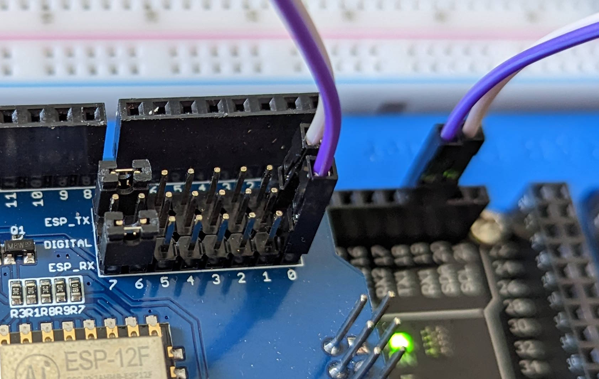

# Makerfabs ESP8266 WiFi Shield
Ce document est une amélioration et un complément du document [ESP8266 WiFi Shield](https://ca.robotshop.com/products/esp8266-wifi-shield) (RB-Mkf-14) de RobotShop.


# Configuration avec Arduino IDE
1. Assurez-vous qu'il n'y a pas de code en cours d'exécution sur l'Arduino.
   - Vous pouvez téléverser un code vide ou l'exemple `Blink`.
2. Empilez le shield sur le dessus de l'Arduino.
3. Vérifiez que le cavalier sur le shield correspond à la broche RX/TX de l'Arduino (TX-TX et RX-RX).
   - Il faut que le cavalier ESP_TX soit relié à la broche TX de l'Arduino et ESP_RX soit relié à la broche RX de l'Arduino. **Ce n'est pas une erreur**, il pour que la communication via le USB se fasse directement au shield.
   - Généralement, il s'agit des broches 0 et 1 de l'Arduino.
4. Ouvrez l'IDE Arduino.
5. Obtenez la bibliothèque `WiFiEsp` en allant dans le gestionnaire de bibliothèques.
   - Chercher `WiFiEsp` (il ne devrait y avoir qu'un seul choix)
6. Connectez l'Arduino.
7. Sélectionnez la carte Arduino et le bon port COM.
8. Ouvrez le Moniteur Série, sélectionnez `Both NL & CR` et réglez le débit en bauds à 115200.<
9. Tapez la commande `AT` dans la moniteur série. Vous devriez recevoir `OK` en retour.
   - Si vous ne recevez rien, il se peut que n'ayez pas changé les cavaliers sur le shield ou que vous n'avez pas mis `Both NL & CR` dans le moniteur série ou encore le module a été configuré à une autre vitesse de communication.
10. Changez le débit en bauds du module `ESP8266` à 9600 en tapant cette commande :<br/>
    `AT+CIOBAUD=9600` (cela ne doit être fait qu'une fois).
    - Cette action change la vitesse de communication du module `ESP8266` en utilisant une commande `AT`. Il faudra en prendre considération lors de configuration future du module.
11. Déconnectez tout.
12. Testez la configuration en envoyant la commande `AT` via le moniteur série.
    - Assurez-vous d'avoir configuré le moniteur série à la nouvelle vitesse.
13. Déconnectez tout.

> ***Important*** : Cette partie semble fonctionner que pour l'Arduino Uno. Pour l'Arduino Mega, il faut désactiver les cavaliers et brancher sur les RX1/TX1. En effet, `SoftwareSerial` ne fonctionne pas pour les broches qui sont sur le shield avec le Mega ([Source](https://docs.arduino.cc/learn/built-in-libraries/software-serial)).

14. Changez le cavalier de sorte que le RX du shield soit relié à la broche n°3 de l'Arduino.
    - ESP_RX doit être relié à la broche 3 de l'Arduino.
    - Nous allons utiliser `SoftwareSerial` pour communiquer avec le module `ESP8266`
15. Changez le cavalier de sorte que le TX du shield soit relié à la broche n°2 de l'Arduino.
    - ESP_TX doit être relié à la broche 2 de l'Arduino. 
    - Nous allons utiliser `SoftwareSerial` pour communiquer avec le module `ESP8266`

> **Note :** Pour les étapes 11 et 12, cela dépendra du code envoyer dans l'Arduino.

---

# Arduino Mega

## Branchement au RX1/TX1

- Désactiver les cavaliers en les plaçant en parallèle (voir image ci-dessous).


- Brancher le RX du shield sur la broche TX1 de l'Arduino Mega.
- Brancher le TX du shield sur la broche RX1 de l'Arduino Mega.

## Code d'exemple

```cpp
/*
 WiFiEsp example: WebClient

 This sketch connects to google website using an ESP8266 module to
 perform a simple web search.

 For more details see: http://yaab-arduino.blogspot.com/p/wifiesp-example-client.html
*/

#include "WiFiEsp.h"

char ssid[] = "ssid";            // your network SSID (name)
char pass[] = "ssid_pw";        // your network password
int status = WL_IDLE_STATUS;     // the Wifi radio's status

char server[] = "arduino.cc";

// Initialize the Ethernet client object
WiFiEspClient client;

void setup()
{
  // initialize serial for debugging
  Serial.begin(9600);
  // initialize serial for ESP module
  Serial1.begin(9600);
  // initialize ESP module
  WiFi.init(&Serial1);

  // check for the presence of the shield
  if (WiFi.status() == WL_NO_SHIELD) {
    Serial.println("WiFi shield not present");
    // don't continue
    while (true);
  }

  // attempt to connect to WiFi network
  while ( status != WL_CONNECTED) {
    Serial.print("Attempting to connect to WPA SSID: ");
    Serial.println(ssid);
    // Connect to WPA/WPA2 network
    status = WiFi.begin(ssid, pass);
  }

  // you're connected now, so print out the data
  Serial.println("You're connected to the network");
  
  printWifiStatus();

  Serial.println();
  Serial.println("Starting connection to server...");
  // if you get a connection, report back via serial
  if (client.connect(server, 80)) {
    Serial.println("Connected to server");
    // Make a HTTP request
    client.println("GET /asciilogo.txt HTTP/1.1");
    client.println("Host: arduino.cc");
    client.println("Connection: close");
    client.println();
  }
}

void loop()
{
  // if there are incoming bytes available
  // from the server, read them and print them
  while (client.available()) {
    char c = client.read();
    Serial.write(c);
  }

  // if the server's disconnected, stop the client
  if (!client.connected()) {
    Serial.println();
    Serial.println("Disconnecting from server...");
    client.stop();

    // do nothing forevermore
    while (true);
  }
}


void printWifiStatus()
{
  // print the SSID of the network you're attached to
  Serial.print("SSID: ");
  Serial.println(WiFi.SSID());

  // print your WiFi shield's IP address
  IPAddress ip = WiFi.localIP();
  Serial.print("IP Address: ");
  Serial.println(ip);

  // print the received signal strength
  long rssi = WiFi.RSSI();
  Serial.print("Signal strength (RSSI):");
  Serial.print(rssi);
  Serial.println(" dBm");
}

```

Dans le moniteur série, vous devriez avoir un message comme celui-ci :

```text
[WiFiEsp] Initializing ESP module
[WiFiEsp] Initilization successful - 1.5.4
Attempting to connect to WPA SSID: YOUR_NETWORK_NAME
[WiFiEsp] Connected to YOUR_NETWORK_NAME
You're connected to the network
SSID: YOUR_NETWORK_NAME
IP Address: 10.79.83.219
Signal strength (RSSI):-52 dBm

Starting connection to server...
[WiFiEsp] Connecting to arduino.cc
Connected to server

Disconnecting from server...
```
---

# Références
- [Site officiel - OAS8266WF](https://www.makerfabs.com/esp8266-wifi-shield.html)