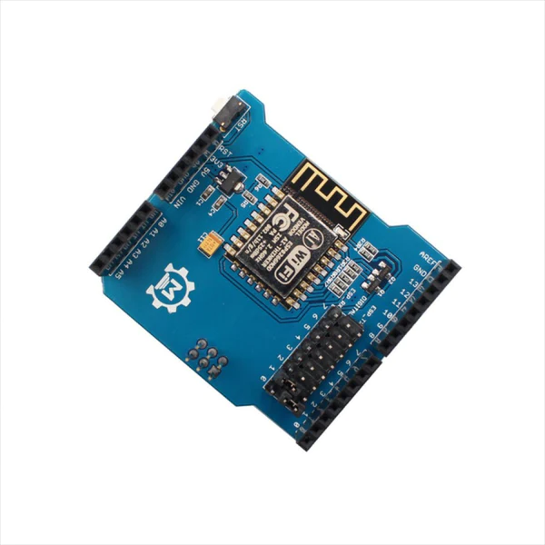

# Makerfabs ESP8266 WiFi Shield
Ce document est une amélioration et un complément du document [ESP8266 WiFi Shield](https://ca.robotshop.com/products/esp8266-wifi-shield) (RB-Mkf-14) de RobotShop.

# Configuration avec Arduino IDE
1. Assurez-vous qu'il n'y a pas de code en cours d'exécution sur l'Arduino.
   - Vous pouvez téléverser un code vide ou l'exemple `Blink`.
2. Empilez le shield sur le dessus de l'Arduino.
3. Vérifiez que le cavalier sur le shield correspond à la broche RX/TX de l'Arduino (TX-TX et RX-RX).
   - Il faut que le cavalier ESP_TX soit relié à la broche TX de l'Arduino et ESP_RX soit relié à la broche RX de l'Arduino. **Ce n'est pas une erreur**, il pour que la communication via le USB se fasse directement au shield.
   - Généralement, il s'agit des broches 0 et 1 de l'Arduino.
4. Ouvrez l'IDE Arduino.
5. Obtenez la bibliothèque `WiFiEsp` en allant dans le gestionnaire de bibliothèques.
   - Chercher `WiFiEsp` (il ne devrait y avoir qu'un seul choix)
6. Connectez l'Arduino.
7. Sélectionnez la carte Arduino et le bon port COM.
8. Ouvrez le Moniteur Série, sélectionnez `Both NL & CR` et réglez le débit en bauds à 115200.<
9. Tapez la commande `AT` dans la moniteur série. Vous devriez recevoir `OK` en retour.
   - Si vous ne recevez rien, il se peut que n'ayez pas changé les cavaliers sur le shield ou que vous n'avez pas mis `Both NL & CR` dans le moniteur série ou encore le module a été configuré à une autre vitesse de communication.
10. Changez le débit en bauds du module `ESP8266` à 9600 en tapant cette commande : 
    `AT+CIOBAUD=9600` (cela ne doit être fait qu'une fois).
    - Cette action change la vitesse de communication du module `ESP8266` en utilisant une commande `AT`. Il faudra en prendre considération lors de configuration future du module.
11. Déconnectez tout.
12. Changez le cavalier de sorte que le RX du shield soit relié à la broche n°3 de l'Arduino.
    - ESP_RX doit être relié à la broche 3 de l'Arduino.
    - Nous allons utiliser `SoftwareSerial` pour communiquer avec le module `ESP8266`
13. Changez le cavalier de sorte que le TX du shield soit relié à la broche n°2 de l'Arduino.
    - ESP_TX doit être relié à la broche 2 de l'Arduino. 
    - Nous allons utiliser `SoftwareSerial` pour communiquer avec le module `ESP8266`

> **Note :** Pour les étapes 11 et 12, cela dépendra du code envoyer dans l'Arduino.