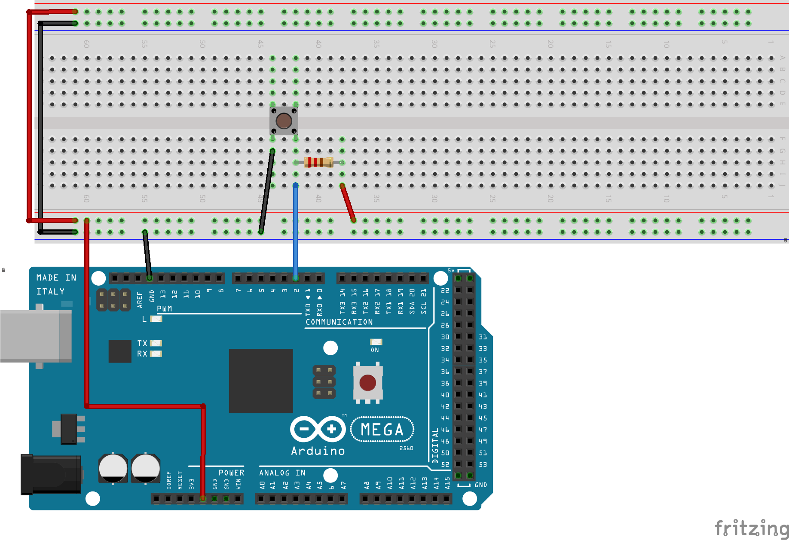

# Résistance de rappel et de tirage <!-- omit in toc -->

# Table des matières <!-- omit in toc -->
- [Introduction](#introduction)
- [Exemple de résistance de rappel](#exemple-de-resistance-de-rappel)
- [Exemple de résistance de tirage](#exemple-de-resistance-de-tirage)
- [Code Arduino](#code-arduino)
- [Valeur de la résistance](#valeur-de-la-resistance)
- [Questions](#questions)
- [Référence](#reference)


# Introduction
Une broche peut avoir trois états soit 0, 1 ou flottant. Si la broche est connectée à la mise à la terre (*ground*), elle aura une valeur de 0, si elle est connectée à la tension d'alimentation, elle aura une valeur de 1 et si elle n'est connectée à rien, elle aura une valeur **flottante**.

**Une valeur flottante est une valeur dont on ne pourra pas garantir sa vraie valeur**. Sa valeur dépendra de l'environnement, de la température, de la tension d'alimentation, etc. Il s'agit de bruit.

Voici la lecture sur un oscilloscope d'une broche flottante.


On ne sait pas vraiment si la broche est à 0 ou à 1 à quel moment.

De manière générale, on veut éviter les valeurs flottantes. Pour cela, on utilise une résistance de rappel ou de tirage.

Une **résistance de rappel** (*pull-down resistor*), ou une **résistance de tirage** (*pull-up resistor*), est une résistance qui est connectée à un circuit pour maintenir un état logique à un niveau donné. Cela permet de maintenir un état logique à un niveau donné, même si le circuit qui le contrôle est déconnecté ou s'il y a une panne.

La résistance de rappel sert à mettre la broche à 0 en branchant en parallèle une résistance de rappel à la broche et à la masse.

La résistance de tirage sert à mettre la broche à 1 en branchant en parallèle une résistance de tirage à la broche et à la tension d'alimentation.

Voici les deux schémas de résistance de tirage et de rappel.


# Exemple de résistance de rappel


# Exemple de résistance de tirage


# Code Arduino
Il est possible d'activé une résistance de tirage sur l'Arduino.

Lors de la configuration d'une broche avec la fonction `pinMode`, il est possible de spécifier la résistance de tirage avec les constantes `INPUT_PULLUP`.

```cpp
void setup() {
  pinMode(2, INPUT_PULLUP);
}

void loop() {
  if (digitalRead(2) == HIGH) {
    // faire quelque chose
  }
}
```

> **Attention** : Il n'y a pas de résistance de rappel sur l'Arduino. Il faut donc utiliser une résistance externe.
>

# Valeur de la résistance
Il n'y a pas vraiment de valeur de résistance standard pour une résistance de tirage ou de rappel. Une valeur entre 1kΩ et 10kΩ est assez typique. Dans mes montages, j'utilise des **résistances de 4.7kΩ**.

# Questions
Voici des questions possibles dans une évaluation.

1. Quelle est la différence entre une résistance de rappel et une résistance de tirage?
2. Comment activer une résistance de tirage sur l'Arduino?
3. Si on utilise une résistance de tirage (ou de rappel) sur l'Arduino, quelle sera la valeur du bouton poussoir s'il est appuyé?
4. Avec ces deux schémas, quel schéma représente le branchement avec la résistance de rappel et quel schéma représente la résistance de tirage?

<details><summary>Réponses</summary>

1. Une résistance de rappel est une résistance qui est connectée à un circuit pour maintenir un état logique à 0. Une résistance de tirage est une résistance qui est connectée à un circuit pour maintenir un état logique à 1.
2. `pinMode(numeroBroche, INPUT_PULLUP);`
3. 0 si tirage et 1 si rappel.
4. Voir la section avec les schémas.

</details>

---

# Référence
- [Youtube : Pull up resistor tutorial](https://www.youtube.com/watch?v=wxjerCHCEMg) - 4 minutes
- [SparkFun : Pull-up Resistors ](https://learn.sparkfun.com/tutorials/pull-up-resistors/all)
