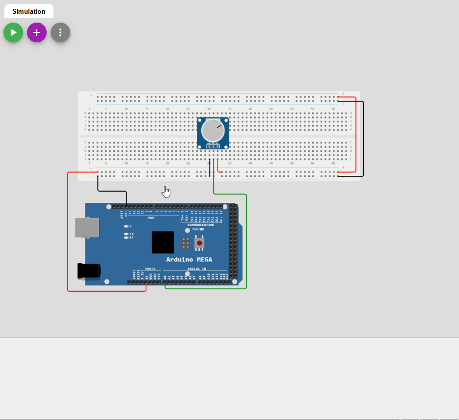

# Lecture de valeurs analogiques

## Qu'est-ce qu'une valeur analogique?
Une valeur analogique est une valeur qui peut prendre une infinité de valeurs. Par exemple, la température peut prendre une infinité de valeurs entre -273.15°C et 100°C. La luminosité peut prendre une infinité de valeurs entre 0 et 100%. La position d'un potentiomètre peut prendre une infinité de valeurs entre 0 et 100%. Une valeur analogique est donc une valeur qui peut prendre une infinité de valeurs.

Lorsque l'on dit infinité, c'est que la valeur peut prendre une infinité de valeurs entre deux valeurs. Par exemple, la température peut prendre une infinité de valeurs entre -273.15°C et -273.14°C, entre -273.14°C et -273.13°C, etc.

## Comment un microcontrôleur peut-il lire une valeur analogique?
Un microcontrôleur ne peut pas lire une valeur analogique directement. Il faut donc convertir la valeur analogique en une valeur numérique. Pour ce faire, on utilise un convertisseur analogique-numérique (ADC). Un ADC est un composant électronique qui convertit une valeur analogique en une valeur numérique.

**Les microcontroleur possède généralement un ou plusieurs ADC intégré**. Par exemple, l'ATMega2560 possède 16 ADC intégrés. Ces ADC sont connectés à des broches spécifiques. Par exemple, les ADC intégrés à l'ATMega2560 sont connectés aux broches **A0 à A15**.


> **Pratique** : Prenez votre Arduino et repérez les broches A0 à A15.

## Perte de précision
Lors de la conversion d'une valeur analogique en une valeur numérique, il y a une perte de précision. Par exemple, si on convertit une valeur analogique de 0 à 5V en une valeur numérique de 0 à 1023, il y a une perte de précision. En effet, il y a 1024 valeurs numériques possibles, mais il y a une infinité de valeurs analogiques possible entre 0 et 5V (exemple : 3.1416V). Donc la perte de précision est due au tronquage des valeurs numériques.

Exemple :

- Une valeur de 3.1416V sera convertie en une valeur numérique de $3.1416 / 5 * 1023 = 642.77$. Cette valeur sera tronquée à **`642`**.


Voici un exemple de graphique représentant le concept de conversion d'une valeur analogique en une valeur numérique avec la perte de précision.


On remarque que les valeurs numérique ne peuvent pas représenter toutes les valeurs analogiques à tous les temps. Les valeurs sont découpées au rythme de l'échantillonnage du programme.

## Les Arduinos
Les Arduinos possèdent plusieurs ADC. **Ils sont de 10-bit**. Cela signifie que la précision sera de 1024 valeurs soit de 0 à 1023, car 2^10 = 1024. Les valeurs analogiques seront converties en valeurs numériques entre 0 et 1023.

> **Note** : Une résolution de 1-bit signifie qu'on ne pourrait avoir qu'une valeur de 0 ou 1, car il n'y a que deux valeurs possibles. Ainsi une résolution de 2-bit sera de 0 à 3, 3-bit de 0 à 7, ainsi de suite.

## Exemples de cas pratique
On retrouve des composants analogiques partout, par exemple, les **potentiomètres**, les **capteurs de température**, les **microphones**, les **capteurs de luminosité**, etc. Ces composants peuvent être reliés à des broches analogiques de l'Arduino. On peut lire la valeur analogique de ces composants en utilisant les ADC de l'Arduino.

## Le potentiomètre
Un potentiomètre est un composant électrique qui agit comme une résistance variable. Il a trois bornes : les deux extrémités et un contact coulissant ou rotatif qui se déplace le long d'un élément résistif. En ajustant la position du contact le long de l'élément résistif, le potentiomètre peut faire varier la résistance entre ses deux extrémités, créant ainsi un circuit diviseur de tension variable. Cela permet de l'utiliser comme un contrôle de volume dans du matériel audio, un capteur de position en robotique ou un outil de calibration dans du matériel de laboratoire. Les potentiomètres sont souvent appelés "pots" pour faire court.


### Fonctionnement interne


## La fonction `analogRead()`
La fonction pour lire une valeur analogique est `analogRead()`. Cette fonction prend en paramètre le numéro de la broche analogique à lire. Par exemple, si on veut lire la valeur analogique de la broche A0, on utilise la fonction `analogRead(A0)`. La fonction `analogRead()` retournera un entier entre 0 et 1023.

## Exemples
### Base
Voici un exemple de code qui lit la valeur analogique d'un potentiomètre branché sur la broche A0 et l'affiche sur le moniteur série.

<div class="grid" markdown>

<div markdown>
{ width="100%" }
</div>

<div markdown>

```cpp
void setup() {
  Serial.begin(9600);
}

void loop() {
  int valeur = analogRead(A0);
  Serial.println(valeur);
  delay(1000);
}
```

</div>
</div>

---

### Sélection de DEL
Voici un exemple de code qui lit la valeur analogique d'un potentiomètre branché sur la broche A0 et allume une DEL en fonction de la valeur lue.

<div class="grid" markdown>

<div markdown>
{ width="100%" }
</div>

<div markdown>

```cpp
const int ledPins[] = {2, 3, 4, 5};  // Tableau des numéros de broches
int potentiometerPin = A0;           
int potentiometerValue = 0;          
int ledIndex = 0;                   // Index du DEL allume

void setup() {
  Serial.begin(9600);
  for (int i = 0; i < 4; i++) {
    // Initialisation des DEL en sortie
    pinMode(ledPins[i], OUTPUT); 
  }
}

void loop() {
  potentiometerValue = analogRead(potentiometerPin);
  
  if (potentiometerValue < 256) {
    digitalWrite(ledPins[0], HIGH);
    digitalWrite(ledPins[1], LOW);
    digitalWrite(ledPins[2], LOW);
    digitalWrite(ledPins[3], LOW);
  } else if (potentiometerValue < 512) {
    digitalWrite(ledPins[0], LOW);
    digitalWrite(ledPins[1], HIGH);
    digitalWrite(ledPins[2], LOW);
    digitalWrite(ledPins[3], LOW);
  } else if (potentiometerValue < 768) {
    digitalWrite(ledPins[0], LOW);
    digitalWrite(ledPins[1], LOW);
    digitalWrite(ledPins[2], HIGH);
    digitalWrite(ledPins[3], LOW);
  } else {
    digitalWrite(ledPins[0], LOW);
    digitalWrite(ledPins[1], LOW);
    digitalWrite(ledPins[2], LOW);
    digitalWrite(ledPins[3], HIGH);
  }
}
```

</div>
</div>

> Question : Comment pourrait-on améliorer cet exemple sans utiliser de conditionnelles?

Cet exemple est disponible [ici](https://wokwi.com/projects/356395304066120705).

---

## La fonction `map()`
La fonction `map()` permet de convertir une valeur d'un intervalle à un autre intervalle. Par exemple, si on veut convertir une valeur de 0 à 1023 en une valeur de 0 à 255, on peut utiliser la fonction `map()`.

```cpp
int valeur = analogRead(A0);
int valeur_convertie = map(valeur, 0, 1023, 0, 255);
```

La fonction `map()` prend en ordre les paramètres suivants :
- la valeur à convertir;
- la valeur minimale de l'intervalle de départ;
- la valeur maximale de l'intervalle de départ;
- la valeur minimale de l'intervalle d'arrivée;
- la valeur maximale de l'intervalle d'arrivée.

L'algorithme de la fonction `map()` est le suivant :
```cpp
int map(int valeur, int min_depart, int max_depart, int min_arrivee, int max_arrivee) {
  int decalage_depart = valeur - min_depart;
  int plage_depart = max_depart - min_depart;
  int plage_arrivee = max_arrivee - min_arrivee;
  int valeur_convertie = (decalage_depart / plage_depart ) * plage_arrivee + min_arrivee;

  return valeur_convertie;
}
```

Cette fonction permet aussi d'intervertir deux intervalles. Par exemple, si on veut convertir une valeur de 0 à 1023 en une valeur de 255 à 0, on peut utiliser la fonction `map()`.

```cpp
int valeur = analogRead(A0);
int valeur_convertie = map(valeur, 0, 1023, 255, 0);
```

### Exemple de code avec la fonction `map()`
Voici le même exemple que [Sélection de DEL](#selection-de-del) mais avec la fonction `map()`.


> **Note** : L'exemple n'est pas le plus efficace, mais il ne sert qu'à illustrer une utilisation de la fonction `map()`.

```cpp
const int ledPins[] = {2, 3, 4, 5};  // Tableau des numéros de broches
int potentiometerPin = A0;           
int potentiometerValue = 0;          
int ledIndex = 0;                   // Index du DEL allume

unsigned long currentTime = 0;
unsigned long serialPrevious = 0;
int serialDelay = 1000;

int mappedIndex = 0;

void setup() {
  Serial.begin(9600);

  // On utilise une boucle que pour travailler
  // avec des tableaux
  for (int i = 0; i < 4; i++) {
    // Initialisation des DEL en sortie
    pinMode(ledPins[i], OUTPUT); 
  }
}

void loop() {
  currentTime = millis();

  potentiometerValue = analogRead(potentiometerPin);
  mappedIndex = map (potentiometerValue, 0, 1023, 0, 3);

  // On utilise une boucle que pour travailler
  // avec des tableaux
  for (int i = 0; i < 4; i++) {
    if (i == mappedIndex) {
      digitalWrite(ledPins[i], HIGH);
    }
    else {
      digitalWrite(ledPins[i], LOW);
    }
  }

  if (currentTime - serialPrevious >= serialDelay) {
    serialPrevious = currentTime;
    Serial.print("Valeur : ");
    Serial.println(potentiometerValue);    
  }  
}
```

Cet exemple est disponible [ici](https://wokwi.com/projects/356398829928163329).

---

## Exercices

- [Exercices](C04x_exercices.md)

---

## Références
- [Arduino Get Started : Potentiometer](https://arduinogetstarted.com/tutorials/arduino-potentiometer)
