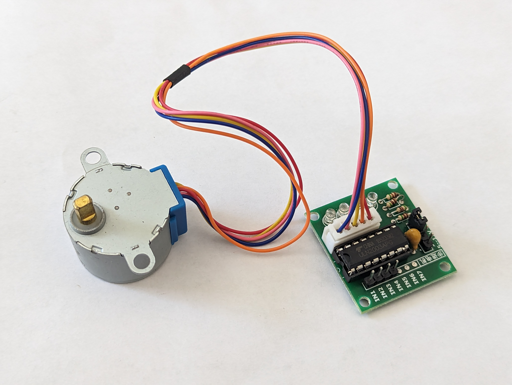
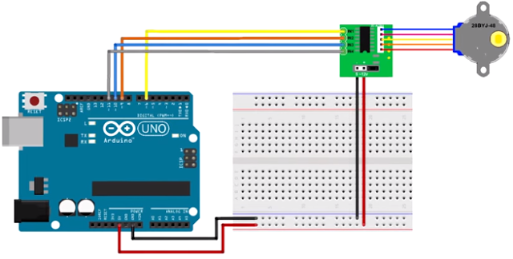

# Le moteur pas-à-pas



---

## Introduction
Votre kit contient un moteur pas-à-pas (*stepper mtor*) 28BYJ-48 avec un module monté avec un driver ULN2003.

### Utilisation
On retrouve les moteurs pas-à-pas dans plusieurs applications comme les lecteurs de disques, les disques durs, les imprimantes, les robots, etc.

[](https://www.youtube.com/watch?v=z5v90dUOg4E)

> **Zone le fun :** Jetez un coup d'oeil sur le [site](https://www.thingiverse.com/search?q=uln2003&page=1&type=things&sort=relevant) pour trouver des projets amusants avec le moteur pas-à-pas de votre kit.

## Fonctionnement d'un moteur pas-à-pas
Les moteurs pas-à-pas utilisent une roue dentée et des électroaimants pour faire avancer la roue d'un "pas" à la fois.

Chaque impulsion haute envoyée alimente la bobine, attirant les dents les plus proches de la roue dentée et faisant tourner le moteur par incréments d'angle précis et fixes appelés pas.

Le nombre de pas que le moteur pas-à-pas effectue pour une rotation complète de 360 degrés correspond en réalité au nombre de dents sur la roue dentée.


La manière dont vous impulsez ces bobines détermine le fonctionnement du moteur.
- La séquence des impulsions détermine le sens de rotation du moteur.
- La fréquence des impulsions détermine la vitesse du moteur.
- Le nombre d'impulsions détermine la distance que le moteur parcourra.

En alimentant les bobines dans la séquence correcte, le moteur est mis en rotation.

> **Note :** L'objectif du cours n'étant pas de comprendre le fonctionnement du moteur, nous allons nous concentrer sur la façon de le contrôler. 
> 
> [Cet article](https://lastminuteengineers.com/28byj48-stepper-motor-arduino-tutorial/) explique en détail le fonctionnement du moteur pas-à-pas et comment le contrôler avec un Arduino.

## Le moteur pas-à-pas 28BYJ-48

Le 28BYJ-48 est un moteur pas-à-pas unipolaire à 5 fils qui fonctionne sous 5V. Il est parfait pour les projets qui nécessitent un positionnement précis, comme l'ouverture et la fermeture d'une ventilation.

Étant donné que le moteur n'utilise pas de balais de contact, il a un mouvement relativement précis et est assez fiable.

Malgré sa petite taille, le moteur fournit un couple décent de 34.3 mN.m à une vitesse d'environ 15 RPM. Il offre un bon couple même à l'arrêt et le maintient tant que le moteur reçoit de l'énergie.

Le seul inconvénient est qu'il consomme relativement beaucoup d'énergie, même lorsqu'il est à l'arrêt.

### Le filage

Le moteur pas-à-pas 28BYJ-48 possède cinq fils. Les broches sont les suivantes :


Le 28BYJ-48 a deux bobines, chacune ayant une prise centrale. Ces deux prises centrales sont connectées en interne et sorties comme le 5e fil (fil rouge).

Ensemble, une extrémité de la bobine et la prise centrale forment une phase. Ainsi, le 28BYJ-48 a un total de quatre phases.


Le fil rouge est toujours tiré vers le haut (HIGH), donc lorsque l'autre fil est tiré vers le bas (LOW), la phase est alimentée.

Le moteur pas-à-pas ne tourne que lorsque les phases sont alimentées dans une séquence logique connue sous le nom de séquence de pas.

### Rapport de réduction de l'engrenage

Selon la fiche technique, lorsque le moteur 28BYJ-48 est utilisé en mode pas complet, chaque pas correspond à une rotation de 11,25°. Cela signifie qu'il y a 32 pas par tour (360°/11,25° = 32).


De plus, le moteur dispose d'un ensemble de réduction d'engrenage de 1/64 (en réalité, il s'agit de 1/63,68395, mais 1/64 est une approximation suffisamment précise pour la plupart des applications).

Cela signifie qu'en réalité, il y a 2038 pas (32*63,68395 pas par tour = 2037,8864 environ 2038 pas).

---

## Le module de contrôle ULN2003

Étant donné que le moteur pas-à-pas 28BYJ-48 consomme une quantité importante de puissance, il ne peut pas être contrôlé directement par un microcontrôleur tel que l'Arduino. Pour contrôler le moteur, un circuit intégré de commande tel que l'ULN2003 est nécessaire ; par conséquent, ce moteur est généralement livré avec une carte de commande basée sur l'ULN2003.

L'ULN2003, connu pour sa capacité de courant élevé et sa capacité de tension élevée, fournit un gain de courant plus élevé qu'un simple transistor et permet à une sortie de faible tension et faible courant d'un microcontrôleur de piloter un moteur pas-à-pas de courant élevé.


La carte possède quatre entrées de contrôle et une connexion d'alimentation électrique.

De plus, il y a un connecteur Molex compatible avec celui du moteur, vous permettant de brancher directement le moteur dessus.

La carte comprend quatre LED qui indiquent l'activité sur les quatre lignes d'entrée de contrôle. Elles fournissent une bonne indication visuelle pendant le mouvement par pas.

Il y a un cavalier ON/OFF sur la carte pour désactiver le moteur pas-à-pas si nécessaire.


## Branchement

Connectons le moteur à notre Arduino !

Les connexions sont simples. Commencez par connecter une source d'alimentation externe de 5V au driver ULN2003.

> **Attention :**
> 
> Le moteur pas-à-pas peut être alimenté directement depuis l'Arduino, mais cela n'est pas recommandé car le moteur peut générer du bruit électrique sur ses lignes d'alimentation, ce qui peut endommager l'Arduino.

Connectez les entrées `IN1`, `IN2`, `IN3` et `IN4` de la carte de commande aux broches numériques 8, 9, 10 et 11 de l'Arduino, respectivement. Ensuite, connectez le moteur pas-à-pas au driver ULN2003.

Enfin, assurez-vous que votre circuit et votre Arduino ont une masse commune.

Le diagramme suivant montre le branchement typique d'un montage.



## Exemple de code avec la librairie `AccelStepper`

La librairie `AccelStepper` est une librairie permettant de contrôler les moteurs pas-à-pas. Elle est plus rapide et plus flexible que la librairie `Stepper` qui vient par défaut. Surtout, elle n'est pas bloquante, ce qui signifie que vous pouvez exécuter d'autres tâches pendant le mouvement du moteur.

La première étape sera d'installer la librairie `AccelStepper` depuis le gestionnaire de bibliothèques Arduino.

- Recherchez 'AccelStepper' dans le gestionnaire de bibliothèques Arduino. Assurez-vous que ce soit la version réalisée par Mike McCauley.
  
  

Voici un code de base pour faire tourner le moteur dans une direction, puis dans l'autre.

```cpp
#include <AccelStepper.h>

// Définir le type de moteur, les broches IN1-IN3-IN2-IN4
#define MOTOR_INTERFACE_TYPE 4

#define IN_1 31
#define IN_2 33
#define IN_3 35
#define IN_4 37

// Crée une instance
// Attention : L’ordre des broches (IN1, IN3, IN2, IN4) est spécifique au 28BYJ-48.
AccelStepper myStepper(MOTOR_INTERFACE_TYPE, IN_1, IN_3, IN_2, IN_4);

void setup() {
// Définir la vitesse maximale, le facteur d'accélération,
// la vitesse initiale et la position cible
    myStepper.setMaxSpeed(500);  // Vitesse max en pas/seconde
    myStepper.setAcceleration(100); // Accélération en pas/seconde²
	myStepper.setSpeed(200); // Vitesse constante en pas/seconde
	myStepper.moveTo(2038); // Position cible
}

void loop() {
	// Changer de direction une fois que le moteur atteint la position cible
	if (myStepper.distanceToGo() == 0) 
		myStepper.moveTo(-myStepper.currentPosition());

	// Faire tourner le moteur d'un pas
  // Il faut appeler cette fonction dans le loop sinon le moteur ne tourne pas
	myStepper.run();
}
```

### Explication du code

`MOTOR_INTERFACE_TYPE` est une constante qui définit le type de moteur que vous utilisez en mode full-step.

```
#define MotorInterfaceType 4
```

Ensuite, on crée une instance de la classe `AccelStepper` en indiquant le type de moteur, les broches **IN1-IN3-IN2-IN4**.

```cpp
AccelStepper myStepper(MOTOR_INTERFACE_TYPE, IN_1, IN_3, IN_2, IN_4);
```

Dans la fonction `setup`, la vitesse maximale autorisée du moteur est réglée sur 1000 (le moteur accélérera jusqu'à cette vitesse lors de l'exécution). Le taux d'accélération/freinage est ensuite défini pour ajouter de l'accélération et du freinage aux mouvements du moteur pas-à-pas.

La vitesse constante est réglée sur 200. Et, comme le 28BYJ-48 effectue 2038 pas par tour, la position cible est également réglée sur 2038.

```cpp
    myStepper.setMaxSpeed(1000);  // Vitesse max en pas/seconde
    myStepper.setAcceleration(500); // Accélération en pas/seconde²
	myStepper.setSpeed(200); // Vitesse constante en pas/seconde
	myStepper.moveTo(2038); // Position cible
```

Dans la fonction loop, une instruction `if` est utilisée pour déterminer la distance que le moteur doit parcourir (en lisant la propriété distanceToGo) avant d'atteindre la position cible (définie par moveTo). Lorsque la distanceToGo atteint zéro, le moteur est tourné dans la direction opposée en définissant la position moveTo comme étant le négatif de sa position actuelle.

En bas de la boucle, vous remarquerez que la fonction `run()` est appelée. C'est la fonction la plus importante, car le moteur pas-à-pas ne se déplacera pas s'il n'est pas exécuté.

```cpp
void loop() {
	// Changer de direction une fois que le moteur atteint la position cible
	if (myStepper.distanceToGo() == 0) 
		myStepper.moveTo(-myStepper.currentPosition());

	// Faire tourner le moteur d'un pas
  // Il faut appeler cette fonction dans le loop sinon le moteur ne tourne pas
	myStepper.run();
}
```

---

## Exercices
1. Tester différents paramètres de vitesse et accélération
   - Modifiez `setMaxSpeed()` et `setAcceleration()` pour observer les effets sur le mouvement.
2. Faire tourner le moteur à l’infini dans un seul sens
   - Remplacez `moveTo()` par `myStepper.setSpeed()` et utilisez `runSpeed()`.
3. Contrôler la direction avec un bouton
   - Ajoutez un bouton sur la broche 2 pour changer la direction du moteur.
4. Utiliser un potentiomètre pour ajuster la vitesse
   - Branchez un potentiomètre sur A0 et utilisez `analogRead(A0)` pour modifier `setMaxSpeed()`.
---

## Références
- [Control 28BYJ-48 Stepper Motor with ULN2003 Driver](https://lastminuteengineers.com/28byj48-stepper-motor-arduino-tutorial/)
- [AccelStepper The missing manual](https://hackaday.io/project/183279-accelstepper-the-missing-manual)

<!--
ARCHIVE

## Exemple de code avec la librairie `Stepper`

> **Mise en garde :** La **librairie `Stepper` est bloquante**. Cela signifie que le programme ne peut pas faire autre chose tant que le moteur est en mouvement. Si vous avez besoin d'exécuter d'autres tâches pendant le mouvement du moteur, vous devrez utiliser une autre bibliothèque. Je suggère `AccelStepper`.

Pour notre premier exemple, nous utiliserons la bibliothèque `Stepper` Arduino, qui est incluse dans l'IDE Arduino.

La bibliothèque `Stepper` Arduino gère la séquence de pas et vous permet de contrôler un large éventail de moteurs pas-à-pas unipolaires et bipolaires.

Voici un petit programme qui fait tourner lentement le moteur dans une direction, puis rapidement dans la direction opposée.

```cpp
#include <Stepper.h>

// Définir le nombre de pas par tour
const int stepsPerRevolution = 2038;

// Créer une instance de la classe Stepper
// Attention, les broches sont entrées dans la séquene IN1-IN3-IN2-IN4
Stepper myStepper = Stepper(stepsPerRevolution, 8, 10, 9, 11);

void setup() {
    // Rien à faire, la librairie Stepper s'occupe de tout
}

void loop() {
	// Pivoter CW lentement à 5 RPM
	myStepper.setSpeed(5);
	myStepper.step(stepsPerRevolution);
	delay(1000);
	
	// Pivoter CCW rapidement à 10 RPM
	myStepper.setSpeed(10);
	myStepper.step(-stepsPerRevolution);
	delay(1000);
}
```

Remarquez que le moteur continue de tourner dans la même direction jusqu'à ce que la fonction `step()` soit appelée à nouveau. Donc il s'agit d'une configuration persistante.

 -->
