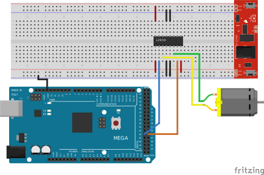

# Moteur DC et contrôleur L293D <!-- omit in toc -->

# Table des matières <!-- omit in toc -->
- [Introduction](#introduction)
- [Le moteur DC](#le-moteur-dc)
- [Le contrôleur de moteur L293D](#le-controleur-de-moteur-l293d)
  - [Premièrement, qu'est-ce qu'un pont en H?](#premièrement-quest-ce-quun-pont-en-h)
  - [Le contrôleur de moteur L293D](#le-contrôleur-de-moteur-l293d-1)
  - [Tableau logique de contrôle du moteur DC avec le L293D](#tableau-logique-de-controle-du-moteur-dc-avec-le-l293d)
  - [Exemple de code](#exemple-de-code)
  - [Important](#important)
- [Exercices](#exercices)
- [Références](#references)

# Introduction
Dans cette leçon, nous allons voir comment contrôler un moteur DC avec un contrôleur de moteur de type "pont en H".

Votre kit Arduino contient un contrôleur de moteur L293D ainsi qu'un moteur DC.

 

---

# Le moteur DC
Le moteur DC (Direct Current) est un moteur électrique qui fonctionne avec un courant continu. Il est composé d'un rotor et d'un stator. Le rotor est la partie mobile du moteur et le stator est la partie fixe. Le moteur DC est utilisé dans de nombreux appareils électriques tels que les ventilateurs, les jouets, les robots, les voitures, etc.

Dans votre kit, il s'agit d'un moteur DC 130. Il est petit, léger et peu coûteux. Il est parfait pour les débutants.


Le moteur DC 130 a deux fils : un fil rouge et un fil noir. Le fil rouge est le fil positif et le fil noir est le fil négatif.

On peut inverser le sens de rotation du moteur en inversant les fils de branchement.

---

# Le contrôleur de moteur L293D
Le contrôleur de moteur L293D est un circuit intégré qui permet de contrôler un moteur DC. Il est composé de deux ponts en H. Chaque pont en H est composé de quatre transistors. Le L293D peut contrôler deux moteurs DC ou un moteur pas à pas.

## Premièrement, qu'est-ce qu'un pont en H?
Un pont en H est un circuit électronique qui permet de contrôler la direction du courant électrique. Il est composé de quatre transistors. Deux transistors sont utilisés pour contrôler le courant dans un sens et les deux autres transistors sont utilisés pour contrôler le courant dans l'autre sens.


Ainsi selon ce schéma, si l'on met du courant sur `S1` et `S4`, le moteur tournera dans un sens. Si l'on met du courant sur `S3` et `S2`, le moteur tournera dans l'autre sens.

> **Note:**<br/>
> Les symboles avec une flèche représente des transistors.
> 
> 
>
> Les transistors peuvent être utilisés, entre autres, pour contrôler le courant électrique. Ils peuvent être utilisés pour fermer ou ouvrir un circuit électrique **comme un interrupteur**. Ils sont contrôlés par un signal électrique envoyé sur leur base. Lorsque le signal est présent, le transistor est ouvert et le courant peut circuler. Lorsque le signal est absent, le transistor est fermé et le courant ne peut pas circuler. 
> 
> Dans le cadre du cours, nous n'irons pas plus en détail sur les transistors. Nous nous contenterons de les utiliser comme des interrupteurs. 


Voici une animation montrant le fonctionnement d'un pont en H.


## Le contrôleur de moteur L293D
Maintenant que l'on sait en quoi consiste un pont en H, on peut comprendre comment fonctionne le contrôleur de moteur L293D.


Le L293D est composé de deux ponts en H. Chaque pont en H peut contrôler un moteur DC. Le L293D peut contrôler deux moteurs DC.

Le L293D a 16 broches. Voici le diagramme de brochage du L293D.


- `VCC` : Alimentation du circuit intégré. On branche le +5V de l'Arduino sur cette broche.
- `Ground` : Il y a 4 broches de `Ground`, car les moteurs nécessitent beaucoup de courant ce qui dégage beaucoup de chaleur. Il est donc nécessaire de relier ces broches à la masse pour dissiper celle-ci.
- `Enable 1, 2` : Permet d'activer ou de désactiver le pont en H. Si on met un signal HIGH sur cette broche, le pont en H est activé. Si on met un signal LOW, le pont en H est désactivé.
  - `Enable 3, 4` : Même chose que `Enable 1, 2` mais pour le deuxième pont en H.
- `Input 1` : Permet de contrôler le sens de rotation du moteur 1.
- `Input 2` : Permet de contrôler le sens de rotation du moteur 1.
  - `Input 3, 4` : Même chose que `Input 1, 2` mais pour le moteur 2.
- `Output 1, 2` : Sortie du pont en H pour le moteur 1.
  - `Output 3, 4` : Sortie du pont en H pour le moteur 2.

> **Note:**<br/>
> Remarquez sur le L293D, il y a une encoche sur le boîtier. Cette encoche indique le sens de la broche 1. C'est-à-dire que la broche 1 est la broche la plus à gauche lorsque l'encoche est en haut.
> 
> Il s'agit d'une convention pour les circuits intégrés. La broche 1 est toujours la broche la plus à gauche lorsque l'encoche est en haut.

Voici un diagramme de branchement pour contrôler un moteur DC avec le L293D et un Arduino Mega.



---

## Tableau logique de contrôle du moteur DC avec le L293D

Voici un tableau logique pour contrôler un moteur DC avec le L293D.

| `Input 1` | `Input 2` | Sens de rotation |
|-----------|-----------|------------------|
| LOW       | LOW       | Arrêt            |
| HIGH      | LOW       | Direction 1      |
| LOW       | HIGH      | Direction 2      |
| HIGH      | HIGH      | Arrêt            |

## Exemple de code
Suivant le diagramme de branchement précédemment montré, voici un exemple de code pour contrôler le moteur DC.

```cpp
// Définition des broches
int input1 = 23;
int input2 = 24;

void setup() {
  // Initialisation des broches
  pinMode(input1, OUTPUT);
  pinMode(input2, OUTPUT);
}

void loop() {
  // Faire tourner le moteur dans un sens
  digitalWrite(input1, HIGH);
  digitalWrite(input2, LOW);
  delay(2000); // Attendre 2 secondes

  // Faire tourner le moteur dans l'autre sens
  digitalWrite(input1, LOW);
  digitalWrite(input2, HIGH);
  delay(2000); // Attendre 2 secondes

  // Arrêter le moteur
  digitalWrite(input1, LOW);
  digitalWrite(input2, LOW);
  delay(2000); // Attendre 2 secondes
}
```

Voici un autre exemple avec seulement la boucle pour faire accélérer et décélérer le moteur.

```cpp

//... Même code que l'exemple précédent

void loop() {
  // Faire tourner le moteur dans un sens
  for (int i = 0; i < 255; i++) {
    analogWrite(input1, i);
    analogWrite(input2, LOW);
    delay(10);
  }

  // Faire tourner le moteur dans l'autre sens
  for (int i = 255; i > 0; i--) {
    analogWrite(input1, LOW);
    analogWrite(input2, i);
    delay(10);
  }
}
```

Dans l'exemple ci-dessus avec le analogueWrite, on utilise la fonction `analogWrite` pour contrôler la vitesse du moteur. La fonction `analogWrite` permet de contrôler la vitesse du moteur en modulant la largeur d'impulsion (PWM). La valeur de `i` varie de 0 à 255. Plus la valeur est grande, plus le moteur tourne vite.

## Important
Les moteurs ne fonctionnent pas comme des LED. Les moteurs ont une inertie. C'est-à-dire qu'ils ne démarrent pas ou ne s'arrêtent pas instantanément. Si on met une valeur trop faible pour le PWM, le moteur ne tournera pas et chauffera. Ainsi, il est important de connaitre la valeur minimale pour que le moteur démarre et utiliser celle-ci pour le seuil de démarrage. 

---

# Exercices
1. Branchez le moteur DC et le contrôleur de moteur L293D à votre Arduino. Utilisez le code précédent pour faire tourner le moteur dans un sens, puis dans l'autre sens, puis arrêtez-le.
2. Modifiez le code pour permettre d'arrêter ou activer le moteur via le port série. Par exemple, si l'utilisateur tape `1`, le moteur tourne dans un sens, si l'utilisateur tape `2`, le moteur tourne dans l'autre sens, si l'utilisateur tape `0`, le moteur s'arrête.

---

# Références
- [Learn Coding with Arduino IDE – L293D With DC Motor](https://osoyoo.com/2017/10/10/arduino-lesson-l293d-with-dc-motor/)
