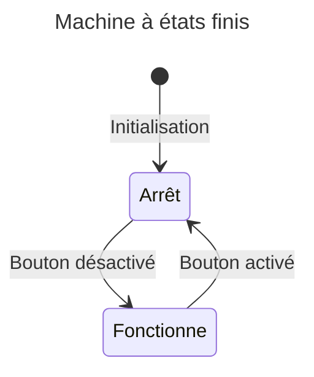
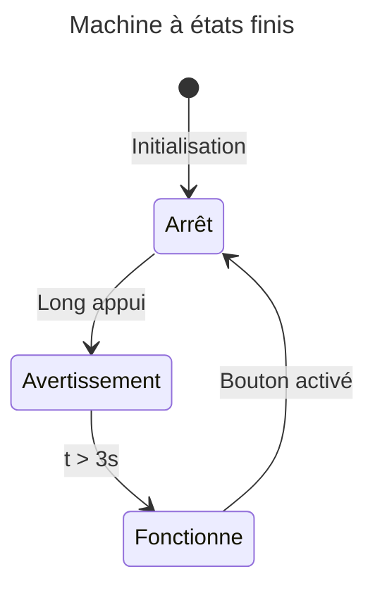

# Revisitons la machine à états finis

## Introduction
Nous avons vu les bases de la programmation orientée objet en C++ dans le cours précédent. Nous allons maintenant voir comment utiliser la programmation orientée objet pour créer une machine à états finis. Cependant avant de débuter, nous allons voir une nouvelle façon de structurer notre code pour les machines à états finis. Nous allons séparer les blocs d'entrée, d'exécution et de sortie pour chaque état. Cela nous permettra de mieux structurer notre code et de le rendre plus lisible.

---

## Première version
Dans la première version de la machine à états finis, nous avons utilisé une structure simple pour gérer les états et les transitions. Tout le code était regroupé dans une seule fonction pour chaque état.

Il y avait certaines lacunes qui pouvaient devenir compliquées à gérer. Dans plusieurs situations, il est nécessaire de préparer un état avant de l'exécuter ou encore de faire des actions pour sortir d'un état. Par exemple, si nous avons un état qui fait tourner un moteur mais il doit allumer une DEL avant de s'exécuter, nous allons utiliser l'entrée pour allumer la DEL. De plus, si nous avons un état qui doit éteindre une DEL lorsque nous sortons de l'état, nous allons utiliser la sortie pour éteindre la DEL.

---

## Nouvelle structure
Comme dans l'exemple précédent, les états nécessitaient une certaine préparation avant de s'exécuter ou encore des modifications pour sortir de l'état. Cela pouvait vous occasionner des petits maux de tête. Nous allons voir comment séparer un état en 3 parties: **l'entrée**, **l'exécution** et **la sortie**.

**Prenez note que les entrées et sorties peuvent être optionnelles**. Par exemple, si vous avez un état qui ne nécessite pas de préparation avant de s'exécuter, vous n'aurez pas besoin d'une fonction d'entrée.

---

## Les états
Comme indiqué dans la section précédente, un état peut être séparé en 3 parties: l'entrée, l'exécution et la sortie.

### L'entrée
L'entrée est exécutée lorsque l'état est activé. Elle est utilisée pour préparer l'état avant son exécution. Par exemple, si nous avons un état qui doit allumer une DEL avant de s'exécuter, nous allons utiliser l'entrée pour allumer la DEL.

L'entrée est le code d'initialisation de l'état.

```cpp
  // Drapeau indiquant si c'est la première fois que l'on entre dans l'état
  static bool firstTime = true;

  // ...

  // Code d'ENTRÉE
  if (firstTime) {
    // Code d'initialisation de l'état
    // Initialiser les variables

    // Allumer la DEL
    digitalWrite(ledMotorPin, HIGH);

    // Remettre le drapeau à false pour ne pas réexécuter l'entrée au prochain tour de boucle
    firstTime = false;
    return;
  }

  // ...
```

### L'exécution
Les instructions sont exécutées tant que l'état est actif. Ce bloc est utilisé pour exécuter l'état. 

Par exemple, le moteur doit tourner. Nous allons utiliser l'exécution pour
faire tourner le moteur.

```cpp

  // ...

  // Code d'EXÉCUTION de l'état
  // Code de la job à faire
  // Exemple : Faire tourner le moteur
  digitalWrite(motorPin, HIGH);

  // ...
```

### La sortie
La sortie est exécutée lorsqu'une transition est validée. Elle est utilisée pour terminer l'état.

Par exemple, le moteur tourne tant et aussi longtemps qu'un bouton n'est pas appuyé. De plus, on veut que la DEL s'éteigne lorsque le moteur arrête de tourner. Nous allons utiliser la sortie pour éteindre la DEL.


```cpp

  // ...

  // Code de TRANSITION
  // Il s'agit de la transition qui permet de sortir de l'état
  // Qu'est-ce qui fait que l'on sort de l'état?
  bool transition = buttonPressed;

  // Il est possible d'avoir plusieurs transitions

  if (transition) {
    // Code de SORTIE
    // Code pour terminer l'état

    // Éteindre la DEL
    digitalWrite(ledMotorPin, LOW);

    // Arrêter le moteur
    digitalWrite(motorPin, LOW);

    firstTime = true;
    
    appState = MOTOR_STOP;
    
  }

  // ...
```

#### Seconde transition
Il est possible d'avoir plusieurs transitions. Par exemple, en plus du clic du bouton, nous pouvons aussi faire en sorte que le moteur arrête de tourner après un certain délai. Nous allons utiliser une seconde transition pour cela.

```cpp
  // moment de sortie
  static unsigned long exitTime = 0;

  // Code d'entrée
  if (firstTime) {
    // Code existant de l'entrée
    // ...

    exitTime = ct + 3000; // Par exemple, on veut que le moteur arrête de tourner après 3 secondes
    firstTime = false;
    // ...
  }
    

  // ...
  // Code de TRANSITION
  bool transition = buttonPressed;
  bool transition2 = ct > exitTime;

  if (transition || transition2) {
    // Code de SORTIE
    // Code pour terminer l'état

    // Éteindre la DEL
    digitalWrite(ledMotorPin, LOW);

    // Arrêter le moteur
    digitalWrite(motorPin, LOW);

    firstTime = true;
    
    appState = MOTOR_STOP;
    
  }
```
 


### Exemple

Voici un exemple quasiment complet d'une machine à états finis qui gère l'état d'un moteur lorsqu'un bouton est appuyé. Le moteur tourne tant que le bouton n'est pas réappuyé ou que 3 secondes ne sont pas écoulées. De plus, une DEL est allumée lorsque le moteur tourne et elle s'éteint lorsque le moteur arrête de tourner.

```cpp
#include <OneButton.h>

// Définition des états
enum State {
    MOTOR_STOP,
    MOTOR_SPIN
};

void motorStopState();
void motorSpinState();

OneButton button(buttonPin);
bool buttonPressed = false;

// Définition des états
State state = MOTOR_STOP;

void setup() {
  pinMode(ledPin, OUTPUT);
  pinMode(motorPin, OUTPUT);
  
  button.begin();
  button.attachClick(buttonClick);
}

void buttonClick() {
  buttonPressed = true;
}


void loop() {
  unsigned long currentTime = millis();

  switch (state) {
      case MOTOR_STOP:
          motorStopState();
          break;
      case MOTOR_SPIN:
          motorSpinState();
          break;
  }
  button.tick();
}

void motorStopState(unsigned long ct) {
    static bool firstTime = true;

    if (firstTime) {
        // Code d'initialisation de l'état
        // Initialiser les variables

        // Éteindre la DEL
        digitalWrite(ledMotorPin, LOW);

        firstTime = false;
        return;
    }

    // Code d'EXÉCUTION de l'état
    digitalWrite(motorPin, LOW);

    // Code de TRANSITION
    // Il s'agit de la transition qui permet de sortir de l'état
    // Qu'est-ce qui fait que l'on sort de l'état?
    bool transition = buttonPressed;

    // Il est possible d'avoir plusieurs transitions

    if (transition) {
        // Code de SORTIE
        // Code pour terminer l'état
        buttonPressed = false;

        firstTime = true;
        state = MOTOR_SPIN;
    }
}

void motorSpinState(unsigned long ct) {
    static bool firstTime = true;
    static unsigned long exitTime = 0;

     if (firstTime) {
        // Code d'initialisation de l'état
        // Initialiser les variables

        // Allumer la DEL
        digitalWrite(ledMotorPin, HIGH);

        // Par exemple, on veut que le moteur arrête de tourner après 3 secondes
        exitTime = ct + 3000; 

        firstTime = false;
        return;
    }

    // Code d'EXÉCUTION de l'état
    digitalWrite(motorPin, HIGH);

    // Code de TRANSITION
    // Il s'agit de la transition qui permet de sortir de l'état
    // Qu'est-ce qui fait que l'on sort de l'état?
    bool transition = buttonPressed;
    bool transition2 = ct > exitTime;

    // Il est possible d'avoir plusieurs transitions
    if (transition || transition2) {
        // Code de SORTIE
        // Code pour terminer l'état

        // Descendre le drapeau de bouton appuyé
        // car on a consommé l'événement du bouton appuyé
        buttonPressed = false;

        // Éteindre la DEL
        digitalWrite(ledMotorPin, LOW);

        // Arrêter le moteur
        digitalWrite(motorPin, LOW);

        firstTime = true;
        state = MOTOR_STOP;
    }

}
```

!!! warning "Attention"
    Dans le code ci-dessus, les transitions sont fusionnées dans le même bloc, car elles pointent vers le même état. Cependant, il est possible d'avoir des transitions avec des codes de sortie différents. Dans ce cas, il faut séparer les transitions dans des blocs différents.
    
    Le code ci-dessus est un exemple pour illustrer la structure d'une machine à états finis. Il n'est pas complet et il peut y avoir des erreurs. Il est de votre responsabilité de compléter le code et de le tester.


### Résumé

La mécanique de la machine à états finis est simple. Il suffit de définir :

- les états requis
- les transitions entre les états 
- les fonctions pour chaque état.

La fonction est divisée en 3 parties:

- **l'entrée**
- **l'exécution**
- **les sorties**

Les sorties sont déclenchées par des transitions. Les transitions sont déclenchées par des événements ou des délais.

---

## Définir les états requis
Avant de commencer à coder, il est important de définir les états requis pour notre machine à états finis. De plus, il faut aussi définir les transitions entre les états.

Un astuce qui permet de simplifier la structure de l'application est de se faire un schéma de la machine à états finis. Cela permet de visualiser les états et les transitions.

Voici un exemple de schéma de machine à états finis.



On identifie deux états:
- Arrêt
- Fonctionne

On identifie deux transitions:
- Bouton activé
- Bouton désactivé

---

## Utiliser la programmation orientée objet
Reprenons l'exemple précédent, mais convertissons-le en utilisant la programmation orientée objet. Nous allons aussi modifier le projet.

- Avant que le moteur entre en action, pour avertir l'utilisateur on doit faire clignoter une DEL pendant 3 secondes.
- Pendant que le moteur tourne, la DEL doit être allumée.
- Pendant que le moteur arrête de tourner, la DEL doit être éteinte graduellement.




### Définir la classe
La classe doit avoir un constructeur qui prend en paramètre la broche du bouton, la broche de la DEL ainsi que celle du moteur. Elle doit aussi avoir une fonction `update()` qui devra être appelée dans la fonction `loop()`.

Voici le code pour l'entête de la classe.

```cpp
#pragma once
#include <OneButton.h>

class Motor {
public:
  enum State { OFF,
               ON,
               WARN, // => Avertissement
              };

  Motor(int motorPin, int ledPin, int buttonPin);

  void update();

private:
  const int _motorPin;
  const int _ledPin;
  unsigned long _previousTime = 0;
  unsigned long _currentTime = 0;
  
  const int _blinkRate = 50;
  
  bool _buttonPressed = false;
  bool _buttonLongPressed = false;

  State _state = OFF;

  OneButton _button;

  static Motor *instance;
  static void buttonClick(void *context);
  static void buttonLongPress(void *context);

  void offState();
  void warnState();
  void onState();
};
```

Voici le code du fichier .cpp.

```cpp
#include "Motor.h"

// Initialisation de l'instance static du moteur
// Pour l'instant null
Motor *Motor::instance = nullptr;

// Constructeur
Motor::Motor(int motorPin, int ledPin, int buttonPin)
  : _motorPin(motorPin), _ledPin(ledPin), _button(buttonPin, true, true) {
  pinMode(_motorPin, OUTPUT);
  pinMode(_ledPin, OUTPUT);

  _button.setDebounceMs(50);
  _button.setClickMs(10);
  _button.setPressMs(1000);

  _button.attachClick(buttonClick, this);
  _button.attachLongPressStop(buttonLongPress, this);
}

void Motor::buttonClick(void* context) {
  Motor *self = static_cast<Motor*>(context);
  self->_buttonPressed = true;
  self->_previousTime = millis();
}

void Motor::buttonLongPress(void* context) {
  Motor *self = static_cast<Motor*>(context);
  self->_buttonLongPressed = true;
  self->_previousTime = millis();
}

void Motor::offState() {
  static unsigned long lastTime = 0;
  static bool firstTime = true;

  if (firstTime) {
    firstTime = false;
    digitalWrite(_motorPin, LOW);
    digitalWrite(_ledPin, LOW);

    Serial.println("Off state");
    return;
  }
 
  bool transition = _buttonLongPressed;

  if (transition) {
    _buttonLongPressed = false;
    _state = WARN;
    firstTime = true;
  }
}

void Motor::warnState() {
  static unsigned long lastTime = 0;
  static unsigned long exitTime = 0;
  static bool firstTime = true;
  static bool ledState = LOW;


  if (firstTime) {
    firstTime = false;
    exitTime = _currentTime + 3000;
    Serial.println("Warn state");
    return;
  }

  if (_currentTime - lastTime < _blinkRate) return;

  lastTime = _currentTime;

  ledState = !ledState;
  digitalWrite(_ledPin, ledState);

  bool transition = _currentTime > exitTime;

  if (transition) {
    firstTime = true;
    _state = ON;
  }
}

void Motor::onState() {
  static unsigned long lastTime = 0;
  static bool firstTime = true;

  if (firstTime) {
    firstTime = false;
    digitalWrite(_motorPin, HIGH);
    digitalWrite(_ledPin, HIGH);

    Serial.println("On state");
    return;
  }

  bool transition = _buttonPressed;

  if (transition) {
    _buttonPressed = false;
    _state = OFF;
    firstTime = true;
  }
}


void Motor::update() {
  _currentTime = millis();
  
  switch (_state) {
    case OFF:
      offState();
      break;
    case WARN:
      warnState();
      break;
    case ON:
      onState();
      break;
  }
  _button.tick();
}
```

Dans votre fichier .ino, vous pouvez maintenant utiliser la classe `Motor`.

```cpp
#include "Motor.h"

Motor motor(3, 13, 2); // Exemple: broche moteur=3, DEL=13, bouton=2

void setup() {
  Serial.begin(9600);
}

void loop() {
  motor.update();
}
```

**Note sur les `static_cast`**

Dans la bibliothèque `OneButton`, les fonctions de rappel (callbacks) doivent avoir cette signature :

```cpp
void attachClick(parameterizedCallbackFunction newFunction, void *parameter);
```

Lorsque vous appelez `attachClick(callback, this)`, la fonction reçoit un `void*` que nous devons convertir en pointeur vers la classe adéquate `(Motor*)`. C’est le rôle de `static_cast<Motor*>(context)` :

```cpp
// On retransforme le void* context en Motor* pour accéder à l'instance
Motor* self = static_cast<Motor*>(context);
```

Le `static_cast<Motor*>(context)` nous permet de convertir le paramètre générique `void*` reçu par la fonction de rappel en un pointeur de type `Motor*`. Ainsi, on peut accéder aux variables et méthodes de l'instance `Motor` liée au bouton correspondant. Cette conversion est nécessaire, car la bibliothèque `OneButton` ne connaît pas le type réel de l'objet passé en paramètre.

---

## Conclusion
Nous avons vu comment réaliser une machine à états finis dans une classe qui définit un système. Lorsque nous sommes en mesure de déterminer les éléments d'un système, nous pouvons les encapsuler dans une classe. Cela nous permet de mieux structurer notre code et de le rendre plus lisible.
