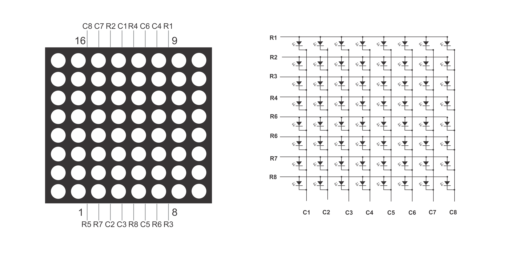

# Contrôler une matrice de LED (MAX7219) avec la librairie U8g2

---

## Introduction


La matrice de LED dans votre kit est sur un circuit imprimé. Ce circuit intègre un contrôleur **MAX7219**. Ce dernier permet, entre autres, de contrôler une matrice de LED 8×8. Il est possible d’enchaîner plusieurs modules pour créer des affichages plus grands.

Le MAX7219 est un circuit intégré qui permet de contrôler des matrices de LED, des afficheurs 7 segments et d'autres types d'afficheurs. Il utilise le SPI (*Serial Peripheral Interface*) pour communiquer avec un microcontrôleur, ce qui le rend facile à utiliser avec des plateformes comme Arduino.


---

## Comment fonctionne une matrice de LED?
En excluant le MAX7219, une matrice de LED est un ensemble de diodes électroluminescentes (LED) organisées en lignes et colonnes. Chaque LED peut être allumée ou éteinte individuellement. 

Voici le schéma représentant une matrice de LED 8×8 :



En alimentant une ligne et en sélectionnant une colonne, on peut allumer une LED spécifique. Par exemple, si on alimente la ligne 3 (R3) et qu'on sélectionne la colonne 5 (C5), la LED à l'intersection de cette ligne et colonne s'allumera.

En utilisant cette technique, chaque colonne est activée pendant un très court instant, et en même temps, les LED de cette colonne sont allumées en adressant la ligne correspondante. En conséquence, pas plus de huit LED ne sont allumées à la fois. Les colonnes sont commutées si rapidement (des centaines ou des milliers de fois par seconde) que l'œil humain perçoit l'affichage comme entièrement allumé.


Brancher une matrice de LED directement à un microcontrôleur peut être compliqué, car il faut gérer chaque LED individuellement. Cela nécessiterait de nombreuses broches d'E/S (Entrée/Sortie) et un code complexe pour gérer l'allumage et l'extinction des LED.

.jpg>)

Des modules comme le **MAX7219** simplifient cette tâche.

---

## Le MAX7219
Comme mentionné précédemment, le **MAX7219** est un circuit intégré qui permet de contrôler des matrices de LED. Il utilise une interface SPI pour communiquer avec un microcontrôleur, ce qui réduit le nombre de broches nécessaires pour contrôler plusieurs LED.


Le MAX7219 gère l'allumage et l'extinction des LED, ainsi que la gestion de la luminosité. Il peut contrôler jusqu'à 64 LED individuellement, ce qui est parfait pour une matrice 8×8.

Le MAX7219 est capable de gérer plusieurs matrices en série, ce qui permet d'augmenter la taille de l'affichage sans ajouter de complexité au câblage.


---

## La librairie U8g2
Pour contrôler le MAX7219, il n'est pas nécessaire d'utiliser une bibliothèque. Cependant, l'utilisation d'une bibliothèque facilite grandement le processus. La bibliothèque **U8g2** est l'une des plus populaires pour la gestion d'afficheurs graphiques et de matrices de LED.

Elle offre une interface simple pour dessiner des formes, afficher du texte et gérer la luminosité.

> Note : Certains étudiants possèdent une écran **SSD1306**, la librairie U8g2 permet aussi de gérer ce type d'écran. Il est donc possible d'utiliser la même librairie pour différents types d'afficheurs.

---

## Matériel requis
En plus du matériel usuel pour faire fonctionner un Arduino, vous aurez besoin de :
- **1** matrice de LED 8×8 avec contrôleur **MAX7219**  

---

## Branchement
Le module MAX7219 communique via un bus de type **SPI** (Serial Peripheral Interface). Les broches habituelles pour un branchement SPI sont :
- **MOSI** (Master Out Slave In)
- **MISO** (Master In Slave Out)
- **SCK** (Serial Clock)
- **SS** (Slave Select)  
- **GND** et **5V**

Cependant, le MAX7219 n'utilise pas la broche **MISO**. Excluant cette broche, le MAX7219 utilise les autres broches SPI pour la communication. 

Selon la configuration que vous allez utiliser avec **u8g2**, vous pouvez choisir d’utiliser **SW SPI** (logiciel) ou **HW SPI** (matériel). Ci-dessous, on présente un branchement en mode **SW SPI** (simulation par logiciel).  

Par exemple :
- **CLC**  (CLOCK)→ 30
- **DIN** (Data IN) → 34
- **CS** (Chip Select) → 32


## Code d’exemple
Voici un code minimaliste avec la librairie **u8g2**. On installe la bibliothèque « **U8g2** » via le gestionnaire de bibliothèques Arduino. Ensuite, on peut utiliser la classe `U8G2_MAX7219_64X8_...` ou `U8G2_MAX7219_32X8_...` selon la taille de votre module. Ici, c’est un **8×8** unique, donc 8 colonnes × 8 rangées :

```cpp
#include <U8g2lib.h>

// Définition des broches utilisées pour la communication SPI logicielle
#define CLK_PIN 30
#define DIN_PIN 34
#define CS_PIN  32  // Chip Select

// Pour un module unique 8×8
//  - Si la documentation indique 8×8, U8g2 utilise l'appellation 8 de haut × 8 multiples de large
//  - Parfois, on choisit U8G2_MAX7219_8X8_F_4W_SW_SPI ou un modèle équivalent
U8G2_MAX7219_8X8_F_4W_SW_SPI u8g2(
  U8G2_R0,       // rotation
  /* clock=*/ CLK_PIN, // pin Arduino reliée à CLK (horloge)
  /* data=*/ DIN_PIN,  // pin Arduino reliée à DIN (données)
  /* cs=*/ CS_PIN,    // pin Arduino reliée à CS (chip select)
  /* dc=*/ U8X8_PIN_NONE,
  /* reset=*/ U8X8_PIN_NONE
);

void setup() {
  // Initialiser la bibliothèque
  u8g2.begin();

  // Ajuster la luminosité globale : 
  //    0 = plus sombre, 255 = plus lumineux (selon la librairie, la limite peut être 0–255 ou 0–15).
  u8g2.setContrast(5);
  
  // Sélection de la police :
  // On peut utiliser "u8g2_font_6x10_tr" ou autre selon vos préférences
  u8g2.setFont(u8g2_font_4x6_tr);

  // Optionnel : effacer la matrice au démarrage
  u8g2.clearBuffer(); 
  u8g2.sendBuffer(); 
}

void loop() {
  // Effacer la mémoire tampon
  u8g2.clearBuffer();

  // Écrire un texte à la position (x=0, y=7) 
  // Noter que sur MAX7219, le repère (0,0) est dans le coin haut-gauche
  // et la coordonnée Y correspond à la ligne de base du texte.
  u8g2.drawStr(0, 7, "AZ");
  
  // Transférer le contenu du buffer à l’affichage
  u8g2.sendBuffer();
  
  delay(1000);
}
```

### Explication du code
1. **Inclusion des bibliothèques** :  
   - `U8g2lib.h` : fournit les classes permettant de gérer divers écrans, y compris le MAX7219.
2. **Instantiation** :  
   - On crée un objet `u8g2` spécifique au module **MAX7219** 8×8, avec **SW SPI** (logiciel).  
   - On indique la rotation (`U8G2_R0` → pas de rotation), ainsi que les pins pour la communication (CLK, DATA, CS).  
3. **Dans `setup()`** :  
   - `u8g2.begin()` initialise le module.  
   - `u8g2.setContrast(5)` met la luminosité au niveau 5 (ajustez selon vos goûts ou la documentation).
   - On choisit une police (`setFont`).  
   - Nettoyage initial de l’afficheur si désiré (`clearBuffer` + `sendBuffer`).  
4. **Dans `loop()`** :  
   - On efface le tampon (`clearBuffer`).  
   - On dessine du texte à la position `(x=0, y=7)`.  
   - On envoie au module (`sendBuffer`) pour l’affichage réel.  
   - On attend une seconde.  


---

## Fonctions de bases utiles

Voici un tableau des fonctions de base qui peuvent être utiles pour dessiner sur la matrice de LED :

| Fonction                | Description                                                                 |
|------------------------|-----------------------------------------------------------------------------|
| `drawStr(x, y, "Texte")` | Affiche une chaîne de caractères à la position `(x, y)` sur la matrice.    |
| `drawBox(x, y, w, h)`   | Dessine un rectangle plein à la position `(x, y)` avec une largeur `w` et une hauteur `h`. |
| `drawFrame(x, y, w, h)` | Dessine un cadre (rectangle vide) à la position `(x, y)` avec une largeur `w` et une hauteur `h`. |
| `drawCircle(x, y, r)`   | Dessine un cercle centré à la position `(x, y)` avec un rayon `r`.        |
| `drawLine(x1, y1, x2, y2)` | Dessine une ligne entre les points `(x1, y1)` et `(x2, y2)`.            |
| `drawPixel(x, y)`       | Dessine un pixel à la position `(x, y)`.                                   |

Plusieurs autres fonctions sont disponibles dans [la documentation de la bibliothèque U8g2](https://github.com/olikraus/u8g2/wiki). Vous pouvez également dessiner des images bitmap, des graphiques et d'autres formes.


<details>
<summary>Exemple qui dessine plusieurs formes</summary>

```cpp
/*
   Exemple d'affichage séquentiel de différentes fonctions de tracé
   sur une matrice 8×8 avec MAX7219, via la librairie U8g2.

   Matériel :
     - MAX7219 (1 module 8×8)
     - Arduino (UNO, Mega, etc.)
     - Brancher en mode SPI logiciel :
         CLK_PIN -> CLK
         DIN_PIN -> DIN
         CS_PIN  -> CS (LOAD)
*/

#include <Arduino.h>
#include <U8g2lib.h>

// Broches pour SPI logiciel (à ajuster selon votre circuit)
#define CLK_PIN  30
#define DIN_PIN  34
#define CS_PIN   32

// Création de l'objet U8g2 pour un module 8×8 MAX7219
U8G2_MAX7219_8X8_F_4W_SW_SPI u8g2(
  U8G2_R0,  // Rotation
  CLK_PIN,  // clock
  DIN_PIN,  // data
  CS_PIN,   // cs
  U8X8_PIN_NONE, // dc
  U8X8_PIN_NONE  // reset
);

// Variables pour gérer le basculement de mode toutes les secondes
uint8_t appState = 0;            // Mode actuel (0 à 5)
unsigned long prevModeTime;  // Pour se souvenir du temps précédent

// Pour l'animation du pixel itinérant (mode 0)
uint8_t pixelX = 0;
uint8_t pixelY = 0;
bool goingRight = true;
bool goingDown = true;

// Délai d'animation du pixel en ms
const unsigned long moveInterval = 100; 
// Délai de changement de mode en ms
const unsigned long modeInterval = 1000;

// --------------------------------------------------------------
// setup()
// --------------------------------------------------------------
void setup() {
  u8g2.begin();
  // Sur un MAX7219, la plage de luminosité est environ 0..15 (selon la version)
  // On peut mettre setContrast(15) pour plus brillant
  u8g2.setContrast(10);
  
  // Petit délai initial pour la stabilisation
  delay(500);

  prevModeTime = millis();
}

// --------------------------------------------------------------
// Fonction : demoPixelScan
//   Mode 0 : un pixel bouge dans l'écran, rebondit sur les bords
// --------------------------------------------------------------
void demoPixelScan() {
  static unsigned long lastTime = millis();
      
  // Gérer l'animation : tous les moveInterval ms
  unsigned long currentTime = millis();
  if (currentTime - lastTime >= moveInterval) {
    lastTime = currentTime;
    
    // Mise à jour de pixelX
    if (goingRight) {
      if (pixelX < 7) pixelX++;
      else goingRight = false;
    } else {
      if (pixelX > 0) pixelX--;
      else goingRight = true;
    }

    // Mise à jour de pixelY
    if (goingDown) {
      if (pixelY < 7) pixelY++;
      else goingDown = false;
    } else {
      if (pixelY > 0) pixelY--;
      else goingDown = true;
    }
  }
  
  // Dessin du pixel
  u8g2.drawPixel(pixelX, pixelY);
}

// --------------------------------------------------------------
// Fonction : demoHLineVLine
//   Mode 1 : trace 2 lignes horizontales et 2 lignes verticales
// --------------------------------------------------------------
void demoHLineVLine() {
  // Lignes horizontales
  //  - y=0, de x=0 à x=7
  //  - y=7, de x=0 à x=7
  u8g2.drawHLine(0, 0, 8);
  u8g2.drawHLine(0, 7, 8);

  // Lignes verticales
  //  - x=0, de y=0 à y=7
  //  - x=7, de y=0 à y=7
  u8g2.drawVLine(0, 0, 8);
  u8g2.drawVLine(7, 0, 8);
}

// --------------------------------------------------------------
// Fonction : demoLine
//   Mode 2 : trace une ligne diagonale
// --------------------------------------------------------------
void demoLine() {
  // On dessine une ligne de (0,0) à (7,7)
  u8g2.drawLine(0, 0, 7, 7);
}

// --------------------------------------------------------------
// Fonction : demoBox
//   Mode 3 : dessine un petit carré (4×4) centré
// --------------------------------------------------------------
void demoBox() {
  // Sur 8×8, on peut dessiner un box 4×4 au milieu
  // On le place grosso modo au centre
  //  => coin supérieur gauche vers (2,2)
  //  => 4 pixels de large, 4 pixels de haut
  u8g2.drawBox(2, 2, 4, 4);
}

// --------------------------------------------------------------
// Fonction : demoCircle
//   Mode 4 : dessine un cercle. Sur 8×8, c'est minuscule!
// --------------------------------------------------------------
void demoCircle() {
  // Dessin d'un petit cercle de rayon 3 centré en (4,4)
  // Note : Y=4, X=4 => c'est environ le centre
  // Sur 8×8, on fait ce qu'on peut ;)
  u8g2.drawCircle(4, 4, 3, U8G2_DRAW_ALL);
}

// --------------------------------------------------------------
// Fonction : demoTriangle
//   Mode 5 : dessine un triangle
// --------------------------------------------------------------
void demoTriangle() {
  // Bizarrement, il faut mettre -1 à y
  // ça doit être un truc d'arrondi
  u8g2.drawTriangle(3, -1, 7, 8, 0, 6);
}

// --------------------------------------------------------------
// loop()
//   À chaque itération :
//
//   1) Tous les modeInterval ms, on passe au mode suivant
//   2) On efface, on dessine selon le mode, on envoie
// --------------------------------------------------------------
void loop() {
  unsigned long currentTime = millis();

  // Gérer le changement de mode toutes les secondes
  if (currentTime - prevModeTime >= modeInterval) {
    prevModeTime = currentTime;
    appState++;
    if (appState > 5) appState = 0;
    
    // Réinitialiser le pixel pour le mode 0
    if (appState == 0) {
      pixelX = 0;
      pixelY = 0;
      goingRight = true;
      goingDown = true;
    }
  }

  // Effacer le buffer avant de dessiner
  u8g2.clearBuffer();

  // Dessiner selon le mode
  switch (appState) {
    case 0: // Pixel itinérant
      demoPixelScan();
      break;
    case 1: // Lignes horizontales & verticales
      demoHLineVLine();
      break;
    case 2: // drawLine
      demoLine();
      break;
    case 3: // drawBox
      demoBox();
      break;
    case 4: // drawCircle
      demoCircle();
      break;
    case 5: // drawTriangle
      demoTriangle();
      break;
  }

  // Envoyer l'image à l'afficheur
  u8g2.sendBuffer();

  // Petit délai d'itération
  delay(50);
}
```
</details>

---

## Faire défiler du texte
Je vous fournis un exemple de code pour faire défiler du texte sur la matrice de LED. Vous pouvez l'adapter selon vos besoins.

<details>
<summary>Exemple de défilement de texte</summary>

```cpp
/*
  Basé sur : https://github.com/olikraus/u8g2/blob/master/sys/arduino/u8g2_full_buffer/MAX7219_Scroll/MAX7219_Scroll.ino
  Exemple d'affichage défilant sur une matrice LED 8x8 contrôlée par un MAX7219
*/

#include <Arduino.h>
#include <U8g2lib.h>

// Définition des broches utilisées pour la communication SPI logicielle
#define CLK_PIN 30
#define DIN_PIN 34
#define CS_PIN  32  // Chip Select

// Définir le nombre de matrices chaînées (1 ou plus)
#define NOMBRE_MATRICES 1  // <-- Change ça selon ton montage
#define LARGEUR_POLICE 4 // Adapter pour la dimension de la police

// Initialisation de l'afficheur MAX7219 8x8 via SPI logiciel
U8G2_MAX7219_8X8_F_4W_SW_SPI display(U8G2_R0, /* clock=*/ CLK_PIN, /* data=*/ DIN_PIN, /* cs=*/ CS_PIN, /* dc=*/ U8X8_PIN_NONE, /* reset=*/ U8X8_PIN_NONE);

// Variables pour contrôler le défilement du texte
uint16_t position_bits = 0;  // Position actuelle du texte en bits
uint16_t longueur_bits;      // Longueur totale du texte en bits

// Texte à faire défiler sur l'afficheur
char *message = "    Salut de U8g2... Librairie Graphique pour Arduino    ";

// Largeur visible en pixels = nombre de matrices * 8
const uint8_t largeur_affichage = NOMBRE_MATRICES * 8;

void setup(void) {
  display.begin();                             // Initialiser l'afficheur
  
  display.setFont(u8g2_font_4x6_tr); // Choisir une police lisible
  display.setDisplayRotation(U8G2_R0);             // Assurer l’orientation par défaut
  display.setContrast(5); // Permet d'ajuster la luminosité (contraste) de l'affichage
  
  position_bits = 0;
  longueur_bits = strlen(message) * LARGEUR_POLICE + largeur_affichage;           // Calculer la longueur du texte en pixels (8 bits par caractère)
  
  display.clearBuffer();
  display.drawLine(0, 0, 7, 7);
  display.sendBuffer();
  delay(500);
  
  display.clearBuffer();
  display.drawLine(7, 0, 0, 7);
  display.sendBuffer();
  delay(500);
}

#define TAILLE_TAMPON 12

// Fonction pour dessiner une portion du texte à une position donnée (en bits)
void dessiner_message_a_position(const char *texte, uint16_t position_bits)
{
  char tampon[TAILLE_TAMPON];               // Tampon pour contenir une portion du texte
  uint16_t debut_caractere = position_bits / LARGEUR_POLICE; // Index du caractère de départ
  uint16_t i;

  // Copier une portion du texte dans le tampon
  for (i = 0; i < TAILLE_TAMPON - 1; i++) {
    tampon[i] = texte[debut_caractere + i];
    if (texte[debut_caractere + i] == '\0')
      break;
  }

  tampon[TAILLE_TAMPON - 1] = '\0'; // S'assurer que le tampon est bien terminé

  // Afficher le texte en tenant compte du décalage de bits (scroll horizontal)
  display.drawStr(-(position_bits & (LARGEUR_POLICE - 1)), 7, tampon);
}

void loop(void) {
  display.clearBuffer();                               // Effacer le contenu du tampon interne de l'afficheur
  dessiner_message_a_position(message, position_bits);   // Afficher une portion du texte à la bonne position
  display.sendBuffer();                                // Envoyer le tampon à l'afficheur physique
  
  position_bits++;                                       // Avancer d'un pixel
  
  if (position_bits >= longueur_bits) {
    position_bits = 0;                                   // Recommencer à zéro quand le texte a entièrement défilé
  }
  
  delay(60);                                             // Petite pause pour ralentir le défilement
}
```

</details>

---

**[Retour au sommaire du cours](../index.md)**  

*Fin de l’exemple pour un module unique : on a retiré la section multimatices.*

---

## Références
- [Interfacing 8x8 LED Matrix with Arduino](https://www.circuitstoday.com/interfacing-8x8-led-matrix-with-arduino)
- [Interfacing MAX7219 LED Dot Matrix Display with Arduino](https://lastminuteengineers.com/max7219-dot-matrix-arduino-tutorial/)
- [Vidéo : How to control 8x8 LED Matrix with MAX7219](https://www.youtube.com/watch?v=SGjQ-E3UD7A)
