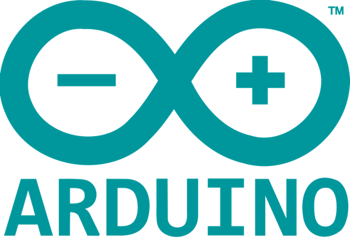
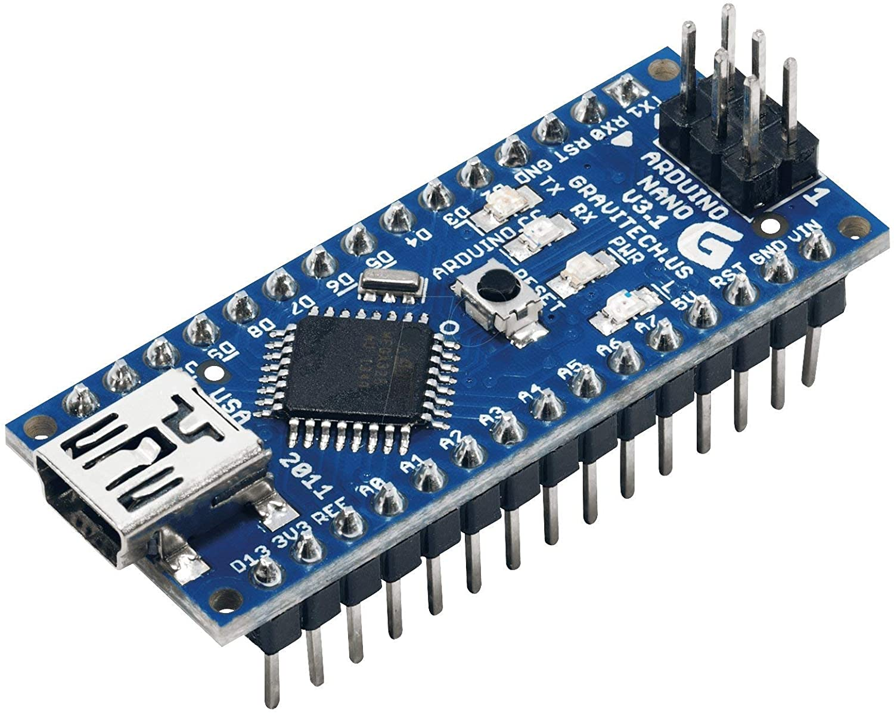
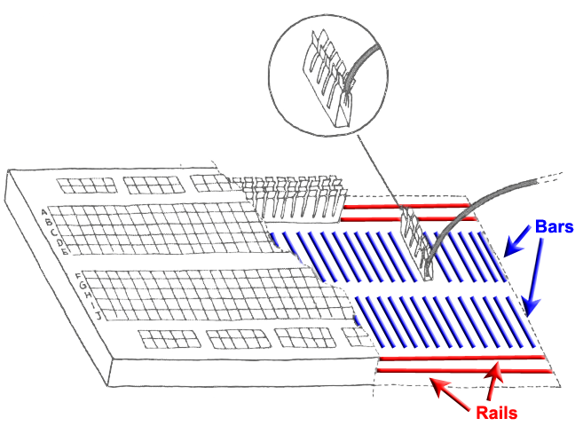
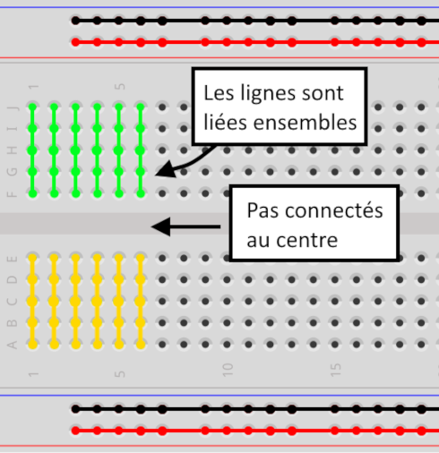
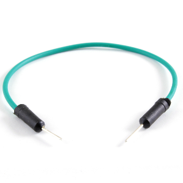
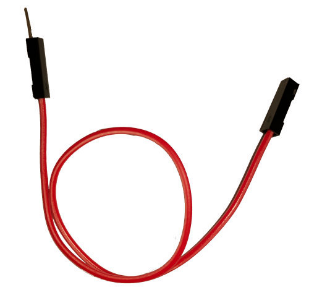
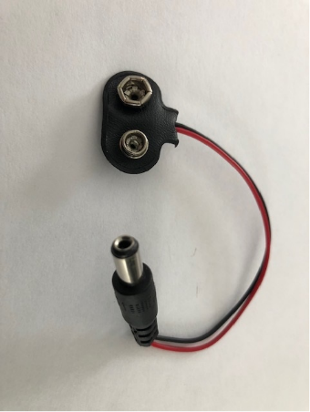
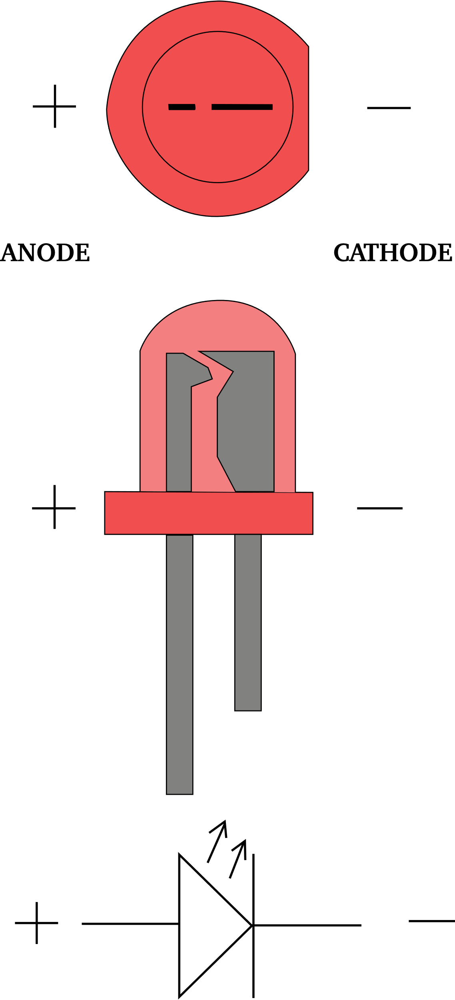

## ARDUINO

## Guide d’introduction 

- Auteur : Jean-Philippe Boulard (Mars 2022)
- Révision : Nicolas Bourré (H23)

---

## Introduction

## Qu’est-ce que Arduino?

Arduino est une plateforme de prototypage de type « *Open-Source* »
utilisant un circuit électronique et un microcontrôleur. Le
fonctionnement simple de ces cartes avec microcontrôleurs, réside dans
la possibilité à LIRE une information ENTRANTE (`INPUT`) puis après
analyse, de poser une ACTION (`OUTPUT`).

Il existe plusieurs types de cartes Arduino sur le marché. Chacune ayant
des caractéristiques propres malgré leurs très grands nombres de
similitudes. Voici les trois (3) modèles les plus communément utilisés :

---

### Arduino NANO

Il s’agit du modèle de base de petite dimension (45mm x 18mm). Le
contrôleur **ATMega328** fonctionne à 16MHz et il possède une mémoire de
32KB. Son connecteur USB est de type « Mini-B ».

(Référence complète : <https://docs.arduino.cc/hardware/nano> )

---

### Arduino UNO R3

Il s’agit du modèle le plus commun. Il dispose du même nombre de
connecteurs analogue (*pins*) que le modèle NANO. De dimension moyenne
(54mm x 69mm), il utilise le contrôleur **ATMega328P** à 16 MHz avec un
mémoire de 32KB. Son connecteur USB est de type « USB-B ».

(Référence complète : <https://docs.arduino.cc/hardware/uno-rev3> )

---

### Arduino MEGA 2560 (rev3)

Il s’agit du modèle plus *costaud*. De plus grande dimension (54mm x
102mm), il dispose de 54 connecteurs (*pins*) entrée et sortie. Il est
équipé du contrôleur **ATM2560** à 16MHz et d’une mémoire de 256KB. Son
connecteur USB est de type « USB-B ».

(Référence complète : <https://docs.arduino.cc/hardware/mega-2560> )

---

### Comparaison entre les tailles

(Source :
<https://www.arrow.com/en/research-and-events/articles/arduino-uno-vs-mega-vs-micro>
)

---

#### Tableau résumé

Tableau résumé des caractéristiques de base des trois principaux
modèles :

| **Modèle**       | **Dimension** | **Processeur** | **Mémoire** | **Connecteurs (*Pins*)** | **USB** |
|------------------|---------------|----------------|-------------|--------------------------|---------|
| NANO             | 45mm x 18mm   | ATMega328      | 32KB        | 14                       | Mini-B  |
| UNO R3           | 54mm x 69mm   | ATMega328P     | 32KB        | 14                       | USB-B   |
| MEGA 2560 (rev3) | 54mm x 102mm  | ATM2560        | 256KB       | 54                       | USB-B   |

### Références

Site officiel d’Arduino :
- <https://www.arduino.cc/en/Guide/Introduction>
- <https://www.arduino.cc/en/Main/Products>

---

## Composantes de base

Voici une liste de composantes de base qui sont utilisées pour la
conception de projets simples. Vous trouverez des photos, schémas et
informations de base pour chaque composante. Notez que vos projets
peuvent être aussi bonifiés avec les éléments de la liste « **Autres
composantes** » à la suite de cette section.

---

### Câble USB type USB-B

Le câble USB permet de relier la carte ARDUINO à un ordinateur afin d’y
transférer les applications (codes) que vous avez créées. Il permet
aussi d’alimenter la carte.

Après le transfert, le câble peut être retiré. Vous devez cependant,
alimenter votre carte avec une autre source d’énergie si vous désirez
qu’elle puisse fonctionner de manière autonome (batteries ou bloc
d’alimentation).

---

### Platine d'expérimentation sans soudure (*Breadboard*) {#platine-dexperimentation-sans-soudure-breadboard}

La platine d’expérimentation permet de réaliser un montage avec des composantes électroniques sans avoir à les souder.

- Elle est généralement composée de deux (2) sections de cinq (5) points
  linéaires chacune. Le nombre de points peut varier entre 400 et 800
  sur les platines standards. Chaque section peut être alimentée de
  manière indépendante. 
  

- Chaque colonne est identifiée par les lettres de l’alphabet. La
  première section de **A** à **E** et la seconde de **F** à **J**.
- Tous les points d’une ligne sont rattachés ensemble, i.e. ils agissent
  comme si c’était un seul fil. 
  
  

- Une ligne s’arrête avec l’encoche qui délimite les deux sections. 
  
  
  

Figure : Branchement interne d'une platine d’expérimentation

#### Schéma de branchement

Voici un schéma de branchement pour vous aider à comprendre l'intérieur de la platine d'expérimentation.

---

### Fil de raccordement M/M (*Jumper wires*)

Les fils de raccordement M/M (pour Mâle/Mâle) sont utilisés pour lier des composantes entre elles sur la platine de montage ainsi que vers la carte Arduino. Ils existent dans différentes longueurs et couleurs.

- Évitez d’utiliser des fils de trop grandes longueurs lors de la création de vos montages. Cela rend plus difficile la lecture visuelle de votre circuit.
- Essayez de respecter, autant que possible, les conventions de couleur afin de faciliter la lecture de vos circuits et ainsi vous permettre de relever rapidement les erreurs potentielles.

[Source : Hackster.io](https://www.hackster.io/super-kid/windows-remote-arduino-windows-remote-arduino-experience-a5ea4d)

### Fil de raccordement M/F (*Jumper wires)*

Les fils de raccordement M/F (pour Mâle/Femelle) sont utilisés pour lier
des modules de capteurs sur la platine de montage ainsi que vers la
carte Arduino. Ils existent dans différentes longueurs et couleurs.

- Évitez d’utiliser des fils de trop grandes longueurs lors de la
  création de vos montages.
- Essayez de respecter, autant que possible, les conventions de couleur afin de faciliter la lecture de vos circuits et ainsi vous permettre de relever rapidement les erreurs potentielles.

[Source : http://electroniqueamateur.blogspot.com](http://electroniqueamateur.blogspot.com/2020/09/capteur-de-son-ky-038-et-arduino.html>)

---

### Attache batterie 9V (*9V battery snap*)

L’attache de batterie 9V permet à la carte Arduino d’avoir une
alimentation électrique sans être rattachée au port USB de l’ordinateur.

---

### DEL (*LED*)

(Blanche, rouge, verte, bleue, jaune)

Une DEL (*led*) ou **d**iodes **é**lectro**l**uminescentes est un
dispositif capable d’émettre de la lumière. La DEL est composée d’une
Anode (**+**) et d’une Cathode (**-**).

La DEL est **polarisée**. C’est-à-dire qu’elle laisse circuler
l’électricité que dans un sens ainsi il y a une polarité positive et négative. Il existe
des différences physiques qui vous permettent de différencier le côté
positif et le côté négatif. Le tableau ci-dessous vous permettra de les
repérer facilement.

<table>
<colgroup>
<col style="width: 39%" />
<col style="width: 22%" />
<col style="width: 37%" />
</colgroup>
<thead>
<tr class="header">
<th><strong>Anode (+)</strong></th>
<th rowspan="2">
(1)
</th>
<th><strong>Cathode (-)</strong></th>
</tr>
<tr class="odd">
<th><ul>
<li>
C'est la broche la plus <strong>longue</strong>;
</li>
<li>
À l‘intérieur de la DEL, c’est la portion la plus <strong>petite</strong>;
</li>
<li>
La bordure externe est présente et est
<strong>arrondie</strong>.
</li>
</ul></th>
<th><ul>
<li>
C’est la broche la plus <strong>courte</strong>;
</li>
<li>
À l’intérieur de la DEL, c’est la portion la plus
<strong>grosse</strong>;
</li>
<li>
La bordure externe est absente et est <strong>droite.</strong>
Truc : Ça fait un « - » comme négatif
</li>
</ul></th>
</tr>
</thead>
<tbody>
</tbody>
</table>

> \(1\) Source :
> <https://fr.wikipedia.org/wiki/Diode_%C3%A9lectroluminescente>

#### Intensité

Il est important de ne pas dépasser l’intensité admissible d’une DEL
pour ne pas la faire griller. ***<u>L’ajout d’une
résistance de 220 ohms en série est fortement recommandé.</u>***

DEL RVB (LED RGB)

Voir la section « **[Autres composantes](#autres-composantes)** » pour plus de détails sur les DEL RVB.

### Résistance (*Resistor*)

La résistance permet de contrôler l’intensité dans un circuit électrique. Elle se calcule en « **ohms (&#8486;)** ». Plus la valeur d’une résistance est élevée, moins elle laissera circuler l’électricité.

Dans le cadre de vos projets Arduino, elles devraient toujours être présentes sur le circuit d’une DEL.

Pour connaitre la valeur d’une résistance, vous pouvez :

- **Utiliser un multimètre :**
  
  

- **Utiliser le tableau suivant :**
  
  

  Mnémotechnique pour se souvenir de l'ordre des couleurs : **N**otre **B**ar **R**ouge **O**uvre **J**eudi **V**endredi **B**onne **V**odka **G**rosse **B**ière

## Autres composantes

### DEL RVB (*LED RGB*)

Les DEL RVB combinent trois DEL : une Rouge, une Verte et une Bleu. Cela
permet de produire une combinaison de 16 millions de nuances de lumière.

Elles existent en deux versions : Anode commune ou Cathode commune.

- Dans la version **Anode commune**, nous utilisons le **5V**.
- Dans la version **Cathode commune**, nous utilisons la **mise à terre (*ground*)**. (Il s’agit de la version présentée ici et disponible dans votre kit.)

> **Note :** Comme pour les autres LED, l’ajout d’une résistance de 220ohms en série est fortement recommandé (i.e une pour chaque tige qui contrôle la couleur)

Utiliser la Cathode (tige la plus grande) comme point de référence. Les autres « Anodes » servent pour chacune des couleurs.

[Source : www.lighting.philips.be](https://www.lighting.philips.be/fr/assistance/assistance-produit/faqs/white-light-and-colour/what-does-rgb-led-mean)

### Bouton poussoir momentané

Dans les kits fournis, il y a quelques boutons poussoirs.

| | |
|:--|:--|
|  | Le bouton poussoir permet à un utilisateur d’activer des fonctions dans le microcontrôleur. |
|  | À l’intérieur, il y a 2 côtés. Une connexion entre les deux côtés s’effectue lorsque le bouton est activé. |

On retrouve ces boutons dans plusieurs types d’objet électronique. Ils
sont généralement recouverts d’un plastique pour le design. Pouvez-vous
en nommer quelques objets du quotidien qui possèderaient des boutons
similaires?

#### Références {#references-1}
- <https://arduinogetstarted.com/tutorials/arduino-button>
- [https://www.cs.uregina.ca](https://www.cs.uregina.ca/Links/class-info/207/Online/Lab3/)

## Ressources et références

- [Site officiel ARDUINO](https://www.arduino.cc/)
- [Guide du « *MEGA2560 Starter Kit* »](https://cdn.shopify.com/s/files/1/0069/6513/3376/files/the_most_complete_starter_kit_for_mega_v1.0.17.7.9.pdf?5732344175148787081)
- [Matériels complets du « *MEGA2560 Starter Kit*»](https://drive.google.com/drive/folders/1xATtuchoAMSYJ-8C5U0dIHVlOGRsg2fC)
- [Tout sur les DEL (*All About LED’s*)](https://learn.adafruit.com/all-about-leds)
- [Chaine de formations sur ARDUINO (en français)](https://www.youtube.com/channel/UC1f3yfI3YFzhuoScarGSKwA)
