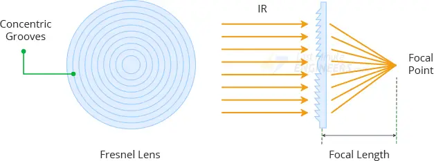

# Détection de mouvement avec le capteur PIR HC-SR501 <!-- omit in toc -->


---

# Table des matières <!-- omit in toc -->
- [Introduction](#introduction)
- [1. Fonctionnement du capteur PIR HC-SR501](#1-fonctionnement-du-capteur-pir-hc-sr501)
  - [1.1 Principe de détection](#11-principe-de-détection)
  - [1.2 Modes de fonctionnement](#12-modes-de-fonctionnement)
- [2. Branchement du HC-SR501 à l'Arduino](#2-branchement-du-hc-sr501-à-larduino)
  - [2.1 Matériel nécessaire](#21-matériel-nécessaire)
  - [2.2 Schéma de câblage](#22-schéma-de-câblage)
  - [2.3 Séquence d'initialisation](#23-séquence-dinitialisation)
- [3. Code Arduino pour détecter un mouvement](#3-code-arduino-pour-détecter-un-mouvement)
- [4. Réglage de la sensibilité et du délai](#4-réglage-de-la-sensibilité-et-du-délai)
  - [4.1 Sensibilité](#41-sensibilité)
  - [4.2 Temps de maintien](#42-temps-de-maintien)
- [5. Applications potentielles](#5-applications-potentielles)
- [Conclusion](#conclusion)
- [Exercices](#exercices)
- [Références](#références)

---

# Introduction

Le capteur **HC-SR501** est un capteur **PIR (Passive InfraRed)** qui permet de détecter un mouvement en analysant les variations du rayonnement infrarouge émis par les objets chauds, comme les humains ou les animaux. Il est couramment utilisé dans les systèmes d'alarme, l'automatisation de l'éclairage et les dispositifs domotiques.

Dans cette leçon, nous allons voir :
- **Comment fonctionne le capteur HC-SR501**
- **Comment le brancher**
- **Comment programmer l'Arduino pour détecter un mouvement**
- **Comment régler la sensibilité et le délai du capteur**

---

# 1. Fonctionnement du capteur PIR HC-SR501

## 1.1 Principe de détection
Tous les objets dont la température est supérieure au **zéro absolu (-273,15°C / 0 K)** émettent un rayonnement infrarouge. Le capteur PIR est conçu pour capter ces émissions et détecter toute variation soudaine, ce qui permet d’identifier un mouvement.

Le capteur **HC-SR501** est composé de :
- **Un capteur pyroélectrique**, qui détecte les variations du rayonnement infrarouge.
- **Une lentille de Fresnel**, qui focalise la lumière infrarouge sur le capteur.
- **Un circuit de traitement (BISS0001)**, qui amplifie et filtre le signal du capteur pour générer une sortie exploitable.



Lorsque le capteur détecte un mouvement, sa sortie **OUT** passe à l'état **HAUT** pendant une durée configurable.


## 1.2 Modes de fonctionnement

Le capteur **HC-SR501** dispose d’un cavalier permettant de sélectionner deux modes de déclenchement :

- **Mode "Single Trigger" (L - Low)** : Le capteur détecte un mouvement et génère une seule impulsion haute, même si l'objet reste dans son champ de détection.
- **Mode "Repeat Trigger" (H - High)** : Tant qu'un mouvement est détecté, la sortie reste **HAUT**, et le compteur de temporisation est réinitialisé à chaque détection.

> **Note** : Il se peut que vous ayez un modèle sans cavalier, dans ce cas, le mode de déclenchement est "Single Trigger" par défaut. Idéalement, on devrait faire un pontage entre le mode "Repeat Trigger" ou "Single Trigger pour choisir le mode de déclenchement souhaité.

---

# 2. Branchement du HC-SR501 à l'Arduino

## 2.1 Matériel nécessaire
- **Un Arduino (Uno, Mega, etc.)**
- **Un capteur PIR HC-SR501**
- **Une LED** (pour une indication visuelle)
- **Fils de connexion**
- **Une breadboard**

## 2.2 Schéma de câblage
Connectez le capteur **HC-SR501** comme suit :

| Broche HC-SR501 | Connexion Arduino |
|-----------------|------------------|
| **VCC**         | **5V**            |
| **GND**         | **GND**           |
| **OUT**         | **D2**            |

Pour l'indication visuelle, connectez une **LED** avec une **résistance de 220Ω** sur la broche **D7** de l’Arduino.

## 2.3 Séquence d'initialisation

Le capteur **HC-SR501** nécessite une **période de chauffe** d'environ **1 minute** après l'alimentation pour atteindre sa sensibilité maximale. Pendant cette période, la sortie **OUT** reste à l'état **HAUT**.

---

# 3. Code Arduino pour détecter un mouvement

Le programme suivant allume une LED lorsqu’un mouvement est détecté et envoie un message sur le **Moniteur Série**.

```cpp
const int pirPin = 2;    // Broche du capteur PIR
const int ledPin = 13;    // Broche de la LED
int pirState = 0;        // Variable pour stocker l'état du capteur PIR

void setup() {
  pinMode(pirPin, INPUT);    // Configuration du capteur en entrée
  pinMode(ledPin, OUTPUT);   // Configuration de la LED en sortie
  Serial.begin(9600);        // Initialisation de la communication série
}

void loop() {
  pirState = digitalRead(pirPin);   // Lire l'état du capteur PIR
  if (pirState == HIGH) {
    digitalWrite(ledPin, HIGH);     // Allumer la LED
    Serial.println("Mouvement détecté !");
  } else {
    digitalWrite(ledPin, LOW);      // Éteindre la LED
  }
  delay(100);  // Petite pause pour éviter une lecture trop fréquente
}
```

---

# 4. Réglage de la sensibilité et du délai

À l'arrière du **HC-SR501**, il y a deux potentiomètres permettant de régler :
- **La sensibilité** *(distance de détection entre 3 et 7 mètres)*
- **Le temps de maintien du signal HAUT** *(de 1 seconde à 3 minutes)*


## 4.1 Sensibilité
- Tournez le **potentiomètre de sensibilité** dans le **sens horaire** pour **augmenter** la portée de détection.
- Tournez dans le **sens antihoraire** pour **réduire** la portée.

## 4.2 Temps de maintien
- Tournez le **potentiomètre de délai** dans le **sens horaire** pour **augmenter** la durée pendant laquelle la sortie reste à **HAUT** après détection.
- Tournez dans le **sens antihoraire** pour **réduire** cette durée.

---

# 5. Applications potentielles

Le **HC-SR501** est utilisé dans plusieurs applications :
- **Systèmes d'alarme** : Détection d'intrusion et déclenchement d'une alarme sonore.
- **Éclairage automatique** : Allumage d’une lampe lorsqu’un mouvement est détecté.
- **Systèmes domotiques** : Intégration avec un microcontrôleur pour automatiser des tâches.
- **Compteurs de passage** : Suivi du nombre de personnes entrant dans une pièce.

---

# Conclusion

Le capteur **PIR HC-SR501** est un excellent choix pour la détection de mouvement dans les projets Arduino. Grâce à son faible coût, sa faible consommation et sa grande sensibilité, il permet de créer facilement des applications interactives.

**Points clés à retenir :**
- Facile à utiliser avec **trois broches seulement**  
- Détecte les **variations de rayonnement infrarouge** pour identifier un mouvement  
- Possède des réglages pour **ajuster la sensibilité et la durée du signal**

Avec ce guide, vous êtes maintenant prêt à intégrer le capteur **HC-SR501** dans vos projets Arduino !

---

# Exercices
1. Réaliser un système d'alarme qui déclenche une LED lorsqu'un mouvement est détecté et s'éteint après que la détection a cessé.

---

# Références
- [How HC-SR501 PIR Sensor Works & Interface It With Arduino](https://lastminuteengineers.com/pir-sensor-arduino-tutorial/)