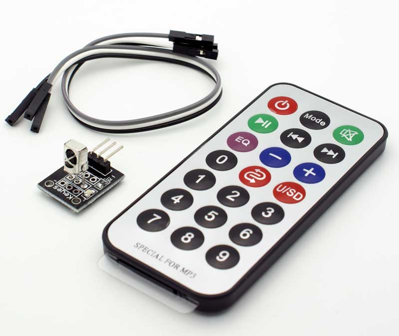
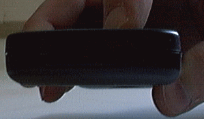
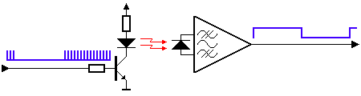

# La manette IR <!-- omit in toc -->

## Table des matières <!-- omit in toc -->
- [Introduction](#introduction)
- [Objectifs](#objectifs)
- [Manette IR théorie](#manette-ir-théorie)
- [Lumière infrarouge](#lumière-infrarouge)
- [Modulation](#modulation)
- [Références](#références)

# Introduction
Dans cette leçon, nous allons apprendre à utiliser une manette infrarouge (IR) pour envoyer des commandes à notre microcontrôleur. Nous allons utiliser un récepteur IR pour capter les signaux infrarouge.

Votre kit vient avec une manette IR et un récepteur IR qui ressemble à ceci:

Il se peut que votre modèle soit légèrement différent, mais le principe reste le même.

# Objectifs
- Comprendre le fonctionnement d'une manette IR
- Utiliser un récepteur IR pour capter les signaux infrarouge
- Utiliser la librairie `IRremote` pour décoder les signaux infrarouge

# Manette IR théorie
La manette IR est un dispositif de contrôle à distance qui envoie des signaux infrarouges. Ces signaux sont captés par un récepteur IR. Les signaux sont envoyés sous forme de codes binaires qui sont décodés par le microcontrôleur.

La méthode la moins chère pour contrôler à distance un appareil dans une plage visible est via la lumière infrarouge. Presque tous les équipements audio et vidéo peuvent être contrôlés de cette manière. En raison de cette utilisation généralisée, les composants nécessaires sont assez bon marché et facilement disponibles, ce qui en fait un choix idéal pour nous, les amateurs, d'utiliser le contrôle IR pour nos propres projets.

# Lumière infrarouge
La lumière infrarouge est actuellement la lumière normale avec une couleur particulière. Nous, les humains, ne pouvons pas voir cette couleur car sa longueur d'onde d'environ 950 nm est en dessous du spectre visible. C'est l'une des raisons pour lesquelles l'IR est choisi à des fins de contrôle à distance, nous voulons l'utiliser mais nous ne sommes pas intéressés à le voir. Une autre raison est que les LED IR sont assez faciles à fabriquer et peuvent donc être très bon marché.

Bien que nous, les humains, ne puissions pas voir la lumière infrarouge émise par une télécommande, cela ne signifie pas que nous ne pouvons pas la rendre visible.
Une caméra vidéo ou un appareil photo numérique peut "voir" la lumière infrarouge comme vous pouvez le voir sur cette image. Même les téléphones portables les moins chers ont aujourd'hui des caméras intégrées. Pointez simplement votre télécommande vers une telle caméra, appuyez sur n'importe quel bouton et vous verrez la LED clignoter.

Malheureusement pour nous, il existe de nombreuses autres sources de lumière infrarouge. Le soleil est la source la plus brillante de toutes, mais il y en a beaucoup d'autres, comme: les ampoules, les bougies, le système de chauffage central, et même notre corps rayonne de la lumière infrarouge. En fait, tout ce qui rayonne de la chaleur rayonne également de la lumière infrarouge. Par conséquent, nous devons prendre certaines précautions pour garantir que notre message IR parvienne au récepteur sans erreurs.

# Modulation
// Traduire
La modulation du signal sur une fréquence porteuse est la réponse pour que notre signal se démarque du bruit. Avec la modulation, nous faisons clignoter la source de lumière IR à une fréquence particulière. Le récepteur IR sera réglé sur cette fréquence, il peut donc ignorer tout le reste.

Dans l'image ci-dessus, vous pouvez voir un signal IR modulé par la partie de gauche. Le signal détecter sort de la partie de droite sur le récepteur IR. 

---
---

# Références
- [Makerguides - How to use an IR receiver and remote with Arduino](https://www.makerguides.com/ir-receiver-remote-arduino-tutorial/)
- [Arduino-IRremote library](https://github.com/Arduino-IRremote/Arduino-IRremote)
- [SB-Projects - IR Remote Control Theory](https://www.sbprojects.net/knowledge/ir/index.php)